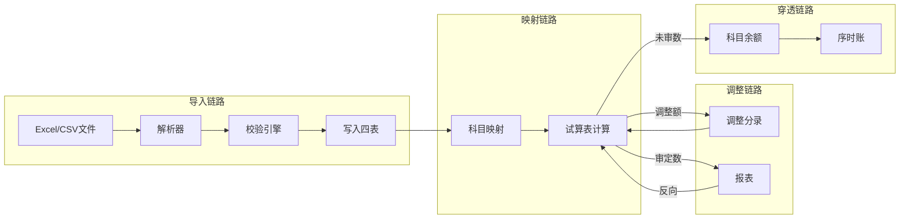
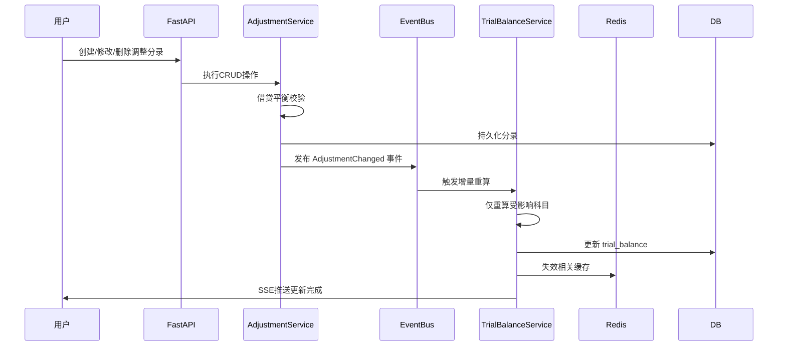
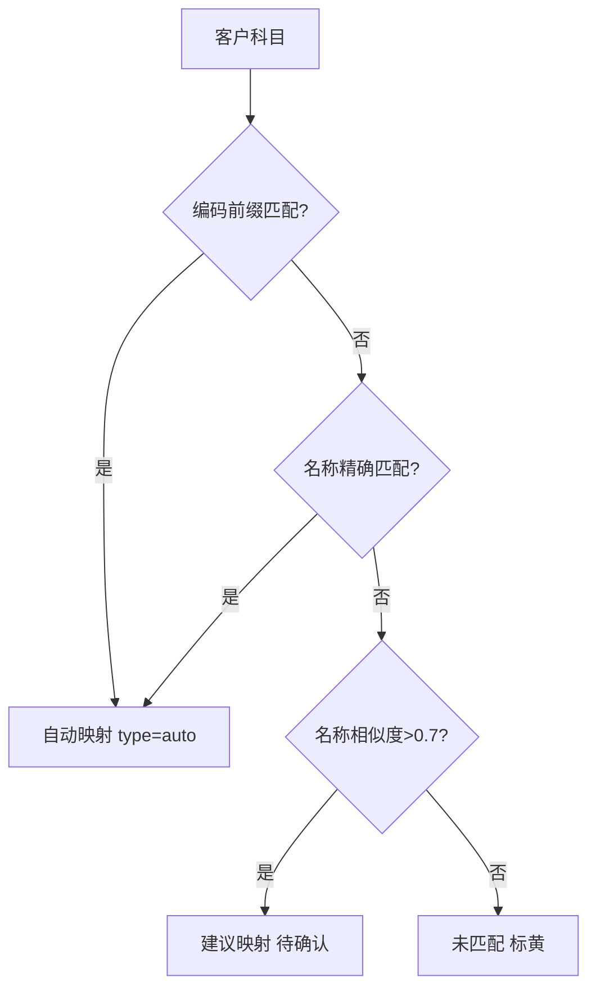
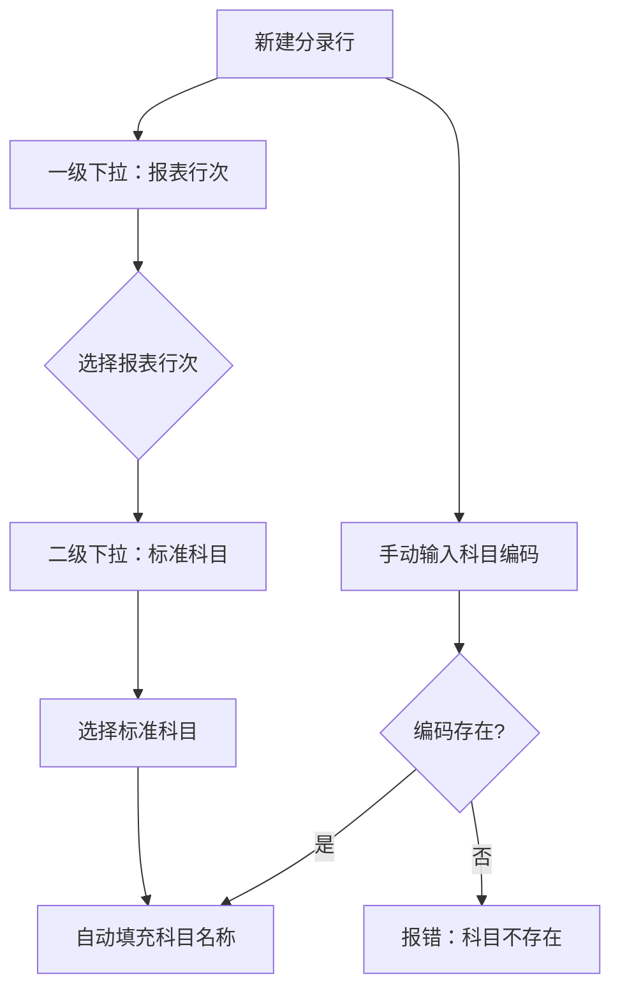
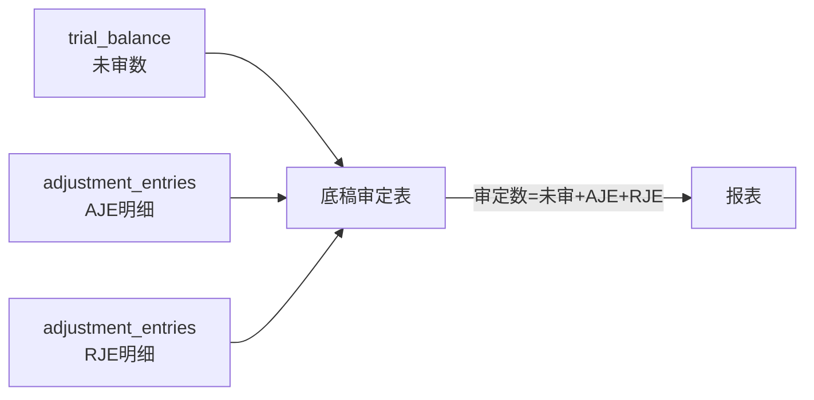
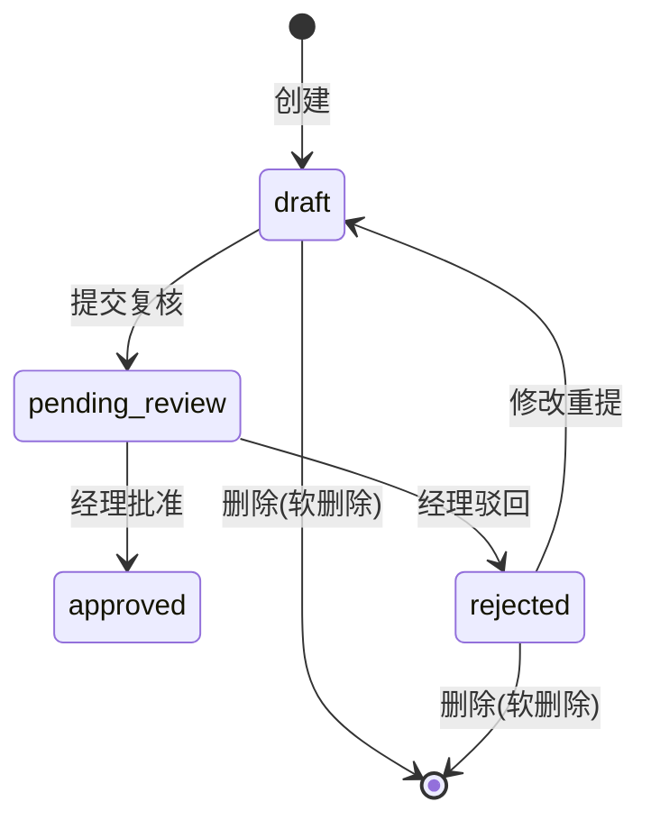
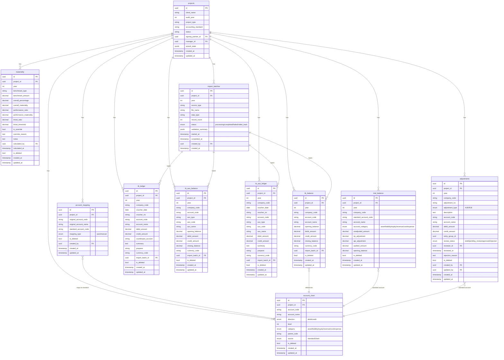
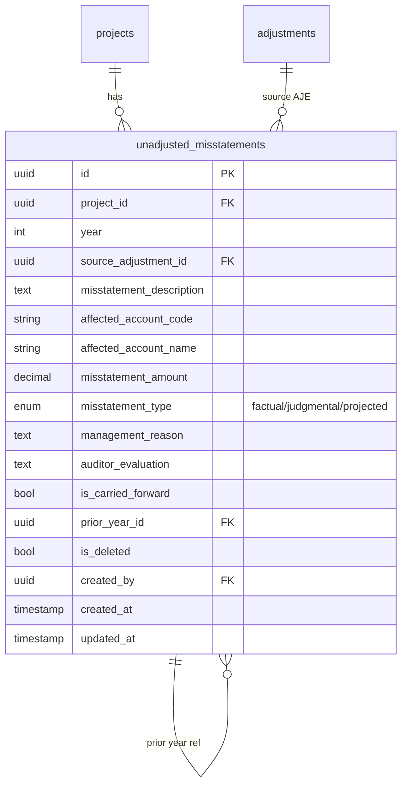

# 设计文档：第一阶段MVP核心 — 数据导入+科目映射+四表联动+试算表+调整分录+重要性水平

## 概述

本设计文档描述审计作业平台第一阶段MVP核心功能的技术架构与实现方案。目标是跑通单户审计项目的完整数据处理链路：**项目创建 → 科目导入 → 科目映射 → 数据导入校验 → 试算表生成 → 调整分录管理 → 重要性水平计算**，并实现全链路的双向联动穿透。

技术栈：FastAPI + PostgreSQL + Redis + Celery + Vue 3 + Pinia

本阶段依赖第零阶段已搭建的基础设施：PostgreSQL数据库、Redis缓存、FastAPI框架骨架、Vue 3前端骨架、JWT认证、RBAC权限框架。

### 核心设计原则

1. **事件驱动联动**：调整分录变更通过事件总线触发试算表级联更新，避免轮询
2. **异步优先**：数据导入、校验等耗时操作通过Celery异步执行，前端通过SSE获取进度
3. **增量计算**：试算表更新采用增量模式（仅重算受影响科目），全量重算作为兜底
4. **软删除+审计追踪**：所有业务数据软删除，关键操作记录操作人和时间戳
5. **穿透一致性**：从试算表到凭证的穿透路径无断点，所有金额可追溯

## 架构

### 整体架构

```mermaid
graph TB
    subgraph Frontend["前端 (Vue 3 + Pinia)"]
        PW[项目向导]
        TB[试算表视图]
        DT[四表穿透视图]
        AJ[调整分录管理]
        MT[重要性水平]
        IM[数据导入面板]
    end

    subgraph API["API层 (FastAPI)"]
        R1[/api/projects]
        R2[/api/import]
        R3[/api/mapping]
        R4[/api/drilldown]
        R5[/api/trial-balance]
        R6[/api/adjustments]
        R7[/api/materiality]
    end

    subgraph Services["服务层"]
        WS[WizardService]
        IS[ImportService]
        VE[ValidationEngine]
        MS[MappingService]
        DS[DrilldownService]
        TS[TrialBalanceService]
        AS[AdjustmentService]
        MTS[MaterialityService]
        EB[EventBus]
    end

    subgraph Async["异步任务 (Celery + Redis)"]
        IT[ImportTask]
        VT[ValidationTask]
        RT[RecalcTask]
    end

    subgraph Storage["存储层"]
        PG[(PostgreSQL)]
        RD[(Redis)]
    end

    Frontend --> API
    API --> Services
    Services --> EB
    EB --> Async
    Services --> PG
    Async --> PG
    Services --> RD
    Async --> RD
```

### 数据流架构



### 事件驱动联动机制




## 组件与接口

### 1. 项目初始化向导 (ProjectWizardService)

向导采用有限状态机模式管理步骤流转，每步完成后持久化数据，支持断点续做。

```python
class WizardStep(str, Enum):
    BASIC_INFO = "basic_info"
    ACCOUNT_IMPORT = "account_import"
    ACCOUNT_MAPPING = "account_mapping"
    MATERIALITY = "materiality"
    TEAM_ASSIGNMENT = "team_assignment"
    TEMPLATE_SET = "template_set"
    CONFIRMATION = "confirmation"

class ProjectWizardService:
    async def create_project(self, data: BasicInfoSchema) -> Project:
        """创建项目记录，状态=created，返回project_id"""

    async def get_wizard_state(self, project_id: UUID) -> WizardState:
        """获取向导当前状态（已完成步骤、当前步骤、各步骤数据）"""

    async def update_step(self, project_id: UUID, step: WizardStep, data: dict) -> WizardState:
        """更新指定步骤数据，校验必填字段，持久化"""

    async def validate_step(self, project_id: UUID, step: WizardStep) -> ValidationResult:
        """校验指定步骤是否满足前进条件"""

    async def confirm_project(self, project_id: UUID) -> Project:
        """确认创建，状态 created → planning"""
```

**步骤依赖关系**：basic_info → account_import → account_mapping → materiality（可并行team_assignment）→ template_set → confirmation

### 2. 数据导入引擎 (ImportService + Celery Task)

导入引擎采用异步任务架构，文件上传后立即返回task_id，通过SSE推送进度。

```python
class ImportService:
    async def start_import(self, project_id: UUID, file: UploadFile,
                           source_type: str, data_type: str) -> ImportBatch:
        """创建import_batch记录，提交Celery任务，返回batch_id"""

    async def get_import_progress(self, batch_id: UUID) -> ImportProgress:
        """从Redis读取实时进度"""

    async def rollback_import(self, batch_id: UUID) -> None:
        """按batch_id删除所有导入记录，状态→rolled_back"""

# Celery异步任务
@celery_app.task(bind=True)
def import_data_task(self, batch_id: str, file_path: str,
                     source_type: str, data_type: str):
    """
    执行流程：
    1. 解析文件（根据source_type选择解析器）
    2. 执行校验规则链
    3. 批量写入数据库（chunk_size=5000）
    4. 应用已有科目映射
    5. 触发试算表重算
    6. 更新进度到Redis
    """
```

**解析器工厂模式**：

```python
class ParserFactory:
    _parsers = {
        "yonyou": YonyouParser,
        "kingdee": KingdeeParser,
        "sap": SAPParser,
        "generic": GenericParser,
    }

    @classmethod
    def get_parser(cls, source_type: str) -> BaseParser:
        return cls._parsers[source_type]()
```

### 3. 校验引擎 (ValidationEngine)

校验规则采用责任链模式，每条规则独立执行，结果汇总。

```python
class ValidationEngine:
    def __init__(self):
        self.rules: list[ValidationRule] = [
            DebitCreditBalanceRule(),      # 借贷平衡（序时账）
            OpeningClosingRule(),          # 期初期末勾稽（余额表）
            AccountCompletenessRule(),     # 科目完整性
            YearConsistencyRule(),         # 年度一致性
            DuplicateDetectionRule(),      # 重复记录检测
            LedgerBalanceReconcileRule(),  # 账表勾稽
            AuxMainReconcileRule(),        # 辅助-主表勾稽
        ]

    async def validate(self, data: ImportData, context: ValidationContext) -> ValidationResult:
        """按顺序执行校验规则链，遇到阻断性错误(reject)立即停止"""
        results = []
        for rule in self.rules:
            if rule.applies_to(data.data_type):
                result = await rule.execute(data, context)
                results.append(result)
                if result.severity == "reject":
                    break
        return ValidationResult(rules=results)

class ValidationRule(ABC):
    severity: str  # "reject" | "warning"

    @abstractmethod
    def applies_to(self, data_type: str) -> bool: ...

    @abstractmethod
    async def execute(self, data: ImportData, context: ValidationContext) -> RuleResult: ...
```

**校验规则严重级别**：
- `reject`（阻断）：借贷不平衡、年度不匹配 → 拒绝整批导入
- `warning`（警告）：期初期末不勾稽、账表不勾稽 → 允许导入，记录日志

### 4. 科目映射引擎 (MappingService)

```python
class MappingService:
    async def auto_suggest(self, project_id: UUID) -> list[MappingSuggestion]:
        """
        自动匹配算法（按优先级）：
        1. 编码前缀精确匹配：客户科目编码前4位 == 标准科目编码
        2. 名称精确匹配：客户科目名称 == 标准科目名称
        3. 名称模糊匹配：Levenshtein距离 / Jaccard相似度 > 阈值(0.7)
        4. 未匹配：标记为待人工映射
        """

    async def save_mapping(self, project_id: UUID, mapping: MappingInput) -> AccountMapping:
        """保存单条映射关系"""

    async def batch_confirm(self, project_id: UUID, mappings: list[MappingInput]) -> MappingResult:
        """批量确认映射，返回完成率"""

    async def get_completion_rate(self, project_id: UUID) -> float:
        """映射完成率 = 已映射数 / 客户科目总数"""

    async def update_mapping(self, project_id: UUID, mapping_id: UUID,
                             new_standard_code: str) -> AccountMapping:
        """修改映射，触发试算表重算（旧标准科目+新标准科目）"""
```

**自动匹配算法流程**：



### 4a. 报表行次映射服务 (ReportLineMappingService)

```python
class ReportLineMappingService:
    async def ai_suggest_mappings(self, project_id: UUID) -> list[ReportLineMapping]:
        """
        AI自动匹配余额表科目→报表行次：
        1. 加载项目已确认的account_mapping（标准科目列表）
        2. 加载标准报表行次模板（资产负债表+利润表行次）
        3. 用LLM分析科目编码前缀+名称语义→匹配报表行次
        4. 保存建议到report_line_mapping，mapping_type=ai_suggested，is_confirmed=false
        5. 返回建议列表（含置信度分数）
        """

    async def confirm_mapping(self, mapping_id: UUID) -> ReportLineMapping:
        """人工确认单条映射"""

    async def batch_confirm(self, project_id: UUID, mapping_ids: list[UUID]) -> int:
        """批量确认映射"""

    async def reference_copy(self, source_company_code: str,
                              target_project_id: UUID) -> ReferenceCopyResult:
        """
        集团内企业一键参照：
        1. 查找同集团下source_company已确认的report_line_mapping
        2. 筛选target_project中也存在的standard_account_code
        3. 复制映射，mapping_type=reference_copied，is_confirmed=false
        4. 返回复制数量和未匹配科目列表
        """

    async def inherit_from_prior_year(self, prior_project_id: UUID,
                                       current_project_id: UUID) -> int:
        """跨年度继承：复制上年已确认映射到本年项目"""

    async def get_report_lines(self, project_id: UUID,
                                report_type: str) -> list[ReportLine]:
        """获取报表行次列表（供调整分录科目下拉使用）"""
```

### 5. 四表联动穿透查询 (DrilldownService)

```python
class DrilldownService:
    async def get_balance_list(self, project_id: UUID, year: int,
                               filters: BalanceFilter) -> Page[BalanceRow]:
        """科目余额表（分页+筛选），入口视图"""

    async def drill_to_ledger(self, project_id: UUID, year: int,
                               account_code: str, filters: LedgerFilter) -> Page[LedgerRow]:
        """穿透到序时账：按科目+日期范围+金额范围+摘要关键词筛选"""

    async def drill_to_aux_balance(self, project_id: UUID, year: int,
                                    account_code: str) -> list[AuxBalanceRow]:
        """穿透到辅助余额表：按辅助维度分组"""

    async def drill_to_aux_ledger(self, project_id: UUID, year: int,
                                   account_code: str, aux_type: str,
                                   aux_code: str) -> Page[AuxLedgerRow]:
        """穿透到辅助明细账"""
```

**SQL优化策略**：
- 复合索引覆盖查询：`(project_id, year, account_code)` 覆盖所有穿透查询
- 序时账额外索引：`(project_id, year, voucher_date, voucher_no)` 支持日期范围查询
- 分页采用 keyset pagination（基于voucher_date + id），避免大偏移量性能问题
- 辅助余额表索引：`(project_id, year, account_code, aux_type)` 支持维度分组

### 6. 试算表计算引擎 (TrialBalanceService)

```python
class TrialBalanceService:
    async def recalc_unadjusted(self, project_id: UUID, year: int,
                                 account_codes: list[str] | None = None) -> None:
        """
        重算未审数（增量或全量）
        - account_codes=None → 全量重算所有标准科目
        - account_codes=[...] → 仅重算指定科目
        SQL: SELECT standard_account_code, SUM(closing_balance)
             FROM tb_balance b JOIN account_mapping m
             ON b.account_code = m.original_account_code
             WHERE b.project_id = :pid AND b.year = :year
             GROUP BY m.standard_account_code
        """

    async def recalc_adjustments(self, project_id: UUID, year: int,
                                  account_codes: list[str] | None = None) -> None:
        """
        重算调整列（增量或全量）
        SQL: SELECT account_code, adjustment_type,
                    SUM(debit_amount) - SUM(credit_amount) as net
             FROM adjustments
             WHERE project_id = :pid AND year = :year
                   AND is_deleted = false
             GROUP BY account_code, adjustment_type
        """

    async def recalc_audited(self, project_id: UUID, year: int,
                              account_codes: list[str] | None = None) -> None:
        """审定数 = 未审数 + RJE + AJE，在数据库层面用UPDATE计算"""

    async def full_recalc(self, project_id: UUID, year: int) -> None:
        """全量重算：未审数 → 调整列 → 审定数，作为兜底"""

    async def check_consistency(self, project_id: UUID, year: int) -> ConsistencyReport:
        """数据一致性校验：未审数=映射汇总、调整列=分录汇总、审定数公式正确"""
```

**增量更新 vs 全量重算决策**：
- 单条调整分录CRUD → 增量更新（仅受影响的1-2个科目）
- 科目映射变更 → 增量更新（旧+新标准科目）
- 数据重新导入 → 全量重算
- 一致性校验发现差异 → 全量重算（一键修复）

**缓存策略**：
- Redis缓存试算表查询结果，key=`tb:{project_id}:{year}`，TTL=10min
- 任何写操作触发缓存失效
- 前端通过SSE接收更新通知，主动刷新

### 7. 调整分录管理 (AdjustmentService)

```python
class AdjustmentService:
    async def create_entry(self, project_id: UUID, data: AdjustmentCreate) -> AdjustmentGroup:
        """
        创建调整分录组：
        1. 校验借贷平衡
        2. 自动生成编号（AJE-001 / RJE-001）
        3. 校验每行科目编码存在于标准科目表
        4. 写入adjustments表（头信息）+ adjustment_entries表（明细行）
        5. 自动填充report_line_code（从report_line_mapping查找）
        6. 发布 AdjustmentChanged 事件
        """

    async def update_entry(self, entry_group_id: UUID, data: AdjustmentUpdate) -> AdjustmentGroup:
        """修改分录（仅draft/rejected状态可改）"""

    async def delete_entry(self, entry_group_id: UUID) -> None:
        """软删除分录（仅draft/rejected状态可删）"""

    async def change_review_status(self, entry_group_id: UUID,
                                    status: ReviewStatus, reason: str = None) -> None:
        """
        复核状态机：
        draft → pending_review（审计员提交）
        pending_review → approved（经理批准）
        pending_review → rejected（经理驳回，需填reason）
        rejected → draft（审计员修改后重新编辑）
        """

    async def get_summary(self, project_id: UUID, year: int) -> AdjustmentSummary:
        """汇总统计：AJE/RJE数量、金额、各状态计数"""

    async def get_account_dropdown(self, project_id: UUID,
                                    report_line_code: str = None) -> list[AccountOption]:
        """
        科目下拉选项：
        - report_line_code=None → 返回所有报表一级行次（供第一级下拉）
        - report_line_code=指定值 → 返回该行次下的标准科目（供第二级下拉）
        数据来源：report_line_mapping（已确认的）+ account_chart
        """

    async def get_wp_adjustment_summary(self, project_id: UUID, year: int,
                                         wp_code: str) -> WPAdjustmentSummary:
        """
        底稿审定表数据：
        1. 通过wp_code查找关联的audit_cycle
        2. 通过audit_cycle查找关联的standard_account_codes
        3. 汇总这些科目的所有AJE/RJE分录明细
        4. 返回：未审数 + 各笔AJE明细 + 各笔RJE明细 + 审定数
        """
```

**调整分录科目选择流程**：



**底稿审定表数据流**：



**复核状态机**：



### 8. 重要性水平计算 (MaterialityService)

```python
class MaterialityService:
    # 基准类型到试算表科目的映射
    BENCHMARK_MAPPING = {
        "pre_tax_profit": ["营业利润", "营业外收入", "营业外支出"],  # 利润总额
        "revenue": ["营业收入"],
        "total_assets": "SUM(asset)",  # 资产类科目合计
        "net_assets": "SUM(asset) - SUM(liability)",
    }

    async def calculate(self, project_id: UUID, params: MaterialityInput) -> MaterialityResult:
        """
        计算三级重要性水平：
        - 整体重要性 = 基准金额 × 百分比
        - 实际执行重要性 = 整体重要性 × 执行比例(默认50%-75%)
        - 明显微小错报 = 整体重要性 × 微小比例(默认5%)
        """

    async def auto_populate_benchmark(self, project_id: UUID,
                                       benchmark_type: str) -> Decimal:
        """从试算表自动取基准金额"""

    async def override(self, project_id: UUID, overrides: MaterialityOverride) -> MaterialityResult:
        """手动覆盖，记录覆盖原因"""

    async def get_change_history(self, project_id: UUID) -> list[MaterialityChange]:
        """获取重要性水平变更历史"""
```

### 9. 事件总线 (EventBus)

```python
class EventType(str, Enum):
    ADJUSTMENT_CREATED = "adjustment.created"
    ADJUSTMENT_UPDATED = "adjustment.updated"
    ADJUSTMENT_DELETED = "adjustment.deleted"
    MAPPING_CHANGED = "mapping.changed"
    DATA_IMPORTED = "data.imported"
    IMPORT_ROLLED_BACK = "import.rolled_back"
    MATERIALITY_CHANGED = "materiality.changed"

class EventBus:
    """进程内事件总线，基于asyncio实现"""

    async def publish(self, event_type: EventType, payload: dict) -> None:
        """发布事件"""

    def subscribe(self, event_type: EventType, handler: Callable) -> None:
        """注册事件处理器"""

# 事件处理器注册（应用启动时）
event_bus.subscribe(EventType.ADJUSTMENT_CREATED, trial_balance_service.on_adjustment_changed)
event_bus.subscribe(EventType.ADJUSTMENT_UPDATED, trial_balance_service.on_adjustment_changed)
event_bus.subscribe(EventType.ADJUSTMENT_DELETED, trial_balance_service.on_adjustment_changed)
event_bus.subscribe(EventType.MAPPING_CHANGED, trial_balance_service.on_mapping_changed)
event_bus.subscribe(EventType.DATA_IMPORTED, trial_balance_service.on_data_imported)
```


### 10. API接口设计

#### 10.1 项目向导 API

| 方法 | 路径 | 说明 |
|------|------|------|
| POST | `/api/projects` | 创建项目（基本信息） |
| GET | `/api/projects/{id}/wizard` | 获取向导状态 |
| PUT | `/api/projects/{id}/wizard/{step}` | 更新步骤数据 |
| POST | `/api/projects/{id}/wizard/validate/{step}` | 校验步骤 |
| POST | `/api/projects/{id}/wizard/confirm` | 确认创建 |

#### 10.2 科目表 API

| 方法 | 路径 | 说明 |
|------|------|------|
| GET | `/api/projects/{id}/account-chart/standard` | 获取标准科目表 |
| POST | `/api/projects/{id}/account-chart/import` | 导入客户科目表 |
| GET | `/api/projects/{id}/account-chart/client` | 获取客户科目表（树形） |

#### 10.3 科目映射 API

| 方法 | 路径 | 说明 |
|------|------|------|
| POST | `/api/projects/{id}/mapping/auto-suggest` | 自动匹配建议 |
| GET | `/api/projects/{id}/mapping` | 获取映射列表 |
| POST | `/api/projects/{id}/mapping` | 保存单条映射 |
| PUT | `/api/projects/{id}/mapping/{mapping_id}` | 修改映射 |
| POST | `/api/projects/{id}/mapping/batch-confirm` | 批量确认 |
| GET | `/api/projects/{id}/mapping/completion-rate` | 映射完成率 |

#### 10.3a 报表行次映射 API

| 方法 | 路径 | 说明 |
|------|------|------|
| POST | `/api/projects/{id}/report-line-mapping/ai-suggest` | AI自动匹配余额表→报表行次 |
| GET | `/api/projects/{id}/report-line-mapping` | 获取映射列表（支持按report_type筛选） |
| PUT | `/api/projects/{id}/report-line-mapping/{mid}/confirm` | 确认单条映射 |
| POST | `/api/projects/{id}/report-line-mapping/batch-confirm` | 批量确认 |
| POST | `/api/projects/{id}/report-line-mapping/reference-copy` | 集团内一键参照（body: source_company_code） |
| GET | `/api/projects/{id}/report-line-mapping/report-lines` | 获取报表行次列表（供调整分录下拉） |

#### 10.4 数据导入 API

| 方法 | 路径 | 说明 |
|------|------|------|
| POST | `/api/projects/{id}/import` | 上传文件启动导入 |
| GET | `/api/projects/{id}/import/{batch_id}/progress` | SSE进度推送 |
| GET | `/api/projects/{id}/import/batches` | 导入批次列表 |
| POST | `/api/projects/{id}/import/{batch_id}/rollback` | 回滚导入 |
| POST | `/api/projects/{id}/import/{batch_id}/duplicate-action` | 重复记录处理（skip/overwrite） |

#### 10.5 四表穿透 API

| 方法 | 路径 | 说明 |
|------|------|------|
| GET | `/api/projects/{id}/drilldown/balance` | 科目余额表（分页+筛选） |
| GET | `/api/projects/{id}/drilldown/ledger/{account_code}` | 穿透到序时账 |
| GET | `/api/projects/{id}/drilldown/aux-balance/{account_code}` | 穿透到辅助余额表 |
| GET | `/api/projects/{id}/drilldown/aux-ledger/{account_code}` | 穿透到辅助明细账 |

#### 10.6 试算表 API

| 方法 | 路径 | 说明 |
|------|------|------|
| GET | `/api/projects/{id}/trial-balance` | 获取试算表（四列结构） |
| POST | `/api/projects/{id}/trial-balance/recalc` | 手动触发全量重算 |
| GET | `/api/projects/{id}/trial-balance/consistency-check` | 数据一致性校验 |
| POST | `/api/projects/{id}/trial-balance/export` | 导出Excel |

#### 10.7 调整分录 API

| 方法 | 路径 | 说明 |
|------|------|------|
| GET | `/api/projects/{id}/adjustments` | 分录列表（支持type/status筛选） |
| POST | `/api/projects/{id}/adjustments` | 创建分录 |
| PUT | `/api/projects/{id}/adjustments/{group_id}` | 修改分录 |
| DELETE | `/api/projects/{id}/adjustments/{group_id}` | 删除分录（软删除） |
| POST | `/api/projects/{id}/adjustments/{group_id}/review` | 变更复核状态 |
| GET | `/api/projects/{id}/adjustments/summary` | 汇总统计 |
| GET | `/api/projects/{id}/adjustments/account-dropdown` | 科目下拉选项（?report_line_code=可选） |
| GET | `/api/projects/{id}/adjustments/wp-summary/{wp_code}` | 底稿审定表数据（该底稿关联科目的所有AJE/RJE明细） |

#### 10.8 重要性水平 API

| 方法 | 路径 | 说明 |
|------|------|------|
| GET | `/api/projects/{id}/materiality` | 获取当前重要性水平 |
| POST | `/api/projects/{id}/materiality/calculate` | 计算重要性水平 |
| PUT | `/api/projects/{id}/materiality/override` | 手动覆盖 |
| GET | `/api/projects/{id}/materiality/history` | 变更历史 |

### 11. 前端页面设计

#### 11.1 项目向导页面

六步引导式布局，顶部步骤条 + 中间内容区 + 底部导航按钮（上一步/下一步/确认）。

- **步骤1-基本信息**：表单（客户名称、审计年度、项目类型下拉、会计准则下拉、签字合伙人、项目经理）
- **步骤2-科目导入**：文件上传区 + 导入结果树形展示（按科目类别折叠）
- **步骤3-科目映射**：三栏布局（左-客户科目列表、中-映射状态、右-标准科目列表），未匹配项黄色高亮，支持拖拽映射
- **步骤4-重要性水平**：基准选择 + 参数输入 + 实时计算结果展示
- **步骤5-团队分工**：成员列表 + 审计循环分配矩阵
- **步骤6-确认**：所有配置汇总卡片，一键确认

#### 11.2 四表穿透页面

主从布局，左侧科目余额表为主表，右侧为穿透详情面板。

- 主表支持：科目类别筛选、层级筛选、关键词搜索
- 点击科目行 → 右侧展示序时账（有辅助核算的科目额外显示辅助余额表Tab）
- 序时账支持：日期范围、金额范围、凭证号、摘要关键词筛选
- 面包屑导航：余额表 > 序时账 > 辅助余额 > 辅助明细
- 返回时保持父视图滚动位置和筛选状态（Pinia store持久化）

#### 11.3 试算表页面

全屏表格布局，四列结构。

- 表头：科目编码 | 科目名称 | 未审数 | RJE调整 | AJE调整 | 审定数
- 按科目类别分组，每组有小计行
- 底部合计行 + 借贷平衡校验指示器（✓平衡 / ✗不平衡）
- 未审数可点击 → 跳转四表穿透
- RJE/AJE金额可点击 → 弹出调整分录明细列表
- 超过重要性水平的科目高亮标记
- 右上角：导出Excel按钮、全量重算按钮、一致性校验按钮

#### 11.4 调整分录页面

Tab切换（AJE / RJE / 全部）+ 分录列表 + 汇总面板。

- 新建分录：弹窗表单，动态行（借方/贷方行项），实时显示借贷差额
- 分录列表：编号、类型、摘要、金额、创建人、日期、复核状态（彩色标签）
- 复核操作：经理可批量审批/驳回
- 汇总面板：AJE/RJE数量、金额、各状态饼图


## 数据模型

### ER图（10张核心表）



### 索引策略

| 表 | 索引 | 类型 | 用途 |
|---|---|---|---|
| account_chart | (project_id, account_code, source) | UNIQUE | 科目唯一性 |
| account_mapping | (project_id, original_account_code) | UNIQUE | 映射唯一性 |
| tb_balance | (project_id, year, account_code) | COMPOSITE | 穿透查询+映射汇总 |
| tb_ledger | (project_id, year, voucher_date, voucher_no) | COMPOSITE | 日期范围查询 |
| tb_ledger | (project_id, year, account_code) | COMPOSITE | 科目穿透查询 |
| tb_aux_balance | (project_id, year, account_code, aux_type) | COMPOSITE | 辅助维度穿透 |
| tb_aux_ledger | (project_id, year, account_code, aux_type) | COMPOSITE | 辅助明细穿透 |
| adjustments | (project_id, year, adjustment_type) | COMPOSITE | 分录列表筛选 |
| adjustments | (project_id, entry_group_id) | COMPOSITE | 分录组查询 |
| trial_balance | (project_id, year, company_code, standard_account_code) | UNIQUE | 试算表唯一性 |
| materiality | (project_id, year) | UNIQUE | 重要性唯一性 |
| import_batches | (project_id, year) | COMPOSITE | 导入批次查询 |


## 正确性属性 (Correctness Properties)

*正确性属性是系统在所有有效执行中都应保持为真的特征或行为——本质上是关于系统应该做什么的形式化陈述。属性是人类可读规范与机器可验证正确性保证之间的桥梁。*

### Property 1: 试算表审定数公式不变量

*对于任意*标准科目，在任何数据修改（调整分录CRUD、科目映射变更、数据导入）之后，`audited_amount` 必须等于 `unadjusted_amount + rje_adjustment + aje_adjustment`。

**Validates: Requirements 6.5, 10.6**

### Property 2: 调整分录借贷平衡不变量

*对于任意*调整分录（AJE或RJE），在创建、修改、删除等所有CRUD操作之后，同一 `entry_group_id` 下所有行项的 `SUM(debit_amount)` 必须等于 `SUM(credit_amount)`。

**Validates: Requirements 7.2, 7.3, 7.13**

### Property 3: 科目映射往返一致性

*对于任意*已映射的客户科目，执行映射查找（original_account_code → standard_account_code）后，结果应返回保存时指定的标准科目编码，且多对一映射中每个客户科目都能独立解析到正确的标准科目。

**Validates: Requirements 3.8**

### Property 4: 未审数等于映射汇总

*对于任意*标准科目，试算表中的 `unadjusted_amount` 必须等于所有映射到该标准科目的客户科目在 `tb_balance` 中 `closing_balance` 的总和。

**Validates: Requirements 6.2**

### Property 5: 调整列等于分录汇总

*对于任意*标准科目，试算表中的 `rje_adjustment` 必须等于所有未删除的RJE类型分录中该科目的 `SUM(debit_amount) - SUM(credit_amount)`；`aje_adjustment` 同理适用于AJE类型分录。

**Validates: Requirements 6.3, 6.4**

### Property 6: 调整分录CRUD触发试算表增量更新

*对于任意*调整分录的创建、修改或删除操作，操作完成后试算表中受影响科目的调整列和审定数必须立即反映变更，且未受影响的科目保持不变。

**Validates: Requirements 10.1, 10.2, 10.3, 7.4, 7.11**

### Property 7: 凭证借贷平衡校验

*对于任意*序时账导入数据中的凭证（按 voucher_no + voucher_date 分组），如果该凭证的 `SUM(debit_amount) ≠ SUM(credit_amount)`，则校验引擎必须拒绝整批导入并返回包含该凭证信息的错误列表。

**Validates: Requirements 4.7, 4.8**

### Property 8: 期初期末勾稽校验

*对于任意*科目余额表中的账户，校验引擎必须验证：借方科目满足 `opening_balance + debit_amount - credit_amount = closing_balance`，贷方科目满足 `opening_balance - debit_amount + credit_amount = closing_balance`。不满足时标记警告但允许导入。

**Validates: Requirements 4.9, 4.10**

### Property 9: 导入数据年度一致性

*对于任意*导入请求，如果导入数据中的年度与项目审计年度不匹配，校验引擎必须拒绝导入并返回包含两个年度值的错误消息。

**Validates: Requirements 4.13, 4.14**

### Property 10: 重复记录检测

*对于任意*导入数据集，如果存在与已导入数据相同的 `voucher_no + voucher_date` 组合，校验引擎必须检测到重复并提示用户选择处理方式。

**Validates: Requirements 4.15**

### Property 11: 账表勾稽校验

*对于任意*同时拥有序时账和余额表数据的项目，按科目汇总的序时账借方/贷方发生额必须等于余额表中对应科目的借方/贷方发生额。不一致时标记警告。

**Validates: Requirements 4.17, 4.18**

### Property 12: 辅助-主表勾稽校验

*对于任意*同时拥有辅助余额表和主余额表数据的项目，按科目汇总的辅助余额必须等于主表中对应科目的余额。不一致时标记警告。

**Validates: Requirements 4.19, 4.20**

### Property 13: 导入回滚完整性

*对于任意*已完成的导入批次，执行回滚后，该批次的所有记录（通过 `import_batch_id` 关联）必须从所有受影响表中移除，且批次状态变为 `rolled_back`。

**Validates: Requirements 4.23**

### Property 14: 导入-导出往返一致性

*对于任意*成功导入并映射的数据，导出试算表后重新导入应产生等价的科目余额。

**Validates: Requirements 4.24**

### Property 15: 穿透查询数据过滤正确性

*对于任意*科目编码和筛选条件组合（日期范围、金额范围、凭证号、摘要关键词），穿透查询返回的序时账记录必须全部满足该科目编码且满足所有筛选条件，不遗漏也不多返回。

**Validates: Requirements 5.2, 5.7**

### Property 16: 辅助维度穿透正确性

*对于任意*具有辅助核算的科目，穿透到辅助余额表应返回该科目下所有辅助维度的汇总数据；进一步穿透到辅助明细账应返回匹配科目+维度值的所有明细记录。

**Validates: Requirements 5.3, 5.4**

### Property 17: 试算表分类小计正确性

*对于任意*试算表，每个科目类别（资产/负债/权益/收入/成本/费用）的小计行必须等于该类别下所有科目对应列金额的总和。

**Validates: Requirements 6.7**

### Property 18: 试算表借贷平衡校验

*对于任意*试算表，未审数列、RJE列、AJE列、审定数列各自的借方合计必须等于贷方合计（即所有资产类+费用类+成本类科目金额之和 = 所有负债类+权益类+收入类科目金额之和）。

**Validates: Requirements 6.8**

### Property 19: 复核状态机合法转换

*对于任意*调整分录，状态转换只允许以下路径：draft→pending_review、pending_review→approved、pending_review→rejected、rejected→draft。处于 approved 状态的分录不可编辑或删除；处于 pending_review 状态的分录不可编辑或删除。

**Validates: Requirements 7.6, 7.9, 7.10**

### Property 20: 复核元数据完整性

*对于任意*被批准的调整分录，`reviewer_id` 和 `reviewed_at` 必须非空；*对于任意*被驳回的调整分录，`rejection_reason` 必须非空。

**Validates: Requirements 7.7, 7.8**

### Property 21: 重要性水平计算公式

*对于任意*基准金额和百分比参数，重要性水平三级指标必须满足：`overall_materiality = benchmark_amount × overall_percentage`，`performance_materiality = overall_materiality × performance_ratio`，`trivial_threshold = overall_materiality × trivial_ratio`。

**Validates: Requirements 8.3, 8.5**

### Property 22: 重要性水平变更历史

*对于任意*重要性水平在初次确认后的修改，系统必须记录变更历史，包含修改前值、修改后值、变更原因、操作人和时间戳。

**Validates: Requirements 8.9**

### Property 23: 科目映射变更触发双向重算

*对于任意*科目映射变更（将客户科目从标准科目A重映射到标准科目B），试算表中标准科目A和标准科目B的未审数都必须被重新计算。

**Validates: Requirements 10.4, 3.7**

### Property 24: 映射完成率计算

*对于任意*项目的科目映射状态，映射完成率必须等于 `已映射科目数 / 客户科目总数 × 100%`，且有余额的未映射科目必须阻止向导前进。

**Validates: Requirements 3.5, 3.6**

### Property 25: 向导状态持久化与恢复

*对于任意*项目向导的已完成步骤，退出向导后重新进入应恢复所有已保存的步骤数据，且可以从最后未完成的步骤继续。

**Validates: Requirements 1.4, 1.5**

### Property 26: 数据一致性校验覆盖性

*对于任意*项目，数据一致性校验必须验证三个条件：(a) 试算表未审数 = 映射后余额汇总，(b) 试算表调整列 = 分录汇总，(c) 审定数公式正确。任何不一致必须报告差异的期望值和实际值。

**Validates: Requirements 10.8, 10.9**

### Property 27: 自动映射建议正确性

*对于任意*客户科目，如果其编码前缀与某标准科目编码匹配，或其名称与某标准科目名称的相似度超过阈值，则自动映射建议必须包含该标准科目作为候选。

**Validates: Requirements 3.1**

### Property 28: 科目完整性校验

*对于任意*导入的余额表数据，其中出现的每个科目编码必须存在于项目的科目表中（标准或客户科目表）。不存在的科目必须被加入待映射队列。

**Validates: Requirements 4.11, 4.12**

### Property 29: 报表行次映射AI建议覆盖性

*对于任意*已完成科目映射的项目，AI自动匹配后生成的报表行次映射建议必须覆盖所有有余额的标准科目，未匹配的科目必须标记为待人工映射。

**Validates: Requirements 3.10, 3.11**

### Property 30: 集团参照映射兼容性

*对于任意*集团内企业参照复制操作，只有源企业和目标企业都存在的标准科目编码才会被复制，目标企业独有的科目必须被标记为未匹配。

**Validates: Requirements 3.12, 3.13**

### Property 31: 调整分录科目标准化

*对于任意*调整分录明细行，standard_account_code 必须存在于项目的 `account_chart`（source=standard）中，不存在的科目编码必须被拒绝。

**Validates: Requirements 7.16**

### Property 32: 底稿审定表汇总一致性

*对于任意*底稿审定表，显示的审定数必须等于未审数 + 该底稿关联科目的所有AJE调整之和 + 所有RJE调整之和，且每笔调整明细的金额之和必须等于试算表中对应科目的调整列金额。

**Validates: Requirements 7.18, 7.19**

### Property 33: 未更正错报累计金额一致性

*对于任意*项目，未更正错报汇总视图中显示的累计总额必须等于所有未删除的 `unadjusted_misstatements` 记录的 `misstatement_amount` 之和。

**Validates: Requirements 11.3, 11.8**

### Property 34: 未更正错报超限预警

*对于任意*项目，当未更正错报累计金额 ≥ `materiality` 表中的 `overall_materiality` 时，系统必须显示保留/否定意见预警。

**Validates: Requirements 11.4**

### Property 35: 未更正错报评价完整性门控

*对于任意*项目从 completion 到 reporting 的状态转换，所有未更正错报记录的 `management_reason` 和 `auditor_evaluation` 必须非空。

**Validates: Requirements 11.7**


## 组件补充：未更正错报汇总管理 (UnadjustedMisstatementService)

```python
class UnadjustedMisstatementService:
    async def create_misstatement(self, project_id: UUID,
                                   data: MisstatementCreate) -> UnadjustedMisstatement:
        """创建未更正错报记录，可选关联被拒绝的AJE"""

    async def create_from_rejected_aje(self, project_id: UUID,
                                        adjustment_group_id: UUID) -> UnadjustedMisstatement:
        """从被拒绝的AJE自动创建未更正错报，预填充金额和科目信息"""

    async def get_summary(self, project_id: UUID, year: int) -> MisstatementSummary:
        """
        汇总视图：
        - 按类型分组（factual/judgmental/projected）+ 各类小计 + 总计
        - 与三级重要性水平对比
        - 超限预警标记
        """

    async def get_cumulative_amount(self, project_id: UUID, year: int) -> Decimal:
        """计算累计未更正错报金额"""

    async def check_materiality_threshold(self, project_id: UUID, year: int) -> ThresholdResult:
        """检查是否超过重要性水平，返回比较结果和预警信息"""

    async def carry_forward(self, source_project_id: UUID,
                             target_project_id: UUID, target_year: int) -> list[UnadjustedMisstatement]:
        """将上年未更正错报结转到新年度项目"""

    async def check_evaluation_completeness(self, project_id: UUID, year: int) -> bool:
        """检查所有记录的management_reason和auditor_evaluation是否已填写"""
```

### 未更正错报 API

| 方法 | 路径 | 说明 |
|------|------|------|
| GET | `/api/projects/{id}/unadjusted-misstatements` | 未更正错报列表 |
| POST | `/api/projects/{id}/unadjusted-misstatements` | 创建记录 |
| POST | `/api/projects/{id}/unadjusted-misstatements/from-aje/{group_id}` | 从被拒绝AJE创建 |
| PUT | `/api/projects/{id}/unadjusted-misstatements/{mid}` | 更新记录 |
| DELETE | `/api/projects/{id}/unadjusted-misstatements/{mid}` | 删除记录（软删除） |
| GET | `/api/projects/{id}/unadjusted-misstatements/summary` | 汇总视图 |

### 未更正错报数据模型




## 错误处理

### 错误分类与处理策略

| 错误类别 | 严重级别 | 处理方式 | 示例 |
|---------|---------|---------|------|
| 导入阻断错误 | CRITICAL | 拒绝整批导入，返回错误详情 | 凭证借贷不平衡、年度不匹配 |
| 导入警告 | WARNING | 允许导入，记录日志，标记异常 | 期初期末不勾稽、账表不勾稽 |
| 业务校验错误 | ERROR | 拒绝操作，返回具体原因 | 调整分录借贷不平衡、必填字段缺失 |
| 状态机违规 | ERROR | 拒绝操作，返回当前状态和允许的转换 | 修改已批准的分录 |
| 数据一致性异常 | WARNING | 标记异常，提供一键修复 | 试算表金额与分录汇总不一致 |
| 系统错误 | CRITICAL | 记录日志，返回友好错误信息 | 数据库连接失败、Celery任务异常 |

### 导入引擎错误处理

```python
class ImportError(Exception):
    """导入阻断错误，拒绝整批"""
    def __init__(self, error_type: str, details: list[dict]):
        self.error_type = error_type  # "debit_credit_imbalance" | "year_mismatch" | ...
        self.details = details

class ImportWarning:
    """导入警告，允许继续"""
    def __init__(self, warning_type: str, accounts: list[dict]):
        self.warning_type = warning_type
        self.accounts = accounts
```

### Celery任务失败处理

- 任务失败时更新 `import_batches.status = "failed"`
- 已写入的部分数据自动回滚（数据库事务）
- 通过Redis发布失败事件，前端SSE通知用户
- 支持手动重试（重新提交相同文件）

### API统一错误响应格式

```json
{
  "error": {
    "code": "DEBIT_CREDIT_IMBALANCE",
    "message": "凭证借贷不平衡",
    "details": [
      {
        "voucher_no": "PZ-2024-001",
        "voucher_date": "2024-01-15",
        "debit_total": 10000.00,
        "credit_total": 9500.00,
        "difference": 500.00
      }
    ]
  }
}
```

## 测试策略

### 双轨测试方法

本项目采用单元测试 + 属性测试（Property-Based Testing）双轨并行的测试策略：

- **单元测试**：验证具体示例、边界条件、错误处理
- **属性测试**：验证跨所有输入的通用属性，通过随机生成大量测试数据发现边界问题

两者互补：单元测试捕获具体bug，属性测试验证通用正确性。

### 属性测试库

- **后端（Python）**：使用 `hypothesis` 库
- **前端（TypeScript）**：使用 `fast-check` 库
- 每个属性测试最少运行 **100次迭代**
- 每个属性测试必须用注释引用设计文档中的属性编号
- 标签格式：**Feature: phase1a-core, Property {number}: {property_text}**

### 属性测试覆盖矩阵

| 属性编号 | 属性名称 | 测试模块 | 生成器 |
|---------|---------|---------|--------|
| Property 1 | 审定数公式不变量 | test_trial_balance.py | 随机科目+随机调整分录 |
| Property 2 | 调整分录借贷平衡 | test_adjustments.py | 随机金额的借贷行项 |
| Property 3 | 科目映射往返一致性 | test_mapping.py | 随机科目编码+名称对 |
| Property 4 | 未审数等于映射汇总 | test_trial_balance.py | 随机余额数据+映射关系 |
| Property 5 | 调整列等于分录汇总 | test_trial_balance.py | 随机AJE/RJE分录集 |
| Property 6 | CRUD触发增量更新 | test_cascade.py | 随机CRUD操作序列 |
| Property 7 | 凭证借贷平衡校验 | test_validation.py | 随机凭证数据（含平衡和不平衡） |
| Property 8 | 期初期末勾稽 | test_validation.py | 随机余额数据 |
| Property 9 | 年度一致性 | test_validation.py | 随机年度对 |
| Property 10 | 重复记录检测 | test_validation.py | 随机凭证号+日期组合 |
| Property 11 | 账表勾稽 | test_validation.py | 随机序时账+余额表 |
| Property 12 | 辅助-主表勾稽 | test_validation.py | 随机辅助余额+主余额 |
| Property 13 | 导入回滚完整性 | test_import.py | 随机导入数据 |
| Property 14 | 导入-导出往返 | test_import.py | 随机完整数据集 |
| Property 15 | 穿透查询过滤 | test_drilldown.py | 随机筛选条件 |
| Property 16 | 辅助维度穿透 | test_drilldown.py | 随机辅助维度数据 |
| Property 17 | 分类小计正确性 | test_trial_balance.py | 随机科目分类+金额 |
| Property 18 | 借贷平衡校验 | test_trial_balance.py | 随机试算表数据 |
| Property 19 | 复核状态机 | test_adjustments.py | 随机状态转换序列 |
| Property 20 | 复核元数据完整性 | test_adjustments.py | 随机复核操作 |
| Property 21 | 重要性水平计算 | test_materiality.py | 随机基准金额+百分比 |
| Property 22 | 变更历史记录 | test_materiality.py | 随机参数变更序列 |
| Property 23 | 映射变更双向重算 | test_cascade.py | 随机映射变更 |
| Property 24 | 映射完成率 | test_mapping.py | 随机映射状态 |
| Property 25 | 向导状态持久化 | test_wizard.py | 随机步骤数据 |
| Property 26 | 一致性校验覆盖 | test_consistency.py | 随机数据+人为注入不一致 |
| Property 27 | 自动映射建议 | test_mapping.py | 随机科目编码+名称 |
| Property 28 | 科目完整性校验 | test_validation.py | 随机科目编码集 |

### 单元测试重点

单元测试聚焦以下场景（属性测试不便覆盖的部分）：

1. **边界条件**：空文件导入、零余额科目、单行调整分录、极大金额（numeric(20,2)边界）
2. **具体示例**：用友U8格式解析、金蝶K3格式解析、SAP格式解析（各一个真实样本）
3. **错误路径**：文件格式错误、网络中断、数据库事务回滚
4. **集成测试**：完整流程（导入→映射→试算表→调整→重算）端到端验证
5. **API测试**：每个API端点的请求/响应格式、权限校验、参数校验

### 每个属性测试必须包含的注释

```python
# Feature: phase1a-core, Property 1: 试算表审定数公式不变量
@given(
    accounts=st.lists(st.builds(AccountFactory), min_size=1, max_size=50),
    adjustments=st.lists(st.builds(AdjustmentFactory), min_size=0, max_size=20),
)
@settings(max_examples=100)
def test_audited_amount_formula_invariant(accounts, adjustments):
    """对于任意标准科目，audited = unadjusted + rje + aje"""
    ...
```

