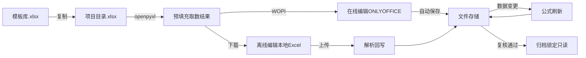
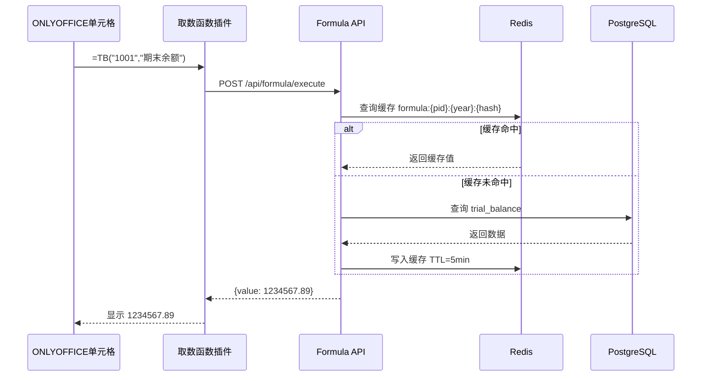
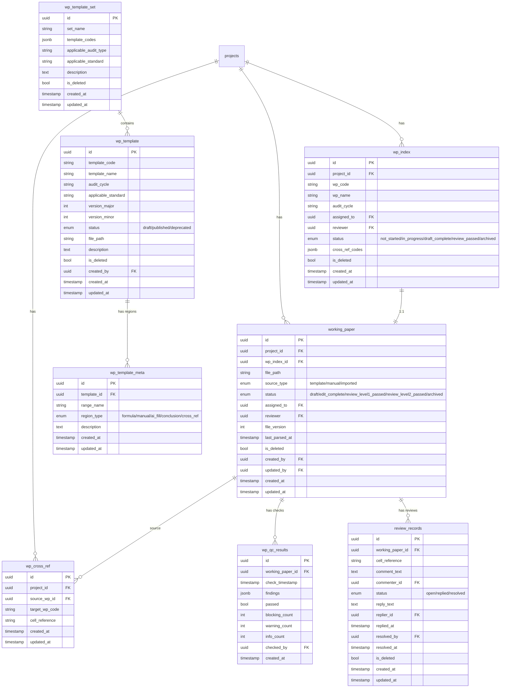
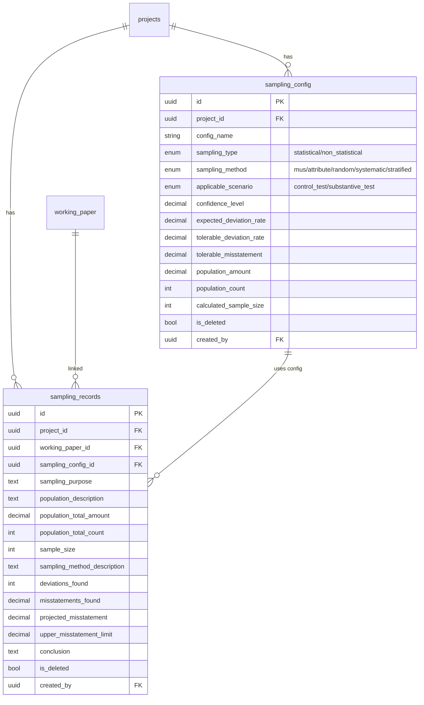

# 设计文档：第一阶段MVP底稿 — ONLYOFFICE集成+底稿模板引擎+底稿质量自检

## 概述

本设计文档描述审计作业平台第一阶段MVP底稿模块的技术架构与实现方案。核心目标是实现底稿的在线编辑、模板驱动的底稿生成、取数公式的实时执行、以及提交复核前的质量自检。

技术栈：FastAPI + PostgreSQL + Redis + openpyxl + ONLYOFFICE Document Server（WOPI协议）+ Vue 3

本阶段依赖Phase 0基础设施和Phase 1核心已实现的：试算表（`trial_balance`表）、调整分录（`adjustments`表）、科目映射（`account_mapping`表）、四表数据（`tb_balance`/`tb_aux_balance`等）、事件总线（EventBus）。

### 核心设计原则

1. **文件即底稿**：.xlsx/.docx文件是第一公民，数据库只存元数据索引，不存底稿内容
2. **公式驱动取数**：底稿中的数据通过取数公式从后端API实时获取，保证数据一致性
3. **在线/离线双模式**：在线走ONLYOFFICE实时编辑，离线走下载→本地编辑→上传，两种模式无缝切换
4. **规则引擎自检**：质量自检用确定性规则引擎实现（不依赖AI），保证检查结果可预测、可复现
5. **事件驱动联动**：数据变更（调整分录、试算表重算）通过事件总线触发底稿公式刷新

## 架构

### 整体架构

```mermaid
graph TB
    subgraph Frontend["前端 (Vue 3)"]
        WPL[底稿列表/索引]
        OO[ONLYOFFICE Editor iframe]
        QC[质量自检面板]
        TPL[模板管理]
    end

    subgraph API["API层 (FastAPI)"]
        WOPI[/wopi/files/]
        R1[/api/formula]
        R2[/api/working-papers]
        R3[/api/templates]
        R4[/api/qc]
    end

    subgraph Services["服务层"]
        WH[WOPIHostService]
        FE[FormulaEngine]
        TE[TemplateEngine]
        WPS[WorkingPaperService]
        QCE[QCEngine]
        PF[PrefillService]
        PS[ParseService]
    end

    subgraph External["外部服务"]
        OODS[ONLYOFFICE Document Server]
    end

    subgraph Storage["存储层"]
        PG[(PostgreSQL)]
        RD[(Redis)]
        FS[(文件系统)]
    end

    OO <-->|WOPI协议| WOPI
    OO <-->|自定义函数| R1
    Frontend --> API
    API --> Services
    WOPI --> WH
    WH --> FS
    FE --> PG
    FE --> RD
    TE --> FS
    WPS --> PG
    WPS --> FS
    QCE --> PG
    QCE --> FE
    PF --> FE
    PF --> FS
    PS --> FS
    PS --> PG
    OODS <-->|WOPI| WH
```

### 底稿文件生命周期



### 取数公式执行流程



## 组件与接口

### 1. 底稿模板引擎 (TemplateEngine)

```python
class TemplateEngine:
    async def upload_template(self, file: UploadFile, metadata: TemplateMetadata) -> WpTemplate:
        """
        上传模板文件：
        1. 保存文件到 templates/{template_code}/{version}/
        2. 用openpyxl解析Named Ranges，写入wp_template_meta
        3. 创建wp_template记录
        """

    async def get_template(self, template_code: str, version: str = "latest") -> WpTemplate:
        """获取模板（默认最新版本）"""

    async def create_version(self, template_code: str, file: UploadFile,
                              change_type: str) -> WpTemplate:
        """
        创建新版本：
        - change_type="major" → 主版本+1，次版本归0
        - change_type="minor" → 次版本+1
        """

    async def delete_template(self, template_id: UUID) -> None:
        """删除模板（校验无项目引用）"""

    async def get_template_sets(self) -> list[WpTemplateSet]:
        """获取所有模板集"""

    async def generate_project_workpapers(self, project_id: UUID,
                                           template_set_id: UUID) -> list[WorkingPaper]:
        """
        从模板集生成项目底稿：
        1. 遍历模板集中的所有模板
        2. 复制模板文件到项目目录
        3. 创建wp_index记录
        4. 创建working_paper记录
        5. 执行预填充
        """
```

**模板文件解析逻辑**：

```python
def parse_template_metadata(file_path: str) -> list[TemplateRegion]:
    """
    用openpyxl解析.xlsx模板文件：
    1. 读取所有Named Ranges
    2. 识别区域类型：
       - WP_CONCLUSION → conclusion（结论区）
       - WP_FORMULA_* → formula（取数公式区）
       - WP_MANUAL_* → manual（人工填写区）
       - WP_AI_* → ai_fill（AI填充区）
       - WP_XREF_* → cross_ref（交叉索引区）
    3. 返回区域列表
    """
```

### 2. 取数公式引擎 (FormulaEngine)

```python
class FormulaEngine:
    # 支持的公式类型
    FORMULA_TYPES = {
        "TB": TBExecutor,
        "WP": WPExecutor,
        "AUX": AUXExecutor,
        "PREV": PREVExecutor,
        "SUM_TB": SumTBExecutor,
    }

    async def execute(self, project_id: UUID, year: int,
                      formula_type: str, params: dict) -> FormulaResult:
        """
        执行取数公式：
        1. 检查Redis缓存
        2. 缓存未命中→调用对应Executor
        3. 写入缓存 TTL=5min
        4. 返回结果
        """

    async def batch_execute(self, project_id: UUID, year: int,
                             formulas: list[FormulaRequest]) -> list[FormulaResult]:
        """批量执行（预填充用），利用pipeline减少Redis往返"""

    async def invalidate_cache(self, project_id: UUID, year: int,
                                affected_accounts: list[str] = None) -> None:
        """
        缓存失效：
        - affected_accounts=None → 失效该项目年度所有缓存
        - affected_accounts=[...] → 仅失效涉及这些科目的公式缓存
        """

class TBExecutor:
    """TB(account_code, column_name) → 从trial_balance取数"""
    COLUMN_MAPPING = {
        "期末余额": "audited_amount",
        "未审数": "unadjusted_amount",
        "AJE调整": "aje_adjustment",
        "RJE调整": "rje_adjustment",
        "年初余额": "opening_balance",
    }

    async def execute(self, project_id: UUID, year: int,
                      account_code: str, column_name: str) -> Decimal:
        """SQL: SELECT {column} FROM trial_balance WHERE project_id=:pid AND year=:year AND standard_account_code=:code"""

class WPExecutor:
    """WP(wp_code, cell_ref) → 从其他底稿取值"""
    async def execute(self, project_id: UUID, year: int,
                      wp_code: str, cell_ref: str) -> Any:
        """
        1. 查working_paper表获取file_path
        2. openpyxl打开文件读取指定单元格
        3. 返回值
        """

class AUXExecutor:
    """AUX(account_code, aux_dimension, dimension_value, column_name) → 从辅助余额表取数"""
    async def execute(self, project_id: UUID, year: int,
                      account_code: str, aux_type: str,
                      aux_name: str, column_name: str) -> Decimal:
        """SQL: SELECT {column} FROM tb_aux_balance WHERE project_id=:pid AND year=:year AND account_code=:code AND aux_type=:type AND aux_name=:name"""

class PREVExecutor:
    """PREV(formula) → 用year-1执行内部公式"""
    async def execute(self, project_id: UUID, year: int,
                      inner_formula: FormulaRequest) -> Any:
        """递归调用FormulaEngine.execute，year参数减1"""

class SumTBExecutor:
    """SUM_TB(account_range, column_name) → 科目范围汇总"""
    async def execute(self, project_id: UUID, year: int,
                      account_range: str, column_name: str) -> Decimal:
        """
        解析范围 "6001~6099"
        SQL: SELECT SUM({column}) FROM trial_balance
             WHERE project_id=:pid AND year=:year
             AND standard_account_code >= :start AND standard_account_code <= :end
        """
```

### 3. WOPI Host服务 (WOPIHostService)

```python
class WOPIHostService:
    async def check_file_info(self, file_id: UUID, access_token: str) -> FileInfo:
        """
        WOPI CheckFileInfo：
        返回文件元数据（BaseFileName, Size, OwnerId, Version,
        UserCanWrite, UserCanNotWriteRelative, SupportsLocks）
        """

    async def get_file(self, file_id: UUID, access_token: str) -> bytes:
        """WOPI GetFile：返回文件二进制内容"""

    async def put_file(self, file_id: UUID, access_token: str,
                       content: bytes, lock_id: str = None) -> None:
        """
        WOPI PutFile：
        1. 校验锁状态
        2. 写入文件到项目目录
        3. 递增file_version
        4. 更新working_paper.updated_at
        """

    async def lock(self, file_id: UUID, lock_id: str) -> None:
        """WOPI Lock：获取排他锁"""

    async def unlock(self, file_id: UUID, lock_id: str) -> None:
        """WOPI Unlock：释放锁"""

    async def refresh_lock(self, file_id: UUID, lock_id: str) -> None:
        """WOPI RefreshLock：延长锁超时"""

    def generate_access_token(self, user_id: UUID, project_id: UUID,
                               file_id: UUID) -> str:
        """生成WOPI访问令牌（JWT，含user_id+project_id+file_id+过期时间）"""

    def validate_access_token(self, token: str) -> TokenPayload:
        """校验WOPI访问令牌"""
```

**WOPI锁管理**：
- 锁存储在Redis中，key=`wopi:lock:{file_id}`，value=lock_id，TTL=30min
- Lock操作：如果无锁或锁已过期→设置新锁；如果已有不同lock_id的锁→返回409
- Unlock操作：校验lock_id匹配→删除锁
- RefreshLock操作：校验lock_id匹配→重置TTL

### 4. 预填充服务 (PrefillService)

```python
class PrefillService:
    async def prefill_workpaper(self, project_id: UUID, year: int,
                                 wp_id: UUID) -> None:
        """
        预填充单个底稿：
        1. 用openpyxl打开.xlsx文件
        2. 扫描所有单元格，识别取数公式（TB/WP/AUX/PREV/SUM_TB）
        3. 批量调用FormulaEngine.batch_execute获取所有公式结果
        4. 将结果写入对应单元格（保留公式文本在批注中）
        5. 保存文件
        """

    async def prefill_project(self, project_id: UUID, year: int) -> PrefillReport:
        """批量预填充项目所有底稿"""

    def _scan_formulas(self, wb: Workbook) -> list[FormulaCell]:
        """
        扫描工作簿中的取数公式：
        正则匹配 =TB(...)、=WP(...)、=AUX(...)、=PREV(...)、=SUM_TB(...)
        返回 [(sheet, cell_ref, formula_type, params), ...]
        """
```

### 5. 解析回写服务 (ParseService)

```python
class ParseService:
    async def parse_workpaper(self, project_id: UUID, wp_id: UUID,
                               file_path: str) -> ParseResult:
        """
        解析上传的底稿文件：
        1. 用openpyxl打开.xlsx
        2. 读取wp_template_meta获取区域定义
        3. 提取人工填写区域（manual类型Named Range）的值
        4. 提取结论区（WP_CONCLUSION）的文本
        5. 扫描WP()函数调用，更新wp_cross_ref表
        6. 更新working_paper.last_parsed_at
        7. 返回提取的结构化数据
        """

    async def detect_conflicts(self, project_id: UUID, wp_id: UUID,
                                uploaded_file: bytes,
                                recorded_version: int) -> ConflictReport:
        """
        冲突检测（离线编辑上传时）：
        1. 比对uploaded_file版本号 vs working_paper.file_version
        2. 如果版本不匹配，逐单元格比对差异
        3. 返回冲突单元格列表（cell_ref, local_value, server_value）
        """
```

### 6. 底稿管理服务 (WorkingPaperService)

```python
class WorkingPaperService:
    async def list_workpapers(self, project_id: UUID,
                               filters: WPFilter = None) -> list[WorkingPaperInfo]:
        """获取项目底稿列表（支持按循环、状态、编制人筛选）"""

    async def get_workpaper(self, wp_id: UUID) -> WorkingPaperDetail:
        """获取底稿详情（含索引信息、文件信息、QC状态）"""

    async def download_for_offline(self, wp_id: UUID) -> tuple[bytes, int]:
        """
        下载底稿（离线编辑）：
        1. 执行预填充
        2. 返回文件内容 + 当前file_version
        """

    async def upload_offline_edit(self, wp_id: UUID, file: UploadFile,
                                   recorded_version: int) -> UploadResult:
        """
        上传离线编辑的底稿：
        1. 冲突检测
        2. 无冲突→替换文件、解析回写、递增版本
        3. 有冲突→返回冲突报告
        """

    async def update_status(self, wp_id: UUID, new_status: str) -> WorkingPaper:
        """更新底稿状态"""

    async def assign_workpaper(self, wp_id: UUID, assigned_to: UUID,
                                reviewer: UUID = None) -> WorkingPaper:
        """分配编制人和复核人"""
```

### 7. 质量自检引擎 (QCEngine)

```python
class QCEngine:
    def __init__(self):
        self.rules: list[QCRule] = [
            # 阻断级
            ConclusionNotEmptyRule(),       # Rule 1: 结论区已填写
            AIFillConfirmedRule(),           # Rule 2: AI填充区全部确认
            FormulaConsistencyRule(),        # Rule 3: 取数公式一致性
            # 警告级
            ManualInputCompleteRule(),       # Rule 4: 人工填写区完整
            SubtotalAccuracyRule(),          # Rule 5: 内部合计数正确
            CrossRefConsistencyRule(),       # Rule 6: 交叉索引一致性
            IndexRegistrationRule(),         # Rule 7: 索引表登记
            CrossRefExistsRule(),            # Rule 8: 引用底稿存在
            AuditProcedureStatusRule(),      # Rule 9: 审计程序执行状态
            SamplingCompletenessRule(),      # Rule 10: 抽样记录完整
            AdjustmentRecordedRule(),        # Rule 11: 调整事项已录入
            # 提示级
            PreparationDateRule(),           # Rule 12: 编制日期合理
        ]

    async def check(self, wp_id: UUID) -> QCResult:
        """
        执行所有检查规则：
        1. 加载底稿文件和元数据
        2. 按顺序执行每条规则
        3. 汇总结果，按严重级别排序
        4. 存储到wp_qc_results表
        5. 返回结果
        """

    async def get_project_summary(self, project_id: UUID) -> QCSummary:
        """项目级QC汇总统计"""

class QCRule(ABC):
    severity: str  # "blocking" | "warning" | "info"
    rule_id: str   # "QC-01" ~ "QC-12"

    @abstractmethod
    async def check(self, context: QCContext) -> list[QCFinding]: ...

class QCContext:
    """QC检查上下文，包含底稿文件、元数据、项目数据等"""
    workbook: Workbook          # openpyxl工作簿对象
    template_meta: list[TemplateRegion]  # 区域定义
    wp_index: WpIndex           # 底稿索引
    working_paper: WorkingPaper # 底稿元数据
    project_id: UUID
    year: int
    formula_engine: FormulaEngine
```

### 8. API接口设计

#### 8.1 底稿模板 API

| 方法 | 路径 | 说明 |
|------|------|------|
| POST | `/api/templates` | 上传模板文件 |
| GET | `/api/templates` | 模板列表（支持按循环、准则筛选） |
| GET | `/api/templates/{code}` | 获取模板详情（默认最新版本） |
| POST | `/api/templates/{code}/versions` | 创建新版本 |
| DELETE | `/api/templates/{id}` | 删除模板（校验无引用） |
| GET | `/api/template-sets` | 模板集列表 |
| GET | `/api/template-sets/{id}` | 模板集详情 |

#### 8.2 取数公式 API

| 方法 | 路径 | 说明 |
|------|------|------|
| POST | `/api/formula/execute` | 执行单个公式 |
| POST | `/api/formula/batch-execute` | 批量执行公式（预填充用） |

#### 8.3 WOPI协议 API

| 方法 | 路径 | 说明 |
|------|------|------|
| GET | `/wopi/files/{file_id}` | CheckFileInfo |
| GET | `/wopi/files/{file_id}/contents` | GetFile |
| POST | `/wopi/files/{file_id}/contents` | PutFile |
| POST | `/wopi/files/{file_id}` | Lock/Unlock/RefreshLock（通过X-WOPI-Override头区分） |

#### 8.4 底稿管理 API

| 方法 | 路径 | 说明 |
|------|------|------|
| GET | `/api/projects/{id}/working-papers` | 底稿列表（支持筛选） |
| GET | `/api/projects/{id}/working-papers/{wp_id}` | 底稿详情 |
| POST | `/api/projects/{id}/working-papers/generate` | 从模板集生成底稿 |
| GET | `/api/projects/{id}/working-papers/{wp_id}/download` | 下载底稿（含预填充） |
| POST | `/api/projects/{id}/working-papers/{wp_id}/upload` | 上传离线编辑的底稿 |
| PUT | `/api/projects/{id}/working-papers/{wp_id}/status` | 更新底稿状态 |
| PUT | `/api/projects/{id}/working-papers/{wp_id}/assign` | 分配编制人/复核人 |
| POST | `/api/projects/{id}/working-papers/{wp_id}/prefill` | 手动触发预填充 |
| POST | `/api/projects/{id}/working-papers/{wp_id}/parse` | 手动触发解析回写 |
| GET | `/api/projects/{id}/wp-index` | 底稿索引列表 |
| GET | `/api/projects/{id}/wp-cross-refs` | 交叉索引关系 |

#### 8.5 质量自检 API

| 方法 | 路径 | 说明 |
|------|------|------|
| POST | `/api/projects/{id}/working-papers/{wp_id}/qc-check` | 执行质量自检 |
| GET | `/api/projects/{id}/working-papers/{wp_id}/qc-results` | 获取自检结果 |
| GET | `/api/projects/{id}/qc-summary` | 项目级QC汇总 |

#### 8.6 复核批注 API

| 方法 | 路径 | 说明 |
|------|------|------|
| GET | `/api/working-papers/{wp_id}/reviews` | 获取复核意见列表 |
| POST | `/api/working-papers/{wp_id}/reviews` | 添加复核意见 |
| PUT | `/api/working-papers/{wp_id}/reviews/{review_id}/reply` | 回复复核意见 |
| PUT | `/api/working-papers/{wp_id}/reviews/{review_id}/resolve` | 标记为已解决 |

### 9. 前端页面设计

#### 9.1 底稿列表页面

主从布局：左侧底稿索引树（按审计循环分组）+ 右侧底稿详情/操作面板。

- 索引树按循环分组：B类（穿行测试）→ C类（控制测试）→ D-N类（实质性程序）
- 每个底稿节点显示：编号、名称、状态标签（彩色）、编制人头像
- 右侧面板：底稿基本信息、操作按钮（在线编辑/下载/上传/自检/提交复核）
- 顶部筛选栏：按循环、状态、编制人筛选

#### 9.2 ONLYOFFICE编辑器页面

全屏布局，ONLYOFFICE Editor通过iframe嵌入。

- 顶部工具栏：底稿编号+名称、状态标签、保存状态指示器、返回按钮
- 右侧可折叠侧边栏：复核批注面板（ONLYOFFICE插件）
- 底部状态栏：编制人、复核人、最后修改时间、文件版本号
- ONLYOFFICE不可用时自动切换为下载/上传模式

#### 9.3 质量自检结果页面

弹窗/侧边栏展示，按严重级别分组。

- 阻断级：红色背景，必须全部解决
- 警告级：黄色背景，可选解决
- 提示级：灰色背景，仅供参考
- 每条finding显示：规则编号、描述、涉及单元格（可点击定位）、期望值/实际值
- 底部操作：全部通过→提交复核按钮；有阻断→提交按钮禁用

#### 9.4 模板管理页面

表格布局，管理员可见。

- 模板列表：编号、名称、循环、版本号、状态、操作（上传新版本/查看/删除）
- 模板集管理：模板集名称、包含模板数量、适用类型、操作（编辑/查看）

## 数据模型

### ER图（8张新增表）



### 索引策略

| 表 | 索引 | 类型 | 用途 |
|---|---|---|---|
| wp_template | (template_code, version_major, version_minor) | UNIQUE | 模板版本唯一性 |
| wp_template_meta | (template_id) | COMPOSITE | 模板区域查询 |
| wp_index | (project_id, wp_code) | UNIQUE | 底稿编号唯一性 |
| working_paper | (project_id, wp_index_id) | UNIQUE | 底稿-索引一对一 |
| wp_cross_ref | (project_id, source_wp_id) | COMPOSITE | 交叉索引查询 |
| wp_qc_results | (working_paper_id) | COMPOSITE | QC结果查询 |
| review_records | (working_paper_id, status) | COMPOSITE | 复核意见查询 |

## 正确性属性 (Correctness Properties)

### Property 1: 取数公式确定性执行

*对于任意*有效的取数公式（TB/WP/AUX/PREV/SUM_TB），在底层数据未变更的情况下，连续两次执行同一公式必须返回完全相同的结果。

**Validates: Requirements 2.10**

### Property 2: TB函数取数一致性

*对于任意*有效的科目代码和列名组合，`TB(account_code, column_name)` 返回的值必须等于 `trial_balance` 表中对应记录的对应列值。

**Validates: Requirements 2.2**

### Property 3: SUM_TB范围汇总正确性

*对于任意*科目代码范围 "start~end"，`SUM_TB(range, column_name)` 返回的值必须等于范围内所有科目对应列值的总和。

**Validates: Requirements 2.6**

### Property 4: PREV函数年度偏移正确性

*对于任意*内部公式，`PREV(formula)` 的执行结果必须等于将内部公式的 year 参数减1后执行的结果。

**Validates: Requirements 2.5**

### Property 5: 公式缓存一致性

*对于任意*公式执行，缓存命中时返回的值必须等于绕过缓存直接计算的值。当底层数据变更后，相关缓存必须被失效。

**Validates: Requirements 2.8**

### Property 6: WOPI文件版本单调递增

*对于任意*PutFile操作序列，`working_paper.file_version` 必须严格单调递增，且每次PutFile后版本号恰好增加1。

**Validates: Requirements 3.7**

### Property 7: WOPI锁互斥性

*对于任意*文件，同一时刻最多只有一个有效的锁。如果文件已被lock_id_A锁定，则使用lock_id_B的Lock请求必须返回409 Conflict。

**Validates: Requirements 3.3**

### Property 8: 预填充-解析往返一致性

*对于任意*底稿文件，执行预填充（公式→静态值）后再执行解析回写，提取的人工填写区域值必须与预填充前的人工填写区域值完全一致（预填充不影响人工填写区）。

**Validates: Requirements 7.5**

### Property 9: 离线编辑版本冲突检测

*对于任意*离线编辑上传，如果上传时携带的 recorded_version 小于数据库中的 file_version，系统必须检测到冲突并返回冲突报告。如果版本匹配，则上传成功。

**Validates: Requirements 7.2, 7.3, 7.4**

### Property 10: QC阻断规则阻止提交

*对于任意*底稿，如果QC检查结果中存在任何 severity="blocking" 的finding，则该底稿不允许被提交复核（状态不能从 draft 变为 edit_complete 或更高）。

**Validates: Requirements 8.3**

### Property 11: QC结论区检查正确性

*对于任意*底稿，如果结论区（Named Range `WP_CONCLUSION`）为空或仅含空白字符，则QC Rule 1必须报告阻断级finding；如果结论区有非空白内容，则Rule 1不报告finding。

**Validates: Requirements 8.1 Rule 1**

### Property 12: QC公式一致性检查正确性

*对于任意*底稿中的取数公式单元格，如果单元格当前值与FormulaEngine实时计算结果的差异绝对值超过0.01，则QC Rule 3必须报告阻断级finding。

**Validates: Requirements 8.1 Rule 3**

### Property 13: QC交叉索引检查正确性

*对于任意*底稿中的WP()公式，如果引用的底稿编号不存在于项目wp_index中，则QC Rule 8必须报告警告级finding。

**Validates: Requirements 8.1 Rule 8**

### Property 14: 模板版本不可删除性

*对于任意*已被项目底稿引用的模板版本，删除操作必须被拒绝并返回错误。

**Validates: Requirements 1.4**

### Property 15: 底稿生成完整性

*对于任意*模板集，从模板集生成项目底稿后，生成的wp_index记录数必须等于模板集中的模板数量，且每个模板都有对应的working_paper记录和项目目录中的文件。

**Validates: Requirements 1.8, 6.2, 6.3**

### Property 16: 项目级QC汇总一致性

*对于任意*项目，QC汇总中的 total_workpapers 必须等于 wp_index 中的记录数，passed_qc + has_blocking + not_checked 必须等于 total_workpapers - not_started，pass_rate 计算公式正确。

**Validates: Requirements 9.1**

### Property 17: 复核意见状态机合法转换

*对于任意*复核意见，状态转换只允许：open→replied（审计员回复）、open→resolved（经理直接解决）、replied→resolved（经理确认解决）。不允许从resolved回退。

**Validates: Requirements 5.2, 5.3, 5.4**

### Property 18: 公式错误处理正确性

*对于任意*引用不存在科目或未映射科目的公式，FormulaEngine必须返回包含 "FORMULA_ERROR" 代码和描述性消息的错误对象，而不是抛出异常或返回空值。

**Validates: Requirements 2.7**

### Property 19: 抽样样本量计算正确性

*对于任意*抽样配置参数（置信水平、可容忍偏差率/错报、预期偏差率、总体金额/数量），自动计算的样本量必须符合对应抽样方法的标准公式。

**Validates: Requirements 11.2**

### Property 20: 抽样记录完整性校验

*对于任意*关联了抽样程序的底稿，其 `sampling_records` 必须包含非空的 sampling_purpose、population_description、sample_size 和 conclusion，否则 QC Rule 10 必须报告警告。

**Validates: Requirements 11.5**

### Property 21: MUS错报推断计算正确性

*对于任意*MUS抽样结果，projected_misstatement 和 upper_misstatement_limit 必须基于样本中发现的错报金额和污染因子按MUS评价公式正确计算。

**Validates: Requirements 11.4**


## 组件补充：抽样管理服务 (SamplingService)

```python
class SamplingService:
    async def create_config(self, project_id: UUID,
                             data: SamplingConfigCreate) -> SamplingConfig:
        """创建抽样配置，自动计算样本量"""

    async def calculate_sample_size(self, method: str, params: dict) -> int:
        """
        根据抽样方法计算样本量：
        - attribute: confidence_factor / tolerable_deviation_rate (调整预期偏差率和总体)
        - mus: population_amount × confidence_factor / tolerable_misstatement
        - random/systematic: 用户指定或基于置信水平计算
        """

    async def create_record(self, project_id: UUID,
                             data: SamplingRecordCreate) -> SamplingRecord:
        """创建抽样记录，关联底稿和抽样配置"""

    async def calculate_mus_evaluation(self, record_id: UUID,
                                        misstatement_details: list[dict]) -> MUSEvaluation:
        """MUS评价：计算projected_misstatement和upper_misstatement_limit"""

    async def check_completeness(self, working_paper_id: UUID) -> bool:
        """检查底稿关联的抽样记录是否完整（供QC Rule 10调用）"""
```

### 抽样管理 API

| 方法 | 路径 | 说明 |
|------|------|------|
| GET | `/api/projects/{id}/sampling-configs` | 抽样配置列表 |
| POST | `/api/projects/{id}/sampling-configs` | 创建抽样配置 |
| PUT | `/api/projects/{id}/sampling-configs/{cid}` | 更新抽样配置 |
| POST | `/api/projects/{id}/sampling-configs/calculate` | 计算样本量 |
| GET | `/api/projects/{id}/sampling-records` | 抽样记录列表 |
| POST | `/api/projects/{id}/sampling-records` | 创建抽样记录 |
| PUT | `/api/projects/{id}/sampling-records/{rid}` | 更新抽样记录 |
| POST | `/api/projects/{id}/sampling-records/{rid}/mus-evaluate` | MUS评价计算 |

### 抽样数据模型




## 错误处理

### 错误分类与处理策略

| 错误类别 | 严重级别 | 处理方式 | 示例 |
|---------|---------|---------|------|
| 公式执行错误 | WARNING | 单元格显示#REF!，tooltip显示原因 | 科目不存在、映射缺失 |
| WOPI锁冲突 | ERROR | 返回409，前端提示文件被占用 | 另一用户正在编辑 |
| ONLYOFFICE不可用 | WARNING | 自动降级为离线模式 | ONLYOFFICE服务宕机 |
| 文件解析失败 | ERROR | 拒绝上传，提示文件损坏 | .xlsx文件格式错误 |
| 版本冲突 | WARNING | 展示单元格级差异，用户选择 | 离线编辑期间他人修改 |
| QC阻断 | ERROR | 阻止提交复核 | 结论区未填写 |
| 模板删除受限 | ERROR | 拒绝删除，提示引用项目 | 已被项目使用的模板 |
| 预填充超时 | WARNING | 标记失败公式，允许继续 | 单个底稿预填充超5秒 |


## 测试策略

### 属性测试覆盖矩阵

| 属性编号 | 属性名称 | 测试模块 | 生成器 |
|---------|---------|---------|--------|
| Property 1 | 取数公式确定性执行 | test_formula_engine.py | 随机公式类型+参数 |
| Property 2 | TB函数取数一致性 | test_formula_engine.py | 随机科目+列名 |
| Property 3 | SUM_TB范围汇总 | test_formula_engine.py | 随机科目范围 |
| Property 4 | PREV年度偏移 | test_formula_engine.py | 随机公式+年度 |
| Property 5 | 公式缓存一致性 | test_formula_engine.py | 随机公式+数据变更 |
| Property 6 | WOPI版本单调递增 | test_wopi.py | 随机PutFile序列 |
| Property 7 | WOPI锁互斥性 | test_wopi.py | 随机Lock/Unlock序列 |
| Property 8 | 预填充-解析往返 | test_prefill_parse.py | 随机底稿+人工填写值 |
| Property 9 | 离线版本冲突检测 | test_offline.py | 随机版本号对 |
| Property 10 | QC阻断规则阻止提交 | test_qc_engine.py | 随机底稿+QC结果 |
| Property 11 | QC结论区检查 | test_qc_engine.py | 随机结论区内容 |
| Property 12 | QC公式一致性检查 | test_qc_engine.py | 随机公式值+偏差 |
| Property 13 | QC交叉索引检查 | test_qc_engine.py | 随机WP引用+索引 |
| Property 14 | 模板版本不可删除 | test_template.py | 随机模板+引用关系 |
| Property 15 | 底稿生成完整性 | test_template.py | 随机模板集 |
| Property 16 | QC汇总一致性 | test_qc_engine.py | 随机项目底稿集 |
| Property 17 | 复核意见状态机 | test_review.py | 随机状态转换序列 |
| Property 18 | 公式错误处理 | test_formula_engine.py | 随机无效公式参数 |

### 单元测试重点

1. **取数公式**：每种公式类型的正常执行、边界条件（空科目、零余额、跨年度）、错误处理
2. **WOPI协议**：CheckFileInfo/GetFile/PutFile/Lock/Unlock的完整流程、并发锁冲突
3. **预填充/解析**：openpyxl读写.xlsx文件、Named Range识别、公式正则匹配
4. **QC规则**：每条规则的通过/不通过场景、边界条件（空底稿、无Named Range）
5. **ONLYOFFICE插件**：自定义函数注册、异步API调用、错误显示
