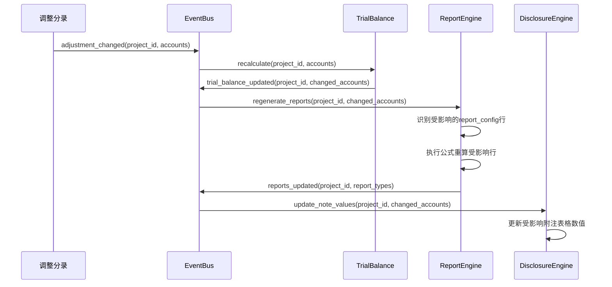
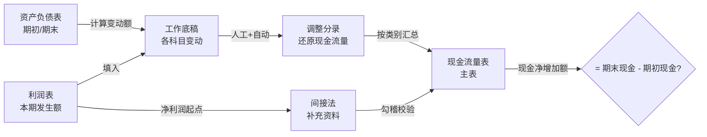

# 设计文档：第一阶段MVP报表 — 报表生成+现金流量表+附注+PDF导出

## 概述

本设计文档描述审计作业平台第一阶段MVP报表模块的技术架构与实现方案。核心目标是实现单户财务报表自动生成、现金流量表工作底稿法编制、附注自动生成与校验、审计报告模板管理、以及PDF导出。

技术栈：FastAPI + PostgreSQL + Redis + openpyxl + WeasyPrint（PDF生成）+ Celery/Redis（异步任务）+ Vue 3

本阶段依赖Phase 0基础设施、Phase 1核心已实现的：试算表（`trial_balance`表）、调整分录（`adjustments`表）、科目映射（`account_mapping`表）、四表数据、事件总线（EventBus）；以及Phase 1b底稿已实现的：取数公式引擎（FormulaEngine）、底稿模板引擎（TemplateEngine）。

### 核心设计原则

1. **公式驱动取数**：报表每一行的数据通过取数公式从试算表获取，保证报表与试算表的一致性
2. **事件驱动级联**：调整分录变更→试算表重算→报表重生成→附注更新，全链路通过事件总线驱动
3. **模版可配置**：报表格式、附注模版、审计报告模板均可配置，适配不同准则和行业
4. **异步导出**：PDF导出为耗时操作，通过异步任务队列执行，不阻塞前端
5. **规则引擎校验**：附注校验采用确定性规则引擎（不依赖AI），LLM仅用于文本合理性审核

## 架构

### 整体架构

```mermaid
graph TB
    subgraph Frontend["前端 (Vue 3)"]
        RPV[报表查看/穿透]
        CFS[现金流量表工作底稿]
        DNE[附注编辑器]
        ARE[审计报告编辑器]
        EXP[PDF导出面板]
    end

    subgraph API["API层 (FastAPI)"]
        R1[/api/reports]
        R2[/api/cfs-worksheet]
        R3[/api/disclosure-notes]
        R4[/api/audit-report]
        R5[/api/export]
    end

    subgraph Services["服务层"]
        RE[ReportEngine]
        CFSE[CFSWorksheetEngine]
        DE[DisclosureEngine]
        NVE[NoteValidationEngine]
        ARS[AuditReportService]
        PDE[PDFExportEngine]
    end

    subgraph Shared["共享依赖 (Phase 1核心/1b底稿)"]
        FE[FormulaEngine]
        EB[EventBus]
        TB[TrialBalance]
    end

    subgraph Async["异步任务"]
        CQ[Celery Worker]
    end

    subgraph Storage["存储层"]
        PG[(PostgreSQL)]
        RD[(Redis)]
        FS[(文件系统)]
    end

    Frontend --> API
    API --> Services
    RE --> FE
    RE --> PG
    CFSE --> PG
    CFSE --> TB
    DE --> FE
    DE --> PG
    NVE --> PG
    ARS --> PG
    PDE --> FS
    PDE --> CQ
    CQ --> RD
    EB --> RE
    EB --> DE
```

### 数据流：调整分录→报表→附注级联更新



### 现金流量表工作底稿法流程



## 组件设计

### 1. ReportEngine（报表生成引擎）

**职责**：根据`report_config`配置和试算表数据生成四张财务报表。

**核心方法**：

```python
class ReportEngine:
    def __init__(self, formula_engine: FormulaEngine, db: AsyncSession):
        self.formula_engine = formula_engine
        self.db = db

    async def generate_all_reports(self, project_id: UUID, year: int) -> dict:
        """生成四张报表，返回 {report_type: [rows]}"""
        configs = await self._load_report_configs(project_id)
        results = {}
        for report_type, rows in configs.items():
            results[report_type] = await self._generate_report(
                project_id, year, report_type, rows
            )
        return results

    async def _generate_report(self, project_id, year, report_type, config_rows):
        """执行每行公式，生成报表数据"""
        report_rows = []
        row_cache = {}  # row_code -> amount, 用于ROW()引用
        for config in sorted(config_rows, key=lambda r: r.row_number):
            current = await self._execute_formula(
                project_id, year, config.formula, row_cache
            )
            prior = await self._execute_formula(
                project_id, year - 1, config.formula, {}
            )
            row_cache[config.row_code] = current
            report_rows.append(FinancialReportRow(
                row_code=config.row_code,
                row_name=config.row_name,
                current_period_amount=current,
                prior_period_amount=prior,
                formula_used=config.formula,
            ))
        return report_rows

    async def _execute_formula(self, project_id, year, formula, row_cache):
        """解析并执行公式，支持TB()/SUM_TB()/ROW()/PREV()"""
        if not formula:
            return Decimal("0")
        # 解析ROW()引用，替换为row_cache中的值
        # 调用FormulaEngine执行TB()/SUM_TB()
        # 支持算术运算 +/-
        ...

    async def regenerate_affected(self, project_id, year, changed_accounts):
        """增量更新：只重算受影响的报表行"""
        configs = await self._load_report_configs(project_id)
        for report_type, rows in configs.items():
            affected = [r for r in rows if self._is_affected(r.formula, changed_accounts)]
            for config in affected:
                await self._regenerate_row(project_id, year, config)
```

**公式语法解析**：

| 公式 | 解析规则 | 示例 |
|------|---------|------|
| `TB(code, col)` | 调用FormulaEngine.execute | `TB("1001","期末余额")` |
| `SUM_TB(range, col)` | 调用FormulaEngine.execute | `SUM_TB("6001~6099","期末余额")` |
| `ROW(code)` | 从row_cache查找 | `ROW("BS-001") + ROW("BS-002")` |
| `PREV(formula)` | year-1执行内部公式 | `PREV(TB("1001","期末余额"))` |
| 算术运算 | 支持 + - * / | `ROW("BS-010") - ROW("BS-020")` |

### 2. CFSWorksheetEngine（现金流量表工作底稿引擎）

**职责**：管理现金流量表工作底稿法编制流程。

```python
class CFSWorksheetEngine:
    async def generate_worksheet(self, project_id: UUID, year: int):
        """生成工作底稿：填入资产负债表变动和利润表数据"""
        # 1. 从trial_balance获取所有科目期初期末余额
        # 2. 计算各科目变动额
        # 3. 自动识别常见调整项并生成草稿调整分录
        # 4. 返回工作底稿数据

    async def auto_generate_adjustments(self, project_id, year):
        """自动识别常见调整项，生成草稿CFS调整分录"""
        auto_items = [
            ("折旧", "累计折旧", "经营活动"),
            ("摊销", "累计摊销", "经营活动"),
            ("资产减值损失", "各减值准备科目", "经营活动"),
            ("投资收益", "投资收益", "投资活动"),
            ("财务费用", "财务费用", "经营活动/筹资活动"),
            ("处置资产损益", "营业外收支", "投资活动"),
            ("递延所得税", "递延所得税资产/负债", "经营活动"),
        ]
        # 从试算表识别上述科目的变动，生成调整分录草稿

    async def get_reconciliation_status(self, project_id, year):
        """检查工作底稿平衡状态：各科目变动是否已全部分配"""
        # 返回每个科目的：变动额、已分配额、未分配余额

    async def generate_indirect_method(self, project_id, year):
        """生成间接法补充资料"""
        # 从净利润出发，逐项调整非现金项目和营运资本变动

    async def verify_cash_reconciliation(self, project_id, year):
        """勾稽校验：现金净增加额 = 期末现金 - 期初现金"""
        # 从试算表获取现金及现金等价物科目的期初期末余额
```

### 3. DisclosureEngine（附注生成引擎）

**职责**：根据附注模版自动生成附注，管理附注内容的编辑和校验。

```python
class DisclosureEngine:
    async def generate_notes(self, project_id, year, template_type: str):
        """根据模版生成附注初稿"""
        # 1. 加载科目对照模板
        # 2. 遍历报表科目，为每个有附注映射的科目生成附注章节
        # 3. 数值型表格从试算表/辅助余额表取数
        # 4. 文字型章节填入模版文本，标记"待填写"
        # 5. 写入disclosure_notes表

    async def populate_table_data(self, project_id, year, note_section):
        """为指定附注章节的表格填充数值数据"""
        # 从trial_balance和tb_aux_balance取数
        # 按科目对照模板的映射关系填入表格

    async def update_note_values(self, project_id, year, changed_accounts):
        """增量更新：只更新受影响科目的附注数值"""
        # 根据科目对照模板找到受影响的附注章节
        # 重新取数并更新table_data
```

### 4. NoteValidationEngine（附注校验引擎）

**职责**：执行8种附注校验规则。

```python
class NoteValidationEngine:
    VALIDATORS = {
        "balance": BalanceValidator,        # 余额核对
        "wide_table": WideTableValidator,   # 宽表公式
        "vertical": VerticalValidator,      # 纵向勾稽
        "cross_table": CrossTableValidator, # 交叉校验
        "sub_item": SubItemValidator,       # 其中项
        "aging": AgingTransitionValidator,  # 账龄衔接
        "completeness": CompletenessValidator, # 完整性
        "llm_review": LLMReviewValidator,   # LLM审核
    }

    async def validate_all(self, project_id, year) -> list[ValidationFinding]:
        """执行全部校验规则"""
        findings = []
        notes = await self._load_notes(project_id, year)
        presets = await self._load_check_presets(template_type)
        for note in notes:
            applicable_checks = presets.get(note.account_name, [])
            for check in applicable_checks:
                validator = self.VALIDATORS[check.check_type]()
                result = await validator.validate(note, check)
                if result:
                    findings.extend(result)
        return sorted(findings, key=lambda f: f.severity_order)
```

### 5. PDFExportEngine（PDF导出引擎）

**职责**：将审计文档导出为PDF，支持异步执行。

```python
class PDFExportEngine:
    async def create_export_task(self, project_id, task_type, options) -> UUID:
        """创建导出任务，返回task_id"""
        task = ExportTask(
            project_id=project_id,
            task_type=task_type,
            status="queued",
        )
        # 保存到export_tasks表
        # 提交Celery异步任务
        return task.id

    async def execute_export(self, task_id: UUID):
        """异步执行导出（Celery worker中运行）"""
        task = await self._load_task(task_id)
        try:
            # 1. 生成审计报告PDF（WeasyPrint: HTML→PDF）
            # 2. 生成财务报表PDF
            # 3. 生成附注PDF
            # 4. 转换底稿.xlsx→PDF（openpyxl读取→HTML表格→WeasyPrint）
            # 5. 生成目录页
            # 6. 合并所有PDF（PyPDF2）
            # 7. 添加页眉页脚
            # 8. 可选：加密保护
            await self._update_progress(task_id, 100, "completed")
        except Exception as e:
            await self._update_progress(task_id, -1, "failed", str(e))
```

**PDF生成流水线**：

```
文档数据 → Jinja2 HTML模板 → WeasyPrint渲染 → 单文档PDF
                                                    ↓
                                              PyPDF2合并
                                                    ↓
                                            添加页眉页脚页码
                                                    ↓
                                            可选：密码保护
                                                    ↓
                                            最终PDF文件
```

## API设计

### 报表API

| 方法 | 路径 | 说明 |
|------|------|------|
| POST | `/api/reports/generate` | 生成/重新生成四张报表 |
| GET | `/api/reports/{project_id}/{year}/{report_type}` | 获取指定报表数据 |
| GET | `/api/reports/{project_id}/{year}/{report_type}/drilldown/{row_code}` | 报表行穿透查询 |
| GET | `/api/reports/{project_id}/{year}/consistency-check` | 跨报表一致性校验 |
| GET | `/api/reports/{project_id}/{year}/{report_type}/export-excel` | 导出单张报表Excel |

### 现金流量表工作底稿API

| 方法 | 路径 | 说明 |
|------|------|------|
| POST | `/api/cfs-worksheet/generate` | 生成工作底稿 |
| GET | `/api/cfs-worksheet/{project_id}/{year}` | 获取工作底稿数据 |
| POST | `/api/cfs-worksheet/adjustments` | 创建CFS调整分录 |
| PUT | `/api/cfs-worksheet/adjustments/{id}` | 修改CFS调整分录 |
| DELETE | `/api/cfs-worksheet/adjustments/{id}` | 删除CFS调整分录 |
| GET | `/api/cfs-worksheet/{project_id}/{year}/reconciliation` | 获取平衡状态 |
| POST | `/api/cfs-worksheet/auto-generate` | 自动生成常见调整项 |
| GET | `/api/cfs-worksheet/{project_id}/{year}/indirect-method` | 获取间接法补充资料 |

### 附注API

| 方法 | 路径 | 说明 |
|------|------|------|
| POST | `/api/disclosure-notes/generate` | 生成附注初稿 |
| GET | `/api/disclosure-notes/{project_id}/{year}` | 获取附注目录树 |
| GET | `/api/disclosure-notes/{project_id}/{year}/{note_section}` | 获取指定章节 |
| PUT | `/api/disclosure-notes/{id}` | 更新附注章节内容 |
| POST | `/api/disclosure-notes/{project_id}/{year}/validate` | 执行附注校验 |
| GET | `/api/disclosure-notes/{project_id}/{year}/validation-results` | 获取校验结果 |
| PUT | `/api/disclosure-notes/findings/{id}/confirm` | 确认校验发现 |

### 审计报告API

| 方法 | 路径 | 说明 |
|------|------|------|
| POST | `/api/audit-report/generate` | 从模板生成审计报告 |
| GET | `/api/audit-report/{project_id}/{year}` | 获取审计报告 |
| PUT | `/api/audit-report/{id}/paragraphs/{section}` | 更新报告段落 |
| GET | `/api/audit-report/templates` | 获取报告模板列表 |
| PUT | `/api/audit-report/{id}/status` | 更新报告状态 |

### PDF导出API

| 方法 | 路径 | 说明 |
|------|------|------|
| POST | `/api/export/create` | 创建导出任务 |
| GET | `/api/export/{task_id}/status` | 查询任务状态 |
| GET | `/api/export/{task_id}/download` | 下载导出文件 |
| GET | `/api/export/{project_id}/history` | 导出历史记录 |

## 数据模型

### report_config 种子数据结构示例

```json
{
  "report_type": "balance_sheet",
  "row_code": "BS-001",
  "row_name": "货币资金",
  "row_number": 1,
  "indent_level": 1,
  "formula": "TB('1001','期末余额') + TB('1002','期末余额') + TB('1012','期末余额')",
  "applicable_standard": "enterprise",
  "is_total_row": false
}
```

### financial_report 数据结构

```json
{
  "project_id": "uuid",
  "year": 2024,
  "report_type": "balance_sheet",
  "row_code": "BS-001",
  "row_name": "货币资金",
  "current_period_amount": 1500000.00,
  "prior_period_amount": 1200000.00,
  "formula_used": "TB('1001','期末余额') + TB('1002','期末余额')",
  "source_accounts": ["1001", "1002", "1012"]
}
```

### disclosure_notes table_data 结构

```json
{
  "headers": ["项目", "期末余额", "期初余额"],
  "rows": [
    {"label": "库存现金", "values": [50000.00, 45000.00], "is_total": false},
    {"label": "银行存款", "values": [1400000.00, 1100000.00], "is_total": false},
    {"label": "其他货币资金", "values": [50000.00, 55000.00], "is_total": false},
    {"label": "合计", "values": [1500000.00, 1200000.00], "is_total": true}
  ],
  "check_roles": ["余额", "其中项"]
}
```

## 前端页面设计

### 报表查看页

- 左侧：四张报表Tab切换（资产负债表/利润表/现金流量表/权益变动表）
- 右侧：格式化报表表格，支持行缩进、小计加粗、合计行高亮
- 每个金额单元格支持点击穿透（弹出穿透面板：公式→科目→凭证）
- 顶部：平衡校验状态指示器、跨报表一致性校验按钮
- 操作栏：重新生成、导出Excel、导出PDF

### 现金流量表工作底稿页

- 上半部分：工作底稿表格（科目/期初/期末/变动额/已分配/未分配）
- 下半部分：CFS调整分录列表（编号/描述/借方/贷方/金额/类别）
- 右侧面板：现金流量表预览（按经营/投资/筹资分类汇总）
- 底部：间接法勾稽校验结果、现金勾稽校验结果

### 附注编辑页

- 左侧：附注目录树（按章节编号组织，可折叠展开）
- 中间：附注内容编辑区（表格型用可编辑表格组件，文字型用富文本编辑器）
- 右侧：校验结果面板（按科目分组，错误/警告/提示分级显示）
- 操作栏：生成附注、执行校验、导出

### 审计报告编辑页

- 左侧：报告段落导航（审计意见段/基础段/KAM段/...）
- 中间：段落富文本编辑器（GT品牌排版）
- 右侧：财务数据引用面板（自动从报表取数，可刷新）
- 操作栏：选择意见类型、选择公司类型、生成报告、导出PDF

### PDF导出面板

- 文档选择：勾选要导出的文档（审计报告/四张报表/附注/底稿）
- 导出选项：密码保护开关、密码输入
- 进度显示：实时进度条、当前处理阶段、已处理/总数
- 历史记录：已完成的导出任务列表，支持重新下载

## 正确性属性

| # | 属性 | 验证方式 | 对应需求 |
|---|------|---------|---------|
| 1 | 报表公式确定性执行 | 相同输入执行两次返回相同结果 | 2.1 |
| 2 | 资产负债表平衡 | 资产合计 = 负债合计 + 权益合计 | 2.6 |
| 3 | 报表与试算表一致性 | 报表行金额 = 公式从试算表取数结果 | 2.4, 8.2 |
| 4 | 现金流量表勾稽 | 现金净增加额 = 期末现金 - 期初现金 | 3.11 |
| 5 | 间接法勾稽 | 间接法经营活动现金流 = 主表经营活动现金流 | 3.10 |
| 6 | CFS调整分录借贷平衡 | 每笔调整分录借方合计 = 贷方合计 | 3.4 |
| 7 | 工作底稿平衡 | 所有科目变动额 = 已分配调整额（全部分配后） | 3.6 |
| 8 | 附注余额核对 | 附注合计行 = 报表对应行金额 | 4.4, 5.1 |
| 9 | 附注宽表公式 | 期初 ± 变动 = 期末 | 4.5, 5.1 |
| 10 | 附注其中项校验 | 明细行之和 = 合计行 | 4.7, 5.1 |
| 11 | 跨报表一致性 | BS净利润 = IS净利润，CFS期末现金 = BS现金 | 8.5 |
| 12 | 级联更新完整性 | 调整分录变更后报表和附注均已更新 | 8.1 |
| 13 | PDF导出完整性 | 导出PDF包含所有选中文档 | 7.1 |
| 14 | 审计报告财务数据一致性 | 报告中引用的财务数据 = 报表对应数据 | 6.4, 6.5 |
| 15 | 报表行公式解析往返一致性 | 解析公式→执行→序列化→再解析→再执行，结果相同 | 1.4 |
