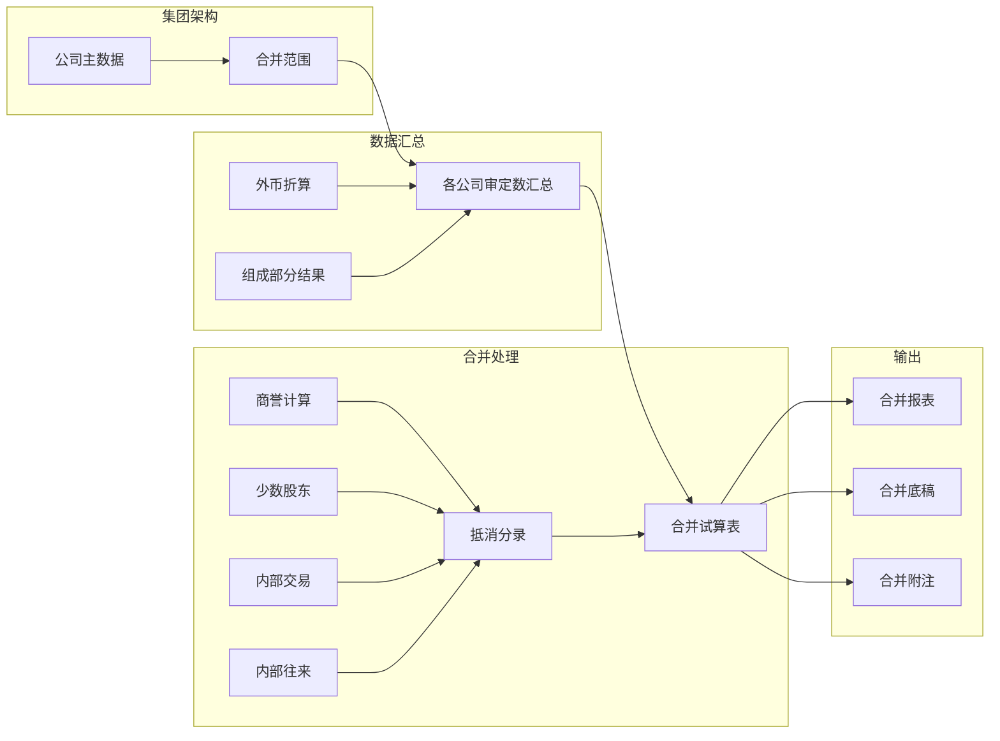
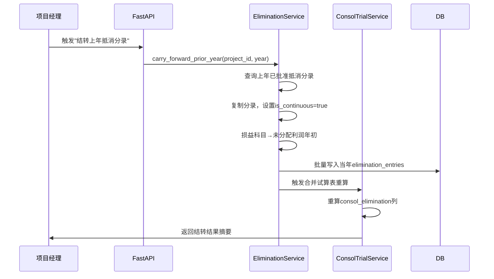
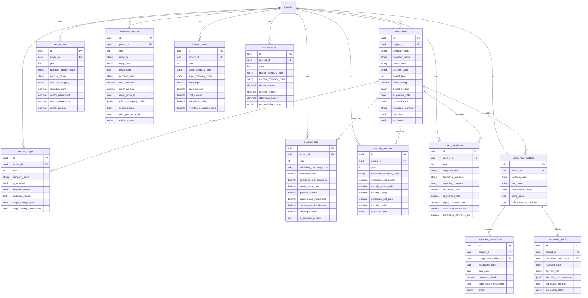

# 设计文档：第二阶段集团合并 — 集团架构+组成部分审计师+合并抵消+商誉+少数股东+外币折算+合并报表+合并附注

## 概述

本设计文档描述审计作业平台第二阶段集团合并功能的技术架构与实现方案。在Phase 1单户审计MVP基础上，叠加集团合并能力，实现从集团架构维护到合并报表输出的完整链路。

技术栈：FastAPI + PostgreSQL + Redis + Celery + Vue 3 + Pinia（复用Phase 1基础设施）

### 核心设计原则

1. **复用Phase 1引擎**：合并报表复用Report_Engine，合并附注复用Disclosure_Engine，合并底稿复用Template_Engine
2. **事件驱动联动**：抵消分录变更通过EventBus触发合并试算表级联更新，与Phase 1调整分录联动机制一致
3. **连续编制自动化**：上年抵消分录自动结转并调整科目（损益→未分配利润年初），减少人工重复劳动
4. **增量计算**：合并试算表更新采用增量模式（仅重算受影响科目），全量重算作为兜底
5. **多公司隔离**：每个公司的试算表数据独立存储，合并汇总在consol_trial层面完成

## 架构

### 整体架构

```mermaid
graph TB
    subgraph Frontend["前端 (Vue 3 + Pinia)"]
        GT[集团架构树]
        CA[组成部分审计师]
        CT[合并试算表]
        EE[抵消分录管理]
        IT[内部交易/往来]
        GW[商誉计算]
        MI[少数股东权益]
        FX[外币折算]
        CR[合并报表]
        CN[合并附注]
    end

    subgraph API["API层 (FastAPI)"]
        R1[/api/projects/{id}/companies]
        R2[/api/projects/{id}/component-auditors]
        R3[/api/projects/{id}/consol-trial]
        R4[/api/projects/{id}/eliminations]
        R5[/api/projects/{id}/internal-trades]
        R6[/api/projects/{id}/goodwill]
        R7[/api/projects/{id}/minority-interest]
        R8[/api/projects/{id}/forex-translation]
        R9[/api/projects/{id}/consol-reports]
    end

    subgraph Services["服务层"]
        GS[GroupStructureService]
        CAS[ComponentAuditorService]
        CTS[ConsolTrialService]
        ES[EliminationService]
        ITS[InternalTradeService]
        GWS[GoodwillService]
        MIS[MinorityInterestService]
        FXS[ForexTranslationService]
        CRS[ConsolReportService]
        CNS[ConsolDisclosureService]
        EB[EventBus]
    end

    subgraph Storage["存储层"]
        PG[(PostgreSQL)]
        RD[(Redis)]
    end

    Frontend --> API
    API --> Services
    Services --> EB
    Services --> PG
    Services --> RD
```

### 数据流架构



### 抵消分录连续编制流程



## 组件与接口

### 1. 集团架构服务 (GroupStructureService)

```python
class GroupStructureService:
    async def create_company(self, project_id: UUID, data: CompanyCreate) -> Company:
        """创建公司记录，自动计算consol_level和ultimate_code"""

    async def update_company(self, company_id: UUID, data: CompanyUpdate) -> Company:
        """更新公司信息，parent_code变更时级联更新子树"""

    async def get_group_tree(self, project_id: UUID) -> GroupTreeNode:
        """返回集团架构树（递归构建）"""

    async def validate_structure(self, project_id: UUID) -> list[ValidationError]:
        """校验结构完整性：无孤立节点、无循环引用、parent_code引用有效"""

    async def manage_consol_scope(self, project_id: UUID, year: int,
                                   scopes: list[ConsolScopeInput]) -> list[ConsolScope]:
        """批量更新合并范围"""

    async def get_consol_scope(self, project_id: UUID, year: int) -> list[ConsolScope]:
        """获取当年合并范围"""
```

**集团架构树构建算法**：
- 从`companies`表查询所有is_active=true的公司
- 以ultimate_code对应的公司为根节点
- 按parent_code递归构建子树
- 循环引用检测：DFS遍历时维护visited集合

### 2. 组成部分审计师服务 (ComponentAuditorService)

```python
class ComponentAuditorService:
    async def create_auditor(self, project_id: UUID,
                              data: ComponentAuditorCreate) -> ComponentAuditor:
        """创建组成部分审计师记录"""

    async def create_instruction(self, data: InstructionCreate) -> ComponentInstruction:
        """创建审计指令"""

    async def send_instruction(self, instruction_id: UUID) -> ComponentInstruction:
        """标记指令为已发送，锁定内容"""

    async def receive_result(self, data: ResultCreate) -> ComponentResult:
        """接收组成部分审计结果"""

    async def accept_result(self, result_id: UUID, evaluation: str) -> ComponentResult:
        """接受结果，使组成部分审定数可用于合并"""

    async def get_dashboard(self, project_id: UUID) -> ComponentDashboard:
        """组成部分审计师管理看板：指令状态、结果状态汇总"""
```

### 3. 合并试算表服务 (ConsolTrialService)

```python
class ConsolTrialService:
    async def aggregate_individual(self, project_id: UUID, year: int) -> None:
        """
        汇总各公司审定数：
        SQL: SELECT standard_account_code, SUM(audited_amount) as individual_sum
             FROM trial_balance tb
             JOIN consol_scope cs ON tb.company_code = cs.company_code
             WHERE cs.is_included = true AND tb.project_id = :pid AND tb.year = :year
             GROUP BY standard_account_code
        外币子公司使用forex_translation折算后的金额
        """

    async def recalc_elimination(self, project_id: UUID, year: int,
                                  account_codes: list[str] | None = None) -> None:
        """
        重算抵消列（增量或全量）：
        consol_elimination = SUM(debit_amount) - SUM(credit_amount)
        FROM elimination_entries WHERE is_deleted=false
        """

    async def recalc_consol_amount(self, project_id: UUID, year: int,
                                    account_codes: list[str] | None = None) -> None:
        """合并数 = 汇总数 + 合并调整 + 合并抵消"""

    async def full_recalc(self, project_id: UUID, year: int) -> None:
        """全量重算：汇总 → 抵消列 → 合并数"""

    async def check_consistency(self, project_id: UUID, year: int) -> ConsistencyReport:
        """一致性校验：汇总数=各公司审定数之和、抵消列=分录汇总、合并数公式正确"""
```

**缓存策略**：
- Redis缓存合并试算表，key=`consol_tb:{project_id}:{year}`，TTL=10min
- 抵消分录CRUD触发缓存失效

### 4. 抵消分录服务 (EliminationService)

```python
class EliminationService:
    async def create_entry(self, project_id: UUID,
                            data: EliminationCreate) -> EliminationGroup:
        """创建抵消分录组，校验借贷平衡，发布事件"""

    async def update_entry(self, entry_group_id: UUID,
                            data: EliminationUpdate) -> EliminationGroup:
        """修改分录（仅draft/rejected状态）"""

    async def delete_entry(self, entry_group_id: UUID) -> None:
        """软删除分录"""

    async def carry_forward_prior_year(self, project_id: UUID, year: int) -> CarryForwardResult:
        """
        连续编制核心逻辑：
        1. 查询上年(year-1)所有approved的抵消分录
        2. 复制到当年，设置is_continuous=true, prior_year_entry_id
        3. 对权益抵消分录：损益科目(revenue/cost/expense)替换为"未分配利润—年初"
        4. 对内部交易抵消分录：上年未实现利润本年需调整（已实现部分冲回）
        5. 批量写入，触发合并试算表重算
        返回：结转数量、调整明细
        """

    async def change_review_status(self, entry_group_id: UUID,
                                    status: ReviewStatus, reason: str = None) -> None:
        """复核状态机（与Phase 1调整分录一致）"""

    async def get_summary(self, project_id: UUID, year: int) -> EliminationSummary:
        """按entry_type分组汇总"""
```

**连续编制科目替换规则**：

| 上年科目类别 | 本年替换为 | 说明 |
|---|---|---|
| 营业收入 | 未分配利润—年初 | 上年收入抵消本年转入期初留存 |
| 营业成本 | 未分配利润—年初 | 上年成本抵消本年转入期初留存 |
| 投资收益 | 未分配利润—年初 | 上年投资收益抵消本年转入期初留存 |
| 资产减值损失 | 未分配利润—年初 | 上年减值抵消本年转入期初留存 |
| 资产/负债/权益 | 保持不变 | 资产负债表科目不需替换 |

### 5. 内部交易与往来服务 (InternalTradeService)

```python
class InternalTradeService:
    async def create_trade(self, project_id: UUID,
                            data: InternalTradeCreate) -> InternalTrade:
        """创建内部交易记录，自动计算unrealized_profit"""

    async def create_ar_ap(self, project_id: UUID,
                            data: InternalArApCreate) -> InternalArAp:
        """创建内部往来记录，自动计算差异"""

    async def auto_generate_eliminations(self, project_id: UUID, year: int,
                                          trade_ids: list[UUID]) -> list[EliminationGroup]:
        """
        根据内部交易自动生成抵消分录：
        - 商品交易：借:营业收入 贷:营业成本（收入成本抵消）
                    借:营业成本 贷:存货（未实现利润抵消）
        - 内部往来：借:应付账款 贷:应收账款
        """

    async def get_transaction_matrix(self, project_id: UUID, year: int) -> TransactionMatrix:
        """内部交易矩阵（行=卖方，列=买方）"""

    async def reconcile_ar_ap(self, project_id: UUID, year: int) -> ReconciliationResult:
        """批量核对内部往来，标记matched/unmatched"""
```

### 6. 商誉计算服务 (GoodwillService)

```python
class GoodwillService:
    async def calculate_goodwill(self, project_id: UUID,
                                  data: GoodwillInput) -> GoodwillCalc:
        """
        商誉 = 合并成本 - 可辨认净资产公允价值 × 母公司持股比例
        负商誉时设置is_negative_goodwill=true
        """

    async def record_impairment(self, goodwill_id: UUID,
                                 impairment_amount: Decimal) -> GoodwillCalc:
        """记录减值，自动生成减值抵消分录"""

    async def carry_forward(self, project_id: UUID, year: int) -> None:
        """结转上年商誉数据到当年，累计减值自动更新"""

    async def generate_equity_elimination(self, project_id: UUID,
                                           subsidiary_code: str) -> EliminationGroup:
        """
        生成权益抵消分录：
        借: 实收资本（子公司）
        借: 资本公积（子公司）
        借: 盈余公积（子公司）
        借: 未分配利润（子公司）
        借: 商誉
        贷: 长期股权投资（母公司）
        贷: 少数股东权益
        """
```

### 7. 少数股东权益服务 (MinorityInterestService)

```python
class MinorityInterestService:
    async def calculate(self, project_id: UUID, year: int,
                         subsidiary_code: str) -> MinorityInterest:
        """
        少数股东权益 = 子公司净资产 × 少数股东持股比例
        少数股东损益 = 子公司净利润 × 少数股东持股比例
        超额亏损处理：少数股东权益不低于0（除非有承担义务）
        """

    async def batch_calculate(self, project_id: UUID, year: int) -> list[MinorityInterest]:
        """批量计算所有全额合并子公司的少数股东权益"""

    async def generate_elimination(self, project_id: UUID,
                                    subsidiary_code: str) -> EliminationGroup:
        """
        生成少数股东权益抵消分录：
        借: 少数股东损益
        贷: 少数股东权益
        """
```

### 8. 外币折算服务 (ForexTranslationService)

```python
class ForexTranslationService:
    async def translate(self, project_id: UUID, year: int,
                         company_code: str, rates: ForexRates) -> ForexTranslation:
        """
        折算规则：
        - 资产/负债 → 期末汇率(bs_closing_rate)
        - 收入/成本/费用 → 平均汇率(pl_average_rate)
        - 实收资本/资本公积 → 历史汇率(equity_historical_rate)
        - 未分配利润 → 公式推算（年初+本年净利润折算-分配）
        - 折算差额 = 资产折算 - 负债折算 - 权益折算 → 其他综合收益
        """

    async def get_translation_worksheet(self, project_id: UUID, year: int,
                                         company_code: str) -> TranslationWorksheet:
        """折算工作表：原币金额 | 汇率 | 折算金额"""

    async def apply_to_consol_trial(self, project_id: UUID, year: int,
                                     company_code: str) -> None:
        """将折算后金额替换到合并试算表汇总中"""
```

### 9. 合并报表服务 (ConsolReportService)

```python
class ConsolReportService:
    async def generate_consol_reports(self, project_id: UUID, year: int) -> list[FinancialReport]:
        """
        复用Phase 1 Report_Engine，数据源从trial_balance切换为consol_trial：
        - 取数公式中的TB()函数改为读取consol_trial.consol_amount
        - 新增合并特有行次：商誉（资产）、少数股东权益（权益）、少数股东损益（利润表）
        """

    async def generate_consol_workpaper(self, project_id: UUID, year: int) -> str:
        """
        生成合并底稿.xlsx：
        Sheet1: 各公司审定数并列（列=公司，行=科目）
        Sheet2: 抵消分录汇总（按类型分组）
        Sheet3: 合并试算表（汇总数/调整/抵消/合并数）
        Sheet4: 勾稽校验（资产=负债+权益、借贷平衡等）
        返回文件路径
        """

    async def verify_balance(self, project_id: UUID, year: int) -> BalanceCheckResult:
        """合并资产负债表平衡校验"""

    async def export_to_excel(self, project_id: UUID, year: int) -> str:
        """导出合并报表和底稿到Excel"""
```

### 10. 合并附注服务 (ConsolDisclosureService)

```python
class ConsolDisclosureService:
    async def generate_consol_notes(self, project_id: UUID, year: int) -> list[DisclosureNote]:
        """
        生成合并特有附注章节：
        1. 合并范围说明（从companies+consol_scope取数）
        2. 重要子公司信息表
        3. 合并范围变动说明
        4. 商誉披露（从goodwill_calc取数）
        5. 少数股东权益披露（从minority_interest取数）
        6. 内部交易抵消说明（从internal_trade汇总）
        7. 外币折算披露（从forex_translation取数）
        """

    async def generate_subsidiary_table(self, project_id: UUID, year: int) -> dict:
        """生成子公司信息表：名称/注册地/业务性质/注册资本/持股比例/合并方法"""

    async def integrate_with_notes(self, project_id: UUID, year: int) -> None:
        """将合并附注插入Phase 1附注体系的适当位置"""
```

### 11. 事件总线扩展

在Phase 1 EventBus基础上新增合并相关事件：

```python
class EventType(str, Enum):
    # Phase 1 已有事件...
    # Phase 2 新增
    ELIMINATION_CREATED = "elimination.created"
    ELIMINATION_UPDATED = "elimination.updated"
    ELIMINATION_DELETED = "elimination.deleted"
    CONSOL_SCOPE_CHANGED = "consol_scope.changed"
    FOREX_TRANSLATED = "forex.translated"
    COMPONENT_RESULT_ACCEPTED = "component_result.accepted"

# 事件处理器注册
event_bus.subscribe(EventType.ELIMINATION_CREATED, consol_trial_service.on_elimination_changed)
event_bus.subscribe(EventType.ELIMINATION_UPDATED, consol_trial_service.on_elimination_changed)
event_bus.subscribe(EventType.ELIMINATION_DELETED, consol_trial_service.on_elimination_changed)
event_bus.subscribe(EventType.CONSOL_SCOPE_CHANGED, consol_trial_service.on_scope_changed)
event_bus.subscribe(EventType.FOREX_TRANSLATED, consol_trial_service.on_forex_translated)
event_bus.subscribe(EventType.COMPONENT_RESULT_ACCEPTED, consol_trial_service.on_component_accepted)
```

### 12. API接口设计

#### 12.1 集团架构 API

| 方法 | 路径 | 说明 |
|------|------|------|
| GET | `/api/projects/{id}/companies` | 获取公司列表 |
| POST | `/api/projects/{id}/companies` | 创建公司 |
| PUT | `/api/projects/{id}/companies/{code}` | 更新公司 |
| DELETE | `/api/projects/{id}/companies/{code}` | 删除公司（软删除） |
| GET | `/api/projects/{id}/companies/tree` | 获取集团架构树 |
| POST | `/api/projects/{id}/companies/validate` | 校验结构完整性 |
| GET | `/api/projects/{id}/consol-scope/{year}` | 获取合并范围 |
| PUT | `/api/projects/{id}/consol-scope/{year}` | 更新合并范围 |

#### 12.2 组成部分审计师 API

| 方法 | 路径 | 说明 |
|------|------|------|
| GET | `/api/projects/{id}/component-auditors` | 审计师列表 |
| POST | `/api/projects/{id}/component-auditors` | 创建审计师 |
| PUT | `/api/projects/{id}/component-auditors/{aid}` | 更新审计师 |
| POST | `/api/projects/{id}/component-auditors/{aid}/instructions` | 创建审计指令 |
| PUT | `/api/projects/{id}/component-instructions/{iid}/send` | 发送指令 |
| POST | `/api/projects/{id}/component-auditors/{aid}/results` | 录入审计结果 |
| PUT | `/api/projects/{id}/component-results/{rid}/accept` | 接受结果 |
| GET | `/api/projects/{id}/component-auditors/dashboard` | 管理看板 |

#### 12.3 合并试算表 API

| 方法 | 路径 | 说明 |
|------|------|------|
| GET | `/api/projects/{id}/consol-trial/{year}` | 获取合并试算表 |
| POST | `/api/projects/{id}/consol-trial/{year}/aggregate` | 触发汇总计算 |
| POST | `/api/projects/{id}/consol-trial/{year}/recalc` | 全量重算 |
| GET | `/api/projects/{id}/consol-trial/{year}/consistency-check` | 一致性校验 |

#### 12.4 抵消分录 API

| 方法 | 路径 | 说明 |
|------|------|------|
| GET | `/api/projects/{id}/eliminations/{year}` | 抵消分录列表 |
| POST | `/api/projects/{id}/eliminations/{year}` | 创建抵消分录 |
| PUT | `/api/projects/{id}/eliminations/{group_id}` | 修改抵消分录 |
| DELETE | `/api/projects/{id}/eliminations/{group_id}` | 删除抵消分录 |
| POST | `/api/projects/{id}/eliminations/{group_id}/review` | 复核状态变更 |
| POST | `/api/projects/{id}/eliminations/{year}/carry-forward` | 连续编制结转 |
| GET | `/api/projects/{id}/eliminations/{year}/summary` | 汇总统计 |

#### 12.5 内部交易/往来 API

| 方法 | 路径 | 说明 |
|------|------|------|
| GET | `/api/projects/{id}/internal-trades/{year}` | 内部交易列表 |
| POST | `/api/projects/{id}/internal-trades/{year}` | 创建内部交易 |
| PUT | `/api/projects/{id}/internal-trades/{trade_id}` | 修改内部交易 |
| POST | `/api/projects/{id}/internal-trades/{year}/generate-eliminations` | 自动生成抵消分录 |
| GET | `/api/projects/{id}/internal-trades/{year}/matrix` | 交易矩阵 |
| GET | `/api/projects/{id}/internal-ar-ap/{year}` | 内部往来列表 |
| POST | `/api/projects/{id}/internal-ar-ap/{year}` | 创建内部往来 |
| POST | `/api/projects/{id}/internal-ar-ap/{year}/reconcile` | 批量核对 |

#### 12.6 商誉/少数股东/外币折算 API

| 方法 | 路径 | 说明 |
|------|------|------|
| GET | `/api/projects/{id}/goodwill/{year}` | 商誉列表 |
| POST | `/api/projects/{id}/goodwill/{year}` | 计算商誉 |
| PUT | `/api/projects/{id}/goodwill/{gid}/impairment` | 记录减值 |
| GET | `/api/projects/{id}/minority-interest/{year}` | 少数股东权益列表 |
| POST | `/api/projects/{id}/minority-interest/{year}/calculate` | 批量计算 |
| GET | `/api/projects/{id}/forex-translation/{year}` | 外币折算列表 |
| POST | `/api/projects/{id}/forex-translation/{year}` | 执行折算 |
| GET | `/api/projects/{id}/forex-translation/{year}/{code}/worksheet` | 折算工作表 |

#### 12.7 合并报表/附注 API

| 方法 | 路径 | 说明 |
|------|------|------|
| POST | `/api/projects/{id}/consol-reports/{year}/generate` | 生成合并报表 |
| GET | `/api/projects/{id}/consol-reports/{year}` | 获取合并报表 |
| POST | `/api/projects/{id}/consol-reports/{year}/workpaper` | 生成合并底稿 |
| POST | `/api/projects/{id}/consol-reports/{year}/export` | 导出Excel |
| POST | `/api/projects/{id}/consol-notes/{year}/generate` | 生成合并附注 |
| GET | `/api/projects/{id}/consol-notes/{year}` | 获取合并附注 |

### 13. 前端页面设计

#### 13.1 集团架构管理页面

左侧集团架构树 + 右侧公司详情面板。

- 树形图：可展开/折叠，节点显示公司名称+持股比例+合并方法（色标）
- 右键菜单：新增子公司、编辑、删除、设置合并范围
- 合并范围Tab：表格展示所有公司的纳入/排除状态，支持批量操作
- 底部：结构校验按钮 + 校验结果展示

#### 13.2 组成部分审计师管理页面

三栏布局：审计师列表 | 指令管理 | 结果管理。

- 审计师卡片：事务所名称、负责公司、资质评级（色标）、独立性确认状态
- 指令Tab：指令列表+状态标签（草稿/已发送/已确认），新建指令弹窗
- 结果Tab：结果列表+评价状态，非标准意见红色高亮

#### 13.3 合并试算表页面

全屏表格，列结构：科目编码 | 科目名称 | 各公司审定数（可展开） | 汇总数 | 合并调整 | 合并抵消 | 合并数。

- 按科目类别分组+小计行
- 抵消列可点击 → 弹出抵消分录明细
- 右上角：汇总计算、全量重算、一致性校验、导出Excel
- 底部：借贷平衡校验指示器

#### 13.4 抵消分录管理页面

Tab切换（权益抵消/内部交易/内部往来/未实现利润/其他/全部）+ 分录列表。

- 新建分录弹窗：类型选择、动态借贷行、关联公司选择
- 连续编制按钮：一键结转上年分录，弹窗显示结转预览和科目替换明细
- 复核状态标签 + 批量审批

#### 13.5 内部交易/往来页面

双Tab：内部交易 | 内部往来。

- 内部交易：表格+交易矩阵视图切换
- 内部往来：对账表格，差异行红色高亮，一键核对按钮
- 自动生成抵消分录按钮（选中交易后批量生成）

#### 13.6 商誉/少数股东/外币折算页面

三个子Tab页面。

- 商誉Tab：各子公司商誉计算表（合并成本/净资产公允价值/商誉/减值/账面价值）
- 少数股东Tab：各子公司少数股东权益明细（净资产/持股比例/权益/损益/变动）
- 外币折算Tab：各外币子公司折算工作表（原币/汇率/折算额/折算差额）

#### 13.7 合并报表页面

复用Phase 1报表页面组件，数据源切换为合并试算表。

- 新增合并特有行次（商誉、少数股东权益/损益）
- 合并底稿下载按钮
- 同比分析视图


## 数据模型

### ER图（12张合并相关表）



### 索引策略

| 表 | 索引 | 类型 | 用途 |
|---|---|---|---|
| companies | (project_id, company_code) | UNIQUE | 公司唯一性 |
| consol_scope | (project_id, year, company_code) | UNIQUE | 合并范围唯一性 |
| consol_trial | (project_id, year, standard_account_code) | UNIQUE | 合并试算唯一性 |
| elimination_entries | (project_id, year, entry_type) | COMPOSITE | 按类型筛选 |
| elimination_entries | (project_id, entry_group_id) | COMPOSITE | 分录组查询 |
| internal_trade | (project_id, year) | COMPOSITE | 年度交易查询 |
| internal_ar_ap | (project_id, year) | COMPOSITE | 年度往来查询 |
| goodwill_calc | (project_id, year, subsidiary_company_code) | UNIQUE | 商誉唯一性 |
| minority_interest | (project_id, year, subsidiary_company_code) | UNIQUE | 少数股东唯一性 |
| forex_translation | (project_id, year, company_code) | UNIQUE | 折算唯一性 |
| component_auditors | (project_id, company_code) | UNIQUE | 审计师唯一性 |
| component_instructions | (project_id, component_auditor_id) | COMPOSITE | 指令查询 |
| component_results | (project_id, component_auditor_id) | COMPOSITE | 结果查询 |


## 正确性属性 (Correctness Properties)

### Property 1: 合并试算表公式不变量

*对于任意*标准科目，在任何数据修改（抵消分录CRUD、合并范围变更、外币折算）之后，`consol_amount` 必须等于 `individual_sum + consol_adjustment + consol_elimination`。

**Validates: Requirements 3.4**

### Property 2: 抵消分录借贷平衡不变量

*对于任意*抵消分录组（同一entry_group_id），在创建、修改、删除等所有CRUD操作之后，`SUM(debit_amount)` 必须等于 `SUM(credit_amount)`。

**Validates: Requirements 3.5**

### Property 3: 汇总数等于各公司审定数之和

*对于任意*标准科目，合并试算表中的 `individual_sum` 必须等于所有纳入合并范围（consol_scope.is_included=true）的公司在trial_balance中该科目audited_amount的总和（外币子公司使用折算后金额）。

**Validates: Requirements 3.1, 3.2**

### Property 4: 抵消列等于抵消分录汇总

*对于任意*标准科目，合并试算表中的 `consol_elimination` 必须等于所有未删除抵消分录中该科目的 `SUM(debit_amount) - SUM(credit_amount)`。

**Validates: Requirements 3.4**

### Property 5: 集团架构无循环引用

*对于任意*集团架构，从任意公司沿parent_code向上遍历，必须在有限步内到达根节点（parent_code为null的公司），不存在循环引用。

**Validates: Requirements 1.7**

### Property 6: 合并范围一致性

*对于任意*合并范围配置，被排除的公司（is_included=false）必须有非空的exclusion_reason，且scope_change_type为"exclusion"。

**Validates: Requirements 1.6**

### Property 7: 商誉计算公式

*对于任意*商誉计算记录，`goodwill_amount` 必须等于 `acquisition_cost - (identifiable_net_assets_fv × parent_share_ratio)`，`carrying_amount` 必须等于 `goodwill_amount - accumulated_impairment - current_year_impairment`。

**Validates: Requirements 5.2, 5.3**

### Property 8: 少数股东权益计算公式

*对于任意*少数股东权益记录，`minority_equity` 必须等于 `subsidiary_net_assets × minority_share_ratio`，`minority_profit` 必须等于 `subsidiary_net_profit × minority_share_ratio`。超额亏损时minority_equity不低于0。

**Validates: Requirements 5.6, 5.7**

### Property 9: 未实现利润计算公式

*对于任意*商品类内部交易，`unrealized_profit` 必须等于 `(trade_amount - cost_amount) × inventory_remaining_ratio`。

**Validates: Requirements 4.2**

### Property 10: 内部往来差异计算

*对于任意*内部往来记录，`difference_amount` 必须等于 `debtor_amount - creditor_amount`，且当difference_amount为0时reconciliation_status必须为"matched"。

**Validates: Requirements 4.4**

### Property 11: 外币折算平衡

*对于任意*外币折算记录，折算后的资产负债表必须平衡：折算后总资产 = 折算后总负债 + 折算后权益 + 折算差额。

**Validates: Requirements 6.3**

### Property 12: 连续编制科目替换正确性

*对于任意*从上年结转的抵消分录，如果上年分录涉及损益类科目（revenue/cost/expense），则结转后的当年分录中该科目必须被替换为"未分配利润—年初"，资产负债表科目保持不变。

**Validates: Requirements 3.6, 3.7**

### Property 13: 连续编制溯源完整性

*对于任意*标记为is_continuous=true的抵消分录，其prior_year_entry_id必须非空且指向上年一条有效的抵消分录。

**Validates: Requirements 3.6**

### Property 14: 合并资产负债表平衡

*对于任意*合并报表，合并资产总计 = 合并负债总计 + 合并所有者权益总计（含少数股东权益）。

**Validates: Requirements 7.4**

### Property 15: 组成部分审计指令锁定

*对于任意*已发送（status=sent）的审计指令，其内容字段（materiality_level、audit_scope_description、reporting_format、special_attention_items）不可被修改。

**Validates: Requirements 2.4**

### Property 16: 抵消分录CRUD触发合并试算表更新

*对于任意*抵消分录的创建、修改或删除操作，操作完成后合并试算表中受影响科目的抵消列和合并数必须立即反映变更。

**Validates: Requirements 3.4**

### Property 17: 合并层级自动计算

*对于任意*新增公司，如果指定了parent_code，则consol_level必须等于父公司的consol_level + 1，ultimate_code必须等于根节点的company_code。

**Validates: Requirements 1.2**

### Property 18: 复核状态机合法转换

*对于任意*抵消分录，状态转换只允许：draft→pending_review、pending_review→approved、pending_review→rejected、rejected→draft。approved状态不可编辑或删除。

**Validates: Requirements 3.5（复核流程复用Phase 1模式）**


## 错误处理

### 错误分类与处理策略

| 错误类别 | 严重级别 | 处理方式 | 示例 |
|---|---|---|---|
| 结构校验错误 | reject | 阻止操作，返回错误详情 | 循环引用、parent_code无效 |
| 借贷不平衡 | reject | 阻止保存，显示差额 | 抵消分录借贷不等 |
| 合并范围冲突 | warning | 允许操作，显示警告 | 排除的公司仍有未处理的内部交易 |
| 外币折算差异 | warning | 允许操作，记录差异 | 折算后资产负债表不平衡（四舍五入） |
| 连续编制冲突 | warning | 允许操作，提示确认 | 上年分录已被修改，结转可能不准确 |
| 组成部分结果异常 | info | 高亮显示，提示评估 | 非标准审计意见 |
| 数据一致性差异 | warning | 显示差异，提供一键修复 | 汇总数≠各公司审定数之和 |
