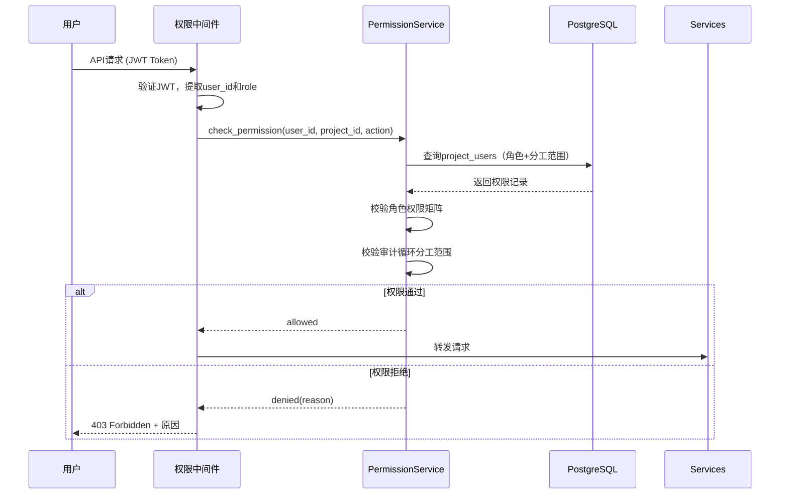
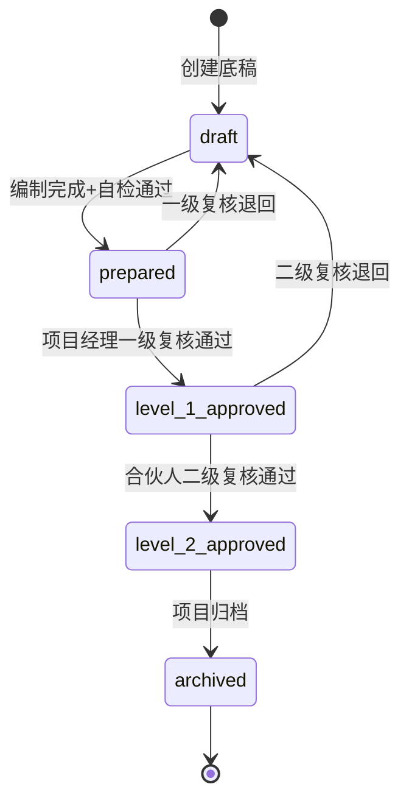
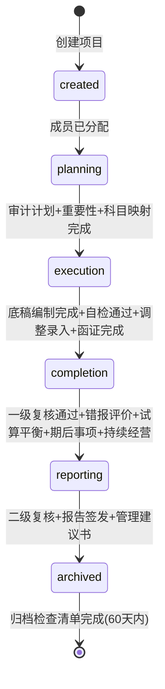

# 设计文档：第三阶段协作与质控 — 多用户权限+三级复核+期后事项+版本控制+项目看板+函证管理+审计档案归档

## 概述

本设计文档描述审计作业平台第三阶段协作与质控功能的技术架构与实现方案。在Phase 1/2基础上，叠加多人协作、质量管理、函证管理和归档能力。

技术栈：FastAPI + PostgreSQL + Redis + Celery + Vue 3 + Pinia（复用Phase 0/1/2基础设施）

### 核心设计原则

1. **RBAC权限模型**：基于角色的访问控制，六种角色+项目级分工+审计循环级隔离，API层统一拦截校验
2. **状态机驱动**：底稿复核流程和项目状态流转均通过有限状态机管理，确保状态转换合法性
3. **事件驱动通知**：所有关键业务事件（复核提交、超期、冲突等）通过EventBus发布，NotificationService统一消费并生成通知
4. **乐观锁+版本号**：多人协作场景下通过版本号实现乐观并发控制，冲突时提供差异对比和合并工具
5. **归档不可逆**：归档后数据全局锁定，修改需走特殊审批流程并保留完整审计轨迹

## 架构

### 整体架构

```mermaid
graph TB
    subgraph Frontend["前端 (Vue 3 + Pinia)"]
        AUTH[登录/认证]
        UM[用户管理]
        RV[复核面板]
        SE[期后事项]
        SYNC[同步管理]
        DB[项目看板]
        CF[函证管理]
        AR[归档管理]
        NC[通知中心]
        GC[持续经营]
    end

    subgraph API["API层 (FastAPI)"]
        R1[/api/auth]
        R2[/api/users]
        R3[/api/projects/{id}/reviews]
        R4[/api/projects/{id}/subsequent-events]
        R5[/api/sync]
        R6[/api/dashboard]
        R7[/api/projects/{id}/confirmations]
        R8[/api/projects/{id}/archive]
        R9[/api/notifications]
        R10[/api/projects/{id}/going-concern]
        MW[权限中间件]
    end

    subgraph Services["服务层"]
        AS[AuthService]
        PS[PermissionService]
        RS[ReviewService]
        SES[SubsequentEventService]
        SS[SyncService]
        DBS[DashboardService]
        CFS[ConfirmationService]
        ARS[ArchiveService]
        NS[NotificationService]
        GCS[GoingConcernService]
        EB[EventBus]
    end

    subgraph Storage["存储层"]
        PG[(PostgreSQL)]
        RD[(Redis)]
        FS[(文件存储)]
    end

    Frontend --> API
    API --> MW --> Services
    Services --> EB
    Services --> PG
    Services --> RD
    ARS --> FS
```

### 权限校验流程



### 复核状态机



### 项目状态流转



## 组件与接口

### 1. 认证服务 (AuthService)

```python
class AuthService:
    async def login(self, username: str, password: str) -> TokenPair:
        """验证用户名密码，返回JWT access_token + refresh_token"""

    async def refresh_token(self, refresh_token: str) -> TokenPair:
        """刷新access_token（2小时有效期）"""

    async def logout(self, user_id: UUID) -> None:
        """注销，将token加入Redis黑名单"""

    async def check_lockout(self, username: str) -> bool:
        """检查账号是否被锁定（Redis计数器，5次失败锁30分钟）"""
```

### 2. 权限服务 (PermissionService)

```python
class PermissionService:
    # 权限矩阵定义
    PERMISSION_MATRIX = {
        "create_project": ["admin", "partner"],
        "assign_members": ["admin", "partner", "manager"],
        "import_data": ["admin", "manager", "auditor"],  # auditor仅负责科目
        "edit_workpaper": ["manager", "auditor"],  # 仅分工范围
        "edit_adjustment": ["manager", "auditor"],  # 仅分工范围
        "review_level_1": ["partner", "manager"],
        "review_level_2": ["partner"],
        "sign_report": ["partner"],
        "archive_project": ["admin", "partner", "manager"],
        "post_archive_modify": ["admin", "partner"],  # partner需审批
        "view_all_projects": ["admin", "qc_reviewer"],
        "view_own_projects": ["partner", "manager", "auditor", "readonly"],
        "project_dashboard": ["admin", "partner", "manager", "qc_reviewer"],
        "user_management": ["admin"],
        "system_config": ["admin"],
        "qc_inspection": ["qc_reviewer"],
    }

    async def check_permission(self, user_id: UUID, project_id: UUID,
                                action: str) -> PermissionResult:
        """检查用户对指定项目的操作权限，含审计循环范围校验"""

    async def check_cycle_scope(self, user_id: UUID, project_id: UUID,
                                 account_code: str) -> bool:
        """检查科目是否在用户的分工范围内"""
```

### 3. 复核服务 (ReviewService)

```python
class ReviewService:
    async def submit_for_review(self, object_type: str, object_id: UUID,
                                 submitter_id: UUID) -> None:
        """提交复核：更新对象状态为prepared，通知复核人"""

    async def create_review(self, data: ReviewCreate) -> ReviewRecord:
        """创建复核记录（意见+结果），触发状态变更和通知"""

    async def respond_to_review(self, review_id: UUID, response: str,
                                 responder_id: UUID) -> ReviewRecord:
        """编制人回复复核意见，通知复核人"""

    async def resolve_review(self, review_id: UUID, reviewer_id: UUID) -> ReviewRecord:
        """复核人确认意见已解决"""

    async def get_review_history(self, object_type: str, object_id: UUID) -> list[ReviewRecord]:
        """获取对象的完整复核历史"""

    async def check_review_gate(self, project_id: UUID,
                                 target_phase: str) -> GateCheckResult:
        """检查项目状态转换的门控条件"""

    async def get_review_timeliness(self, project_id: UUID) -> TimelinesReport:
        """复核及时性统计（提交到复核完成的耗时）"""
```

**复核状态转换规则**：

| 当前状态 | 操作 | 目标状态 | 条件 |
|---|---|---|---|
| draft | submit | prepared | 自检通过（无阻断问题） |
| prepared | level_1_approve | level_1_approved | 所有复核意见已解决 |
| prepared | level_1_reject | draft | 必须填写复核意见 |
| level_1_approved | level_2_approve | level_2_approved | 仅partner可操作 |
| level_1_approved | level_2_reject | draft | 必须填写复核意见 |

### 4. 期后事项服务 (SubsequentEventService)

```python
class SubsequentEventService:
    async def create_event(self, project_id: UUID,
                            data: SubsequentEventCreate) -> SubsequentEvent:
        """创建期后事项记录"""

    async def update_event(self, event_id: UUID,
                            data: SubsequentEventUpdate) -> SubsequentEvent:
        """更新期后事项（含关联调整分录/附注）"""

    async def get_checklist(self, project_id: UUID) -> list[SEChecklist]:
        """获取期后事项审阅程序清单"""

    async def update_checklist_item(self, item_id: UUID,
                                     data: SEChecklistUpdate) -> SEChecklist:
        """更新清单项执行状态"""

    async def init_checklist(self, project_id: UUID) -> list[SEChecklist]:
        """项目创建时预填充标准审阅程序清单"""

    async def check_completion(self, project_id: UUID) -> bool:
        """检查所有清单项是否已完成/不适用"""

    async def carry_forward_events(self, source_project_id: UUID,
                                    target_project_id: UUID) -> list[SubsequentEvent]:
        """将上年非调整事项结转到新年度项目作为参考"""
```

### 5. 同步服务 (SyncService)

```python
class SyncService:
    async def check_sync_status(self, project_id: UUID) -> SyncStatus:
        """检查项目同步状态（本地版本 vs 云端版本）"""

    async def upload(self, project_id: UUID, user_id: UUID) -> SyncResult:
        """
        上传同步：
        1. 校验 local_version == cloud_version（否则拒绝）
        2. 打包项目数据增量
        3. 上传到私有云/NAS
        4. 两端版本号+1
        5. 记录sync_log
        """

    async def download(self, project_id: UUID, user_id: UUID) -> SyncResult:
        """下载同步：拉取云端最新数据，更新本地版本号"""

    async def resolve_conflict(self, project_id: UUID,
                                resolutions: list[ConflictResolution]) -> SyncResult:
        """冲突解决：按用户选择合并数据"""

    async def export_package(self, project_id: UUID,
                              scope: ExportScope) -> str:
        """导出离线数据包（Excel/JSON），返回文件路径"""

    async def import_package(self, project_id: UUID,
                              file_path: str) -> ImportResult:
        """导入离线数据包，含校验和冲突处理"""
```

**冲突解决策略**：

| 冲突类型 | 策略 | 说明 |
|---|---|---|
| 不同科目底稿 | 自动合并 | 不同审计循环的底稿互不影响 |
| 同一调整分录 | 展示差异，用户选择 | 覆盖本地/覆盖云端/手动合并 |
| 同一底稿单元格 | 保留最新修改 | 标注冲突标记，记录两个版本 |
| 已审核数据 | 拒绝覆盖 | 已通过复核的数据不可被同步覆盖 |

### 6. 看板服务 (DashboardService)

```python
class DashboardService:
    async def get_project_overview(self, user_id: UUID) -> list[ProjectOverview]:
        """
        获取用户可见项目的概览：
        - 当前阶段、底稿完成率、复核完成率
        - 预计完成日期、距归档截止日天数
        """

    async def get_risk_alerts(self, user_id: UUID) -> list[RiskAlert]:
        """
        风险预警：
        - 超期项目（距归档截止日≤15天）
        - 未更正错报超限
        - 关键底稿未复核
        - 函证超期未回函
        """

    async def get_workload_summary(self, project_id: UUID) -> WorkloadSummary:
        """人员工时汇总：各角色预算vs实际工时"""

    async def get_report_status(self, user_id: UUID) -> ReportStatusSummary:
        """报告状态统计：待出/已出/已归档"""

    async def record_workhours(self, data: WorkhourCreate) -> Workhour:
        """记录工时"""

    async def get_pbc_status(self, project_id: UUID) -> PBCStatus:
        """PBC清单接收状态汇总"""
```

### 7. 函证服务 (ConfirmationService)

```python
class ConfirmationService:
    async def auto_extract_candidates(self, project_id: UUID,
                                       conf_type: str) -> list[ConfirmationCandidate]:
        """
        自动提取函证候选：
        - bank: 从余额表提取银行存款科目
        - receivable: 从辅助余额表提取应收客户
        - payable: 从辅助余额表提取应付供应商
        """

    async def create_confirmation(self, data: ConfirmationCreate) -> ConfirmationList:
        """创建函证清单项"""

    async def approve_list(self, project_id: UUID, conf_type: str,
                            approver_id: UUID) -> None:
        """项目经理审核函证清单"""

    async def generate_letters(self, project_id: UUID,
                                conf_type: str) -> list[ConfirmationLetter]:
        """批量生成询证函（PDF/Excel），自动填充被审计单位信息和金额"""

    async def record_result(self, confirmation_id: UUID,
                             data: ConfirmationResultCreate) -> ConfirmationResult:
        """登记回函结果，自动计算差异金额"""

    async def update_summary(self, project_id: UUID, conf_type: str) -> ConfirmationSummary:
        """更新函证统计表（回函率、金额覆盖率、差异金额等）"""

    async def upload_attachment(self, confirmation_id: UUID,
                                 file: UploadFile) -> ConfirmationAttachment:
        """上传回函扫描件"""

    async def check_overdue(self, project_id: UUID) -> list[ConfirmationList]:
        """检查超过30天未回函的函证，触发通知"""
```

### 8. 归档服务 (ArchiveService)

```python
class ArchiveService:
    async def generate_checklist(self, project_id: UUID) -> list[ArchiveChecklistItem]:
        """生成归档检查清单（预填充标准项目）"""

    async def update_checklist_item(self, item_id: UUID,
                                     completed: bool) -> ArchiveChecklistItem:
        """更新清单项完成状态"""

    async def check_archive_ready(self, project_id: UUID) -> ArchiveReadyResult:
        """检查是否满足归档条件（清单全部完成）"""

    async def archive_project(self, project_id: UUID, user_id: UUID) -> None:
        """
        执行归档：
        1. 校验归档检查清单全部完成
        2. 锁定所有项目数据为只读
        3. 记录archive_date
        4. 计算retention_expiry_date = archive_date + 10年
        """

    async def export_archive_pdf(self, project_id: UUID,
                                  password: str = None) -> str:
        """
        导出电子档案PDF：
        - 按底稿索引编号排序
        - 生成目录页
        - GT品牌封面（紫色标题栏+Logo+项目信息）
        - 页眉页脚（项目名+页码）
        - 可选密码保护
        - 保留交叉引用超链接
        返回文件路径
        """

    async def request_post_archive_modification(self,
                                                  data: ArchiveModificationRequest) -> ArchiveModification:
        """申请归档后修改（需审批）"""

    async def approve_modification(self, mod_id: UUID,
                                    approver_id: UUID) -> ArchiveModification:
        """审批归档后修改"""
```

### 9. 通知服务 (NotificationService)

```python
class NotificationService:
    async def create_notification(self, recipient_id: UUID,
                                   notification_type: str,
                                   title: str, content: str,
                                   related_object_type: str = None,
                                   related_object_id: UUID = None) -> Notification:
        """创建通知"""

    async def get_notifications(self, user_id: UUID,
                                 filters: NotificationFilter) -> PaginatedResult:
        """获取通知列表（分页+筛选）"""

    async def mark_read(self, notification_id: UUID) -> None:
        """标记已读"""

    async def mark_all_read(self, user_id: UUID) -> int:
        """全部标记已读，返回更新数量"""

    async def get_unread_count(self, user_id: UUID) -> int:
        """未读数量（Redis缓存，30秒TTL）"""
```

**事件→通知映射**：

| 事件 | 通知类型 | 接收人 |
|---|---|---|
| 底稿提交复核 | review_pending | 指定复核人 |
| 编制人回复复核意见 | review_response | 复核人 |
| 距归档截止日≤15天 | overdue_warning | 项目经理+合伙人 |
| 未更正错报≥重要性水平 | misstatement_alert | 项目经理+合伙人 |
| 云同步检测到冲突 | sync_conflict | 操作人 |
| AI分析任务完成 | ai_complete | 提交人 |
| 数据导入完成/失败 | import_complete | 操作人 |
| 函证超30天未回函 | confirmation_overdue | 项目经理 |

### 10. 持续经营服务 (GoingConcernService)

```python
class GoingConcernService:
    async def init_indicators(self, project_id: UUID) -> list[GoingConcernIndicator]:
        """项目创建时预填充标准风险指标检查清单"""

    async def update_indicator(self, indicator_id: UUID,
                                data: IndicatorUpdate) -> GoingConcernIndicator:
        """更新指标评估状态"""

    async def create_evaluation(self, project_id: UUID,
                                 data: GoingConcernCreate) -> GoingConcern:
        """创建持续经营评价记录"""

    async def update_evaluation(self, gc_id: UUID,
                                 data: GoingConcernUpdate) -> GoingConcern:
        """更新评价（含结论类型和对报告的影响）"""

    async def check_report_impact(self, project_id: UUID) -> ReportImpact:
        """
        检查持续经营结论对审计报告的影响：
        - material_uncertainty → 提示增加持续经营重大不确定性段落
        - going_concern_inappropriate → 提示考虑否定意见
        """
```

### 11. 事件总线扩展

在Phase 1/2 EventBus基础上新增协作相关事件：

```python
class EventType(str, Enum):
    # Phase 1/2 已有事件...
    # Phase 3 新增
    REVIEW_SUBMITTED = "review.submitted"
    REVIEW_COMPLETED = "review.completed"
    REVIEW_RESPONDED = "review.responded"
    PROJECT_PHASE_CHANGED = "project.phase_changed"
    ARCHIVE_COMPLETED = "archive.completed"
    SYNC_CONFLICT = "sync.conflict"
    CONFIRMATION_OVERDUE = "confirmation.overdue"
    MISSTATEMENT_THRESHOLD = "misstatement.threshold_reached"
    GOING_CONCERN_ALERT = "going_concern.alert"

# 事件处理器注册
event_bus.subscribe(EventType.REVIEW_SUBMITTED, notification_service.on_review_submitted)
event_bus.subscribe(EventType.REVIEW_COMPLETED, notification_service.on_review_completed)
event_bus.subscribe(EventType.REVIEW_RESPONDED, notification_service.on_review_responded)
event_bus.subscribe(EventType.SYNC_CONFLICT, notification_service.on_sync_conflict)
event_bus.subscribe(EventType.CONFIRMATION_OVERDUE, notification_service.on_confirmation_overdue)
event_bus.subscribe(EventType.MISSTATEMENT_THRESHOLD, notification_service.on_misstatement_alert)
event_bus.subscribe(EventType.GOING_CONCERN_ALERT, notification_service.on_going_concern_alert)
```

### 12. API接口设计

#### 12.1 认证 API

| 方法 | 路径 | 说明 |
|------|------|------|
| POST | `/api/auth/login` | 登录 |
| POST | `/api/auth/refresh` | 刷新Token |
| POST | `/api/auth/logout` | 登出 |

#### 12.2 用户管理 API

| 方法 | 路径 | 说明 |
|------|------|------|
| GET | `/api/users` | 用户列表 |
| POST | `/api/users` | 创建用户 |
| PUT | `/api/users/{id}` | 更新用户 |
| DELETE | `/api/users/{id}` | 删除用户（软删除） |
| GET | `/api/projects/{id}/members` | 项目成员列表 |
| POST | `/api/projects/{id}/members` | 分配项目成员 |
| PUT | `/api/projects/{id}/members/{uid}` | 更新成员分工 |
| DELETE | `/api/projects/{id}/members/{uid}` | 移除成员 |

#### 12.3 复核 API

| 方法 | 路径 | 说明 |
|------|------|------|
| POST | `/api/projects/{id}/reviews` | 创建复核记录 |
| GET | `/api/projects/{id}/reviews` | 复核记录列表 |
| PUT | `/api/projects/{id}/reviews/{rid}/respond` | 回复复核意见 |
| PUT | `/api/projects/{id}/reviews/{rid}/resolve` | 确认意见已解决 |
| POST | `/api/projects/{id}/status` | 项目状态变更（含门控校验） |
| GET | `/api/projects/{id}/review-timeliness` | 复核及时性报告 |

#### 12.4 期后事项 API

| 方法 | 路径 | 说明 |
|------|------|------|
| GET | `/api/projects/{id}/subsequent-events` | 期后事项列表 |
| POST | `/api/projects/{id}/subsequent-events` | 创建期后事项 |
| PUT | `/api/projects/{id}/subsequent-events/{eid}` | 更新期后事项 |
| GET | `/api/projects/{id}/subsequent-events/checklist` | 审阅程序清单 |
| PUT | `/api/projects/{id}/subsequent-events/checklist/{cid}` | 更新清单项 |

#### 12.5 同步 API

| 方法 | 路径 | 说明 |
|------|------|------|
| GET | `/api/sync/{project_id}/status` | 同步状态 |
| POST | `/api/sync/{project_id}/upload` | 上传同步 |
| POST | `/api/sync/{project_id}/download` | 下载同步 |
| POST | `/api/sync/{project_id}/resolve` | 冲突解决 |
| POST | `/api/sync/{project_id}/export` | 导出离线包 |
| POST | `/api/sync/{project_id}/import` | 导入离线包 |
| GET | `/api/sync/{project_id}/logs` | 同步日志 |

#### 12.6 看板 API

| 方法 | 路径 | 说明 |
|------|------|------|
| GET | `/api/dashboard/projects` | 项目概览列表 |
| GET | `/api/dashboard/risks` | 风险预警 |
| GET | `/api/dashboard/workload/{project_id}` | 工时汇总 |
| GET | `/api/dashboard/report-status` | 报告状态统计 |
| POST | `/api/projects/{id}/workhours` | 记录工时 |
| GET | `/api/projects/{id}/workhours` | 工时列表 |
| GET | `/api/projects/{id}/budget-hours` | 预算工时 |
| PUT | `/api/projects/{id}/budget-hours` | 更新预算工时 |
| GET | `/api/projects/{id}/timelines` | 项目时间节点 |
| PUT | `/api/projects/{id}/timelines` | 更新时间节点 |
| GET | `/api/projects/{id}/pbc-checklist` | PBC清单 |
| POST | `/api/projects/{id}/pbc-checklist` | 创建PBC项 |
| PUT | `/api/projects/{id}/pbc-checklist/{pid}` | 更新PBC项 |

#### 12.7 函证 API

| 方法 | 路径 | 说明 |
|------|------|------|
| GET | `/api/projects/{id}/confirmations` | 函证清单 |
| POST | `/api/projects/{id}/confirmations` | 创建函证项 |
| POST | `/api/projects/{id}/confirmations/auto-extract` | 自动提取候选 |
| PUT | `/api/projects/{id}/confirmations/{cid}` | 更新函证项 |
| POST | `/api/projects/{id}/confirmations/approve` | 审核函证清单 |
| POST | `/api/projects/{id}/confirmations/generate-letters` | 批量生成询证函 |
| POST | `/api/projects/{id}/confirmations/{cid}/result` | 登记回函结果 |
| GET | `/api/projects/{id}/confirmations/summary` | 函证统计表 |
| POST | `/api/projects/{id}/confirmations/{cid}/attachments` | 上传回函附件 |

#### 12.8 归档 API

| 方法 | 路径 | 说明 |
|------|------|------|
| GET | `/api/projects/{id}/archive/checklist` | 归档检查清单 |
| PUT | `/api/projects/{id}/archive/checklist/{aid}` | 更新清单项 |
| POST | `/api/projects/{id}/archive` | 执行归档 |
| POST | `/api/projects/{id}/archive/export-pdf` | 导出电子档案PDF |
| POST | `/api/projects/{id}/archive/modifications` | 申请归档后修改 |
| PUT | `/api/projects/{id}/archive/modifications/{mid}/approve` | 审批修改 |

#### 12.9 通知 API

| 方法 | 路径 | 说明 |
|------|------|------|
| GET | `/api/notifications` | 通知列表（分页+筛选） |
| PUT | `/api/notifications/{id}/read` | 标记已读 |
| PUT | `/api/notifications/read-all` | 全部已读 |
| GET | `/api/notifications/unread-count` | 未读数量 |

#### 12.10 持续经营 API

| 方法 | 路径 | 说明 |
|------|------|------|
| GET | `/api/projects/{id}/going-concern` | 持续经营评价 |
| POST | `/api/projects/{id}/going-concern` | 创建评价 |
| PUT | `/api/projects/{id}/going-concern/{gid}` | 更新评价 |
| GET | `/api/projects/{id}/going-concern/indicators` | 风险指标清单 |
| PUT | `/api/projects/{id}/going-concern/indicators/{iid}` | 更新指标 |

### 13. 前端页面设计

#### 13.1 登录页面
GT品牌登录页：紫色渐变背景+Logo+用户名密码表单+记住我。

#### 13.2 用户管理页面（仅Admin）
用户列表表格+创建/编辑弹窗。角色下拉选择，密码强度指示器。

#### 13.3 项目成员管理页面
项目详情内的成员Tab：成员列表+角色+分工循环标签+有效期。添加成员弹窗含审计循环多选。

#### 13.4 复核面板
底稿详情页右侧复核侧边栏：
- 复核意见列表（按时间倒序，未解决的置顶红色标注）
- 新建复核意见表单（意见文本+通过/退回/需修改）
- 编制人回复区域
- 复核历史时间线

#### 13.5 期后事项管理页面
双Tab：期后事项记录 | 审阅程序清单。
- 事项记录：表格+新建弹窗（类型选择+描述+影响金额+关联调整/附注）
- 审阅清单：检查清单表格（程序名称+执行状态+执行人+发现摘要），状态色标

#### 13.6 项目看板页面
四象限布局：
- 左上：项目进度卡片列表（阶段色标+完成率进度条+距截止日天数）
- 右上：风险预警列表（红/黄/绿色标+预警类型+项目名）
- 左下：人员工时柱状图（预算vs实际）
- 右下：报告状态饼图（待出/已出/已归档）

#### 13.7 函证管理页面
Tab切换（银行函证/应收函证/应付函证/律师函证/全部）：
- 函证清单表格+自动提取按钮+审核按钮+生成询证函按钮
- 回函登记弹窗（回函状态+确认金额+差异原因+替代程序）
- 函证统计表视图（回函率/金额覆盖率/差异金额汇总）
- 回函附件上传区域

#### 13.8 归档管理页面
归档检查清单（勾选列表+负责人+完成状态）+ 归档操作按钮 + PDF导出按钮。
归档后修改申请表单+审批流程展示。

#### 13.9 通知中心
顶部导航栏通知铃铛+未读数角标。
下拉面板：通知列表（类型图标+标题+时间+已读/未读状态），点击跳转到关联对象。

#### 13.10 持续经营评价页面
双Tab：风险指标检查清单 | 评价记录。
- 指标清单：分类分组（财务/经营/其他），每项含状态切换（存在/不存在/不适用）+评价说明
- 评价记录：管理层评估摘要+审计师评价+结论类型选择+对报告影响说明


## 数据模型

### ER图（21张协作相关表）

```mermaid
erDiagram
    users ||--o{ project_users : "assigned to"
    users ||--o{ logs : "performs"
    users ||--o{ review_records : "reviews"
    users ||--o{ notifications : "receives"
    users ||--o{ workhours : "logs"

    projects ||--o{ project_users : "has members"
    projects ||--o{ review_records : "has reviews"
    projects ||--o{ subsequent_events : "has events"
    projects ||--o{ subsequent_events_checklist : "has checklist"
    projects ||--o{ project_sync : "sync status"
    projects ||--o{ sync_logs : "sync history"
    projects ||--o{ project_timelines : "milestones"
    projects ||--o{ workhours : "hours"
    projects ||--o{ budget_hours : "budget"
    projects ||--o{ pbc_checklist : "pbc items"
    projects ||--o{ confirmation_list : "confirmations"
    projects ||--o{ confirmation_summary : "conf stats"
    projects ||--o{ going_concern : "gc evaluation"
    projects ||--o{ going_concern_indicators : "gc indicators"
    projects ||--o{ archive_modifications : "post-archive mods"

    confirmation_list ||--o{ confirmation_letter : "generates"
    confirmation_list ||--o{ confirmation_result : "has result"
    confirmation_list ||--o{ confirmation_attachment : "has attachments"

    users {
        uuid id PK
        string username
        string password_hash
        string display_name
        enum role
        string office_code
        bool is_active
    }

    project_users {
        uuid id PK
        uuid project_id FK
        uuid user_id FK
        enum project_role
        jsonb assigned_cycles
        jsonb assigned_account_ranges
    }

    review_records {
        uuid id PK
        uuid project_id FK
        uuid reviewer_id FK
        enum review_level
        enum object_type
        uuid object_id
        text review_opinion
        enum review_result
        text response_content
        bool is_resolved
    }

    subsequent_events {
        uuid id PK
        uuid project_id FK
        enum event_type
        date discovery_date
        text event_description
        numeric impact_amount
        enum treatment
        uuid related_adjustment_id FK
    }

    subsequent_events_checklist {
        uuid id PK
        uuid project_id FK
        string procedure_name
        enum execution_status
        uuid executed_by FK
        date executed_at
        text findings_summary
    }

    project_sync {
        uuid id PK
        uuid project_id FK
        int local_version
        int cloud_version
        timestamp last_sync_time
        enum sync_status
    }

    notifications {
        uuid id PK
        uuid recipient_id FK
        enum notification_type
        string title
        text content
        bool is_read
        timestamp created_at
    }

    confirmation_list {
        uuid id PK
        uuid project_id FK
        string confirmation_no
        enum confirmation_type
        string counterparty_name
        numeric book_amount
        enum approval_status
    }

    confirmation_result {
        uuid id PK
        uuid confirmation_list_id FK
        date reply_date
        enum reply_status
        numeric confirmed_amount
        numeric difference_amount
        bool needs_adjustment
    }

    going_concern {
        uuid id PK
        uuid project_id FK
        date evaluation_date
        text auditor_evaluation
        enum conclusion_type
        text impact_on_report
    }
```




## 正确性属性 (Correctness Properties)

### Property 1: 权限矩阵一致性

*对于任意*API请求，权限中间件的校验结果必须与PERMISSION_MATRIX定义一致：用户角色不在允许列表中的操作必须被拒绝（403），且审计员只能操作assigned_cycles范围内的底稿和调整分录。

**Validates: Requirements 1.3, 1.4**

### Property 2: 复核状态机合法转换

*对于任意*底稿，状态转换只允许：draft→prepared（自检通过）、prepared→level_1_approved（一级复核通过）、prepared→draft（一级退回）、level_1_approved→level_2_approved（二级复核通过）、level_1_approved→draft（二级退回）、level_2_approved→archived。不允许跳过任何中间状态。

**Validates: Requirements 2.2**

### Property 3: 复核退回必须附带意见

*对于任意*复核操作，当review_result为"rejected"或"needs_revision"时，review_opinion必须非空。

**Validates: Requirements 2.3**

### Property 4: 项目状态门控条件

*对于任意*项目状态转换，目标阶段的准入条件必须全部满足：completion→reporting要求所有底稿通过一级复核、期后事项清单全部完成、持续经营评价已完成；reporting→archived要求关键底稿通过二级复核、审计报告已签发。

**Validates: Requirements 2.7**

### Property 5: 归档后数据不可变

*对于任意*已归档项目，所有写操作（底稿编辑、调整分录CRUD、报表修改）必须被拒绝，除非通过archive_modifications审批流程。

**Validates: Requirements 2.8, 8.4**

### Property 6: 期后事项关联完整性

*对于任意*调整类期后事项（event_type="adjusting", treatment="adjusted"），related_adjustment_id必须非空且指向有效的调整分录。*对于任意*非调整类期后事项（event_type="non_adjusting", treatment="disclosed"），related_note_section必须非空。

**Validates: Requirements 3.2, 3.3**

### Property 7: 期后事项清单完成性门控

*对于任意*项目从completion到reporting的状态转换，subsequent_events_checklist中所有项目的execution_status必须为"completed"或"not_applicable"。

**Validates: Requirements 3.6**

### Property 8: 同步版本号单调递增

*对于任意*成功的同步操作，local_version和cloud_version只能递增（+1），不能递减或跳跃。上传时必须满足local_version == cloud_version的前置条件。

**Validates: Requirements 4.1, 4.2**

### Property 9: 已审核数据不可被同步覆盖

*对于任意*同步操作，已通过复核（status ≥ level_1_approved）的底稿和已批准的调整分录不可被同步数据覆盖。

**Validates: Requirements 4.4**

### Property 10: 函证差异金额计算

*对于任意*函证结果记录，当confirmed_amount非空时，difference_amount必须等于book_amount - confirmed_amount。

**Validates: Requirements 7.5**

### Property 11: 未回函函证必须有替代程序

*对于任意*函证结果，当reply_status为"no_reply"或"returned"时，alternative_procedure和alternative_conclusion必须非空才能标记为完成。

**Validates: Requirements 7.5**

### Property 12: 函证统计表自动计算一致性

*对于任意*函证统计表，reply_rate必须等于replied_count/total_count，coverage_rate必须等于total_amount/对应科目期末余额，needs_adjustment_amount必须等于所有needs_adjustment=true的函证的difference_amount之和。

**Validates: Requirements 7.6**

### Property 13: 归档检查清单完整性门控

*对于任意*项目归档操作，归档检查清单中所有项目必须标记为完成（completed=true），否则归档操作被阻止。

**Validates: Requirements 8.2**

### Property 14: 归档保存期不可违反

*对于任意*已归档项目，在retention_expiry_date（archive_date + 10年）之前，不允许删除任何项目数据。

**Validates: Requirements 8.5**

### Property 15: 持续经营结论与报告联动

*对于任意*持续经营评价，当conclusion_type为"material_uncertainty"时，必须生成通知提示增加持续经营段落；当conclusion_type为"going_concern_inappropriate"时，必须生成通知提示考虑否定意见。

**Validates: Requirements 9.4, 9.5**

### Property 16: JWT认证有效性

*对于任意*API请求（除登录接口外），必须携带有效的JWT Token；过期Token必须被拒绝（401）；连续5次登录失败后账号必须被锁定30分钟。

**Validates: Requirements 1.6**

### Property 17: 操作日志完整性

*对于任意*写操作（create/update/delete），logs表中必须存在对应的记录，包含操作人、操作时间、改前值和改后值。

**Validates: Requirements 1.5**

### Property 18: 归档截止日自动计算

*对于任意*项目时间节点，archive_deadline必须等于report_date + 60天。当剩余天数≤15时必须触发overdue_warning通知。

**Validates: Requirements 5.3**

### Property 19: 风险评估组合风险自动计算

*对于任意*风险评估记录，combined_risk 必须根据 inherent_risk 和 control_risk 按风险矩阵正确计算：(high,high)→high, (high,medium)→high, (high,low)→medium, (medium,high)→high, (medium,medium)→medium, (medium,low)→low, (low,high)→medium, (low,medium)→low, (low,low)→low。

**Validates: Requirements 11.7**

### Property 20: 特别风险必须有应对策略

*对于任意*标记为 is_significant_risk=true 的风险评估记录，response_strategy 必须非空。

**Validates: Requirements 11.6**

### Property 21: 管理建议书跨年结转完整性

*对于任意*上年未解决的管理建议书事项，结转到新年度项目后必须设置 follow_up_status="carried_forward" 且 prior_year_item_id 指向原始记录。

**Validates: Requirements 11.9**


## 组件补充：审计程序与风险管理服务

### RiskAssessmentService

```python
class RiskAssessmentService:
    RISK_MATRIX = {
        ("high", "high"): "high", ("high", "medium"): "high", ("high", "low"): "medium",
        ("medium", "high"): "high", ("medium", "medium"): "medium", ("medium", "low"): "low",
        ("low", "high"): "medium", ("low", "medium"): "low", ("low", "low"): "low",
    }

    async def create_assessment(self, project_id: UUID,
                                 data: RiskAssessmentCreate) -> RiskAssessment:
        """创建风险评估，自动计算combined_risk，特别风险校验response_strategy"""

    async def get_risk_procedure_matrix(self, project_id: UUID) -> RiskProcedureMatrix:
        """风险-程序覆盖矩阵视图"""
```

### AuditPlanService

```python
class AuditPlanService:
    async def create_plan(self, project_id: UUID, data: AuditPlanCreate) -> AuditPlan:
        """创建审计计划"""

    async def approve_plan(self, plan_id: UUID, approver_id: UUID) -> AuditPlan:
        """审批审计计划"""
```

### AuditProcedureService

```python
class AuditProcedureService:
    async def create_procedure(self, project_id: UUID,
                                data: ProcedureCreate) -> AuditProcedure:
        """创建审计程序，关联风险评估和底稿"""

    async def update_execution_status(self, procedure_id: UUID,
                                       status: str, conclusion: str = None) -> AuditProcedure:
        """更新执行状态和结论"""
```

### AuditFindingService

```python
class AuditFindingService:
    async def create_finding(self, project_id: UUID,
                              data: FindingCreate) -> AuditFinding:
        """创建审计发现，可关联调整分录和底稿"""

    async def record_management_response(self, finding_id: UUID,
                                          response: str, treatment: str) -> AuditFinding:
        """记录管理层回复和最终处理"""
```

### ManagementLetterService

```python
class ManagementLetterService:
    async def create_item(self, project_id: UUID,
                           data: MLItemCreate) -> ManagementLetter:
        """创建管理建议书事项"""

    async def carry_forward(self, source_project_id: UUID,
                             target_project_id: UUID) -> list[ManagementLetter]:
        """将上年未解决事项结转到新年度"""
```

### 审计程序与风险管理 API

| 方法 | 路径 | 说明 |
|------|------|------|
| GET | `/api/projects/{id}/risk-assessments` | 风险评估列表 |
| POST | `/api/projects/{id}/risk-assessments` | 创建风险评估 |
| PUT | `/api/projects/{id}/risk-assessments/{rid}` | 更新风险评估 |
| GET | `/api/projects/{id}/risk-assessments/matrix` | 风险-程序覆盖矩阵 |
| GET | `/api/projects/{id}/audit-plan` | 获取审计计划 |
| POST | `/api/projects/{id}/audit-plan` | 创建审计计划 |
| PUT | `/api/projects/{id}/audit-plan/{pid}` | 更新审计计划 |
| POST | `/api/projects/{id}/audit-plan/{pid}/approve` | 审批审计计划 |
| GET | `/api/projects/{id}/audit-procedures` | 审计程序清单 |
| POST | `/api/projects/{id}/audit-procedures` | 创建审计程序 |
| PUT | `/api/projects/{id}/audit-procedures/{pid}` | 更新审计程序 |
| GET | `/api/projects/{id}/audit-findings` | 审计发现列表 |
| POST | `/api/projects/{id}/audit-findings` | 创建审计发现 |
| PUT | `/api/projects/{id}/audit-findings/{fid}` | 更新审计发现 |
| GET | `/api/projects/{id}/management-letter` | 管理建议书事项列表 |
| POST | `/api/projects/{id}/management-letter` | 创建管理建议书事项 |
| PUT | `/api/projects/{id}/management-letter/{mid}` | 更新管理建议书事项 |


## 错误处理

### 错误分类与处理策略

| 错误类别 | 严重级别 | 处理方式 | 示例 |
|---|---|---|---|
| 权限不足 | reject | 返回403+原因 | 审计员尝试执行二级复核 |
| 状态转换非法 | reject | 返回400+当前状态+允许的转换 | 底稿从draft直接跳到level_2_approved |
| 门控条件未满足 | reject | 返回400+未满足条件列表 | 项目进入报告阶段但期后事项清单未完成 |
| 归档后修改 | reject | 返回403+提示走审批流程 | 尝试修改已归档项目的调整分录 |
| 同步版本冲突 | warning | 返回409+冲突详情+合并选项 | 本地版本落后于云端 |
| 函证差异 | info | 正常记录，标注差异 | 回函金额与账面不符 |
| Token过期 | reject | 返回401+提示刷新 | JWT Token超过2小时 |
| 账号锁定 | reject | 返回423+剩余锁定时间 | 连续5次密码错误 |
