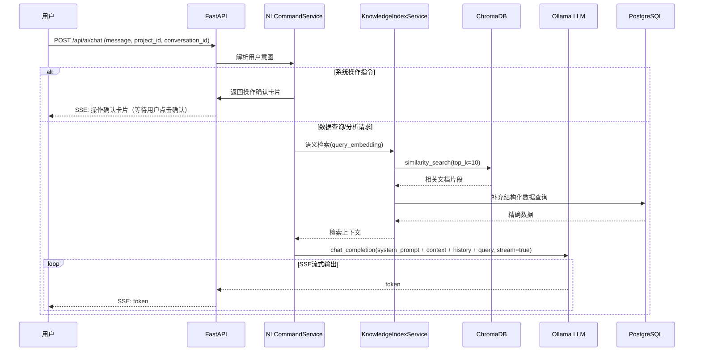
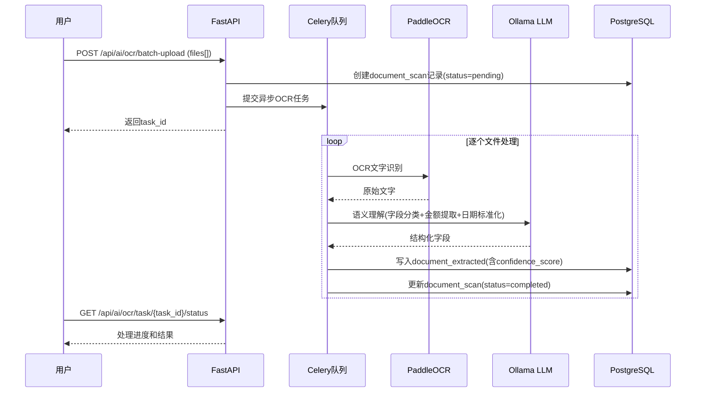
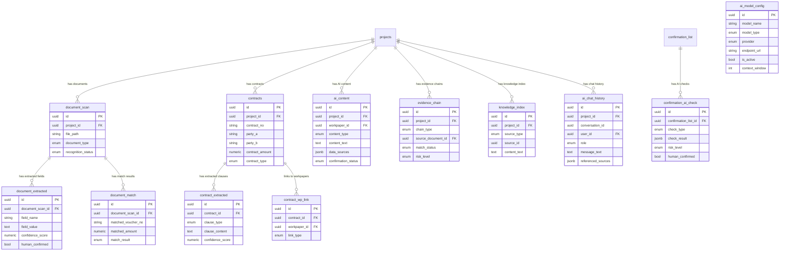

# 设计文档：第四阶段AI赋能 — 本地LLM+OCR单据识别+AI辅助底稿+合同分析+证据链验证+知识库对话+函证AI+自然语言操控

## 概述

本设计文档描述审计作业平台第四阶段AI赋能功能的技术架构与实现方案。在Phase 0/1/2/3基础上，叠加本地AI能力层。

技术栈：FastAPI + PostgreSQL + Redis + Celery + Ollama + PaddleOCR + ChromaDB + Vue 3 + Pinia（复用已有基础设施）

### 核心设计原则

1. **AI服务层抽象**：统一的AI能力接口，屏蔽底层模型差异，支持Ollama本地LLM+PaddleOCR+ChromaDB，预留模型切换能力
2. **本地优先**：所有AI处理在本地完成，审计数据不出内网，OCR和LLM均使用本地部署的引擎
3. **人机联动**：AI生成内容全部进入待确认状态，关键底稿强制人工确认，AI不触碰重大审计判断
4. **异步处理**：OCR批量识别、证据链验证、知识库索引等耗时任务通过Celery异步执行，不阻塞前端
5. **RAG增强**：AI对话基于项目知识库（ChromaDB）检索增强，确保回答基于项目实际数据

## 架构

### 整体架构

```mermaid
graph TB
    subgraph Frontend["前端 (Vue 3 + Pinia)"]
        CHAT[AI对话面板]
        OCR_UI[单据识别界面]
        CONTRACT_UI[合同分析界面]
        WP_AI[底稿AI填充]
        CHAIN_UI[证据链验证]
        CONFIRM_AI[函证AI辅助]
        NLP_CMD[自然语言操控]
        AI_DASH[AI内容看板]
    end

    subgraph API["API层 (FastAPI)"]
        R1[/api/ai/chat]
        R2[/api/ai/ocr]
        R3[/api/ai/contracts]
        R4[/api/ai/workpaper-fill]
        R5[/api/ai/evidence-chain]
        R6[/api/ai/confirmation-check]
        R7[/api/ai/health]
        R8[/api/ai/evaluate]
    end

    subgraph Services["AI服务层"]
        AIS[AIService 统一抽象]
        LLM[LLMService]
        OCRS[OCRService]
        EMB[EmbeddingService]
        KIS[KnowledgeIndexService]
        WFS[WorkpaperFillService]
        CAS[ContractAnalysisService]
        ECS[EvidenceChainService]
        CFS[ConfirmationAIService]
        NLS[NLCommandService]
        ACS[AIContentService]
    end

    subgraph Engines["AI引擎层"]
        OLL[Ollama LLM]
        POCR[PaddleOCR]
        CDB[ChromaDB]
    end

    subgraph Storage["存储层"]
        PG[(PostgreSQL)]
        RD[(Redis)]
        FS[(文件存储)]
    end

    Frontend --> API
    API --> Services
    AIS --> LLM --> OLL
    AIS --> OCRS --> POCR
    AIS --> EMB --> OLL
    KIS --> CDB
    Services --> PG
    Services --> RD
    Services --> FS
```

### AI对话RAG流程



### OCR单据识别流程



## 组件与接口

### 1. AI服务统一抽象层 (AIService)

```python
class AIService:
    """统一AI能力抽象，屏蔽底层模型差异"""

    async def chat_completion(self, messages: list[dict], model: str = None,
                               stream: bool = False, temperature: float = 0.3) -> AsyncGenerator | str:
        """LLM对话，支持同步和SSE流式输出"""

    async def embedding(self, text: str, model: str = None) -> list[float]:
        """文本向量化，用于知识库索引和语义检索"""

    async def ocr_recognize(self, image_path: str) -> OCRResult:
        """OCR文字识别，返回文字区域和置信度"""

    async def get_active_model(self, model_type: str) -> AIModelConfig:
        """获取当前激活的模型配置"""

    async def switch_model(self, model_name: str, model_type: str) -> bool:
        """切换模型，含可用性验证"""

    async def health_check(self) -> dict:
        """检查所有AI引擎健康状态（Ollama/PaddleOCR/ChromaDB）"""
```

### 2. OCR识别服务 (OCRService)

```python
class OCRService:
    # 12类单据的字段提取规则
    DOCUMENT_FIELD_RULES = {
        "sales_invoice": ["buyer_name", "amount", "tax_amount", "invoice_date", "invoice_no", "goods_name"],
        "purchase_invoice": ["seller_name", "amount", "tax_amount", "invoice_date", "invoice_no", "goods_name"],
        "bank_receipt": ["transaction_date", "counterparty_name", "amount", "summary", "transaction_type"],
        "bank_statement": ["transaction_date", "counterparty_name", "amount", "summary", "transaction_type"],
        "outbound_order": ["outbound_date", "product_name", "quantity", "unit_price", "amount", "customer"],
        "inbound_order": ["inbound_date", "product_name", "quantity", "unit_price", "amount", "supplier"],
        "logistics_order": ["ship_date", "receiver", "sender", "tracking_no", "sign_date"],
        "voucher": ["voucher_no", "date", "summary", "account", "debit_amount", "credit_amount", "attachment_count"],
        "expense_report": ["traveler", "date_range", "destination", "transport_fee", "hotel_fee", "subsidy", "approver"],
        "toll_invoice": ["date", "amount", "plate_number"],
        "contract": ["party_a", "party_b", "amount", "date", "terms"],
        "customs_declaration": ["declaration_date", "product_name", "quantity", "amount", "import_export_type"],
    }

    async def batch_recognize(self, project_id: UUID, file_paths: list[str]) -> str:
        """批量OCR识别，返回Celery task_id"""

    async def recognize_single(self, file_path: str) -> OCRResult:
        """单张单据OCR识别，≤5秒"""

    async def classify_document(self, ocr_text: str) -> str:
        """AI自动分类单据类型"""

    async def extract_fields(self, ocr_text: str, document_type: str) -> list[ExtractedField]:
        """AI语义理解，提取结构化字段"""

    async def match_with_ledger(self, document_scan_id: UUID, project_id: UUID) -> DocumentMatch:
        """单据数据与账面数据自动匹配"""
```

### 3. 底稿AI填充服务 (WorkpaperFillService)

```python
class WorkpaperFillService:
    async def generate_analytical_review(self, project_id: UUID, account_code: str,
                                          year: str) -> AIContent:
        """
        生成分析性复核初稿：
        1. 从trial_balance取本年/上年余额
        2. 计算变动额和变动率
        3. 从journal_entries取大额交易摘要
        4. 从auxiliary_balance取前N大客户/供应商
        5. 加载对应科目的审计复核提示词（TSJ/）作为分析维度参考
        6. LLM生成分析叙述（变动原因分析+异常标注+建议程序）
        """

    async def generate_workpaper_data(self, project_id: UUID, workpaper_id: UUID,
                                       template_type: str) -> list[AIContent]:
        """
        按底稿模板类型生成填充数据：
        - 表格数据（余额、发生额、明细）
        - 测试说明（抽样结果、核查说明）
        - 变动分析（同比/环比）
        - 风险提示（异常波动、超限标注）
        """

    async def generate_note_draft(self, project_id: UUID, note_section: str) -> AIContent:
        """按附注模板自动取数填充，生成初稿文字"""

    async def review_workpaper_with_prompt(self, project_id: UUID,
                                            workpaper_id: UUID) -> list[AIContent]:
        """
        提示词驱动的底稿AI智能复核：
        1. 通过workpaper_id查找wp_index获取audit_cycle
        2. 通过audit_cycle匹配TSJ/下对应的审计复核提示词文件
        3. 将提示词注入LLM system prompt，替换{{#sys.files#}}为实际底稿文件列表
        4. LLM按提示词框架逐项检查底稿（审计认定→程序执行→数据完整性→风险评估）
        5. 输出结构化复核发现（finding_type/severity/description/evidence_ref/remediation）
        6. 每个发现存入ai_content表（content_type=risk_alert）
        """

    async def load_review_prompt(self, audit_cycle: str) -> str:
        """
        加载审计复核提示词：
        - 按科目名称关键词匹配TSJ/下的.md文件
        - 如"货币资金"→"货币资金提示词.md"
        - 如"应收账款"→"应收账款审计复核提示词.md"
        - 未匹配到时返回通用复核提示词模板
        """

    async def check_pending_confirmations(self, project_id: UUID,
                                           workpaper_id: UUID) -> int:
        """检查底稿中未确认的AI内容数量"""
```

### 4. 合同分析服务 (ContractAnalysisService)

```python
class ContractAnalysisService:
    async def analyze_contract(self, contract_id: UUID) -> list[ContractExtracted]:
        """
        分析单个合同：
        1. 如果是扫描件，先OCR识别
        2. LLM提取关键条款（金额/账期/交货/违约/担保/关联方/特殊条款）
        3. 存入contract_extracted表
        """

    async def batch_analyze(self, project_id: UUID, file_paths: list[str]) -> str:
        """批量合同分析，返回Celery task_id"""

    async def cross_reference_ledger(self, contract_id: UUID, project_id: UUID) -> list[dict]:
        """
        合同与账面数据交叉比对：
        - 合同金额 vs 收入/成本科目发生额
        - 合同账期 vs 实际回款周期
        - 合同到期日 vs 审计基准日
        - 合同对方 vs 关联方清单
        """

    async def link_to_workpaper(self, contract_id: UUID, workpaper_id: UUID,
                                 link_type: str) -> ContractWPLink:
        """建立合同与底稿的关联"""

    async def generate_contract_summary(self, project_id: UUID) -> dict:
        """生成项目合同汇总报告"""
```

### 5. 证据链验证服务 (EvidenceChainService)

```python
class EvidenceChainService:
    # 证据链定义
    CHAIN_DEFINITIONS = {
        "revenue": ["contract", "order", "outbound_order", "logistics_order",
                     "sales_invoice", "voucher", "bank_receipt"],
        "purchase": ["purchase_contract", "purchase_order", "inbound_order",
                      "purchase_invoice", "voucher", "bank_payment"],
        "expense": ["travel_request", "expense_invoices", "expense_report",
                     "approval_record", "voucher"],
    }

    async def verify_revenue_chain(self, project_id: UUID) -> EvidenceChainReport:
        """收入循环证据链验证"""

    async def verify_purchase_chain(self, project_id: UUID) -> EvidenceChainReport:
        """采购循环证据链验证"""

    async def verify_expense_chain(self, project_id: UUID) -> EvidenceChainReport:
        """费用报销证据链验证"""

    async def analyze_bank_statements(self, project_id: UUID) -> BankAnalysisReport:
        """
        银行流水深度分析：
        - 大额异常交易识别
        - 资金体外循环检测（A→B→C→A闭环）
        - 关联方资金往来标注
        - 期末集中收付款标注
        - 非营业时间交易标注
        - 整数金额大额转账标注
        """

    async def generate_chain_summary(self, project_id: UUID,
                                      chain_type: str) -> dict:
        """生成证据链验证汇总报告"""
```

### 6. 知识库索引服务 (KnowledgeIndexService)

```python
class KnowledgeIndexService:
    async def build_index(self, project_id: UUID) -> int:
        """全量构建项目知识库索引，返回索引文档数"""

    async def incremental_update(self, project_id: UUID, source_type: str,
                                  source_id: UUID, content: str) -> None:
        """增量更新索引（数据变更时触发）"""

    async def semantic_search(self, project_id: UUID, query: str,
                               top_k: int = 10) -> list[SearchResult]:
        """语义检索，返回相关文档片段和相似度分数"""

    async def search_cross_year(self, project_id: UUID, prior_project_id: UUID,
                                 query: str) -> list[SearchResult]:
        """跨年度检索（当前项目+上年项目）"""

    async def lock_index(self, project_id: UUID) -> None:
        """归档时锁定索引为只读"""

    async def delete_index(self, project_id: UUID) -> None:
        """删除项目索引（项目删除时）"""
```

### 7. 函证AI辅助服务 (ConfirmationAIService)

```python
class ConfirmationAIService:
    async def verify_addresses(self, project_id: UUID,
                                confirmation_type: str) -> list[ConfirmationAICheck]:
        """
        批量地址核查：
        - 比对工商登记地址
        - 比对上年函证地址
        - 标注疑似异常地址
        - 银行函证校验开户行名称与网点地址
        """

    async def ocr_reply_scan(self, confirmation_list_id: UUID,
                              file_path: str) -> ConfirmationAICheck:
        """
        回函扫描件OCR识别：
        - 提取回函单位名称、确认金额、签章、回函日期
        - 与原始函证金额比对
        - 印章名称与函证对象比对
        """

    async def analyze_mismatch_reason(self, confirmation_list_id: UUID,
                                       project_id: UUID) -> str:
        """
        不符差异原因智能分析：
        - 匹配在途款项（期后银行流水/收付款记录）
        - 识别记账时间差（凭证日期比对）
        - 生成差异原因建议
        """

    async def check_seal(self, file_path: str,
                          expected_entity: str) -> SealCheckResult:
        """印章检测与名称比对"""
```

### 8. 自然语言指令服务 (NLCommandService)

```python
class NLCommandService:
    # 支持的指令类型
    COMMAND_TYPES = {
        "project_switch": r"切换到(.+)项目",
        "year_switch": r"切换到(\d{4})年度",
        "open_workpaper": r"打开(.+)底稿",
        "query_data": r"查询(.+)",
        "generate_analysis": r"生成(.+)分析",
        "show_difference": r"展示(.+)差异",
        "file_analysis": "file_upload_detected",
    }

    async def parse_intent(self, message: str, project_id: UUID,
                            attachments: list = None) -> CommandIntent:
        """
        解析用户意图：
        1. 正则匹配已知指令模式
        2. 如有附件，识别为文件分析请求
        3. 其余走RAG对话流程
        返回：intent_type, parameters, requires_confirmation
        """

    async def execute_command(self, intent: CommandIntent,
                               user_id: UUID) -> CommandResult:
        """执行已确认的系统操作指令"""

    async def analyze_file(self, file_path: str, project_id: UUID) -> str:
        """单文件智能分析"""

    async def analyze_folder(self, folder_path: str, project_id: UUID) -> dict:
        """文件夹批量分析"""
```

### 9. AI内容管理服务 (AIContentService)

```python
class AIContentService:
    async def create_content(self, project_id: UUID, workpaper_id: UUID,
                              content_type: str, content_text: str,
                              data_sources: list, confidence_level: str) -> AIContent:
        """创建AI生成内容记录（初始状态pending）"""

    async def confirm_content(self, content_id: UUID, user_id: UUID,
                               action: str, modification_note: str = None) -> AIContent:
        """确认AI内容：accept/modify/reject/regenerate"""

    async def get_pending_count(self, project_id: UUID,
                                 workpaper_id: UUID = None) -> int:
        """获取未确认AI内容数量"""

    async def get_project_summary(self, project_id: UUID) -> AIContentSummary:
        """项目AI内容汇总统计"""

    async def check_phase_gate(self, project_id: UUID) -> bool:
        """检查是否有未确认AI内容阻止阶段转换"""

    async def check_boundary(self, task_description: str) -> bool:
        """检查请求是否触碰AI不可处理的边界"""
```

## 组件与接口（续）

### 10. API接口设计

#### 10.1 AI服务管理 API

| 方法 | 路径 | 说明 |
|------|------|------|
| GET | `/api/ai/health` | AI引擎健康检查（Ollama/PaddleOCR/ChromaDB） |
| GET | `/api/ai/models` | 可用模型列表 |
| PUT | `/api/ai/models/{id}/activate` | 激活指定模型 |
| POST | `/api/ai/evaluate` | LLM能力评估（审计领域测试） |

#### 10.2 OCR单据识别 API

| 方法 | 路径 | 说明 |
|------|------|------|
| POST | `/api/ai/ocr/upload` | 单张单据上传+识别 |
| POST | `/api/ai/ocr/batch-upload` | 批量上传+异步识别 |
| GET | `/api/ai/ocr/task/{task_id}` | 异步任务进度查询 |
| GET | `/api/projects/{id}/documents` | 项目单据列表（分页+筛选） |
| GET | `/api/projects/{id}/documents/{did}/extracted` | 单据提取结果 |
| PUT | `/api/projects/{id}/documents/{did}/extracted/{eid}` | 人工修正提取字段 |
| POST | `/api/projects/{id}/documents/{did}/match` | 触发账面数据匹配 |

#### 10.3 AI辅助底稿 API

| 方法 | 路径 | 说明 |
|------|------|------|
| POST | `/api/ai/workpaper-fill` | 生成底稿填充内容 |
| POST | `/api/ai/analytical-review` | 生成分析性复核初稿 |
| POST | `/api/ai/note-draft` | 生成附注初稿 |
| GET | `/api/projects/{id}/ai-content` | 项目AI内容列表 |
| PUT | `/api/projects/{id}/ai-content/{cid}/confirm` | 确认AI内容 |
| GET | `/api/projects/{id}/ai-content/summary` | AI内容汇总统计 |
| GET | `/api/projects/{id}/ai-content/pending-count` | 未确认数量 |

#### 10.4 合同分析 API

| 方法 | 路径 | 说明 |
|------|------|------|
| POST | `/api/projects/{id}/contracts/upload` | 上传合同文件 |
| POST | `/api/projects/{id}/contracts/batch-analyze` | 批量合同分析 |
| GET | `/api/projects/{id}/contracts` | 合同列表 |
| GET | `/api/projects/{id}/contracts/{cid}/extracted` | 合同条款提取结果 |
| POST | `/api/projects/{id}/contracts/{cid}/cross-reference` | 合同与账面交叉比对 |
| POST | `/api/projects/{id}/contracts/{cid}/link-workpaper` | 关联底稿 |
| GET | `/api/projects/{id}/contracts/summary` | 合同汇总报告 |

#### 10.5 证据链验证 API

| 方法 | 路径 | 说明 |
|------|------|------|
| POST | `/api/projects/{id}/evidence-chain/revenue` | 收入循环证据链验证 |
| POST | `/api/projects/{id}/evidence-chain/purchase` | 采购循环证据链验证 |
| POST | `/api/projects/{id}/evidence-chain/expense` | 费用报销证据链验证 |
| POST | `/api/projects/{id}/evidence-chain/bank-analysis` | 银行流水深度分析 |
| GET | `/api/projects/{id}/evidence-chain` | 证据链验证结果列表 |
| GET | `/api/projects/{id}/evidence-chain/summary/{type}` | 验证汇总报告 |

#### 10.6 AI对话 API

| 方法 | 路径 | 说明 |
|------|------|------|
| POST | `/api/ai/chat` | AI对话（SSE流式输出） |
| GET | `/api/projects/{id}/chat/history` | 对话历史 |
| POST | `/api/ai/chat/file-analysis` | 文件智能分析 |
| POST | `/api/ai/chat/folder-analysis` | 文件夹批量分析 |
| DELETE | `/api/projects/{id}/chat/conversations/{cid}` | 删除对话 |

#### 10.7 函证AI辅助 API

| 方法 | 路径 | 说明 |
|------|------|------|
| POST | `/api/projects/{id}/confirmations/ai/address-verify` | 批量地址核查 |
| POST | `/api/projects/{id}/confirmations/{cid}/ai/ocr-reply` | 回函扫描件OCR |
| POST | `/api/projects/{id}/confirmations/{cid}/ai/mismatch-analysis` | 不符差异分析 |
| GET | `/api/projects/{id}/confirmations/ai/checks` | AI检查结果列表 |
| PUT | `/api/projects/{id}/confirmations/ai/checks/{chk}/confirm` | 确认AI检查结果 |

### 11. 前端页面设计

#### 11.1 AI对话面板
项目页面右侧可折叠侧边栏：
- SSE流式输出，Markdown渲染
- 多轮对话历史，按conversation_id分组
- 文件拖入/选择上传区域
- 系统操作确认卡片（操作名称+参数+确认/取消按钮）
- 数据来源引用标签（点击跳转到源数据）
- 项目上下文自动注入（项目名/年度/公司/重要性水平）

#### 11.2 单据识别页面
Tab切换（按单据类型分类）：
- 批量上传区域（拖拽+点击，支持图片/PDF）
- 识别进度条（异步任务进度）
- 识别结果表格（字段名/字段值/置信度/确认状态）
- 低置信度字段红色高亮
- 人工修正编辑功能
- 与账面数据匹配结果展示

#### 11.3 合同分析页面
双栏布局：
- 左栏：合同文件预览（PDF/图片）
- 右栏：AI提取的关键条款列表（条款类型/内容/置信度）
- 底部：与账面数据交叉比对结果
- 关联底稿操作按钮
- 批量分析进度和汇总报告

#### 11.4 证据链验证页面
三Tab（收入循环/采购循环/费用报销）：
- 证据链可视化流程图（节点=单据，连线=匹配关系，红色=缺失/不一致）
- 异常清单表格（风险等级/异常描述/涉及单据/建议程序）
- 银行流水分析独立Tab（大额交易/循环转账/关联方往来/期末集中收付）
- 验证汇总统计卡片（总数/匹配/不匹配/缺失/高风险）

#### 11.5 函证AI辅助面板
嵌入函证管理页面的AI辅助区域：
- 地址核查结果列表（地址/核查结果/风险等级/确认状态）
- 回函OCR识别结果（提取字段/金额比对/印章检测）
- 不符差异原因建议
- 所有结果标注"AI辅助-待人工确认"

#### 11.6 AI内容管理看板
项目级AI内容统计视图：
- 汇总卡片（总数/已确认/待确认/已拒绝/修改率）
- 按底稿分组的AI内容列表
- 按内容类型筛选（数据填充/分析复核/风险提示/测试摘要/附注初稿）
- 批量确认/拒绝操作

## 数据模型

### ER图（12张AI相关表）



## 正确性属性 (Correctness Properties)

### Property 1: AI内容必须标注且可追溯

*对于任意*AI生成的内容，ai_content表中必须存在对应记录，包含data_sources（数据来源）、generation_model（模型版本）、generation_time（生成时间）；导出的PDF档案中AI内容必须保留"AI辅助生成"标签。

**Validates: Requirements 9.1, 9.2**

### Property 2: AI内容确认状态完整性

*对于任意*AI内容状态变更（pending→accepted/modified/rejected/regenerated），ai_content表必须记录confirmed_by和confirmed_at；confirmation_status="pending"的内容不得参与审定数据计算。

**Validates: Requirements 3.4, 3.5**

### Property 3: 关键底稿AI内容强制确认门控

*对于任意*关键底稿（收入、应收/应付、存货减值、长投、合并、或有负债、关联方、持续经营、期后事项），提交复核时ai_content中不得存在confirmation_status="pending"的记录。

**Validates: Requirements 3.5**

### Property 4: 项目阶段转换AI内容门控

*对于任意*项目从completion到reporting的阶段转换，全项目范围内ai_content中不得存在confirmation_status="pending"的记录。

**Validates: Requirements 9.5**

### Property 5: AI边界不可逾越

*对于任意*AI请求，当请求涉及重大审计判断、减值/公允/预计负债估计、舞弊风险识别结论、合并范围判断、审计意见类型时，AI_Service必须拒绝生成结论性内容，仅提供数据参考。

**Validates: Requirements 9.3**

### Property 6: OCR置信度低于阈值强制人工复核

*对于任意*OCR提取字段，当confidence_score < 0.80时，该字段必须在界面中高亮标注，且human_confirmed必须为true后才能用于审计分析。

**Validates: Requirements 2.5**

### Property 7: 单据OCR处理时间约束

*对于任意*单张单据OCR识别请求，从提交到返回结构化结果的端到端时间不超过5秒。

**Validates: Requirements 2.4**

### Property 8: AI对话首字输出时间约束

*对于任意*AI对话请求，SSE流式输出的首个token必须在3秒内返回。

**Validates: Requirements 6.3**

### Property 9: 函证AI检查结果强制人工确认

*对于任意*函证AI辅助检查结果（地址核查/回函OCR/金额比对/印章检测），human_confirmed必须为true后函证才能标记为完成。

**Validates: Requirements 7.5**

### Property 10: 证据链匹配结果与风险等级一致性

*对于任意*证据链验证结果，当match_status为"missing"或"mismatched"时，必须生成对应的ai_content记录（content_type="risk_alert"）关联到对应底稿。

**Validates: Requirements 5.5**

### Property 11: 合同交叉比对自动触发

*对于任意*已完成分析的合同（analysis_status="completed"），系统必须自动执行与账面数据的交叉比对（金额/账期/到期日/关联方四项检查）。

**Validates: Requirements 4.3**

### Property 12: 知识库索引增量更新

*对于任意*项目数据变更（数据导入/底稿编辑/调整分录/函证结果），knowledge_index必须在变更后触发增量更新；归档后的索引必须锁定为只读。

**Validates: Requirements 6.2, 6.7**

### Property 13: AI服务降级不阻塞核心流程

*对于任意*Ollama/PaddleOCR/ChromaDB服务不可用的情况，核心审计流程（数据导入/底稿编辑/调整分录/报表生成/复核/归档）必须正常运行，AI功能显示"AI服务暂不可用"。

**Validates: Requirements 1.6**

### Property 14: 数据本地处理不外传

*对于任意*AI处理请求，审计客户数据（单据扫描件/合同文本/财务数据）必须仅在本地Ollama和PaddleOCR中处理，不得传输到任何外部API端点。

**Validates: Requirements 9.6**

### Property 15: 函证差异原因AI分析数据来源

*对于任意*函证不符差异的AI分析，分析结果必须基于可验证的数据来源（期后银行流水/收付款记录/凭证日期），且分析结果标注为建议性质，不作为最终结论。

**Validates: Requirements 7.6**

### Property 16: 模型切换可用性验证

*对于任意*模型切换操作，新模型必须通过10秒内的测试prompt验证后才能激活；验证失败时保持原模型不变。

**Validates: Requirements 1.4**

## 错误处理

### 错误分类与处理策略

| 错误类别 | 严重级别 | 处理方式 | 示例 |
|---|---|---|---|
| AI服务不可用 | warning | 降级运行，AI功能显示不可用提示 | Ollama容器未启动 |
| OCR识别失败 | warning | 标记document_scan.recognition_status=failed，允许重试 | 图片模糊无法识别 |
| OCR低置信度 | info | 高亮标注，要求人工复核 | 手写字体识别置信度0.5 |
| LLM生成超时 | warning | 返回部分结果+超时提示，允许重试 | 复杂分析超过30秒 |
| 知识库索引失败 | warning | 记录失败日志，不影响其他功能 | ChromaDB连接超时 |
| AI边界违规请求 | reject | 返回边界提示，不生成内容 | 请求AI判断审计意见类型 |
| 合同解析失败 | warning | 标记analysis_status=failed，允许重试或手工录入 | 合同格式异常 |
| 证据链数据不足 | info | 标注缺失环节，不阻断验证 | 缺少物流单数据 |
| 模型切换失败 | reject | 保持原模型，返回失败原因 | 新模型不存在或无法响应 |
| 向量库容量不足 | warning | 提示清理历史索引或扩容 | ChromaDB存储空间不足 |
