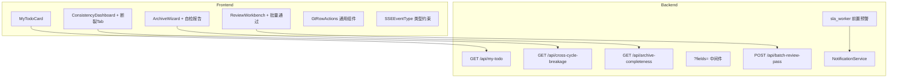

# Design Document — Phase 5 运营卓越

## 一、概述（Overview）

Phase 5 聚焦 10 项高 ROI 运营改进，覆盖前端体验（F1/F2/F3/F7/F9）、后端性能（F5/F6）、代码治理（F4/F8/F10）三大维度。设计原则：最小侵入、零 breaking change、向后兼容。

---

## 二、架构（Architecture）

### 整体架构图



### ADR（Architecture Decision Records）

#### ADR-1: 待办聚合采用单端点 + 内存排序

- **决策**：新增 `GET /api/projects/{project_id}/my-todo` 端点，单次查询聚合 4 类紧急度数据，在 Python 层排序后返回
- **理由**：50 底稿规模下内存排序 < 5ms，无需 Redis 缓存；避免引入新依赖
- **替代方案**：Redis sorted set 预计算 → 过度设计，增加运维复杂度

#### ADR-2: 字段选择采用查询参数 + 动态 SQLAlchemy column 投影

- **决策**：`?fields=id,wp_code,status` 查询参数，后端解析后动态构建 `select(col1, col2, ...)` 而非 `select(Model)`
- **理由**：最小侵入（不改模型），性能收益直接（PG 不读 JSONB 列），兼容现有分页/排序
- **替代方案**：GraphQL → 引入过重；Response Model 多版本 → 维护成本高

#### ADR-3: router_registry 拆分为 domain 子模块

- **决策**：新建 `backend/app/router_registry/` 包，按业务域拆为 5+ 文件，`__init__.py` 保留 `register_all_routers(app)` 入口
- **理由**：Python 包结构天然支持按文件组织；`__init__.py` 统一入口保证 main.py 零改动
- **替代方案**：保持单文件 + region 注释 → 不解决根本问题

#### ADR-4: SLA 前置预警复用现有 sla_worker 循环

- **决策**：在 `sla_worker.run()` 主循环中新增 `_check_prewarning()` 分支，复用 15 分钟检查间隔
- **理由**：无需新 worker；预警检查与超时检查天然同频；幂等通过 Redis key `sla:warned:{wp_id}:{level}` 实现
- **替代方案**：独立 worker → 增加进程管理复杂度

#### ADR-5: 批量复核通过采用单事务 + 跳过模式

- **决策**：后端在单个 DB 事务中遍历所有选中底稿，状态不允许的跳过并记录原因，最终一次 commit
- **理由**：requirements 明确"单事务"；跳过模式比全回滚更友好（经理不需要因 1 个异常重做全部）
- **注意**：requirements 写"任一失败全部回滚"但验收标准 7.5 写"跳过并报告" → 以验收标准为准（跳过 ≠ 失败）

#### ADR-6: GtRowActions 采用 priority 排序 + 阈值 2

- **决策**：组件接收 `actions: RowAction[]`，按 `priority` 升序排列，前 2 个外露，其余收入 el-dropdown
- **理由**：阈值 2 是用户明确要求；priority 排序让业务方可控

#### ADR-7: SSE 事件类型采用已有 EventType 枚举同步

- **决策**：后端已有 `EventType(str, Enum)` 在 `backend/app/models/audit_platform_schemas.py`（26 个值），前端 `SSEEventType` union type 直接对齐此枚举；无需新建常量文件
- **理由**：EventType 枚举已是单一真源，前端只需镜像；CI 中 vue-tsc 编译检查确保同步
- **替代方案**：JSON Schema codegen → 引入新工具链，ROI 不足

---

## 三、组件与接口（Components and Interfaces）

### F1 待办聚合

```python
# backend/app/routers/my_todo.py
# GET /api/projects/{project_id}/my-todo
# Response: MyTodoResponse

class TodoItem(BaseModel):
    wp_id: UUID
    wp_code: str
    wp_name: str
    cycle: str
    urgency: Literal["critical", "high", "medium", "normal"]  # 红/橙/黄/灰
    urgency_reason: str
    updated_at: datetime

class MyTodoResponse(BaseModel):
    items: list[TodoItem]
    total: int
```

紧急度计算逻辑：
1. `critical`（红）：prefill_stale = true
2. `high`（橙）：SLA 剩余 ≤ 24h
3. `medium`（黄）：有未解决复核意见
4. `normal`（灰）：普通未完成

### F2 跨循环断裂清单

```python
# backend/app/routers/cross_cycle_breakage.py
# GET /api/projects/{project_id}/cross-cycle-breakage
# Response: BreakageListResponse

class BreakageRecord(BaseModel):
    ref_id: str
    source_wp_code: str
    target_wp_code: str
    severity: Literal["blocking", "required", "warning", "recommended", "info"]
    reason: Literal["target_missing", "target_stale"]  # 断裂原因
    last_checked_at: datetime

class BreakageSummary(BaseModel):
    blocking: int
    required: int
    warning: int
    recommended: int
    info: int
    info: int

class BreakageListResponse(BaseModel):
    items: list[BreakageRecord]
    summary: BreakageSummary
```

### F3 归档前完整性自检报告

```python
# backend/app/routers/archive_completeness.py
# GET /api/projects/{project_id}/archive-completeness-report
# Response: CompletenessReportResponse

class CheckItem(BaseModel):
    wp_code: str
    wp_name: str
    assignee: str | None
    status: str

class CheckCategory(BaseModel):
    category: Literal["missing", "unsigned", "unresolved_reviews", "stale"]
    count: int
    items: list[CheckItem]
    is_blocking: bool

class CompletenessReportResponse(BaseModel):
    categories: list[CheckCategory]  # 固定 4 类
    can_proceed: bool  # 无 blocking 项时 True
    generated_at: datetime
```

### F5 字段选择

```python
# backend/app/core/field_selection.py — 通用依赖

from fastapi import Query

def parse_fields(fields: str | None = Query(None)) -> set[str] | None:
    """解析 ?fields=id,wp_code,status → {'id', 'wp_code', 'status'}"""
    if not fields:
        return None
    return {f.strip() for f in fields.split(",") if f.strip()}

# 使用方式：在列表端点中
# columns = resolve_columns(Model, requested_fields, default_fields, blocked_fields)
```

默认摘要字段（WorkpaperList）：`id, wp_code, wp_name, status, cycle, assignee_id, updated_at, created_at`
屏蔽字段：`parsed_data, file_content, raw_html`

### F6 SLA 前置预警

```python
# backend/app/workers/sla_worker.py — 扩展

async def _check_prewarning(db: AsyncSession) -> int:
    """检查即将超时的问题单（IssueTicket），生成前置预警通知。
    
    注意：SLA 监控对象是 IssueTicket.due_at，非 working_paper（无 deadline 字段）。
    """
    now = datetime.utcnow()
    t_24h = now + timedelta(hours=24)
    t_8h = now + timedelta(hours=8)
    
    # 查询 due_at 在 (now, now+24h] 的未完成问题单
    # 按 Redis key 幂等去重
    # 生成 Notification 记录
    ...
```

幂等 key 格式：`sla:prewarning:{ticket_id}:{level}` TTL=24h

### F7 批量复核通过

```python
# backend/app/routers/batch_review.py
# POST /api/projects/{project_id}/batch-review-pass

class BatchReviewRequest(BaseModel):
    wp_ids: list[UUID]
    comment: str = "已审阅，无异议"

class BatchReviewResult(BaseModel):
    success_count: int
    skipped_count: int
    skipped_items: list[dict]  # [{wp_id, reason}]
```

RBAC：仅 `manager` / `partner` / `admin` 角色可调用。

### F9 GtRowActions 组件

```typescript
// frontend/src/components/common/GtRowActions.vue
interface RowAction {
  key: string
  label: string
  icon?: string
  priority: number      // 越小越优先外露
  disabled?: boolean
  danger?: boolean
  hidden?: boolean
}

// Props
defineProps<{
  actions: RowAction[]
  maxVisible?: number   // 默认 2
}>()

// Emits
defineEmits<{
  action: [key: string]
}>()
```

### F10 SSE 事件类型

```python
# 后端已有：backend/app/models/audit_platform_schemas.py
# class EventType(str, enum.Enum) — 26 个值，格式 domain.action
# 无需新建文件，前端直接镜像此枚举
```

```typescript
// frontend/src/types/sse.ts
// 镜像后端 EventType 枚举（26 个值）
export type SSEEventType =
  | 'adjustment.created'
  | 'adjustment.updated'
  | 'adjustment.deleted'
  | 'mapping.changed'
  | 'data.imported'
  | 'import.rolled_back'
  | 'import.progress'
  | 'materiality.changed'
  | 'trial_balance.updated'
  | 'reports.updated'
  | 'workpaper.saved'
  | 'note.updated'
  | 'review_record.created'
  | 'ledger.import_detected'
  | 'ledger.import_submitted'
  | 'ledger.import_failed'
  | 'ledger.dataset_validated'
  | 'ledger.dataset_activated'
  | 'ledger.dataset_rolled_back'
  | 'sync.failed'
  | 'workpaper.assigned'
  | 'presence.joined'
  | 'presence.left'
  | 'presence.editing_started'
  | 'presence.editing_stopped'
  // 预留扩展（后端新增时前端同步）

// 收窄 SyncEventPayload
export interface SyncEventPayload {
  event_type: SSEEventType  // 从 string 收窄
  project_id: string
  // ...
}
```

---

## 四、数据模型（Data Models）

### F1 无新表

复用现有 `working_paper` + `wp_index` + `review_records` + `issue_tickets` 表联合查询。

### F2 无新表

读取 `backend/data/cross_wp_references.json`（400 条）的引用定义，运行时 JOIN `working_paper` + `wp_index` 表判断 target 是否断裂：
- `target_missing`：项目内无对应 wp_code 的底稿（wp_index 中不存在或 working_paper 已删除）
- `target_stale`：target 底稿存在但 `prefill_stale=true`

注意：CWR JSON 无 `is_broken` 静态字段，断裂状态是运行时计算的。

### F3 无新表

聚合查询 `working_paper` + `wp_index` + `review_records` + `signatures` 表。

### F5 无 schema 变更

仅改变 SELECT 投影列，不改表结构。

### F6 预警记录

复用现有 `notifications` 表：
```sql
-- 现有 Notification 模型字段足够
-- type = 'sla_prewarning'
-- level = 'yellow' | 'orange'
-- metadata JSONB = {wp_id, remaining_hours, assignee, cycle}
```

幂等去重通过 Redis key 实现，不需要新表。

### F7 无新表

复用 `review_records` 表，批量 INSERT + UPDATE `working_paper.status`。

---

## 五、正确性属性（Correctness Properties）

*A property is a characteristic or behavior that should hold true across all valid executions of a system—essentially, a formal statement about what the system should do. Properties serve as the bridge between human-readable specifications and machine-verifiable correctness guarantees.*

### Property 1: 待办紧急度排序正确性

*For any* set of workpapers assigned to a user with mixed urgency levels (stale, SLA approaching, unresolved reviews, normal), the returned todo list should be sorted such that every item with a higher urgency tier always appears before any item with a lower urgency tier (critical > high > medium > normal).

**Validates: Requirements 1.1, 1.2**

### Property 2: 待办响应字段完整性

*For any* todo item in the response, it must contain all required fields: wp_id, wp_code, wp_name, cycle, urgency, updated_at — none of which may be null.

**Validates: Requirements 1.4**

### Property 3: 断裂清单过滤正确性

*For any* set of cross_wp_references, the breakage list should contain exactly those entries where `is_broken=true` OR the target workpaper has `prefill_stale=true`, and no other entries.

**Validates: Requirements 2.2**

### Property 4: 断裂清单 severity 排序

*For any* breakage list, items should be sorted by severity descending (blocking before warning before info), and within the same severity, by last_checked_at descending.

**Validates: Requirements 2.3**

### Property 5: 断裂统计摘要一致性

*For any* breakage list response, `summary.blocking + summary.warning + summary.info` should equal `len(items)`, and each count should equal the number of items with that severity.

**Validates: Requirements 2.6**

### Property 6: 完整性报告结构不变量

*For any* generated completeness report, it must contain exactly 4 categories (missing, unsigned, unresolved_reviews, stale), and for each category, `count` must equal `len(items)`.

**Validates: Requirements 3.2, 3.3**

### Property 7: 归档阻断逻辑

*For any* completeness report, `can_proceed` is True if and only if no category has `is_blocking=true` with `count > 0`.

**Validates: Requirements 3.4, 3.5**

### Property 8: 路由拆分后路径保持不变

*For any* API route registered before the split, the exact same path + method combination must exist after the split (set equality of all registered routes).

**Validates: Requirements 4.3**

### Property 9: 字段选择过滤正确性

*For any* valid fields parameter and any response object, the response should contain only the intersection of requested fields and model's actual fields (invalid field names silently ignored, no extra fields returned).

**Validates: Requirements 5.1, 5.4**

### Property 10: 字段选择与分页/排序正交

*For any* combination of `?fields=` with `?page=&page_size=&sort_by=`, the pagination metadata (total, page, page_size) and sort order should be identical to the same query without `?fields=`.

**Validates: Requirements 5.6**

### Property 11: SLA 预警级别分类正确性

*For any* workpaper with a deadline, if `0 < remaining_hours ≤ 8` the warning level should be "orange", if `8 < remaining_hours ≤ 24` the level should be "yellow", and if `remaining_hours > 24` no warning should be generated.

**Validates: Requirements 6.1, 6.2**

### Property 12: SLA 预警幂等性

*For any* workpaper and warning level, running the prewarning check N times (N ≥ 2) with the same state should produce exactly 1 notification (not N notifications).

**Validates: Requirements 6.5**

### Property 13: SLA 预警自动解决

*For any* workpaper that has an active prewarning notification, if the workpaper status changes to "completed", the notification should be marked as resolved.

**Validates: Requirements 6.6**

### Property 14: 批量复核事务原子性

*For any* batch of workpapers submitted for review pass where all are in valid state, either all are updated to "passed" status, or (on DB error) none are updated.

**Validates: Requirements 7.4**

### Property 15: 批量复核跳过 + 计数不变量

*For any* batch review result, `success_count + skipped_count` must equal the number of submitted wp_ids, and each skipped item must have a non-empty reason.

**Validates: Requirements 7.5, 7.6**

### Property 16: GtRowActions 可见性逻辑

*For any* action list with N non-hidden items and maxVisible=M, the number of directly visible buttons should be `min(N, M)`, and they should be the M items with the lowest priority values. The remaining `max(0, N-M)` items should appear in the dropdown.

**Validates: Requirements 9.2, 9.3, 9.5**

---

## 六、错误处理（Error Handling）

| 场景 | 处理方式 |
|------|----------|
| F1 待办查询超时 | 返回空列表 + `X-Degraded: true` header |
| F2 cross_wp_references.json 读取失败 | 返回 503 + 错误消息 |
| F3 完整性报告生成超时 | 返回部分结果 + warning 标记 |
| F5 ?fields= 全部无效 | 返回默认字段集（不报错） |
| F6 Redis 不可用（幂等 key 写入失败） | 降级为不去重，允许重复通知（宁多勿漏） |
| F6 Notification 写入失败 | 记录 warning 日志，不阻断 worker 循环 |
| F7 批量操作中 DB 连接断开 | 事务自动回滚，返回 500 |
| F7 非授权角色调用 | 返回 403 Forbidden |
| F9 actions 为空数组 | 组件不渲染任何内容 |
| F10 后端新增事件未同步前端 | vue-tsc CI 报错阻断合并 |

---

## 七、测试策略（Testing Strategy）

### 测试框架

- **后端**：pytest + hypothesis（PBT）
- **前端**：vitest + @vue/test-utils
- **PBT 配置**：每个 property test 最少 100 iterations
- **标签格式**：`Feature: phase5-operational-excellence, Property {N}: {title}`

### 双轨测试方法

**Property-Based Tests（验证通用正确性）**：
- P1: 紧急度排序 — 生成随机底稿集合，验证排序不变量
- P3: 断裂过滤 — 生成随机 CWR 数据，验证过滤正确性
- P5: 统计摘要 — 生成随机断裂列表，验证计数一致性
- P7: 归档阻断 — 生成随机报告，验证 can_proceed 逻辑
- P9: 字段选择 — 生成随机字段组合，验证过滤行为
- P11: SLA 级别 — 生成随机时间差，验证分类正确性
- P12: 幂等性 — 多次调用验证通知数量不变
- P15: 批量计数 — 生成随机批次，验证 success + skipped = total
- P16: 按钮可见性 — 生成随机 action 列表，验证显隐逻辑

**Unit Tests（验证具体场景和边界）**：
- F1: 空待办 / 单类型 / 混合类型排序
- F2: 全部正常（无断裂）/ 全部断裂 / 混合 severity
- F3: 全部通过 / 有 blocking / PDF 导出
- F4: 拆分前后路由集合相等（回归）
- F5: 默认字段 / 指定字段 / 无效字段 / 空 fields
- F6: 恰好 24h 边界 / 恰好 8h 边界 / 已完成不预警
- F7: 全部成功 / 全部跳过 / 混合 / 权限拒绝
- F8: ESLint 规则触发 / 豁免生效
- F9: 0 个按钮 / 1 个 / 2 个 / 5 个 / 含 hidden
- F10: vue-tsc 编译零错误

### 测试文件清单

| 文件 | 覆盖 |
|------|------|
| `backend/tests/test_my_todo_aggregation.py` | F1 + P1 + P2 |
| `backend/tests/test_cross_cycle_breakage.py` | F2 + P3 + P4 + P5 |
| `backend/tests/test_archive_completeness_report.py` | F3 + P6 + P7 |
| `backend/tests/test_router_registry_split.py` | F4 + P8 |
| `backend/tests/test_field_selection.py` | F5 + P9 + P10 |
| `backend/tests/test_sla_prewarning.py` | F6 + P11 + P12 + P13 |
| `backend/tests/test_batch_review_pass.py` | F7 + P14 + P15 |
| `frontend/src/__tests__/GtRowActions.spec.ts` | F9 + P16 |
| `frontend/src/__tests__/sseEventTypes.spec.ts` | F10 |
| `frontend/src/__tests__/MyTodoCard.spec.ts` | F1 前端 |
| `frontend/src/__tests__/CrossCycleBreakageTab.spec.ts` | F2 前端 |
| `frontend/src/__tests__/ArchiveCompletenessReport.spec.ts` | F3 前端 |
