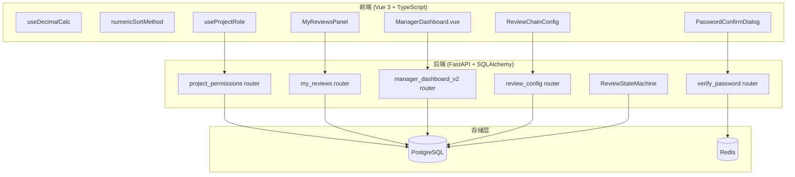

# Design Document — Phase 6: 数值精度 + 权限统一 + 安全加固

## 变更记录

| 版本 | 日期 | 变更内容 |
|------|------|----------|
| v1.0 | 2026-05-22 | 初始设计，基于 requirements.md v1.1 |

---

## Overview

Phase 6 聚焦三个维度：**数值精度**（F1/F2/F3）、**权限统一**（F4/F5/F7/F8）、**安全加固**（F6）。

核心目标：
- 消除前端金额浮点精度风险（Decimal.js + ESLint 防护）
- 统一项目级权限模型（API 端点 + composable + 路由守卫改造）
- 高危操作二次验证（confirmation_token 机制）
- 复核流程灵活化（2-4 级可配置状态机）

### 实施顺序约束

```
F1 ─┐
F2 ─┤ 可并行（数值精度层，无依赖）
F3 ─┘
F4 ──→ F8（F8 依赖 F4 权限端点）
F5 ─┐
F6 ─┤ 可并行（独立功能）
F7 ─┘
```

---

## Architecture

### 系统分层视图



### ADR（Architecture Decision Records）

#### ADR-1: Decimal.js 而非 Big.js / bignumber.js

**决策**：选用 `decimal.js`（v10.x）作为前端高精度运算库。

**理由**：
- 支持 `ROUND_HALF_EVEN`（银行家舍入），Big.js 不支持
- API 与 Python `Decimal` 语义对齐（toFixed/precision/rounding mode）
- 包体积 32KB gzipped，可接受
- 社区活跃度高（npm weekly 12M+）

**替代方案**：bignumber.js（API 类似但不支持 ROUND_HALF_EVEN 原生模式）

---

#### ADR-2: ESLint 自定义规则实现方式 — 本地插件

**决策**：F1/F2 的 ESLint 规则以本地插件形式实现（`eslint-local-rules/` 目录），不发布 npm 包。

**理由**：
- 规则高度业务定制（金额变量名模式匹配），不适合通用发布
- 本地插件零发布成本，修改即生效
- `eslint-plugin-local-rules` 已有成熟方案

**配置**：
```js
// .eslintrc.js
plugins: ['local-rules'],
rules: {
  'local-rules/no-amount-arithmetic': 'warn',
  'local-rules/no-amount-unit-in-script': 'warn',
}
```

---

#### ADR-3: confirmation_token 存储 — Redis + UUID

**决策**：二次验证 token 使用 UUID v4 生成，存储在 Redis（key=`confirm:{token}`, value=`{user_id}`, TTL=300s）。

**理由**：
- Redis 原生 TTL 自动过期，无需定时清理
- UUID v4 不可预测，防暴力猜测
- 一次性使用通过 `GET + DEL` 原子操作（GETDEL 命令）实现
- 与现有 Redis 基础设施复用（已有 sentinel 配置）

**替代方案**：JWT 签名 token（无法实现一次性使用，需额外黑名单）

---

#### ADR-4: 项目级权限 — 角色→权限映射表后端化

**决策**：`/api/projects/{id}/my-permissions` 端点在后端完成 role→permissions 映射，前端仅消费权限列表。

**理由**：
- 权限映射逻辑集中在后端，避免前后端不同步
- 前端 `usePermission.ts` 的 `ROLE_PERMISSIONS` 硬编码作为 fallback（离线/缓存失效时）
- 项目级角色（ProjectAssignment.role）与系统角色（User.role）合并计算

**映射规则**：
```python
PROJECT_ROLE_PERMISSIONS = {
    "manager": ["review_config:edit", "review:approve_l1", "assignment:manage", ...],
    "signing_partner": ["sign:execute", "archive:execute", "review:approve_l2", ...],
    "auditor": ["workpaper:edit", "workpaper:submit_review", ...],
    "eqcr": ["eqcr:approve", "shadow_compute", ...],
    "qc": ["qc:initiate", "qc:publish_report", ...],
    "readonly": ["project:view", "workpaper:view", "report:view"],
}
```

---

#### ADR-5: 复核状态机 — 配置驱动而非枚举硬编码

**决策**：复核流转逻辑由 `projects.review_config` JSONB 驱动，WpReviewStatus 枚举扩展 level3/level4 但状态机不硬编码层级数。

**理由**：
- 枚举扩展保持向后兼容（现有 level1/level2 代码零修改）
- 状态机根据 `review_config.levels` 动态决定"下一状态"
- 默认 `review_config=null` → 2 级（等价当前行为）
- 最大 4 级覆盖 99% 业务场景

**状态流转公式**：
```
next_status(current, config) =
  if current == not_submitted → pending_level1
  if current == levelN_passed && N < config.levels → pending_level{N+1}
  if current == levelN_passed && N == config.levels → COMPLETED (等价 levelN_passed)
```

---

#### ADR-6: my-reviews 聚合 — JOIN working_paper.assigned_to

**决策**：F5 "我的待回复批注"通过 `review_records JOIN working_paper ON working_paper.assigned_to = current_user.id` 实现，不新增 `mentioned_user_id` 字段。

**理由**：
- Sprint 0 确认无 `mentioned_user_id` 字段
- `assigned_to` 语义 = "底稿负责人 = 应回复人"，满足业务需求
- 避免 DB 迁移 + 历史数据回填
- 查询性能可通过 `idx_review_records_wp_status` + `working_paper.assigned_to` 索引保障

---

#### ADR-7: urgency_score 计算 — 加权归一化公式

**决策**：`sla_urgency_score` 使用三因子加权归一化公式，各因子归一化到 [0,1] 后加权求和。

**理由**：
- 三因子权重（SLA 40% + blocking VR 30% + 未完成底稿 30%）可调
- 归一化避免量纲差异（天数 vs 个数 vs 百分比）
- 单调性保证：SLA 剩余时间越少 → score 越高

**公式**：
```python
sla_factor = 1 - (days_remaining / max_days)  # 归一化到 [0,1]，剩余越少越高
vr_factor = min(blocking_vr_count / VR_CAP, 1.0)  # 上限 cap=10
wp_factor = 1 - (completed_wp / total_wp)  # 未完成比例

urgency_score = 0.4 * sla_factor + 0.3 * vr_factor + 0.3 * wp_factor
```

---

## Components and Interfaces

### F1: useDecimalCalc Composable

```typescript
// frontend/src/composables/useDecimalCalc.ts
import Decimal from 'decimal.js'

Decimal.set({ precision: 20, rounding: Decimal.ROUND_HALF_EVEN })

export interface DecimalCalcOptions {
  /** 结果保留小数位数，默认 2 */
  dp?: number
  /** 舍入模式，默认 ROUND_HALF_EVEN */
  rounding?: Decimal.Rounding
}

export function useDecimalCalc(options: DecimalCalcOptions = {}) {
  const { dp = 2, rounding = Decimal.ROUND_HALF_EVEN } = options

  function add(a: number | string, b: number | string): string {
    return new Decimal(a).plus(new Decimal(b)).toFixed(dp, rounding)
  }
  function sub(a: number | string, b: number | string): string {
    return new Decimal(a).minus(new Decimal(b)).toFixed(dp, rounding)
  }
  function mul(a: number | string, b: number | string): string {
    return new Decimal(a).times(new Decimal(b)).toFixed(dp, rounding)
  }
  function div(a: number | string, b: number | string): string {
    return new Decimal(a).div(new Decimal(b)).toFixed(dp, rounding)
  }
  function sum(...values: (number | string)[]): string {
    return values.reduce<Decimal>(
      (acc, v) => acc.plus(new Decimal(v)), new Decimal(0)
    ).toFixed(dp, rounding)
  }

  return { add, sub, mul, div, sum }
}
```

### F2: 单位换算时机规范化

F2 无新增 API 端点或 Vue 组件。仅新增 ESLint 本地规则文件 `eslint-local-rules/no-amount-unit-in-script.js`，配置到 `.eslintrc.js`。详见 ADR-2。

### F3: numericSortMethod

```typescript
// frontend/src/utils/numericSort.ts

/**
 * 生成 el-table sort-method 函数，基于原始数值比较。
 * null/undefined/NaN 统一排到末尾。
 */
export function numericSortMethod(prop: string) {
  return (a: Record<string, any>, b: Record<string, any>): number => {
    const va = toSortableNumber(a[prop])
    const vb = toSortableNumber(b[prop])
    if (va === null && vb === null) return 0
    if (va === null) return 1
    if (vb === null) return -1
    return va - vb
  }
}

function toSortableNumber(v: any): number | null {
  if (v == null) return null
  const n = typeof v === 'number' ? v : Number(v)
  return isNaN(n) ? null : n
}
```

### F4: 项目级权限 API

```python
# backend/app/routers/project_permissions.py
router = APIRouter(prefix="/api/projects", tags=["project-permissions"])

@router.get("/{project_id}/my-permissions")
async def get_my_permissions(
    project_id: UUID,
    db: AsyncSession = Depends(get_db),
    current_user: User = Depends(get_current_user),
) -> dict:
    """返回当前用户在该项目的权限列表"""
    # Returns: { "permissions": [...], "project_role": str|null, "system_role": str }

@router.get("/{project_id}/my-role")
async def get_my_role(
    project_id: UUID,
    db: AsyncSession = Depends(get_db),
    current_user: User = Depends(get_current_user),
) -> dict:
    """返回当前用户在该项目的角色"""
    # Returns: { "project_role": str|null, "system_role": str }
```

```typescript
// frontend/src/composables/useProjectRole.ts
export function useProjectRole(projectId: Ref<string>) {
  const permissions = ref<string[]>([])
  const projectRole = ref<string | null>(null)
  const systemRole = ref<string>('')
  const loading = ref(false)

  // 缓存 5min TTL，项目切换时刷新
  function projectCan(permission: string): boolean { ... }
  function refresh(): Promise<void> { ... }

  return { permissions, projectRole, systemRole, loading, projectCan, refresh }
}
```

### F5: 待回复批注 API

```python
# backend/app/routers/my_reviews.py
router = APIRouter(prefix="/api/projects", tags=["my-reviews"])

@router.get("/{project_id}/my-reviews")
async def get_my_reviews(
    project_id: UUID,
    status: str = Query(default="open"),
    db: AsyncSession = Depends(get_db),
    current_user: User = Depends(get_current_user),
) -> dict:
    """返回当前用户负责底稿上的批注列表"""
    # Returns: {
    #   "items": [{ review_id, wp_code, wp_name, cell_reference,
    #               comment_text, commenter_name, priority, created_at }],
    #   "summary": { must_fix: int, suggest: int, info: int, total: int }
    # }
```

```typescript
// frontend/src/components/MyReviewsPanel.vue
interface Props {
  projectId: string
}
interface Emits {
  (e: 'navigate', payload: { wpId: string; cellRef: string }): void
}
```

### F6: 二次密码验证 API

```python
# backend/app/routers/password_confirm.py
router = APIRouter(prefix="/api/auth", tags=["auth"])

@router.post("/verify-password")
async def verify_password_endpoint(
    body: PasswordVerifyRequest,  # { password: str }
    db: AsyncSession = Depends(get_db),
    current_user: User = Depends(get_current_user),
    redis: Redis = Depends(get_redis),
) -> dict:
    """验证密码并返回一次性 confirmation_token"""
    # Success: { "confirmation_token": str, "expires_in": 300 }
    # Failure: 401 + lockout tracking

# 中间件/依赖
async def require_confirmation_token(
    request: Request,
    redis: Redis = Depends(get_redis),
    current_user: User = Depends(get_current_user),
) -> None:
    """从 X-Confirmation-Token header 验证 token 有效性（一次性消费）"""
```

```typescript
// frontend/src/components/PasswordConfirmDialog.vue
interface Props {
  visible: boolean
  title?: string  // 默认 "安全验证"
}
interface Emits {
  (e: 'confirmed', token: string): void
  (e: 'cancelled'): void
  (e: 'update:visible', val: boolean): void
}
```

### F7: 经理仪表盘 API

```python
# 扩展现有 backend/app/routers/manager_dashboard.py
@router.get("/projects-overview")
async def get_projects_overview(
    db: AsyncSession = Depends(get_db),
    current_user: User = Depends(get_current_user),
) -> dict:
    """返回经理名下所有项目的进度摘要（按 urgency_score 降序）"""
    # Returns: {
    #   "projects": [{
    #     project_id, project_name, client_name,
    #     overall_progress, cycle_progress: [{cycle, completed, total, pct}],
    #     sla_urgency_score, blocking_vr_count, unresolved_review_count
    #   }]
    # }
```

### F8: 复核配置 API

```python
# backend/app/routers/review_config.py
router = APIRouter(prefix="/api/projects", tags=["review-config"])

@router.get("/{project_id}/review-config")
async def get_review_config(project_id: UUID, ...) -> dict:
    """获取项目复核链配置"""
    # Returns: { "levels": 2, "level_roles": {"L1":"manager","L2":"partner"} }

@router.put("/{project_id}/review-config")
async def update_review_config(
    project_id: UUID,
    body: ReviewConfigUpdate,  # { levels: 2|3|4, level_roles: dict }
    db: AsyncSession = Depends(get_db),
    current_user: User = Depends(get_current_user),
) -> dict:
    """更新复核链配置（需 manager/partner/admin 权限 + 无进行中复核）"""
```

```typescript
// frontend/src/components/ReviewChainConfig.vue
interface Props {
  projectId: string
  currentConfig: ReviewConfig | null
}
interface Emits {
  (e: 'saved', config: ReviewConfig): void
}
interface ReviewConfig {
  levels: 2 | 3 | 4
  level_roles: Record<string, string>
}
```

---

## Data Models

### 新增 JSONB 列

```sql
-- V008__add_review_config.sql
ALTER TABLE projects
ADD COLUMN review_config JSONB DEFAULT NULL;

COMMENT ON COLUMN projects.review_config IS
  '复核链配置: {"levels":2|3|4,"level_roles":{"L1":"manager","L2":"partner",...}}';
```

### WpReviewStatus 枚举扩展

```python
class WpReviewStatus(str, enum.Enum):
    not_submitted = "not_submitted"
    # Level 1 (existing)
    pending_level1 = "pending_level1"
    level1_in_progress = "level1_in_progress"
    level1_passed = "level1_passed"
    level1_rejected = "level1_rejected"
    # Level 2 (existing)
    pending_level2 = "pending_level2"
    level2_in_progress = "level2_in_progress"
    level2_passed = "level2_passed"
    level2_rejected = "level2_rejected"
    # Level 3 (new)
    pending_level3 = "pending_level3"
    level3_in_progress = "level3_in_progress"
    level3_passed = "level3_passed"
    level3_rejected = "level3_rejected"
    # Level 4 (new)
    pending_level4 = "pending_level4"
    level4_in_progress = "level4_in_progress"
    level4_passed = "level4_passed"
    level4_rejected = "level4_rejected"
```

```sql
-- V008 同文件追加
ALTER TYPE wp_review_status ADD VALUE IF NOT EXISTS 'pending_level3';
ALTER TYPE wp_review_status ADD VALUE IF NOT EXISTS 'level3_in_progress';
ALTER TYPE wp_review_status ADD VALUE IF NOT EXISTS 'level3_passed';
ALTER TYPE wp_review_status ADD VALUE IF NOT EXISTS 'level3_rejected';
ALTER TYPE wp_review_status ADD VALUE IF NOT EXISTS 'pending_level4';
ALTER TYPE wp_review_status ADD VALUE IF NOT EXISTS 'level4_in_progress';
ALTER TYPE wp_review_status ADD VALUE IF NOT EXISTS 'level4_passed';
ALTER TYPE wp_review_status ADD VALUE IF NOT EXISTS 'level4_rejected';
```

### 新增端点汇总

| 端点 | 方法 | 功能 | 权限 |
|------|------|------|------|
| `/api/projects/{id}/my-permissions` | GET | 项目级权限列表 | 已认证用户 |
| `/api/projects/{id}/my-role` | GET | 项目级角色 | 已认证用户 |
| `/api/projects/{id}/my-reviews` | GET | 待回复批注聚合 | 已认证用户 |
| `/api/auth/verify-password` | POST | 二次密码验证 | 已认证用户 |
| `/api/dashboard/manager/projects-overview` | GET | 经理项目群总览 | manager/admin |
| `/api/projects/{id}/review-config` | GET | 获取复核配置 | 已认证用户 |
| `/api/projects/{id}/review-config` | PUT | 更新复核配置 | manager/partner/admin |

### Redis Key 设计

| Key Pattern | Value | TTL | 用途 |
|-------------|-------|-----|------|
| `confirm:{token_uuid}` | `user_id` | 300s | 二次验证 token |
| `confirm_fail:{user_id}` | `attempt_count` | 1800s | 密码验证失败计数 |
| `project_role:{user_id}:{project_id}` | JSON permissions | 300s | 项目权限缓存 |

### review_config JSONB Schema

```json
{
  "$schema": "http://json-schema.org/draft-07/schema#",
  "type": "object",
  "required": ["levels", "level_roles"],
  "properties": {
    "levels": { "type": "integer", "minimum": 2, "maximum": 4 },
    "level_roles": {
      "type": "object",
      "properties": {
        "L1": { "type": "string" },
        "L2": { "type": "string" },
        "L3": { "type": "string" },
        "L4": { "type": "string" }
      },
      "required": ["L1", "L2"]
    }
  }
}
```

---

## Correctness Properties

*A property is a characteristic or behavior that should hold true across all valid executions of a system — essentially, a formal statement about what the system should do. Properties serve as the bridge between human-readable specifications and machine-verifiable correctness guarantees.*

### Property 1: Decimal 加减 round-trip

*For any* two valid financial amounts `a` and `b` (finite numbers with ≤ 10 decimal places), computing `add(a, b)` then `sub(result, b)` should produce a value within `1e-10` of the original `a`.

**Validates: Requirements 1.4**

---

### Property 2: Decimal 乘除 round-trip

*For any* valid financial amount `a` and non-zero divisor `b`, computing `mul(a, b)` then `div(result, b)` should produce a value within `1e-10` of the original `a`.

**Validates: Requirements 1.4**

---

### Property 3: numericSortMethod 单调性

*For any* two rows where `row_a[prop]` and `row_b[prop]` are both valid numbers, if `row_a[prop] < row_b[prop]` then `numericSortMethod(prop)(row_a, row_b) < 0`. Additionally, null/undefined/NaN values should always sort after valid numbers (return value > 0 when comparing valid vs null).

**Validates: Requirements 3.2, 3.5**

---

### Property 4: 项目权限映射正确性

*For any* user with a given project role (from the 6 defined roles: manager/signing_partner/auditor/eqcr/qc/readonly), the permissions returned by `/api/projects/{id}/my-permissions` should be exactly the union of the project role's permission set and the user's system role permission set. Admin users should always receive all permissions regardless of project assignment.

**Validates: Requirements 4.1, 4.6**

---

### Property 5: urgency_score 单调性

*For any* two projects where project A has strictly fewer SLA days remaining than project B (all other factors equal), project A's `sla_urgency_score` should be strictly greater than project B's score. The same monotonicity holds for blocking_vr_count (more blocking → higher score) and incomplete workpaper ratio (more incomplete → higher score).

**Validates: Requirements 7.3, 7.4**

---

### Property 6: 复核状态机 N 级链完整性

*For any* project with `review_config.levels = N` (where N ∈ {2, 3, 4}), a workpaper starting at `not_submitted` requires exactly N sequential "pass" actions to reach the final completed state (`levelN_passed`). Each intermediate state follows the pattern `pending_levelK → levelK_passed → pending_level{K+1}`.

**Validates: Requirements 8.5, 8.6, 8.7**

---

### Property 7: confirmation_token 一次性使用

*For any* valid confirmation_token generated by a successful password verification, using the token once in a high-risk operation should succeed (200), and any subsequent use of the same token should fail (403). The token should also fail after 5 minutes regardless of usage.

**Validates: Requirements 6.2, 6.8**

---

## Error Handling

### F1: Decimal.js 运算错误

| 场景 | 处理方式 |
|------|----------|
| 输入非数值字符串 | `new Decimal(v)` 抛 Error → composable 捕获返回 `'0.00'` + console.warn |
| 除以零 | Decimal.js 返回 Infinity → composable 检测返回 `'0.00'` + console.warn |
| 超大数值（>1e20） | Decimal.js 正常处理（precision=20 足够） |

### F3: numericSortMethod 边界

| 场景 | 处理方式 |
|------|----------|
| prop 不存在于 row | `row[prop]` 为 undefined → toSortableNumber 返回 null → 排末尾 |
| 值为空字符串 | Number('') = 0 → 按 0 排序（符合预期） |
| 值为格式化字符串 "1,234" | Number("1,234") = NaN → 排末尾（sort-method 应接收原始数值列） |

### F4: 权限端点错误

| 场景 | HTTP 状态 | 响应 |
|------|-----------|------|
| 项目不存在 | 404 | `{"detail": "Project not found"}` |
| 用户未认证 | 401 | 标准 JWT 401 |
| Redis 缓存不可用 | 200（降级） | 直接查 DB，不缓存 |

### F5: my-reviews 端点错误

| 场景 | HTTP 状态 | 响应 |
|------|-----------|------|
| 项目不存在 | 404 | `{"detail": "Project not found"}` |
| 用户无该项目底稿 | 200 | `{"items": [], "summary": {"must_fix":0,"suggest":0,"info":0,"total":0}}` |
| status 参数非法 | 422 | Pydantic 验证错误 |

### F6: 二次验证错误

| 场景 | HTTP 状态 | 响应 |
|------|-----------|------|
| 密码错误 | 401 | `{"detail": "Invalid password", "attempts_remaining": N}` |
| 账户锁定（5 次失败） | 423 | `{"detail": "Account locked", "locked_until": "ISO datetime"}` |
| Token 已使用 | 403 | `{"detail": "Token already consumed"}` |
| Token 过期 | 403 | `{"detail": "Token expired"}` |
| Token 缺失 | 403 | `{"detail": "X-Confirmation-Token header required"}` |
| Redis 不可用 | 503 | `{"detail": "Service temporarily unavailable"}` |

### F7: 经理仪表盘错误

| 场景 | HTTP 状态 | 响应 |
|------|-----------|------|
| 非 manager/admin 角色 | 403 | `{"detail": "Insufficient permissions"}` |
| 无管理项目 | 200 | `{"projects": []}` |
| 子查询超时 | 200（降级） | 对应字段返回 null + `"warnings": [...]` |

### F8: 复核配置错误

| 场景 | HTTP 状态 | 响应 |
|------|-----------|------|
| levels 不在 [2,4] | 422 | Pydantic 验证错误 |
| level_roles 缺少必要层级 | 422 | `{"detail": "level_roles must define L1..L{levels}"}` |
| 存在进行中复核 | 409 | `{"detail": "Cannot modify config while reviews in progress", "in_progress_count": N}` |
| 非 manager/partner/admin | 403 | `{"detail": "Insufficient permissions"}` |

---

## Testing Strategy

### 测试框架

| 层 | 框架 | 配置 |
|----|------|------|
| 后端单元/集成 | pytest + pytest-asyncio | SQLite in-memory |
| 后端 PBT | hypothesis | max_examples=30（用户偏好，兼顾速度） |
| 前端单元 | vitest | jsdom 环境 |
| 前端 PBT | fast-check | numRuns: 30（用户偏好，兼顾速度） |

### 新增依赖

| 包名 | 类型 | 用途 |
|------|------|------|
| `decimal.js` | 前端生产依赖 | F1 高精度金额运算 |
| `fast-check` | 前端开发依赖 | F1/F3 前端 Property-Based Testing |
| `hypothesis` | 后端开发依赖（已有） | F4/F5/F6/F7/F8 后端 PBT |

### 双重测试策略

**单元测试**（具体示例 + 边界）：
- F1: `0.1 + 0.2 = 0.30`（经典浮点陷阱）、银行家舍入 `2.5 → 2`/`3.5 → 4`
- F3: null 排末尾、NaN 排末尾、正常数值排序
- F4: admin 跳过权限检查、未分配用户返回 null role
- F5: 空列表返回、优先级排序验证
- F6: 正确密码返回 token、错误密码 401、第 5 次锁定
- F7: 无项目返回空列表、urgency_score 边界值
- F8: review_config=null 默认 2 级、进行中复核阻止修改

**Property-Based Testing**（通用属性验证）：
- 每个 property 30 iterations（max_examples=30，用户偏好兼顾速度）
- 每个 PBT 测试必须注释引用 design property 编号
- Tag 格式：`Feature: phase6-precision-and-security, Property N: {title}`

### PBT 库选择

| 功能 | 库 | 理由 |
|------|-----|------|
| F1 Decimal round-trip | fast-check (前端) | TypeScript 原生支持，与 vitest 集成 |
| F3 sort 单调性 | fast-check (前端) | 同上 |
| F4 权限映射 | hypothesis (后端) | Python 生态标准 PBT 库 |
| F5 排序稳定性 | hypothesis (后端) | 同上 |
| F6 token 一次性 | hypothesis (后端) | 同上 |
| F7 urgency 单调性 | hypothesis (后端) | 同上 |
| F8 状态机链 | hypothesis (后端) | 同上 |

### 测试文件清单

| 文件 | 覆盖 | 类型 |
|------|------|------|
| `audit-platform/frontend/src/__tests__/useDecimalCalc.spec.ts` | F1 单元 + PBT P1/P2 | fast-check |
| `audit-platform/frontend/src/__tests__/numericSortMethod.spec.ts` | F3 单元 + PBT P3 | fast-check |
| `audit-platform/frontend/src/__tests__/useProjectRole.spec.ts` | F4 前端 | vitest |
| `audit-platform/frontend/src/__tests__/MyReviewsPanel.spec.ts` | F5 前端 | vitest |
| `audit-platform/frontend/src/__tests__/PasswordConfirmDialog.spec.ts` | F6 前端 | vitest |
| `audit-platform/frontend/src/__tests__/ManagerDashboard.spec.ts` | F7 前端 | vitest |
| `audit-platform/frontend/src/__tests__/ReviewChainConfig.spec.ts` | F8 前端 | vitest |
| `backend/tests/test_project_permissions.py` | F4 后端 + PBT P4 | hypothesis |
| `backend/tests/test_my_reviews_aggregation.py` | F5 后端 | pytest |
| `backend/tests/test_password_verification.py` | F6 后端 + PBT P7 | hypothesis |
| `backend/tests/test_manager_dashboard_v2.py` | F7 后端 + PBT P5 | hypothesis |
| `backend/tests/test_review_chain_config.py` | F8 后端 + PBT P6 | hypothesis |

### PBT Property → Test 映射

| Property | 测试文件 | Tag |
|----------|----------|-----|
| P1 Decimal 加减 round-trip | useDecimalCalc.spec.ts | `Feature: phase6-precision-and-security, Property 1: Decimal add/sub round-trip` |
| P2 Decimal 乘除 round-trip | useDecimalCalc.spec.ts | `Feature: phase6-precision-and-security, Property 2: Decimal mul/div round-trip` |
| P3 numericSortMethod 单调性 | numericSortMethod.spec.ts | `Feature: phase6-precision-and-security, Property 3: numericSortMethod monotonicity` |
| P4 权限映射正确性 | test_project_permissions.py | `Feature: phase6-precision-and-security, Property 4: permission mapping correctness` |
| P5 urgency_score 单调性 | test_manager_dashboard_v2.py | `Feature: phase6-precision-and-security, Property 5: urgency_score monotonicity` |
| P6 状态机 N 级链 | test_review_chain_config.py | `Feature: phase6-precision-and-security, Property 6: N-level state machine completeness` |
| P7 token 一次性 | test_password_verification.py | `Feature: phase6-precision-and-security, Property 7: confirmation_token one-time-use` |

### 回归验证

F8 WpReviewStatus 枚举扩展后必须回归验证：
- `backend/app/routers/batch_review.py` — `REVIEWABLE_REVIEW_STATUSES` 常量
- `backend/app/routers/wp_review.py` — 复核状态流转逻辑
- `audit-platform/frontend/src/views/ReviewWorkbench.vue` — 状态筛选/显示

现有测试回归目标：**零新增失败**。
