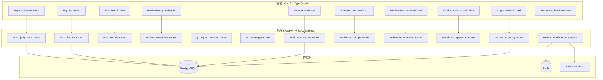

# Design Document — Phase 7: EQCR + QC + 工时体验闭环

## 变更记录

| 版本 | 日期 | 变更内容 |
|------|------|----------|
| v1.0 | 2026-05-22 | 初始设计，基于 requirements.md v1.0 |

---

## Overview

Phase 7 覆盖 5 个角色维度（EQCR 独立复核 / 质控 / 工时管理 / 复核流程 / 合伙人）的 13 项功能，目标是闭合各角色在日常操作中的体验断层。

核心设计原则：
- **最小侵入**：复用现有 IssueTicket（source='eqcr'）、eqcr_snapshots（新增 judgments JSONB）、ForceGraph（新增 prop）
- **模块独立**：F7 工时模块为新建表，不影响现有 WorkHour 模型（Phase 9 已有简单工时，本 spec 新建 work_hour_entries 细粒度表）
- **算法复用**：F12 紧急度评分直接复用 Phase 6 F7 urgency_score 三因子加权公式
- **渐进增强**：F11 SSE 新增 3 事件类型，不改现有 eventBus 架构

### 实施顺序约束

```
F1 ─┐
F2 ─┤ Sprint 1: EQCR 三件套（F2 depends Phase 6 F4）
F3 ─┘
F4 ─┐
F5 ─┤ Sprint 2: QC 三件套
F6 ─┘
F7 ──→ F8 ─┐
      F9 ──┤ Sprint 3: 工时四件套（F9/F10 depend F7）
      F10 ─┘
F11 ─┐
F12 ─┤ Sprint 4: 通知 + 合伙人视角
F13 ─┘
```

---

## Architecture

### 系统分层视图



### ADR（Architecture Decision Records）

#### ADR-1: WorkHourEntry 新建表而非扩展现有 WorkHour

**决策**：新建 `work_hour_entries` 表支持三级粒度（循环/底稿/程序），不修改现有 `work_hours` 表。

**理由**：
- 现有 `work_hours` 表（Phase 9）仅有 `staff_id/project_id/work_date/hours/status` 粗粒度字段
- 三级粒度需要 `cycle/wp_code/procedure` 三个新维度字段 + `submitted_at/approved_by/approved_at` 审批流字段
- 新建表避免破坏现有工时统计逻辑（Phase 9 的 AI 建议工时等）
- 两表可并存：`work_hours` 作为简单日志，`work_hour_entries` 作为精细化填报

**替代方案**：ALTER TABLE work_hours ADD COLUMN → 破坏现有索引 + 需回填历史数据

---

#### ADR-2: EQCR 判断存储 — snapshot_data.judgments JSONB 子字段

**决策**：在 `eqcr_snapshots.snapshot_data` JSONB 内新增 `judgments` 键存储 5 维度结构化判断，同时新增独立 `judgments` JSONB 列作为快速查询入口。

**理由**：
- `snapshot_data` 已有 4 类数据（workpapers/reports/adjustments/vr_results），judgments 作为第 5 类语义清晰
- 独立 `judgments` 列支持 GIN 索引，便于趋势统计查询（F3 需按年聚合）
- 双写保证：提交时同时写入 `snapshot_data.judgments` 和独立 `judgments` 列

**Schema**：
```json
{
  "dimensions": [
    {
      "key": "material_misstatement",
      "conclusion": "pass|qualified|fail",
      "rationale": "富文本",
      "referenced_wps": ["D2-1", "E1-1"],
      "risk_level": "high|medium|low"
    }
    // ... 5 个维度
  ],
  "submitted_at": "ISO datetime",
  "submitted_by": "user_id"
}
```

---

#### ADR-3: EQCR 问题单可见性 — 应用层过滤而非 RLS

**决策**：EQCR 问题单可见性通过应用层 WHERE 条件实现（`source='eqcr' AND (user is EQCR OR user in project_team)`），不使用 PG RLS。

**理由**：
- IssueTicket 已有 `source` 字段（String(32)），新增 `eqcr` 值即可标识
- RLS 策略需要 session 变量传递角色信息，增加复杂度
- 应用层过滤与现有 `require_project_access` 依赖一致
- Phase 6 F4 项目级权限端点提供角色判断基础

**替代方案**：PG RLS policy → 过度设计，且 IssueTicket 已有多种 source 共存

---

#### ADR-4: 复核意见模板 — 独立表而非知识库子分类

**决策**：新建 `review_templates` 表，不复用 `ai_knowledge_base` 表。

**理由**：
- `ai_knowledge_base` 面向 AI 文档索引（doc_uuid/content_hash/embedding），schema 不匹配
- 复核意见模板需要：`applicable_cycles`（JSONB 数组）、`priority_tag`（must_fix/suggest/info）、`use_count`（整数）
- 独立表 schema 简洁，CRUD 逻辑独立，不影响 AI 知识库功能
- 前端 `knowledge_base` router 的"分类"概念仅用于 UI 导航入口，后端数据源独立

**替代方案**：在 ai_knowledge_base 加 category='review_templates' → schema 不匹配，需大量 nullable 字段

---

#### ADR-5: 推荐算法 — 三因子加权归一化

**决策**：复核分派推荐使用三因子加权评分：历史复核记录 40% + 工时余量 30% + 循环专长 30%。

**理由**：
- 三因子覆盖"能力+可用性+匹配度"三个维度
- 各因子归一化到 [0,1] 后加权求和，避免量纲差异
- 权重可配置（后续可通过项目配置调整）
- 单调性保证：工时余量越大 → 评分越高；历史复核次数越多 → 评分越高

**公式**：
```python
history_factor = min(review_count_in_cycle / HISTORY_CAP, 1.0)  # CAP=10
capacity_factor = max(0, (STANDARD_WEEKLY_HOURS - current_week_hours) / STANDARD_WEEKLY_HOURS)
expertise_factor = len(matched_cycles) / len(candidate_all_cycles) if candidate_all_cycles else 0

score = 0.4 * history_factor + 0.3 * capacity_factor + 0.3 * expertise_factor
```

---

#### ADR-6: 紧急度评分 — 复用 Phase 6 F7 urgency_score 公式

**决策**：F12 多项目紧急度评分直接复用 Phase 6 F7 的三因子加权公式（SLA 40% + blocking VR 30% + 未完成底稿 30%），仅聚合维度不同（合伙人看多项目）。

**理由**：
- 公式已在 Phase 6 设计并验证（PBT P5 单调性）
- 合伙人视角仅需对每个项目独立计算 score 后排序
- 标签分类：≥80 红色"紧急" / ≥60 橙色"关注" / ≥40 黄色"一般" / <40 绿色"正常"
- 无需新算法，降低实施风险

**公式**（同 Phase 6 ADR-7）：
```python
sla_factor = 1 - (days_remaining / max_days)  # 归一化 [0,1]
vr_factor = min(blocking_vr_count / VR_CAP, 1.0)  # CAP=10
wp_factor = 1 - (completed_wp / total_wp)  # 未完成比例

urgency_score = round((0.4 * sla_factor + 0.3 * vr_factor + 0.3 * wp_factor) * 100)
```

---

#### ADR-7: QC 报告 Word 导出 — 复用 Phase 3 python-docx 基础设施

**决策**：QC 报告 Word 导出复用 Phase 3 附注 Word 导出已建立的 python-docx 基础设施，新增 QC 专用模板函数。

**理由**：
- python-docx 已在 requirements.txt，无需新增依赖
- Phase 3 已有 Word 文档生成的工具函数（表格创建/样式设置/文件流返回）
- QC 报告三线表格式（仅顶线+表头底线+底线）通过 `table.style` + 手动设置 border 实现
- 字体规范：仿宋_GB2312（中文）+ Arial Narrow（数字），与审计报告标准一致

---

#### ADR-8: SSE 复核通知 — 扩展 EventType 枚举 + 幂等推送

**决策**：新增 2 个 EventType 枚举值（`review.accepted` / `review.completed`），通过 Redis key 实现幂等推送。

**理由**：
- EventType 枚举已有 32 个值，新增 2 个无 breaking change
- 去掉 `review.in_progress`（"开始撰写"触发时机不明确，前端难以可靠检测）
- 幂等 key 格式：`sse:review_status:{review_id}:{status}` TTL=3600s
- 同一 review_id 同一 status 不重复推送（requirements 明确"幂等性"NFR）
- 断连补发通过 `last_event_id` 机制实现（SSE 标准协议）

---

## Components and Interfaces

### F1: EQCR 结构化判断 API

```python
# backend/app/routers/eqcr_judgment.py
router = APIRouter(prefix="/api/projects/{project_id}/eqcr-judgment", tags=["eqcr-judgment"])

class JudgmentDimension(BaseModel):
    key: Literal["material_misstatement", "going_concern", "key_audit_matters", "other_information", "audit_report"]
    conclusion: Literal["pass", "qualified", "fail"]
    rationale: str  # 富文本
    referenced_wps: list[str]  # wp_code 列表
    risk_level: Literal["high", "medium", "low"]

class EqcrJudgmentSubmit(BaseModel):
    dimensions: list[JudgmentDimension]  # 必须 5 个

class EqcrJudgmentResponse(BaseModel):
    id: UUID
    project_id: UUID
    dimensions: list[JudgmentDimension]
    submitted_at: datetime
    submitted_by: UUID
    can_sign: bool  # 全部 pass 才为 True

@router.post("")
async def submit_judgment(project_id: UUID, body: EqcrJudgmentSubmit, ...) -> EqcrJudgmentResponse:
    """提交 EQCR 结构化判断（需 eqcr 角色）"""

@router.get("")
async def get_judgment(project_id: UUID, ...) -> EqcrJudgmentResponse | None:
    """获取当前 EQCR 判断（只读）"""
```

```typescript
// frontend/src/components/eqcr/EqcrJudgmentForm.vue
interface Props {
  projectId: string
  readonly?: boolean
}
interface Emits {
  (e: 'submitted', judgment: EqcrJudgment): void
}
interface EqcrJudgment {
  dimensions: JudgmentDimension[]
  canSign: boolean
}
interface JudgmentDimension {
  key: string
  conclusion: 'pass' | 'qualified' | 'fail'
  rationale: string
  referencedWps: string[]
  riskLevel: 'high' | 'medium' | 'low'
}
```

### F2: EQCR 问题单 API

```python
# backend/app/routers/eqcr_issues.py
router = APIRouter(prefix="/api/projects/{project_id}/eqcr-issues", tags=["eqcr-issues"])

class EqcrIssueCreate(BaseModel):
    severity: Literal["blocker", "major", "minor", "suggestion"]
    category: str
    title: str
    description: str | None = None
    wp_id: UUID | None = None

class EqcrIssueListResponse(BaseModel):
    items: list[IssueTicketSchema]
    summary: dict  # {"open": N, "in_fix": N, "closed": N}

@router.get("")
async def list_eqcr_issues(project_id: UUID, ...) -> EqcrIssueListResponse:
    """列出 EQCR 问题单（仅 EQCR + 项目团队可见）"""

@router.post("")
async def create_eqcr_issue(project_id: UUID, body: EqcrIssueCreate, ...) -> IssueTicketSchema:
    """创建 EQCR 问题单（自动设置 source='eqcr'）"""

@router.post("/{issue_id}/reply")
async def reply_eqcr_issue(project_id: UUID, issue_id: UUID, body: ReplyBody, ...) -> dict:
    """回复 EQCR 问题单（触发 SSE 通知）
    
    线程实现：回复创建新 IssueTicket 记录，parent_id 指向原问题单 ID（自引用）。
    无需新增 thread_id 字段，IssueTicket 已有 parent_id 可用。
    """
```

```typescript
// frontend/src/components/eqcr/EqcrIssueList.vue
interface Props {
  projectId: string
}
interface Emits {
  (e: 'issue-created', issue: IssueTicket): void
  (e: 'navigate-to-wp', wpId: string): void
}
```

### F3: EQCR 趋势 API

```python
# backend/app/routers/eqcr_trends.py
router = APIRouter(prefix="/api/eqcr/metrics", tags=["eqcr-metrics"])

class YearTrend(BaseModel):
    year: int
    pass_rate: float  # 0-100
    avg_review_days: float
    total_projects: int

class TopIssueCategory(BaseModel):
    category: str
    count: int

class EqcrTrendResponse(BaseModel):
    yearly_trends: list[YearTrend]
    top_issues: list[TopIssueCategory]  # Top 5

@router.get("/trends")
async def get_eqcr_trends(...) -> EqcrTrendResponse:
    """返回近 5 年 EQCR 趋势数据"""
```

### F4: 复核意见模板 API

```python
# backend/app/routers/review_templates.py
router = APIRouter(prefix="/api/review-templates", tags=["review-templates"])

class ReviewTemplateCreate(BaseModel):
    title: str
    content: str  # 富文本
    applicable_cycles: list[str]  # ["D", "E", "F", ...]
    priority_tag: Literal["must_fix", "suggest", "info"]

class ReviewTemplateResponse(BaseModel):
    id: UUID
    title: str
    content: str
    applicable_cycles: list[str]
    priority_tag: str
    use_count: int
    created_at: datetime
    updated_at: datetime

@router.get("")
async def list_templates(search: str | None = None, cycle: str | None = None, ...) -> list[ReviewTemplateResponse]:
    """列出模板（支持搜索+循环过滤）"""

@router.post("")
async def create_template(body: ReviewTemplateCreate, ...) -> ReviewTemplateResponse:
    """创建模板"""

@router.put("/{template_id}")
async def update_template(template_id: UUID, body: ReviewTemplateCreate, ...) -> ReviewTemplateResponse:
    """更新模板"""

@router.delete("/{template_id}")
async def delete_template(template_id: UUID, ...) -> dict:
    """删除模板（软删除）"""

@router.post("/{template_id}/use")
async def increment_use_count(template_id: UUID, ...) -> dict:
    """递增使用次数（一键插入时调用）"""
```

```typescript
// frontend/src/components/review/ReviewTemplatePanel.vue
interface Props {
  visible: boolean
  currentCycle?: string  // 当前底稿所属循环，用于预过滤
}
interface Emits {
  (e: 'insert', content: string): void
  (e: 'update:visible', val: boolean): void
}
```

### F5: QC 报告 Word 导出 API

```python
# backend/app/routers/qc_report_export.py
router = APIRouter(prefix="/api/projects/{project_id}/qc-report", tags=["qc-report"])

@router.get("/export")
async def export_qc_report(project_id: UUID, ...) -> StreamingResponse:
    """导出 QC 报告 Word 文件（三线表格式）"""
    # Content-Type: application/vnd.openxmlformats-officedocument.wordprocessingml.document
    # Content-Disposition: attachment; filename="QC_Report_{project_name}_{date}.docx"
```

### F6: VR 覆盖度 API

```python
# backend/app/routers/vr_coverage.py
router = APIRouter(prefix="/api/qc/vr-coverage", tags=["qc-vr-coverage"])

class CycleCoverage(BaseModel):
    cycle_name: str
    blocking_count: int
    warning_count: int
    info_count: int
    meets_standard: bool  # blocking >= 3 AND warning >= 2
    gap_blocking: int  # max(0, 3 - blocking_count)
    gap_warning: int  # max(0, 2 - warning_count)

class VRCoverageResponse(BaseModel):
    cycles: list[CycleCoverage]
    total_rules: int
    compliant_cycles: int
    non_compliant_cycles: int

@router.get("")
async def get_vr_coverage(...) -> VRCoverageResponse:
    """返回各循环 VR 规则覆盖度统计"""
```

```typescript
// frontend/src/components/qc/VRCoverageTab.vue
interface Props {
  // 无需 props，组件自行加载数据
}
interface Emits {
  (e: 'cycle-click', cycleName: string): void
}
```

### F7: 工时填报 API

```python
# backend/app/routers/workhour_entries.py
router = APIRouter(prefix="/api/projects/{project_id}/workhours", tags=["workhours"])

class WorkHourEntryCreate(BaseModel):
    date: date
    hours: Decimal  # Decimal(5,2)
    cycle: str  # 必填
    wp_code: str | None = None  # 底稿级
    procedure: str | None = None  # 程序级
    description: str | None = None

class WorkHourEntryResponse(BaseModel):
    id: UUID
    user_id: UUID
    project_id: UUID
    date: date
    hours: Decimal
    cycle: str
    wp_code: str | None
    procedure: str | None
    description: str | None
    status: Literal["draft", "submitted", "approved", "rejected"]
    created_at: datetime

class WorkHourSummary(BaseModel):
    by_day: dict[str, Decimal]  # {"2026-05-22": 8.5}
    by_cycle: dict[str, Decimal]  # {"D": 12.0, "E": 8.0}
    by_user: dict[str, Decimal]  # {"user_name": 20.5}
    total: Decimal

@router.post("")
async def create_entry(project_id: UUID, body: WorkHourEntryCreate, ...) -> WorkHourEntryResponse:
    """创建工时条目（校验日合计 ≤ 24h）"""

@router.get("")
async def list_entries(project_id: UUID, start_date: date = None, end_date: date = None, ...) -> list[WorkHourEntryResponse]:
    """列出工时条目"""

@router.put("/{entry_id}")
async def update_entry(project_id: UUID, entry_id: UUID, body: WorkHourEntryCreate, ...) -> WorkHourEntryResponse:
    """更新工时条目（仅 draft 状态可改）"""

@router.delete("/{entry_id}")
async def delete_entry(project_id: UUID, entry_id: UUID, ...) -> dict:
    """删除工时条目（仅 draft 状态可删）"""

@router.post("/batch-submit")
async def batch_submit(project_id: UUID, body: BatchSubmitRequest, ...) -> dict:
    """批量提交工时（draft → submitted，单事务）"""

@router.get("/summary")
async def get_summary(project_id: UUID, period: Literal["day", "week", "month"] = "week", ...) -> WorkHourSummary:
    """工时汇总统计"""
```

```typescript
// frontend/src/views/WorkHoursPage.vue
// 包含：日历视图 + 填报表单 + 汇总统计 + 预算对比 Tab
```

### F8: 工时预算对比 API

```python
# backend/app/routers/workhour_budget.py
router = APIRouter(prefix="/api/projects/{project_id}/workhours/budget-vs-actual", tags=["workhours"])

class BudgetCycleItem(BaseModel):
    cycle_name: str
    budget_hours: Decimal
    actual_hours: Decimal
    variance_pct: float  # (actual - budget) / budget * 100
    is_over_budget: bool  # variance_pct > 20

class BudgetUserItem(BaseModel):
    user_id: UUID
    user_name: str
    budget_hours: Decimal
    actual_hours: Decimal
    variance_pct: float
    is_over_budget: bool

class BudgetCompareResponse(BaseModel):
    by_cycle: list[BudgetCycleItem]
    by_user: list[BudgetUserItem]

@router.get("")
async def get_budget_compare(project_id: UUID, ...) -> BudgetCompareResponse:
    """返回预算 vs 实际对比数据"""
```

### F9: 复核分派推荐 API

```python
# backend/app/routers/review_recommend.py
router = APIRouter(prefix="/api/projects/{project_id}/review-recommend", tags=["review-recommend"])

class RecommendCandidate(BaseModel):
    user_id: UUID
    user_name: str
    score: float  # 0-1
    history_score: float
    capacity_score: float
    expertise_score: float
    current_week_hours: Decimal
    review_count_in_cycle: int

class ReviewRecommendResponse(BaseModel):
    candidates: list[RecommendCandidate]  # Top 3 或全部（< 3 人时）
    total_team_size: int

@router.get("")
async def recommend_reviewer(
    project_id: UUID,
    cycle: str = Query(...),
    wp_code: str | None = Query(None),
    ...
) -> ReviewRecommendResponse:
    """推荐复核人（Top 3）"""
```

```typescript
// frontend/src/components/review/ReviewRecommendCard.vue
interface Props {
  projectId: string
  cycle: string
  wpCode?: string
}
interface Emits {
  (e: 'select', userId: string): void
}
```

### F10: 工时审批与底稿进度关联 API

```python
# backend/app/routers/workhour_approval.py
router = APIRouter(prefix="/api/projects/{project_id}/workhours/approval", tags=["workhours"])

class ApprovalItem(BaseModel):
    entry_id: UUID
    user_id: UUID
    user_name: str
    date: date
    hours: Decimal
    cycle: str
    wp_code: str | None
    description: str | None
    # 关联底稿进度
    wp_progress_pct: float  # 0-100
    is_warning: bool  # progress < 30% AND hours > budget * 80%

class ApprovalListResponse(BaseModel):
    items: list[ApprovalItem]
    total: int

@router.get("")
async def list_pending_approvals(project_id: UUID, ...) -> ApprovalListResponse:
    """列出待审批工时（含底稿进度列）"""

@router.post("/approve")
async def approve_entries(project_id: UUID, body: ApproveRequest, ...) -> dict:
    """批量审批工时（submitted → approved）"""

@router.post("/reject")
async def reject_entries(project_id: UUID, body: RejectRequest, ...) -> dict:
    """批量退回工时（submitted → rejected）"""
```

### F11: 复核进度 SSE 通知

```python
# backend/app/services/review_notification_service.py

class ReviewNotificationService:
    """复核进度 SSE 通知服务"""

    @staticmethod
    async def notify_review_accepted(review_id: UUID, wp_code: str, reviewer_name: str, submitter_id: UUID):
        """复核人打开底稿 → 发送 review.accepted"""

    @staticmethod
    async def notify_review_completed(review_id: UUID, wp_code: str, reviewer_name: str, submitter_id: UUID, result: str):
        """复核人提交结论 → 发送 review.completed"""
```

SSE payload 格式：
```json
{
  "event_type": "review.accepted",
  "data": {
    "review_id": "uuid",
    "wp_code": "D2-1",
    "reviewer_name": "张三",
    "status": "accepted",
    "timestamp": "2026-05-22T10:30:00Z"
  }
}
```

### F12: 多项目紧急度评分 API

```python
# backend/app/routers/partner_urgency.py
router = APIRouter(prefix="/api/partner/projects", tags=["partner-urgency"])

class ProjectUrgencyItem(BaseModel):
    project_id: UUID
    project_name: str
    client_name: str
    urgency_score: int  # 0-100
    urgency_label: Literal["urgent", "attention", "normal", "safe"]  # 红/橙/黄/绿
    sla_days_remaining: int | None
    blocking_vr_count: int
    incomplete_wp_ratio: float  # 0-1
    key_metrics_summary: str

class PartnerUrgencyResponse(BaseModel):
    projects: list[ProjectUrgencyItem]  # 按 urgency_score 降序

@router.get("/urgency")
async def get_partner_urgency(...) -> PartnerUrgencyResponse:
    """返回合伙人负责项目的紧急度评分排序"""
```

```typescript
// frontend/src/components/partner/UrgencyRankCard.vue
interface Props {
  // 无需 props，组件自行加载数据
}
interface Emits {
  (e: 'project-click', projectId: string): void
}
```

### F13: ForceGraph staleOnly 过滤器

```typescript
// audit-platform/frontend/src/components/panorama/ForceGraph.vue — 扩展 props
const props = withDefaults(
  defineProps<{
    nodes: D3Node[]
    links: D3Link[]
    width: number
    height: number
    staleOnly?: boolean  // 新增
  }>(),
  { width: 1200, height: 800, staleOnly: false },
)
```

```typescript
// frontend/src/composables/useStaleFilter.ts
export function useStaleFilter(nodes: Ref<D3Node[]>, links: Ref<D3Link[]>) {
  const staleOnly = ref(false)

  const filteredNodes = computed(() => {
    if (!staleOnly.value) return nodes.value
    const staleIds = new Set(nodes.value.filter(n => n.is_stale).map(n => n.id))
    // 一跳邻居
    const neighborIds = new Set<string>()
    links.value.forEach(l => {
      const sid = typeof l.source === 'string' ? l.source : l.source.id
      const tid = typeof l.target === 'string' ? l.target : l.target.id
      if (staleIds.has(sid)) neighborIds.add(tid)
      if (staleIds.has(tid)) neighborIds.add(sid)
    })
    const visibleIds = new Set([...staleIds, ...neighborIds])
    return nodes.value.filter(n => visibleIds.has(n.id))
  })

  const filteredLinks = computed(() => {
    if (!staleOnly.value) return links.value
    const visibleIds = new Set(filteredNodes.value.map(n => n.id))
    return links.value.filter(l => {
      const sid = typeof l.source === 'string' ? l.source : l.source.id
      const tid = typeof l.target === 'string' ? l.target : l.target.id
      return visibleIds.has(sid) && visibleIds.has(tid)
    })
  })

  return { staleOnly, filteredNodes, filteredLinks }
}
```

---

## Data Models

### V009: eqcr_snapshots 新增 judgments 列

```sql
-- V009__eqcr_judgments_column.sql（编号实施时 max+1）
ALTER TABLE eqcr_snapshots
ADD COLUMN judgments JSONB DEFAULT NULL;

COMMENT ON COLUMN eqcr_snapshots.judgments IS
  'EQCR 5 维度结构化判断: {"dimensions":[{key,conclusion,rationale,referenced_wps,risk_level},...], "submitted_at","submitted_by"}';

CREATE INDEX idx_eqcr_snapshots_judgments_gin ON eqcr_snapshots USING GIN (judgments);
```

### V010: 新增 work_hour_entries 表

```sql
-- V010__work_hour_entries.sql（编号实施时 max+1）
CREATE TABLE work_hour_entries (
    id UUID PRIMARY KEY DEFAULT gen_random_uuid(),
    user_id UUID NOT NULL REFERENCES users(id),
    project_id UUID NOT NULL REFERENCES projects(id),
    date DATE NOT NULL,
    hours DECIMAL(5,2) NOT NULL CHECK (hours > 0 AND hours <= 24),
    cycle VARCHAR(10) NOT NULL,
    wp_code VARCHAR(30),
    procedure VARCHAR(100),
    description TEXT,
    status VARCHAR(20) NOT NULL DEFAULT 'draft',  -- draft/submitted/approved/rejected
    submitted_at TIMESTAMP WITH TIME ZONE,
    approved_by UUID REFERENCES users(id),
    approved_at TIMESTAMP WITH TIME ZONE,
    rejected_reason TEXT,
    created_at TIMESTAMP WITH TIME ZONE NOT NULL DEFAULT NOW(),
    updated_at TIMESTAMP WITH TIME ZONE NOT NULL DEFAULT NOW()
);

CREATE INDEX idx_whe_user_date ON work_hour_entries (user_id, date);
CREATE INDEX idx_whe_project_status ON work_hour_entries (project_id, status);
CREATE INDEX idx_whe_project_cycle ON work_hour_entries (project_id, cycle);

COMMENT ON TABLE work_hour_entries IS '工时填报条目（三级粒度：循环/底稿/程序）';
```

### V011: projects 新增 budget_config 列

```sql
-- V011__project_budget_config.sql（编号实施时 max+1）
ALTER TABLE projects
ADD COLUMN budget_config JSONB DEFAULT NULL;

COMMENT ON COLUMN projects.budget_config IS
  '工时预算配置: {"by_cycle":{"D":100,"E":80,...},"by_user":{"user_id":160,...},"total":800}';
```

### V012: 新增 review_templates 表

```sql
-- V012__review_templates.sql（编号实施时 max+1）
CREATE TABLE review_templates (
    id UUID PRIMARY KEY DEFAULT gen_random_uuid(),
    title VARCHAR(200) NOT NULL,
    content TEXT NOT NULL,
    applicable_cycles JSONB NOT NULL DEFAULT '[]',  -- ["D","E","F"]
    priority_tag VARCHAR(20) NOT NULL DEFAULT 'suggest',  -- must_fix/suggest/info
    use_count INTEGER NOT NULL DEFAULT 0,
    created_by UUID REFERENCES users(id),
    is_deleted BOOLEAN NOT NULL DEFAULT FALSE,
    created_at TIMESTAMP WITH TIME ZONE NOT NULL DEFAULT NOW(),
    updated_at TIMESTAMP WITH TIME ZONE NOT NULL DEFAULT NOW()
);

CREATE INDEX idx_review_templates_priority ON review_templates (priority_tag)
    WHERE is_deleted = FALSE;
CREATE INDEX idx_review_templates_cycles_gin ON review_templates USING GIN (applicable_cycles);

COMMENT ON TABLE review_templates IS '复核意见模板库';
```

### EventType 枚举扩展

```python
# backend/app/models/audit_platform_schemas.py — 新增 3 个值
class EventType(str, enum.Enum):
    # ... 现有 32 个值 ...

    # Phase 7 F11: 复核进度实时通知
    REVIEW_ACCEPTED = "review.accepted"
    REVIEW_COMPLETED = "review.completed"
```

### WorkHourEntry ORM 模型

```python
# backend/app/models/workhour_entry_models.py
class WorkHourEntryStatus(str, enum.Enum):
    draft = "draft"
    submitted = "submitted"
    approved = "approved"
    rejected = "rejected"

class WorkHourEntry(Base):
    """工时填报条目（三级粒度）"""
    __tablename__ = "work_hour_entries"

    id: Mapped[uuid.UUID] = mapped_column(primary_key=True, default=uuid.uuid4)
    user_id: Mapped[uuid.UUID] = mapped_column(ForeignKey("users.id"), nullable=False)
    project_id: Mapped[uuid.UUID] = mapped_column(ForeignKey("projects.id"), nullable=False)
    date: Mapped[date] = mapped_column(nullable=False)
    hours: Mapped[Decimal] = mapped_column(Numeric(5, 2), nullable=False)
    cycle: Mapped[str] = mapped_column(String(10), nullable=False)
    wp_code: Mapped[str | None] = mapped_column(String(30), nullable=True)
    procedure: Mapped[str | None] = mapped_column(String(100), nullable=True)
    description: Mapped[str | None] = mapped_column(Text, nullable=True)
    status: Mapped[str] = mapped_column(String(20), server_default=text("'draft'"), nullable=False)
    submitted_at: Mapped[datetime | None] = mapped_column(nullable=True)
    approved_by: Mapped[uuid.UUID | None] = mapped_column(ForeignKey("users.id"), nullable=True)
    approved_at: Mapped[datetime | None] = mapped_column(nullable=True)
    rejected_reason: Mapped[str | None] = mapped_column(Text, nullable=True)
    created_at: Mapped[datetime] = mapped_column(server_default=func.now())
    updated_at: Mapped[datetime] = mapped_column(server_default=func.now())

    __table_args__ = (
        Index("idx_whe_user_date", "user_id", "date"),
        Index("idx_whe_project_status", "project_id", "status"),
        Index("idx_whe_project_cycle", "project_id", "cycle"),
    )
```

### ReviewTemplate ORM 模型

```python
# backend/app/models/review_template_models.py
class ReviewTemplate(Base):
    """复核意见模板"""
    __tablename__ = "review_templates"

    id: Mapped[uuid.UUID] = mapped_column(primary_key=True, default=uuid.uuid4)
    title: Mapped[str] = mapped_column(String(200), nullable=False)
    content: Mapped[str] = mapped_column(Text, nullable=False)
    applicable_cycles: Mapped[dict] = mapped_column(JSONB, server_default=text("'[]'::jsonb"))
    priority_tag: Mapped[str] = mapped_column(String(20), server_default=text("'suggest'"))
    use_count: Mapped[int] = mapped_column(server_default=text("0"))
    created_by: Mapped[uuid.UUID | None] = mapped_column(ForeignKey("users.id"), nullable=True)
    is_deleted: Mapped[bool] = mapped_column(server_default=text("false"))
    created_at: Mapped[datetime] = mapped_column(server_default=func.now())
    updated_at: Mapped[datetime] = mapped_column(server_default=func.now())

    __table_args__ = (
        Index("idx_review_templates_priority", "priority_tag",
              postgresql_where=text("is_deleted = false")),
    )
```

### 新增端点汇总

| 端点 | 方法 | 功能 | 权限 | 功能编号 |
|------|------|------|------|----------|
| `/api/projects/{id}/eqcr-judgment` | POST | 提交 EQCR 判断 | eqcr | F1 |
| `/api/projects/{id}/eqcr-judgment` | GET | 获取 EQCR 判断 | eqcr+team | F1 |
| `/api/projects/{id}/eqcr-issues` | GET | EQCR 问题单列表 | eqcr+team | F2 |
| `/api/projects/{id}/eqcr-issues` | POST | 创建 EQCR 问题单 | eqcr | F2 |
| `/api/projects/{id}/eqcr-issues/{iid}/reply` | POST | 回复问题单 | eqcr+team | F2 |
| `/api/eqcr/metrics/trends` | GET | EQCR 趋势数据 | qc+admin | F3 |
| `/api/review-templates` | GET/POST | 模板列表/创建 | 已认证 | F4 |
| `/api/review-templates/{id}` | PUT/DELETE | 模板更新/删除 | 已认证 | F4 |
| `/api/review-templates/{id}/use` | POST | 递增使用次数 | 已认证 | F4 |
| `/api/projects/{id}/qc-report/export` | GET | QC 报告导出 | qc+admin | F5 |
| `/api/qc/vr-coverage` | GET | VR 覆盖度统计 | qc+admin | F6 |
| `/api/projects/{id}/workhours` | CRUD | 工时填报 | 本人 | F7 |
| `/api/projects/{id}/workhours/batch-submit` | POST | 批量提交 | 本人 | F7 |
| `/api/projects/{id}/workhours/summary` | GET | 工时汇总 | team | F7 |
| `/api/projects/{id}/workhours/budget-vs-actual` | GET | 预算对比 | manager+ | F8 |
| `/api/projects/{id}/review-recommend` | GET | 推荐复核人 | manager+ | F9 |
| `/api/projects/{id}/workhours/approval` | GET | 待审批列表 | manager+ | F10 |
| `/api/projects/{id}/workhours/approval/approve` | POST | 批量审批 | manager+ | F10 |
| `/api/projects/{id}/workhours/approval/reject` | POST | 批量退回 | manager+ | F10 |
| `/api/partner/projects/urgency` | GET | 紧急度排序 | partner+admin | F12 |

### Redis Key 设计

| Key Pattern | Value | TTL | 用途 |
|-------------|-------|-----|------|
| `sse:review_status:{review_id}:{status}` | `1` | 3600s | 复核通知幂等 |
| `workhour:daily_total:{user_id}:{date}` | `Decimal` | 86400s | 日合计缓存 |

---

## Correctness Properties

*A property is a characteristic or behavior that should hold true across all valid executions of a system — essentially, a formal statement about what the system should do. Properties serve as the bridge between human-readable specifications and machine-verifiable correctness guarantees.*

### Property 1: 工时日合计不变量

*For any* user and any date, the sum of all `work_hour_entries.hours` for that user on that date must be ≤ 24.0. After any successful `create_entry` or `update_entry` call, this invariant must hold. Any submission that would violate this constraint must be rejected.

**Validates: Requirements 7.7**

### Property 2: 工时粒度汇总一致性

*For any* project and time period, the sum of all entries grouped by cycle must equal the sum of all entries grouped by wp_code within that cycle. Formally: `sum(hours WHERE cycle=C) == sum(hours WHERE cycle=C AND wp_code IN all_wps_of_C) + sum(hours WHERE cycle=C AND wp_code IS NULL)`. The aggregation at a coarser level must always equal the sum of its finer-grained components.

**Validates: Requirements 7.4**

### Property 3: 推荐评分单调性（工时余量）

*For any* two candidates A and B in the same project/cycle context where A has strictly more weekly hour capacity remaining than B (all other factors — history and expertise — held equal), candidate A's recommendation score must be strictly greater than candidate B's score.

**Validates: Requirements 9.2, 9.4**

### Property 4: 推荐评分单调性（历史复核）

*For any* two candidates A and B in the same project/cycle context where A has strictly more historical review records in the target cycle than B (all other factors — capacity and expertise — held equal), candidate A's recommendation score must be strictly greater than candidate B's score.

**Validates: Requirements 9.2, 9.3**

### Property 5: 紧急度评分单调性

*For any* two projects where project A has strictly fewer SLA days remaining than project B (all other factors — blocking VR count and incomplete workpaper ratio — held equal), project A's `urgency_score` must be strictly greater than project B's score.

**Validates: Requirements 12.2**

### Property 6: 紧急度评分范围不变量

*For any* project with any combination of valid input factors (SLA days ≥ 0, blocking VR count ≥ 0, workpaper completion ratio ∈ [0,1]), the computed `urgency_score` must satisfy `0 ≤ urgency_score ≤ 100`.

**Validates: Requirements 12.2, 12.6, 12.7**

### Property 7: stale 过滤幂等性

*For any* graph (nodes + links), applying the stale filter function twice must produce the same result as applying it once. Formally: `filter_stale(filter_stale(nodes, links)) == filter_stale(nodes, links)`. The filtered subgraph is a fixed point of the filter operation.

**Validates: Requirements 13.2**

---

## Error Handling

### F1: EQCR 判断提交

| 场景 | HTTP 状态 | 响应 |
|------|-----------|------|
| 维度数 ≠ 5 | 422 | `{"detail": "Must submit exactly 5 dimensions"}` |
| 非 EQCR 角色 | 403 | `{"detail": "Only EQCR role can submit judgments"}` |
| 项目无当前快照 | 404 | `{"detail": "No active EQCR snapshot for this project"}` |
| 重复提交（已有 judgments） | 409 | `{"detail": "Judgment already submitted, use PUT to update"}` |

### F2: EQCR 问题单

| 场景 | HTTP 状态 | 响应 |
|------|-----------|------|
| 非 EQCR 且非项目团队 | 403 | `{"detail": "Access denied: EQCR issues visible only to EQCR and project team"}` |
| 问题单不存在 | 404 | `{"detail": "Issue ticket not found"}` |
| 回复空内容 | 422 | `{"detail": "Reply content cannot be empty"}` |

### F3: EQCR 趋势

| 场景 | HTTP 状态 | 响应 |
|------|-----------|------|
| 无历史数据 | 200 | `{"yearly_trends": [], "top_issues": []}` |
| 查询超时（>1s） | 200（降级） | 返回已计算的部分年份 + `"warnings": ["partial data"]` |

### F4: 复核意见模板

| 场景 | HTTP 状态 | 响应 |
|------|-----------|------|
| 标题为空 | 422 | Pydantic 验证错误 |
| 模板不存在 | 404 | `{"detail": "Template not found"}` |
| 删除已删除模板 | 404 | `{"detail": "Template not found"}` |

### F5: QC 报告导出

| 场景 | HTTP 状态 | 响应 |
|------|-----------|------|
| 项目无 QC 记录 | 200 | 返回空报告模板（含表头无数据行） |
| python-docx 生成失败 | 500 | `{"detail": "Report generation failed"}` |
| 非 QC/admin 角色 | 403 | `{"detail": "Insufficient permissions"}` |

### F6: VR 覆盖度

| 场景 | HTTP 状态 | 响应 |
|------|-----------|------|
| 规则文件读取失败 | 503 | `{"detail": "Failed to scan VR rules", "cycle": "..."}` |
| 无规则文件 | 200 | `{"cycles": [], "total_rules": 0, ...}` |

### F7: 工时填报

| 场景 | HTTP 状态 | 响应 |
|------|-----------|------|
| 日合计超 24h | 422 | `{"detail": "Daily total would exceed 24 hours", "current_total": "16.5", "requested": "8.0"}` |
| hours ≤ 0 或 > 24 | 422 | Pydantic 验证错误 |
| 修改非 draft 状态 | 409 | `{"detail": "Can only modify entries in draft status"}` |
| 非本人操作（非 admin） | 403 | `{"detail": "Can only manage own work hours"}` |
| 批量提交部分失败 | 200 | `{"submitted": N, "skipped": M, "skipped_items": [...]}` |

### F8: 预算对比

| 场景 | HTTP 状态 | 响应 |
|------|-----------|------|
| 项目无 budget_config | 200 | `{"by_cycle": [], "by_user": []}` + warning |
| 非 manager+ 角色 | 403 | `{"detail": "Insufficient permissions"}` |

### F9: 推荐算法

| 场景 | HTTP 状态 | 响应 |
|------|-----------|------|
| 团队人数 < 3 | 200 | 返回全部可用人员（不做排序过滤） |
| 无可用人员 | 200 | `{"candidates": [], "total_team_size": 0}` |
| cycle 参数缺失 | 422 | Pydantic 验证错误 |
| 推荐算法超时（>500ms） | 200（降级） | 返回按名字排序的全部人员 + `"degraded": true` |

### F10: 工时审批

| 场景 | HTTP 状态 | 响应 |
|------|-----------|------|
| 非 manager/partner/admin | 403 | `{"detail": "Insufficient permissions"}` |
| 审批已审批的条目 | 409 | `{"detail": "Entry already approved"}` |
| 无待审批条目 | 200 | `{"items": [], "total": 0}` |

### F11: SSE 通知

| 场景 | 处理方式 |
|------|----------|
| Redis 不可用（幂等 key 写入失败） | 降级为不去重，允许重复推送 |
| 目标用户不在线 | 事件存入 pending 队列，重连后补发 |
| SSE 连接断开 | 客户端 EventSource 自动重连 + last_event_id 补发 |

### F12: 紧急度评分

| 场景 | HTTP 状态 | 响应 |
|------|-----------|------|
| 非 partner/admin | 403 | `{"detail": "Insufficient permissions"}` |
| 无负责项目 | 200 | `{"projects": []}` |
| 子查询超时 | 200（降级） | 对应项目 urgency_score=0 + `"warnings": [...]` |

### F13: stale 过滤器

| 场景 | 处理方式 |
|------|----------|
| staleOnly=true 且无 stale 节点 | 显示空状态提示"当前无 stale 底稿 ✓" |
| 过滤后节点数为 0 | 同上 |
| URL query 参数非法值 | 忽略，默认 staleOnly=false |

---

## Testing Strategy

### 测试框架

| 层 | 框架 | 配置 |
|----|------|------|
| 后端单元/集成 | pytest + pytest-asyncio | SQLite in-memory |
| 后端 PBT | hypothesis | max_examples=30（用户偏好） |
| 前端单元 | vitest | jsdom 环境 |
| 前端 PBT | fast-check | numRuns: 30（用户偏好） |

### 双重测试策略

**Property-Based Tests（验证通用正确性）**：
- P1: 工时日合计不变量 — 生成随机 (user, date, hours[]) 组合，验证 sum ≤ 24
- P2: 工时粒度汇总一致性 — 生成随机多级 entries，验证聚合等式
- P3: 推荐评分单调性（余量）— 生成两组 capacity 不同的候选人，验证 score 排序
- P4: 推荐评分单调性（历史）— 生成两组 history 不同的候选人，验证 score 排序
- P5: 紧急度评分单调性 — 生成两组 SLA 不同的项目，验证 score 排序
- P6: 紧急度评分范围 — 生成随机三因子，验证 0 ≤ score ≤ 100
- P7: stale 过滤幂等性 — 生成随机图，验证 filter(filter(g)) == filter(g)

**Unit Tests（验证具体场景和边界）**：
- F1: 5 维度全 pass → canSign=true / 1 个 fail → canSign=false / 维度数 ≠ 5 → 422
- F2: EQCR 角色可见 / 非 EQCR 非团队 → 403 / severity 排序验证
- F3: 空数据返回空列表 / 通过率计算正确性 / Top 5 排序
- F4: CRUD 全流程 / 搜索过滤 / use_count 递增
- F5: 三线表生成 / 空数据返回空模板 / 文件流正确
- F6: 达标判断（3 blocking + 2 warning）/ 缺口计算
- F7: 创建+日合计校验 / 批量提交事务 / 状态流转
- F8: 方差计算 / 超预算标记 / 无 budget_config 降级
- F9: Top 3 返回 / 小团队全返回 / 三维度评分计算
- F10: 进度百分比计算 / 警告条件判断
- F11: SSE 事件发送 / 幂等去重 / payload 结构
- F12: 评分计算 / 标签分类 / 降序排列
- F13: stale 子图提取 / 一跳邻居包含 / 空 stale 空状态

### PBT 库选择

| 功能 | 库 | 理由 |
|------|-----|------|
| P1 工时日合计 | hypothesis (后端) | Python 生态标准 PBT 库 |
| P2 工时汇总一致性 | hypothesis (后端) | 同上 |
| P3 推荐单调性（余量） | hypothesis (后端) | 同上 |
| P4 推荐单调性（历史） | hypothesis (后端) | 同上 |
| P5 紧急度单调性 | hypothesis (后端) | 同上 |
| P6 紧急度范围 | hypothesis (后端) | 同上 |
| P7 stale 过滤幂等性 | fast-check (前端) | TypeScript 图操作，前端验证 |

### PBT 配置

- 每个 property test 30 iterations（max_examples=30，用户偏好）
- 每个 PBT 测试必须注释引用 design property 编号
- Tag 格式：`Feature: phase7-role-experience-closure, Property N: {title}`

### 测试文件清单

| 文件 | 覆盖功能 | 类型 |
|------|----------|------|
| `backend/tests/test_eqcr_judgment.py` | F1 | 单元+集成 |
| `backend/tests/test_eqcr_issues.py` | F2 | 单元+集成 |
| `backend/tests/test_eqcr_trends.py` | F3 | 单元+集成 |
| `backend/tests/test_review_templates.py` | F4 | 单元+集成 |
| `backend/tests/test_qc_word_export.py` | F5 | 单元+集成 |
| `backend/tests/test_vr_coverage.py` | F6 | 单元+集成 |
| `backend/tests/test_workhour_crud.py` | F7 | 单元+集成 |
| `backend/tests/test_workhour_budget_compare.py` | F8 | 单元+集成 |
| `backend/tests/test_review_recommend.py` | F9 | 单元+集成 |
| `backend/tests/test_workhour_approval.py` | F10 | 单元+集成 |
| `backend/tests/test_review_notification_sse.py` | F11 | 单元+集成 |
| `backend/tests/test_partner_urgency.py` | F12 | 单元+集成 |
| `backend/tests/test_phase7_pbt.py` | P1-P6 | PBT (hypothesis) |
| `frontend/src/__tests__/EqcrJudgmentForm.spec.ts` | F1 | vitest |
| `frontend/src/__tests__/EqcrIssueList.spec.ts` | F2 | vitest |
| `frontend/src/__tests__/EqcrTrendChart.spec.ts` | F3 | vitest |
| `frontend/src/__tests__/ReviewTemplatePanel.spec.ts` | F4 | vitest |
| `frontend/src/__tests__/VRCoverageTab.spec.ts` | F6 | vitest |
| `frontend/src/__tests__/WorkHoursPage.spec.ts` | F7 | vitest |
| `frontend/src/__tests__/BudgetCompareChart.spec.ts` | F8 | vitest |
| `frontend/src/__tests__/ReviewRecommendCard.spec.ts` | F9 | vitest |
| `frontend/src/__tests__/ForceGraphStaleFilter.spec.ts` | F13 + P7 | vitest + fast-check |

### PBT Property → Test 映射

| Property | 测试文件 | Tag |
|----------|----------|-----|
| P1 工时日合计不变量 | test_phase7_pbt.py | `Feature: phase7-role-experience-closure, Property 1: daily hours invariant` |
| P2 工时粒度汇总一致性 | test_phase7_pbt.py | `Feature: phase7-role-experience-closure, Property 2: granularity aggregation consistency` |
| P3 推荐评分单调性（余量） | test_phase7_pbt.py | `Feature: phase7-role-experience-closure, Property 3: recommend score capacity monotonicity` |
| P4 推荐评分单调性（历史） | test_phase7_pbt.py | `Feature: phase7-role-experience-closure, Property 4: recommend score history monotonicity` |
| P5 紧急度评分单调性 | test_phase7_pbt.py | `Feature: phase7-role-experience-closure, Property 5: urgency score SLA monotonicity` |
| P6 紧急度评分范围 | test_phase7_pbt.py | `Feature: phase7-role-experience-closure, Property 6: urgency score range invariant` |
| P7 stale 过滤幂等性 | ForceGraphStaleFilter.spec.ts | `Feature: phase7-role-experience-closure, Property 7: stale filter idempotence` |

### 回归验证

以下现有模块在 Phase 7 实施后需回归验证：

- `eqcr_snapshot_service.py` — F1 扩展 snapshot_data 结构（新增 judgments）
- `IssueTicket` source 字段 — F2 新增 `eqcr` 值（String(32) 无需迁移）
- `EventType` 枚举 — F11 新增 3 个值
- `eventBus.ts` / `SSEEventType` — F11 前端同步
- `ForceGraph.vue` — F13 新增 staleOnly prop（现有交互不受影响）
- `PartnerProjectDashboard.vue` — F12 新增 UrgencyRankCard
- `LinkagePanoramaView.vue` — F13 新增 stale 过滤器 UI

现有测试回归目标：**零新增失败 + vue-tsc 零新增错误**。
