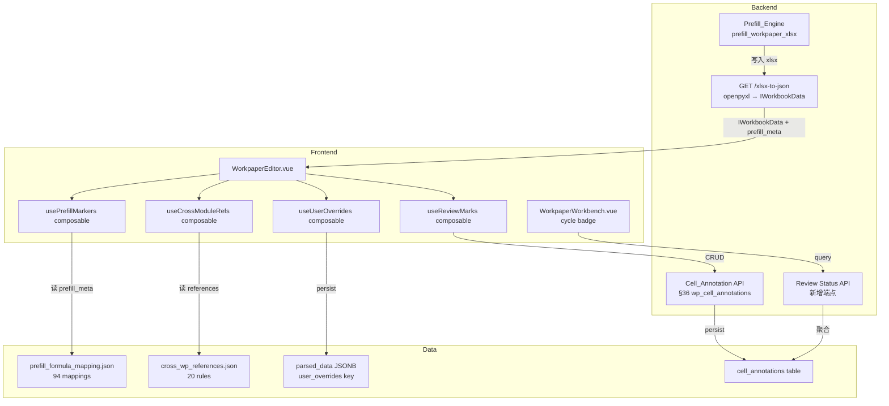

# Design Document

## 变更记录

| 版本 | 日期 | 摘要 | 触发原因 |
|------|------|------|----------|
| v1.0 | 2026-05-17 | 初始版本 | requirements.md 审批通过 |

## Overview

本设计为底稿编辑器（WorkpaperEditor）增加 7 项基础设施能力：预填充视觉指示器、一键填充按钮、跨模块跳转标签、单元格级复核标记、循环级复核状态徽章、Playwright E2E 测试框架、预填充覆盖保护。

核心技术约束：Univer 渲染基于 Canvas（非 DOM），所有视觉标记必须通过 Univer 的 cell style API（`IStyleData.bg`/`IStyleData.bd`）嵌入到 `IWorkbookData` JSON 中，不能使用 CSS class。跨模块标签因 Canvas 限制采用 overlay div 方案（绝对定位在 Univer 容器上方）。

## Architecture



## Components and Interfaces

### D1: 预填充元数据嵌入方案

**决策**: 在 `GET /xlsx-to-json` 转换时，将 prefill source 信息写入 Univer JSON 的 `cellData[row][col].custom` 字段（Univer 保留的自定义扩展点），同时将对应的背景色写入 `cellData[row][col].s.bg`。

**理由**: 
- `cell.s`（IStyleData）直接控制 Canvas 渲染，无需额外 plugin
- `cell.custom` 是 Univer 官方扩展点，不会被内部逻辑覆盖
- 后端 openpyxl 转换时已有 cell 遍历逻辑，增加 custom 字段零额外 IO

**数据结构**:
```typescript
// IWorkbookData.sheets[sheetId].cellData[row][col]
{
  v: "1,234,567.89",           // 显示值
  s: {
    bg: { rgb: "#E3F2FD" },    // 浅蓝背景（TB 来源）
    bd: { ... }                 // 错误时红色边框
  },
  custom: {
    prefill_source: "TB",       // TB | AJE | PREV | WP | ERROR
    prefill_formula: "=TB('1122','期末余额')",
    prefill_error?: "科目不存在"
  }
}
```

**颜色映射**（CSS token → RGB hex）:
| Source | Token | RGB |
|--------|-------|-----|
| TB | --gt-marker-prefill-tb | #E3F2FD |
| AJE | --gt-marker-prefill-aje | #E8F5E9 |
| PREV | --gt-marker-prefill-prev | #F3E5F5 |
| WP | --gt-marker-prefill-wp | #E0F7FA |
| ERROR | --gt-marker-prefill-error | (border: #FF5149) |

### D2: User_Override 持久化方案

**决策**: 存储在 `WorkingPaper.parsed_data` JSONB 的 `"user_overrides"` key 中，格式为 `{ "Sheet1!A5": true, "Sheet1!B10": true }`。

**理由**:
- 无需新建表或迁移，parsed_data JSONB 已存在且可扩展
- 与底稿保存/加载同生命周期，不会出现孤儿数据
- 前端保存时一并写入，后端 prefill 时读取跳过

**流程**:
1. 前端监听 Univer `onCellEdited` 事件
2. 检查被编辑的 cell 是否有 `custom.prefill_source`
3. 若有，将 `"SheetName!CellRef"` 加入 `userOverrides` ref
4. 保存时将 overrides 写入 `parsed_data.user_overrides`
5. 后端 `prefill_workpaper_xlsx` 读取 overrides 集合，跳过匹配的 cell

### D3: 跨模块标签渲染方案

**决策**: 使用 overlay div 方案——在 Univer 容器上方放置一个绝对定位的 `<div class="gt-cross-ref-overlay">`，根据 Univer 的 cell 坐标 API 计算标签位置。

**理由**:
- Univer Canvas 不支持在 cell 内渲染自定义 DOM 元素
- Univer 提供 `getSelectionRanges()` 和 cell 坐标查询 API，可获取 cell 的像素位置
- overlay div 可使用标准 Vue 组件渲染，支持点击事件和 router 跳转
- 滚动时通过监听 Univer 的 scroll 事件同步更新位置

**限制**: 大量标签（>50）时可能有性能问题，采用虚拟化只渲染可视区域内的标签。

### D4: 循环复核状态计算方案

**决策**: 采用实时查询方案——前端请求 `GET /api/projects/{pid}/workpapers/review-status` 端点，后端聚合 cell_annotations 表按 wp_id 分组统计。

**理由**:
- 复核标记变更频率低（每天几十次），不需要缓存
- 聚合查询在 cell_annotations 已有 `idx_cell_anno_wp` 索引下性能可接受
- 通过 eventBus 订阅 `review-mark:changed` 事件触发刷新，延迟 < 3s

**端点设计**:
```
GET /api/projects/{pid}/workpapers/review-status?cycle={cycle_code}
Response: {
  "cycles": [
    {
      "cycle_code": "D",
      "cycle_name": "收入循环",
      "total_workpapers": 8,
      "reviewed_workpapers": 3,
      "workpapers": [
        { "wp_code": "D2", "wp_name": "应收账款", "is_reviewed": true },
        ...
      ]
    }
  ]
}
```

### D5: 复核标记与现有 CellAnnotationPanel 集成

**决策**: 复用现有 `cell_annotations` 表，新增 `annotation_type` 字段区分"复核标记"和"普通批注"。Review_Mark 是 CellAnnotation 的一个子类型（`annotation_type = 'review_mark'`），status 取值扩展为 `reviewed | pending | questioned`。

**理由**:
- cell_annotations 表已有 wp_id + cell_ref + status + author_id + content 字段，完全满足 Review_Mark 需求
- CellAnnotationPanel 已有列表展示 + 状态筛选 + 点击定位功能，只需增加 Tab 过滤
- 避免新建重复表，减少维护成本

**迁移**: `ALTER TABLE cell_annotations ADD COLUMN IF NOT EXISTS annotation_type VARCHAR(30) DEFAULT 'comment'`

## Data Models

### 扩展: cell_annotations 表

```sql
-- 新增列（Alembic 迁移）
ALTER TABLE cell_annotations 
  ADD COLUMN IF NOT EXISTS annotation_type VARCHAR(30) NOT NULL DEFAULT 'comment',
  ADD COLUMN IF NOT EXISTS sheet_name VARCHAR(100);

-- annotation_type 取值: 'comment' | 'review_mark'
-- status 取值扩展: 'pending' | 'open' | 'replied' | 'resolved' | 'reviewed' | 'questioned'
```

### parsed_data.user_overrides 结构

```json
{
  "user_overrides": {
    "审定表!C5": true,
    "审定表!C6": true,
    "分析程序!D10": true
  }
}
```

### prefill_meta 嵌入 IWorkbookData

```typescript
interface PrefillCellCustom {
  prefill_source: 'TB' | 'AJE' | 'PREV' | 'WP' | 'ERROR'
  prefill_formula: string
  prefill_error?: string
}

// 嵌入位置: cellData[row][col].custom
```

### cross_wp_references.json 消费结构

前端 composable 从 JSON 中提取当前 wp_code 的所有 targets：
```typescript
interface CrossModuleRef {
  ref_id: string
  target_type: 'note_section' | 'report_row' | 'workpaper'
  target_label: string  // "→ 附注 5.7"
  target_route: string  // router path
  source_cell: string   // "C8"
  source_sheet: string
}
```

## Correctness Properties

*A property is a characteristic or behavior that should hold true across all valid executions of a system—essentially, a formal statement about what the system should do. Properties serve as the bridge between human-readable specifications and machine-verifiable correctness guarantees.*

### Property 1: Prefill cell style correctness

*For any* cell in the IWorkbookData JSON that has a `custom.prefill_source` field, the cell's style SHALL have the correct background color matching the source type color map, OR if `prefill_source === 'ERROR'`, the cell SHALL have a red border style.

**Validates: Requirements 1.1, 1.6**

### Property 2: Source/reference type → color mapping uniqueness

*For any* two distinct source types (TB/AJE/PREV/WP) or reference target types (note_section/report_row/workpaper), the color mapping function SHALL return distinct RGB values.

**Validates: Requirements 1.3, 3.5**

### Property 3: Prefill API call targets only current wp_code

*For any* workpaper with a given wp_code, when the one-click prefill is triggered, the API request body SHALL contain exactly that wp_code and no other.

**Validates: Requirements 2.2**

### Property 4: Prefill result marker application completeness

*For any* prefill API response containing N filled cells, after reload all N cells SHALL have `custom.prefill_source` set in the IWorkbookData JSON.

**Validates: Requirements 2.4**

### Property 5: Prefill summary message correctness

*For any* prefill result with total filled count N, skipped count M, and per-source breakdown (TB: X, AJE: Y, PREV: Z, WP: W), the summary message SHALL satisfy: X + Y + Z + W = N, and the displayed text SHALL contain all non-zero counts.

**Validates: Requirements 2.5, 7.6**

### Property 6: Cross-module reference tag computation

*For any* cell whose coordinates match a `source_cell` + `source_sheet` in cross_wp_references.json for the current wp_code, the computed tag list SHALL contain exactly the matching targets with correct labels.

**Validates: Requirements 3.1**

### Property 7: Cross-module navigation route correctness

*For any* cross-module reference target of type note_section/report_row/workpaper, the computed router path SHALL be a valid application route containing the target identifier.

**Validates: Requirements 3.2**

### Property 8: Multiple references badge count

*For any* cell with N cross-module references where N > 1, the badge count SHALL equal N.

**Validates: Requirements 3.4**

### Property 9: Review mark persistence round-trip

*For any* valid review mark (wp_id, sheet_name, cell_ref, reviewer_id, status, comment), creating it via the API and then querying it back SHALL return an identical record with all fields preserved.

**Validates: Requirements 4.2, 4.7**

### Property 10: Review mark indicator color by status

*For any* review mark, the indicator color SHALL be green when status is "reviewed" and orange when status is "questioned".

**Validates: Requirements 4.3, 4.6**

### Property 11: Cycle review badge computation

*For any* cycle containing N workpapers where M have all required cells marked as "reviewed", the badge text SHALL be "M/N 已复核", with color green when M=N and grey when M=0.

**Validates: Requirements 5.1, 5.5**

### Property 12: User override detection on edit

*For any* cell that has `custom.prefill_source` set, if the user edits that cell's value, the cell reference SHALL be added to the user_overrides set.

**Validates: Requirements 7.1**

### Property 13: Prefill skip logic for overrides

*For any* set of user_overrides containing cell references, when prefill is executed, none of those cells SHALL have their values changed by the prefill engine.

**Validates: Requirements 7.2**

### Property 14: User override round-trip persistence

*For any* set of user_overrides, saving the workpaper and then reloading it SHALL produce an identical user_overrides set.

**Validates: Requirements 7.7**

### Property 15: Override removal restores prefill

*For any* cell marked as User_Override, removing the override and triggering prefill SHALL result in the cell receiving the prefill value (same as if it had never been overridden).

**Validates: Requirements 7.5**

## Error Handling

| 场景 | 处理方式 |
|------|----------|
| prefill_formula_mapping.json 不存在 | 一键填充按钮 disabled + tooltip 提示 |
| 单个 cell prefill 失败 | 该 cell 标记 ERROR + 红色边框，其他 cell 继续 |
| cross_wp_references.json 加载失败 | 跨模块标签不渲染，console.warn |
| cell_annotations API 超时 | toast 提示"保存失败，请重试" |
| 目标模块路由不存在 | 标签灰色 + tooltip "目标不可用" |
| parsed_data.user_overrides 格式损坏 | 静默重置为空对象 {} + console.warn |
| Univer cell 坐标 API 返回 null | 该标签不渲染（cell 可能被隐藏/折叠） |

## Testing Strategy

### 单元测试（Vitest）

- `usePrefillMarkers.spec.ts`: 测试 color mapping、custom 字段解析、error 状态处理
- `useCrossModuleRefs.spec.ts`: 测试 JSON 解析、tag 计算、route 生成
- `useReviewMarks.spec.ts`: 测试 status→color 映射、badge 计算
- `useUserOverrides.spec.ts`: 测试 override 检测、集合操作、序列化

### 属性测试（Hypothesis / Python 后端）

- 每个 Property 对应一个 `@given` 装饰的测试函数
- 最低 100 iterations（P0 属性如 P9/P13/P14 用 `max_examples=50`）
- 测试文件: `backend/tests/test_workpaper_completion_properties.py`
- 每个测试函数 docstring 标注: `# Feature: workpaper-completion-foundation, Property N: {title}`
- PBT 库: hypothesis（已安装 6.152.4）

### E2E 测试（Playwright）

- 配置: `audit-platform/frontend/e2e/workpaper-completion/`
- 4 个基线用例覆盖 Requirements 6.2-6.5
- 使用 `@playwright/test` 包（已在 package.json devDependencies）
- 测试数据: 陕西华氏项目 D2 底稿（已有真实数据）
- 超时: 单用例 15s，总计 < 60s

### 集成测试

- `test_prefill_with_overrides.py`: 验证 prefill 跳过 user_overrides
- `test_review_mark_crud.py`: 验证 cell_annotations 的 review_mark 子类型 CRUD
- `test_cycle_review_status.py`: 验证聚合查询正确性
