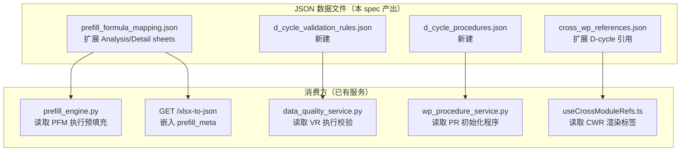

# Design Document

## 变更记录

| 版本 | 日期 | 摘要 | 触发原因 |
|------|------|------|----------|
| v1.0 | 2026-05-17 | 初始版本 | requirements.md 审批通过 |

## Overview

本设计为 D 收入循环（D0-D7）8 个底稿模板定义完整的内容预设数据——分析程序公式、明细表公式（含新 TB_AUX 类型）、D 循环内部跨底稿引用、D 循环→附注/报表跨模块引用、校验规则和审计程序清单。

核心设计原则：
- **纯数据 spec**：只产出 JSON 配置文件，不改动 prefill_engine.py 代码或前端 UI
- **扩展现有结构**：在 `prefill_formula_mapping.json` / `cross_wp_references.json` 已有 schema 基础上追加条目
- **新建两个 JSON**：`d_cycle_validation_rules.json`（校验规则）和 `d_cycle_procedures.json`（审计程序）
- **与 foundation spec 解耦**：本 spec 数据就绪后，foundation spec 的 UI 组件可直接消费

## Architecture



**数据流**：
1. 底稿生成时 → `prefill_engine` 读取 `prefill_formula_mapping.json` 中 D0-D7 的 Analysis/Detail sheet 条目 → 写入 xlsx
2. 底稿打开时 → `useCrossModuleRefs` 读取 `cross_wp_references.json` 中 D-cycle 引用 → 渲染跳转标签
3. 复核时 → `data_quality_service` 读取 `d_cycle_validation_rules.json` → 执行校验产出 findings
4. 底稿初始化时 → `wp_procedure_service` 读取 `d_cycle_procedures.json` → 创建 WorkpaperProcedure 记录

## Components and Interfaces

### D1: prefill_formula_mapping.json 扩展——Analysis_Sheet 公式

**决策**：在现有 `mappings` 数组中为每个 D0-D7 新增 `sheet` 为分析程序 sheet 名的条目。

**新增公式类型**：无需新类型。Analysis_Sheet 使用已有的 `TB`/`TB_SUM`/`PREV` 三种公式类型。

**条目结构**（与现有审定表条目完全一致）：
```json
{
  "wp_code": "D2",
  "wp_name": "应收账款分析程序",
  "sheet": "分析程序D2-5",
  "account_codes": ["1122"],
  "cells": [
    {
      "cell_ref": "上年审定数",
      "formula": "=PREV('D2','审定表D2-1','审定数')",
      "formula_type": "PREV",
      "description": "从上年底稿取应收账款审定数"
    },
    {
      "cell_ref": "本年未审数",
      "formula": "=TB('1122','期末余额')",
      "formula_type": "TB",
      "description": "从试算表取应收账款期末余额（未审）"
    }
  ]
}
```

**多科目聚合规则**：当 `account_codes` 含多个编码（如 D4 覆盖 6001+6051），Analysis_Sheet 使用 `=TB_SUM('6001~6051','期末余额')` 聚合。

### D2: prefill_formula_mapping.json 扩展——Detail_Sheet 公式（TB_AUX）

**决策**：引入新公式类型 `TB_AUX`，语法 `=TB_AUX('科目编码','辅助维度','列名')`。

**理由**：
- 明细表需要按辅助核算维度（客户/账龄/币种）分类取数
- 现有 `TB`/`TB_SUM` 只能取科目级汇总，无法按维度拆分
- `TB_AUX` 由 `prefill_engine.py` 从 `tb_aux_balance` 表取数（该表已有数据）

**引擎支持**：TB_AUX formula_type 的 prefill_engine 代码扩展由 `workpaper-completion-foundation` spec Task 1.2b 承担。本 spec 只产出 JSON 数据条目。

**条目结构**：
```json
{
  "wp_code": "D2",
  "wp_name": "应收账款客户明细表",
  "sheet": "客户明细表D2-6",
  "account_codes": ["1122"],
  "cells": [
    {
      "cell_ref": "客户余额",
      "formula": "=TB_AUX('1122','客户','期末余额')",
      "formula_type": "TB_AUX",
      "description": "从辅助余额表按客户维度取应收账款期末余额"
    }
  ]
}
```

**TB_AUX 语义**：
- 参数 1：标准科目编码
- 参数 2：辅助维度类型（对应 `tb_aux_balance.aux_type`）
- 参数 3：取数列名（期末余额/期初余额/借方发生额/贷方发生额）
- 返回：该维度下所有 aux_code 的明细行数组（非单值）

### D3: cross_wp_references.json 扩展——D 循环内部引用

**决策**：在现有 `references` 数组中追加 D 循环内部引用条目，使用新 category `"revenue_cycle"`。

**新增引用规则**：
| ref_id | 描述 | source | target | 业务含义 |
|--------|------|--------|--------|----------|
| CW-21 | D2→D0 | D2 审定数 | D0 函证确认金额 | 函证金额应与审定数一致 |
| CW-22 | D4→D2 | D4 营业收入审定数 | D2 应收周转率分析 | 收入数据用于周转率计算 |
| CW-23 | D3→D4 | D3 预收款项变动 | D4 收入确认分析 | 预收变动影响收入确认 |
| CW-24 | D2→D5 | D2 坏账准备 | D5 应收款项融资减值 | 坏账方法一致性 |

**条目结构**（复用现有 schema）：
```json
{
  "ref_id": "CW-21",
  "description": "应收账款审定数→函证确认金额",
  "source_wp": "D2",
  "source_sheet": "审定表D2-1",
  "source_cell": "审定数",
  "targets": [
    {
      "wp_code": "D0",
      "sheet": "函证汇总表D0-2",
      "cell": "应收账款审定数",
      "formula": "=WP('D2','审定表D2-1','审定数')"
    }
  ],
  "category": "revenue_cycle",
  "severity": "warning"
}
```

### D4: cross_wp_references.json 扩展——D 循环→附注引用

**决策**：新增 `target_type: "note_section"` 的引用条目，含 `target_route` 供前端跳转。

**条目结构**：
```json
{
  "ref_id": "CW-25",
  "description": "应收账款审定数→附注 5.7",
  "source_wp": "D2",
  "source_sheet": "审定表D2-1",
  "source_cell": "审定数",
  "targets": [
    {
      "wp_code": "NOTE",
      "sheet": "附注",
      "cell": "5.7 应收账款合计",
      "formula": null,
      "target_type": "note_section",
      "target_label": "→ 附注 5.7 应收账款",
      "target_route": "/projects/{pid}/disclosure-notes?section=5.7",
      "note_section_code": "5.7"
    }
  ],
  "category": "revenue_cycle",
  "severity": "warning"
}
```

### D5: cross_wp_references.json 扩展——D 循环→报表引用

**决策**：新增 `target_type: "report_row"` 的引用条目，含 `report_row_code` 供前端定位。

**条目结构**：
```json
{
  "ref_id": "CW-32",
  "description": "应收账款审定数→报表 BS-005",
  "source_wp": "D2",
  "source_sheet": "审定表D2-1",
  "source_cell": "审定数",
  "targets": [
    {
      "wp_code": "REPORT",
      "sheet": "资产负债表",
      "cell": "应收账款行",
      "formula": null,
      "target_type": "report_row",
      "target_label": "→ 报表 BS-005 应收账款",
      "target_route": "/projects/{pid}/reports?type=balance_sheet&row=BS-005",
      "report_row_code": "BS-005"
    }
  ],
  "category": "revenue_cycle",
  "severity": "info"
}
```

### D6: d_cycle_validation_rules.json 新建——校验规则 Schema

**决策**：新建独立 JSON 文件，由 `data_quality_service.py` 扩展读取。

**文件结构**：
```json
{
  "description": "D 收入循环校验规则定义",
  "version": "2025-R1",
  "rules": [
    {
      "rule_id": "DV-001",
      "rule_type": "balance_check",
      "wp_code": "D2",
      "description": "审定数 = 未审数 + AJE + RJE",
      "formula": "audited == unaudited + aje + rje",
      "tolerance": 0.01,
      "severity": "blocking",
      "scope": "all_lines",
      "cells": {
        "audited": {"sheet": "审定表D2-1", "column": "审定数"},
        "unaudited": {"sheet": "审定表D2-1", "column": "未审数"},
        "aje": {"sheet": "审定表D2-1", "column": "AJE调整"},
        "rje": {"sheet": "审定表D2-1", "column": "RJE调整"}
      },
      "message_template": "借贷不平衡: 审定数({audited}) ≠ 未审数({unaudited}) + AJE({aje}) + RJE({rje}), 差异={diff}"
    },
    {
      "rule_id": "DV-009",
      "rule_type": "tb_consistency",
      "wp_code": "D2",
      "description": "审定数与试算表一致",
      "account_codes": ["1122"],
      "tolerance": 0.01,
      "severity": "blocking",
      "cells": {
        "wp_amount": {"sheet": "审定表D2-1", "column": "审定数", "row": "total"}
      },
      "message_template": "与试算表不一致: 底稿审定数({wp_amount}) ≠ TB审定数({tb_amount}), 差异={diff}"
    },
    {
      "rule_id": "DV-017",
      "rule_type": "note_consistency",
      "wp_code": "D2",
      "description": "审定数与附注 5.7 一致",
      "note_section_code": "5.7",
      "tolerance": 0.01,
      "severity": "warning",
      "cells": {
        "wp_amount": {"sheet": "审定表D2-1", "column": "审定数", "row": "total"}
      },
      "message_template": "与附注不一致: 底稿审定数({wp_amount}) ≠ 附注合计({note_amount}), 差异={diff}",
      "skip_if_missing": true,
      "skip_message": "附注章节未生成，跳过一致性校验"
    },
    {
      "rule_id": "DV-021",
      "rule_type": "detail_total_check",
      "wp_code": "D2",
      "description": "客户明细表合计 = 审定数",
      "detail_sheet": "客户明细表D2-6",
      "tolerance": 0.01,
      "severity": "blocking",
      "cells": {
        "audited": {"sheet": "审定表D2-1", "column": "审定数", "row": "total"}
      },
      "message_template": "明细表合计({detail_sum}) ≠ 审定数({audited}), 差异={diff}"
    }
  ]
}
```

**规则类型枚举**：
- `balance_check`：审定数 = 未审数 + AJE + RJE（每个 D 底稿 1 条，共 8 条）
- `tb_consistency`：审定数 = TB 审定数（每个 D 底稿 1 条，共 8 条）
- `note_consistency`：审定数 = 附注合计（D1/D2/D4 各 1 条，共 3 条）
- `detail_total_check`：明细表合计 = 审定数（D2 客户明细 + 账龄分析，共 2 条）

**评估集成方案**：`data_quality_service.py` 新增 `_check_d_cycle_rules` 方法，读取 JSON 按 `rule_type` 分发到对应评估逻辑。不新建独立模块。

### D7: d_cycle_procedures.json 新建——审计程序 Schema

**决策**：新建独立 JSON 文件，由 `wp_procedure_service.py` 在底稿初始化时读取并创建 `WorkpaperProcedure` 记录。

**文件结构**：
```json
{
  "description": "D 收入循环审计程序清单（致同 2025 修订版）",
  "version": "2025-R1",
  "procedures": {
    "D2": {
      "wp_name": "应收账款",
      "steps": [
        {
          "step_order": 1,
          "step_name": "获取并核对明细",
          "description": "获取应收账款明细表，核对与总账余额一致",
          "is_required": true,
          "related_sheet": "客户明细表D2-6",
          "category": "substantive",
          "evidence_type": "document"
        },
        {
          "step_order": 2,
          "step_name": "核对总账",
          "description": "核对应收账款总账余额与试算平衡表一致",
          "is_required": true,
          "related_sheet": "审定表D2-1",
          "category": "substantive",
          "evidence_type": "reconciliation"
        },
        {
          "step_order": 3,
          "step_name": "函证",
          "description": "对重要客户发函确认应收账款余额",
          "is_required": true,
          "related_sheet": null,
          "category": "confirmation",
          "evidence_type": "external_confirmation"
        },
        {
          "step_order": 4,
          "step_name": "替代程序",
          "description": "对未回函客户执行替代审计程序",
          "is_required": true,
          "related_sheet": null,
          "category": "substantive",
          "evidence_type": "document"
        },
        {
          "step_order": 5,
          "step_name": "坏账准备",
          "description": "复核坏账准备计提的合理性和充分性",
          "is_required": true,
          "related_sheet": "坏账准备明细表D2-3",
          "category": "substantive",
          "evidence_type": "calculation"
        },
        {
          "step_order": 6,
          "step_name": "截止测试",
          "description": "检查期末前后收入确认和应收账款入账的截止是否正确",
          "is_required": true,
          "related_sheet": null,
          "category": "substantive",
          "evidence_type": "document"
        },
        {
          "step_order": 7,
          "step_name": "结论",
          "description": "汇总审计发现，形成应收账款审计结论",
          "is_required": true,
          "related_sheet": null,
          "category": "conclusion",
          "evidence_type": "memo"
        }
      ]
    }
  }
}
```

**与 ProcedurePanel.vue 集成**：
- `ProcedurePanel.vue` 已通过 `wp_procedures` API 读取程序列表
- `wp_procedure_service.py` 已有 `list_procedures` / `mark_complete` / `trim_procedure` CRUD
- 本 spec 只需在底稿初始化时调用 `create_custom` 或批量插入 `WorkpaperProcedure` 记录
- 前端无需改动

## Data Models

### prefill_formula_mapping.json 扩展条目统计

| 类别 | 新增条目数 | 说明 |
|------|-----------|------|
| Analysis_Sheet | 8 | D0-D7 各 1 条（上年审定数 + 本年未审数） |
| Detail_Sheet D2 | 3 | 客户明细表 + 账龄分析表 + 坏账准备计算表 |
| Detail_Sheet D1 | 1 | 票据明细表 |
| Detail_Sheet D4 | 1 | 收入明细表 |
| D5 子科目 | 1 | 112401/112402 分类公式 |
| D0 函证覆盖率 | 1 | =WP('D2',...) 引用 |
| **合计** | **15** | 在现有 94 条基础上扩展 |

### cross_wp_references.json 扩展条目统计

| 类别 | 新增条目数 | ref_id 范围 |
|------|-----------|-------------|
| D 循环内部引用 | 4 | CW-21 ~ CW-24 |
| D 循环→附注引用 | 7 | CW-25 ~ CW-31 |
| D 循环→报表引用 | 7 | CW-32 ~ CW-38 |
| **合计** | **18** | 在现有 20 条基础上扩展 |

### d_cycle_validation_rules.json 规则统计

| rule_type | 条目数 | 覆盖范围 |
|-----------|--------|----------|
| balance_check | 8 | D0-D7 各 1 条 |
| tb_consistency | 8 | D0-D7 各 1 条 |
| note_consistency | 3 | D1/D2/D4 |
| detail_total_check | 2 | D2 客户明细 + 账龄 |
| **合计** | **21** | |

### d_cycle_procedures.json 程序统计

| 底稿 | 最少步骤数 | 关键步骤 |
|------|-----------|----------|
| D0 函证 | 7 | 确定范围→编制→发函→回函→替代→差异→结论 |
| D1 应收票据 | 5 | 获取明细→核对→检查→减值→结论 |
| D2 应收账款 | 7 | 获取明细→核对→函证→替代→坏账→截止→结论 |
| D3 预收款项 | 5 | 获取明细→核对→分析→截止→结论 |
| D4 营业收入 | 6 | 获取明细→分析→截止→确认→关联方→结论 |
| D5 应收款项融资 | 5 | 获取明细→核对→分类→减值→结论 |
| D6 合同资产 | 5 | 获取明细→核对→履约→减值→结论 |
| D7 合同负债 | 5 | 获取明细→核对→分析→截止→结论 |


## Correctness Properties

*A property is a characteristic or behavior that should hold true across all valid executions of a system—essentially, a formal statement about what the system should do. Properties serve as the bridge between human-readable specifications and machine-verifiable correctness guarantees.*

### Property 1: Analysis_Sheet formula coverage

*For any* D-cycle workpaper code in {D0, D1, D2, D3, D4, D5, D6, D7}, the prefill_formula_mapping.json SHALL contain at least one Analysis_Sheet entry with both a "上年审定数" cell (formula_type=PREV) and a "本年未审数" cell (formula_type=TB or TB_SUM).

**Validates: Requirements 1.1, 1.2, 1.3**

### Property 2: Multi-account TB_SUM consistency

*For any* prefill_formula_mapping.json entry where `account_codes` contains more than one code, all Analysis_Sheet cells with formula_type "TB" or "TB_SUM" SHALL use TB_SUM with a range covering all listed account codes (not individual TB calls).

**Validates: Requirements 1.4**

### Property 3: D-cycle internal reference categorization

*For any* cross_wp_references.json entry where both `source_wp` and all target `wp_code` values are in {D0, D1, D2, D3, D4, D5, D6, D7}, the entry SHALL have `category = "revenue_cycle"` and `severity = "warning"`.

**Validates: Requirements 3.6**

### Property 4: Cross-module reference structural completeness

*For any* cross_wp_references.json entry with a target containing `target_type = "note_section"`, that target SHALL also contain a non-empty `target_route` string and a non-empty `note_section_code`. *For any* entry with `target_type = "report_row"`, that target SHALL contain a non-empty `target_route` and a non-empty `report_row_code`.

**Validates: Requirements 4.8, 5.8**

### Property 5: Balance check validation correctness

*For any* set of workpaper cell values (audited, unaudited, aje, rje) where `|audited - (unaudited + aje + rje)| > 0.01`, evaluating the balance_check rule SHALL produce a finding with severity "blocking". Conversely, when `|audited - (unaudited + aje + rje)| <= 0.01`, no finding SHALL be produced.

**Validates: Requirements 6.1, 6.2, 6.3, 6.4**

### Property 6: TB consistency validation correctness

*For any* D-cycle workpaper and corresponding trial_balance entry with the same account_code, when `|wp_audited - tb_audited| > 0.01`, evaluating the tb_consistency rule SHALL produce a finding with severity "blocking". When the difference is within tolerance, no finding SHALL be produced.

**Validates: Requirements 7.1, 7.2, 7.3**

### Property 7: Cross-file account code consistency

*For any* D-cycle workpaper code, the `account_codes` array in its `d_cycle_validation_rules.json` tb_consistency rule SHALL be identical to the `account_codes` array in its corresponding `prefill_formula_mapping.json` 审定表 entry.

**Validates: Requirements 7.4**

### Property 8: Procedure step schema and completeness

*For any* procedure step entry in d_cycle_procedures.json, the entry SHALL contain all required fields: step_order (integer), step_name (non-empty string), description (non-empty string), is_required (boolean), and related_sheet (string or null). Additionally, *for any* D-cycle workpaper code in {D0-D7}, there SHALL be at least 5 procedure steps defined.

**Validates: Requirements 10.4, 10.5**

### Property 9: Sub-account dynamic formula generation

*For any* workpaper with account_code "1124" (D5), when the client's chart of accounts contains sub-accounts (e.g. 112401, 112402), the prefill_formula_mapping.json SHALL contain separate TB formula entries for each sub-account. When no sub-accounts exist, a single TB('1124',...) formula SHALL be used.

**Validates: Requirements 11.1, 11.2**

### Property 10: Validation rule tolerance symmetry

*For any* validation rule with tolerance T, the rule SHALL pass (produce no finding) when the absolute difference equals exactly T, and SHALL fail (produce a finding) when the absolute difference exceeds T by any amount.

**Validates: Requirements 6.2, 9.4**

## Error Handling

| 场景 | 处理方式 |
|------|----------|
| prefill_formula_mapping.json 中 TB_AUX 引用的辅助维度不存在 | 该 cell 留空 + prefill_source="AUX_UNAVAILABLE" + logger.warning |
| 上年数据不可用（首年审计） | PREV 公式 cell 留空 + prefill_source="PREV_UNAVAILABLE" |
| d_cycle_validation_rules.json 格式错误 | 校验服务启动时 JSON Schema 验证失败 → 跳过该文件 + logger.error |
| note_consistency 目标附注章节未生成 | 跳过该规则 + 产出 info 级 finding "附注章节未生成，跳过一致性校验" |
| d_cycle_procedures.json 格式错误 | 程序初始化时跳过 + logger.error，底稿仍可正常使用 |
| cross_wp_references.json 中引用的目标底稿不存在 | 标签灰色 + tooltip "目标底稿未生成" |
| 校验规则引用的 sheet/column 在实际底稿中不存在 | 跳过该规则 + 产出 warning 级 finding "规则引用的工作表不存在" |

## Testing Strategy

### 单元测试（pytest）

- `test_d_cycle_formula_mapping.py`：验证 JSON 结构完整性、8 个 D 底稿 Analysis_Sheet 覆盖、TB_AUX 公式语法
- `test_d_cycle_cross_references.py`：验证 18 条新引用的 ref_id 唯一性、category/severity 正确性、target_type 字段完整性
- `test_d_cycle_validation_rules.py`：验证 21 条规则的 JSON Schema、rule_type 枚举、message_template 占位符
- `test_d_cycle_procedures.py`：验证 8 个底稿程序步骤数 ≥ 5、必填字段完整、step_order 连续

### 属性测试（Hypothesis）

- PBT 库：hypothesis（已安装 6.152.4）
- 每个 Property 对应一个 `@given` 装饰的测试函数
- 最低 `max_examples=50`（P0 关键属性如 Property 5/6/7/10）
- 测试文件：`backend/tests/test_d_cycle_revenue_properties.py`
- 每个测试函数 docstring 标注：`# Feature: workpaper-cycle-d-revenue, Property N: {title}`

**属性测试重点**：
- Property 5（balance_check）：生成随机金额四元组，验证容差判定逻辑
- Property 6（tb_consistency）：生成随机 wp_amount/tb_amount 对，验证比较逻辑
- Property 7（cross-file consistency）：加载两个 JSON 文件，验证 account_codes 交叉一致
- Property 10（tolerance symmetry）：生成边界值（恰好等于/略超容差），验证判定边界

### 集成测试

- `test_d_cycle_validation_integration.py`：用陕西华氏真实数据验证 balance_check + tb_consistency 规则
- `test_d_cycle_prefill_integration.py`：验证 prefill_engine 正确读取新增 Analysis/Detail sheet 条目
- `test_d_cycle_procedures_integration.py`：验证 wp_procedure_service 从 JSON 初始化程序记录
