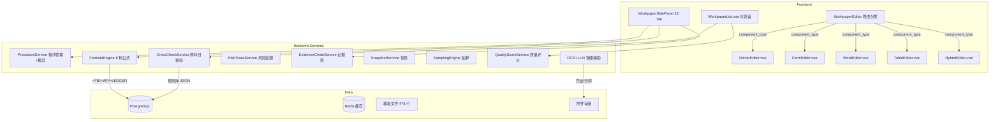

# 设计文档：底稿深度优化

## 概述

本设计基于 requirements.md 的 41 个需求 + 27 个正确性属性，定义底稿深度优化的技术架构、数据模型、组件设计和实现方案。

核心策略：**复用现有基础设施**（Univer 编辑器 + EventBus + SSE + Redis + prefill_engine + wp_fine_rule_engine），在此基础上扩展 5 种编辑器组件、公式引擎、跨科目校验、程序裁剪、证据链和智能辅助能力。

### 设计原则

1. **渐进增强**：不替换现有 Univer 编辑器，而是在其基础上增加 4 种新编辑器组件
2. **配置驱动**：模板元数据、程序清单、校验规则、联动映射全部 JSON 配置化
3. **事件驱动**：底稿变更通过 EventBus 传播到试算表/报表/附注/其他底稿
4. **最小侵入**：新增表和服务，尽量不修改现有 working_paper_service 核心逻辑

---

## 架构

### 整体架构图



---

## 架构决策

### D1：编辑器组件路由分发

- WorkpaperEditor.vue 改为**路由分发器**：根据 `wp_template_metadata.component_type` 加载对应子组件
- 5 种子组件共享 SidePanel（12 Tab）和顶部工具栏
- 实现方式：动态组件 `<component :is="editorComponent" />`

### D2：模板元数据存储

- 新建 `wp_template_metadata` 表（非修改现有 wp_template 表）
- 每个模板一行，含 component_type / procedure_steps / formula_cells / conclusion_cell 等 JSONB 字段
- 模板导入时自动解析 Excel 结构生成元数据（半自动，管理员确认）

### D3：程序清单与裁剪

- 程序清单存储在 `workpaper_procedures` 表（每个底稿实例一份，从模板 procedure_steps 复制）
- 裁剪操作 = UPDATE status='not_applicable' + 记录 audit_log
- 前端侧面板"程序"Tab 展示裁剪后清单，支持勾选完成

### D4：公式引擎扩展

- 扩展现有 `prefill_engine.py`，新增 6 种公式类型（=WP/=LEDGER/=AUX/=PREV/=ADJ/=NOTE）
- 公式解析器：正则提取 → 构建依赖图 → 拓扑排序 → 逐个求值
- 增量刷新：stale 标记 + 只重算受影响的公式

### D5：跨科目校验引擎

- 规则库：`backend/data/cross_account_rules.json`（声明式，支持热加载）
- 执行器：`CrossCheckService.execute(project_id, year, rule_ids=None)`
- 结果存储：`cross_check_results` 表（持久化，支持历史对比）
- 触发时机：底稿保存（增量）/ 手动（全量）/ 签字前门禁（全量 blocking）

### D6：证据链模型

- 新建 `evidence_links` 表：wp_id + sheet + cell_ref + attachment_id + page_ref + evidence_type + check_conclusion
- 前端：Univer 单元格右键"引用附件" → 弹出附件选择器 → 建立 link
- 展示：单元格右上角📎图标 + hover 预览

### D7：快照机制

- 新建 `workpaper_snapshots` 表：wp_id + trigger_event + snapshot_data(JSONB) + created_by + created_at
- snapshot_data 存储所有公式单元格的当前值（不存整个 Univer JSON，太大）
- 签字时点快照绑定 bound_dataset_id，不可删除

### D8：质量评分

- 计算公式：完整性 30% + 一致性 25% + 复核状态 20% + 程序完成率 15% + 自检通过率 10%
- 缓存到 `working_paper.quality_score` 字段（每次触发重算时更新）
- 触发时机：保存 / 复核变更 / 校验完成 / 程序步骤变更

### D9：OCR + LLM 智能辅助

- OCR：复用现有 `unified_ocr_service`，新增"凭证结构化提取"模板
- LLM：复用现有 `llm_client.chat_completion`，新增审计说明 prompt 模板
- 输出统一用 `wrap_ai_output()` 格式，门禁 `AIContentMustBeConfirmedRule` 检查

### D10：事件驱动联动

- 新增 5 个 EventType（WORKPAPER_AUDITED_CONFIRMED 等）
- 事件传播链路复用 enterprise-linkage spec 的 event_cascade_log 基础设施
- 前端通过 SSE 接收事件，自动刷新受影响视图

### D11：底稿生命周期状态机

- 状态枚举：created / drafting / self_checked / submitted / level1_review / level2_review / partner_review / eqcr_review / archived / interim_completed
- 状态流转受门禁控制（gate_engine 集成）
- 退回操作：任何复核阶段→drafting（附退回原因）
- 期中/期末衔接：interim_completed 为中间态，期末进场时标记"需更新至期末"

### D12：复核批注（单元格级）

- 新建 `cell_annotations` 表：wp_id + sheet + row + col + content + status(open/replied/resolved) + created_by + replied_by + resolved_by
- 前端：Univer 单元格右上角红色三角标记 + hover 展示批注内容
- 侧面板"复核意见"Tab：按状态筛选 + 点击定位到对应单元格
- 与 ReviewRecord 模型互补：ReviewRecord 是底稿级评论，cell_annotations 是单元格级精确定位

### D13：批量操作与导出打印

- 批量预填充：asyncio.gather 并行执行 + 进度 SSE 推送
- 批量导出 PDF：逐个调用 LibreOffice headless 转换 + 打包 ZIP
- PDF 格式：页眉（事务所+项目+底稿编码）/ 页脚（页码）/ 签字栏
- 批量提交复核：有 blocking finding 的跳过 + 返回跳过原因清单

---

## 数据模型

### 新增表

#### `wp_template_metadata`

```sql
CREATE TABLE wp_template_metadata (
    id UUID PRIMARY KEY DEFAULT gen_random_uuid(),
    template_id UUID REFERENCES wp_templates(id),
    wp_code VARCHAR(20) NOT NULL,
    component_type VARCHAR(20) NOT NULL DEFAULT 'univer',
    audit_stage VARCHAR(30) NOT NULL,
    cycle VARCHAR(10),
    file_format VARCHAR(10),
    procedure_steps JSONB DEFAULT '[]',
    guidance_text TEXT,
    formula_cells JSONB DEFAULT '[]',
    required_regions JSONB DEFAULT '[]',
    linked_accounts JSONB DEFAULT '[]',
    note_section VARCHAR(20),
    conclusion_cell JSONB,
    audit_objective TEXT,
    related_assertions JSONB DEFAULT '[]',
    procedure_flow_config TEXT,
    created_at TIMESTAMPTZ DEFAULT now(),
    updated_at TIMESTAMPTZ DEFAULT now()
);
CREATE INDEX idx_wp_tmpl_meta_code ON wp_template_metadata(wp_code);
CREATE INDEX idx_wp_tmpl_meta_stage ON wp_template_metadata(audit_stage);
```

#### `workpaper_procedures`

```sql
CREATE TABLE workpaper_procedures (
    id UUID PRIMARY KEY DEFAULT gen_random_uuid(),
    wp_id UUID NOT NULL REFERENCES working_paper(id),
    project_id UUID NOT NULL REFERENCES projects(id),
    procedure_id VARCHAR(20) NOT NULL,
    description TEXT NOT NULL,
    category VARCHAR(30) NOT NULL DEFAULT 'routine',
    is_mandatory BOOLEAN NOT NULL DEFAULT true,
    applicable_project_types JSONB DEFAULT '["all"]',
    depends_on JSONB DEFAULT '[]',
    evidence_type VARCHAR(20),
    status VARCHAR(20) NOT NULL DEFAULT 'pending',
    completed_by UUID,
    completed_at TIMESTAMPTZ,
    trimmed_by UUID,
    trimmed_at TIMESTAMPTZ,
    trim_reason TEXT,
    sort_order INT DEFAULT 0,
    created_at TIMESTAMPTZ DEFAULT now()
);
CREATE INDEX idx_wp_proc_wp ON workpaper_procedures(wp_id);
CREATE INDEX idx_wp_proc_status ON workpaper_procedures(wp_id, status);
```

#### `cross_check_results`

```sql
CREATE TABLE cross_check_results (
    id UUID PRIMARY KEY DEFAULT gen_random_uuid(),
    project_id UUID NOT NULL REFERENCES projects(id),
    year INT NOT NULL,
    rule_id VARCHAR(30) NOT NULL,
    left_amount NUMERIC(20,2),
    right_amount NUMERIC(20,2),
    difference NUMERIC(20,2),
    status VARCHAR(20) NOT NULL,
    details JSONB,
    checked_at TIMESTAMPTZ DEFAULT now()
);
CREATE INDEX idx_cross_check_project ON cross_check_results(project_id, year, checked_at DESC);
```

#### `evidence_links`

```sql
CREATE TABLE evidence_links (
    id UUID PRIMARY KEY DEFAULT gen_random_uuid(),
    wp_id UUID NOT NULL REFERENCES working_paper(id),
    sheet_name VARCHAR(100),
    cell_ref VARCHAR(20),
    attachment_id UUID NOT NULL REFERENCES attachments(id),
    page_ref VARCHAR(50),
    evidence_type VARCHAR(30),
    check_conclusion VARCHAR(200),
    created_by UUID NOT NULL,
    created_at TIMESTAMPTZ DEFAULT now()
);
CREATE INDEX idx_evidence_wp ON evidence_links(wp_id);
CREATE INDEX idx_evidence_attachment ON evidence_links(attachment_id);
```

#### `workpaper_snapshots`

```sql
CREATE TABLE workpaper_snapshots (
    id UUID PRIMARY KEY DEFAULT gen_random_uuid(),
    wp_id UUID NOT NULL REFERENCES working_paper(id),
    trigger_event VARCHAR(50) NOT NULL,
    snapshot_data JSONB NOT NULL,
    created_by UUID NOT NULL,
    created_at TIMESTAMPTZ DEFAULT now(),
    is_locked BOOLEAN DEFAULT false,
    bound_dataset_id UUID
);
CREATE INDEX idx_wp_snapshot ON workpaper_snapshots(wp_id, created_at DESC);
```

### 现有表修改

```sql
ALTER TABLE working_paper ADD COLUMN quality_score INT DEFAULT 0;
ALTER TABLE working_paper ADD COLUMN consistency_status VARCHAR(20) DEFAULT 'unchecked';
ALTER TABLE working_paper ADD COLUMN procedure_completion_rate NUMERIC(5,2) DEFAULT 0;
ALTER TABLE working_paper ADD COLUMN wp_status VARCHAR(30) DEFAULT 'created';
```

#### `cell_annotations`

```sql
CREATE TABLE cell_annotations (
    id UUID PRIMARY KEY DEFAULT gen_random_uuid(),
    wp_id UUID NOT NULL REFERENCES working_paper(id),
    sheet_name VARCHAR(100) NOT NULL,
    row_idx INT NOT NULL,
    col_idx INT NOT NULL,
    content TEXT NOT NULL,
    status VARCHAR(20) NOT NULL DEFAULT 'open',
    created_by UUID NOT NULL REFERENCES users(id),
    created_at TIMESTAMPTZ DEFAULT now(),
    replied_by UUID,
    replied_at TIMESTAMPTZ,
    reply_content TEXT,
    resolved_by UUID,
    resolved_at TIMESTAMPTZ
);
CREATE INDEX idx_cell_anno_wp ON cell_annotations(wp_id);
CREATE INDEX idx_cell_anno_status ON cell_annotations(wp_id, status);
```

</text>
</invoke>

---

## 组件与接口

### 后端新增模块

```
backend/app/services/
├── wp_procedure_service.py        # 程序管理+裁剪
├── wp_cross_check_service.py      # 跨科目校验引擎
├── wp_risk_trace_service.py       # 风险追溯
├── wp_evidence_service.py         # 证据链管理
├── wp_snapshot_service.py         # 快照服务
├── wp_sampling_engine.py          # 统一抽样引擎
├── wp_quality_score_service.py    # 质量评分
├── wp_conclusion_service.py       # 结论提取与汇总
├── wp_note_linkage_service.py     # 底稿↔附注联动

backend/app/routers/
├── wp_procedures.py               # 程序管理 API
├── wp_cross_check.py              # 跨科目校验 API
├── wp_risk_trace.py               # 风险追溯 API
├── wp_evidence.py                 # 证据链 API
├── wp_snapshots.py                # 快照 API
├── wp_sampling.py                 # 抽样 API
├── wp_quality.py                  # 质量评分 API
├── wp_conclusions.py              # 结论汇总 API
```

### 前端新增模块

```
audit-platform/frontend/src/
├── views/
│   ├── WorkpaperFormEditor.vue    # 结构化表单编辑器
│   ├── WorkpaperWordEditor.vue    # Word 文档编辑器
│   ├── WorkpaperTableEditor.vue   # el-table 编辑器
│   └── WorkpaperHybridEditor.vue  # 混合视图编辑器
├── components/workpaper/
│   ├── ProcedurePanel.vue         # 程序清单+裁剪面板
│   ├── ProcedureFlowChart.vue     # 程序流程图（mermaid）
│   ├── CrossCheckPanel.vue        # 跨科目校验结果面板
│   ├── EvidenceLinkPanel.vue      # 证据链管理面板
│   ├── SnapshotCompare.vue        # 快照对比视图
│   ├── QualityScoreBadge.vue      # 质量评分徽章
│   ├── ConclusionOverview.vue     # 结论总览视图
│   ├── RiskTraceGraph.vue         # 风险追溯链路图
│   ├── SamplingWizard.vue         # 抽样向导
│   ├── OCRResultPanel.vue         # OCR 识别结果面板
│   └── AISuggestionPopover.vue    # AI 建议浮窗
├── composables/
│   ├── useProcedures.ts           # 程序管理 composable
│   ├── useCrossCheck.ts           # 跨科目校验 composable
│   ├── useEvidenceLink.ts         # 证据链 composable
│   └── useQualityScore.ts         # 质量评分 composable
```

### API 端点设计

#### 程序管理（`/api/projects/{pid}/workpapers/{wp_id}/procedures`）

| 方法 | 路径 | 说明 |
|------|------|------|
| GET | `/` | 获取程序清单（含裁剪状态） |
| PATCH | `/{proc_id}/complete` | 标记程序完成 |
| PATCH | `/{proc_id}/trim` | 裁剪程序（经理/合伙人） |
| POST | `/custom` | 新增自定义程序 |
| POST | `/copy-from-prior` | 从上年复制程序清单 |

#### 跨科目校验（`/api/projects/{pid}/cross-check`）

| 方法 | 路径 | 说明 |
|------|------|------|
| POST | `/execute` | 执行校验（全量或指定规则） |
| GET | `/results` | 获取最近校验结果 |
| GET | `/rules` | 获取规则库 |
| POST | `/rules/custom` | 新增项目级自定义规则 |

#### 证据链（`/api/projects/{pid}/workpapers/{wp_id}/evidence`）

| 方法 | 路径 | 说明 |
|------|------|------|
| GET | `/` | 获取底稿所有证据链接 |
| POST | `/link` | 创建证据链接（单元格→附件） |
| DELETE | `/{link_id}` | 删除证据链接 |
| POST | `/batch-link` | 批量关联（区域→多附件） |

#### 快照（`/api/projects/{pid}/workpapers/{wp_id}/snapshots`）

| 方法 | 路径 | 说明 |
|------|------|------|
| GET | `/` | 获取快照列表 |
| GET | `/{snapshot_id}` | 获取快照详情 |
| GET | `/compare` | 对比两个快照 |

#### 质量评分（`/api/projects/{pid}/quality`）

| 方法 | 路径 | 说明 |
|------|------|------|
| GET | `/scores` | 获取所有底稿质量评分 |
| GET | `/dashboard` | 获取仪表盘数据 |
| POST | `/recalculate` | 手动触发重算 |

#### 抽样（`/api/projects/{pid}/sampling`）

| 方法 | 路径 | 说明 |
|------|------|------|
| POST | `/calculate` | 计算样本量 |
| POST | `/select` | 执行随机选样 |
| POST | `/evaluate` | 评价抽样结果 |

---

## 公式引擎详细设计

### 公式解析流程

```python
# 1. 扫描底稿所有单元格，提取含公式的单元格
formulas = scan_formulas(wp_cells)  # 返回 [FormulaCell(sheet, ref, type, args)]

# 2. 构建依赖图
dep_graph = build_dependency_graph(formulas)
# 检测循环引用
if has_cycle(dep_graph):
    raise CircularReferenceError(cycle_path)

# 3. 拓扑排序
eval_order = topological_sort(dep_graph)

# 4. 逐个求值
results = {}
for formula in eval_order:
    value = evaluate(formula, context={
        'tb_data': trial_balance_cache,
        'wp_data': other_wp_cache,
        'ledger_data': ledger_cache,
        'adj_data': adjustment_cache,
        'note_data': note_cache,
        'prev_data': prior_year_cache,
    })
    results[formula.cell_ref] = value

# 5. 写入结果 + 记录 provenance
write_results(wp_id, results)
record_provenance(wp_id, results, source_refs)
```

### 公式类型实现

| 公式 | 解析正则 | 数据源 | 缓存策略 |
|------|---------|--------|---------|
| =TB(code, col) | `TB\('([^']+)',\s*'([^']+)'\)` | trial_balance 表 | 项目级 Redis 5min |
| =TB_SUM(range, col) | `TB_SUM\('([^']+)',\s*'([^']+)'\)` | trial_balance 表 | 同上 |
| =WP(wp, sheet, cell) | `WP\('([^']+)',\s*'([^']+)',\s*'([^']+)'\)` | 其他底稿 parsed_data | 无缓存（实时读） |
| =LEDGER(code, dir, period) | `LEDGER\('([^']+)',\s*'([^']+)',\s*'([^']+)'\)` | tb_ledger 表 | 项目级 Redis 10min |
| =AUX(code, type, aux, col) | `AUX\('([^']+)',\s*'([^']+)',\s*'([^']+)',\s*'([^']+)'\)` | tb_aux_balance 表 | 项目级 Redis 5min |
| =PREV(wp, sheet, cell) | `PREV\('([^']+)',\s*'([^']+)',\s*'([^']+)'\)` | 上年底稿 | 无缓存 |
| =ADJ(code, type) | `ADJ\('([^']+)',\s*'([^']+)'\)` | adjustments 表 | 无缓存（实时） |
| =NOTE(section, row, col) | `NOTE\('([^']+)',\s*'([^']+)',\s*'([^']+)'\)` | disclosure_notes | 无缓存 |

---

## 跨科目校验规则库设计

### 规则 JSON 格式

```json
{
  "rules": [
    {
      "rule_id": "XR-01",
      "description": "折旧分摊一致性",
      "formula": "WP('H1','审定表','本期折旧') == WP('K8','审定表','折旧') + WP('K9','审定表','折旧') + WP('F5','审定表','折旧')",
      "tolerance": 0.01,
      "severity": "blocking",
      "applicable_stages": ["completion"],
      "applicable_cycles": ["H", "K", "F"],
      "enabled": true
    },
    {
      "rule_id": "XR-02",
      "description": "薪酬分摊一致性",
      "formula": "WP('J1','审定表','本期计提') == WP('K8','审定表','薪酬') + WP('K9','审定表','薪酬') + WP('F5','审定表','薪酬')",
      "tolerance": 0.01,
      "severity": "blocking",
      "applicable_stages": ["completion"],
      "applicable_cycles": ["J", "K", "F"]
    },
    {
      "rule_id": "XR-03",
      "description": "信用减值损失一致性",
      "formula": "WP('G14','审定表','合计') == WP('D2','坏账','本期计提') + WP('K1','坏账','本期计提')",
      "tolerance": 0.01,
      "severity": "warning",
      "applicable_cycles": ["G", "D", "K"]
    },
    {
      "rule_id": "XR-04",
      "description": "所得税费用等式",
      "formula": "WP('N5','审定表','合计') == WP('N2','审定表','当期所得税') + (WP('N1','审定表','期末') - WP('N1','审定表','期初')) + (WP('N3','审定表','期初') - WP('N3','审定表','期末'))",
      "tolerance": 0.01,
      "severity": "blocking",
      "applicable_cycles": ["N"]
    },
    {
      "rule_id": "XR-05",
      "description": "未分配利润等式",
      "formula": "WP('M6','审定表','期末') == WP('M6','审定表','期初') + TB_SUM('5001~6999','审定数') - WP('M5','审定表','本期提取') - WP('M1','审定表','本期分配')",
      "tolerance": 0.01,
      "severity": "blocking",
      "applicable_cycles": ["M"]
    }
  ]
}
```

---

## 错误处理

| 场景 | 处理方式 |
|------|----------|
| 公式引用的底稿未编制 | 返回 null + 标记 ⏳ 等待上游 |
| 公式循环引用 | 检测到即报错，不执行预填充 |
| 跨科目校验底稿缺失 | 标记规则为"不适用"（底稿未编制） |
| OCR 识别失败 | 标记低置信度 + 人工复核提示 |
| LLM 生成超时 | 降级为空 + 提示"AI 暂不可用" |
| 快照数据过大 | 只存公式单元格值（非全量 Univer JSON） |
| 证据链附件被删 | 阻止删除 + 提示引用清单 |

---

## 测试策略

### 属性测试（Hypothesis）

- 质量评分幂等性 + 边界（属性 1/8）
- 跨科目校验等式对称性（属性 9）
- 公式依赖图无环（属性 16）
- 预填充幂等性（属性 7）
- 程序完成率严格递增（属性 5）
- 快照不变性（属性 13）

### 单元测试

- 公式解析器：8 种公式类型的正则匹配
- 依赖图构建：拓扑排序 + 循环检测
- 质量评分计算：各维度权重
- 程序裁剪：权限校验 + 完成率计算

### 集成测试

- 底稿保存 → 一致性校验 → stale 传播 → SSE 通知 全链路
- 预填充 → provenance 记录 → 穿透展示 全链路
- 程序裁剪 → 完成率重算 → 质量评分更新 全链路
- OCR 上传 → 识别 → 填入抽凭表 全链路

---

## 预设公式库（基于致同 2025 模板实际分析）

### 致同模板公式特征总结

基于对 D2/D4/E1/H1/N1/G7/J1/K9/L1/M6 等 10 个代表性模板的分析：

- **21 种 Excel 函数**：SUM / SUMIF / SUMPRODUCT / IF / AND / OR / IFERROR / VLOOKUP / ROUND / MAX / MIN / AVERAGE / DATE / DATEDIF / DAY / MONTH / YEAR / LEFT / RIGHT / LEN / VALUE
- **2889 个跨 sheet 引用**（10 个模板合计）
- **公式分三类**：
  1. **项目信息引用**：`=底稿目录!A2`（项目名称/年度/编制人等，所有 sheet 都有）
  2. **sheet 间汇总**：`=SUMIF('明细表D2-2'!$AI$13:$AI$25,"单项计提",'明细表D2-2'!$S$13:$S$25)`（审定表从明细表按条件汇总）
  3. **行内计算**：`=SUM(B8:D8)` / `=I8-E8` / `=IF(AND(E8=0,I8=0),"",J8/E8)`（合计/差异/变动率）

### 预设公式分类（系统需支持的自动运算）

#### 类型 1：审定表标准公式（所有 D-N 审定表通用）

```json
{
  "preset_formulas": {
    "audited_table_standard": [
      {
        "id": "AT-01",
        "name": "期初余额取数",
        "formula": "=TB('{account_code}', '期初余额')",
        "target": "审定表.期初余额列",
        "description": "从试算表自动取期初余额"
      },
      {
        "id": "AT-02",
        "name": "未审数取数",
        "formula": "=TB('{account_code}', '期末余额')",
        "target": "审定表.未审数列",
        "description": "从试算表自动取期末余额（未审）"
      },
      {
        "id": "AT-03",
        "name": "AJE调整取数",
        "formula": "=ADJ('{account_code}', 'aje_net')",
        "target": "审定表.AJE调整列",
        "description": "从调整分录自动取AJE净额"
      },
      {
        "id": "AT-04",
        "name": "RJE调整取数",
        "formula": "=ADJ('{account_code}', 'rje_net')",
        "target": "审定表.RJE调整列",
        "description": "从调整分录自动取RJE净额"
      },
      {
        "id": "AT-05",
        "name": "审定数计算",
        "formula": "=未审数 + AJE调整 + RJE调整",
        "target": "审定表.审定数列",
        "description": "审定数 = 未审数 + AJE + RJE（Univer 内部公式）"
      },
      {
        "id": "AT-06",
        "name": "变动额计算",
        "formula": "=审定数 - 期初余额",
        "target": "审定表.变动额列",
        "description": "本期变动 = 期末审定 - 期初"
      },
      {
        "id": "AT-07",
        "name": "变动率计算",
        "formula": "=IF(期初=0, '', 变动额/期初)",
        "target": "审定表.变动率列",
        "description": "变动率 = 变动额 / 期初（期初为0时不计算）"
      },
      {
        "id": "AT-08",
        "name": "上年审定数取数",
        "formula": "=PREV('{wp_code}', '审定表', '审定数')",
        "target": "审定表.上年审定数列",
        "description": "从上年同底稿取审定数"
      }
    ]
  }
}
```

#### 类型 2：跨底稿引用公式（科目间联动）

```json
{
  "cross_wp_formulas": [
    {
      "id": "CW-01",
      "name": "折旧分摊到销售费用",
      "source_wp": "H1",
      "source_sheet": "折旧分配分析表H1-13",
      "source_cell": "C8",
      "target_wp": "K8",
      "target_sheet": "审定表",
      "target_cell": "折旧行",
      "formula": "=WP('H1', '折旧分配分析表H1-13', 'C8')"
    },
    {
      "id": "CW-02",
      "name": "折旧分摊到管理费用",
      "source_wp": "H1",
      "source_sheet": "折旧分配分析表H1-13",
      "source_cell": "D8",
      "target_wp": "K9",
      "target_sheet": "审定表",
      "target_cell": "折旧行",
      "formula": "=WP('H1', '折旧分配分析表H1-13', 'D8')"
    },
    {
      "id": "CW-03",
      "name": "折旧分摊到生产成本",
      "source_wp": "H1",
      "source_sheet": "折旧分配分析表H1-13",
      "source_cell": "E8",
      "target_wp": "F5",
      "target_sheet": "审定表",
      "target_cell": "折旧行",
      "formula": "=WP('H1', '折旧分配分析表H1-13', 'E8')"
    },
    {
      "id": "CW-04",
      "name": "应收坏账到信用减值",
      "source_wp": "D2",
      "source_sheet": "坏账准备明细表D2-3",
      "source_cell": "本期计提合计",
      "target_wp": "G14",
      "target_sheet": "审定表",
      "target_cell": "应收账款减值行",
      "formula": "=WP('D2', '坏账准备明细表D2-3', '本期计提合计')"
    },
    {
      "id": "CW-05",
      "name": "净利润到未分配利润",
      "source_wp": "IS",
      "source_sheet": "利润表",
      "source_cell": "净利润",
      "target_wp": "M6",
      "target_sheet": "审定表",
      "target_cell": "本年净利润行",
      "formula": "=TB_SUM('5001~6999', '审定数')"
    },
    {
      "id": "CW-06",
      "name": "薪酬分摊到销售费用",
      "source_wp": "J1",
      "source_sheet": "审定表",
      "source_cell": "销售人员薪酬",
      "target_wp": "K8",
      "target_sheet": "审定表",
      "target_cell": "薪酬行",
      "formula": "=WP('J1', '审定表', '销售人员薪酬')"
    },
    {
      "id": "CW-07",
      "name": "借款利息到财务费用",
      "source_wp": "L1",
      "source_sheet": "审定表",
      "source_cell": "利息支出合计",
      "target_wp": "L8",
      "target_sheet": "审定表",
      "target_cell": "利息支出行",
      "formula": "=WP('L1', '审定表', '利息支出') + WP('L3', '审定表', '利息支出')"
    }
  ]
}
```

#### 类型 3：交叉校验公式（自动运算后校验等式）

```json
{
  "validation_formulas": [
    {
      "id": "VF-01",
      "name": "审定表借贷平衡",
      "formula": "SUM(所有资产类审定数) == SUM(所有负债类审定数) + SUM(所有权益类审定数)",
      "scope": "全项目",
      "severity": "blocking"
    },
    {
      "id": "VF-02",
      "name": "折旧分摊完整性",
      "formula": "WP('H1','折旧分配分析表','合计') == WP('H1','审定表','本期折旧')",
      "scope": "H循环",
      "severity": "blocking"
    },
    {
      "id": "VF-03",
      "name": "坏账准备一致性",
      "formula": "WP('D2','审定表','坏账准备期末') == WP('D2','坏账准备明细表','合计')",
      "scope": "D循环",
      "severity": "blocking"
    },
    {
      "id": "VF-04",
      "name": "收入成本配比",
      "formula": "WP('D4','审定表','主营收入') > 0 IMPLIES WP('F5','审定表','主营成本') > 0",
      "scope": "D+F循环",
      "severity": "warning"
    },
    {
      "id": "VF-05",
      "name": "利息收支合理性",
      "formula": "ABS(WP('E1','审定表','利息收入') / AVG(WP('E1','审定表','期初'),WP('E1','审定表','期末')) - 0.02) < 0.03",
      "scope": "E循环",
      "severity": "warning",
      "description": "利息收入/平均余额 应在 2%±3% 范围内（活期+定期混合）"
    },
    {
      "id": "VF-06",
      "name": "递延所得税等式",
      "formula": "WP('N5','审定表','所得税费用') == WP('N2','审定表','当期所得税') + (WP('N1','审定表','期末') - WP('N1','审定表','期初')) - (WP('N3','审定表','期末') - WP('N3','审定表','期初'))",
      "scope": "N循环",
      "severity": "blocking"
    },
    {
      "id": "VF-07",
      "name": "未分配利润等式",
      "formula": "WP('M6','审定表','期末') == WP('M6','审定表','期初') + TB_SUM('5001~6999','审定数') - WP('M5','审定表','本期提取') - WP('M1','审定表','本期分配')",
      "scope": "M循环",
      "severity": "blocking"
    },
    {
      "id": "VF-08",
      "name": "使用权资产与租赁负债配对",
      "formula": "WP('H8','审定表','本期摊销') + WP('H9','审定表','本期利息') == WP('H8','审定表','本期付款')",
      "scope": "H循环",
      "severity": "warning"
    }
  ]
}
```

#### 类型 4：底稿内 Univer 原生公式（保持 Excel 兼容）

致同模板中实际使用的 21 种 Excel 函数，Univer 必须全部支持：

| 函数 | 用途 | 典型场景 |
|------|------|---------|
| SUM | 合计 | 审定表各列合计行 |
| SUMIF | 条件汇总 | 审定表从明细表按"单项计提/账龄组合"分类汇总 |
| SUMPRODUCT | 多条件汇总 | 加权平均计算 |
| IF/AND/OR | 条件判断 | 变动率计算（分母为0时不计算） |
| IFERROR | 错误处理 | VLOOKUP 找不到时返回空 |
| VLOOKUP | 查找引用 | 从科目表取科目名称 |
| ROUND | 四舍五入 | 金额保留2位小数 |
| MAX/MIN | 极值 | 可收回金额 = MAX(公允价值-处置费用, 使用价值) |
| AVERAGE | 平均 | 平均余额计算（利息合理性） |
| DATE/DATEDIF/DAY/MONTH/YEAR | 日期计算 | 折旧天数/账龄天数/借款期限 |
| LEFT/RIGHT/LEN/VALUE | 文本处理 | 科目编码截取/格式转换 |

### 预设公式实施方案

1. **Sprint 1.9 种子数据**中，为每个模板的 wp_template_metadata.formula_cells 字段预填充类型 1（审定表标准公式 AT-01~AT-08）
2. **Sprint 3.1 公式引擎**中，实现类型 2（跨底稿引用 CW-01~CW-07）的解析和求值
3. **Sprint 4.1 跨科目校验**中，实现类型 3（校验公式 VF-01~VF-08）的自动执行
4. **类型 4（Univer 原生公式）**由 Univer 引擎自身处理，系统不干预——只需确保模板导入时保留原始 Excel 公式
5. **后续扩展**：随着更多模板分析完成，持续向 formula_cells 和 cross_account_rules.json 追加新公式
