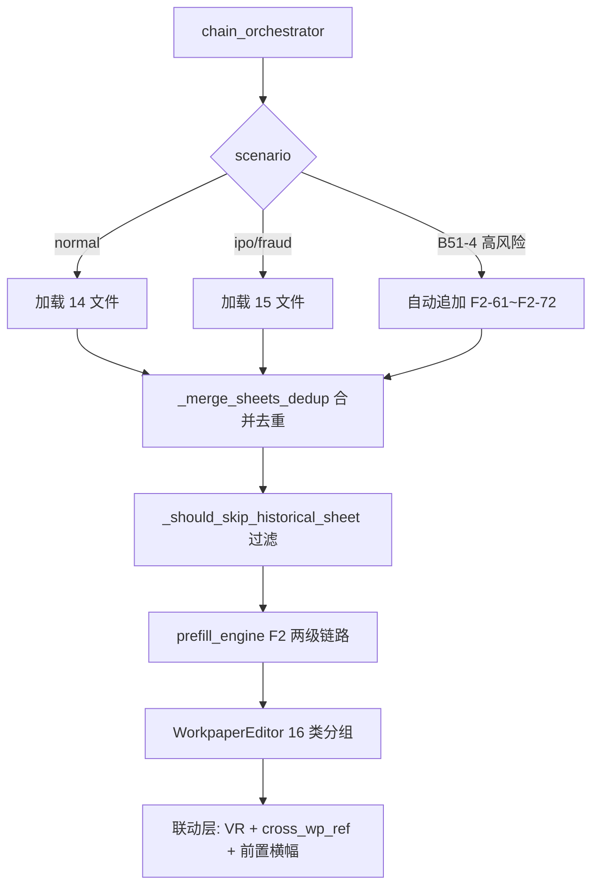

# F 采购存货循环底稿优化 — Design

> **Spec**: workpaper-f-purchase-inventory
> **版本**: v1.0（基于 requirements.md v1.0 起草）
> **状态**: ADR 待 Sprint 1 实施前 review
> **参照**: workpaper-d-sales-cycle design.md（~60% 架构复用）

## 变更记录

| 版本 | 日期 | 摘要 | 触发原因 |
|------|------|------|---------|
| v1.0 | 2026-05-19 | 三件套设计初版 | requirements.md v1.0 完成 |

---

## 一、架构总览（Overview）

### 1.1 F 循环数据流



**核心数据流**:
1. chain_orchestrator 按 scenario 加载 F 循环 14/15 文件
2. `_merge_sheets_dedup` 合并去重（复用 D spec，90→≤67 sheet）
3. `_should_skip_historical_sheet` 过滤历史遗留（扩展 4 种新模式）
4. prefill_engine 两级链路：TB/AUX → F2-2 → F2-1（487 公式自动）
5. WorkpaperEditor 16 类 sheet 分组导航
6. 联动层：VR 勾稽 + cross_wp_ref stale 传播 + 前置横幅

### 1.2 复用 D spec / E1 spec 已建组件清单

| 组件 | 来源 | F 循环复用方式 | 改动量 |
|------|------|--------------|-------|
| `_normalize_sheet_name` | D spec | 直接复用 | 0 |
| `_merge_sheets_dedup` | D spec | 直接复用 | 0 |
| `_should_skip_historical_sheet` | D spec | **扩展** 4 种新模式 | regex 扩展 |
| `SCENARIO_TO_FILE_FILTER` | D spec | 直接复用 | 0 |
| `useUniverSheetNav.ts` | E1 spec | 不改动 | 0 |
| `WorkpaperAuditNav.vue` | E1 spec | 数据源切换为 F2A | 0 |
| `ConsistencyGatePanel.vue` | E1 spec | 加 VR-F5/F2 规则 | 配置 |
| `usePrerequisiteStatus.ts` | D spec | 加 F 循环前置清单 | 配置 |
| `useEditingLock.ts` | E1 spec | 不改动 | 0 |
| `CustomerInterviewDialog` 模式 | D spec | 参照新建 | 新文件 |
| `_ensure_d4_ipo_loaded` | D spec | 重构为通用版 | 重构 |

**新建文件仅 2 个**: `useFPurchaseInventorySheetGroups.ts` + `InventoryStocktakeDialog.vue`


---

## 二、架构决策记录（ADR）

### ADR-F1: 复用 D spec 基础设施 vs 新建

**决策**: 最大化复用 D spec 已实施的基础设施，仅在 F 循环有独特需求时新建

**理由**:
- D spec 已实施并通过 UAT 20/21 的核心能力全部适用于 F 循环
- F 循环与 D 循环结构高度对称（F0↔D0 / F4↔D2 / F5↔D4）
- 复用率 ~60%，新代码集中在 F2 特有逻辑

**风险**: D spec 代码变更可能影响 F spec → 缓解：PBT P2 回归测试

### ADR-F2: F2 两级 prefill 链路设计

**决策**: prefill 目标是 F2-2 明细汇总表（中间 sheet），而非 F2-1 审定表本身

**理由**:
- F2-1 已有 487 个 Univer 内置 cross_sheet 公式（=明细汇总表F2-2!...）
- F2-2 是空表（需要 =AUX 按子科目/仓库/产品取数），是真正的 prefill 缺口
- 链路：TB/AUX → F2-2（prefill）→ F2-1（公式自动计算）

**与 D spec 差异**: D spec 直接 TB → D2-1；F spec 多一层间接引用

### ADR-F3: `_should_skip_historical_sheet` 扩展策略

**决策**: 追加 4 种 F 循环新模式，确保不影响 D/E 循环已有行为

**扩展规则**:
```python
def _should_skip_historical_sheet(name: str) -> bool:
    if name is None:
        return False
    s = str(name)
    return (
        ("修订前" in s) or ("（原）" in s) or ("(原)" in s)
        or (s.startswith("G") and "删除" in s)
        or (s.startswith("G") and "移至" in s)
        or ("（示例）" in s) or ("(示例)" in s)
        or s.endswith("示例）") or s.endswith("示例)")
    )
```

**全局影响**: D/E 循环无 G 开头 sheet → 不受影响。PBT P2 覆盖回归。

### ADR-F4: `_ensure_ipo_loaded` 通用化重构

**决策**: 重构为 `_ensure_ipo_loaded(wp_code_prefix: str)` 支持多底稿

```python
async def _ensure_ipo_loaded(self, project_id, wp_code_prefix: str, ...):
    ipo_patterns = SCENARIO_TO_FILE_FILTER["normal"]["exclude_patterns"]
    files = [f for f in template_files
             if f.startswith(wp_code_prefix) and any(p in f for p in ipo_patterns)]
    ...
```

**触发**: D4 用 B51-5 / F2 用 B51-4。回归保障：D spec 逻辑不变。

### ADR-F5: 16 类 sheet 分组规则 vs 复用 D 循环 14 类

**决策**: 新建 `useFPurchaseInventorySheetGroups.ts`，16 类规则

**与 D 循环差异**: F2 独有 stocktake（监盘）/ costing（计价）/ contract_cost（合同履约）/ policy（会计政策）4 类；D 循环 bad_debt → F 循环 impairment；D 循环 interview → F 循环 supplier_interview

**16 类**: 索引 / 历史遗留 / 总控台 / 审定表 / 明细表 / 跌价准备 / 分析 / 存货监盘 / 截止测试 / 检查表 / 计价测试 / 关联方 / 合同履约 / 供应商访谈 / 附注披露 / 调整分录


---

## 三、组件与接口（Components and Interfaces）

### 3.1 后端组件

#### 3.1.1 chain_orchestrator 扩展

| 修改点 | 对应需求 | 说明 |
|--------|---------|------|
| F2 注册到 `_merge_sheets_dedup` | F-F1 | 将 F2 11 文件加入合并去重 |
| `_should_skip_historical_sheet` 扩展 | F-F2 | 追加 4 种新模式 |
| `_ensure_ipo_loaded` 通用化 | F-F14 | 重构为参数化函数 |

#### 3.1.2 prefill_engine 扩展（≥ 60 cell 新增）

| 新增区域 | cell 数 | 公式类型 |
|---------|--------|---------|
| F2-2 明细汇总表 | 20 | =AUX 按子科目/仓库/产品 |
| F2-21~F2-26 盘点类 | 10 | =LEDGER + 盘点差异 |
| F2-38~F2-44 计价测试 | 15 | =LEDGER_DETAIL 抽样 |
| F2-47~F2-49 跌价准备 | 10 | =AUX 按产品 |
| F3/F4 明细表 | 10 | =AUX 按供应商 |

#### 3.1.3 validation_rules 新增 4 条

VR-F5-01（blocking）/ VR-F5-02（warning）/ VR-F2-01（warning）/ VR-F2-02（warning）

#### 3.1.4 cross_wp_references 新增 ≥ 35 条

ref_id 基于运行时 `max(ref_id) + 1` 起编（禁止硬编码）

#### 3.1.5 AI API 新增

| 端点 | 用途 | 需求 |
|------|------|------|
| `POST /api/projects/{pid}/workpapers/{wid}/ai/stocktake-summary` | 监盘差异摘要 | F-F5 |
| `POST /api/projects/{pid}/workpapers/F2/impairment-analysis` | 跌价分析 | F-F12 |

### 3.2 前端组件

#### 3.2.1 新建

| 组件 | 路径 | 需求 |
|------|------|------|
| `useFPurchaseInventorySheetGroups.ts` | `composables/` | F-F4 |
| `InventoryStocktakeDialog.vue` | `components/workpaper/` | F-F5 |

#### 3.2.2 扩展

| 组件 | 修改 | 需求 |
|------|------|------|
| `usePrerequisiteStatus.ts` | 加 F 循环前置清单 | F-F9 |
| `WorkpaperAuditNav.vue` | 支持 F2A 32 项程序 | F-F13 |
| `ConsistencyGatePanel.vue` | 加 VR-F5/F2 规则 | F-F6 |

### 3.3 接口契约

#### InventoryStocktakeDialog

```typescript
// Props
interface Props {
  visible: boolean
  projectId: string
  wpId: string
  wpCode: string
  stocktakeId?: string
}

// Form Data
interface StocktakeFormData {
  location: string
  date: string
  method: 'full' | 'sampling' | 'cycle'
  counter: string
  reviewer: string
  attachments: AttachmentRef[]
  differences: StocktakeDiffItem[]
  conclusion: string
  counterSignedAt?: string
  reviewerSignedAt?: string
}

interface StocktakeDiffItem {
  itemName: string
  bookQty: number
  actualQty: number
  diff: number
  reason: string
}
```

#### useFPurchaseInventorySheetGroups

```typescript
interface FSheetPattern {
  pattern: RegExp
  category: string
  priority: number
  defaultHidden?: boolean
  readonly?: boolean
}

export function useFPurchaseInventorySheetGroups(sheets: Ref<SheetInfo[]>): {
  groupedSheets: ComputedRef<Record<string, SheetInfo[]>>
  visibleSheets: ComputedRef<SheetInfo[]>
  categoryOrder: string[]
}
```


---

## 四、数据模型（Data Models）

### 4.1 数据库 schema（不改 ORM）

本 spec 不新增 ORM 字段，全部改动在 JSON 配置层：
- `prefill_formula_mapping.json`（+≥ 60 cell）
- `cross_wp_references.json`（+≥ 35 条）
- `validation_rules.json`（+4 条）

### 4.2 validation_rules 新增定义

```json
[
  {
    "rule_id": "VR-F5-01",
    "description": "营业成本 = 期初存货 + 本期采购 - 期末存货",
    "wp_code": "F5",
    "severity": "blocking",
    "tolerance": 1.0,
    "formula": "ABS(cost - (opening + purchases - closing)) < tolerance",
    "sources": {
      "cost": {"wp": "F5", "sheet": "审定表F5-1", "cell": "主营业务成本_审定数"},
      "opening": {"wp": "F2", "sheet": "存货审定表F2-1", "cell": "存货合计_期初余额"},
      "purchases": {"wp": "F2", "sheet": "存货审定表F2-1", "cell": "存货合计_本期增加"},
      "closing": {"wp": "F2", "sheet": "存货审定表F2-1", "cell": "存货合计_期末余额"}
    }
  },
  {
    "rule_id": "VR-F5-02",
    "description": "毛利率波动 < 5%（与 VR-D4-03 交叉验证）",
    "wp_code": "F5",
    "severity": "warning",
    "tolerance": 0.05,
    "sources": {
      "revenue": {"wp": "D4", "sheet": "营业收入审定表D4-1", "cell": "审定数"},
      "cost": {"wp": "F5", "sheet": "审定表F5-1", "cell": "审定数"},
      "prior_margin": {"wp": "F5", "sheet": "审定表F5-1", "cell": "上年毛利率"}
    },
    "cross_validation": "VR-D4-03"
  },
  {
    "rule_id": "VR-F2-01",
    "description": "存货跌价准备计提率 vs 上年变动 < 3%",
    "wp_code": "F2",
    "severity": "warning",
    "tolerance": 0.03
  },
  {
    "rule_id": "VR-F2-02",
    "description": "存货周转天数 vs 行业均值差异 < 30 天",
    "wp_code": "F2",
    "severity": "warning",
    "tolerance": 30
  }
]
```

### 4.3 cross_wp_references 新增分组

| 分组 | 条数 | category | 说明 |
|------|------|----------|------|
| F0 内部联动 | 5 | revenue_cycle | F0-1→F0-3/F0-4/F0-5/F2-1 |
| F2 内部联动 | 4 | inventory_cycle | F2-2→F2-1/F2-47/F2-14 |
| F 循环跨底稿 | 8 | inventory_cycle | F2/F4/F5 三角 |
| F → A 跨循环 | 8 | review_traceback | F2/F5→A1-1/A1-15/A1-16/A5-1 |
| F → T1 IPE | 4 | ipe_reference | F2-24/F2-33/F2-34→T1 |
| F → 附注/报表 | 6 | disclosure_reference | F2-1/F3-1/F4-1/F5-1→disclosure |

**条目格式示例**:
```json
{
  "ref_id": "CW-{max_id+1}",
  "source_wp": "F0",
  "source_sheet": "函证结果汇总表F0-1",
  "source_cell": "已回函金额合计",
  "targets": [{"wp_code": "F2", "sheet": "存货审定表F2-1", "cell": "已函证金额"}],
  "category": "data_flow_reverse",
  "severity": "warning",
  "trigger": "eventBus confirmation:received"
}
```

### 4.4 wp.parsed_data JSONB（监盘弹窗）

```json
{
  "stocktake_records": {
    "F2-21": {
      "location": "string",
      "date": "ISO date",
      "method": "full|sampling|cycle",
      "counter": "string",
      "reviewer": "string",
      "attachments": [{"uuid": "string", "type": "image|video"}],
      "differences": [{"item": "string", "book_qty": 0, "actual_qty": 0, "diff": 0, "reason": "string"}],
      "conclusion": "string",
      "counter_signed_at": "ISO datetime | null",
      "reviewer_signed_at": "ISO datetime | null",
      "ai_summary": "string | null"
    }
  }
}
```

### 4.5 useFPurchaseInventorySheetGroups 16 类规则定义

```typescript
export const F_SHEET_PATTERNS: FSheetPattern[] = [
  { pattern: /^底稿目录|GT[_\s]?Custom|修订说明/i, category: '索引', priority: 1, defaultHidden: true },
  { pattern: /G[12]-.*删除|G[12]-.*移至|示例/i, category: '历史遗留', priority: 99, defaultHidden: true },
  { pattern: /F[0-5]A\b|F2-21A|F2-55A|F2-61A|程序表/, category: '总控台', priority: 1 },
  { pattern: /审定表/, category: '审定表', priority: 2 },
  { pattern: /明细[表汇]|原材料|在产品|库存商品|委托加工|发出商品/, category: '明细表', priority: 3 },
  { pattern: /跌价|减值|可变现净值|长库龄|呆滞/, category: '跌价准备', priority: 4 },
  { pattern: /分析|周转|产销量|成本比较/, category: '分析', priority: 5 },
  { pattern: /监盘|盘点|抽盘|倒轧/, category: '存货监盘', priority: 6 },
  { pattern: /截止/, category: '截止测试', priority: 7 },
  { pattern: /检查表|核查表|领用检查/, category: '检查表', priority: 8 },
  { pattern: /计价|成本.*测试|加权平均|先进先出|标准成本|生产成本|制造费用/, category: '计价测试', priority: 9 },
  { pattern: /关联[方采]|定价公允/, category: '关联方', priority: 10 },
  { pattern: /合同履约|亏损合同/, category: '合同履约', priority: 11 },
  { pattern: /供应商.*访谈|访谈记录/, category: '供应商访谈', priority: 12 },
  { pattern: /附注披露|披露信息/, category: '附注披露', priority: 13, readonly: true },
  { pattern: /调整分录/, category: '调整分录', priority: 14 },
]
```


---

## 五、Correctness Properties

*A property is a characteristic or behavior that should hold true across all valid executions of a system — essentially, a formal statement about what the system should do. Properties serve as the bridge between human-readable specifications and machine-verifiable correctness guarantees.*

### Property 1: Sheet 名归一化幂等性

*For any* sheet name string `s`, applying `_normalize_sheet_name` twice should produce the same result as applying it once: `normalize(normalize(s)) == normalize(s)`

**Validates: Requirements 1.1, 1.3**

### Property 2: 历史遗留 sheet 过滤正确性

*For any* sheet name string `s`:
- If `s` starts with "G" and contains "删除" or "移至", OR contains "示例"/"（示例）", OR contains "修订前"/"（原）", then `_should_skip_historical_sheet(s)` returns True
- If `s` is a normal business sheet name (matches F-cycle business patterns like "审定表F2-1", "明细表F2-2", "监盘记录F2-22" etc.), then `_should_skip_historical_sheet(s)` returns False

This property ensures both correct filtering AND regression safety for D/E cycles.

**Validates: Requirements 2.1, 2.2, 2.3**

### Property 3: cross_wp_references ref_id 全局唯一性

*For any* set of cross_wp_references entries (existing + newly added), all `ref_id` values must be globally unique — no two entries share the same ref_id.

**Validates: Requirements 7.2, 7.4**

### Property 4: VR-F5-01 三角勾稽公式正确性

*For any* valid numeric inputs (cost_of_sales, inventory_opening, purchases, inventory_closing) where `ABS(cost_of_sales - (inventory_opening + purchases - inventory_closing)) < 1.0`, the VR-F5-01 rule should pass. For inputs where the absolute difference ≥ 1.0, the rule should fail and block sign-off.

**Validates: Requirements 6.1, 6.2**

### Property 5: F 循环 sheet 分组规则完备性

*For any* valid F-cycle sheet name (from F0/F1/F2/F3/F4/F5 workpapers), applying the 16-category grouping rules should match exactly 1 category — no sheet is unmatched (completeness) and no sheet matches multiple categories (mutual exclusivity).

**Validates: Requirements 4.1, 4.6**

### Property 6: Scenario 文件级裁剪一致性

*For any* scenario value and file list, the SCENARIO_TO_FILE_FILTER produces a stable (idempotent) result: filtering the same file list with the same scenario always yields the same subset. Additionally, for scenario="normal", no file whose name contains any exclude_pattern keyword should appear in the result.

**Validates: Requirements 3.1**

### Property 7: `_ensure_ipo_loaded` 通用性

*For any* valid `wp_code_prefix` string, calling `_ensure_ipo_loaded(prefix)` should load exactly those template files that: (a) start with the given prefix, AND (b) contain at least one IPO-related keyword from SCENARIO_TO_FILE_FILTER["normal"]["exclude_patterns"]. No files outside this intersection should be loaded.

**Validates: Requirements 14.2**


---

## 六、Error Handling

### 6.1 合并去重错误处理

| 场景 | 处理方式 | 日志级别 |
|------|---------|---------|
| 同名 sheet 内容不同 | 保留首次出现，记录 warning | WARNING |
| sheet 名为 None/空 | 跳过，不参与去重 | DEBUG |
| 文件加载失败（IO 错误） | 跳过该文件，记录 error，继续处理其余文件 | ERROR |
| 归一化后 sheet 数 > 预期 | 记录 info 日志，不阻断 | INFO |

### 6.2 prefill 错误处理

| 场景 | 处理方式 |
|------|---------|
| TB/AUX 数据源缺失 | cell 保持空值，记录 warning |
| =LEDGER_DETAIL 查询超时 | 重试 1 次，失败后 cell 标记为 `#TIMEOUT` |
| F2-2 中间 sheet 未加载 | F2-1 cross_sheet 公式显示 `#REF!`，前端提示"请先完成明细表填充" |
| prefill 公式语法错误 | 跳过该 cell，记录 error |

### 6.3 VR 规则错误处理

| 场景 | 处理方式 |
|------|---------|
| 数据源 cell 为空/非数字 | 规则标记为 `skipped`，不阻断不告警 |
| 跨底稿数据源不可达 | 规则标记为 `pending`，提示"等待关联底稿数据" |
| tolerance 配置缺失 | 使用默认值（blocking=1.0, warning=0.05） |

### 6.4 监盘弹窗错误处理

| 场景 | 处理方式 |
|------|---------|
| 附件上传失败 | 本地缓存 + 重试队列，提示用户 |
| LLM 摘要生成失败 | 显示"AI 分析暂不可用"，允许手工填写 |
| 双签缺失提交 | 前端校验阻断，提示"需要盘点人和复核人均签字" |
| 离线草稿冲突 | 以服务端版本为准，本地草稿标记为"待合并" |

### 6.5 cross_wp_references 错误处理

| 场景 | 处理方式 |
|------|---------|
| ref_id 冲突 | 加载时校验唯一性，冲突条目记录 error 并跳过 |
| stale 传播环路 | LinkageGraphBuilder 检测环路，截断并记录 warning |
| 目标底稿未加载 | stale 标记暂存，目标底稿加载时补发 |

---

## 七、Testing Strategy

### 7.1 测试框架选型

| 层级 | 框架 | 说明 |
|------|------|------|
| 单元测试 | pytest + pytest-asyncio | 后端 Python |
| 属性测试 | hypothesis | PBT 库，min 100 examples |
| 前端单测 | vitest | composable 逻辑测试 |
| 集成测试 | pytest + httpx | API 端到端 |
| E2E | Playwright | 弹窗交互验证 |

### 7.2 Property-Based Testing 配置

**库**: hypothesis（Python）
**最小迭代**: 100 examples per property（P5 分组规则用 200）
**标签格式**: `# Feature: workpaper-f-purchase-inventory, Property N: {title}`

| Property | 测试文件 | max_examples | 策略 |
|---------|---------|-------------|------|
| P1 归一化幂等 | `test_f_pbt.py` | 100 | st.text() 生成随机 sheet 名 |
| P2 历史过滤 | `test_f_pbt.py` | 100 | 自定义策略：历史遗留名 + 正常业务名 |
| P3 ref_id 唯一 | `test_f_pbt.py` | 50 | st.lists(st.text()) 生成 ref_id 集合 |
| P4 VR-F5-01 公式 | `test_f_pbt.py` | 100 | st.floats() 生成数值四元组 |
| P5 分组完备性 | `test_f_pbt.py` | 200 | 自定义策略：F 循环真实 sheet 名池 |
| P6 scenario 裁剪 | `test_f_pbt.py` | 50 | st.sampled_from(scenarios) × st.lists(filenames) |
| P7 IPO 加载通用 | `test_f_pbt.py` | 50 | st.sampled_from(prefixes) × st.lists(filenames) |

### 7.3 单元测试矩阵

| 测试文件 | 覆盖需求 | 类型 |
|---------|---------|------|
| `test_f2_merge_dedup.py` | F-F1 合并去重 | 单测 |
| `test_f_historical_sheet_filter.py` | F-F2 历史过滤 + 回归 | 单测 |
| `test_f_scenario_filter.py` | F-F3 scenario 验证 | 单测 |
| `test_f_sheet_groups.py` | F-F4 16 类分组 | 单测 |
| `test_f5_validation_rules.py` | F-F6 VR 4 条 | 单测 |
| `test_f_cross_wp_refs.py` | F-F7 ≥ 35 条 + stale | 单测 |
| `test_f0_confirmation_callback.py` | F-F8 反向回填 | 单测 |
| `test_f_prefill_extension.py` | F-F10 ≥ 60 cell | 单测 |
| `test_f_pbt.py` | P1~P7 属性测试 | PBT |

### 7.4 集成测试

| 测试文件 | 覆盖 |
|---------|------|
| `test_f_cycle_full_chain.py` | F 循环 6 主底稿 chain 生成 |
| `test_f0_f2_confirmation_callback.py` | F0 回函 → F2 stale 端到端 |
| `test_f5_d4_f2_triangle.py` | 三角勾稽 VR-F5-01 blocking |
| `test_f2_stocktake_dialog.py` | 监盘弹窗 + 附件 + LLM |

### 7.5 测试 fixture 模板

复用 D spec 已建立的 fixture 模式：
```python
@pytest_asyncio.fixture
async def db_session():
    _engine = create_async_engine("sqlite+aiosqlite:///:memory:")
    async with _engine.begin() as conn:
        await conn.run_sync(Base.metadata.create_all)
    async_session = sessionmaker(_engine, class_=AsyncSession)
    async with async_session() as session:
        yield session
    await _engine.dispose()
```

### 7.6 PBT 实现示例

```python
from hypothesis import given, settings
from hypothesis import strategies as st

# Feature: workpaper-f-purchase-inventory, Property 1: Sheet 名归一化幂等性
@given(name=st.text(min_size=0, max_size=100))
@settings(max_examples=100)
def test_normalize_idempotent(name):
    result = _normalize_sheet_name(name)
    assert _normalize_sheet_name(result) == result

# Feature: workpaper-f-purchase-inventory, Property 4: VR-F5-01 三角勾稽公式正确性
@given(
    cost=st.floats(min_value=0, max_value=1e12, allow_nan=False),
    opening=st.floats(min_value=0, max_value=1e12, allow_nan=False),
    purchases=st.floats(min_value=0, max_value=1e12, allow_nan=False),
    closing=st.floats(min_value=0, max_value=1e12, allow_nan=False),
)
@settings(max_examples=100)
def test_vr_f5_01_formula(cost, opening, purchases, closing):
    diff = abs(cost - (opening + purchases - closing))
    rule_passes = diff < 1.0
    result = evaluate_vr_f5_01(cost, opening, purchases, closing)
    assert result.passes == rule_passes
    if not rule_passes:
        assert result.severity == "blocking"

# Feature: workpaper-f-purchase-inventory, Property 5: F 循环 sheet 分组完备性
@given(sheet_name=st.sampled_from(ALL_F_CYCLE_SHEET_NAMES))
@settings(max_examples=200)
def test_sheet_group_completeness(sheet_name):
    matches = [p for p in F_SHEET_PATTERNS if p.pattern.search(sheet_name)]
    assert len(matches) == 1, f"{sheet_name} matched {len(matches)} categories"
```


---

## 八、风险与缓解

| 风险 | 影响 | 概率 | 缓解 |
|------|------|------|------|
| `_should_skip_historical_sheet` 扩展误过滤正常 sheet | 高 | 低 | PBT P2 覆盖 + Sprint 0 实测全部 151 sheet 名 |
| F2 两级 prefill 链路 F2-2 未填充导致 F2-1 全部 #REF! | 高 | 中 | prefill 执行顺序保证 F2-2 先于 F2-1 加载 |
| cross_wp_ref 35 条手工编写 ref_id 冲突 | 中 | 中 | PBT P3 唯一性 + 运行时 max_id 起编 |
| VR-F5-01 blocking 规则误阻断（数据源 cell 定位错误） | 高 | 中 | Sprint 0 表样核验确认 cell 坐标 |
| 16 类分组规则对未来新增 sheet 不匹配 | 低 | 中 | 兜底规则（未匹配 → "其他"类） |
| `_ensure_ipo_loaded` 重构影响 D spec B51-5 触发 | 高 | 低 | 重构后 D spec 回归测试必须通过 |
| F2 90 sheet 合并去重后仍有 67 sheet 导航复杂 | 中 | 高 | 16 类分组 + 搜索 + 折叠隐藏 |
| 监盘弹窗离线草稿与服务端冲突 | 中 | 中 | 以服务端为准 + 冲突提示 |

---

## 九、实施前置条件

1. ✅ D spec UAT 20/21 pass（已达成）
2. ✅ E1 spec 91/91 completed
3. ⏳ Sprint 0 实测脚本确认 N_f2_dedup_sheets / N_cwr_max_id / N_f_historical_sheets
4. ⏳ D spec git commit 锁定（F spec 依赖 D spec 代码）
5. ⏳ 本 design.md review 通过

---

## 十、与 README 章节交叉引用

| design ADR | README 锚点 | 说明 |
|-----------|------------|------|
| ADR-F1 复用策略 | §七 复用清单 | 60% 复用率 |
| ADR-F2 两级 prefill | §十 公式拓扑 | F2-2→F2-1 链路 |
| ADR-F3 历史过滤扩展 | §十一 去重/过滤统计 | 4 种新模式 |
| ADR-F4 IPO 通用化 | §一.7 scenario 裁剪 | B51-4 触发 |
| ADR-F5 16 类分组 | §二.7 分组规则 | 完整规则表 |
| F-F5 监盘弹窗 | §一.5 监盘需求 | D 类弹窗 |
| F-F6 三角勾稽 | §一.6 三角勾稽 | VR-F5-01/02 |
| F-F7 cross_wp_ref | §1.4 引用不足 | ≥ 35 条新增 |
| F-F10 prefill | §1.3 prefill 缺口 | ≥ 60 cell |

---

## 十一、ADR 与 README §七 复用清单双向映射

| design ADR | 对应需求 | 复用/新建 | 映射 |
|-----------|---------|----------|------|
| ADR-F1 | 全局策略 | 复用 D spec 基础设施 | README §七 |
| ADR-F2 | F-F10 | 新设计（F2 两级链路） | README §十 |
| ADR-F3 | F-F2 | 扩展现有函数 | README §十一 |
| ADR-F4 | F-F14 | 重构现有函数 | README §一.7 |
| ADR-F5 | F-F4 | 新建 composable | README §二.7 |

**铁律**: 实施时如发现 design ADR 与 README 冲突，以 README 为准（架构层优先）。

---

> **本 design.md 配套**: requirements.md（需求）+ tasks.md（实施计划）
> **代码骨架**: 见 README §十二（核心修复项代码）
> **架构决策**: ADR-F1~F5（5 个决策）
> **Correctness Properties**: P1~P7（7 个属性测试）
> **下一步**: 起草 tasks.md 完整 Sprint 拆解
