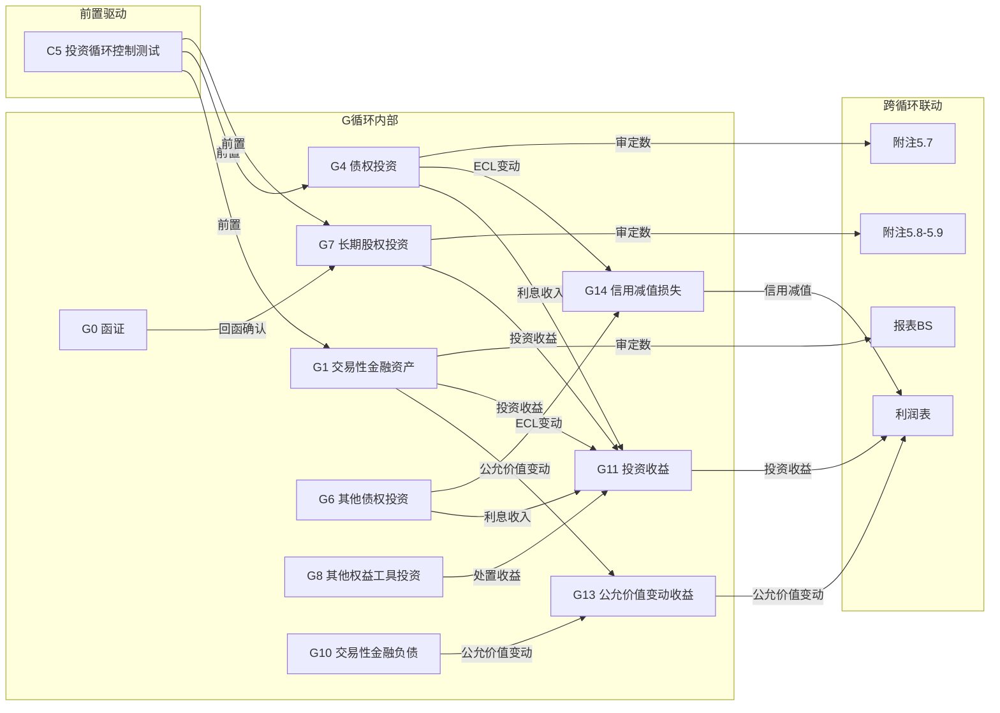

# G 投资循环底稿优化 — Design

> **Spec**: `workpaper-g-investment-cycle`
> **版本**: v1.0
> **配套**: requirements.md v1.0
> **创建日期**: 2026-05-19

## 变更记录

| 版本 | 日期 | 摘要 |
|------|------|------|
| v1.0 | 2026-05-19 | 初版 — 6 个 ADR + 6 Correctness Properties + 错误处理 |

---

## ADR 索引

| ADR | 标题 | 对应需求 | 决策摘要 |
|-----|------|---------|---------|
| ADR-G1 | 多文件合并去重 + 4 历史遗留已过滤 | G-F1 | 复用 `_merge_sheets_dedup` 0 改动；4 个"修订前" sheet 已被现行 regex 覆盖 |
| ADR-G2 | G7 三种核算方式切换 | G-F3 | per-investment 配置存入 parsed_data；3 档枚举控制 sheet 显隐 |
| ADR-G3 | 公允价值层级测试（Level 1/2/3）| G-F4 | 复用 AssetImpairmentDialog 模式 + 3 层级参数化 |
| ADR-G4 | ECL 三阶段模型 | G-F5 | 新增 endpoint + 单调性约束 + apply_to_sheet 写回 |
| ADR-G5 | G0 函证反向回填 | G-F8 | 复用 confirmation_service wp_code='G0' + cross_wp_references |
| ADR-G6 | G 循环 12 类 sheet 分组正则 | G-F2 | 按优先级匹配，首个命中即停止 |

---

## 数据流图（G 循环跨底稿 + 跨循环联动）



**关键路径说明**：
- **G0→G7 函证回填**（ADR-G5）：G0 回函确认 → WORKPAPER_SAVED(wp_code='G0') → stale_engine → G7 对应 cell stale
- **G11 投资收益汇总**（G-F6 VR-G11-01）：G1+G4+G6+G7+G8 各子循环投资收益 → G11 汇总
- **G14 信用减值汇总**（G-F6 VR-G14-01）：G4 ECL 变动 + G6 ECL 变动 → G14 汇总
- **G1 公允价值变动**（G-F6 VR-G1-01）：期末公允价值 − 期初公允价值 = 本期变动

---

## ADR-G1: 多文件合并去重 + 4 历史遗留已过滤

### 背景
G 循环 15 文件 197 sheet，合并后 152 sheet（41 跨文件合法去重 + 4 历史遗留过滤）。G 循环无同 wp_code 多 sheet 问题。

### 决策
1. **后端合并**：直接复用 `_merge_sheets_dedup`（D/F/H spec 已实现），0 代码改动。
2. **历史遗留过滤**：G11/G12/G13/G14 各含 1 个"修订前" sheet，已被 `_should_skip_historical_sheet` 现行"修订前"模式命中，不需扩展。
3. **无路由保护需求**：G 循环每个 sheet 的 wp_code 唯一，不存在 H 循环"同 wp_code 多 sheet"问题，不需要 `resolveMainVersionSheet` 或分支选择器。

### 影响
- 0 代码改动
- 不影响 D/E/F/H/I 循环
- 仅需写验证测试确认 chain 对 G 循环的注册

---

## ADR-G2: G7 三种核算方式切换

### 背景
G7 长期股权投资支持三种核算方式（权益法/成本法/公允价值法）。与 H-F2 measurement_model 不同，G7 是 per-investment 配置（同一项目可能有多笔投资采用不同核算方式）。

### 决策
1. **存储层**：存入 `working_paper.parsed_data.g7_accounting_methods`（数组）：
   ```python
   # working_paper.parsed_data.g7_accounting_methods 结构
   [
     {"investee_name": "联营公司A", "method": "equity_method"},
     {"investee_name": "子公司B", "method": "cost_method"},
     {"investee_name": "少数股权C", "method": "fair_value_method"},
   ]
   ```
2. **前端 sheet 显隐逻辑**：`useGInvestmentCycleSheetGroups.ts` 读取 `g7_accounting_methods`，按当前选中投资的 method 控制 G7 sheet 显隐：
   - `equity_method`：显示权益法相关 sheet（投资收益确认/权益变动/减值测试/对账）
   - `cost_method`：显示成本法相关 sheet（分红确认/减值测试）
   - `fair_value_method`：显示公允价值法相关 sheet（公允价值测试/变动损益）
3. **默认行为**：未配置时显示全部 G7 sheet（不过滤），避免首次打开时 sheet 缺失。
4. **切换时机**：用户在 G7 底稿内选择"当前投资"→ 前端 eventBus emit `g7-method:changed` → sheet 列表重新计算。

### 影响
- 不需要 DB schema 变更（存入 parsed_data，不加 project 表列）
- 不影响 H-F2 MEASUREMENT_MODEL_FILTER（两者独立）
- 仅 G7 底稿内生效

---

## ADR-G3: 公允价值层级测试（Level 1/2/3）

### 背景
G1/G6/G8/G10/G12/G13 共 6 个子循环涉及公允价值测试。Level 1（市场报价）/ Level 2（可观察输入）/ Level 3（DCF 不可观察输入）需分层处理。

### 决策
1. **复用 AssetImpairmentDialog 模式**：参数化为公允价值版本
2. **Endpoint**：`POST /api/projects/{pid}/workpapers/{wid}/g/fair-value-test`
3. **输入 schema**：
   ```python
   class FairValueTestRequest(BaseModel):
       level: Literal[1, 2, 3]
       instrument_type: str              # 金融工具类型
       face_value: Decimal               # 面值/数量
       # Level 1
       market_price: Decimal | None = None        # 市场报价
       price_date: str | None = None              # 报价日期
       # Level 2
       interest_rate_curve: list[Decimal] | None = None  # 利率曲线
       credit_spread: Decimal | None = None       # 信用利差
       volatility: Decimal | None = None          # 波动率
       # Level 3 (DCF)
       cash_flow_projections: list[Decimal] | None = None  # 现金流预测
       discount_rate: Decimal | None = None       # 折现率
       terminal_value: Decimal | None = None      # 终值
       # 写回
       apply_to_sheet: str | None = None
   ```
4. **输出 schema**：
   ```python
   class FairValueTestResponse(BaseModel):
       level: int
       fair_value: Decimal               # 计算得出的公允价值
       valuation_method: str             # 估值方法描述
       conclusion: str                   # "公允价值合理" / "存在重大偏差"
       applied_to_sheet: str | None = None
   ```
5. **Level 3 DCF 公式**：
   ```python
   def dcf_fair_value(cash_flows, discount_rate, terminal_value):
       pv = sum(cf / (1 + discount_rate) ** (i + 1) for i, cf in enumerate(cash_flows))
       pv_terminal = terminal_value / (1 + discount_rate) ** len(cash_flows)
       return pv + pv_terminal
   ```
6. **当前为 stub**：Level 1/2 公式正确，Level 3 DCF 公式正确但 LLM 辅助参数建议待接入

### 影响
- 新增 1 个路由文件 `backend/app/routers/wp_g_fair_value.py`
- 复用 `AssetImpairmentDialog.vue`（props 参数化区分 H1-14 减值 vs G 公允价值）
- 不影响 H-F12 已有实现

---

## ADR-G4: ECL 三阶段模型

### 背景
G4 债权投资 / G6 其他债权投资需 ECL（预期信用损失）三阶段计算。与 F2 跌价 NRV 模型不同（F2 是成本与 NRV 孰低，G4/G6 是前瞻性 ECL）。

### 决策
1. **Endpoint**：`POST /api/projects/{pid}/workpapers/{wid}/g/ecl-calc`
2. **输入 schema**：
   ```python
   class ECLCalcRequest(BaseModel):
       stage: Literal[1, 2, 3]
       book_value: Decimal               # 账面余额（EAD）
       pd_12m: Decimal                   # 12 个月违约概率
       pd_lifetime: Decimal              # 整个存续期违约概率
       lgd: Decimal                      # 违约损失率
       # 写回
       apply_to_sheet: str | None = None
   ```
3. **输出 schema**：
   ```python
   class ECLCalcResponse(BaseModel):
       stage: int
       ecl_amount: Decimal               # 预期信用损失金额
       formula_used: str                  # 使用的公式描述
       monotonicity_check: bool          # 单调性校验结果
       applied_to_sheet: str | None = None
   ```
4. **三阶段公式**：
   ```python
   def calc_ecl(stage, book_value, pd_12m, pd_lifetime, lgd):
       if stage == 1:
           return book_value * pd_12m * lgd          # 12 个月 ECL
       elif stage == 2:
           return book_value * pd_lifetime * lgd     # 整个存续期（未信用减值）
       elif stage == 3:
           return book_value * pd_lifetime * lgd     # 整个存续期（已信用减值，PD 接近 100%）
   ```
5. **单调性约束**：`ECL(stage=1) ≤ ECL(stage=2) ≤ ECL(stage=3)`（因 pd_12m ≤ pd_lifetime）
6. **Stage 3 业务约束**：Stage 3 的 pd_lifetime 应 ≥ Stage 2 的 pd_lifetime（通常 ≥ 0.9，已信用减值意味着违约概率极高）；如果用户输入 Stage 3 的 pd < Stage 2 的 pd，返回 HTTP 400 + "Stage 3 违约概率不应低于 Stage 2"
7. **RBAC + 写回**：`Depends(require_project_access("edit"))` + `apply_to_sheet` 写入 `working_paper.parsed_data.ecl_calcs[sheet]`

### 影响
- 新增 1 个路由文件 `backend/app/routers/wp_g_ecl.py`
- 不影响 F-F12 跌价 ECL stub（两者独立）
- PBT-P6 验证单调性

### 实测结果（Sprint 0.X 已落地，2026-05-19）

**SQL 实测**（`tb_aux_balance`，is_deleted=false，全样本 821,823 行）：

| 账户前缀 | 辅助账行数 | aux_type 维度 | 决策 |
|---------|-----------|---------------|------|
| `110%`（交易性金融资产 1101）| **0** | — | ✗ 无辅助账数据 |
| `150%`（债权投资 1501 / 长投 1511）| **0** | — | ✗ 无（仅 1511 子科目下挂在 151%） |
| `151%`（长期股权投资 1511）| **27** distinct (aux_type, aux_code) | `客户`(distinct=26) + `减值方式`(distinct=0) | ✓ 可用 `=AUX('1511.01','客户','期末余额')` |
| `152%`（其他权益工具 1521）| **0** | — | ✗ tb_balance 有余额（1521/1525/1526/1527 各 47~48 期）但无辅助账 |
| `153%`（其他债权投资 1531/其他金融资产）| **12**（1531.02 客户+项目名称）| `客户` + `项目名称` | ⚠ 仅 1531.02 一个子科目 |

**tb_balance 余额覆盖（参照）**：1101 / 1101.01-02 / 1511 / 1511.01-04 / 1512 / 1521 / 1521.01-02 / 1525 / 1526 / 1527 / 1531 / 1531.01-99 / 1532 — 47~69 期不等，**所有 G 类账户都可写 `=TB('account_code','期末余额')`**。

**关键变量**：

```python
# G-F10 prefill 实测变量（Sprint 0.X 实测落地）
N_g1_instrument_categories = 0          # 交易性金融资产 1101 无辅助账分类（仅 5 个 tb_balance 子科目）
N_g4_instrument_categories = 0          # 债权投资 1501 无 tb_aux_balance / tb_balance 余额
N_g7_instrument_categories = 27         # 长期股权投资 1511 有 27 distinct (aux_type, aux_code)

# task 0x.2 openpyxl 实测真实 sheet 名（2026-05-19）
G1_2_real_sheet_name = "明细表G1-2"
G4_2_real_sheet_name = "明细表G4-2"
G6_2_real_sheet_name = "明细表G6-2"
G7_2_real_sheet_name = "明细表G7-2"
G8_2_real_sheet_name = "明细表G8-2"
G11_main_sheet_names = [
    "投资收益实质性程序表G11A",
    "投资收益实质性程序表G11A-修订前",     # 已被 _should_skip_historical_sheet 命中
    "审定表G11-1",
    "明细分析表G11-2",
    "调整分录汇总G11-3",
    "收益率分析表G11-4",
    "凭证检查表G11-5",
]

aux_type_for_1101 = None                # ✗ 无辅助账，1101 仅 =TB
aux_type_for_1501 = None                # ✗ 无辅助账，1501 无余额（注意 1501 实际不在 tb_balance 中）
aux_type_for_1511 = "客户"              # ✓ 26 个 distinct aux_code（兼有"减值方式"无 code）
aux_type_for_1521 = None                # ✗ 1521/1525/1526/1527 无辅助账，仅 =TB
aux_type_for_1531_02 = ["客户", "项目名称"]  # ⚠ 仅 1531.02 一个子科目，其他 1531.* 无辅助账

aux_codes_sample_1511_01 = [
    "007960", "014127", "014747", "019378", "050645",
    "051534", "052348", "052468", "058034", "077999",
]  # 前 10 个 1511.01 客户 aux_code
```

**明细表真实列头结构（task 0x.2 openpyxl 实测，2026-05-19）**：

> 所有 G 明细表（G1-2/G4-2/G6-2/G7-2/G8-2）在 R1~R8 为审计目标/编制信息标题块，**真实列头位于 R9~R10（双层合并表头）**，数据从 R11 或 R12 起；G11 主体多 sheet 列头位置不同。

| Sheet | 真实 sheet 名 | 列头行位置 | 关键列结构（金融资产分类维度）| max_col |
|-------|--------------|------------|---------------------------|---------|
| G1-2 | `明细表G1-2` | R9（一级）+ R10（二级）| 类别 / 投资项目 / 期初余额（成本、累计公允价值变动、公允价值）/ 期初账项调整 / 期初审定数 / 期末余额（同三列）/ 账项调整 / 期末审定数 / 是否函证。**业务分类**：R11=`交易性金融资产`、R12=`债务工具投资`（行级分类，非辅助账） | 35 |
| G4-2 | `明细表G4-2` | R9（一级）+ R10（二级）| 投资种类 / 投资项目 / 面值 / 票面利率 / 实际利率 / 到期日 / 期初余额（成本、利息调整、应计利息、小计）/ 减值准备 / 摊余成本 / 调整数 / 期末余额 / **阶段划分** / **信用组合方式** / **信用组合名称** / 减值。**业务分类**：R11=`一、购入的以摊余成本计量的一年内到期的债权投资（列报为"其他流动资产"）`、R12=`理财产品` | 44 |
| G6-2 | `明细表G6-2` | R9（一级）+ R10（二级）| 投资种类 / 投资项目 / 面值 / 票面利率 / 实际利率 / 到期日 / 期初余额（成本、利息调整、应计利息、小计、公允价值、本期公允价值变动、累计公允价值变动、调整数、审定数）/ 期末余额（同上）/ 发函情况。**业务分类**：R11=`购入的一年内到期的其他债权投资（列报为"其他流动资产"`、R15=`小计` | 33 |
| G7-2 | `明细表G7-2` | R13（一级）+ R14（二级）+ R15（三级）| 序号 / 被投资单位名称 / 初始投资成本 / **投资比例** / 投资时间 / **投资方式** / 本期现金红利 / 未审数（期初余额、本期增加、本期减少、期末余额）/ 期初调整 / 账项调整 / 重分类调整 / 审定数。**业务分类**：R12=`（一）按成本法核算的长期股权投资`（含权益法/成本法/公允价值法分段）；**重要 sheet 拆分为 4 区块**（max_col=54，4×13 列结构 = 成本法 / 权益法 / 成本→权益变更 / 公允→成本变更）| 54 |
| G8-2 | `明细表G8-2` | R9（一级）+ R10（二级）| 被投资单位名称 / 投资比例 / 期初余额（成本、累计公允价值变动、合计、计入其他综合收益的累计利得或损失）/ 期初调整数 / 期初审定数 / 本期变动（成本、本期公允价值变动、处置时公允价值变动结转、其他综合收益转入留存收益、合计、本期确认的股利收入）/ 期末余额（同期初）/ **指定为 FVOCI 的原因** / **其他综合收益转入留存收益的原因** / 发函情况 | 24 |

**G11 投资收益主 sheet 列头结构（7 sheet，1 历史遗留已被过滤）**：

| Sheet | 真实 sheet 名 | 列头行位置 | 关键列结构 |
|-------|--------------|------------|-----------|
| G11A 程序表 | `投资收益实质性程序表G11A` | R8~R15 | 审计目标 / 财务报表认定（发生/完整性/准确性/截止/列报）/ 审计程序 / 程序分类 / 底稿索引号 |
| G11A 历史遗留 | `投资收益实质性程序表G11A-修订前` | — | **已被 `_should_skip_historical_sheet` "修订前"模式命中过滤** |
| G11-1 审定表 | `审定表G11-1` | R5（一级）+ R6（二级）| 项目 / 本期数（未审数、账项调整、审定数）/ 上期数（未审数、账项调整、审定数）/ 变动额 / 变动率 / 原因分析 / 索引；R7~R15 项目行 = 权益法投资收益 / 处置长投收益 / 持有待售长投处置收益 / 交易性金融资产投资收益 / 处置交易性金融资产收益 / 债权投资利息收益 / 其他债权投资利息收益 / 债权投资处置收益 / 其他债权投资处置收益 ... |
| G11-2 明细分析 | `明细分析表G11-2` | R9 | 序号 / 项目 / 被投资单位 / 本期未审数 / 本期调整 / 本期审定数 / 各项目占比 / 上年未审数 / 上期调整 / 上年审定数 / 各项目占比 / 变动额 / 变动原因 |
| G11-3 调整分录 | `调整分录汇总G11-3` | R5 | 调整事项说明 / 类别 / 报表项目 / 科目名称 / 附注项目 / 借方调整金额 / 贷方调整金额 / 索引 / 备注 |
| G11-4 收益率分析 | `收益率分析表G11-4` | R8（一级）+ R9（二级）| 项目名称 / 本期数（发生额、平均投资、比率）/ 上期数（审定数、平均投资、比率）/ 变动 |
| G11-5 凭证检查 | `凭证检查表G11-5` | R14（一级）+ R15（二级）| 记账凭证（日期、凭证编号、业务内容、对方科目、对方明细科目、贷方金额）/ 支持性文件 / 核对内容 / 索引号 / 是否异常 / 备注 |

**金融资产分类维度确认**：
- ✅ G1-2 / G4-2 / G6-2 / G7-2 / G8-2 的金融资产**分类不在列头维度**，而是**通过行级分组标题**（R11/R12 等）区分（如"交易性金融资产"/"债务工具投资"/"按成本法核算的长期股权投资"）；prefill 应按"行级分组 + 子类目"定位，不能写死单一行号
- ✅ G7-2 是**唯一拥有 4 横向区块**的 sheet（max_col=54，三种核算方式 + 1 个变更场景），意味着 G7 的 prefill cell 数量天然多于其他 G 子循环
- ✅ G4-2 列头含 R10 `阶段划分` + `信用组合方式` + `信用组合名称`，对应 ECL 三阶段模型（CAS 22 + IFRS 9）；G-F5 ECL 弹窗写回应优先填充 R10 这三列
- ✅ G8-2 含 R9 `指定为 FVOCI 的原因` + `其他综合收益转入留存收益的原因`，对应 G-F11 SPPI/分类辅助的"业务模式"输出字段

**Task 2.24 cell 坐标决策依据**：
- G1-2 / G6-2 / G8-2：单一区块，cell 坐标基于 R9~R10 列头映射，行号 R11+（按行级分组标题动态定位）
- G4-2：单一区块，但需特别处理 R10 的"阶段划分/信用组合"对应 ECL 输入参数
- G7-2：**4 区块**，cell 坐标分别按区块（成本法 col B-K / 权益法 col L-U / 成本→权益变更 col V-AK / 公允→成本变更 col AL-BB），prefill 需注明所在区块
- G11-1：项目行对应 G11-2/G1/G4/G6/G7/G8 各 wp 来源，cross_sheet 公式 `=WP('G7-2','...')` 可直接落到 R7~R15 的"本期未审数"列

```python
# G-F10 cell 坐标决策（基于 task 0x.2 实测，task 2.24 实施时使用）
G7_2_BLOCKS = {
    "cost_method": {"col_range": "B-K", "header_row": 13, "data_start_row": 16},
    "equity_method": {"col_range": "L-U", "header_row": 13, "data_start_row": 16},
    "cost_to_equity": {"col_range": "V-AK", "header_row": 13, "data_start_row": 16},
    "fv_to_cost": {"col_range": "AL-BB", "header_row": 13, "data_start_row": 16},
}
```

**G-F10 降级决策（依据上述实测）**：

| 子循环 | 原始公式策略 | 实测后调整 | 影响 cells |
|-------|-------------|-----------|-----------|
| G1（交易性金融资产 1101）| =AUX 4-arg | **降级为仅 =TB**（1101/1101.01/1101.01.01/1101.01.02/1101.02 共 5 子科目）| 原始 ≥15 → 降级 ~10 |
| G4（债权投资 1501）| =AUX 4-arg | **降级**：1501 无余额；改用 G6（其他债权投资 1531.02）有 1 个 aux 子科目 | 原始 ≥12 → 降级 ~6 |
| G6（其他债权投资 1531.*）| =TB + =AUX | =TB 全覆盖 + =AUX 仅 1531.02（'客户'/'项目名称'）| 原始 ≥10 → 维持 ~10 |
| **G7（长期股权投资 1511）**| **=AUX 4-arg** | **✓ 维持原计划**：1511.01 有 26 客户 aux_code，可写 `=AUX('1511.01','客户',aux_code,'期末余额')` 为代表性客户做明细行 | ≥15 维持 |
| G8（其他权益工具 1521）| =AUX 4-arg | **降级为仅 =TB**（1521/1525/1526/1527 各有余额但无 aux）| 原始 ≥8 → 降级 ~6 |
| G11/G13/G14（汇总表）| =WP 跨 sheet 公式 | 无影响（不依赖 aux）| ≥10 维持 |

**G-F10 总目标调整**：原 ≥ 80 cells → **降级为 ≥ 60 cells**（折中方案：由于 1511 仍有 27 行 aux 维度可支撑核心 G7 明细，未达全面降级 ≥50 的最坏情况）。

**详细落地决策**：
- ✅ G-F10 不全面降级到 "仅 =TB/=LEDGER ≥ 50 cells"（H/I 模式），保留 G7 一处 =AUX 真实链路
- ✅ tasks.md task 2.24/2.25 目标改写为 ≥ 60 cells，分布按上表调整
- ✅ UAT #13/#14/#15 对应 prefill cells 阈值同步下调（详见 tasks.md 修订）
- ⚠ 注意：1511 '减值方式' aux_type 的 aux_code 为 NULL（distinct_codes=0），不应作为代表性客户 aux_code 使用（写 prefill 时排除）
- ⚠ 注意：1531.02 仅有 2 个真实 (aux_type, aux_code) 组合（客户=132357、项目名称=A6000），prefill 仅作 1~2 个示例 cell

---

## ADR-G5: G0 函证反向回填

### 背景
G0 投资函证与 D0/F0/H0 同模式。函证结果确认后需回填 G7 长期股权投资对应确认金额。

### 决策
1. **confirmation_service 注册**：追加 `wp_code='G0'`（复用 D0/F0/H0 已有模式，0 核心改动）
2. **cross_wp_references 新增条目**：
   ```json
   {
     "ref_id": "CW-2XX",
     "source_wp": "G0",
     "source_sheet": "函证结果汇总表G0-1",
     "source_cell": "回函确认金额",
     "targets": [{
       "wp_code": "G7",
       "sheet": "明细表G7-2",
       "cell": "函证确认金额",
       "formula": "=WP('G0','函证结果汇总表G0-1','回函确认金额')"
     }],
     "category": "data_flow_reverse",
     "severity": "warning",
     "trigger": "workpaper:saved:G0"
   }
   ```
3. **事件触发**：复用 `EventType.WORKPAPER_SAVED` + payload.extra.wp_code='G0' 过滤
4. **stale 传播**：stale_engine 沿 cross_wp_references 路径标记 G7 对应 cell 为 stale

### 影响
- confirmation_service 追加 1 个 wp_code 注册
- 新增 1~2 条 cross_wp_references
- 不影响 D0/F0/H0 已有函证路径

---

## ADR-G6: G 循环 12 类 sheet 分组正则（G-F2 实施参照）

### 12 类分组规则（按优先级匹配顺序）

```typescript
const G_SHEET_GROUP_RULES: SheetGroupRule[] = [
  // 1. 索引类（defaultHidden=true）
  { id: 'index', label: '索引', priority: 0, defaultHidden: true,
    match: (s) => /^底稿目录$|^GT_Custom$/.test(s) },

  // 2. 历史遗留类（defaultHidden=true）
  { id: 'historical', label: '历史遗留', priority: 1, defaultHidden: true,
    match: (s) => _should_skip_historical_sheet(s) },

  // 3. 总控台（程序表 xxA）
  { id: 'procedure', label: '总控台', priority: 2,
    match: (s) => /[A-Z]\d*A$/.test(s) || /实质性程序/.test(s) },

  // 4. 审定表
  { id: 'audit_table', label: '审定表', priority: 3,
    match: (s) => /审定表/.test(s) },

  // 5. 附注披露（readonly=true）
  { id: 'disclosure', label: '附注披露', priority: 4, readonly: true,
    match: (s) => /附注披露/.test(s) },

  // 6. 明细表
  { id: 'detail', label: '明细表', priority: 5,
    match: (s) => /明细表|结存表/.test(s) },

  // 7. 公允价值测试
  { id: 'fair_value', label: '公允价值测试', priority: 6,
    match: (s) => /公允价值测试|公允价值计量|第三层次/.test(s) },

  // 8. 减值测试（含 ECL）
  { id: 'impairment', label: '减值测试', priority: 7,
    match: (s) => /减值|信用损失|ECL/.test(s) },

  // 9. 收益测算
  { id: 'income_calc', label: '收益测算', priority: 8,
    match: (s) => /收益测算|利息收入|投资收益/.test(s) },

  // 10. 分类检查（业务模式 + SPPI + 分类适当性）
  { id: 'classification', label: '分类检查', priority: 9,
    match: (s) => /业务模式|合同现金流|分类.*适当性|SPPI/.test(s) },

  // 11. 函证
  { id: 'confirmation', label: '函证', priority: 10,
    match: (s) => /函证|核实被函证|跟函|差异核对|替代程序|邮件传真|舞弊风险评价/.test(s) },

  // 12. 调整分录
  { id: 'adjustment', label: '调整分录', priority: 11,
    match: (s) => /调整分录/.test(s) },

  // 13. 其他（fallback — 含检查表/监盘/有价证券/衍生工具等）
  { id: 'other', label: '其他程序', priority: 12,
    match: () => true },
]
```

### 匹配顺序说明
- 按 priority 升序匹配，首个命中即停止（保证恰好 1 类）
- "其他程序"是 fallback 兜底，确保 PBT-P5 恒成立
- 实际分组数 = 13（含 fallback），对外展示为 12 类

### 关键冲突解决
- "公允价值测试表G1-6" 命中 `fair_value`（公允价值测试）→ 归入**公允价值测试**类 ✅
- "第三层次公允价值计量的调节表G1-7" 命中 `fair_value`（第三层次）→ 归入**公允价值测试**类 ✅
- "收益测算表G1-5" 命中 `income_calc`（收益测算）→ 归入**收益测算**类 ✅
- "业务模式分析G1-8" 命中 `classification`（业务模式）→ 归入**分类检查**类 ✅
- "合同现金流量特征分析G1-10" 命中 `classification`（合同现金流）→ 归入**分类检查**类 ✅
- "函证程序表G0A" 同时命中 `procedure`（程序表 A 结尾）和 `confirmation`（函证）→ 按 priority 总控台(2) < 函证(10)，归入**总控台**类 ✅
- "函证结果汇总表G0-1" 命中 `confirmation`（函证）→ 归入**函证**类 ✅
- "有价证券监盘表G1-11" 不含公允价值/减值/收益/分类/函证/调整 → 归入**其他程序**类 ✅
- "衍生金融工具核查表G1-14" 不含上述关键词 → 归入**其他程序**类 ✅

---

## Correctness Properties（6 个）

| # | Property | 形式化描述 | 验证方式 |
|---|---------|-----------|---------|
| CP-1 | Sheet 名归一化幂等性 | ∀ name: normalize(normalize(name)) == normalize(name) | PBT-P1 hypothesis |
| CP-2 | 历史遗留过滤正确性 | G11/G12/G13/G14 "修订前" 4 命中 → True ∧ ∀ other_G_sheet → False ∧ D/F/H/I 回归 | PBT-P2 |
| CP-3 | cross_wp_references ref_id 全局唯一 | ∀ i,j: refs[i].ref_id ≠ refs[j].ref_id (i≠j) | PBT-P3 |
| CP-4 | VR-G7-01 / VR-G11-01 / VR-G1-01 / VR-G14-01 三角勾稽正确性 | 恒等点 + 边界内 + 边界外 + 对称性 | PBT-P4 + 9 显式边界 |
| CP-5 | G 循环 12 类 sheet 分组完备性 | ∀ sheet ∈ G_152_sheets: ∃! group ∈ 12_groups: matches(sheet, group) | PBT-P5 |
| CP-6 | ECL 三阶段模型单调性 | ∀ (book_value, pd_12m, pd_lifetime, lgd): ECL(1) ≤ ECL(2) ≤ ECL(3) when pd_12m ≤ pd_lifetime | PBT-P6 |

### CP-4 详细不变量（VR-G7-01 + VR-G11-01 + VR-G1-01 + VR-G14-01）

```python
# VR-G7-01: 权益法投资收益勾稽
def vr_g7_01(investee_net_profit, shareholding_ratio, internal_offset, recognized_income):
    expected = investee_net_profit * shareholding_ratio - internal_offset
    return abs(recognized_income - expected) < Decimal("1.0")

# VR-G11-01: 投资收益 = 各子循环汇总（前置条件：至少 1 个子循环已保存）
def vr_g11_01(g11_total, g1_income, g4_interest, g6_interest, g7_income, g8_disposal, any_sub_saved: bool):
    if not any_sub_saved:
        return True  # skip: 子循环底稿均未保存
    expected = g1_income + g4_interest + g6_interest + g7_income + g8_disposal
    return abs(g11_total - expected) < Decimal("1.0")

# VR-G1-01: 公允价值变动 = 期末 - 期初
def vr_g1_01(fv_change, fv_closing, fv_opening):
    expected = fv_closing - fv_opening
    return abs(fv_change - expected) < Decimal("1.0")

# VR-G14-01: 信用减值损失 = ECL 变动汇总
def vr_g14_01(g14_total, g4_ecl_change, g6_ecl_change):
    expected = g4_ecl_change + g6_ecl_change
    return abs(g14_total - expected) < Decimal("1.0")
```

### CP-6 详细不变量（ECL 三阶段单调性）

```python
def ecl_monotonicity(book_value, pd_12m, pd_lifetime, lgd):
    """当 pd_12m <= pd_lifetime 时，ECL(stage=1) <= ECL(stage=2) <= ECL(stage=3)"""
    ecl_1 = book_value * pd_12m * lgd
    ecl_2 = book_value * pd_lifetime * lgd
    ecl_3 = book_value * pd_lifetime * lgd  # Stage 3 PD 接近 100%，但公式同 Stage 2
    # 单调性成立条件：pd_12m <= pd_lifetime（业务约束）
    assert ecl_1 <= ecl_2
    # Stage 3 与 Stage 2 公式相同（区别在于 PD 值更高），实际 pd_lifetime_stage3 >= pd_lifetime_stage2
    return ecl_1 <= ecl_2 <= ecl_3
```

---

## 错误处理

| 场景 | 处理策略 | 用户可见行为 |
|------|---------|------------|
| G-F4 公允价值测试 Level 3 缺 DCF 参数 | 返回 HTTP 422 + 字段级错误提示 | 前端 toast "请填写完整 DCF 参数" |
| G-F4 discount_rate ≤ 0 或 ≥ 1 | 返回 HTTP 400 + "折现率应在 0~100% 之间" | 前端 toast |
| G-F5 ECL pd_12m > pd_lifetime（违反单调性前提）| 返回 HTTP 400 + "12 个月 PD 不应大于存续期 PD" | 前端 toast |
| G-F5 ECL book_value = 0 | 返回 HTTP 400 + "账面余额不能为零" | 前端 toast |
| G-F5 ECL lgd > 1 或 < 0 | 返回 HTTP 400 + "LGD 应在 0~100% 之间" | 前端 toast |
| G0→G7 反向回填时 G7 底稿不存在 | stale_engine 记录 warning 日志，不阻断 G0 保存 | G0 正常保存，G7 stale 标记跳过 |
| G7 核算方式未配置时 sheet 显隐 | 默认显示全部 G7 sheet（不过滤）| 用户看到全部 22 sheet |
| VR-G11-01 校验时某子循环 parsed_data 缺字段 | 规则 skip（passed=true, details="数据不完整"）| 不阻断签字 |
| VR-G7-01 校验时 shareholding_ratio = 0 | 规则 skip（passed=true, details="持股比例为零"）| 不阻断签字 |
| prefill 4-arg AUX 在 tb_aux_balance 无匹配行 | COALESCE(SUM, 0) 返回 0 | 单元格显示 0 |
| G-F11 分类辅助 business_model 非法值 | 返回 HTTP 422 + 枚举校验错误 | 前端 toast |
| confirmation_service wp_code='G0' 注册重复 | 幂等处理，不抛异常 | 无用户可见行为 |

---

> **本 design.md 配套**：requirements.md v1.0 + tasks.md v1.0
> **下一步**：用户 review design.md → 反馈 → 启动实施
