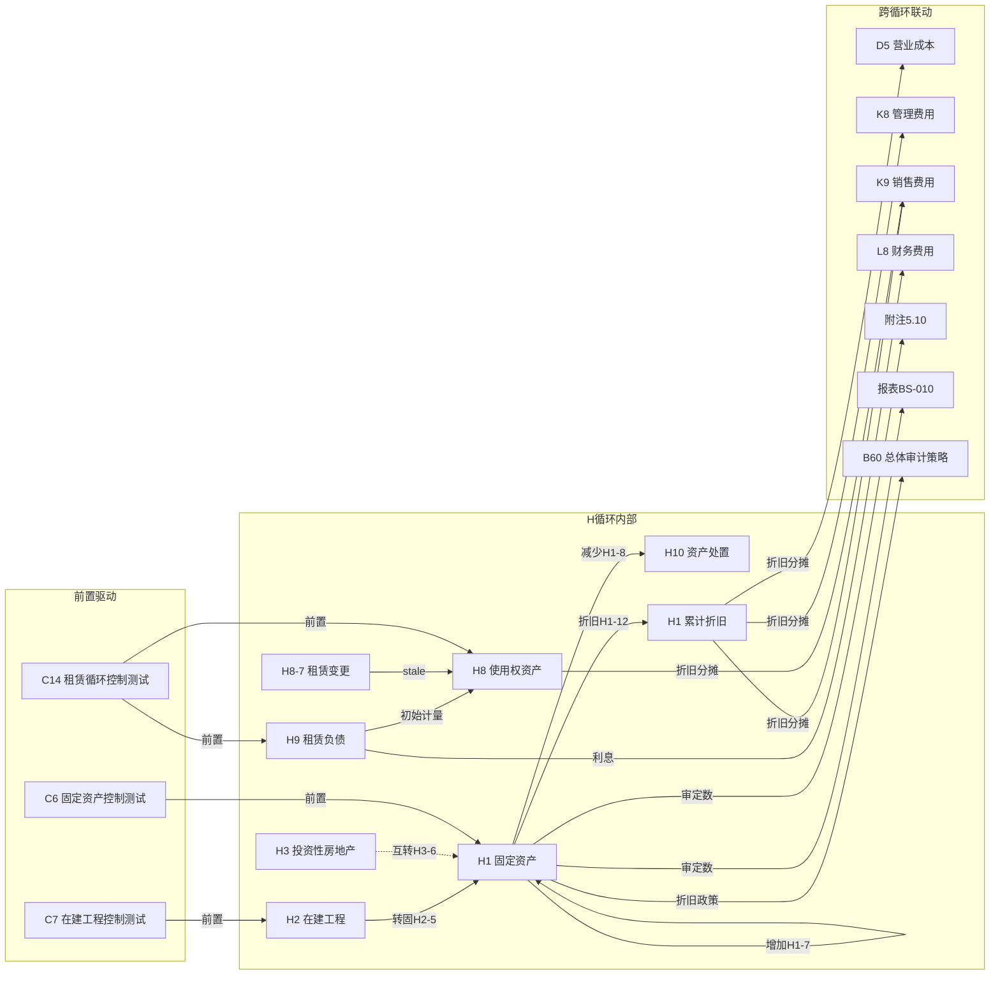

# H 固定资产循环底稿优化 — Design

> **Spec**: `workpaper-h-fixed-assets-cycle`
> **版本**: v1.0
> **配套**: requirements.md v1.2
> **创建日期**: 2026-05-19

## 变更记录

| 版本 | 日期 | 摘要 |
|------|------|------|
| v1.0 | 2026-05-19 | 初版 — 6 个 ADR + 7 Correctness Properties + 错误处理 |

---

## ADR 索引

| ADR | 标题 | 对应需求 | 决策摘要 |
|-----|------|---------|---------|
| ADR-H1 | 多文件合并 + wp_code 多 sheet 路由 | H-F1, H-F1b | 复用 `_merge_sheets_dedup` 0 改动；前端按"主版本识别规则"路由 + 分支选择器 |
| ADR-H2 | 计量模式 MEASUREMENT_MODEL_FILTER | H-F2 | 新增 project 表 `measurement_model` 列 + 前端 sheet 显隐字典 |
| ADR-H3 | 折旧/减值分支选择器 | H-F3 | 前端 composable `useDepreciationBranchSelector` + sheet 名正则匹配 |
| ADR-H4 | prefill 真实维度（Sprint 0.X 实测后填入）| H-F10 | 4-arg AUX + openpyxl 实测真名 + aux_type/aux_code 实测 |
| ADR-H5 | H9→H8 租赁两表反向回填 | H-F8 | cross_wp_references + WORKPAPER_SAVED 事件过滤 wp_code='H9' |
| ADR-H6 | 折旧引擎 4 种方法计算公式 | H-F11 | 纯算法 endpoint + apply_to_sheet 写回 + RBAC |

---

## 数据流图（H 循环跨底稿 + 跨循环联动）



**关键路径说明**：
- **H9→H8 反向回填**（ADR-H5）：H9 保存 → WORKPAPER_SAVED(wp_code='H9') → stale_engine → H8 初始计量 cell stale
- **H1→D5/K8/K9 折旧分摊**（H-F7 cross_wp_ref）：H1-12 月度折旧汇总 → 按部门分摊到 D5 营业成本 + K8 管理费用 + K9 销售费用
- **H2→H1 转固**（H-F7 cross_wp_ref）：H2-5 转固时点检查表确认 → H1 增加检查表 H1-7 联动
- **H3 双模式**（ADR-H2）：measurement_model=cost 时隐藏公允价值 sheet；=fair_value 时隐藏成本 sheet

---

## ADR-H1: 多文件合并 + wp_code 多 sheet 路由

### 背景
H 循环 11 文件 187 sheet，合并后 159 sheet（28 跨文件合法去重）。同 wp_code 多 sheet 共 9 个位置（H1-12 三版折旧 / H3-1 双模式 / H3-7 双减值 / H5-12 / H7-11 / H8-6 / H8-8 等）。

### 决策
1. **后端合并**：直接复用 `_merge_sheets_dedup`（D/F spec 已实现），0 代码改动。H 循环模板无历史遗留 sheet（实测 0 命中），不需扩展 `_should_skip_historical_sheet`。
2. **前端路由**：新增 `resolveMainVersionSheet(wpCode: string, allSheets: string[]): string` 工具函数：
   ```typescript
   // 主版本识别优先级（按 sheet 名关键词匹配）
   const MAIN_VERSION_KEYWORDS = ['（不含减值）', '-直线法', '（成本模式）', '（按月）']
   function resolveMainVersionSheet(wpCode: string, sheets: string[]): string {
     const matches = sheets.filter(s => s.includes(wpCode))
     if (matches.length <= 1) return matches[0] || ''
     // 多匹配时按关键词优先级选主版本
     for (const kw of MAIN_VERSION_KEYWORDS) {
       const hit = matches.find(s => s.includes(kw))
       if (hit) return hit
     }
     return matches[0] // fallback: 首个匹配
   }
   ```
3. **分支选择器联动**：路由到主版本后，H-F3 分支选择器自动加载同 wp_code 其余版本入口。

### 影响
- 不影响 D/E/F 循环（它们无同 wp_code 多 sheet 情况）
- 新增 1 个工具函数 + 1 个 composable（H-F3）

---

## ADR-H2: 计量模式 MEASUREMENT_MODEL_FILTER

### 背景
H3 投资性房地产 + H7 生产性生物资产支持「成本模式」或「公允价值模式」。这不是 IPO/normal scenario 维度，需独立控制。

### 决策
1. **DB 层**：project 表新增 `measurement_model VARCHAR(20) DEFAULT 'cost'`（枚举：`cost` / `fair_value`）
   - Alembic 迁移：`ALTER TABLE projects ADD COLUMN measurement_model VARCHAR(20) DEFAULT 'cost'`
2. **后端**：新增 `MEASUREMENT_MODEL_FILTER` 字典：
   ```python
   MEASUREMENT_MODEL_FILTER = {
       "cost": {
           "hide_patterns": ["（公允价值模式）", "(公允价值模式)"],
       },
       "fair_value": {
           "hide_patterns": ["（成本模式）", "(成本模式)"],
       },
   }
   ```
3. **前端**：`useHFixedAssetSheetGroups.ts` 在分组计算时读取 `projectMeta.measurement_model`，对命中 `hide_patterns` 的 sheet 设 `visible=false`。
4. **切换时机**：项目配置页修改 measurement_model → 前端 eventBus emit `measurement-model:changed` → sheet 列表重新计算（不需重新加载底稿文件）。

### 影响
- 新增 1 个 DB 列（Alembic 迁移）
- 不影响 SCENARIO_TO_FILE_FILTER（两者独立运行）
- H3/H7 以外的 H 子循环不受影响（它们 sheet 名不含"成本模式/公允价值模式"关键词）

---

## ADR-H3: 折旧/减值分支选择器

### 背景
H1-12 / H3-7 / H5-12 / H7-11 / H8-8 共 5 个位置存在"同 wp_code 多版本 sheet"（按减值次数或计算频率区分）。用户需要在这些位置切换版本。

### 决策
1. **前端 composable**：新建 `useDepreciationBranchSelector.ts`
   ```typescript
   interface BranchOption {
     sheetName: string   // 真实 sheet 名
     label: string       // 显示标签（如"不含减值-直线法" / "含减值" / "多次减值"）
     isMain: boolean     // 是否主版本
   }
   
   function useDepreciationBranchSelector(
     wpCode: string,
     allSheets: string[],
   ): { branches: Ref<BranchOption[]>; activeBranch: Ref<string>; switchBranch: (name: string) => void }
   ```
2. **触发位置**：WorkpaperEditor 检测到当前 active sheet 的 wp_code 有多版本时，在 sheet 顶部渲染 `<DepreciationBranchSelector>` 组件（el-radio-group 样式）。
3. **切换行为**：切换分支 = 调用 `sheetNav.switchTo(targetSheetName)`，不清空前一分支数据（各版本 sheet 独立存储）。
4. **分支识别正则**：
   ```typescript
   const BRANCH_PATTERNS: Record<string, RegExp[]> = {
     'H1-12': [/不含减值.*直线法/, /含减值(?!.*多次)/, /多次减值/],
     'H3-7':  [/不含减值/, /含减值/],
     'H5-12': [/不含减值/, /含减值/],
     'H7-11': [/不含减值.*直线法/, /含减值/],
     'H8-8':  [/不含减值/, /含减值/],
   }
   ```

### 影响
- 新增 1 个 composable + 1 个 UI 组件
- 仅在 H 循环底稿中渲染（其他循环无同 wp_code 多版本情况）
- 不影响 UniverSheetNav 现有逻辑（分支选择器是叠加层，不修改 nav 组件本身）

---

## ADR-H3b: H 循环 14 类 sheet 分组正则（H-F4 实施参照）

### 背景
H-F4 需要 14 类分组规则覆盖 159 个 sheet。PBT-P5 要求"任意 H sheet 名恰好匹配 1 类"。如果不在 design 阶段定义正则，实施时容易遗漏或重叠。

### 14 类分组规则（按优先级匹配顺序）

```typescript
const H_SHEET_GROUP_RULES: SheetGroupRule[] = [
  // 1. 索引类（defaultHidden=true）
  { id: 'index', label: '索引', priority: 0, defaultHidden: true,
    match: (s) => /^底稿目录$|^GT_Custom$|^修订说明$/.test(s) },

  // 2. 历史遗留类（defaultHidden=true）— H 循环实测 0 命中，保留规则做回归保护
  { id: 'historical', label: '历史遗留', priority: 1, defaultHidden: true,
    match: (s) => _should_skip_historical_sheet(s) },

  // 3. 总控台（程序表 xxA）
  { id: 'procedure', label: '总控台', priority: 2,
    match: (s) => /[A-Z]\d*A$/.test(s) || /实质性程序表/.test(s) },

  // 4. 审定表
  { id: 'audit_table', label: '审定表', priority: 3,
    match: (s) => /审定表/.test(s) },

  // 5. 附注披露（readonly=true）
  { id: 'disclosure', label: '附注披露', priority: 4, readonly: true,
    match: (s) => /附注披露/.test(s) },

  // 6. 明细表
  { id: 'detail', label: '明细表', priority: 5,
    match: (s) => /明细表/.test(s) },

  // 7. 折旧/折耗测算
  { id: 'depreciation', label: '折旧测算', priority: 6,
    match: (s) => /折旧|折耗|折旧分配/.test(s) },

  // 8. 减值测试
  { id: 'impairment', label: '减值测试', priority: 7,
    match: (s) => /减值|可收回金额/.test(s) },

  // 9. 增减检查
  { id: 'movement', label: '增减检查', priority: 8,
    match: (s) => /增加检查|减少检查|增减检查/.test(s) },

  // 10. 实物盘点
  { id: 'stocktake', label: '实物盘点', priority: 9,
    match: (s) => /监盘|盘点|监盘小结/.test(s) },

  // 11. 权属/产权检查
  { id: 'ownership', label: '权属检查', priority: 10,
    match: (s) => /权属|产权|产权核对/.test(s) },

  // 12. 关联交易
  { id: 'related_party', label: '关联交易', priority: 11,
    match: (s) => /关联/.test(s) },

  // 13. 租赁专项（H8/H9 特有）
  { id: 'lease', label: '租赁专项', priority: 12,
    match: (s) => /租赁|使用权资产|融资费用|租赁变更|简化处理/.test(s) },

  // 14. 调整分录
  { id: 'adjustment', label: '调整分录', priority: 13,
    match: (s) => /调整分录/.test(s) },

  // 15. 其他（fallback — 含分析表/会计政策/检查表/互转/利息资本化/经营租出/融资租出/闲置/核实/跟函/差异核对/替代程序/邮件传真/舞弊风险评价等）
  { id: 'other', label: '其他程序', priority: 14,
    match: () => true },  // fallback 兜底
]
```

### 匹配顺序说明
- 按 priority 升序匹配，**首个命中即停止**（保证恰好 1 类）
- "其他程序"是 fallback 兜底（priority=14），确保 PBT-P5 "匹配恰好 1 类"恒成立
- 实际分组数 = 15（含 fallback），但对外展示为 14 类（fallback 归入"其他程序"不单独显示为空组）

### 关键冲突解决
- "折旧测算表（含减值）H1-12" 同时命中 `depreciation`（折旧）和 `impairment`（减值）→ 按 priority 折旧(6) < 减值(7)，归入**折旧测算**类 ✅
- "减值测算表H1-14" 不含"折旧"关键字 → 归入**减值测试**类 ✅
- "利息资本化测算表H2-10" 不含折旧/减值/增减/盘点/权属/关联/租赁/调整 → 归入**其他程序**类 ✅
- "租赁负债明细表H9-2" 同时命中 `detail`（明细表）和 `lease`（租赁）→ 按 priority 明细(5) < 租赁(12)，归入**明细表**类 ✅

### 影响
- 实施时直接按此正则表写 `useHFixedAssetSheetGroups.ts`
- PBT-P5 用 `st.sampled_from(ALL_159_SHEET_NAMES)` 验证每个 sheet 恰好命中 1 类


---

## ADR-H4: prefill 真实维度（Sprint 0.X 实测后填入）

### 背景
H-F10 目标新增 ≥ 110 cells。F spec 教训：3-arg AUX 返回 None / 臆造 sheet 名 → 空数据。必须 Sprint 0.X 实测后才能定义 cell 映射。

### 决策
1. **Sprint 0.X 前置实测（实施前必做）**：
   - openpyxl 读 H1-2 明细表真实表头 → 确认资产分类维度（N 类）
   - SQL `SELECT DISTINCT aux_type, aux_code FROM tb_aux_balance WHERE account_code LIKE '160%' LIMIT 50` → 确认真实 aux_type / aux_code
   - 实测结果填入本 ADR 下方"实测结果"段落
2. **4-arg AUX 强制约定**：`=AUX(account_code, aux_type, aux_code, column)` — 4 个参数缺一不可
3. **真实 sheet 名铁律**：所有 prefill entry 的 `sheet` 字段必须与 openpyxl 读出的真实 sheet 名完全一致（含括号/空格/中文标点）
4. **一次性脚本模式**：写 `_add_h_prefill_cells.py` 批量追加 → 跑 reseed → 跑 `test_h_prefill_extension.py` 验证 → 删除脚本

### 实测结果（Sprint 0.X 实测完成 2026-05-19）

```python
# openpyxl 实测真实 sheet 名
H1_2_real_sheet_name = '明细表H1-2'
H1_12_real_sheet_names = [
    '折旧测算表（不含减值）-直线法H1-12',
    '折旧测算表（含减值）H1-12',
    '折旧测算表（多次减值）H1-12',
]
H1_13_real_sheet_name = '折旧分配分析表H1-13'
H1_14_real_sheet_name = '减值测算表H1-14'
H2_2_real_sheet_name = '明细表H2-2'
H3_detail_sheet_names = ['明细表（成本模式）H3-2', '明细表（公允价值模式）H3-2']
H8_detail_sheet_name = '明细表H8-2'
H9_detail_sheet_names = ['租赁负债明细表H9-2', '未确认融资费用明细表H9-3']
H10_detail_sheet_name = '明细表H10-2'

# H1-2 明细表结构（openpyxl 实测）
# Row 9: 表头行 — A=固定资产类别, B=编号, C=名称, D=原值(未审), Q=累计折旧(未审)
# Row 10: 子表头 — D=未审数, J=期初调整, K=账项调整, M=审定数
# Row 11: 明细列 — D=期初数, E=本期增加, G=本期减少, I=期末数 ...
# Row 12: 增减方式 — E=金额, F=增加方式, G=金额, H=减少方式
# 数据区从 Row 13 开始

# H1-13 折旧分配分析表 — 资产分类维度（实测 5 类）
N_h1_asset_categories = 5
H1_13_asset_categories = [
    '房屋及建筑物',   # Row 8
    '机器设备',       # Row 9
    '运输设备',       # Row 10
    '办公设备',       # Row 11
    '其他设备',       # Row 12
]
# 折旧分配列: C=生产成本, D=制造费用, E=销售费用, F=管理费用, G=研发费用, H=…, I=合计

# H1-12 折旧测算表结构（Row 8 表头）
# A=固定资产类别, B=编号, C=名称, D=管理部门, E=原值(期末), F=累计折旧(期末)
# G=开始使用日期, H=使用年限, I=残值率, J=账面月折旧额, K=使用月限
# L=测算到期日, M=已提折旧月份, N=本期折旧月份, O=测算月折旧
# P=当期折旧费用, Q=月折旧额差异, R=累计折旧费用, S=累计折旧额差异

# H1-14 减值测算表结构（Row 7-9 表头）
# A=固定资产类别, B=项目名称, C=是否存在减值迹象, D=减值迹象描述
# E=账面价值②, F=公允价值减处置费用③, G=预计未来现金流量现值④
# H=可收回金额⑤(③④较高者), I=期末应计提减值⑥(②-⑤), J=期末已计提⑦, K=本期应补提⑧(⑥-⑦)

# SQL 实测 tb_aux_balance（2026-05-19）
# 结论：1601（固定资产）/ 1602（累计折旧）无辅助账数据
# 仅 1604（在建工程）有数据：aux_type='项目名称', aux_code='B510003'/'B510006'
aux_type_for_1601 = None  # ❌ 无数据 → 降级
aux_type_for_1602 = None  # ❌ 无数据 → 降级
aux_type_for_1604 = '项目名称'  # ✅ 在建工程有辅助账
aux_codes_sample_1604 = ['B510003', 'B510006']  # 项目工程编号

# ========================================
# 降级结论（确认）
# ========================================
# H-F10 降级为仅 =TB/=LEDGER 公式（不含 =AUX）
# 原因：tb_aux_balance 无 1601/1602 辅助账数据（测试环境未导入 H 类固定资产辅助账）
# 目标从 ≥ 110 cells 降为 ≥ 70 cells
# H2 在建工程可用 =AUX('1604', '项目名称', aux_code, column) — 但仅 2 个 aux_code
# UAT #14 门槛同步降级为"≥ 10 cell（=TB 按科目）"
#
# prefill 公式类型分布（降级后）：
#   =TB(account_code, column)          — H1/H2/H3/H8/H9/H10 审定表+明细表科目余额
#   =LEDGER_DETAIL(account, sheet, ...) — H1-12 折旧测算按月抽样
#   =AUX('1604', '项目名称', code, col) — H2 在建工程明细（仅 2 条 aux_code 可用）
#   =PREV(sheet, cell)                  — 上年期末连续性
```

### 影响
- 实施时间依赖 Sprint 0.X 实测完成
- 不影响现有 12 entries / 56 cells（仅追加新 entry）

---

## ADR-H5: H9→H8 租赁两表反向回填

### 背景
H9 租赁负债初始计量驱动 H8 使用权资产入账。与 F-F8 F0→F2 反向回填同模式。

### 决策
1. **cross_wp_references 新增条目**：
   ```json
   {
     "ref_id": "CW-2XX",  // 运行时 max+1
     "source_wp": "H9",
     "source_sheet": "审定表H9-1",
     "source_cell": "租赁负债期末",
     "targets": [{
       "wp_code": "H8",
       "sheet": "审定表H8-1",
       "cell": "使用权资产初始计量",
       "formula": "=WP('H9','审定表H9-1','租赁负债期末')"
     }],
     "category": "data_flow_reverse",
     "severity": "warning",
     "trigger": "workpaper:saved:H9"
   }
   ```
2. **事件触发**：复用 `EventType.WORKPAPER_SAVED` + payload.extra.wp_code='H9' 过滤（不新增事件类型）
3. **stale 传播**：stale_engine 沿 cross_wp_references 路径标记 H8 对应 cell 为 stale → 前端订阅 `cross-ref:updated` 自动刷新
4. **租赁变更（H8-7）**：同样走 WORKPAPER_SAVED + wp_code='H8-7' → stale 传播到 H8 后续计量 sheet

### 影响
- 新增 2~3 条 cross_wp_references（H9→H8 初始 + H8-7→H8 变更）
- 不影响 F0→F2 / D0→D2 已有反向回填路径

---

## ADR-H6: 折旧引擎 4 种方法计算公式

### 背景
H-F11 需要 4 种折旧方法的纯算法 endpoint。每种方法输入相同（原值/残值率/使用年限/起始月份/已计提月数），输出月度折旧序列 + 累计折旧序列。

### 决策

#### 输入 schema
```python
class DepreciationCalcRequest(BaseModel):
    method: Literal['straight_line', 'double_declining', 'sum_of_years', 'units_of_production']
    original_cost: Decimal          # 原值
    residual_rate: Decimal           # 残值率（0~1，如 0.05 = 5%）
    useful_life_months: int          # 使用年限（月数）
    start_month: int                 # 起始月份（1~12）
    already_depreciated_months: int  # 已计提月数（续提场景）
    # 工作量法专用
    total_units: Decimal | None = None       # 总工作量
    current_period_units: Decimal | None = None  # 当期工作量
    # 写回
    apply_to_sheet: str | None = None
```

#### 4 种方法公式

**A. 直线法（straight_line）**
```
residual = original_cost × residual_rate
depreciable = original_cost - residual
monthly_dep = depreciable / useful_life_months
# 每月折旧严格相等
```

**B. 双倍余额递减法（double_declining）**
```
annual_rate = 2 / (useful_life_months / 12)
# 前 N-2 年：月折旧 = 年初账面净值 × annual_rate / 12
# 最后 2 年（剩余月数 ≤ 24）：切换为直线法
#   月折旧 = (当前账面净值 - residual) / 剩余月数
# 约束：累计折旧不超过 depreciable
```

**C. 年数总和法（sum_of_years）**
```
sum_of_years = useful_life_years × (useful_life_years + 1) / 2
# 第 k 年：年折旧 = depreciable × (useful_life_years - k + 1) / sum_of_years
# 月折旧 = 年折旧 / 12
# 约束：累计折旧不超过 depreciable
```

**D. 工作量法（units_of_production）**
```
unit_dep = depreciable / total_units
period_dep = unit_dep × current_period_units
# 约束：累计折旧不超过 depreciable
```

#### 输出 schema
```python
class DepreciationCalcResponse(BaseModel):
    method: str
    monthly_schedule: list[dict]  # [{month: int, depreciation: Decimal, accumulated: Decimal}]
    total_depreciation: Decimal
    remaining_book_value: Decimal
    applied_to_sheet: str | None = None
```

#### RBAC + 写回
- `Depends(require_project_access("edit"))`
- `apply_to_sheet` 非空时写入 `working_paper.parsed_data.depreciation_calcs[sheet]`

### 影响
- 新增 1 个路由文件 `backend/app/routers/wp_h_depreciation.py`
- 纯算法无 DB IO（除写回时 PATCH parsed_data）
- 不影响 prefill_engine 现有逻辑

---

## Correctness Properties（7 个）

| # | Property | 形式化描述 | 验证方式 |
|---|---------|-----------|---------|
| CP-1 | Sheet 名归一化幂等性 | ∀ name: normalize(normalize(name)) == normalize(name) | PBT-P1 hypothesis |
| CP-2 | 历史遗留过滤回归安全 | ∀ H_sheet ∈ 187: skip(H_sheet) == False（H 模板 0 命中）∧ ∀ D/F_historical: skip(D/F_historical) == True | PBT-P2 |
| CP-3 | cross_wp_references ref_id 全局唯一 | ∀ i,j: refs[i].ref_id ≠ refs[j].ref_id (i≠j) | PBT-P3 |
| CP-4 | VR-H1-01 三角勾稽正确性 | ∀ (期初, 增加, 减少, 处置, 期末): \|期末 − (期初 + 增加 − 减少 + 处置)\| < 1.0 ⟺ pass | PBT-P4 + 9 显式边界 |
| CP-5 | H 循环 14 类 sheet 分组完备性 | ∀ sheet ∈ H_159_sheets: ∃! group ∈ 14_groups: matches(sheet, group) | PBT-P5 |
| CP-6 | 计量模式 × scenario 裁剪幂等 | ∀ (model, scenario, sheets): filter(filter(sheets, model, scenario), model, scenario) == filter(sheets, model, scenario) | PBT-P6 |
| CP-7 | `_ensure_ipo_loaded('H1')` 空 codes 安全 | _ensure_ipo_loaded(db, pid, year, 'H1') 不抛异常 ∧ result.added_codes == [] | PBT-P7 |

### CP-4 详细不变量（VR-H1-01 + VR-H1-02 + VR-H8-01）

```python
# VR-H1-01: 固定资产期末余额勾稽
def vr_h1_01(opening, additions, disposals, h10_disposal, closing):
    expected = opening + additions - disposals + h10_disposal
    return abs(closing - expected) < Decimal("1.0")

# VR-H1-02: 累计折旧期末余额勾稽
def vr_h1_02(dep_opening, current_provision, disposal_offset, dep_closing):
    expected = dep_opening + current_provision - disposal_offset
    return abs(dep_closing - expected) < Decimal("1.0")

# VR-H8-01: 使用权资产 = 租赁负债 + 初始直接费用 - 激励
def vr_h8_01(h8_closing, h9_closing, initial_direct_cost, incentive):
    expected = h9_closing + initial_direct_cost - incentive
    return abs(h8_closing - expected) < Decimal("1.0")
```

### CP-6 详细不变量（计量模式 × scenario 交叉）

```python
def measurement_model_filter(sheets, model):
    """model='cost' 时隐藏含'（公允价值模式）'的 sheet；反之亦然"""
    hide = MEASUREMENT_MODEL_FILTER[model]["hide_patterns"]
    return [s for s in sheets if not any(p in s for p in hide)]

# 幂等性
assert measurement_model_filter(measurement_model_filter(sheets, m), m) == measurement_model_filter(sheets, m)

# 与 scenario_filter 独立（交换律）
assert measurement_model_filter(scenario_filter(sheets, s), m) == scenario_filter(measurement_model_filter(sheets, m), s)
```

---

## 错误处理

| 场景 | 处理策略 | 用户可见行为 |
|------|---------|------------|
| H1-12 折旧引擎输入不完整（缺原值/残值率/使用年限） | 返回 HTTP 422 + 字段级错误提示 | 前端 toast "请填写完整折旧参数" |
| 折旧引擎计算溢出（原值 > 1e15 或使用年限 > 600 月） | 返回 HTTP 400 + "参数超出合理范围" | 前端 toast 提示 |
| 双倍余额递减法切换直线时点计算异常（剩余月数 = 0） | 防御性 max(remaining_months, 1) | 不影响用户（静默保护） |
| 工作量法 total_units = 0 | 返回 HTTP 400 + "总工作量不能为零" | 前端 toast |
| H9→H8 反向回填时 H8 底稿不存在 | stale_engine 记录 warning 日志，不阻断 H9 保存 | H9 正常保存，H8 stale 标记跳过 |
| measurement_model 切换时 project 表更新失败 | 返回 HTTP 500 + 回滚 | 前端 toast "切换失败，请重试" |
| wp_code 路由匹配到 0 个 sheet（模板缺失） | 返回空 sheet + console.warn | 前端显示"未找到对应底稿" |
| wp_code 路由匹配到 > 3 个 sheet（异常模板） | 取前 3 个 + 记录 warning | 分支选择器最多显示 3 个选项 |
| VR-H1-01 blocking 校验时 parsed_data 缺字段 | 规则 skip（passed=true, details="数据不完整"） | 不阻断签字，显示"数据不完整跳过" |
| prefill 4-arg AUX 在 tb_aux_balance 无匹配行 | COALESCE(SUM, 0) 返回 0 | 单元格显示 0（不报错） |
| `_ensure_ipo_loaded('H1')` codes=[] 时调用 | 直接返回 empty result，不抛异常 | 无用户可见行为（占位状态） |

---

> **本 design.md 配套**：requirements.md v1.2 + tasks.md（待本文 review 后启动）
> **下一步**：用户 review design.md → 反馈 → 启动 tasks.md（Sprint 划分 + 工时估算）
