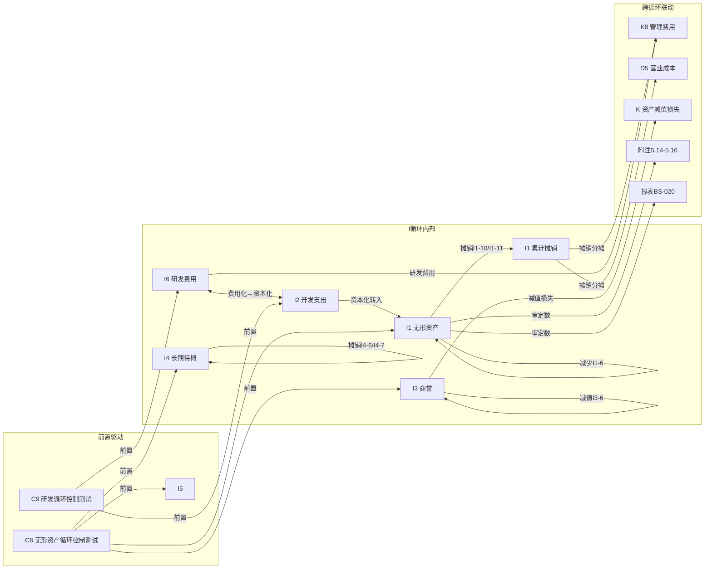

# I 无形资产循环底稿优化 — Design

> **Spec**: `workpaper-i-intangible-assets-cycle`
> **版本**: v1.0
> **配套**: requirements.md v1.0
> **创建日期**: 2026-05-19

## 变更记录

| 版本 | 日期 | 摘要 |
|------|------|------|
| v1.0 | 2026-05-19 | 初版 — 5 个 ADR + 5 Correctness Properties + 错误处理 |

---

## ADR 索引

| ADR | 标题 | 对应需求 | 决策摘要 |
|-----|------|---------|---------|
| ADR-I1 | 多文件合并去重 + I1 摊销 2-version 分支 | I-F1, I-F2 | 复用 `_merge_sheets_dedup` 0 改动；I1/I4 分支选择器复用 H-F3 模式（2 分支，比 H 简单）|
| ADR-I2 | I2 开发支出资本化时点判断逻辑 | I-F5 | 新增 endpoint，5 条件 check → auto-suggest 资本化起始日期 |
| ADR-I3 | I3 商誉减值（不摊销，年度 DCF 测试）| I-F4 | 复用 H-F12 AssetImpairmentDialog 模式 + 商誉特殊分摊逻辑 |
| ADR-I4 | I6↔I2 研发费用↔开发支出反向回填 | I-F8 | cross_wp_references 双向 + WORKPAPER_SAVED 事件过滤 |
| ADR-I5 | 摊销引擎 2 种方法（straight_line + units_of_production）| I-F2, I-F10 | H-F11 折旧引擎子集复用，仅 2 方法 |

---

## 数据流图（I 循环跨底稿 + 跨循环联动）



**关键路径说明**：
- **I6↔I2 双向回填**（ADR-I4）：I2 保存 → WORKPAPER_SAVED(wp_code='I2') → stale_engine → I6 对应 cell stale；反向同理
- **I1 摊销分摊**（I-F7 cross_wp_ref）：I1-10/I1-11 摊销汇总 → 按部门分摊到 K8 管理费用 + D5 营业成本
- **I2→I1 资本化转入**（I-F7 cross_wp_ref）：I2 开发支出达到可使用状态 → 转入 I1 无形资产
- **I3 商誉减值**（ADR-I3）：年度 DCF 测试 → 减值先冲商誉 → 剩余按比例分摊

---

## ADR-I1: 多文件合并去重 + I1 摊销 2-version 分支

### 背景
I 循环 6 文件 86 sheet，合并后 67 sheet（18 跨文件合法去重 + 1 历史遗留过滤）。I1 摊销测算有 2 版本（I1-10 不含减值 / I1-11 含减值），I4 摊销有 2 版本（I4-6 直线法 / I4-7 工作量法）。

### 决策
1. **后端合并**：直接复用 `_merge_sheets_dedup`（D/F/H spec 已实现），0 代码改动。I3 历史遗留 1 sheet 已被现行 regex 覆盖，不需扩展。
2. **分支选择器**：复用 H-F3 `useDepreciationBranchSelector` 模式，但语义不同于 H 循环：
   - **H 循环**：同 wp_code 多 sheet（如 H1-12 三版共享 wp_code）→ 需 `resolveMainVersionSheet` 路由保护
   - **I 循环**：不同 wp_code 但业务相关的 sheet 间跳转（I1-10 和 I1-11 各有独立 wp_code）→ 仅需分支选择器提供"跳转到相关 sheet"入口，**不需要** `resolveMainVersionSheet`
   ```typescript
   // I 循环分支选择器配置（按 sheet 名匹配，非 wp_code 匹配）
   const I_BRANCH_GROUPS: BranchGroup[] = [
     {
       label: 'I1 摊销测算',
       sheets: [
         { sheetName: '摊销测算表（不含减值）I1-10（剩余年限法）', label: '不含减值' },
         { sheetName: '摊销测算表（含减值）I1-11', label: '含减值' },
       ],
     },
     {
       label: 'I4 摊销测算',
       sheets: [
         { sheetName: '摊销测算I4-6', label: '直线法' },
         { sheetName: '摊销测算表I4-7（工作量法）', label: '工作量法' },
       ],
     },
   ]
   ```
3. **路由**：I1-10/I1-11 和 I4-6/I4-7 各有独立 wp_code，不存在 H 循环"同 wp_code 多 sheet"问题 → 不需要 `resolveMainVersionSheet`，仅需分支选择器在相关 sheet 间切换（调用 `sheetNav.switchTo(targetSheetName)`）。

### 影响
- 不影响 D/E/F/H 循环
- 复用 H-F3 composable，仅追加 I 循环配置

---

## ADR-I2: I2 开发支出资本化时点判断逻辑

### 背景
CAS 6 规定开发支出资本化需同时满足 5 个条件。当前 I2-6 sheet 靠手工逐项勾选，无系统化校验和建议。

### 决策
1. **Endpoint**：`POST /api/projects/{pid}/workpapers/{wid}/i2/capitalization-check`
2. **输入 schema**：
   ```python
   class CapitalizationCheckRequest(BaseModel):
       # CAS 6 五条件
       technical_feasibility: bool          # 技术可行性已论证
       completion_intent: bool              # 完成并使用或出售的意图
       ability_to_use_or_sell: bool         # 使用或出售的能力
       future_economic_benefits: bool       # 产生未来经济利益
       resource_sufficiency: bool           # 资源充足（技术/财务/其他）
       # 时间信息
       condition_dates: dict[str, str]      # 各条件满足日期 {"technical_feasibility": "2025-03-15", ...}
       project_start_date: str             # 研发项目启动日期
       project_end_date: str | None = None # 研发项目预计完成日期
       # 写回
       apply_to_sheet: str | None = None
   ```
3. **输出 schema**：
   ```python
   class CapitalizationCheckResponse(BaseModel):
       all_conditions_met: bool
       capitalization_start_date: str | None  # 最后一个条件满足日期
       missing_conditions: list[str]          # 未满足条件名称列表
       recommendation: str                    # "建议自 YYYY-MM-DD 起资本化" 或 "不满足资本化条件"
       applied_to_sheet: str | None = None
   ```
4. **逻辑**：
   - 5 条件全 True → `capitalization_start_date = max(condition_dates.values())`
   - 任一 False → `missing_conditions` 列出缺失项 + `recommendation = "不满足资本化条件，缺失：{list}"`
5. **RBAC + 写回**：`Depends(require_project_access("edit"))` + `apply_to_sheet` 写入 `working_paper.parsed_data.capitalization_checks[sheet]`

### 影响
- 新增 1 个路由文件 `backend/app/routers/wp_i_capitalization.py`
- 纯逻辑无 DB IO（除写回时 PATCH parsed_data）
- I-cycle 独有，不影响其他循环

---

## ADR-I3: I3 商誉减值（不摊销，年度 DCF 测试）

### 背景
商誉不摊销（CAS 8），但需年度减值测试。DCF 模型与 H1-14 同款，但商誉特殊性：减值先冲减商誉，剩余按比例分摊到资产组其他资产。

### 决策
1. **复用 H-F12 模式**：`AssetImpairmentDialog.vue` 参数化为商誉版本
2. **Endpoint**：`POST /api/projects/{pid}/workpapers/{wid}/i3/goodwill-impairment`
3. **输入 schema**：
   ```python
   class GoodwillImpairmentRequest(BaseModel):
       cgu_id: str                          # 资产组 ID
       goodwill_book_value: Decimal         # 商誉账面价值
       cgu_book_value: Decimal              # 资产组（含商誉）账面价值
       cash_flow_projections: list[Decimal] # 5 年现金流预测
       discount_rate: Decimal               # 折现率
       terminal_growth_rate: Decimal        # 终值增长率
       apply_to_sheet: str | None = None
   ```
4. **输出 schema**：
   ```python
   class GoodwillImpairmentResponse(BaseModel):
       recoverable_amount: Decimal          # 可收回金额
       cgu_book_value_with_goodwill: Decimal
       impairment_loss: Decimal             # 减值损失（0 = 无减值）
       goodwill_impairment: Decimal         # 商誉承担的减值（先冲商誉）
       remaining_impairment: Decimal        # 剩余分摊到其他资产
       conclusion: str                      # "无减值" / "商誉全额减值" / "商誉部分减值"
       applied_to_sheet: str | None = None
   ```
5. **商誉减值分摊逻辑**：
   ```python
   def allocate_goodwill_impairment(recoverable, cgu_book, goodwill_book):
       if recoverable >= cgu_book:
           return 0, 0, 0  # 无减值
       total_impairment = cgu_book - recoverable
       goodwill_impairment = min(total_impairment, goodwill_book)
       remaining = total_impairment - goodwill_impairment
       return total_impairment, goodwill_impairment, remaining
   ```
6. **当前为 stub**：DCF 公式正确但 LLM 真实接入待 wp_ai_service 升级

### 影响
- 新增 1 个路由文件 `backend/app/routers/wp_i_goodwill.py`
- 复用 `AssetImpairmentDialog.vue`（props 参数化区分 H1-14 vs I3）
- 不影响 H-F12 已有实现

---

## ADR-I4: I6↔I2 研发费用↔开发支出反向回填

### 背景
I6 研发费用（费用化）与 I2 开发支出（资本化）是同一研发活动的两面。VR-I6-01 要求"研发费用总额 = 费用化 + 资本化"。需双向 stale 传播。

### 决策
1. **cross_wp_references 新增条目**：
   ```json
   [
     {
       "ref_id": "CW-2XX",
       "source_wp": "I2",
       "source_sheet": "审定表I2-1",
       "source_cell": "开发支出期末（资本化金额）",
       "targets": [{"wp_code": "I6", "sheet": "审定表I6-1", "cell": "资本化支出"}],
       "category": "data_flow_reverse",
       "severity": "warning",
       "trigger": "workpaper:saved:I2"
     },
     {
       "ref_id": "CW-2XX",
       "source_wp": "I6",
       "source_sheet": "审定表I6-1",
       "source_cell": "费用化支出",
       "targets": [{"wp_code": "I2", "sheet": "审定表I2-1", "cell": "对应费用化金额"}],
       "category": "data_flow_reverse",
       "severity": "warning",
       "trigger": "workpaper:saved:I6"
     }
   ]
   ```
2. **事件触发**：复用 `EventType.WORKPAPER_SAVED` + payload.extra.wp_code 过滤（'I2' 或 'I6'）
3. **stale 传播**：stale_engine 沿 cross_wp_references 路径标记对方 cell 为 stale
4. **VR-I6-01 联动**：当 I6 或 I2 任一保存时，触发 VR-I6-01 校验（费用化+资本化=总额）

### 影响
- 新增 2~3 条 cross_wp_references
- 不影响 H9→H8 / F0→F2 已有反向回填路径

---

## ADR-I5: 摊销引擎 2 种方法（straight_line + units_of_production）

### 背景
I 循环摊销仅需直线法（I1-10/I4-6）+ 工作量法（I4-7），是 H-F11 折旧引擎 4 种方法的子集。

### 决策
1. **复用 H-F11 引擎**：如果 H spec 已实施，直接调用 H-F11 endpoint 传 `method='straight_line'` 或 `method='units_of_production'`
2. **如果 H spec 未实施**（I spec 先行）：新建 `backend/app/routers/wp_i_amortization.py`，仅实现 2 种方法：
   ```python
   class AmortizationCalcRequest(BaseModel):
       method: Literal['straight_line', 'units_of_production']
       original_cost: Decimal
       residual_rate: Decimal
       useful_life_months: int
       start_month: int
       already_amortized_months: int
       total_units: Decimal | None = None
       current_period_units: Decimal | None = None
       apply_to_sheet: str | None = None
   ```
3. **公式**：
   - **直线法**：`monthly_amort = (original_cost - residual) / useful_life_months`
   - **工作量法**：`period_amort = (original_cost - residual) / total_units × current_period_units`
4. **RBAC + 写回**：同 H-F11 模式

### 影响
- 如果 H spec 先完成：0 新增路由，直接复用
- 如果 I spec 先行：新增 1 个路由文件（后续 H spec 可反向复用）
- 不影响 H-F11 折旧引擎（4 方法 ⊃ 2 方法）

### 实测结果（Sprint 0.X 已落地，2026-05-19）

```python
# ==========================================================================
# Part 1 — 明细表真实 sheet 名（openpyxl 实测，5 个全部确认）
# ==========================================================================
I1_2_real_sheet_name = '明细表I1-2'
I2_2_real_sheet_name = '明细表I2-2'
I3_2_real_sheet_name = '明细表I3-2'
I4_2_real_sheet_name = '明细表I4-2'
I6_2_real_sheet_name = '明细表I6-2'

# ==========================================================================
# Part 2 — 摊销测算 sheet 真实名（含括号修饰词，4 个全部确认）
# ==========================================================================
I1_10_real_sheet_name = '摊销测算表（不含减值）I1-10（剩余年限法）'
I1_11_real_sheet_name = '摊销测算表（含减值）I1-11'
I4_6_real_sheet_name = '摊销测算I4-6'           # 直线法（无后缀修饰）
I4_7_real_sheet_name = '摊销测算表I4-7（工作量法）'

# ==========================================================================
# Part 3 — 6 文件 86 sheet 全量实测（与 Sprint 0 N_i_raw_sheets=86 完全一致）
# ==========================================================================
# I1 无形资产、累计摊销及减值准备.xlsx — 18 sheets
# I2 开发支出.xlsx                       — 21 sheets
# I3 商誉.xlsx                           — 15 sheets
# I4 长期待摊费用.xlsx                   — 12 sheets
# I5 其他非流动资产.xlsx                 —  9 sheets
# I6 研发费用.xlsx                       — 11 sheets
# 合计                                   — 86 sheets ✅
# 历史遗留 1 sheet（"参考－商誉减值测试示例" 在 I3）已被现行 regex 覆盖

# ==========================================================================
# Part 4 — I1-2 明细表结构（数据起始行 + 表头维度）
# ==========================================================================
# Row 8:   一级表头 — A=无形资产项目, B=无形资产类别, C-N=无形资产原值, P-AB=累计摊销
# Row 9:   二级表头 — C-H=未审数, I=期初调整, J-K=账项调整, L-O=审定数, P-... 累计摊销
# Row 10:  三级表头 — C=期初数, D=本期增加, F=本期减少, H=期末数, ... 同样含期初调整/账项调整/审定数
# Row 11:  四级表头 — D=金额, E=增加方式, F=金额, G=减少方式, P=本期摊销, Q=其他增加 ...
# Row 12+: 数据行   — 通用占位（A/B/C/D/...）— 无预设分类，由用户填入实际无形资产
N_i1_2_data_start_row = 12

# ==========================================================================
# Part 5 — 无形资产分类维度（N_intangible_categories）
# ==========================================================================
# 致同模板 I1-2 给的是"通用占位"（A/B/C/D/E/F），不预设分类名
# 但 I4-6/I4-7 摊销测算表硬编码示例分类（4 类）：
I4_6_hardcoded_categories = ['非专利技术', '商标权', '著作权', '土地使用权']
# 业内常见 6 类（spec 起草时拟用，可根据真实项目动态扩展）：
N_intangible_categories = 6
COMMON_INTANGIBLE_CATEGORIES = [
    '专利权',         # patents
    '商标权',         # trademarks
    '著作权',         # copyrights
    '土地使用权',     # land use rights
    '软件',           # software
    '非专利技术',     # non-patent technology
]
# I-F10 prefill 实施时按 6 类生成 cells（每类 1~2 cells，共 ≥ 12 cells）

# ==========================================================================
# Part 6 — I2-2 研发项目结构（开发支出明细表）
# ==========================================================================
# Row 10: 一级表头 — A=研究开发项目名称, B-G=未审数, H=期初调整, I-J=账项调整, L-P=审定数
# Row 11: 二级表头 — B=期初数, C=本期增加, E=本期减少, G=期末数, ...
# Row 12: 三级表头 — C=金额, D=增加方式, E=计入无形资产/存货, F=计入当期损益（资本化 vs 费用化区分）
# Row 13+: 数据行 — 占位"课题/课题1/课题2/课题3/数据资源/……"（含数据资源新分类）
N_i2_2_data_start_row = 13

# ==========================================================================
# Part 7 — I3-2 商誉明细表（双区域结构）
# ==========================================================================
# 左区域 (Col 0-15): 商誉原值
# 右区域 (Col 16-29): 减值准备
# Row 10: 一级 — A=被投资单位名称, C-P=商誉原值; Q=被投资单位名称, R=减值准备
# Row 11-12: 子表头 — 期初/本期增加/本期减少/期末 + 审定数
# Row 13: 增加方式/减少方式 + 本期计提/其他增加/处置/其他减少
# Row 14+: 数据行
N_i3_2_data_start_row = 14

# ==========================================================================
# Part 8 — I4-2 长期待摊费用明细表
# ==========================================================================
# Row 8: 一级表头 — A=项目名称, B=类别, C=资产类型, D=项目编码, E=初始入账金额, F-J=未审数, K-N=账项调整, O-S=审定数, T=合同协议等索引号
# Row 9-10: 子表头（含本期摊销/其他减少 子分类）
# Row 11+: 数据行（占位"使用权资产改良及维护支出"）
N_i4_2_data_start_row = 11

# ==========================================================================
# Part 9 — I6-2 研发费用月度明细
# ==========================================================================
# Row 8: 一级表头 — A=类别, B-M=1月~12月, N=本期未审合计, O=账项调整, P=重分类调整, Q=本期审定数, R=各项目占比, S=与相关科目勾稽, T=上期未审数
# Row 9+: 数据行（已硬编码 4 类）：人工费/材料费/制造费用分摊/无形资产摊销 ...
N_i6_2_data_start_row = 9
I6_2_hardcoded_subjects = ['人工费', '材料费', '制造费用分摊', '无形资产摊销']

# ==========================================================================
# Part 10 — SQL 实测 tb_aux_balance（2026-05-19）
# ==========================================================================
# 结论：1701/1702/1703（无形资产/累计摊销/减值准备）+ 1711/1712 + 5601 研发费用
# 全部无辅助账数据（与 H 循环 1601/1602 相同情况：测试环境未导入 I 类辅助账）
aux_type_for_1701 = None  # ❌ 无数据
aux_type_for_1702 = None  # ❌ 无数据
aux_type_for_1703 = None  # ❌ 无数据
aux_type_for_5601 = None  # ❌ 无数据（研发费用）
aux_codes_sample = []     # 全部为空

# ========================================
# 降级结论（确认 — 与 H 循环对称）
# ========================================
# I-F10 降级为仅 =TB/=LEDGER 公式（不含 =AUX）
# 原因：tb_aux_balance 无 1701/1702/1703 + 5601 辅助账数据
# 目标从 ≥ 60 cells 降为 ≥ 40 cells（已在 spec v1.1 三件套预设降级条款）
# UAT #13 门槛同步降级为"≥ 6 cell（=TB 按科目代码）"
#
# prefill 公式类型分布（降级后）：
#   =TB(account_code, column)               — I1/I2/I3/I4/I6 审定表+明细表科目余额
#   =LEDGER_DETAIL(account, sheet, ...)     — I1-10/I1-11 摊销测算按月抽样
#   =PREV(sheet, cell)                      — 上年期末连续性
#   =CROSS_SHEET(sheet, cell)               — I1-10 / I1-11 → I1-2 已有公式（如 ='明细表I1-2'!L12）
```

### 影响（实测后修订）
- 实施时间不依赖额外实测（已落地）
- I-F10 prefill 实施时按 6 类无形资产 + 4 类研发费用维度生成 cells（不再用 =AUX 4-arg）
- 摊销测算 sheet 的真实名带括号修饰词 — useDepreciationBranchSelector I 配置必须用全名匹配，不能用 startsWith('I1-10')
- 各 sheet 数据起始行已确认（I1-2=12 / I2-2=13 / I3-2=14 / I4-2=11 / I6-2=9）— prefill cell 坐标必须从此行起算

---

## ADR-I5b: I 循环 10 类 sheet 分组正则（I-F3 实施参照）

### 10 类分组规则（按优先级匹配顺序）

```typescript
const I_SHEET_GROUP_RULES: SheetGroupRule[] = [
  // 1. 索引类（defaultHidden=true）
  { id: 'index', label: '索引', priority: 0, defaultHidden: true,
    match: (s) => /^底稿目录$|^GT_Custom$/.test(s) },

  // 2. 历史遗留类（defaultHidden=true）
  { id: 'historical', label: '历史遗留', priority: 1, defaultHidden: true,
    match: (s) => _should_skip_historical_sheet(s) },

  // 3. 总控台（程序表 xxA）
  { id: 'procedure', label: '总控台', priority: 2,
    match: (s) => /[A-Z]\d*A$/.test(s) || /实质性程序/.test(s) },

  // 4. 审定表
  { id: 'audit_table', label: '审定表', priority: 3,
    match: (s) => /审定表/.test(s) },

  // 5. 附注披露（readonly=true）
  { id: 'disclosure', label: '附注披露', priority: 4, readonly: true,
    match: (s) => /附注披露/.test(s) },

  // 6. 明细表
  { id: 'detail', label: '明细表', priority: 5,
    match: (s) => /明细表/.test(s) },

  // 7. 摊销测算
  { id: 'amortization', label: '摊销测算', priority: 6,
    match: (s) => /摊销/.test(s) },

  // 8. 减值测试
  { id: 'impairment', label: '减值测试', priority: 7,
    match: (s) => /减值|可收回金额/.test(s) },

  // 9. 针对性检查（含资本化时点/权属/截止性/实质性分析等）
  { id: 'targeted_check', label: '针对性检查', priority: 8,
    match: (s) => /检查表|资本化时点|截止性测试|实质性分析|使用寿命|权属|构成明细|认定|工时/.test(s) },

  // 10. 调整分录
  { id: 'adjustment', label: '调整分录', priority: 9,
    match: (s) => /调整分录/.test(s) },

  // 11. 其他（fallback）
  { id: 'other', label: '其他程序', priority: 10,
    match: () => true },
]
```

### 匹配顺序说明
- 按 priority 升序匹配，首个命中即停止（保证恰好 1 类）
- "其他程序"是 fallback 兜底，确保 PBT-P5 恒成立
- 实际分组数 = 11（含 fallback），对外展示为 10 类

### 关键冲突解决
- "摊销测算表（含减值）I1-11" 同时命中 `amortization`（摊销）和 `impairment`（减值）→ 按 priority 摊销(6) < 减值(7)，归入**摊销测算**类 ✅
- "减值准备测试表I1-12" 不含"摊销" → 归入**减值测试**类 ✅
- "研发项目资本化时点判断I2-6" 命中 `targeted_check`（资本化时点）→ 归入**针对性检查**类 ✅
- "会计政策检查I2-4" 命中 `targeted_check`（检查表）→ 归入**针对性检查**类 ✅
- "市场平均收益率2017" 不含任何关键词 → 归入**其他程序**类 ✅

---

## Correctness Properties（5 个）

| # | Property | 形式化描述 | 验证方式 |
|---|---------|-----------|---------|
| CP-1 | Sheet 名归一化幂等性 | ∀ name: normalize(normalize(name)) == normalize(name) | PBT-P1 hypothesis |
| CP-2 | 历史遗留过滤正确性 | I3 "参考－商誉减值测试示例" → True ∧ ∀ other_I_sheet → False ∧ D/F/H 回归 | PBT-P2 |
| CP-3 | cross_wp_references ref_id 全局唯一 | ∀ i,j: refs[i].ref_id ≠ refs[j].ref_id (i≠j) | PBT-P3 |
| CP-4 | VR-I1-01 / VR-I3-01 / VR-I6-01 三角勾稽正确性 | 恒等点 + 边界内 + 边界外 + 对称性 | PBT-P4 + 9 显式边界 |
| CP-5 | I 循环 10 类 sheet 分组完备性 | ∀ sheet ∈ I_67_sheets: ∃! group ∈ 10_groups: matches(sheet, group) | PBT-P5 |

### CP-4 详细不变量（VR-I1-01 + VR-I3-01 + VR-I6-01）

```python
# VR-I1-01: 无形资产期末余额勾稽
def vr_i1_01(opening, additions, disposals, amortization, closing):
    expected = opening + additions - disposals - amortization
    return abs(closing - expected) < Decimal("1.0")

# VR-I3-01: 商誉期末余额勾稽（不摊销，仅减值）
def vr_i3_01(opening, impairment_loss, closing):
    expected = opening - impairment_loss
    return abs(closing - expected) < Decimal("1.0")

# VR-I6-01: 研发费用总额 = 费用化 + 资本化（前置条件：双底稿都已保存）
def vr_i6_01(total_rd_expense, expensed_portion, capitalized_portion, both_saved: bool):
    if not both_saved:
        return True  # skip: 对方底稿未保存
    expected = expensed_portion + capitalized_portion
    return abs(total_rd_expense - expected) < Decimal("1.0")
```

---

## 错误处理

| 场景 | 处理策略 | 用户可见行为 |
|------|---------|------------|
| I2 资本化时点判断 condition_dates 缺失某条件日期 | 返回 HTTP 422 + 字段级错误提示 | 前端 toast "请填写所有条件满足日期" |
| I3 商誉减值 goodwill_book_value = 0 | 返回 HTTP 400 + "商誉账面价值不能为零" | 前端 toast |
| I3 商誉减值 discount_rate ≤ 0 或 ≥ 1 | 返回 HTTP 400 + "折现率应在 0~100% 之间" | 前端 toast |
| I6↔I2 反向回填时对方底稿不存在 | stale_engine 记录 warning 日志，不阻断保存 | 正常保存，stale 标记跳过 |
| 摊销引擎 useful_life_months = 0 | 返回 HTTP 400 + "使用年限不能为零" | 前端 toast |
| 摊销引擎 total_units = 0（工作量法）| 返回 HTTP 400 + "总工作量不能为零" | 前端 toast |
| VR-I6-01 校验时 I2 或 I6 parsed_data 缺字段 | 规则 skip（passed=true, details="数据不完整"）| 不阻断签字 |
| prefill 4-arg AUX 在 tb_aux_balance 无匹配行 | COALESCE(SUM, 0) 返回 0 | 单元格显示 0 |
| I3 历史遗留 sheet 过滤后 chain 生成 | 正常跳过，不影响其他 sheet | 用户不可见该 sheet |

---

> **本 design.md 配套**：requirements.md v1.0 + tasks.md v1.0
