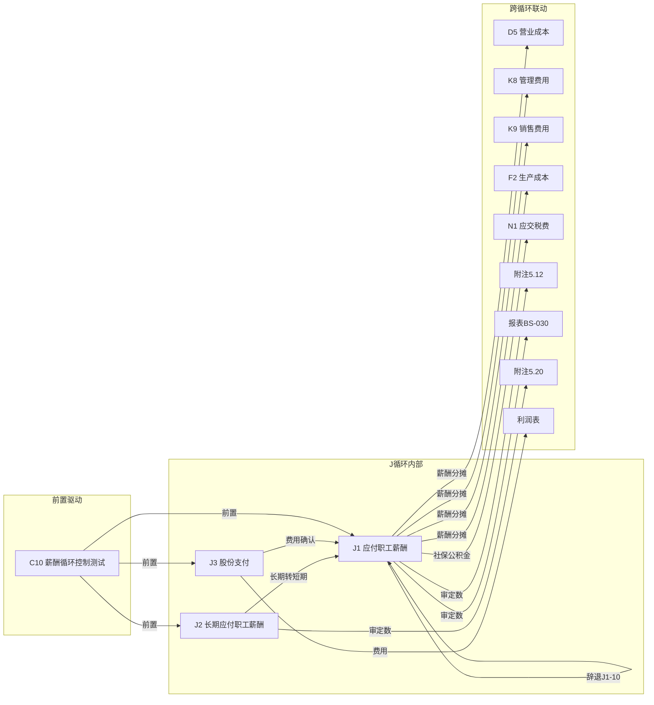

# J 职工薪酬循环底稿优化 — Design

> **Spec**: `workpaper-j-payroll-cycle`
> **版本**: v1.0
> **配套**: requirements.md v1.0
> **创建日期**: 2026-05-19

## 变更记录

| 版本 | 日期 | 摘要 |
|------|------|------|
| v1.0 | 2026-05-19 | 初版 — 5 个 ADR + 4 Correctness Properties |

---

## ADR 索引

| ADR | 标题 | 对应需求 | 决策摘要 |
|-----|------|---------|---------|
| ADR-J1 | 多文件合并 + 历史遗留过滤 | J-F1 | 复用现有过滤（"-删除"已覆盖）+ "原版"保留不过滤 |
| ADR-J2 | 三角勾稽 VR 规则设计 | J-F3 | 3 条 VR + consistency_gate 集成 |
| ADR-J3 | prefill 真实维度（Sprint 0.X 实测）| J-F6 | 4-arg AUX + 实测 aux_type |
| ADR-J4 | 薪酬计提引擎 | J-F7 | 纯算法 endpoint + apply_to_sheet |
| ADR-J5 | 股份支付 Black-Scholes | J-F8 | stub 实现 + 标准公式 |

---

## 数据流图



---

## ADR-J1: 多文件合并 + 历史遗留过滤

### 背景
J 循环 3 文件 38 sheet。含 5 个"-删除"历史遗留。另有 2 个"原版"sheet（J1A-原版 / L1A-原）是修改模板前的旧版本，保留不过滤。

### 决策
1. **后端合并**：复用 `_merge_sheets_dedup`（0 改动）
2. **历史遗留过滤**：
   - 5 个"-删除"sheet：现行 regex 已覆盖 `-删除$` 模式 ✅（含 `G\d+.*删除` 模式）
   - 2 个"原版"sheet（J1A-原版 / L1A-原）：**不过滤**，这是修改模板前的旧版本，保留供参考
   - 不需要扩展 `_should_skip_historical_sheet` regex
3. **跨文件去重**：底稿目录(2) + 附注披露上市(1) + 附注披露国企(1) = 4 个跨文件重复 → 去重保留首次

### 合并后预估
```
38 raw - 5 删除 - 4 跨文件去重(底稿目录×2 + 附注×2) = 29 有效 sheet
```

### 影响
- 不需要扩展 `_should_skip_historical_sheet` regex（0 代码改动）
- D/F/H/I/G 回归无影响

---

## ADR-J2: 三角勾稽 VR 规则设计

### 规则定义

```json
[
  {
    "rule_id": "VR-J1-01",
    "description": "应付职工薪酬期末余额勾稽",
    "formula": "J1_closing = J1_opening + J1_accrued(J1-6) - J1_paid(J1-7)",
    "severity": "blocking",
    "tolerance": 1.0,
    "trigger_condition": "J1-1 AND (J1-6 OR J1-7) saved"
  },
  {
    "rule_id": "VR-J1-02",
    "description": "薪酬费用率年度波动",
    "formula": "abs(current_rate - prev_rate) / prev_rate < 0.05",
    "severity": "warning",
    "tolerance": 0.05,
    "trigger_condition": "J1-4 saved AND PREV available"
  },
  {
    "rule_id": "VR-J1-03",
    "description": "薪酬分配合计勾稽",
    "formula": "J1_total_allocation = D5_payroll + K8_payroll + K9_payroll + F2_payroll",
    "severity": "blocking",
    "tolerance": 1.0,
    "trigger_condition": "J1-7 AND at least 1 target saved"
  }
]
```

### 校验时机
- VR-J1-03 涉及跨循环汇总 → 遵循"A 和至少 1 个 B 都已保存时才触发 blocking"铁律

---

## ADR-J3: prefill 真实维度

### Sprint 0.X 前置实测要求（实施前必做）
```sql
-- 实测 J 循环 aux 维度（应付职工薪酬 2211 + 资本公积 4001/4002）
SELECT DISTINCT aux_type, aux_code 
FROM tb_aux_balance 
WHERE account_code LIKE '221%' OR account_code LIKE '4001%' OR account_code LIKE '4002%'
LIMIT 100;
```

### 实测结果（Sprint 0 已完成 2026-05-19，aux 维度待 Sprint 0.X 实测）

```python
# openpyxl 实测真实 sheet 名（关键：末尾空格陷阱）
J1_audit_real_sheet_name = '审定表J1-1 '       # 末尾带空格
J1_2_real_sheet_name = '明细表J1-2 '            # 末尾带空格
J1_4_real_sheet_name = '月度分析表J1-4'         # 无空格
J1_6_real_sheet_name = '计提情况检查表J1-6'     # 无空格
J1_7_real_sheet_name = '分配情况检查表J1-7'     # 无空格
J2_2_real_sheet_name = '明细表J2-2'             # 无空格
J3_2_real_sheet_name = '股份支付检查表J3-2'     # 无空格

# 真实表头摘要（openpyxl 读 Row 1-10）
# J1-2 明细表 dims=待 Sprint 0.X 提取（J1 模板 23 sheet 含此 sheet）
# J1-4 月度分析表 dims=A1:P64，Row 9 起为审计过程，Row 10+ 为表格主体
# J1-6 计提情况检查表 dims=A1:K60，Row 10 起为审计程序文字 + 数据区
# J1-7 分配情况检查表 dims=A1:M51，Row 10 起为分配政策 + 数据区
# J2-2 明细表 dims=A1:N90
# J3-2 股份支付检查表 dims=A1:S43

# 现有 prefill 数据问题（J spec 复盘发现）
# 现有 J3 prefill account_codes=['2211']  ❌ 错位
# 应改为 ['4001', '4002']  ✅ 资本公积-股份支付 / 库存股
# Sprint 0.X 实测 SQL 同时覆盖 4001/4002

# 待实测维度（Sprint 0.X 跑 SQL 后填入）
aux_type_for_2211 = TBD  # 期望: '薪酬类别' 或 '员工类别'
aux_codes_sample_2211 = TBD  # 期望: 工资/奖金/津贴/社保/公积金/福利费/教育经费/工会经费
aux_type_for_2211_dept = TBD  # 期望: '部门' 或 '成本中心'（J1-7 分配维度）
aux_type_for_4001 = TBD  # 期望: '激励类型' 或 '员工类别'

# ========================================
# 降级方案（如 Sprint 0.X 实测无 aux 数据）
# ========================================
# 参照 H/I/G spec 模式：
# 全部改用 =TB(account_code, column) + =LEDGER 月度抽样
# 总目标从 ≥ 40 cells 降为 ≥ 25 cells
# UAT #8/#10/#11 门槛同步降级
#
# prefill 公式类型分布（含降级）：
#   =TB(account_code, column)             — 审定表 + 明细表科目余额
#   =LEDGER_DETAIL(account, sheet, ...)   — J1-6 计提按月抽样
#   =AUX('2211', aux_type, aux_code, col) — J1-2/J1-7 辅助账维度（待实测）
#   =PREV(sheet, cell)                    — 上年期末连续性
```

### prefill 分布设计

| sheet | 真实 sheet 名（含末尾空格）| 目标 cells | 公式类型 | 维度 |
|-------|------------------------|-----------|---------|------|
| J1-2 明细表 | `'明细表J1-2 '`（末尾空格）| ≥ 8 | =AUX(4-arg) | 薪酬类别 × 期初/期末/本期发生 |
| J1-4 月度分析 | `'月度分析表J1-4'` | ≥ 8 | =TB + =PREV + =LEDGER 月度 | 12 月度余额 + 上年同期 |
| J1-6 计提检查 | `'计提情况检查表J1-6'` | ≥ 10 | =LEDGER + =AUX | 按月计提 + 按薪酬类别 |
| J1-7 分配检查 | `'分配情况检查表J1-7'` | ≥ 8 | =AUX(4-arg) | 部门/成本中心维度 |
| J2-2 明细表 | `'明细表J2-2'` | ≥ 4 | =TB | 设定受益 + 设定提存 |
| J3-2 股份支付 | `'股份支付检查表J3-2'` | ≥ 4 | =TB | 资本公积-股份支付（4001/4002）|
| **合计** | | **≥ 42** | | 新增目标 ≥ 40（安全边际 +2）|

**降级方案**（如 Sprint 0.X 实测 tb_aux_balance 无 221% 数据）：
- J1-2/J1-7 改用 =TB 替代 =AUX → 各减 4 cell
- 总目标降为 ≥ 25 cells（J1-2(4) + J1-4(8) + J1-6(6) + J1-7(0) + J2-2(4) + J3-2(3) ≈ 25）
- UAT #7~#9 门槛同步降级

---

## ADR-J4: 薪酬计提引擎

### API 设计

```
POST /api/projects/{pid}/workpapers/{wid}/j1/payroll-calc
```

**Request Body**:
```json
{
  "employee_count": 100,
  "avg_monthly_salary": 15000,
  "social_insurance_rates": {
    "pension": 0.16,
    "medical": 0.095,
    "unemployment": 0.005,
    "work_injury": 0.004,
    "maternity": 0.008
  },
  "housing_fund_rate": 0.12,
  "supplementary_fund_rate": 0.0,
  "welfare_rate": 0.14,
  "education_rate": 0.025,
  "union_rate": 0.02,
  "months": 12,
  "apply_to_sheet": "计提情况检查表J1-6"
}
```

**Response**:
```json
{
  "monthly_breakdown": [
    {
      "month": 1,
      "salary": 1500000,
      "pension": 240000,
      "medical": 142500,
      "unemployment": 7500,
      "work_injury": 6000,
      "maternity": 12000,
      "housing_fund": 180000,
      "welfare": 210000,
      "education": 37500,
      "union": 30000,
      "total": 2365500
    }
  ],
  "annual_summary": {
    "total_salary": 18000000,
    "total_social_insurance": 4896000,
    "total_housing_fund": 2160000,
    "total_welfare": 2520000,
    "total_education": 450000,
    "total_union": 360000,
    "grand_total": 28386000
  },
  "applied_to_sheet": "计提情况检查表J1-6",
  "applied_at": "2026-05-19T10:00:00Z"
}
```

### 写回模式
- `parsed_data.payroll_calcs[sheet] = {method, applied_at, data}`
- 与 H-F11 折旧引擎 `depreciation_calcs` 对称

### RBAC
- `Depends(require_project_access("edit"))`

---

## ADR-J5: 股份支付 Black-Scholes

### 公式
```
d1 = [ln(S/K) + (r + σ²/2)T] / (σ√T)
d2 = d1 - σ√T
C = S·N(d1) - K·e^(-rT)·N(d2)
P = K·e^(-rT)·N(-d2) - S·N(-d1)
```

### API 设计
```
POST /api/projects/{pid}/workpapers/{wid}/j3/share-payment-calc
```

**Request Body**:
```json
{
  "stock_price": 20.0,
  "exercise_price": 18.0,
  "risk_free_rate": 0.03,
  "volatility": 0.35,
  "time_to_maturity": 3.0,
  "dividend_yield": 0.01,
  "grant_quantity": 1000000,
  "vesting_period": 4,
  "apply_to_sheet": "股份支付检查表J3-2"
}
```

**Response**:
```json
{
  "option_value": 5.82,
  "total_fair_value": 5820000,
  "annual_expense_schedule": [
    {"year": 1, "expense": 1455000, "cumulative": 1455000},
    {"year": 2, "expense": 1455000, "cumulative": 2910000},
    {"year": 3, "expense": 1455000, "cumulative": 4365000},
    {"year": 4, "expense": 1455000, "cumulative": 5820000}
  ],
  "is_llm_stub": true,
  "applied_to_sheet": "股份支付检查表J3-2"
}
```

### Stub 状态
- `is_llm_stub` 由 `settings.WP_AI_SERVICE_ENABLED` 驱动
- 公式计算正确，LLM 辅助参数建议待接入

---

## Correctness Properties

| ID | Property | 验证方式 |
|----|---------|---------|
| CP-J1 | VR-J1-01 三角勾稽：期末=期初+计提-实发，drift ∈ [-2,2] 时 passes ↔ |drift|<tolerance | PBT 200 examples + 9 boundary |
| CP-J2 | J 循环 8 类 sheet 分组完备性：任意 J sheet 恰好匹配 1 类 | PBT 200 examples |
| CP-J3 | cross_wp_ref ref_id 全局唯一 + 闭区间 CW-293~N | PBT 50 examples |
| CP-J4 | Black-Scholes 公式单调性：S↑ → C↑ / K↑ → C↓ / σ↑ → C↑ / T↑ → C↑ | PBT 200 examples |

---

## 错误处理

| 场景 | 处理 |
|------|------|
| tb_aux_balance 无 221% 数据 | prefill 降级为 =TB/=LEDGER，目标降为 ≥ 35 cells |
| VR-J1-03 跨循环目标未保存 | skip 不 blocking（汇总类规则时机铁律）|
| Black-Scholes 输入 σ=0 或 T=0 | 返回 400 + 明确错误信息 |
| payroll-calc 员工数=0 | 返回空 breakdown + warning |
| `_should_skip_historical_sheet` 不匹配"-原版" | 不需要处理 — "原版"是修改模板前旧版本，保留不过滤 |
