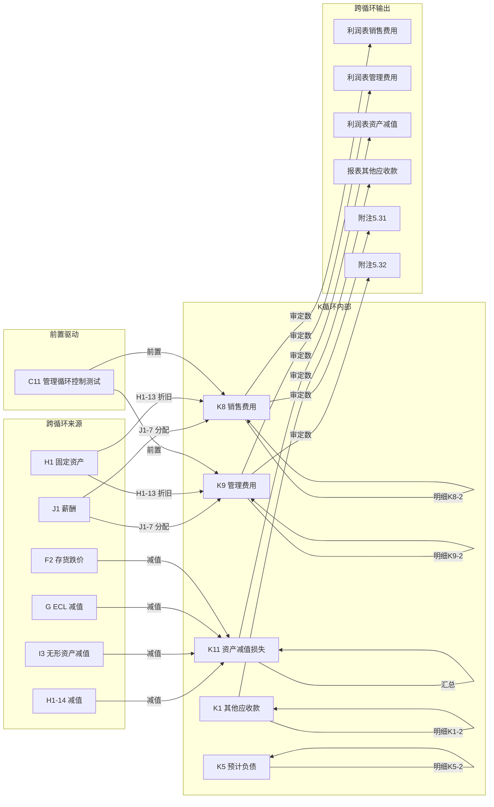

# K 管理循环底稿优化 — Design

> **Spec**: `workpaper-k-admin-cycle`
> **版本**: v1.0
> **配套**: requirements.md v1.0
> **创建日期**: 2026-05-19

## 变更记录

| 版本 | 日期 | 摘要 |
|------|------|------|
| v1.0 | 2026-05-19 | 初版 — 5 个 ADR + 4 Correctness Properties + 错误处理 |

---

## ADR 索引

| ADR | 标题 | 对应需求 | 决策摘要 |
|-----|------|---------|---------|
| ADR-K1 | 多文件合并（0 历史遗留）| K-F1 | 复用 `_merge_sheets_dedup` 0 改动；K 模板干净 0 命中 |
| ADR-K2 | 三角勾稽 VR 规则设计 | K-F3 | 3 条 VR + consistency_gate 集成 + 汇总类时机铁律 |
| ADR-K3 | prefill 真实维度（Sprint 0.X 实测后填入）| K-F6 | 4-arg AUX + openpyxl 实测真名 + aux_type/aux_code 实测 |
| ADR-K4 | 费用分析引擎 | K-F7 | 同比/环比/预算差异 3 维度 + apply_to_sheet 写回 |
| ADR-K5 | K11 资产减值损失汇总引擎 | K-F8 | 跨循环汇总 + stub 实现 |

---

## 数据流图



---

## ADR-K1: 多文件合并（0 历史遗留）

### 背景
K 循环 14 文件 152 sheet，实测 0 历史遗留（K 模板干净）。

### 决策
1. **后端合并**：直接复用 `_merge_sheets_dedup`（0 代码改动）
2. **历史遗留过滤**：0 命中，不需要扩展 `_should_skip_historical_sheet` regex
3. **跨文件去重**：43 个跨文件重复 → 去重保留首次（底稿目录×13 + 附注披露上市×12 + 附注披露国企×11 + GT_Custom×7）
4. **末尾空格**：0 个 sheet 有末尾空格，prefill sheet 字段正常写即可

### 实测结果（Sprint 0 完成 2026-05-19，task 1.1 实测复核）
```python
N_k_raw_sheets = 152
N_k_historical_sheets = 0   # K 模板干净
N_k_dedup_sheets = 109      # 152 - 0 - 43 = 109（task 1.1 实测复核 2026-05-19）
N_k_cross_file_dups = 43    # 底稿目录(14×) + 附注披露上市(13×) + 附注披露国企(12×) + GT_Custom(8×)
                            #              13 redundant +    12 redundant +    11 redundant +     7 redundant = 43
N_k_trailing_space = 0      # 无末尾空格
```

> **基线偏差注解（2026-05-19 task 1.1）**：requirements.md v1.0 起草时引用 N_k_dedup_sheets=114 / N_k_cross_file_dups=38，
> task 1.1 执行时 openpyxl 实测复核为 109 / 43。三件套基线已同步修正。

---

## ADR-K2: 三角勾稽 VR 规则设计

### 规则定义

```json
[
  {
    "rule_id": "VR-K8-01",
    "description": "K8 销售费用明细合计勾稽",
    "formula": "K8_total = sum(K8-2 明细各行)",
    "severity": "blocking",
    "tolerance": 1.0,
    "trigger_condition": "K8-1 AND K8-2 saved"
  },
  {
    "rule_id": "VR-K9-01",
    "description": "K9 管理费用明细合计勾稽",
    "formula": "K9_total = sum(K9-2 明细各行)",
    "severity": "blocking",
    "tolerance": 1.0,
    "trigger_condition": "K9-1 AND K9-2 saved"
  },
  {
    "rule_id": "VR-K11-01",
    "description": "K11 资产减值损失跨循环汇总",
    "formula": "K11_total = H1_impairment + I3_impairment + G_ecl + F2_impairment",
    "severity": "warning",
    "tolerance": 1.0,
    "trigger_condition": "K11-1 AND at least 1 source saved"
  }
]
```

### 校验时机
- **VR-K8-01 / VR-K9-01**：仅涉及 K 内部数据 → K8-1 + K8-2 同时保存才触发
- **VR-K11-01**：涉及跨循环汇总 → 遵循"A 和至少 1 个 B 都已保存时才触发 blocking"铁律（此处为 warning，更宽松）

---

## ADR-K3: prefill 真实维度（Sprint 0.X 实测后填入）

### Sprint 0.X 前置实测要求
```sql
-- 销售费用 6601
SELECT DISTINCT aux_type, aux_code FROM tb_aux_balance WHERE account_code LIKE '6601%' LIMIT 50;
-- 管理费用 6602
SELECT DISTINCT aux_type, aux_code FROM tb_aux_balance WHERE account_code LIKE '6602%' LIMIT 50;
-- 其他应收款 1221
SELECT DISTINCT aux_type, aux_code FROM tb_aux_balance WHERE account_code LIKE '1221%' LIMIT 50;
-- 其他应付款 2241
SELECT DISTINCT aux_type, aux_code FROM tb_aux_balance WHERE account_code LIKE '2241%' LIMIT 50;
```

### 实测结果（Sprint 0.X 完成 2026-05-19）
```python
# openpyxl 实测真实 sheet 名
K8_2_real_sheet_name = '明细表K8-2'          # 销售费用明细表（无末尾空格）
K9_2_real_sheet_name = '明细表K9-2'          # 管理费用明细表（无末尾空格）
K1_2_real_sheet_name = '明细表K1-2'          # 其他应收款明细表（无末尾空格）
K3_2_real_sheet_name = '明细表K3-2'          # 其他应付款明细表（无末尾空格）
K5_2_real_sheet_name = '明细表 K5-2'         # 预计负债明细表（K5 和 -2 之间有空格！）

# K8-2 销售费用明细表结构（Row 11 表头）
# A=项目 / B=1月 / C=2月 / ... / M=12月（按月度费用类别分项）
# Row 12+ 数据区：专设销售机构的职工薪酬 / 业务费 / 折旧费 / 保险费 / ...
K8_2_categories = ['专设销售机构的职工薪酬', '业务费', '折旧费', '保险费', '广告费', '运输费', '差旅费', '其他']

# K9-2 管理费用明细表结构（Row 10 表头）
# A=项目 / B=1月 / C=2月 / ... / M=12月
# Row 11+ 数据区：公司经费 / 职工工资 / 福利费 / 物料消耗 / 低值易耗品摊销 / ...
K9_2_categories = ['公司经费', '职工工资', '福利费', '物料消耗', '低值易耗品摊销', '折旧费', '办公费', '差旅费', '审计费', '咨询费', '其他']

# K1-2 其他应收款明细表结构（Row 10-11 表头）
# A=序号 / B=债务人名称 / C=公司代码 / D=关联方类型 / E=款项性质 / F=期初未审数 / G=期初账项调整 / H=期初重分类调整 / I=期初审定 / J=期初审定账龄(1年内/1-2年/2-3年/3年以上)

# K3-2 其他应付款明细表结构（Row 8-9 表头）
# A=债权人名称 / B=公司代码 / C=关联方类型 / D=款项性质 / E=期初未审数 / F=期初账项调整 / G=期初重分类调整 / H=期初审定 / I=期初审定账龄

# K5-2 预计负债明细表结构（Row 11 表头）
# A=项目类别 / B=预计负债计提原因 / C=未审数 / G=期初调整 / I=账项调整

# ========================================
# SQL 实测 tb_aux_balance（2026-05-19）
# ========================================
aux_type_for_6601 = '客户'           # ✅ 有数据（20+ distinct aux_code）
aux_codes_sample_6601 = ['00000190', '00000414', '00001087']  # 客户编号
aux_type_for_6602 = '区域2'          # ✅ 有数据（区域2 + 客户 两种 aux_type）
aux_codes_sample_6602 = ['21.01', '34.01', '50.0103']  # 区域编号
aux_type_for_1221 = '三方收款标识'    # ✅ 有数据（三方收款标识 + 代收代付类别）
aux_codes_sample_1221 = ['SKT211', 'YG01', 'YG02']
aux_type_for_2241 = '代收代付类别'    # ✅ 有数据（代收代付类别）
aux_codes_sample_2241 = ['A001', 'A011', 'A012']

# ========================================
# 结论：K 循环 4 个核心科目全部有 aux 数据！
# 不需要降级！目标保持 ≥ 40 cells（含 =AUX 4-arg）
# ========================================
# 但 aux_type 与预期不同：
#   6601 销售费用 aux_type='客户'（非预期的'费用类别'）→ 按客户维度分析销售费用
#   6602 管理费用 aux_type='区域2'+'客户'（非预期的'费用类别'）→ 按区域/客户维度
#   1221 其他应收款 aux_type='三方收款标识'+'代收代付类别'（非预期的'往来对象'）
#   2241 其他应付款 aux_type='代收代付类别'（非预期的'往来对象'）
#
# prefill 设计调整：
#   K8-2/K9-2 费用明细表按月度分项（模板结构），不用 =AUX（因为 aux_type='客户'与费用类别维度不匹配）
#   → 改用 =LEDGER_DETAIL 按月度抽样 + =TB 科目余额
#   K1-2/K3-2 往来款明细表可用 =AUX（aux_type='三方收款标识'/'代收代付类别' 可作为往来分类维度）
```

### prefill 分布设计（基于实测调整）

| sheet | 真实 sheet 名 | 目标 cells | 公式类型 | 维度 |
|-------|-------------|-----------|---------|------|
| K8-2 销售费用明细 | `'明细表K8-2'` | ≥ 10 | =LEDGER_DETAIL + =TB | 按月度费用分项（Row 11 表头 1~12 月）|
| K9-2 管理费用明细 | `'明细表K9-2'` | ≥ 10 | =LEDGER_DETAIL + =TB | 按月度费用分项（Row 10 表头 1~12 月）|
| K1-2 其他应收款明细 | `'明细表K1-2'` | ≥ 6 | =AUX('1221','三方收款标识',code,col) | 按三方收款标识/代收代付类别 |
| K3-2 其他应付款明细 | `'明细表K3-2'` | ≥ 6 | =AUX('2241','代收代付类别',code,col) | 按代收代付类别 |
| K5-2 预计负债明细 | `'明细表 K5-2'`（**K5 和 -2 之间有空格**）| ≥ 4 | =TB | 按预计负债类型 |
| K8-3 分析程序（扩展）| `'实质性分析K8-4'` | ≥ 4 | =PREV + =TB | 上年审定 + 本年未审 |
| **合计** | | **≥ 40** | | |

**关键调整**（基于 aux 实测）：
- K8-2/K9-2 **不用 =AUX**：aux_type='客户'/'区域2' 与费用类别维度不匹配（模板按费用类别分项，不按客户分项）→ 改用 =LEDGER_DETAIL 按月度抽样
- K1-2/K3-2 **可用 =AUX**：aux_type='三方收款标识'/'代收代付类别' 可作为往来分类维度
- K5-2 sheet 名含空格（`明细表 K5-2`），prefill sheet 字段必须含空格

---

## ADR-K4: 费用分析引擎

### API 设计

```
POST /api/projects/{pid}/workpapers/{wid}/k8/expense-analysis
```

**Request Body**:
```python
class ExpenseAnalysisRequest(BaseModel):
    wp_code: str  # 'K8' or 'K9'
    current_year: dict[str, Decimal]   # {费用类别: 金额}
    prior_year: dict[str, Decimal]     # {费用类别: 金额}
    budget: dict[str, Decimal] | None  # {费用类别: 预算金额}
    industry_avg_rates: dict[str, Decimal] | None  # {费用类别: 行业均值比率}
    apply_to_sheet: str | None = None
```

**Response**:
```python
class ExpenseAnalysisResponse(BaseModel):
    yoy_changes: dict[str, dict]   # {类别: {amount_change, rate_change, flag}}
    budget_variances: dict[str, dict] | None
    industry_comparison: dict[str, dict] | None
    anomaly_flags: list[str]       # 异常项描述
    is_llm_stub: bool
    applied_to_sheet: str | None
```

### 写回模式
- `parsed_data.expense_analysis[sheet] = {wp_code, applied_at, data}`

---

## ADR-K5: K11 资产减值损失汇总引擎

### API 设计

```
POST /api/projects/{pid}/workpapers/{wid}/k11/impairment-summary
```

**Request Body**:
```python
class ImpairmentSummaryRequest(BaseModel):
    project_id: int
    year: int
    apply_to_sheet: str | None = None
```

**Response**:
```python
class ImpairmentSummaryResponse(BaseModel):
    impairment_by_type: dict[str, Decimal]  # {资产类型: 减值金额}
    total_impairment: Decimal
    sources_found: list[str]   # 已找到数据的来源底稿
    sources_missing: list[str] # 未找到数据的来源底稿
    is_llm_stub: bool
    applied_to_sheet: str | None
```

### 数据来源
- H1-14 固定资产减值 → `parsed_data.impairment_calcs['减值测算表H1-14']`
- I3 无形资产减值 → `parsed_data.impairment_calcs['减值测算表I3-X']`
- G ECL 减值 → `parsed_data.ecl_calcs[sheet]`
- F2 存货跌价 → `parsed_data.impairment_calcs['存货跌价准备F2-47']`

---

## Correctness Properties（4 个）

| # | Property | 验证方式 |
|---|---------|---------|
| CP-1 | Sheet 名归一化幂等性 | PBT-P1 hypothesis 100 examples |
| CP-2 | VR-K8-01 费用勾稽正确性（drift ∈ [-2,2]，passes ↔ |drift|<tolerance）| PBT-P2 200 + 9 boundary |
| CP-3 | K 循环 10 类 sheet 分组完备性（任意 K sheet 恰好匹配 1 类）| PBT-P3 200 examples |
| CP-4 | cross_wp_ref ref_id 全局唯一 + 闭区间 | PBT-P4 50 examples |

---

## 错误处理

| 场景 | 处理 |
|------|------|
| tb_aux_balance 无 6601%/6602% 数据 | prefill 降级为 =TB/=LEDGER，目标降为 ≥ 25 cells |
| VR-K11-01 跨循环来源全部未保存 | skip 不 blocking（汇总类规则时机铁律）|
| 费用分析引擎 current_year 为空 | 返回 400 + "当年费用数据不能为空" |
| K11 汇总引擎来源底稿未找到 | sources_missing 列表记录 + 不阻断（返回已找到的部分）|
| `_ensure_ipo_loaded('K8')` codes=[] | 直接返回 empty result，不抛异常 |
