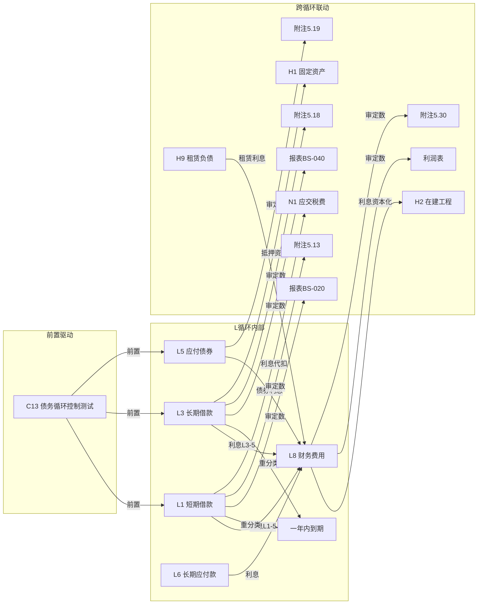

# L 筹资循环底稿优化 — Design

> **Spec**: `workpaper-l-debt-cycle`
> **版本**: v1.0
> **配套**: requirements.md v1.0
> **创建日期**: 2026-05-19

## 变更记录

| 版本 | 日期 | 摘要 |
|------|------|------|
| v1.0 | 2026-05-19 | 初版 — 5 个 ADR + 5 Correctness Properties + 错误处理 |

---

## ADR 索引

| ADR | 标题 | 对应需求 | 决策摘要 |
|-----|------|---------|---------|
| ADR-L1 | 多文件合并 + 历史遗留过滤 | L-F1 | 复用 `_merge_sheets_dedup` 0 改动；Sprint 0 实测确认过滤数 |
| ADR-L2 | 三角勾稽 VR 规则设计 | L-F3 | 3 条 VR + consistency_gate 集成 + 汇总类时机铁律 |
| ADR-L3 | prefill 真实维度（Sprint 0.X 实测后填入）| L-F6 | 4-arg AUX + openpyxl 实测真名 + aux_type/aux_code 实测 |
| ADR-L4 | 利息自动测算引擎 | L-F7 | 3 种计息基准 × 3 种复利频率 + apply_to_sheet 写回 |
| ADR-L5 | 应付债券摊余成本引擎 | L-F8 | 实际利率法 + stub 实现 + 收敛性验证 |

---

## 数据流图（L 循环跨底稿 + 跨循环联动）



**关键路径说明**：
- **L8 汇总枢纽**：L8 利息支出 = L1 利息 + L3 利息 + H9 租赁利息 + L5 债券利息（VR-L8-01 校验）
- **重分类联动**：L3 长期借款到期日 ≤ 1 年 → 重分类到"一年内到期的非流动负债"（VR-L3-01 校验）
- **利息资本化**：L8 利息中符合资本化条件的部分 → H2 在建工程（cross_wp_ref 路径）
- **H9→L8 已有**：CW-14 已建立 H9 租赁利息→L8 路径（H spec 已实现）

---

## ADR-L1: 多文件合并 + 历史遗留过滤

### 背景
L 循环 9 文件（L0~L8），raw sheet 数待 Sprint 0 openpyxl 实测。预期模板较新（2025 修订），历史遗留可能为 0。

### 决策
1. **后端合并**：直接复用 `_merge_sheets_dedup`（D/F spec 已实现），0 代码改动
2. **历史遗留过滤**：Sprint 0 实测确认命中数（预期 0 或极少）
3. **跨文件去重**：底稿目录 / GT_Custom / 附注披露通用样式 按归一化名称去重保留首次出现

### 实测结果（Sprint 0 完成 2026-05-19）
```python
N_l_raw_sheets = 100
N_l_historical_sheets = 1  # '函证差异检查表（示例）' in L0（"（示例）"模式命中）
N_l_dedup_sheets = 79      # 100 - 1 - 20 = 79
N_l_cross_file_dups = 20   # 底稿目录(9×→8)/GT_Custom(4×→3)/附注披露信息核对(上市)(3×→2)/
                           # 附注披露信息(上市)(3×→2)/附注披露信息(国企)(3×→2)/
                           # 附注披露信息核对(国企)(2×→1)/附注披露(国企)信息(2×→1)/
                           # 附注披露(上市)信息(2×→1) = 20
N_l_trailing_space = 1     # '应付债券实质性程序表L4A '（L4 文件末尾空格）

# L 循环模板"干净"：仅 1 个"（示例）"历史遗留（L0 函证差异检查表）
# 无"-删除"/ 无"修订前"/ 无"（原）"/ 无 G+数字+删除移至
# 不需要扩展 _should_skip_historical_sheet regex
```

### 影响
- 不影响 D/F/H/I/G/J 循环
- 不需要扩展 `_should_skip_historical_sheet` regex（预期 0 改动）

---

## ADR-L2: 三角勾稽 VR 规则设计

### 规则定义

```json
[
  {
    "rule_id": "VR-L8-01",
    "description": "L8 财务费用利息支出勾稽",
    "formula": "L8_interest = L1_interest(L1-5) + L3_interest(L3-5) + H9_lease_interest + L5_bond_interest",
    "severity": "blocking",
    "tolerance": 1.0,
    "trigger_condition": "L8-1 AND at least 1 source saved"
  },
  {
    "rule_id": "VR-L1-01",
    "description": "短期借款期末余额勾稽",
    "formula": "L1_closing = L1_opening + L1_new_borrowings - L1_repayments",
    "severity": "blocking",
    "tolerance": 1.0,
    "trigger_condition": "L1-1 saved"
  },
  {
    "rule_id": "VR-L3-01",
    "description": "长期借款期末 + 重分类勾稽",
    "formula": "L3_closing + reclassified_current = L3_opening + L3_new - L3_repaid",
    "severity": "warning",
    "tolerance": 1.0,
    "trigger_condition": "L3-1 saved"
  }
]
```

### 校验时机
- **VR-L8-01**：涉及跨底稿汇总（L1-5 + L3-5 + H9 + L5）→ 遵循"A 和至少 1 个 B 都已保存时才触发 blocking"铁律
- **VR-L1-01**：仅涉及 L1 内部数据 → L1-1 保存即触发
- **VR-L3-01**：仅涉及 L3 内部数据 → L3-1 保存即触发（warning 不阻断）

### 不变量（PBT 验证）
```python
# VR-L8-01: 财务费用利息勾稽
def vr_l8_01(l8_interest, l1_interest, l3_interest, h9_interest, l5_interest):
    expected = l1_interest + l3_interest + h9_interest + l5_interest
    return abs(l8_interest - expected) < Decimal("1.0")

# VR-L1-01: 短期借款期末余额
def vr_l1_01(opening, new_borrowings, repayments, closing):
    expected = opening + new_borrowings - repayments
    return abs(closing - expected) < Decimal("1.0")

# VR-L3-01: 长期借款 + 重分类
def vr_l3_01(opening, new_borrowings, repayments, closing, reclassified):
    expected = opening + new_borrowings - repayments
    return abs((closing + reclassified) - expected) < Decimal("1.0")
```

---

## ADR-L3: prefill 真实维度（Sprint 0.X 实测后填入）

### Sprint 0.X 前置实测要求（实施前必做）
```sql
-- 实测 L 循环 aux 维度
-- 短期借款 2001
SELECT DISTINCT aux_type, aux_code FROM tb_aux_balance WHERE account_code LIKE '200%' LIMIT 50;
-- 长期借款 2501
SELECT DISTINCT aux_type, aux_code FROM tb_aux_balance WHERE account_code LIKE '250%' LIMIT 50;
-- 应付债券 2502
SELECT DISTINCT aux_type, aux_code FROM tb_aux_balance WHERE account_code LIKE '2502%' LIMIT 50;
-- 长期应付款 2701
SELECT DISTINCT aux_type, aux_code FROM tb_aux_balance WHERE account_code LIKE '270%' LIMIT 50;
-- 财务费用 6603
SELECT DISTINCT aux_type, aux_code FROM tb_aux_balance WHERE account_code LIKE '6603%' LIMIT 50;
```

### 实测结果（Sprint 0.X task 0x.1 完成 2026-05-20）
```python
# openpyxl 实测真实 sheet 名（Sprint 0.X task 0x.2 完成 2026-05-20）
L1_2_real_sheet_name = '明细表L1-2'       # 短期借款明细表（无末尾空格）
L1_5_real_sheet_name = '利息测算表L1-5'   # 短期借款利息测算表（无末尾空格）
L3_2_real_sheet_name = '明细表L3-2'       # 长期借款明细表（无末尾空格）
L3_5_real_sheet_name = '利息测算表L3-5'   # 长期借款利息测算表（无末尾空格）
L5_2_real_sheet_name = '明细表L5-2'       # 长期应付款明细表（无末尾空格）— 注意在 L5 文件中
L6_2_real_sheet_name = '明细表L6-2'       # 专项应付款明细表（无末尾空格）
L8_2_real_sheet_name = '明细表L8-2'       # 财务费用明细表（无末尾空格）

# ========================================
# 表头结构实测（Sprint 0.X task 0x.2 输出 2026-05-20）
# ========================================
# L1-2 短期借款明细表（表头 Row 8-9）：
#   序号 | 借款种类 | 贷款单位 | 起始日期 | 讫止日期 | 年利率 | 固定/浮动利率
#   未审数: 期初余额 | 本期增加 | 本期减少 | 期末余额
#   期初调整: 账项调整 | 重分类调整
#   账项调整: 本期增加 | 本期减少
#   → 维度确认：贷款单位（=借款银行）/ 年利率 / 起止日期
#
# L1-5 利息测算表（表头 Row 10）：
#   序号 | 借款种类 | 贷款单位 | 借款起始日期 | 借款讫止日期 | 结息日
#   起算时点 | 截止时点 | 年利率 | 借款本金 | 本期实计利息①
#   本期应计息天数 | 本期应计利息 | 差异 | 财务费用-利息支出②
#   → 维度确认：本金/利率/天数列结构完整
#
# L3-2 长期借款明细表（表头 Row 8-9）：
#   与 L1-2 结构完全一致（序号/借款种类/贷款单位/起始日期/讫止日期/年利率/固定浮动）
#   → 维度确认：期限由起始日期+讫止日期推算（无独立"期限"列）
#
# L5-2 长期应付款明细表（表头 Row 8-9）：
#   债权人名称 | 未审数(期初余额/借方发生/贷方发生/期末余额)
#   期初调整(账项调整/重分类调整) | 账项调整(借方发生/贷方发生)
#   重分类调整(借方发生/贷方发生) | 审定数(期初余额/借方发生/贷方发生/期末余额)
#   → 维度确认：按债权人名称分行，无币种列
#
# L6-2 专项应付款明细表（表头 Row 8-9）：
#   序号 | 项目 | 未审数(期初余额/本期拨入/本期结转/本期返还/期末余额)
#   期初调整(账项调整/重分类调整) | 账项调整(本期拨入/本期结转/本期返还)
#   重分类调整(本期拨入/本期结转/本期返还)
#   → 维度确认：按项目分行（拨入/结转/返还三向流动）
#
# L8-2 财务费用明细表（表头 Row 8）：
#   项目 | 1月~12月 | 本期未审合计 | 账项调整
#   数据行: 利息费用总额 / 减：利息资本化 / 利息费用 / 减：利息收入
#           利息净支出 / 未确认融资费用 / 减：未实现融资收益
#   → 维度确认：利息/汇兑/手续费按"项目"行区分（月度 12 列结构）
#   → 注意：无独立"汇兑损益"/"手续费"列，而是按行分项

# ========================================
# SQL 实测 tb_aux_balance（Sprint 0.X task 0x.1 输出 2026-05-20）
# ========================================
aux_type_for_2001 = {'借款性质', '金融机构'}  # 37 distinct (aux_type, aux_code)
# '借款性质' 3 codes: '1'/'3'/'4'
# '金融机构' 34 codes: 'YG0001'~'YG9904'
aux_codes_sample_2001 = ['1', '3', '4', 'YG0001', 'YG0002']

aux_type_for_2501 = None  # 无数据（0 行）— 长期借款 250% 无辅助账
aux_codes_sample_2501 = []

aux_type_for_6603 = {'客户'}  # 50+ distinct (aux_type, aux_code)
# aux_type='客户'，codes 为客户编号（如 '00000260'/'01030016' 等）
aux_codes_sample_6603 = ['00000260', '00000414', '00000712', '00002023', '01030016']

# 补充实测
aux_type_for_2502 = None  # 无数据（0 行）— 应付债券 2502% 无辅助账
aux_type_for_2701 = {'成本中心', '客户', '项目名称'}  # 32 distinct
# '成本中心' 28 codes / '客户' 1 code / '项目名称' 1 code

# ========================================
# 决策：不降级 — 保留 =AUX 4-arg prefill 目标 ≥ 40 cells
# ========================================
# 理由：200%（短期借款）有 37 行 aux 数据（'借款性质'+'金融机构'）
#       6603%（财务费用）有 50+ 行 aux 数据（'客户'）
#       270%（长期应付款）有 32 行 aux 数据（'成本中心'+'客户'+'项目名称'）
# 仅 250%（长期借款）和 2502%（应付债券）无辅助账数据
#
# prefill 策略调整：
#   L1-2 短期借款明细：=AUX('2001', '金融机构', aux_code, col) — 有数据，保留 4-arg
#   L3-2 长期借款明细：=TB('2501', col) — 无 aux 数据，降级为 =TB
#   L5-2 应付债券明细：=TB('2502', col) — 无 aux 数据，降级为 =TB
#   L6-2 长期应付款明细：=AUX('2701', '成本中心', aux_code, col) — 有数据，保留 4-arg
#   L8-2 财务费用明细：=AUX('6603', '客户', aux_code, col) — 有数据，保留 4-arg
#   L1-5/L3-5 利息测算：=LEDGER_DETAIL + =TB — 按月抽样
#
# 总目标维持 ≥ 40 cells（不降级）
```

### prefill 分布设计（Sprint 0.X 实测后修正）

| sheet | 目标 cells | 公式类型 | 维度 | 实测依据 |
|-------|-----------|---------|------|---------|
| L1-2 短期借款明细 | ≥ 8 | =AUX(4-arg) | '金融机构' × 期初/期末/本期发生 | 200% 有 37 行（'借款性质'+'金融机构'）|
| L1-5 利息测算 | ≥ 6 | =LEDGER + =TB | 按月利息 + 本金余额 | 无 aux 依赖 |
| L3-2 长期借款明细 | ≥ 8 | =TB（降级） | 科目余额 × 期初/期末 | **250% 无 aux 数据** → 降级为 =TB |
| L3-5 利息测算 | ≥ 6 | =LEDGER + =TB | 按月利息 | 无 aux 依赖 |
| L5-2 应付债券明细 | ≥ 4 | =TB | 面值/利息调整/摊余成本 | **2502% 无 aux 数据** |
| L6-2 长期应付款明细 | ≥ 4 | =AUX(4-arg) | '成本中心' × 期初/期末 | 270% 有 32 行（'成本中心'+'客户'+'项目名称'）|
| L8-2 财务费用明细 | ≥ 4 | =AUX(4-arg) | '客户' × 期初/期末/本期发生 | 6603% 有 50+ 行（'客户'）|
| **合计** | **≥ 40** | | | **不降级** |

---

## ADR-L4: 利息自动测算引擎

### API 设计

```
POST /api/projects/{pid}/workpapers/{wid}/l/interest-calc
```

**Request Body**:
```python
class InterestCalcRequest(BaseModel):
    wp_code: Literal['L1', 'L3']    # 区分短期/长期借款写回目标
    principal: Decimal              # 本金
    annual_rate: Decimal            # 年利率（如 0.045 = 4.5%）
    start_date: date               # 起息日
    end_date: date                 # 到期日
    day_count_basis: Literal['ACT/360', 'ACT/365', '30/360']  # 计息基准
    compound_frequency: Literal['simple', 'monthly', 'quarterly']  # 复利频率
    # 写回
    apply_to_sheet: str | None = None
```

**Response**:
```python
class InterestCalcResponse(BaseModel):
    interest_amount: Decimal        # 利息总额
    daily_interest: Decimal         # 日利息（简单利息时）
    period_days: int                # 计息天数
    day_count_divisor: int          # 计息基准分母（360/365）
    calculation_detail: str         # 计算过程描述
    compound_periods: int | None    # 复利期数（复利时）
    applied_to_sheet: str | None
```

### 3 种计息基准公式

**A. ACT/360（实际天数/360）**
```
interest = principal × annual_rate × actual_days / 360
```

**B. ACT/365（实际天数/365）**
```
interest = principal × annual_rate × actual_days / 365
```

**C. 30/360（每月 30 天/360）**
```
months = (end_year - start_year) × 12 + (end_month - start_month) + (end_day - start_day) / 30
interest = principal × annual_rate × months / 12
```

### 3 种复利频率

**simple（单利）**：直接用上述公式

**monthly（月复利）**：
```
n = total_months
monthly_rate = annual_rate / 12
compound_interest = principal × (1 + monthly_rate)^n - principal
```

**quarterly（季复利）**：
```
n = total_quarters
quarterly_rate = annual_rate / 4
compound_interest = principal × (1 + quarterly_rate)^n - principal
```

### RBAC + 写回
- `Depends(require_project_access("edit"))`
- `apply_to_sheet` 非空时写入 `working_paper.parsed_data.interest_calcs[sheet]`

---

## ADR-L5: 应付债券摊余成本引擎

### API 设计

```
POST /api/projects/{pid}/workpapers/{wid}/l5/bond-amortization
```

**Request Body**:
```python
class BondAmortizationRequest(BaseModel):
    face_value: Decimal             # 面值
    issue_price: Decimal            # 发行价格（溢价/折价）
    coupon_rate: Decimal            # 票面利率
    effective_rate: Decimal         # 实际利率
    term_years: int                 # 期限（年）
    payment_frequency: Literal['annual', 'semi_annual', 'quarterly']  # 付息频率
    # 写回
    apply_to_sheet: str | None = None
```

**Response**:
```python
class BondAmortizationResponse(BaseModel):
    amortization_schedule: list[dict]  # [{period, opening_carrying, interest_expense, coupon_payment, amortization, closing_carrying}]
    total_interest_expense: Decimal
    total_coupon_payments: Decimal
    total_amortization: Decimal
    final_carrying_amount: Decimal  # 应收敛到 face_value
    is_llm_stub: bool
    applied_to_sheet: str | None
```

### 实际利率法公式
```
每期利息费用 = 期初摊余成本 × 实际利率 / 付息频率
每期票面利息 = 面值 × 票面利率 / 付息频率
每期摊销额 = 利息费用 - 票面利息（折价时为正，溢价时为负）
期末摊余成本 = 期初摊余成本 + 摊销额
```

### 收敛性约束
- 最终期末摊余成本应收敛到面值：`abs(final_carrying - face_value) < 0.01`
- 如果不收敛（浮点累积误差），最后一期做尾差调整

### Stub 状态
- `is_llm_stub` 由 `settings.WP_AI_SERVICE_ENABLED` 驱动
- 公式计算正确，LLM 辅助参数建议待接入

---

## ADR-L3b: L 循环 10 类 sheet 分组正则（L-F2 实施参照）

### 10 类分组规则（按优先级匹配顺序）

```typescript
const L_SHEET_GROUP_RULES: SheetGroupRule[] = [
  // 1. 索引类（defaultHidden=true）
  { id: 'index', label: '索引', priority: 0, defaultHidden: true,
    match: (s) => /^底稿目录$|^GT_Custom$|^修订说明$/.test(s) },

  // 2. 历史遗留类（defaultHidden=true）
  { id: 'historical', label: '历史遗留', priority: 1, defaultHidden: true,
    match: (s) => _should_skip_historical_sheet(s) },

  // 3. 总控台（程序表 xxA）
  { id: 'procedure', label: '总控台', priority: 2,
    match: (s) => /[A-Z]\d*A$/.test(s) || /实质性程序表/.test(s) },

  // 4. 审定表
  { id: 'audit_table', label: '审定表', priority: 3,
    match: (s) => /审定表/.test(s) },

  // 5. 明细表
  { id: 'detail', label: '明细表', priority: 4,
    match: (s) => /明细表/.test(s) },

  // 6. 分析程序
  { id: 'analysis', label: '分析程序', priority: 5,
    match: (s) => /分析程序/.test(s) },

  // 7. 利息测算
  { id: 'interest_calc', label: '利息测算', priority: 6,
    match: (s) => /利息测算|利息计算|利率测算/.test(s) },

  // 8. 逾期/检查表
  { id: 'check_table', label: '检查表', priority: 7,
    match: (s) => /逾期|检查表|核查表|摊余成本/.test(s) },

  // 9. 附注披露 + 调整分录（readonly=true for 附注）
  { id: 'disclosure_adj', label: '附注+调整', priority: 8,
    match: (s) => /附注披露|调整分录/.test(s) },

  // 10. 其他程序（fallback）
  { id: 'other', label: '其他程序', priority: 9,
    match: () => true },
]
```

### 匹配顺序说明
- 按 priority 升序匹配，首个命中即停止（保证恰好 1 类）
- "其他程序"是 fallback 兜底（priority=9），确保 PBT-P3 恒成立
- 实际分组数 = 10（含 fallback）

---

## Correctness Properties（5 个）

| # | Property | 形式化描述 | 验证方式 |
|---|---------|-----------|---------|
| CP-1 | Sheet 名归一化幂等性 | ∀ name: normalize(normalize(name)) == normalize(name) | PBT-P1 hypothesis |
| CP-2 | VR-L8-01 利息勾稽正确性 | ∀ (l1_int, l3_int, h9_int, l5_int, l8_int): \|l8_int − (l1+l3+h9+l5)\| < 1.0 ⟺ pass | PBT-P2 + 9 boundary |
| CP-3 | L 循环 10 类 sheet 分组完备性 | ∀ sheet ∈ L_sheets: ∃! group ∈ 10_groups: matches(sheet, group) | PBT-P3 |
| CP-4 | cross_wp_ref ref_id 全局唯一 | ∀ i,j: refs[i].ref_id ≠ refs[j].ref_id (i≠j) | PBT-P4 |
| CP-5 | 利息计算单调性 | ∀ p1>p2: interest(p1,r,d) > interest(p2,r,d)；∀ r1>r2: interest(p,r1,d) > interest(p,r2,d) | PBT-P5（optional）|

### CP-2 详细不变量

```python
# VR-L8-01: 财务费用利息勾稽
def vr_l8_01(l8_interest, l1_interest, l3_interest, h9_interest, l5_interest):
    expected = l1_interest + l3_interest + h9_interest + l5_interest
    return abs(l8_interest - expected) < Decimal("1.0")

# VR-L1-01: 短期借款期末余额
def vr_l1_01(opening, new_borrowings, repayments, closing):
    expected = opening + new_borrowings - repayments
    return abs(closing - expected) < Decimal("1.0")

# VR-L3-01: 长期借款 + 重分类
def vr_l3_01(opening, new_borrowings, repayments, closing, reclassified):
    expected = opening + new_borrowings - repayments
    return abs((closing + reclassified) - expected) < Decimal("1.0")
```

### CP-5 详细不变量（利息单调性）

```python
# 单调性：本金↑ → 利息↑（其他参数固定）
def interest_monotone_principal(p1, p2, rate, days, basis):
    if p1 > p2:
        assert calc_interest(p1, rate, days, basis) > calc_interest(p2, rate, days, basis)

# 单调性：利率↑ → 利息↑
def interest_monotone_rate(principal, r1, r2, days, basis):
    if r1 > r2:
        assert calc_interest(principal, r1, days, basis) > calc_interest(principal, r2, days, basis)

# 单调性：天数↑ → 利息↑
def interest_monotone_days(principal, rate, d1, d2, basis):
    if d1 > d2:
        assert calc_interest(principal, rate, d1, basis) > calc_interest(principal, rate, d2, basis)
```

---

## 错误处理

| 场景 | 处理策略 | 用户可见行为 |
|------|---------|------------|
| 利息引擎 principal=0 或 rate=0 | 返回 interest_amount=0（合法：零本金/零利率）| 正常显示 0 |
| 利息引擎 start_date > end_date | 返回 HTTP 400 + "起息日不能晚于到期日" | 前端 toast |
| 利息引擎 rate > 1.0（年利率 > 100%）| 返回 HTTP 400 + "利率超出合理范围" | 前端 toast |
| 债券摊余成本 face_value=0 | 返回 HTTP 400 + "面值不能为零" | 前端 toast |
| 债券摊余成本 effective_rate=0 | 返回 HTTP 400 + "实际利率不能为零" | 前端 toast |
| 债券摊余成本最终不收敛（浮点误差 > 0.01）| 最后一期做尾差调整 + warning 日志 | 不影响用户（静默保护）|
| VR-L8-01 跨底稿目标全部未保存 | skip 不 blocking（汇总类规则时机铁律）| 不阻断签字 |
| VR-L1-01 parsed_data 缺字段 | 规则 skip（passed=true, details="数据不完整"）| 不阻断签字 |
| prefill 4-arg AUX 在 tb_aux_balance 无匹配行 | COALESCE(SUM, 0) 返回 0 | 单元格显示 0 |
| `_ensure_ipo_loaded('L1')` codes=[] 时调用 | 直接返回 empty result，不抛异常 | 无用户可见行为 |
| L4 租赁负债审定表与 H9 数据不一致 | cross_wp_ref stale 标记 + warning | 前端显示 stale 提示 |

---

> **本 design.md 配套**：requirements.md v1.0 + tasks.md v1.0
> **下一步**：Sprint 0 openpyxl 实测 → 填入 ADR-L1/L3 TBD 段落 → 启动 Sprint 1
