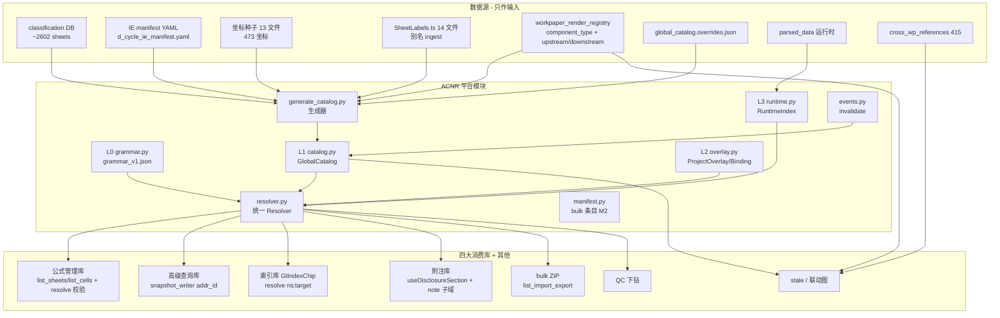

# Design Document

## Overview

ACNR（Address Coordinate & Naming Registry，地址坐标名称注册中心）是审计平台的**平台级单一真源（Single Source of Truth）**，统一底稿/报表/附注/试算表/辅助余额的**名称、坐标、URI、跳转、依赖锚点**。本设计不重新推导架构，而是把落地蓝图 `docs/proposals/address-coordinate-name-registry-architecture.md`（v1.10）蒸馏为可实现的 design，满足 requirements.md 的 24 条需求（R1–R24，可追溯至 G1–G13 / MVD-1..8）。凡引用蓝图处均标注其章节号。

### 问题背景：四套并行寻址体系

平台现状（蓝图 §一 / §1.8 codegraph 实证）存在**至少四套并行寻址语法**，互不解析：

| 体系 | 语法样例 | 数据源 | 消费者 |
|------|----------|--------|--------|
| 五域 URI + `WP()` 公式 | `WP('D2','明细表D2-2','期末')` / `wp://D2/明细表D2-2#E100` | `wp_account_mapping` + fine_rules + parsed_data | 公式管理库 |
| V1 运行时目录 | `address_registry.py` `/api/address-registry` | 动态 DB build | 选址、校验、跳转 |
| V2 静态语义图 | `address_registry_v2.py` l2/l3 JSON | ~24 万锚点离线展开 | stale 影响 BFS |
| 索引命名空间（第 4 套） | `TB:1001` / `cell:D2-2!E100`（11 ns + Layer 1-4） | `workpaper_render_registry` | `GtIndexChip` 跳转 |

同一物理格在四套体系里有四种「身份」且没有任何代码能互相转换（蓝图 §17.1）。坐标种子（473 个）仅服务测试、运行时未接入；`WP()`/`PREV()` 2 参与 3 参分裂；`[A-I]\d` 与 `[A-S]\d` 标准码判定已跨文件裂开；前端 30+ 份披露 composable 逐字节重复。

### 核心命题

**四大消费库（公式管理库 / 高级查询库 / 索引库 / 附注库）共用一个 `resolve()`，四套并行寻址语法收敛为一张映射表，一格一 `addr_id`**（蓝图 §17.2；R5、R11、R14–R16）。

```
                    ┌───────────────────────────┐
                    │   ACNR.resolve(任意输入)    │
                    │   → canonical addr_id       │
                    └─────────────┬─────────────┘
        ┌───────────────┬─────────┼─────────┬───────────────┐
        ▼               ▼         ▼         ▼               ▼
   公式 WP()/URI   索引 ns:Layer  高级查询   附注 note 子域   跳转 jump_route
```

`resolve()` 输入接受四种语法（五域 URI / `WP()` 公式 / 索引 `ns:target` / 裸 `wp+sheet+cell`），输出统一 canonical `addr_id` + 物理格 + `jump_route`。

### 五层模型（L0–L4）

ACNR 采用五层模型；**上层只通过 `addr_id` 或 URI 引用下层，禁止消费者拼接 `wp_code + sheet + cell` 字符串**（R7）。

| 层 | 名称 | 职责 | 关键实体 / 组件 |
|----|------|------|-----------------|
| **L0** | Grammar | URI、addr_id、`WP()/TB()` 语法、索引命名空间语法冻结 | `grammar_v1.json`、`grammar.py` |
| **L1** | GlobalCatalog | 标准底稿全量 sheet + 坐标种子（首期**仅 wp 域**静态 JSON） | `SheetCatalogEntry`、`CellCatalogEntry`、`catalog.py` |
| **L2** | ProjectOverlay | wp_id、CUST、项目别名、ProjectBinding | `ProjectBinding`、overlay、`overlay.py` |
| **L3** | RuntimeIndex | parsed_data、当前值缓存、自定义格 | `RuntimeCellEntry`、`runtime.py` |
| **L4** | DependencyGraph | 引用/公式/stale 边，端点必须是 addr_id | 委托 `LinkageGraphBuilder` / v2，端点 normalize |

**关键原则**：ACNR 负责**身份、resolve、catalog、ProjectBinding**；**不实现** BFS 依赖传播（归 `StalePropagationEngine`），只提供 `addr_id`、物理格、`display_label`、`jump_route`（R7，边界见「与 stale / 联动图的边界」）。

### Strangler-fig 迁移策略

ACNR 不做大爆炸重写，而是采用 **Strangler Fig**：先只读聚合现有源（classification / 种子 / labels / I/E manifest / render_registry）→ 统一 `/api/acnr/*` 出口 → v1/v2 旧 API **转发** → 逐模块切消费者。旧 API 保留转发至 M2 结束（蓝图 §四 / §2.3；R13、R22）。

### 首期范围与里程碑（M0–M3）

L1 静态 catalog **首期仅覆盖 wp 域**（全循环骨架 + D 循环详情）；tb/report/note/aux 域仍走现网 V1 动态 build，但**经同一 `resolve()` 出口**对外，消费者无需区分数据来自 L1 JSON 还是 V1 动态 build（R22）。

| 里程碑 | 周期 | 用户可感知价值 | 本设计对应交付 |
|--------|------|----------------|----------------|
| **M0** | 2–3 周 | 仓库有真 catalog；CI 防漂移；只读 `lookup`/`resolve` API；语法/规则冻结 | 生成器 + `grammar_v1.json` + 只读 router + 3 条 CI + fixtures |
| **M1** | +3–4 周 | 公式选址看到 D 种子坐标；跳转解析 `wp_id`；失效收口；索引端点统一 | `formula_grammar` WP/PREV 2+3 参 + `build_workpaper_entries` 合并 + `resolve_instance` + orchestrator invalidate + v1/v2 转发 |
| **M2** | +4–6 周 | D 循环 bulk manifest；选址切 catalog；披露工厂；高级查询回写 addr_id | `list_import_export` + `useAcnr()` + 生成 labels + `snapshot_writer` addr_id + `useDisclosureSection` |
| **M3** | 持续 | 扩循环、CCR normalize、治理报告 | CCR blocking + `registry_version` 项目锁定 + `/api/acnr/coverage` |

---

## Architecture

### 组件关系图（sources → ACNR → consumers，蓝图 §8.5）



### 数据流要点

1. **生成侧（离线）**：`generate_catalog.py` 合并 6 类输入源 → `global_catalog.json` + 分片 + `catalog_report.json`；CI 校验产出与已提交文件一致（R1、R18）。
2. **解析侧（在线）**：消费者的任意寻址输入 → `resolver.py` 依决策树解析 → 返回 canonical addr_id + 物理格 + jump_route（R5）。
3. **失效侧（事件）**：`WorkpaperSaveOrchestrator.after_save` → `events.py` 统一 `invalidate`（R23）。
4. **统一出口铁律**：无论 wp 域（L1 JSON）还是 tb/report/note/aux 域（V1 动态 build），消费者只见 `resolve()` 的统一响应契约（R22）。

### 技术约定（项目 steering）

- 后端 Python 3.12 + FastAPI；响应经 `ResponseWrapperMiddleware` 包为 `{code,message,data}` 信封。
- 前端 Vue3 + TypeScript + Element Plus。
- 数据库迁移用 `migration_runner`（`backend/migrations/V*.sql`），**非 alembic**；ProjectBinding 若需 DB 物化缓存（M2+）走新 `V*.sql`。
- 四表查询统一走 `get_active_filter`，禁止裸写 `is_deleted==False`。
- 事件走进程内 `EventBus`：`publish` 只传 `EventPayload`，轻量通知用 `broadcast_raw`。
- catalog 为静态 JSON 只读加载，按 cycle 分片懒加载；`register_custom` 走 L3 内存/缓存，不落全局 L1。

---

## Components and Interfaces

按蓝图 §九 采用如下目录结构。设计**显式与现网 `address_registry.AddressEntry` 脱钩**：ACNR 一律用 `CatalogEntry` 命名空间（`SheetCatalogEntry`/`CellCatalogEntry`/`RuntimeCellEntry`），避免同名 dataclass 混淆（R8）。

### 后端服务层 `backend/app/services/acnr/`

| 文件 | 层 | 职责 | 满足需求 |
|------|----|------|----------|
| `grammar.py` | L0 | URI / addr_id / formula_ref 互转；委托 `formula_grammar` 扩展；索引 ns 映射；`is_standard_wp_code` | R9、R10、R11、R12 |
| `catalog.py` | L1 | 读 `global_catalog.json` + 分片；`list_sheets`/`list_cells`/`lookup`/别名反查 | R1、R2、R3、R14 |
| `overlay.py` | L2 | 项目 overlay 补丁；ProjectBinding 解析；归属校验 | R5、R6、R24 |
| `runtime.py` | L3 | `extract_custom_cells` 接入；`register_custom` | R4、R23、R24 |
| `resolver.py` | — | 统一 `resolve` 决策树入口；`resolve_instance`；`resolve_semantic`；`stale_impact` | R5、R6、R11、R13 |
| `manifest.py` | — | bulk ZIP 条目 `to_manifest_entry`/`list_import_export`（M2） | R18 |
| `events.py` | — | `invalidate` 缓存失效钩子；降级策略 | R23 |
| `loaders/from_classification.py` | L1 | classification → SheetCatalogEntry 骨架 | R1 |
| `loaders/from_ie_manifest.py` | L1 | 读 `{cycle}_cycle_ie_manifest.yaml` → import_export 段 | R1、R18 |
| `loaders/from_address_seeds.py` | L1 | 13 种子文件 → CellCatalogEntry | R4 |
| `loaders/from_frontend_labels.py` | L1 | 14 份 `*SheetLabels.ts` → sheet_name_aliases | R3 |
| `loaders/from_render_registry.py` | L1/L4 | component_type + upstream/downstream（第 6 L4 边源） | R22 |

### 生成器 / 路由 / 数据 / 文档 / 前端

| 路径 | 角色 | 满足需求 |
|------|------|----------|
| `backend/scripts/acnr/generate_catalog.py` | 唯一生成入口 | R1、R18 |
| `backend/app/routers/acnr.py` | HTTP：`lookup`/`resolve`/`entries`/`anchors`/`custom/register`/`stale-impact`/`coverage` | R2、R5、R6、R13 |
| `backend/data/acnr/global_catalog.json` | L1 catalog 产物（可 diff） | R1、R22 |
| `backend/data/acnr/global_catalog.overrides.json` | 人工补丁（reason + owner + expires_at） | R18 |
| `backend/data/acnr/grammar_v1.json` | L0 语法冻结文件 | R9–R12、R20 |
| `backend/data/acnr/sources/d_cycle_ie_manifest.yaml` | D 循环 I/E 手维清单 | R1、R18 |
| `backend/data/acnr/shards/catalog_D.json` | 按 cycle 分片（可选，懒加载） | R1 |
| `backend/data/acnr/catalog_report.json` | 冲突/缺口/未登记别名报告 | R3、R4、R17 |
| `docs/acnr/schemas/global_catalog.schema.json` | catalog / grammar / overlay JSON Schema | R8、R20 |
| `docs/acnr/fixtures/resolve_cases.json` | 表驱动金样例 RC-01..RC-12 | 测试策略 |
| `docs/acnr/CONTRIBUTING.md` | 生成器/override 双入口流程 | R18 |
| `audit-platform/frontend/src/services/acnr/useAcnr.ts` | 前端 SDK（演进自 `stores/addressRegistry.ts`，navigation/registry 分支） | R13、R14 |
| `audit-platform/frontend/src/services/acnr/resolveUri.ts` | URI 规范化辅助 | R9 |
| `audit-platform/frontend/src/generated/dSheetLabels.ts` | 生成物，禁手改（M2） | R3、R18 |

---

## Data Models

> **命名去冲突（R8）**：ACNR 全部使用 `CatalogEntry` 命名空间，与现网 `address_registry.AddressEntry` 脱钩。全局 catalog **不含** `project_id` / `wp_id`；项目上下文仅存在于 L2/L3（R6.4、R24.2）。

### 三实体拆分（R8.1，蓝图 §5.1）

| 实体 | 粒度 | `addr_id` 模式 | 所在层 | 典型用途 |
|------|------|----------------|--------|----------|
| **SheetCatalogEntry** | Tab / sheet | `{parent}/{sheet_code}` | L1 | manifest、labels、I/E、skip_reason |
| **CellCatalogEntry** | 单元格 / 语义锚点 | `{parent}/{sheet_code}/{coordinate_key}` | L1 | 公式、CCR、合计校验 |
| **RuntimeCellEntry** | 项目实例格 | `runtime/{project_id}/{wp_id}/{sheet_or_code}/{cell}` | L2/L3 | CUST、parsed_data 提取 |

### canonical addr_id 规则（R8.2–R8.6，蓝图 §5.1.1）

| 规则 | 说明 | 需求 |
|------|------|------|
| **Cell 主键** | 有 `cell_address` 时，canonical = `{parent}/{sheet_code}/{cell_address}`（如 `D2/D2-2/E100`） | R8.2 |
| **语义别名** | `semantic_label` 写入 `CellCatalogEntry` + `formula_ref`；**不**单独占 addr_id | R8.3 |
| **semantic_only** | 无可靠 A1 时 addr_id = `{parent}/{sheet_code}/{slug(semantic_label)}`；CI 标记须尽快补 A1 | R8.4、R4.4、R4.6 |
| **Sheet 级** | `{parent}/{sheet_code}`，无第三段 | R8.1 |
| **WP 第一参** | 以 `parent_wp_code`（如 `D2`）为 `WP()` 第一参，而非 `sheet_code`（如 `D2-2`） | R8.6 |
| **禁止双主键** | 同一物理格不得有两个 canonical addr_id | R8.5 |

### SheetCatalogEntry 字段表（L1 主条目，蓝图 §5.2）

| 字段 | 类型 | 说明 |
|------|------|------|
| `addr_id` | str | sheet 级主键，无坐标后缀，如 `D2/D2-2` |
| `domain` | enum | `wp`（首期仅 wp 进 L1 JSON） |
| `origin` | enum | `standard` / `custom` |
| `cycle` | str | 循环码，如 `D` |
| `parent_wp_code` | str | 循环 bundle / 父底稿码，如 `D2`（= `WP()` 第一参） |
| `sheet_code` | str | Tab 编码（= API `?sheet=`），如 `D2-2` |
| `sheet_name` | str | 权威中文 Tab 名（源=classification，R20.2） |
| `sheet_name_aliases` | list[str] | 别名反查来源（ingest 自 labels + classification 展示名） |
| `component_type` | str | 前端渲染类型，如 `d2-accounts-receivable` |
| `class_code` | str | 分类码，如 `F-明细表` |
| `functional_type` | enum | 见 §枚举 |
| `editor_engine` | enum | `html` / `univer` / `onlyoffice` / `mixed` |
| `sheet_key_source` | str | html_data 键 / snapshot 键来源说明 |
| `import_export` | obj | `{enabled, api_prefix, item_id, storage_field, import_order, depends_on_sheets}` |
| `skip_reason` | enum\|null | 非空则 bulk manifest 排除，见 §枚举 |
| `display_label` | str | 展示路径，如 `底稿 > D2 > 明细表D2-2` |
| `jump_route_template` | str | 跳转模板，`wp_id` 由 ProjectBinding 填充 |
| `registry_version` | str | catalog 版本号 |
| `template_version_id` | str | 来自 classification |
| `source_of_truth` | str | `classification_db` |

### CellCatalogEntry 字段表（L1 坐标子条目，蓝图 §5.3）

| 字段 | 类型 | 说明 |
|------|------|------|
| `addr_id` | str | Cell 级主键，如 `D2/D2-2/E100`；note 子域为 `note/{note_code}/{row_key}` |
| `parent_addr_id` | str | FK → SheetCatalogEntry，如 `D2/D2-2` |
| `uri` | str | standard profile，如 `wp://D2/明细表D2-2#E100` |
| `domain` | enum | `wp`（note 子域坐标见 R16.2） |
| `cell_address` | str\|null | A1 坐标，如 `E100` |
| `semantic_label` | str\|null | 语义名，如 `合计行-期末余额` |
| `semantic_only` | bool | `true` = 尚无可靠 A1，公式仍可引用语义 |
| `purpose` | enum | `balance_verification` / `conclusion` / `ratio_analysis` / … |
| `formula_ref` | str | 如 `WP('D2','明细表D2-2','合计行-期末余额')` |
| `deprecated` | bool | 弃用标记（保留 ≥1 registry_version，R19.3） |
| `registry_version` | str | catalog 版本号 |

### RuntimeCellEntry 字段表（L3，蓝图 §5.4）

| 字段 | 类型 | 说明 |
|------|------|------|
| `addr_id` | str | `runtime/{project_id}/{wp_id}/CUST-01/B7` |
| `domain` | enum | `wp` |
| `origin` | enum | `custom` |
| `uri_profile` | enum | `custom_flat` |
| `uri` | str | 如 `wp://CUST-01/B7` |
| `formula_ref` | str | 如 `WP('CUST-01','B7')`（2 参） |
| `runtime_only` | bool | `true`：不进全局 L1 种子（R24.2） |

### ProjectBinding（L2，蓝图 §5.4）

| 字段 | 类型 | 说明 |
|------|------|------|
| `project_id` | uuid | 项目 |
| `parent_wp_code` | str | 父底稿码 |
| `sheet_code` | str | Tab 编码 |
| `wp_id` | uuid | WorkingPaper 实例（`resolve_instance` 输出） |
| `wp_index_id` | uuid | 索引 |
| `resolved_at` | ts | 解析时刻 |

解析约定：`resolve(project_id, addr_id)` 在 L1 命中后用 ProjectBinding 填 `wp_id`；同 `(parent_wp_code, sheet_code)` 多实例 → disambiguation 错误，除非显式传 `wp_id`（R6.3）。存储：M1 运行时查 `WpIndex`；M2+ 可选 DB 物化缓存（`migration_runner` V*.sql）。

### 项目 overlay（L2 补丁，蓝图 §5.8）

```yaml
project_id: "..."
addr_id: "D2/D2-2"
overrides:
  sheet_name_alias_add: ["现场临时叫法"]
reason: "项目模板差异"
owner: "zhangsan"
expires_at: "2026-12-31"      # 防永久临时补丁
```

### URI Profile（R9，蓝图 §5.5）

| Profile | URI 形态 | 适用 | 公式 |
|---------|----------|------|------|
| **standard** | `wp://{parent}/{sheet_name}#{cell}` | 标准多 Tab 底稿 | `WP(parent, sheet_name, cell\|semantic)` 三参 |
| **custom_flat** | `wp://{wp_code}/{cell}` | CUST、单 sheet 自定义 | `WP(wp_code, cell)` 二参 |
| **tb / report / note / aux** | 既有五域语法不变 | 非 wp | `TB()` / `ROW()` / `NOTE()` / `AUX()` |

Profile 选择可覆盖格式类型：任一 entry_type 允许采用 custom_flat，自定义格亦允许采用 standard（R9.5）。

### 枚举（生成器与 CI 共用，蓝图 §5.6）

- **functional_type**：`procedure_table` | `adjudication_table` | `detail_table` | `check_table` | `analysis_table` | `directory` | `note_disclosure` | `custom`
- **skip_reason**（非空则 manifest 排除）：`no_import_export` | `univer_only` | `onlyoffice_only` | `procedure_checkbox` | `word_template` | `readonly_directory` | `custom_univer_only`

### `global_catalog.json` JSON Schema 形态

```json
{
  "$schema": "http://json-schema.org/draft-07/schema#",
  "type": "object",
  "required": ["version", "registry_version", "sheets", "cells"],
  "properties": {
    "version": { "const": "1" },
    "registry_version": { "type": "string" },
    "sheets": { "type": "array", "items": { "$ref": "#/$defs/SheetCatalogEntry" } },
    "cells":  { "type": "array", "items": { "$ref": "#/$defs/CellCatalogEntry" } }
  },
  "$defs": {
    "SheetCatalogEntry": {
      "type": "object",
      "required": ["addr_id", "domain", "parent_wp_code", "sheet_code", "sheet_name"],
      "properties": {
        "addr_id": { "type": "string", "pattern": "^[A-S][A-Za-z0-9-]*/[A-Za-z0-9-]+$" },
        "domain": { "enum": ["wp"] }
      },
      "not": { "required": ["project_id", "wp_id"] }
    },
    "CellCatalogEntry": {
      "type": "object",
      "required": ["addr_id", "parent_addr_id", "domain", "formula_ref"],
      "not": { "required": ["project_id", "wp_id"] }
    }
  }
}
```

> Schema 顶层 `not.required: [project_id, wp_id]` 机器化保证 R6.4（global_catalog 无项目上下文）。

---

## 四大消费库关联统一（蓝图 §十七）

核心命题落地：四库共用一个 `resolve()`，四套语法收敛为一张映射表（§17.3 已冻结在 `grammar_v1.json`）。以下逐库给出 before/after。

### 1. 公式管理库（R14，蓝图 §7.1 / §17）

| 维度 | before | after |
|------|--------|-------|
| 选址树 | `useAddressRegistry` 动态 build | `list_sheets` + `list_cells` 按 domain 分组构建下拉树（R14.1） |
| 存库校验 | 无 / 局部 | 保存 `formula_ref` 前调 `resolve()` 校验，非法引用**总是在编译期返回失败**（R14.2） |
| 反向索引 | `formula_reverse_index._RE_WP` 3 参、裸 wp/sheet | `FormulaReverseIndex` 边端点用 addr_id，重命名 sheet 边不断（R14.3） |
| WP 第三参 | `formula_ref_to_uri` 丢弃第三参 | 语义第三参经 `resolve_semantic` 内部解析到 A1 坐标（R14.4） |

### 2. 高级查询库（R15，蓝图 §7.2 / §17.5）

| 维度 | before | after |
|------|--------|-------|
| 回写身份 | `snapshot_writer` 裸 `(wp_id, sheet_name, cell_ref)` | 存 `addr_id`（M2，R15.1） |
| 快照列溯源 | 无跳转身份 | 列元数据挂 `addr_id`，chip 可下钻到格（R15.2） |
| 「选字段」 | 自建下拉 | 复用 `list_sheets`/`list_cells`（与公式选址同一棵树，R15.3） |
| 一致性 | `E100` 回写值与 `WP('D2',…)#E100` 公式值同格双身份 | 单一 addr_id，stale chip 对齐；回写解析带 project context（R15.4、R24.3） |

### 3. 索引库 GtIndexChip（R11 / R13，蓝图 §7.5 / §17.6）

| 维度 | before | after |
|------|--------|-------|
| 解析 | `useWorkpaperNavigation.parseIndexRefs` 自解析 | 调 `resolve(ns:target)` 拿 addr_id + jump_route（R13.3） |
| 端点 | 三个 index-resolve 端点各自契约（`wp-index-resolve` / `render-registry/{code}` / `index-resolve/{code}`） | 统一转发至 `resolve_instance`（唯一 wp_id 出口，R13.1/R13.2）；转发失败返回错误不回退旧逻辑（R13.5） |
| 存在性 | 各端点各查 wp_index | resolve 内一次查返回 `exists/trimmed/reason`（R13.4） |
| 跳转 | `resolveRoute` 内部拼 route | 用 resolve 返回的 `jump_route`（R7.3 铁律） |
| 语法收敛 | `TB:1001`（索引）与 `TB('1001','审定数')`（公式）无法互转 | 二者 resolve 到同一目标（R11.2）；`cell:D2-2!E100` → `D2/D2-2/E100` + `wp://D2/明细表D2-2#E100`（R11.3） |

### 4. 附注库（R16，蓝图 §1.9 / §17.4）

| 维度 | before | after |
|------|--------|-------|
| 前端结构 | 30+ 份 `useXDisclosureSoe`（逐字节重复） | `useDisclosureSection(cycle, {crossSheet, prefix, applicable})` 工厂，≥3 循环切换（M2，R16.1） |
| 披露行身份 | 循环内 `item_id`（`D3-note-soe-section2-rows`） | note 子域 addr_id：`note/{note_code}/{row_key}`，登记进 catalog（R16.2） |
| 附注同步 | `disclosure:note-text-updated` 带 wpCode 字符串 | payload 带 `addr_id`，订阅方按 addr_id 精准刷新（R16.3）；支持事件外的多种精准刷新机制（R16.5） |
| 取数 | crossSheet 各写各的 | 审定表/明细表取数经 `resolve()` 拿物理格，附注引用即公式引用（R16.4） |

---

## Grammar (L0) 设计

L0 语法冻结于 `grammar_v1.json`（M0 冻结，M1 在 `formula_grammar.py` 实现）。这是四套并行寻址语法收敛的核心（R9–R12、R20）。

### grammar_v1.json 结构

```jsonc
{
  "version": "1",
  "constants": { "STANDARD_WP_CODE_RE": "^[A-S]\\d" },
  "uri_profiles": {
    "standard":    { "domain": "wp", "pattern": "wp://{parent}/{sheet_name}#{cell}",
                     "formula": "WP(parent, sheet_name, cell|semantic)", "wp_arity": [2, 3] },
    "custom_flat": { "domain": "wp", "pattern": "wp://{wp_code}/{cell}",
                     "formula": "WP(wp_code, cell)", "wp_arity": [2] },
    "tb":     { "pattern": "tb://{code}#{column}",  "formula": "TB",   "arity": [1, 2] },
    "report": { "pattern": "report://{code}#{row}", "formula": "ROW",  "arity": [1, 2] },
    "note":   { "pattern": "note://{note_code}",    "formula": "NOTE", "arity": [1, 3] },
    "aux":    { "pattern": "aux://{code}#{dim}",     "formula": "AUX",  "arity": [1, 2] }
  },
  "functions": {
    "WP":   { "arities": [2, 3], "third_arg": "semantic_or_cell", "roundtrip": true },
    "PREV": { "arities": [2, 3], "third_arg": "semantic_or_cell", "roundtrip": true }
  },
  "index_namespaces": { /* 恰好 11 个，见下表 */ }
}
```

### 五域 URI profiles（R9）

- **standard** 与 **custom_flat** 两个 wp 域 profile 同时收录（R9.1、R9.2、R10.4）。
- tb/report/note/aux 保持既有五域语法不变（R9.3）。
- RuntimeCellEntry 自定义格使用 custom_flat 记录 uri/formula_ref（R9.4）；profile 选择可覆盖格式类型（R9.5）。

### WP()/PREV() 2 参 + 3 参无损往返（R10）

- `grammar_v1` 定义 `WP()`/`PREV()` 的 2 参与 3 参形态并存及互转规则（M0 冻结，R10.1）。
- M1 在 `formula_grammar.py` 实现同时解析 2 参与 3 参；**在实际具备解析能力前视为未完成**（R10.2、R10.5）。
- **无损往返铁律**：`FOR ALL` 合法 formula_ref，`formula_ref_to_uri()` 转换后再转回 formula_ref 产生等价结果（R10.3 → Correctness Property 5）。第三参（语义名）不得丢弃——现网 `formula_ref_to_uri()` 只取前两参的缺陷在此修复。

### 索引命名空间 ↔ addr_id / URI 双向映射表（R11，蓝图 §17.3）

`grammar_v1.json` 须收录下表，且**仅限这 11 个命名空间**（R11.1）；`resolver` 规范化第 1 步按此执行：

| 索引命名空间 | Layer | ↔ 五域 URI / 公式 | ↔ addr_id | 状态指示符 | 备注 |
|--------------|-------|-------------------|-----------|-----------|------|
| `wp:D2-2` | 3 | `wp://D2/明细表D2-2` | `D2/D2-2` | 内部（不设 exists=true） | parent=D2 |
| `sheet:D2-2` | 2 | 同上（sheet 级） | `D2/D2-2` | 内部 | 同 addr_id 不同 entry_type |
| `cell:D2-2!E100` | 1 | `wp://D2/明细表D2-2#E100` | `D2/D2-2/E100` | 内部 | `!` 分隔（R11.3） |
| `TB:1001` | 4 | `tb://1001#审定数` / `TB('1001','审定数')` | 非 wp 域，经 V1 出口 | 内部 | 默认列=审定数（R11.2） |
| `Note:五、3` | 4 | `note://五、3` / `NOTE('五、3',…)` | note 子域（§17.4） | 内部 | 附注锚点 |
| `Adj:` / `Att:` / `EQCR:` / `Calc:` / `Sample:` / `Confirm:` | 4 | 外部模块 | 各模块 addr_id 命名空间 | **exists=true** | 首期只登记不解析物理格（R11.4） |

- 内部命名空间（`wp/sheet/cell` 等）使用区别于外部模块的状态指示符：**仅外部模块设置 `exists=true`**（R11.5）。
- `TB:1001` 与 `TB('1001','审定数')` 经 `resolve()` 必须解析到**同一目标**（R11.2 → Correctness Property 4）。

### STANDARD_WP_CODE_RE 单一常量（R12）

- `grammar_v1` 定义单一常量 `STANDARD_WP_CODE_RE = ^[A-S]\d`（R12.1）。
- `wp_render_config.py` 与 `wp_index_resolve.py` **均从 grammar_v1 import**，删除各自 `[A-I]\d` / `[A-S]\d` 副本（R12.2）。
- 以 `J1`/`S3` 判定标准码时判为标准底稿（R12.4、R12.5）；校验结果可由预校验/缓存提供（R12.6）。
- CI grep 守卫阻断代码中新增 `[A-I]\d` 或 `[A-S]\d` 重复副本（R12.3 → 见治理 CI）。

---

## Resolver 设计

`resolver.py` 执行统一 resolve 决策树，是四库唯一解析入口（R5）。

### resolve 决策树（R5.1，蓝图 §6.1.1）

```
输入 (formula_ref | uri | addr_id | index_ref ns:target | lookup{parent,sheet,cell_desc})
  │
  ├─1─► grammar 规范化（§5.5 URI profile + §17.3 索引 ns 映射）
  ├─2─► 若带 project_id：先应用 L2 overlay 补丁            （R5.2、R5.8）
  ├─3─► L1 CellCatalogEntry 精确 match
  ├─4─► L1 SheetCatalogEntry + aliases → cell 级 match
  │       └─ 多命中 → disambiguation（candidates[] / HTTP 409）（R5.5）
  ├─5─► 同 sheet 下 semantic_label 包含匹配
  ├─6─► L3 RuntimeCellEntry
  ├─7─► 非 wp 域（tb/report/note/aux）→ 委托 V1 动态 build   （R5.7）
  └─8─► miss → metrics + 相近项推荐（candidates ≤ 5）        （R5.6）
```

**关键约束**：带 `project_id` 时，即使最终以 `ambiguous` 失败，仍必须先应用 L2 overlay 补丁（R5.8）。

### 核心方法表（蓝图 §6.1）

| 方法 | 用途 | 消费者 | 需求 |
|------|------|--------|------|
| `resolve(addr_id \| uri \| formula_ref \| index_ref, project_id?)` | → Sheet/Cell/Runtime 条目 | 公式、查询、回写、索引 | R5、R11 |
| `resolve_instance(project_id, parent_wp_code, sheet_code)` | → `wp_id`（ProjectBinding），**唯一 wp_id 出口** | jump_route、bulk manifest | R6、R13.1 |
| `resolve_semantic(parent, sheet_name, desc, project_id?)` | 语义 → 物理格（v2 `/resolve` 迁入） | 公式第三参解析 | R14.4 |
| `list_sheets(cycle?, import_export_only?)` | sheet 级目录 | bulk、Tab 树、选字段 | R14.1、R15.3 |
| `list_cells(sheet_addr_id)` | 某 sheet 下 Cell 条目 | 公式选址、选字段 | R14.1、R15.3 |
| `list_import_export(project_id, cycle?)` | bulk 清单（含 wp_id） | bulk-tab-export（M2） | R18.6 |
| `register_custom(project_id, wp_id, cells)` | RuntimeCellEntry 登记 | 保存后 | R23.3、R24.1 |
| `invalidate(project_id, wp_id?, addr_id?)` | 缓存失效 | WORKPAPER_SAVED 后 | R23.1 |
| `stale_impact(addr_id)` | 下游依赖（转发 v2） | stale、QC | 边界见下节 |

### 命中 / 消歧 / miss 处理

- **命中一个 Cell**：返回 `found:true` + `addr_id` + `entry_type` + `cell_address` + `semantic_label` + `formula_ref` + `uri` + `jump_route`；带 `project_id` 时附 `wp_id`（R5.3、R5.4）。
- **同 sheet 多候选**：返回 `found:false` + `error:"ambiguous"` + `candidates`（R5.5）。
- **未命中**：返回 `found:false` + ≤5 条 `candidates`（含 addr_id/display_label/score）+ 记 miss 指标（R5.6、R2.3）。
- **多实例 sheet**：`resolve_instance` 返回 disambiguation 错误，除非显式传 `wp_id`（R6.3）。

---

## API 设计

### HTTP 端点（蓝图 §6.2）

```
GET  /api/acnr/resolve?uri=wp://... | ?formula_ref=... | ?addr_id=... | ?index_ref=cell:D2-2!E100
GET  /api/acnr/lookup?wp_code=&sheet=&cell_desc=
GET  /api/acnr/entries?cycle=D&import_export_only=true
GET  /api/acnr/anchors?wp_code=&sheet=
GET  /api/acnr/resolve-instance?project_id=&parent=&sheet_code=
POST /api/acnr/custom/register
GET  /api/acnr/stale-impact?addr_id=
GET  /api/acnr/coverage?cycle=D          # 覆盖度报表（治理，M3）
```

> 响应经 `ResponseWrapperMiddleware` 包为 `{code,message,data}`；下列为 `data` 内容。

### 最小响应契约（R2、R5，蓝图 §6.2.1）

**`GET /api/acnr/lookup`**（M0，R2.1、R2.2）

```json
{
  "found": true, "addr_id": "D2/D2-2", "entry_type": "sheet",
  "sheet_name": "明细表D2-2", "parent_wp_code": "D2", "sheet_code": "D2-2",
  "import_export": { "enabled": true, "api_prefix": "d2", "item_id": "D2-detail-rows" }
}
```

**`GET /api/acnr/resolve`**（M0 起，R5.3、R5.4）

```json
{
  "found": true, "addr_id": "D2/D2-2/E100", "entry_type": "cell",
  "cell_address": "E100", "semantic_label": "合计行-期末余额",
  "formula_ref": "WP('D2','明细表D2-2','合计行-期末余额')",
  "uri": "wp://D2/明细表D2-2#E100",
  "jump_route": "/workpapers/{wp_id}?sheet=D2-2",
  "wp_id": "uuid-if-project_id-provided"
}
```

- **miss**：`{ "found": false, "candidates": [{ "addr_id", "display_label", "score" }] }`（≤5 条，R2.3、R5.6）
- **ambiguous**：`{ "found": false, "error": "ambiguous", "candidates": [...] }`（R2.4、R5.5）

### 三个 legacy 索引-resolve 端点转发（R13）

| 旧端点 | 现状契约 | 收敛 |
|--------|----------|------|
| `GET /api/wp-index-resolve?ref=` | 11 命名空间 + trimmed/reason | 转发至 `resolve(index_ref)` |
| `GET /api/workpapers/render-registry/{wp_code}` | 类型注册 | 转发至统一 resolve 出口 |
| `GET /api/workpapers/index-resolve/{wpCode}` | `{wpId, exists}` | 转发至 `resolve_instance` |

- `resolve_instance` 是唯一 wp_id 解析出口（R13.1）；GtIndexChip 调 `resolve(ns:target)` 获取 addr_id + jump_route，而非自行 parse（R13.3）。
- 解析索引引用时一次查询返回 `exists` / `trimmed` / `reason`（R13.4）。
- **转发失败即返回错误，不回退旧解析逻辑**（R13.5）。

---

## Generator pipeline（生成器管线）

`generate_catalog.py` v1 按蓝图 §8.3 实现——**不自动扫 71 个 I/E py**（蓝图 §13.11 误操作清单），只读下列输入（R1、R18）。

### 输入 → 输出

```
输入
  ├─ workpaper_sheet_classification (DB/API)  → 全量 SheetCatalogEntry 骨架（100% 覆盖，R1.1）
  ├─ backend/data/acnr/sources/d_cycle_ie_manifest.yaml → D 循环 import_export（手维，R1.2）
  ├─ backend/data/*_address_registry_seed.json (13 文件) → CellCatalogEntry（473 坐标，R4.1）
  ├─ audit-platform/.../d*SheetLabels.ts (14 文件) → sheet_name_aliases（只 ingest，R3.2）
  ├─ workpaper_render_registry → component_type（L1）+ upstream/downstream（L4 第 6 边源，R22.4）
  └─ global_catalog.overrides.json → 人工补丁（R18.1）

脚本：backend/scripts/acnr/generate_catalog.py（确定性：同输入 → 字节一致输出）
输出
  ├─ backend/data/acnr/global_catalog.json          （registry_version 标记，R1.5）
  ├─ backend/data/acnr/shards/catalog_{cycle}.json   （可选分片）
  └─ backend/data/acnr/catalog_report.json           （冲突/缺口/未登记别名，R3.3、R4.4、R17.1）
```

### 合并规则

- classification + I/E manifest + 坐标种子 + labels 别名 → 合并为 SheetCatalogEntry 与 CellCatalogEntry 两类（R1.3）。
- `skip_reason` 非空时写入对应 SheetCatalogEntry 并**完全阻止本次 bulk manifest 生成**（而非仅跳过该 sheet，R1.4）。
- 别名冲突（一别名映射多 sheet_code）→ CI 在合并前标为缺口并阻断该别名进入 catalog；阻断优先于缺口标记（R3.3、R3.4、R3.5）。

### CI drift 检查

```
generate_catalog.py && git diff --exit-code global_catalog.json
```

CI `check-acnr-catalog-drift` 校验生成器产出与已提交 `global_catalog.json` 一致，不一致则阻断 PR（R18.3 → Correctness Property 7：drift 确定性）。

### d_cycle_ie_manifest.yaml 示例结构（蓝图 §8.3）

```yaml
version: "1"
cycle: D
entries:
  - sheet_code: D2-2
    api_prefix: d2
    item_id: D2-detail-rows
    storage_field: remark
    import_order: 20
    depends_on_sheets: [D2-1]
```

---

## Migration / Strangler strategy

绞杀者藤蔓迁移路线，保证旧路径不崩、新路径逐步接管（蓝图 §四 / §8.2）。

### v1 / v2 转发（M1，R13.2 / R22）

- v1 `/api/address-registry`（`address_registry.py`）与 v2 `/api/address-registry/v2`（`address_registry_v2.py`）在 M1 起**转发**至 `/api/acnr/*`；M0 可先不转发，只上新 API。
- 消费者经 `resolve()` / `/api/acnr/*` 访问任一域时无需区分数据来自 L1 JSON 或 V1 动态 build，保证功能等价（R22.3、R22.5）。

### `build_workpaper_entries()` 合并 catalog cells（M1，R4.2）

现网路径 `wp_account_mapping → wp_fine_rules → _build_custom_wp_cell_entries`，**不经过种子**。M1 改造：`build_workpaper_entries()` 额外读 catalog 的 Cell 条目并合并，使 D 循环 473 种子坐标在公式选址器可被搜索到。M0 阶段坐标已在 catalog 且可被 `resolve()` 搜索，**不依赖** `build_workpaper_entries()` 执行状态（R4.5）。

### orchestrator `after_save` 失效收口（M1，R23）

现网 `touch_wp_registry` 分散在 `wp_html_save.py` / `wp_editor_router.py` / `wp_fine_rules.py` / 多个专项 router（蓝图 §1.6）。M1 改造：

1. `WorkpaperSaveOrchestrator.after_save` 统一调用 ACNR `invalidate`（可按 `trigger` / `extra.sheets` 增量）（R23.1）。
2. 删除各 router 级重复的 `touch_wp_registry` 调用（R23.2）。
3. 保存后 parsed_data 提交经 `register_custom()` 登记 RuntimeCellEntry（R23.3）。

> EventBus：`invalidate` 由 `WORKPAPER_SAVED` 触发；`publish` 只传 `EventPayload`。

### render_registry 作为第 6 个 L4 边源（M1，R22.4）

`linkage_graph_builder.py` 现有 10 数据源；`workpaper_trace_stale_integration.py` 注入 `workpaper_render_registry.upstream/downstream` 边。ACNR 把它登记为**第 6 个生成器输入/L4 边源**（蓝图 §1.8/§5.7），边端点 normalize 为 addr_id。

### 迁移波次（蓝图 §14.2）

| 波次 | 范围 | 目标 |
|------|------|------|
| 波 1 | D 循环（D1–D7） | 详情 + 漂移清理 + I/E 全覆盖；bulk 试点 |
| 波 2 | K / F / G / H | 扩 bulk + 公式选址 |
| 波 3 | I / J / L / M / N / S / E | 骨架已有，补坐标与 CCR |
| 波 4 | A / B / C + 异构编辑器 | 程序表标 skip；OnlyOffice 键映射 |

---

## 与 stale / 联动图的边界（蓝图 §7.6）

> 四大消费库的关联统一细则见前文「四大消费库关联统一（蓝图 §十七）」。本节界定 ACNR 与 stale/联动图的职责边界（R7）。

| 组件 | 职责 | 与 ACNR 接口 |
|------|------|--------------|
| **ACNR** | 身份、resolve、catalog、ProjectBinding | 提供 addr_id、物理格、display_label、jump_route |
| **address_registry_v2** | stale 影响 BFS、语义锚点查询 | 入/出参逐步改 addr_id；算法不迁入 ACNR |
| **LinkageGraphBuilder** | 离线全图 | 读 CCR/prefill/l3/render_registry；边端点 normalize 为 addr_id（R7.1、R17.2、R22.4） |
| **StalePropagationEngine** | 运行时传播 | 唯一对外入口不变 |

**边界铁律**：ACNR **不实现** BFS 传播；`stale_impact(addr_id)` 转发 v2 或读 L4 图，但对消费者呈现统一 API。

---

## Cache & Invalidation（缓存与失效）

复用现网 `AddressRegistryService` 的 **L1 内存 + Redis L2** 企业级缓存模型（蓝图 §1.7、§13.6）。

### orchestrator 统一失效（R23）

- `WorkpaperSaveOrchestrator.after_save` 触发时统一调用 ACNR `invalidate`（可按 `trigger` / `extra.sheets` 增量，R23.1）。
- `after_save` 统一失效上线后，删除各 router 级重复的 `touch_wp_registry` 调用（R23.2）。
- 底稿保存后 parsed_data 提交时经 `register_custom()` 登记 RuntimeCellEntry（R23.3）。

### 可观测指标

`acnr_resolve_total{result=hit|miss}`、`acnr_catalog_version`、`acnr_invalidate_total`；resolve miss 率突增告警（常意味模板升级未更新 catalog）。catalog 按 cycle 分片懒加载，禁止前端一次拉全量 2602 sheet。

---

## Governance & CI（治理与守卫）

### 双入口铁律（R18、R20）

新增/修改 sheet 条目**只允许两条入口**（R18.1）：(1) 改 catalog 源数据 + 跑生成器；(2) 在 `global_catalog.overrides.json` 打补丁并注明 `reason` + `owner`（建议 `expires_at`）。`CONTRIBUTING.md`（M0 创建）记录双入口流程（R18.2）。I/E 路由只认 catalog 的 `api_prefix` + `item_id`（R18.6、R-ROUTE）。sheet_name 冲突时以 `workpaper_sheet_classification` 为权威源（R20.2、R-NAME）。

### CI 守卫集合（蓝图 §13.5）

| 守卫 | 检测内容 | 启用 | 需求 |
|------|----------|------|------|
| `check-acnr-catalog-drift` | 生成器产出与 committed `global_catalog.json` 一致 | M0 | R18.3 |
| `check-addr-id-unique` | 全局 addr_id 无重复 | M0 | R18.4、R24.4 |
| `check-ie-catalog-sync` | `*_cycle_ie_manifest.yaml` 与 catalog `import_export` 一致（先 D） | M0 | R18.5 |
| `check-ccr-resolve` | 每条 CCR source 可 resolve 或标 `semantic_only` | M1 报告 / M3 blocking | R17.1、R17.3 |
| `check-standard-wp-code-re-single`（grep-ban） | 阻断新增 `[A-I]\d` / `[A-S]\d` 副本 | M0 | R12.3 |
| `check-sheet-labels-generated` | 禁止新增手改 `*SheetLabels.ts` | M2 | R18 |

### addr_id 不可变 & registry_version 锁定（R19，蓝图 §13.4）

| 操作 | 允许 | 做法 |
|------|------|------|
| 改 `display_label` | ✅ | 随时 |
| 改 `sheet_name` 权威名 | ⚠️ | 旧名进 `sheet_name_aliases`，不改 addr_id（R19.2） |
| 改 `addr_id` | ❌ | 破坏性变更，须新 addr + 迁移映射表（R19.1） |
| 删坐标 | ⚠️ | 标 `deprecated:true` + 保留至少一版 registry_version（R19.3） |

归档项目创建时记录 `registry_version`（R19.4）；解析归档项目引用时按锁定版本解析（R19.5）。

### CCR 自检与 blocking 迁移（R17）

- M1 报告模式：校验每条 CCR source 可 resolve 或已标 `semantic_only`，产出缺口清单不阻断 PR（R17.1）。
- L4 边的 source/target 端点 normalize 为 addr_id（R17.2）。
- M3 blocking 模式：blocking 级 CCR 100% resolve，存在未 resolve 的 blocking 规则则阻断 PR（R17.3）。

### 安全 / 多租户（R24，蓝图 §13.7）

- `register_custom` / overlay 写入校验 `project_id` + wp 归属，防 IDOR（R24.1）。
- 自定义底稿 addr_id 仅存在 L2/L3，不得写入全局 L1 种子（R24.2）。
- 高级查询按 addr_id 回写时携带 project context 解析（R24.3）。
- L1 禁止全部 addr_id 重复（含历史遗留，R24.4）。

### 规则冻结（R20，MVD-1 / G7）

M0 冻结六条核心规则并归档决议（R20.1、R20.3）：R-URI（五域 URI 语法不变）、R-ADDR（addr_id 格式与不可变政策）、R-WP（WP() 2+3 参并存互转）、R-NAME（sheet_name 权威源=classification）、R-ROUTE（I/E 路由只认 api_prefix+item_id）、R-ENTRY（只许生成器或 overrides 入口）。

---

## Milestone mapping（里程碑 → 设计组件，蓝图 §八·二）

| 里程碑 | 交付物（设计组件） | 满足需求 |
|--------|--------------------|----------|
| **M0** | `grammar_v1.json`（L0 全冻结）；`generate_catalog.py` + loaders；`global_catalog.json`（全循环骨架 + D 详情）；`global_catalog.schema.json`；`resolve_cases.json`；`acnr.py` 只读 `lookup`/`resolve`；CI drift/unique/ie-sync + standard-wp-code；`CONTRIBUTING.md`；规则冻结归档 | R1、R2、R3、R4(catalog)、R8、R9、R10.1、R11.1、R12、R18、R20、R21、R22.1 |
| **M1** | `formula_grammar.py` WP/PREV 2+3 参实现 + 往返；`build_workpaper_entries()` 合并 catalog Cell（种子进运行时）；`resolve_instance` + ProjectBinding；`after_save` 统一 invalidate + `register_custom`；v1/v2 转发；三索引端点统一转发；`check-ccr-resolve` 报告模式 | R4(runtime)、R5、R6、R10.2、R11.2、R13、R14、R17.1、R23 |
| **M2** | `list_import_export` + bulk D manifest；`snapshot_writer` addr_id 回写；`useAcnr()` 替代 D 循环选址；`useDisclosureSection` 工厂 + note 子域坐标；生成 `dSheetLabels.ts` + 禁手改 CI | R15、R16、R18(labels)、消费者切换 |
| **M3** | CCR 边端点 addr_id 化（blocking）；`registry_version` 项目锁定；`/api/acnr/coverage`；bulk 扩 K/F/G/H | R17.3、R19、治理报表 |

---

## Error Handling

| 场景 | 处理 | 需求 |
|------|------|------|
| lookup / resolve 未命中 | 返回 `found:false` + ≤5 candidates（含 score）+ 记 `acnr_resolve_total{result=miss}` | R2.3、R5.6 |
| 同 sheet_code / 同 sheet 多命中 | 返回 `found:false` + `error:"ambiguous"` + 全部候选（HTTP 409） | R2.4、R5.5 |
| resolve_instance 多实例 | 返回 disambiguation 错误，除非显式传 `wp_id` | R6.3 |
| 带 project_id 且最终 ambiguous | 仍先应用 L2 overlay 补丁再判定 | R5.8 |
| 别名一对多冲突 | CI 合并前标缺口并阻断该别名进入 catalog；阻断优先于缺口标记 | R3.3、R3.5 |
| 存在 skip_reason | 完全阻止本次 bulk manifest 生成（非仅跳过该 sheet） | R1.4 |
| 索引旧端点 / v1 / v2 转发失败 | 返回错误，**不回退**旧解析逻辑 | R13.5 |
| catalog 加载失败（有旧缓存） | 只读缓存上一版 + 管理端告警；禁止静默退回分散 JSON | R23.4 |
| catalog 加载失败（无旧缓存） | 操作整体失败 + 要求人工介入 | R23.5 |
| 非法 formula_ref 保存 | 编译期 `resolve()` 校验失败，引用不入库 | R14.2 |
| 越权 register_custom / overlay | 校验 project_id + wp 归属，拒绝越权写入（防 IDOR） | R24.1 |
| 破坏性变更（改 addr_id / 删坐标 / 合并 sheet） | 禁止改 addr_id；删标 `deprecated:true` 保留一版；合并走 `redirect_to` | R19.1、R19.3 |

**降级铁律**：catalog 加载失败的降级路径**禁止**静默退回各模块分散 JSON（否则第四套副本复活，蓝图 §13.6）。

---

## Correctness Properties

*属性（property）是系统在所有合法执行下都应成立的特征或行为——一条关于系统"应该做什么"的形式化陈述。属性在人类可读的规范与机器可验证的正确性保证之间架起桥梁。*

下列属性由 requirements.md 的可测试验收标准经 prework 分析并去冗余后得出，将驱动 tasks.md 中的 property-based 测试（hypothesis）。每条 property 用单个 property-based 测试实现，并以注释 `# Feature: acnr, Property {n}: {text}` 打标。

### Property 1: addr_id 全局唯一且每物理格唯一

*For any* 由生成器产出的 catalog，全部 addr_id 互不重复，且任一物理格（`parent_wp_code`、`sheet_code`、`cell_address` 三元组）最多对应一个 canonical addr_id。

**Validates: Requirements 8.5, 18.4, 24.4**

### Property 2: canonical addr_id 与 formula_ref 构造一致

*For any* 具有 `cell_address` 的 CellCatalogEntry，其 canonical addr_id 恒等于 `{parent_wp_code}/{sheet_code}/{cell_address}`，其 `formula_ref` 第一参恒等于 `parent_wp_code`（而非 `sheet_code`）；`semantic_label` 不单独占 addr_id，除非 `semantic_only=true`（此时 addr_id=`{parent}/{sheet_code}/{slug(semantic_label)}`）；note 子域条目 addr_id 恒匹配 `note/{note_code}/{row_key}`。

**Validates: Requirements 8.2, 8.3, 8.4, 8.6, 16.2**

### Property 3: URI profile 往返保持

*For any* 采用 standard 或 custom_flat profile 的条目，由条目生成 uri 再解析回结构，得到的 profile 与坐标信息与原条目一致；RuntimeCellEntry 自定义格恒采用 custom_flat。

**Validates: Requirements 9.1, 9.2, 9.4, 9.5**

### Property 4: 多语法一致性解析（同格殊途同归）

*For any* 指向同一物理格的多种寻址输入（`addr_id` / `uri` / `formula_ref` / 索引 `ns:target`），`resolve()` 解析到同一 canonical addr_id；特别地，索引 `cell:{sheet}!{cell}` 与其等价 uri/formula_ref、`TB:{code}` 与 `TB('{code}','审定数')` 解析到同一目标；对 tb/report/note/aux 非 wp 域输入，经同一 `resolve()` 出口委托 V1 后返回与 wp 域一致的统一响应契约。

**Validates: Requirements 5.1, 5.3, 5.7, 11.2, 11.3, 14.4, 16.4, 22.3, 22.5**

### Property 5: formula_ref ↔ uri 无损往返

*For any* 合法 formula_ref（含 2 参与 3 参 `WP()`/`PREV()` 及五域形态），`formula_ref_to_uri()` 转换后再转回 formula_ref 产生等价结果，第三参（语义名）不丢弃。

**Validates: Requirements 10.2, 10.3**

### Property 6: 别名反查唯一性与冲突阻断

*For any* 经 CI 冲突过滤后进入 catalog 的 `sheet_name_alias`，反查恰好得到唯一对应的 sheet_code；*For any* 映射到多个 sheet_code 的别名，恒不存在于 catalog 中（无论缺口标记是否成功）。

**Validates: Requirements 3.1, 3.3, 3.5**

### Property 7: 生成器确定性（drift = 0）与骨架覆盖

*For any* 固定的输入源集合（classification + I/E manifest + seeds + labels + overrides），`generate_catalog.py` 连续两次运行产出逐字节一致的 `global_catalog.json`，且 SheetCatalogEntry 骨架 100% 覆盖 classification 记录。

**Validates: Requirements 18.3, 1.1**

### Property 8: 未命中响应契约与 ambiguous

*For any* 不在 catalog 中的寻址输入，`lookup`/`resolve` 返回 `found:false` 且 `candidates` 数量不超过 5；*For any* 命中多个候选的输入（同 sheet_code 多条目 / 同 sheet 多命中 / 项目内多实例），返回 `found:false` + `error:"ambiguous"` 且候选含全部命中项。

**Validates: Requirements 2.3, 2.4, 5.5, 5.6**

### Property 9: 标准码判定收敛

*For any* wp 码字符串，`STANDARD_WP_CODE_RE` 判定为标准底稿当且仅当其首字符落在 `[A-S]` 且次字符为数字（`J1`/`S3` 判为标准，`[A-I]\d` 旧口径误判被消除）。

**Validates: Requirements 12.4, 12.5**

### Property 10: L1 层次身份纯净性

*For any* 由生成器产出的 `global_catalog.json`，其条目 domain 均为 `wp`，不含任何 `runtime_only=true`（L2/L3）条目，也不含 `project_id`/`wp_id` 字段；*For any* L4 依赖边（含 CCR 边）端点均为合法 addr_id 形态。

**Validates: Requirements 6.4, 7.1, 17.2, 22.2, 24.2**

### Property 11: 索引命名空间映射完备且限定

*For any* 属于恰好 11 个命名空间（`wp/sheet/cell/Note/TB/Adj/Att/EQCR/Calc/Sample/Confirm`）的名称，`grammar_v1` 存在其到 addr_id/五域 URI 的映射；*For any* 不属于这 11 个的名称，映射表不存在对应项；外部模块命名空间（`Adj/Att/EQCR/Calc/Sample/Confirm`）resolve 返回 `exists=true` 且只登记不解析物理格，内部命名空间（`wp/sheet/cell`）不设置 `exists=true`。

**Validates: Requirements 11.1, 11.4, 11.5, 13.4**

### Property 12: skip_reason 阻断整册 manifest

*For any* sheet 集合，当且仅当其中不存在任何非空 `skip_reason` 时 bulk manifest 才允许生成；只要存在任一 `skip_reason`，本次 manifest 生成整体被阻止（非仅跳过该 sheet）。

**Validates: Requirements 1.4**

### Property 13: 自定义写入项目归属校验

*For any* `register_custom` / overlay 写入调用，仅当 `project_id` 与目标 wp 归属匹配时才允许写入，越权组合一律被拒（防 IDOR）。

**Validates: Requirements 24.1**

### Property 14: addr_id 不可变与版本确定性

*For any* SheetCatalogEntry，对其施加 sheet 权威名变更后 addr_id 保持不变、旧名进入 `sheet_name_aliases`、引用该 addr_id 的 L4 边端点仍可解析（重命名不断边）；*For any* addr_id 与固定 `registry_version`，多次 `resolve()` 返回确定一致的结果。

**Validates: Requirements 14.3, 19.1, 19.2, 19.5**

### Property 15: 非法引用编译期失败

*For any* 非法 formula_ref（指向不存在的 addr_id 或语法错误），保存前的 `resolve()` 校验总是返回失败且引用不入库。

**Validates: Requirements 14.2**

---

## Testing Strategy

采用**双测试策略**：单元/示例测试覆盖具体场景与边界；property-based 测试覆盖普遍属性。本特性 PBT **适用**——L0 grammar 往返、addr_id 唯一性/构造、resolve 多语法一致性、生成器确定性均为清晰的输入/输出纯逻辑，输入空间大，100+ 迭代可发现手写用例遗漏的边界。

**非 PBT 部分**（用例/集成/冒烟）：orchestrator `after_save` 失效收口（R23.1/23.2，mock 验证）、`useDisclosureSection` 工厂 ≥3 循环（R16.1，vitest）、`snapshot_writer` 存 addr_id（R15.1，集成）、CONTRIBUTING/规则冻结/spec 三件套（R18.2/R20/R21，人工验收）、五层引用铁律（R7，grep 静态守卫）。

### PBT 配置（hypothesis）

- 使用 **hypothesis**（Python 目标语言的标准 PBT 库），不自研 PBT 框架。
- 每个属性用**单个** property-based 测试实现。
- 迭代次数遵循项目约定 `max_examples = 5~15`（steering / memory.md，非默认 100）；配合高质量生成器 + 表驱动金样例补足覆盖。
- 每个 PBT 测试打标注释：`# Feature: acnr, Property {number}: {property_text}`。

### 生成器（generators）

| 生成器 | 产出 | 服务属性 |
|--------|------|----------|
| `sheet_catalog_entry()` | 随机 SheetCatalogEntry（parent/sheet_code/aliases/skip_reason 等） | P1、P6、P8、P12、P14 |
| `cell_catalog_entry()` | 随机 CellCatalogEntry（cell_address/semantic_label/formula_ref） | P1、P2、P4、P10 |
| `formula_ref()` | 随机合法 formula_ref（2/3 参 WP/PREV + tb/note/report/aux） | P3、P5、P15 |
| `wp_code_string()` | 随机 wp 码（覆盖 A–S + J~S 边界 + 非标准前缀如 T1/1A） | P9 |
| `index_ref()` | 随机索引 `ns:target`（11 命名空间 + Layer） | P4、P11 |
| `input_sources()` | 随机生成器输入源集合（classification/manifest/seeds/labels/overrides） | P7 |
| `project_wp_pair()` | 随机 (project_id, wp_id) 归属/越权组合 | P13 |

### 边界（由生成器覆盖，对应 EDGE_CASE 分类）

- 同 sheet_code / 同 sheet 多命中（ambiguous）——R2.4、R5.5；resolve_instance 多实例 disambiguation——R6.3。
- 转发失败不回退——R13.5；catalog 加载失败双分支（有/无旧缓存）——R23.4、R23.5。
- 非 ascii / 中文 sheet_name 与 semantic_label；`!` 分隔索引；语义名含特殊字符；J~S 标准码边界。

### 表驱动 resolve 金样例（`docs/acnr/fixtures/resolve_cases.json`，附录 B RC-01..RC-12）

`lookup`/`resolve`/`resolve_instance` 实现须以表驱动测试覆盖 RC-01..RC-12（可增不可删，删须 DRI 审批）：

| 用例 | api | 覆盖 |
|------|-----|------|
| RC-01/02 | lookup | sheet_code 正向 + 漂移别名反查（R2、R3） |
| RC-03/04/05/10 | resolve | addr_id / formula_ref / uri / 语义名 → 同一 `D2/D2-2/E100`（P4） |
| RC-06 | resolve_instance | 返回非空 wp_id（R6，M1） |
| RC-07 | resolve | custom_flat profile（R9，M1） |
| RC-08 | resolve | tb 域委托 V1 动态 build（R5.7，MVD-8） |
| RC-09 | resolve | miss + candidates ≤5（P8） |
| RC-11 | resolve | 索引 `cell:D2-2!E100` 与 RC-03/04 同 addr_id（P4，跨库一致性） |
| RC-12 | resolve | 索引 `TB:1001` 与 RC-08 `TB()` 殊途同归（P4） |

### 生成器快照测试

`generate_catalog.py` 以固定输入 fixture 生成 catalog 并做 snapshot 断言；`check-acnr-catalog-drift`（`generate_catalog.py && git diff --exit-code`）验证确定性（P7）。

### CCR resolve 自检与集成 / 冒烟

- `check-ccr-resolve`（M1 报告 / M3 blocking）跑 415 条 CCR 数据集，断言每条 source 可 resolve 或已标 `semantic_only`，产出缺口清单（R17，INTEGRATION）。
- 生成后 sheet 骨架覆盖率 == classification 记录数（SMOKE，R1.1）。
- `STANDARD_WP_CODE_RE` 单一定义 + 两文件 import（SMOKE，R12.1/12.2）；CI 阻断新增副本（INTEGRATION，R12.3）。
- 三索引旧端点转发到统一出口（INTEGRATION，R13.1/13.2）。
- `after_save` 统一调用 `invalidate` 一次、无 router 级重复（INTEGRATION，R23.1/23.2）。
- `useDisclosureSection` 工厂 ≥3 循环挂载渲染（INTEGRATION，R16.1）。
- spec 三件套存在 + G8 门禁记录（SMOKE，R21）。

---

## Requirements Traceability

| 设计组件 / 章节 | 满足的需求 |
|-----------------|-----------|
| Overview（四套体系 / 核心命题 / Strangler / M0–M3） | R21, R22 |
| Grammar (L0) `grammar_v1.json`（URI profile / WP 元数 / 索引 ns 映射 / 标准码常量） | R9, R10, R11, R12, R20 |
| L1 GlobalCatalog `catalog.py`（生成 / lookup / 别名 / 三源合并） | R1, R2, R3, R4, R22 |
| L2 ProjectOverlay `overlay.py`（ProjectBinding / overrides / 归属校验） | R6, R24 |
| L3 RuntimeIndex `runtime.py`（register_custom / 运行时格） | R4, R23, R24 |
| L4 DependencyGraph / 与 stale 边界（边端点 addr_id / render_registry 第 6 边源） | R7, R17, R22 |
| Resolver `resolver.py` 决策树 + API 端点 | R2, R5, R6, R13 |
| Generator pipeline `generate_catalog.py` | R1, R3, R4, R16, R18 |
| Data Models（三实体 / canonical / URI profile / JSON schema） | R8, R9, R19 |
| 四大消费库关联统一 §十七（公式/查询/索引/附注） | R11, R13, R14, R15, R16 |
| Migration / Strangler（v1/v2 转发 / build_workpaper_entries / orchestrator 收口） | R4, R13, R22, R23 |
| Cache & Invalidation | R23 |
| Governance & CI（双入口 / CI 守卫 / 不可变 / 安全 / 规则冻结） | R12, R17, R18, R19, R20, R24 |
| Milestone mapping | R21 |
| Error Handling（miss/ambiguous / 降级 / 转发失败 / 安全） | R2, R5, R6, R13, R19, R23, R24 |
| Testing Strategy（fixtures / CI 守卫 / 生成器快照 / 往返 PBT） | R1, R12, R17, R18, R21 |
| Correctness Properties P1–P15 | R1, R2, R3, R5, R6, R7, R8, R9, R10, R11, R12, R13, R14, R16, R17, R18, R19, R22, R24 |

> **说明**：R20（规则冻结）、R21（spec 三件套）主要为流程/文档验收，由人工评审门禁保证（附录 A G7/G8），设计层以 grammar_v1 冻结（R-URI/R-ADDR/R-WP/R-NAME/R-ROUTE/R-ENTRY）与本文档存在性支撑。
