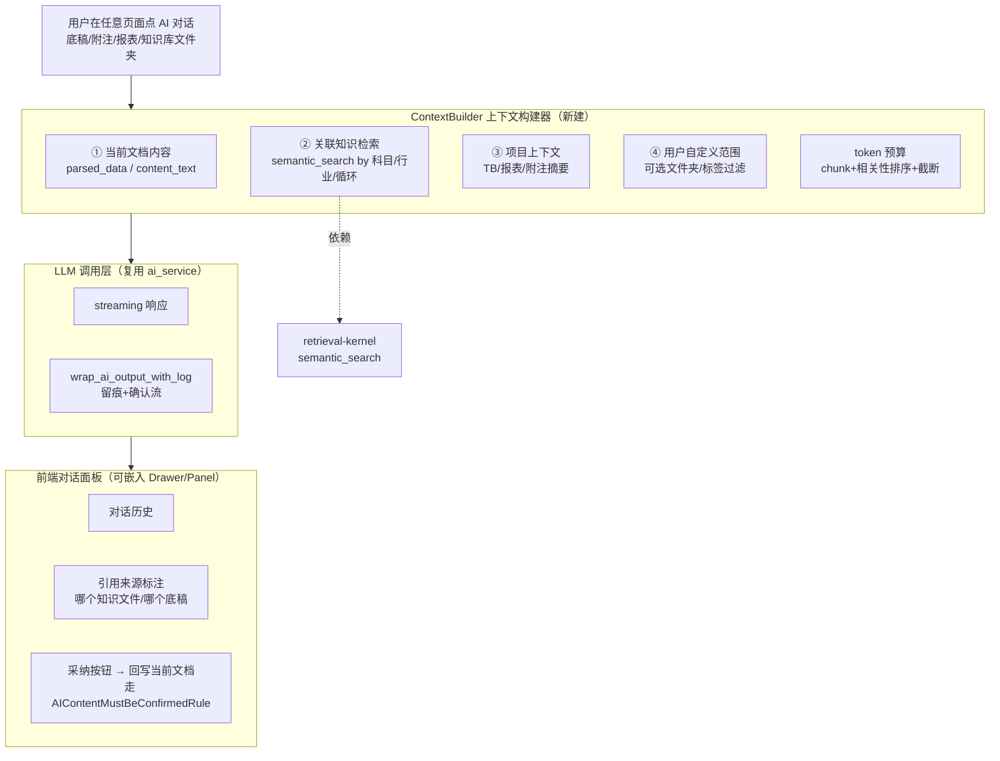

# 设计文档：doc-level-ai-chat（文档/文件夹级 LLM 知识库对话）

> 关联调研：#[[file:docs/proposals/global-modules-status-and-improvement-2026-05-31.md]]（§二十二 文档级 LLM 对话 + §二十三 复核 UX + §21.3.1 联动）
> 前置依赖：**retrieval-kernel-unification spec**（检索内核 + 知识文件入网，本 spec 依赖其 semantic_search）
> 前置资产：`ai_service`（vLLM 8100）+ `ai_chat_service`（全局对话）+ `wrap_ai_output_with_log`（AI 留痕确认流）+ `KnowledgeIndexService.semantic_search`
> 工作流：Design-First（HLD + LLD）

---

## 一、概述（Overview）

**用户定位（最实用核心功能）**：把知识库从"存文件"变成"随时可问的专家"。平台任意文档/文件夹都能发起 AI 对话，自动注入当前文档内容 + 关联知识库（同行业/同模板/同科目/同循环）作为 RAG 上下文。审计师在任何程序（底稿/附注/报表/试算表）中都能"问 AI"加速填写、核对、对比。

本 spec 不重复造轮子：**复用** `KnowledgeIndexService.semantic_search`（检索，依赖 retrieval-kernel spec）+ `ai_service`（LLM 调用）+ `wrap_ai_output_with_log`（留痕确认流）。**新建**的是 `ContextBuilder`（上下文组装）+ 前端可嵌入任意页面的对话面板。

核心能力：①任意文档/文件夹级对话入口 ②自动注入当前文档 + 关联知识检索 ③引用来源可追溯 ④AI 生成内容经确认流方可回写 ⑤token 预算管理（chunk + 相关性排序，非全文塞入）⑥权限继承。

---

## 二、架构（Architecture）



**关键设计原则**：
1. **上下文自动 + 用户可控**：默认自动注入当前文档 + 关联知识，用户可 @mention 选额外参考范围
2. **引用可追溯**：AI 回答标注引用来源（知识文件第几段/哪个底稿），审计师可验证
3. **确认流门禁**：AI 生成内容不直接写底稿/附注，必经 `AIContentMustBeConfirmedRule`
4. **token 预算**：知识文档大 → top_k 最相关段落，非全文塞入
5. **权限继承**：只检索用户有权访问的知识文件
6. **离线可用**：对话历史本地缓存（断网可查历史不可发新问）

---

## 三、组件与接口（Components and Interfaces）

### 组件 1：ContextBuilder（后端新建）

```python
class ContextBuilder:
    async def build(
        self, *, doc_type: str, doc_id: str, project_id: UUID, year: int,
        query: str, user, extra_scopes: list[str] | None = None,
    ) -> ChatContext:
        """组装：① 当前文档内容 ② semantic_search 关联知识 ③ 项目摘要 ④ 用户自定义范围。
        token 预算内 chunk + 相关性排序 + 截断。"""

@dataclass
class ChatContext:
    doc_excerpt: str                    # 当前文档内容
    knowledge_hits: list[SearchHit]     # 关联知识（含 source 引用）
    project_summary: str
    citations: list[Citation]           # 引用来源（可追溯）
    token_estimate: int
```

### 组件 2：对话端点（后端新建）

```python
# POST /api/ai-chat/doc/{doc_type}/{doc_id}  （streaming）
#   body: { query, year, extra_scopes? }
#   → ContextBuilder.build → ai_service streaming → wrap_ai_output_with_log
# GET  /api/ai-chat/doc/{doc_type}/{doc_id}/history
# POST /api/ai-chat/adopt  （采纳 AI 内容回写，走确认流）
```

### 组件 3：前端对话面板（可嵌入任意页面）

```
DocAiChatPanel.vue（Drawer/Panel）
  · 对话历史（本地缓存）
  · 引用来源标注（点击跳转知识文件/底稿）
  · @mention 选额外知识范围
  · 采纳按钮 → emit adopt（父组件回写 + 确认流）
useDocAiChat.ts（composable）：发起对话 / streaming 接收 / 历史管理 / 离线缓存
```

挂载点：底稿编辑器 / 附注编辑器 / 报表视图 / 知识库文件夹 右键或工具栏「AI 对话」入口。

---

## 四、与现有 AI 能力的关系（不重复造轮子）

| 现有能力 | 定位 | 本 spec 扩展 |
|---------|------|-----------|
| ai_chat_service（全局对话） | 项目级通用，检索业务数据 | 扩展为文档级（注入当前文档上下文） |
| wp_ai_services（底稿填充） | 自动填字段 | 本 spec 是交互式对话（问→答→确认采纳） |
| note_ai_assistant_service | 附注建议 | 本 spec 更通用（任意文档） |

复用：`semantic_search`（检索）+ `ai_service`（LLM）+ `wrap_ai_output_with_log`（留痕）。新建：ContextBuilder + 前端面板。

---

## 五、实施阶段（~5-7 人天，依赖 retrieval-kernel spec 先行）

- 阶段 1（~2 天）：后端 ContextBuilder + 对话端点（streaming + 留痕）
- 阶段 2（~2 天）：前端 DocAiChatPanel + useDocAiChat + 4 个挂载点
- 阶段 3（~1-2 天）：引用追溯 + 采纳确认流 + 权限 + token 预算 + 集成测试
- 阶段 4（~1 天）：Playwright UAT

---

## 六、正确性属性（PBT 守护）

- **D1 token 预算不超限**：ContextBuilder 输出 token_estimate ≤ 配置上限（chunk 截断生效）
- **D2 权限隔离**：对话上下文只含 user 有权访问的知识文件
- **D3 引用可追溯**：每条 knowledge_hit 必带可定位的 source（文件 id + 段落）
- **D4 确认流门禁**：AI 生成内容回写前必经 AIContentMustBeConfirmedRule（pending 状态）
