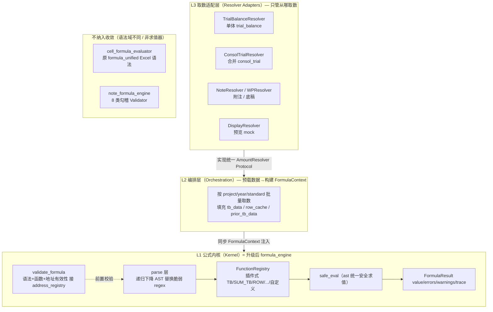
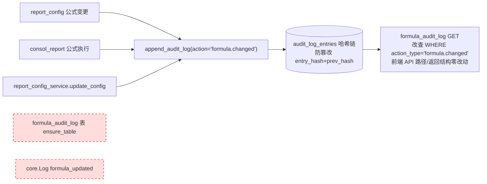

# 设计文档：formula-engine-unification（公式引擎统一架构）

> 关联调研：#[[file:docs/proposals/global-modules-status-and-improvement-2026-05-31.md]]（§十五 公式引擎统一架构 + §十七 审计留痕统一 + §20.1/§20.2/§20.7 收敛范围精确版 + §二十一 单源/联动裁定）
> 前置资产：ADR-CONSOL-101/106 已建 `AmountResolver` Protocol（`backend/app/services/amount_resolver.py`：`TrialBalanceResolver`/`ConsolTrialResolver`）+ `audit_log_helper.append_audit_log` 哈希链（`EVENT_TYPE_SCHEMAS` 7 类 schema）
> 范围：4 套报表公式求值器收敛为**单一企业级内核**（§15.4 分 4 阶段 ~6.5 人天，含审计收口）
> 工作流：Design-First（HLD + LLD）

---

## 一、概述（Overview）

平台当前**报表公式求值引擎至少 4 套并行**（已 grep 实证），各有独立的 AST 求值器与 `evaluate_formula`/`_safe_eval*`，两个文件都自称"统一引擎"却谁都没统一。同一 `TB()/SUM_TB()/ROW()` DSL 在 4 处各解析一遍，函数支持集（ABS/IF/ROUND/MAX/MIN/PREV/AUX）是否一致**无保证**——这是 ADR-CONSOL-101 在合并侧踩过的"语义漂移"硬伤的全局版。本 spec 把这 4 套收敛为 **单一企业级公式内核**，并顺带收口公式审计留痕（三处分裂 → 唯一哈希链）。

本设计的核心是**单内核 + 三层分责架构**：`formula_engine.py` 是 4 套中唯一已具备企业级特征的引擎（纯函数 + `FormulaContext` 注入 + `FormulaResult`(value/errors/trace) + 插件式 `register_custom_function` + `validate_formula`），升级为唯一求值内核（L1）；`report_engine` 退化为取数编排层（L2）+ 取数适配层（L3，复用已有 `AmountResolver`）；`formula_parser` 的递归下降解析并入内核 parse 层（删独立求值器）；`formula_unified` 因实际处理底稿 Cell 公式（Excel 语法 `=A1+B2`，与报表 DSL 是不同语法域）**改名 `cell_formula_evaluator` 保持独立，不纳入收敛**。

迁移遵循 ADR-CONSOL-101 验证过的"先跑通注入版再删旧"稳妥模式：**阶段 0 先建 4 引擎同一公式输出对照基线**（PBT 守门，暴露并固化现存语义差异）→ 阶段 1 report_engine 委托内核 → 阶段 2 consol+formula_parser+formula_unified 收口 → 阶段 3 审计+校验收口。每阶段回归基线全绿才继续，禁止一次性合并（4 套调用面广，formula_engine 6+ 调用方、report_engine 报表+合并都在用）。

**收敛排除项**（§20.3/§20.7 实证）：`note_formula_engine.py` 是 8 类勾稽校验 Validator（BalanceCheck/WideTableHorizontal 等，输入数据→输出 findings）非 evaluator，不纳入；`report_formula_service.py` 是公式填充/seed 非求值，不纳入。

**设计铁律**：金额全程 `Decimal`（金额铁律）；删旧代码前 grep 确认 0 调用方 + 删前后测试全绿；公式变更只落哈希链一处（CAS 1131）；前端 API 路径/返回结构零改动。

---

## 二、架构（Architecture）

### 2.1 收敛前现状（4 套并行求值器 + 审计三处分裂）

```mermaid
graph TD
    subgraph 调用方
        FR[/formula router]
        RC[report_config router<br/>同文件双引擎混用]
        RPT[reports router]
        CONSOL[consol_report_service]
        TB[trial_balance / prefill / event_handlers]
        EXCEL[excel_html / import_templates<br/>底稿 Cell 公式]
    end

    subgraph 求值器["4 套独立求值器（各有 AST eval）"]
        FE["formula_engine.py<br/>safe_eval_expr + regex token<br/>FormulaResult + 插件注册"]
        RE["report_engine.py<br/>_safe_eval_expr + ReportFormulaParser"]
        FP["formula_parser.py<br/>递归下降 FormulaEvaluator.evaluate"]
        FU["formula_unified.py<br/>_safe_eval（Excel 语法）"]
    end

    FR --> FE
    RC --> FP
    RC --> FE
    RPT --> RE
    CONSOL --> RE
    TB --> FE
    EXCEL --> FU

    subgraph 审计["审计留痕三处分裂"]
        FAL[formula_audit_log 表<br/>ensure_table 懒建绕 D6]
        LOG[core.Log formula_updated]
        HASH[audit_log_entries 哈希链]
    end

    RC -.写.-> FAL
    CONSOL -.写.-> FAL
    RC -.写.-> LOG
```

**问题锚点（grep 实证）**：
- `report_config.py:406-407` 同一请求内 `from app.services.formula_parser import evaluate_formula`（求值）+ `from app.services.formula_engine import FormulaEngine`（校验）——**两套引擎交叉使用，对同一公式解析结果可能不一致**（§20.1 首批改造目标）。
- `formula_audit_log.py:29 ensure_table` 每请求 `CREATE TABLE IF NOT EXISTS` 绕开 D6 迁移（drift detector 盲区）。
- `report_config_service.py:216 Log(action="formula_updated")` + `report_config.py:543` / `consol_report.py:94` 内联 INSERT `formula_audit_log`——留痕三处口径不一。

### 2.2 收敛后目标：三层单内核（Single-Kernel, Layered）



**职责边界**：
- **L1 内核**纯函数、无 DB/async 耦合，输入 `(formula, FormulaContext)` → 输出 `FormulaResult`。所有业务域共用这一套求值/解析/校验逻辑。
- **L2 编排**负责 async 批量取数后构建同步的 `FormulaContext` 传给 L1（解决"内核纯函数 vs 取数 async"的职责矛盾，§15.6 风险点）。
- **L3 取数适配**实现 `AmountResolver` Protocol，各业务域只实现"从哪取数"。复用 Phase1 已建的 `TrialBalanceResolver`/`ConsolTrialResolver`，新增 Note/WP/Display Resolver。

### 2.3 审计留痕收口（三处 → 唯一哈希链）



新增 `formula_changed` schema 入 `EVENT_TYPE_SCHEMAS`；3 个写入点统一改调 `append_audit_log`；`formula_audit_log.py` 的 GET 改查哈希链（payload JSONB 过滤 module/row_code），**前端零改**；废 `ensure_table` 懒建 + `core.Log` formula_updated 分支。


---

## 三、四套引擎能力实测对照（收敛决策依据）

基于对 4 套引擎的逐一 readCode 实证（签名/函数集/解析策略/调用方）：

| 维度 | `formula_engine.py` | `report_engine.py` | `formula_parser.py` | `formula_unified.py` |
|------|--------------------|--------------------|--------------------|--------------------|
| 自我定位 | "企业级唯一执行器" | Phase1 报表主引擎 | 递归下降解析器 | "统一"解析+预览 |
| 解析策略 | regex token 替换（`_TOKEN_PATTERNS`） | regex token 替换（`ReportFormulaParser`） | **真递归下降**（`tokenize`+`Parser`+AST 节点） | regex（`FormulaToken`） |
| 函数集 | **最全**（TB/SUM_TB/ROW/SUM_ROW/REPORT/PREV/AUX/NOTE/WP + ABS/ROUND/MAX/MIN/IF） | TB/SUM_TB/ROW/SUM_ROW/REPORT + ABS/IF/比较 | 同左（AST，`_eval_func`） | SUM/ABS/IF + Cell 引用（Excel） |
| 取数方式 | **纯函数 + `FormulaContext` 注入**（无 DB 耦合） | DB 耦合（`AmountResolver` 注入，Phase1 改造） | DB 耦合（`FormulaEvaluator` 连执行器） | 内存 cells（Excel A1:B2） |
| 返回结构 | **`FormulaResult`**（value+errors+warnings+trace） | `Decimal` | `Decimal` | `float`/`None` |
| 扩展性 | **插件式**（`register_custom_function`） | 硬编码 | 硬编码 | 硬编码 |
| 安全求值 | `safe_eval_expr`（ast） | `_safe_eval_expr`（ast） | AST 求值 | `_safe_eval`（ast） |
| 校验 | **`validate_formula`**（括号/未知函数） | 无独立 | 解析期抛 `ParseError` | `validate_formula`（行列界） |
| 调用面 | `/formula` router + report_config + trial_balance + prefill + event_handlers + wp_user_formulas | reports + consol | report_config | excel_html + import_templates（2 处） |
| 语法域 | 报表 DSL | 报表 DSL | 报表 DSL | **底稿 Cell Excel 公式** |

**收敛决策**：
- `formula_engine.py` 是**唯一已具企业级特征的引擎**（纯函数 + Context 注入 + Result 对象 + 插件注册 + 校验）→ **升级为统一内核 L1**。
- `report_engine`/`formula_parser`/`formula_unified` 的独有价值分别是「DB 取数编排（已用 AmountResolver）」「严谨递归下降解析」「Excel 显示预览」→ 前两者并入内核之上的薄层，`formula_unified` 因语法域不同独立保留。

---

## 四、组件与接口（Components and Interfaces）

### 组件 1：L1 公式内核（`formula_engine.py` 升级版）

**职责**：唯一报表 DSL 求值/解析/校验实现。纯函数，不碰 DB/async。

**核心 API（保持现有签名，向后兼容）**：

```python
@dataclass
class FormulaResult:
    value: Decimal = Decimal("0")
    errors: list[str] = field(default_factory=list)
    warnings: list[str] = field(default_factory=list)
    trace: list[str] = field(default_factory=list)   # 取数轨迹（审计入哈希链）

    @property
    def ok(self) -> bool:
        return len(self.errors) == 0


@dataclass
class FormulaContext:
    """L2 编排层预载、传给 L1 的同步数据快照（无 DB 耦合）。"""
    tb_data: dict[str, dict[str, Decimal]] = field(default_factory=dict)       # 科目→{列名:金额}
    row_cache: dict[str, Decimal] = field(default_factory=dict)               # 行次→已算值（ROW/SUM_ROW）
    prior_tb_data: dict[str, dict[str, Decimal]] = field(default_factory=dict) # 上年（PREV）
    note_data: dict[str, dict[str, Decimal]] = field(default_factory=dict)    # 新增：附注（NOTE）
    wp_data: dict[str, dict[str, Decimal]] = field(default_factory=dict)      # 新增：底稿（WP）
    aux_data: dict[str, dict[str, Decimal]] = field(default_factory=dict)     # 新增：辅助核算（AUX）
    default_column: str = "期末余额"


def execute(formula: str | None, ctx: FormulaContext) -> FormulaResult:
    """唯一内核求值入口。纯函数：同 formula + 同 ctx → 同 FormulaResult（可测、可缓存）。"""


def validate_formula(formula: str, *, address_validator: AddressValidator | None = None) -> list[str]:
    """语法校验（括号/未知函数）+ 可选地址有效性校验（接 address_registry，存悬空引用即拒）。
    返回错误列表（空=合法）。"""
```

**parse 层升级（采纳 formula_parser 递归下降替换 regex）**：

```python
# 内核内部：把 formula_parser 的 tokenize + Parser + AST 节点并入为 parse 层
def parse(formula: str) -> FormulaAST:
    """递归下降解析为 AST（替换脆弱的 _TOKEN_PATTERNS regex）。
    对嵌套 PREV(TB(...)) / IF(TB>0, ROW, 0) 等更严谨。解析结果缓存（同公式不重解析）。"""

# 求值阶段遍历 AST，函数节点查 FunctionRegistry 取 handler
```

### 组件 2：FunctionRegistry（插件式函数注册）

**职责**：所有 DSL 函数（TB/SUM_TB/ROW/SUM_ROW/REPORT/PREV/AUX/NOTE/WP + 内置 ABS/ROUND/MAX/MIN/IF）的单一注册表。新增函数 = 注册一个 handler，全域可用。

```python
# 函数 handler 签名：从 ctx 取数 → 返回 Decimal
FunctionHandler = Callable[[list[Any], FormulaContext], Decimal]

class FunctionRegistry:
    def register(self, name: str, handler: FunctionHandler, *, arity: int | None = None,
                 description: str = "", syntax: str = "") -> None:
        """注册/覆盖一个 DSL 函数（企业级可扩展：新增函数仅此一处）。"""

    def get(self, name: str) -> FunctionHandler | None: ...
    def known_function_names(self) -> set[str]:
        """供 validate_formula 校验"未知函数"。"""
    def list_all(self) -> list[dict]:
        """供 /formula router 列出可用函数（含自定义）。"""

# 内置函数在模块加载时注册（示例）
_REGISTRY = FunctionRegistry()
_REGISTRY.register("TB",     _handle_tb,     arity=2, syntax="TB('1002','期末余额')")
_REGISTRY.register("SUM_TB", _handle_sum_tb, arity=2, syntax="SUM_TB('1400~1499','期末余额')")
_REGISTRY.register("PREV",   _handle_prev,   arity=2, syntax="PREV('1002','期末余额')")
# ... ROW / SUM_ROW / REPORT / AUX / NOTE / WP
```

> 现有 `FormulaEngine.register_custom_function` 自定义函数能力保留，底层改委托 `FunctionRegistry.register`。

### 组件 3：L3 取数适配层（`AmountResolver` Protocol，复用 + 扩展）

**复用** Phase1 已建（`amount_resolver.py`）：

```python
@runtime_checkable
class AmountResolver(Protocol):
    async def resolve_tb(self, account_code: str, column_name: str) -> Decimal: ...
    async def resolve_sum(self, code_range: str, column_name: str) -> Decimal: ...

class TrialBalanceResolver: ...   # 单体 trial_balance（已有，含列名映射 + 未审模式）
class ConsolTrialResolver: ...    # 合并 consol_trial.consol_amount（已有，全 async）
```

**新增**（本 spec）：

```python
class NoteResolver:     # 附注数据源（NOTE 函数）
    async def resolve_tb(self, section_code: str, field_name: str) -> Decimal: ...

class WPResolver:       # 底稿数据源（WP 函数）
    async def resolve_tb(self, wp_code: str, column: str) -> Decimal: ...

class DisplayResolver:  # 预览/mock 数据源（替代 formula_unified 的预览职责中的 DSL 部分）
    async def resolve_tb(self, account_code: str, column_name: str) -> Decimal: ...
```

### 组件 4：L2 编排层（`report_engine` 退化）

**职责**：按 project/year/standard 批量取数（经 L3 Resolver）→ 构建 `FormulaContext` → 调 L1 `execute`。`report_engine` 删除内嵌 `_safe_eval_expr` + `ReportFormulaParser` 求值逻辑，仅保留取数编排。

```python
async def evaluate_formula(
    formula: str, db, project_id, year, *,
    resolver: AmountResolver | None = None,   # 单体 None→TrialBalanceResolver；合并 ConsolTrialResolver
    row_values: dict[str, Decimal] | None = None,
) -> Decimal:
    """L2 编排：预载 ctx → 调 L1 内核 execute → 返回 Decimal（向后兼容签名）。"""
    ctx = await _build_context(db, project_id, year, formula, resolver, row_values)
    result = execute(formula, ctx)   # ← 委托唯一内核
    return result.value
```

### 组件 5：底稿 Cell 公式（`cell_formula_evaluator`，原 `formula_unified` 改名独立）

**职责**：底稿单元格 Excel 公式（`=A1+B2`、`=SUM(C1:C10)`、`=IF(B2>0,C2,0)`）。**语法域与报表 DSL 不同，不纳入内核**，仅改名 + 文件头标注，删除"统一"误导命名。调用方 `excel_html.py` / `import_templates.py` 的 import 路径随之更新（`smartRelocate` 自动改引用）。

### 组件 6：审计收口（`append_audit_log` + `formula_changed` schema）

```python
# audit_log_helper.py — EVENT_TYPE_SCHEMAS 新增
EVENT_TYPE_SCHEMAS["formula_changed"] = {
    "module", "row_code", "action", "old_formula", "new_formula", "result_value",
}
# 写入：3 处统一调
await append_audit_log(db, AuditLogPayload(
    user_id=actor_id, project_id=pid, action="formula.changed",
    resource_type="report_config", resource_id=row_code,
    details={"event_type": "formula_changed", "module": "report", "row_code": row_code,
             "action": "execute", "old_formula": old, "new_formula": new,
             "result_value": str(value), "trace": result.trace},
))
```
