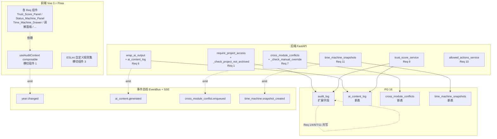
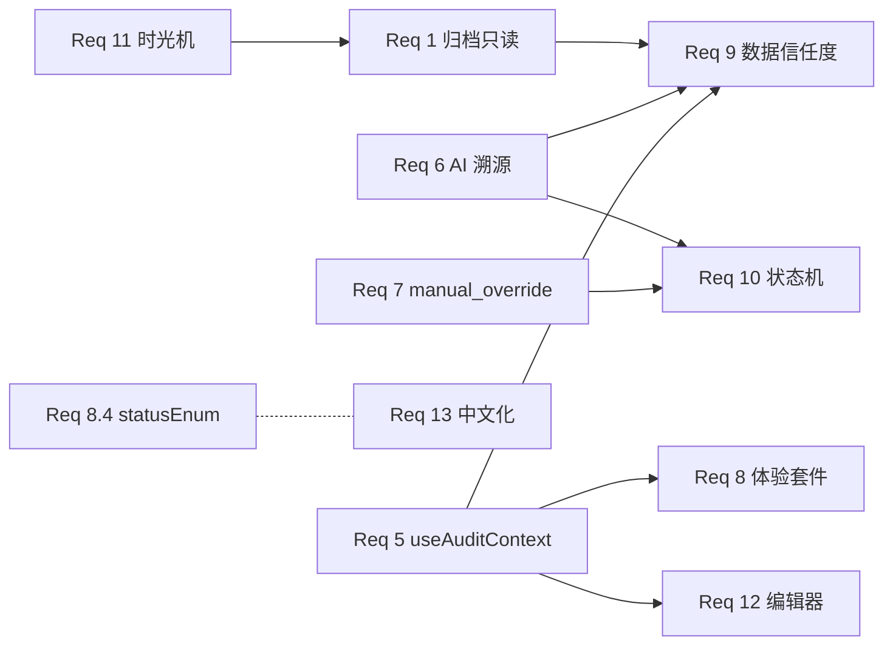
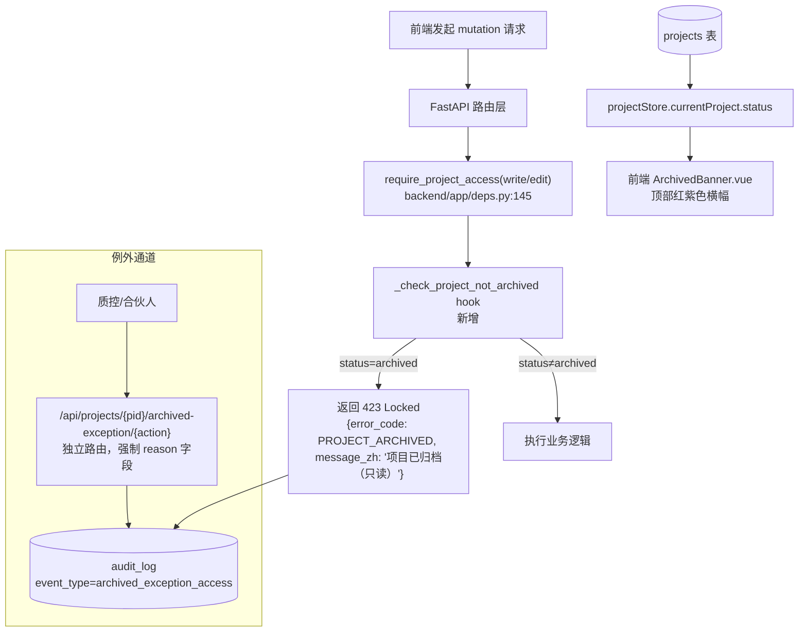
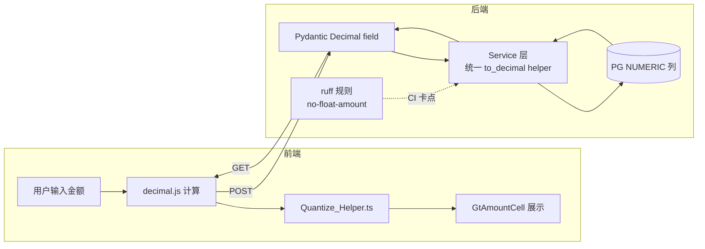
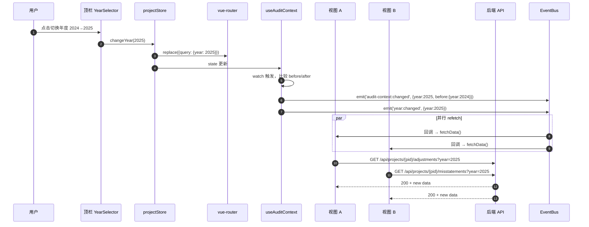
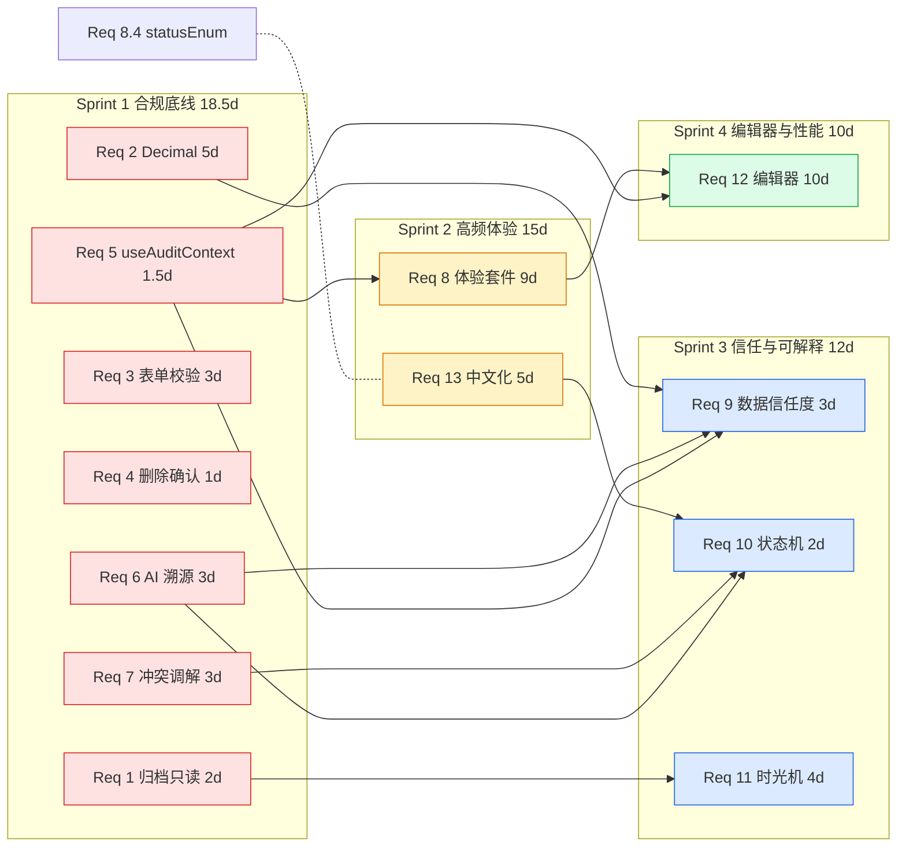

# 全平台 V3 收官增强 — 设计文档

> 起草日期：2026-05-26
> 对应 requirements：`.kiro/specs/global-refinement-v3/requirements.md`（13 Req / 13 Property / 4 Sprint / 55.5 工时）
> 工作流类型：Requirements-First
> 状态：design 阶段（tasks 后续单独发起）
> 目标：把 13 个需求落地到具体的文件 / 函数 / DB 表 / API 端点 / 前端组件层次，做到代码锚定 + 可回滚 + CI 卡点齐备。

## 变更记录

| 版本 | 日期 | 摘要 | 触发原因 |
|------|------|------|---------|
| v0.1 | 2026-05-26 | 首次起草 13 Req 一对一设计 + 4 横切基础设施 + 8 ADR + 13 Property | requirements.md v0.1 锁定后启动 design 阶段 |

---

## Overview

### 设计目标

把 requirements.md 列出的 13 个需求落地为「代码锚定的可实施方案」：

1. **每个 Req 一一对应一个设计章节**：包含组件 / 数据模型 / API / 前端层次 / 文件锚定。
2. **横切复用先行**：把 4 项跨 Req 共享的基础设施单独成章（useAuditContext / audit_log 扩展 / ESLint 规则集 / DB 迁移合并），避免每个 Req 内部重复。
3. **新增 3 张 DB 表合并为单一迁移 V017**（详见 ADR-08），并配套 R017 回滚脚本。
4. **每个 Req 提供完成验收标准**：grep 卡点 / Playwright / pytest / 性能基准对应到 requirements 的 AC 清单。
5. **保持现有架构不动**：Vue 3 + Pinia + FastAPI + PG 16 + Redis；不引入新框架（不接入 vue-i18n、不换表格库）。

### 设计原则

| 原则 | 来源 | 落实方式 |
|------|------|---------|
| 数据安全 > 合规 > 体验 > 功能 > 锦上添花 | requirements §实施原则 #1 | Sprint 1 全部为合规底线；Sprint 4 为性能体验 |
| 三层一致校验 | conventions.md §三层一致校验 | 每张新表都列 DB 迁移 + ORM Mapped[] + service 方法 |
| router_registry 注册必查 | conventions.md §router_registry 必查铁律 | 每个新 router 都标注注册位置 |
| 代码锚定 | spec 起草铁律 | 每个修改点列出文件路径 + 函数名 + 行号区间 |
| 一次性脚本 `_` 前缀用完即删 | conventions.md §scripts 命名规约 | Req 13 中文化脚本 / Req 2 ruff 规则注册脚本均遵循 |
| 迁移编号实施时取 max+1 | conventions.md §迁移脚本编号规则 | 本设计列基线 V017（max=V016），实施时按当时 ls 结果调整 |

### 整体架构图



### 关键架构决策一览（详见末尾 ADR 章节）

| ADR | 决策点 | 结论 |
|-----|--------|------|
| ADR-01 | 归档守卫位置 | 在 `require_project_access` 工厂内嵌入 hook（而非装饰器），自动覆盖所有项目维度端点 |
| ADR-02 | 金额 Decimal 化策略 | 后端 Pydantic + ruff 规则双卡点；前端 decimal.js + 一次性迁移脚本扫描 |
| ADR-03 | useAuditContext 与 projectStore 关系 | useAuditContext 是 projectStore 的 reactive view + URL 同步 + 事件 emit，不替换 store |
| ADR-04 | AI 内容溯源粒度 | 字段级（content_hash + target_cell），而非段落级 |
| ADR-05 | 跨模块冲突调解触发点 | 在 service 写入层（`wp_disclosure_sync` / `cross_ref_service` 入口）拦截，而非 ORM event |
| ADR-06 | 时光机 diff 算法 | RFC 6902 JSON Patch 反向 diff（增量），全量快照为应急回退；1 小时滚动 + 7 天清理 |
| ADR-07 | trust_score 聚合缓存策略 | Redis 短 TTL（60s）+ 数据变更事件失效；不写 DB 物化视图 |
| ADR-08 | 3 新表迁移合并策略 | 单一 V017 迁移文件 + 单一 R017 回滚（理由：3 张表在 Sprint 1/3 已绑定 Req 6/7/11 同 Sprint 落地） |

---

## Architecture

### 分层架构

整个 V3 收官增强遵循平台既有分层：

```
┌─────────────────────────────────────────────────────────────┐
│ 视图层 (Vue 3 SFC)                                            │
│   - 99 个视图复用横切组件（GtPageHeader / GtAmountCell / ...） │
│   - 5 视图新增「时光机 / 数字信任度 / 状态机」入口             │
├─────────────────────────────────────────────────────────────┤
│ Composable 层（横切复用）                                     │
│   - useAuditContext（新增，Req 5）                           │
│   - useNavigationStack（扩展，Req 8.3）                      │
│   - usePenetrate（既有，扩展 traceAmount，Req 9）             │
│   - useEditingLock / useEditMode（既有）                     │
├─────────────────────────────────────────────────────────────┤
│ Pinia Store 层                                                │
│   - projectStore（既有，扩展 isArchived computed）             │
│   - dictStore（既有，承载 statusEnum 中文 label）              │
│   - displayPrefs（既有，金额格式化中央配置）                   │
├─────────────────────────────────────────────────────────────┤
│ API Proxy 层                                                  │
│   - apiProxy.ts（既有，单层解构）                             │
│   - handleApiError（既有，扩展 statusCode 423/422 中文映射）   │
├─────────────────────────────────────────────────────────────┤
│ FastAPI 路由层                                                │
│   - router_registry/{group}.py 注册 4 个新路由                │
│     · /api/projects/{pid}/trust-score              Req 9     │
│     · /api/{module}/{id}/allowed-actions           Req 10    │
│     · /api/instances/{type}/{id}/time-machine/...  Req 11    │
│     · /api/conflicts/...                           Req 7     │
├─────────────────────────────────────────────────────────────┤
│ Service 层                                                    │
│   - 既有 369 service 中 7 个核心 service 注入新 hook：         │
│     · wp_disclosure_sync       Req 7 manual_override          │
│     · cross_ref_service        Req 7                          │
│     · ai_service               Req 6 wrap_ai_output           │
│     · prefill_engine / formula_*  Req 2 Decimal 化            │
│     · note_validation_engine   Req 2 容差 helper              │
│   - 新增 5 个 service：                                        │
│     · trust_score_service      Req 9                          │
│     · allowed_actions_service  Req 10                         │
│     · time_machine_service     Req 11                         │
│     · ai_content_log_service   Req 6                          │
│     · conflict_resolution_service Req 7                       │
├─────────────────────────────────────────────────────────────┤
│ ORM 模型层                                                    │
│   - 既有 62 个 model 中扩展：AuditLogEntry / Project          │
│   - 新增 3 个 model：AiContentLog / CrossModuleConflict /     │
│     TimeMachineSnapshot                                        │
├─────────────────────────────────────────────────────────────┤
│ DB 迁移层                                                     │
│   - V017__v3_refinement_tables.sql（单一迁移 3 表）           │
│   - R017__v3_refinement_tables_rollback.sql                   │
└─────────────────────────────────────────────────────────────┘
```

### 跨 Sprint 横向依赖



**关键依赖说明**：
- **Req 5（useAuditContext）是基础设施**：Req 8.3 穿透面包屑需要 navigation stack；Req 9 信任度面板需要 (project_id, year)；Req 12 序时账虚拟滚动需要 year 切换响应。
- **Req 6（AI 溯源）必须先于 Req 9**：信任度面板的"AI 痕迹"层从 `ai_content_log` 表读取。
- **Req 11（时光机）反向依赖 Req 1**：归档项目禁止恢复。
- **Req 8.4（statusEnum 清零）与 Req 13（中文化）必须同 Sprint 协同**：statusEnum 的 label 字段就是中文目标值。

---

## Components and Interfaces

> 每个 Requirement 一一对应一个小节，含：架构图（关键 Req 提供 mermaid）/ 数据模型 / API / 前端组件 / 代码锚定 / 验收。


---

## 横切基础设施（4 项跨 Req 共享组件）

### 横切组件 1：useAuditContext composable（Req 5 主导，Req 8/9/12 隐式依赖）

#### 设计目标

把散落在 86 个视图的 `route.query.year` / `projectStore.year` / `route.params.projectId` 读取统一收敛到 `useAuditContext()`，对外暴露响应式三元组 + derived 状态 + 事件 emit。

#### Composable 签名

新建 `audit-platform/frontend/src/composables/useAuditContext.ts`：

```ts
import { computed, watch, type ComputedRef } from 'vue'
import { useRoute } from 'vue-router'
import { useProjectStore } from '@/stores/project'
import { eventBus } from '@/utils/eventBus'

export interface AuditContextState {
  /** 当前项目 ID（响应式） */
  projectId: ComputedRef<string>
  /** 当前审计年度（响应式） */
  year: ComputedRef<number>
  /** 适用准则 'soe' | 'listed'（响应式） */
  applicableStandard: ComputedRef<'soe' | 'listed'>
  /** 项目是否已归档（响应式） */
  isArchived: ComputedRef<boolean>
  /** 当前用户在该项目下是否可编辑（响应式） */
  canEdit: ComputedRef<boolean>
  /** 注册 refetch 回调，年度/项目变化时自动触发 */
  onContextChange: (cb: (ctx: { projectId: string; year: number }) => void) => () => void
}

export function useAuditContext(options?: {
  /** 标记本视图与 audit context 无关（如帮助页），跳过事件监听 */
  irrelevant?: boolean
}): AuditContextState
```

#### 内部实现要点

1. **数据源单一真源**：projectStore 是真源，useAuditContext 只是 reactive view + watcher。
2. **URL 同步**：`projectStore.changeYear(y)` 时同步更新 `route.query.year`（既有逻辑）+ emit `year:changed`（既有事件）。
3. **derived 状态**：
   - `isArchived = computed(() => projectStore.currentProject?.status === 'archived')`
   - `canEdit = computed(() => !isArchived.value && projectStore.currentUserPermission >= 'editor')`
4. **自动 watch**：`watch([() => route.params.projectId, () => route.query.year], ...)` 触发 `audit-context:changed` 事件 + 调用所有注册的 onContextChange 回调。
5. **debounce 避免抖动**：路由跳转 + projectStore 同步可能短时间内触发多次，使用 50ms debounce。

#### 事件契约

| 事件名 | payload | 触发时机 | 监听者 |
|--------|---------|---------|--------|
| `audit-context:changed` | `{ projectId, year, applicableStandard, before }` | useAuditContext 检测到任一字段变化 | 各业务视图 onContextChange 回调 |
| `year:changed` | `{ year, before }` | projectStore.changeYear() | 既有订阅者（LedgerImportHistory / LedgerPenetration / Materiality） |

> `audit-context:changed` 是新增的细粒度事件（含 projectId + year + standard），`year:changed` 保留向后兼容。

#### 替代既有读取的清单

- 替代 `useRoute().query.year` 直接读取（实测 53 视图）
- 替代 `projectStore.year` 在视图内的散落引用（实测 ≥ 30 视图）
- 替代 `onMounted(() => fetch(...))` 一次性加载模式（实测 86 视图，本 spec 只改 7 核心视图，其余推后到独立 spec）

#### 端到端示例

```vue
<script setup lang="ts">
import { useAuditContext } from '@/composables/useAuditContext'

const ctx = useAuditContext()

const tableData = ref([])

async function fetchData() {
  if (!ctx.projectId.value) return
  tableData.value = await api.get(
    `/api/projects/${ctx.projectId.value}/adjustments`,
    { params: { year: ctx.year.value } }
  )
}

ctx.onContextChange(() => fetchData())
fetchData() // 首次加载

const banner = computed(() =>
  ctx.isArchived.value ? '📁 项目已归档（只读）' : null
)
</script>

<template>
  <div v-if="banner" class="archived-banner">{{ banner }}</div>
  <el-table :data="tableData" />
</template>
```

#### 兼容性与回滚

- **向后兼容**：projectStore 公共 API（`year` / `projectId` / `changeYear`）零改动
- **灰度策略**：先在 Adjustments / Misstatements / ReportView / DisclosureEditor / WorkpaperList / TrialBalance / LedgerPenetration 7 视图接入，其余视图保留旧读取方式
- **回滚**：删除 useAuditContext.ts 文件，7 视图回退为直接读 projectStore.year（git revert 即可）

---

### 横切组件 2：audit_log 字段扩展（Req 1/4/6/7/11 共用）

#### 现状

`backend/app/models/audit_log_models.py:22` 定义 `AuditLogEntry`，包含 `id / user_id / action / resource_type / resource_id / timestamp / details(JSONB) / hash_chain` 等字段，已有 hash 链不可变追加（V007 已落地）。

#### 扩展字段（仅扩 details JSONB schema，不改表结构）

V3 新增的 5 类审计场景全部复用既有 `details` JSONB 字段，按 `details.event_type` 区分：

| event_type | 触发场景 | details schema |
|------------|---------|----------------|
| `archived_exception_access` | Req 1 归档项目例外通道触发 | `{reason, approver_id, endpoint, original_status}` |
| `archive_unarchive` | Req 1 解除归档 | `{reason, previous_status}` |
| `delete_with_confirm` | Req 4 删除二次确认通过 | `{object_type, object_name, soft_or_hard, recoverable}` |
| `ai_content_lifecycle` | Req 6 AI 内容生成/确认/修订/拒绝（关联 ai_content_log.id） | `{ai_content_log_id, action: 'generate'/'confirm'/'revise'/'reject'}` |
| `cross_module_conflict_resolved` | Req 7 用户调解冲突 | `{conflict_id, resolution: 'keep_manual'/'accept_new'/'merge', upstream_value, manual_value, final_value}` |
| `time_machine_restore` | Req 11 时光机恢复 | `{from_snapshot_id, to_snapshot_id, instance_type, instance_id}` |

#### 统一写入 helper

新建 `backend/app/services/audit_log_helper.py`：

```python
from typing import Literal, TypedDict
from uuid import UUID

class AuditLogPayload(TypedDict):
    user_id: UUID
    project_id: UUID | None
    action: str
    resource_type: str
    resource_id: str | None
    details: dict  # 含 event_type 字段

EventType = Literal[
    'archived_exception_access',
    'archive_unarchive',
    'delete_with_confirm',
    'ai_content_lifecycle',
    'cross_module_conflict_resolved',
    'time_machine_restore',
]

async def append_audit_log(db, payload: AuditLogPayload) -> UUID:
    """统一审计日志写入入口，自动维护 hash_chain。

    - 调用方：deps.py / time_machine_service / conflict_resolution_service / ...
    - 内部：复用既有 hash_chain 逻辑（V007 引入）
    """
    ...
```

#### 兼容性与回滚

- **向后兼容**：表结构零改动，仅扩展 JSONB schema
- **回滚**：删除 audit_log_helper.py + 各调用点（git revert）；既有 audit_log 数据保持原样

---

### 横切组件 3：ESLint 自定义规则集（Req 2/3/4/5/8/12/13 共用）

新建 `audit-platform/frontend/eslint-rules/` 目录，集中维护本 spec 引入的 7 条自定义规则。

| 规则名 | 规则类型 | 关联 Req | 触发条件（简述） |
|--------|---------|---------|-----------------|
| `no-amount-without-decimal` | regex / AST | Req 2 | 检测 `Number(...)` / `parseFloat(...)` 在金额关键字（amount/balance/debit/credit）变量上的使用 |
| `el-form-must-have-rules` | AST | Req 3 | 检测 `<el-form>` 内含提交按钮但缺 `:rules` 属性 |
| `no-delete-without-confirm` | 行扫描 | Req 4 | 检测 `api.delete(` 调用前 3 行无 `confirm` 字样 |
| `must-watch-route-or-context` | AST | Req 5 | 检测 `onMounted(() => fetch(...year...))` 但缺 `watch(() => route.query.year, ...)` 或 `useAuditContext().onContextChange` |
| `no-bare-amount-cell` | AST | Req 8.1 | 检测 `<el-table-column align="right">` 内含 `{{ row.X }}` 但 X 含 amount 关键字时未用 GtAmountCell |
| `no-status-string-literal` | regex | Req 8.4 | 检测 `.vue` 文件含状态字符串字面量（'draft' / 'pending_review' / 'archived' 等 statusEnum 值） |
| `no-english-ui-text` | regex + 白名单 | Req 13 | 检测 `label="..."` / `<el-button>...</el-button>` 内英文文本（白名单 SQL/PDF/UUID/...等技术术语） |
| `no-console` | ESLint 内建 | Req 12.4 | 设为 `error`，仅允许 `import.meta.env.DEV` 守卫下 |

#### 实现方式

| 规则 | 实现方式 | 准确率 |
|------|---------|--------|
| AST-based | 使用 `vue-eslint-parser` + `@typescript-eslint/parser` 写自定义 rule | 高（>95%） |
| regex / 行扫描 | `scripts/_check_<rule_name>.mjs` 一次性脚本 + grep 命中数 baseline | 中（80%~95%，可能误报） |

> 复杂规则（must-watch-route-or-context / no-bare-amount-cell）以 grep + baseline 兜底，AST 实现作为后续优化（不阻塞本 spec 落地）。

#### Baseline 文件

`.github/workflows/baselines.json` 新增字段：

```json
{
  "no-amount-without-decimal-services": "<由实施时跑一次确定>",
  "el-form-must-have-rules-vue-files": "<由实施时跑一次确定>",
  "no-delete-without-confirm-vue-files": "<由实施时跑一次确定>",
  "no-bare-amount-cell-tables": "<由实施时跑一次确定>",
  "no-status-string-literal-vue-files": "<由实施时跑一次确定>",
  "no-english-ui-label-vue-files": "<由实施时跑一次确定>",
  "no-english-ui-button-vue-files": "<由实施时跑一次确定>",
  "console-log-vue-files": "<由实施时跑一次确定，目标 0>"
}
```

每个规则按"baseline 由实施时跑一次确定，只减不增"原则推进。

---

### 横切组件 4：DB 迁移合并策略（Req 6/7/11 各新增 1 张表）

#### 备选方案

| 方案 | 优点 | 缺点 |
|------|------|------|
| A. 单一迁移 V017 同时建 3 张表 | 一次性事务 + 单一回滚 R017 | 3 张表强耦合，无法分批回滚 |
| B. 分 V017/V018/V019 三个迁移 | 解耦，可分批回滚 | 3 个迁移文件 + 3 个 R 文件，PR 噪声大；本 spec Sprint 1/3 同窗口落地，分批意义不大 |

**结论：采用方案 A**（单一 V017 迁移）。

理由：
1. **3 张表逻辑相对独立**（ai_content_log / cross_module_conflicts / time_machine_snapshots），不存在交叉外键
2. **同 Sprint 内必须配套落地**：Req 6 与 Req 9 跨 Sprint 依赖，Req 7 / Req 11 在 Sprint 1 / Sprint 3 同步落地
3. **回滚以"全量"为单位最简单**：本 spec 整体未通过 UAT 时一次性 R017 回退，避免 V017 落地但 V018 失败的中间态
4. **既有迁移惯例**：V010/V011/V012 等也是单文件多表（review_templates 一次性建多表）

#### 文件命名（实施时按当时 max+1 调整）

```
backend/migrations/V017__v3_refinement_tables.sql        (建 3 表 + 索引)
backend/migrations/R017__v3_refinement_tables_rollback.sql
```

> conventions.md §迁移脚本编号规则：「实施时动态确定 max+1，禁止在 spec 起草阶段硬编码」。当前 max=V016，本设计列基线 V017，实施时按 ls 结果再确认。

#### 三表建表 SQL（V017 主体结构）

详见各 Req 的「数据模型」小节，集中归档于 V017 文件。所有 DDL 使用 `CREATE TABLE IF NOT EXISTS` + `CREATE INDEX IF NOT EXISTS` 保证幂等。

#### Feature flag 策略

不引入新的 settings 开关。本 spec 不分灰度（全部为合规底线 + 体验改进，无可降级路径）。回滚仅依赖 R017。


---

## Sprint 1（合规底线，Req 1-7）

### Req 1：归档项目只读保护（CAS 1131 合规）

#### 架构图



#### 数据模型

无新增表。扩展：

- `projects.status` 已是枚举 `{active, in_progress, in_review, archived, ...}`（既有），本 Req 仅消费状态值。
- `audit_log.details.event_type = 'archived_exception_access'` / `'archive_unarchive'`（新增 schema 约定，详见横切组件 2）。

#### API 端点

##### 1. 归档守卫（嵌入既有工厂）

修改 `backend/app/deps.py:145` 的 `require_project_access(min_permission)` 工厂：

```python
async def _check_project_not_archived(
    db: AsyncSession,
    project_id: UUID,
    current_user: User,
    min_permission: str,
) -> None:
    """归档项目只读守卫。

    - readonly 权限：跳过（允许只读查询）
    - editor / admin 权限：检查 project.status，archived 时抛 423
    - 例外：当前用户角色为 admin + URL 含 ?archived_exception=1 时跳过（仅供例外通道使用）
    """
    if min_permission == "readonly":
        return
    project = await db.get(Project, project_id)
    if project and project.status == ProjectStatus.archived:
        raise HTTPException(
            status_code=423,
            detail={
                "error_code": "PROJECT_ARCHIVED",
                "message": "项目已归档，无法编辑",
                "message_en": "Project archived (read-only)",
            },
        )
```

调用时机：在既有 `set_rls_context` 之前 + 仅当 `min_permission != "readonly"` 时触发。

##### 2. 例外通道（独立路由）

新建 `backend/app/routers/archived_exception.py`，注册到 `backend/app/router_registry/system.py`：

```
POST   /api/projects/{pid}/archived-exception/{action}
       Body: {reason: str, password_confirm: str}
       Permission: admin / partner / qc 角色
       Response: 200 + 写 audit_log
       
POST   /api/projects/{pid}/unarchive
       Body: {reason: str, password_confirm: str}
       Permission: admin / partner
       Response: 200 + 写 audit_log + project.status → in_review
```

##### 3. 解除归档 + 解除前二次确认

前端 `ArchivedBanner.vue` 内的「解除归档」按钮触发 `confirmDangerous(...)`（既有 helper），用户输入项目编码二次校验后调用 unarchive 端点。

#### 前端组件层次

```
DefaultLayout.vue（既有）
└── 项目类视图入口（如 /projects/{pid}/...）
    ├── ArchivedBanner.vue（新增）
    │   ├── 显示 "📁 项目已归档（只读）"
    │   ├── 紫色品牌色 #4b2d77 + 锁图标
    │   └── 解除归档按钮（admin/partner 可见）
    └── <router-view />
```

按钮 disabled 处理：扩展既有 `useAuditContext()` 的 `canEdit` computed，所有 "保存 / 提交 / 删除 / 签字" 按钮统一 `:disabled="!ctx.canEdit"` + `:title="ctx.canEdit ? '' : '项目已归档'"`。

#### 代码锚定

| 修改点 | 文件 | 行号/函数 | 改动类型 |
|--------|------|---------|---------|
| 归档守卫 hook | `backend/app/deps.py` | 145 `require_project_access` | 扩展（注入 `_check_project_not_archived`） |
| 例外通道 router | `backend/app/routers/archived_exception.py` | 新文件 | 新增 |
| router 注册 | `backend/app/router_registry/system.py` | 末尾 | 注册 §121 |
| Banner 组件 | `audit-platform/frontend/src/components/common/ArchivedBanner.vue` | 新文件 | 新增 |
| useAuditContext canEdit | `audit-platform/frontend/src/composables/useAuditContext.ts` | 新文件 | 新增（详见横切组件 1） |
| 解除归档调用 | `audit-platform/frontend/src/services/projectsApi.ts` | 末尾 | 新增 unarchive 函数 |

#### 验收标准

- ✅ 5 个核心 mutation 端点（adjustments / misstatements / workpapers / disclosure_notes / reports）对 archived 项目均返回 423，pytest 黑盒覆盖
- ✅ 前端归档项目所有视图顶部出现 banner（Playwright 截图断言）
- ✅ 例外通道触发后 audit_log 写入 `event_type=archived_exception_access`（pytest 验证）
- ✅ 解除归档需输入项目编码二次校验（Playwright 端到端）
- ✅ 对应 requirements AC 1.1~1.7 全部覆盖

---

### Req 2：金额计算 Decimal 化（精度合规）

#### 架构图



#### 数据模型

无新增表。DB 既有 NUMERIC 列零改动（已是 Decimal 兼容）。

#### 后端实现

##### 1. 公共转换器

新建 `backend/app/services/_decimal_helpers.py`：

```python
from decimal import Decimal, InvalidOperation, getcontext

# 精度上下文：28 位（Python decimal 默认），覆盖 10^15 量级金额 + 0.0001 分位
getcontext().prec = 28

class AmountConversionError(ValueError):
    pass

def to_decimal(value, *, allow_none: bool = False, field: str = '金额') -> Decimal | None:
    """str/int/float/Decimal -> Decimal，统一边界处理。

    - None + allow_none=False: 抛 AmountConversionError
    - NaN / Infinity: 抛 AmountConversionError
    - 科学计数法: 接受
    """
    if value is None:
        if allow_none:
            return None
        raise AmountConversionError(f"{field} 不能为空")
    try:
        d = Decimal(str(value)) if not isinstance(value, Decimal) else value
    except InvalidOperation:
        raise AmountConversionError(f"{field} 格式非法: {value!r}")
    if d.is_nan() or d.is_infinite():
        raise AmountConversionError(f"{field} 不能为 NaN 或 Infinity")
    return d


def quantize(value: Decimal, *, scale: int = 2) -> Decimal:
    """按业务场景四舍五入。

    - scale=2: 元（0.01）— 默认
    - scale=4: 千分位（0.0001）— 汇率 / 比率
    - scale=0: 整元（部分汇总场景）
    """
    from decimal import ROUND_HALF_UP
    quant = Decimal(10) ** -scale
    return value.quantize(quant, rounding=ROUND_HALF_UP)


def amount_tolerance(amount: Decimal | None, *, ratio: Decimal = Decimal('0.001')) -> Decimal:
    """按金额规模动态容差。

    - amount < 1万: tolerance = 0.01（绝对值）
    - amount ∈ [1万, 100万): tolerance = amount * 0.0001
    - amount ≥ 100万: tolerance = amount * 0.001（最大 ratio）
    """
    ...
```

##### 2. ruff 自定义规则

扩展 `backend/pyproject.toml` 的 ruff 配置，新增规则 `GT001-no-float-amount`：

```toml
[tool.ruff.lint]
extend-select = ["GT001"]

[tool.ruff.lint.per-file-ignores]
# 测试文件 + scripts 一次性脚本豁免
"backend/tests/**/*.py" = ["GT001"]
"backend/scripts/_*.py" = ["GT001"]
```

实现路径：使用 `ruff` 不支持自定义 plugin（v0.1+ 没开放 API），改为一次性 grep 脚本 + CI baseline：

新建 `scripts/_check_no_float_amount.py`（CI workflow 调用）：

```python
"""扫描 backend/app/services/ 下含 amount/balance/debit/credit 关键字的 float() 调用。

用法: python scripts/_check_no_float_amount.py --baseline 50
退出码: 0 (达标) / 1 (超标)
"""
import re, sys, pathlib
PATTERN = re.compile(r'float\s*\(\s*[a-z_\.]*\b(amount|balance|debit|credit|tax|cost|price)\b')
...
```

baseline 由实施时跑一次确定，目标降至 < 50 处（实测 420 处大部分非金额场景，金额相关约 80~120 处）。

##### 3. Pydantic Decimal field

扩展 `backend/app/schemas/_common.py`：

```python
from decimal import Decimal
from pydantic import BaseModel, Field, field_validator

class AmountField(BaseModel):
    """通用金额字段，自动 to_decimal + 拒绝 NaN/Infinity。"""
    value: Decimal = Field(..., decimal_places=4)

    @field_validator("value", mode="before")
    @classmethod
    def _validate(cls, v):
        from app.services._decimal_helpers import to_decimal
        return to_decimal(v, field="金额")
```

所有金额相关 Pydantic schema（AdjustmentCreate / MisstatementCreate / ReportCellUpdate / DisclosureCellUpdate）都必须使用 `Decimal` 而非 `float`。

#### 前端实现

##### 1. 引入 decimal.js

`audit-platform/frontend/package.json` 添加依赖：`"decimal.js": "^10.4.3"`（已在 memory 列表，复核仅需声明）。

##### 2. Quantize_Helper

新建 `audit-platform/frontend/src/utils/decimal.ts`：

```ts
import Decimal from 'decimal.js'
Decimal.set({ precision: 28, rounding: Decimal.ROUND_HALF_UP })

/** 金额相加，自动 Decimal 化避免浮点误差 */
export function addAmount(...values: (string | number | Decimal)[]): Decimal {
  return values.reduce<Decimal>((acc, v) => acc.plus(new Decimal(v)), new Decimal(0))
}

/** 按业务场景 quantize */
export function quantize(value: Decimal | string | number, scale = 2): Decimal {
  return new Decimal(value).toDecimalPlaces(scale, Decimal.ROUND_HALF_UP)
}

/** 容差判断：|a - b| <= tolerance(max(|a|,|b|)) */
export function amountEquals(a: Decimal | string | number, b: Decimal | string | number): boolean {
  ...
}
```

##### 3. GtAmountCell 内部切换

修改 `audit-platform/frontend/src/components/gt/GtAmountCell.vue`，所有数值计算从 `Number(...)` 切到 `new Decimal(...)`，展示侧仍 `toFixed(2)`（仅展示无误差）。

#### 代码锚定

| 修改点 | 文件 | 行号/函数 | 改动类型 |
|--------|------|---------|---------|
| Decimal helper | `backend/app/services/_decimal_helpers.py` | 新文件 | 新增 |
| ruff 规则脚本 | `scripts/_check_no_float_amount.py` | 新文件 | 新增 |
| Pydantic 金额 field | `backend/app/schemas/_common.py` | 已有文件追加 | 扩展 |
| 容差替换 | `backend/app/services/note_validation_engine.py` | grep `> 0.01` | 替换为 amount_tolerance |
| 容差替换 | `backend/app/services/note_formula_generator.py` | grep `> 0.01` | 替换 |
| 容差替换 | `backend/app/services/prefill_engine.py` | grep `> 0.01` | 替换 |
| 前端 decimal helper | `audit-platform/frontend/src/utils/decimal.ts` | 新文件 | 新增 |
| GtAmountCell 内部 | `audit-platform/frontend/src/components/gt/GtAmountCell.vue` | 既有 | 内部 Number→Decimal 切换 |
| package.json | `audit-platform/frontend/package.json` | dependencies | 加 decimal.js |

#### 验收标准

- ✅ ruff/grep 规则 `no-float-amount` baseline 由实施时跑一次确定，目标 < 50（约 -80%）
- ✅ 调整分录、错报、试算表、报表行、附注金额单元格 5 类核心场景下提供 10 万行 0.01 累加 = 1000 元的精确等值断言（pytest）
- ✅ Pydantic schema 拒绝 NaN/Infinity 输入返回中文错误（pytest）
- ✅ 前端 GtAmountCell 在万元 / 元切换下展示一致（vitest）
- ✅ 对应 requirements AC 2.1~2.8 全部覆盖

---

### Req 3：表单校验全覆盖

#### 数据模型

无新增表。

#### 前端实现

##### 1. formRules.ts 扩展

扩展既有 `audit-platform/frontend/src/utils/formRules.ts`（grep 确认存在），新增通用规则：

```ts
import type { FormItemRule } from 'element-plus'
import { Decimal } from 'decimal.js'

export const required = (msg = '必填'): FormItemRule => ({
  required: true,
  message: msg,
  trigger: 'blur',
})

export const amount = (
  options: { min?: string | number; max?: string | number; allowNegative?: boolean } = {}
): FormItemRule => ({
  validator: (_, value, cb) => {
    if (value == null || value === '') return cb()
    try {
      const d = new Decimal(value)
      if (d.isNaN()) return cb(new Error('金额格式非法'))
      if (!options.allowNegative && d.isNegative()) return cb(new Error('金额必须为非负'))
      if (options.min != null && d.lt(options.min)) return cb(new Error(`金额不能小于 ${options.min}`))
      if (options.max != null && d.gt(options.max)) return cb(new Error(`金额不能大于 ${options.max}`))
      cb()
    } catch {
      cb(new Error('金额格式非法'))
    }
  },
  trigger: ['blur', 'change'],
})

export const accountCode = (): FormItemRule => ({
  pattern: /^[0-9]{4,8}$/,
  message: '科目编码必须为 4~8 位数字',
  trigger: 'blur',
})

export const year = (): FormItemRule => ({
  validator: (_, v, cb) => {
    const n = Number(v)
    if (!Number.isInteger(n) || n < 2000 || n > 2100) {
      return cb(new Error('年度必须为 2000~2100 之间的整数'))
    }
    cb()
  },
  trigger: 'blur',
})

// 其余：projectName / dateRange / email / phone（参照 requirements AC 3.2）
```

##### 2. ESLint 规则 `el-form-must-have-rules`

实现思路：使用 vue-eslint-parser AST 检测：

```js
// audit-platform/frontend/eslint-rules/el-form-must-have-rules.js
module.exports = {
  meta: { type: 'problem', schema: [] },
  create(ctx) {
    return {
      'VElement[name="el-form"]'(node) {
        const hasSubmitButton = /* AST 子树查 type="primary" 且文案含 提交/保存/创建/签字 */
        const hasRules = /* AST 查 :rules 属性 */
        if (hasSubmitButton && !hasRules) {
          ctx.report({ node, message: 'el-form 包含提交类按钮，必须绑定 :rules' })
        }
      },
    }
  },
}
```

##### 3. 提交前校验拦截

约定：所有提交按钮的 click handler 必须 `await formRef.value?.validate().catch(() => null)`，validate 失败时 short-circuit 不发请求。新增 `useFormSubmit` composable 简化：

```ts
// audit-platform/frontend/src/composables/useFormSubmit.ts
export function useFormSubmit(formRef: Ref<FormInstance | undefined>) {
  return async function submit(action: () => Promise<void>) {
    const valid = await formRef.value?.validate().catch(() => false)
    if (!valid) return
    await action()
  }
}
```

#### 代码锚定

| 修改点 | 文件 | 改动类型 |
|--------|------|---------|
| formRules 扩展 | `audit-platform/frontend/src/utils/formRules.ts` | 扩展 |
| useFormSubmit | `audit-platform/frontend/src/composables/useFormSubmit.ts` | 新增 |
| ESLint 规则 | `audit-platform/frontend/eslint-rules/el-form-must-have-rules.js` | 新增 |
| 5 视图切换示例 | `Adjustments.vue` / `Misstatements.vue` / `ProjectCreate.vue` / `UserManagement.vue` / `WorkpaperSubmit.vue` | 接入 :rules + useFormSubmit |

#### 验收标准

- ✅ 5 类核心表单 Playwright 端到端校验通过断言
- ✅ ESLint 规则 baseline = 39（实测起点），逐 Sprint 降到 0
- ✅ 失败校验显示首条规则错误（避免叠加），vitest 验证
- ✅ 对应 requirements AC 3.1~3.7 全部覆盖

---

### Req 4：删除操作二次确认

#### 数据模型

无新增表。审计日志写 `audit_log.details.event_type = 'delete_with_confirm'`（详见横切组件 2）。

#### 前端实现

##### 1. confirm.ts 已存在（grep 确认 confirmDelete + confirmDangerous 已实现）

复用既有 `audit-platform/frontend/src/utils/confirm.ts:36 confirmDelete` + `:72 confirmDangerous`，本 Req 仅扩展两点：
- `confirmDelete` 新增第二参数 `options: { recoverable?: boolean }`，softdelete 类显示「删除后可在回收站恢复」
- `confirmDangerous` 新增 hard delete 模式：要求用户输入对象名称二次校验

```ts
// audit-platform/frontend/src/utils/confirm.ts:36 扩展
export async function confirmDelete(
  itemName?: string,
  options: { recoverable?: boolean; objectType?: string } = {}
): Promise<void> {
  const tip = options.recoverable
    ? '删除后可在回收站恢复'
    : '此操作不可恢复'
  ...
}

// 新增 hard delete 类型
export async function confirmHardDelete(
  itemName: string,
  expectedConfirmText: string  // 用户必须输入此字符串才放行
): Promise<void> {
  ...
}
```

##### 2. ESLint 规则 `no-delete-without-confirm`

行扫描方式（实现简单 + 误报可接受）：

```js
// scripts/_check_no_delete_without_confirm.mjs
import { readFileSync } from 'fs'
import glob from 'glob'

const files = glob.sync('audit-platform/frontend/src/**/*.{vue,ts}')
const violations = []
for (const f of files) {
  const lines = readFileSync(f, 'utf-8').split('\n')
  for (let i = 0; i < lines.length; i++) {
    if (/api\.delete\s*\(/.test(lines[i])) {
      const window = lines.slice(Math.max(0, i - 3), i).join('\n')
      if (!/confirm/i.test(window)) {
        violations.push(`${f}:${i + 1}`)
      }
    }
  }
}
process.exit(violations.length > BASELINE ? 1 : 0)
```

baseline = 23（实测起点），目标 0。

##### 3. 软/硬删除区分

约定：所有 service 层方法命名遵循：

| 方法名 | 行为 | 前端调用 |
|--------|------|---------|
| `*_service.delete(...)` | 软删除（is_deleted=true，可恢复） | confirmDelete + recoverable=true |
| `*_service.purge(...)` | 硬删除（DELETE FROM） | confirmHardDelete |

#### 代码锚定

| 修改点 | 文件 | 改动类型 |
|--------|------|---------|
| confirm.ts 扩展 | `audit-platform/frontend/src/utils/confirm.ts` | 扩展（recoverable + confirmHardDelete） |
| 检查脚本 | `scripts/_check_no_delete_without_confirm.mjs` | 新增 |
| 23 处 delete 调用 | grep `api.delete(` 结果 | 注入 confirm |

#### 验收标准

- ✅ baseline 0：所有 `api.delete(` 前 3 行内有 confirm 调用
- ✅ 软删除走回收站，硬删除要求输入对象名称二次校验（Playwright）
- ✅ 删除事件写 audit_log（pytest）
- ✅ 对应 requirements AC 4.1~4.7 全部覆盖

---

### Req 5：年度切换 + 路由参数响应联动

#### 架构图



#### 设计要点

详见「横切组件 1：useAuditContext」。本 Req 主要工作：

1. **新建 useAuditContext.ts**（横切组件 1）
2. **7 个核心视图切换**：Adjustments / Misstatements / ReportView / DisclosureEditor / WorkpaperList / TrialBalance / LedgerPenetration
3. **ESLint 规则 `must-watch-route-or-context`**：检测 `onMounted(() => fetch(...year...))` 但缺 watch 或 useAuditContext

#### 代码锚定

| 修改点 | 文件 | 行号 | 改动类型 |
|--------|------|------|---------|
| useAuditContext | `audit-platform/frontend/src/composables/useAuditContext.ts` | 新文件 | 新增 |
| projectStore changeYear | `audit-platform/frontend/src/stores/project.ts` | grep `changeYear` | 复核 emit `year:changed`（既有，仅核验） |
| 7 视图切换 | `views/Adjustments.vue` 等 | 各视图 setup | 替换 `route.query.year` 读取为 `useAuditContext()` |

#### 验收标准

- ✅ 7 视图 Playwright 端到端：切换年度后 1 秒内数据已变化
- ✅ ESLint 规则 baseline 由实测确定，逐步降低
- ✅ 对应 requirements AC 5.1~5.9 全部覆盖

---

### Req 6：AI 内容溯源闭环（注协 / PCAOB 合规）

#### 数据流图

```mermaid
flowchart TD
    Svc[Service 层调用 LLM<br/>ai_service / disclosure_ai / wp_ai] --> Wrap["wrap_ai_output(content, prompt, model, ...)<br/>backend/app/services/ai_service.py 既有"]
    Wrap --> Hash[计算 prompt_hash + content_hash]
    Hash --> Insert[INSERT ai_content_log<br/>confirm_action='pending']
    Insert --> Audit["append_audit_log<br/>event_type=ai_content_lifecycle action=generate"]
    Insert --> Resp[Service 返回带 ai_content_log_id 的 payload]
    Resp --> FE[前端 ResponseInterceptor 透传]

    FE --> Renderer[字段渲染层检测 ai_content_log_id]
    Renderer --> Tag["🤖 AI 标签 + 确认/修订/拒绝按钮<br/>AiContentConfirmDialog.vue"]
    Tag -- 用户点击 --> Dialog[AiContentConfirmDialog]
    Dialog -- confirm --> ApiC[POST /api/ai-content/{id}/confirm]
    Dialog -- reject --> ApiR[POST /api/ai-content/{id}/reject]
    Dialog -- revise --> ApiE[POST /api/ai-content/{id}/revise]
    ApiC --> Update["UPDATE ai_content_log<br/>confirm_action='confirmed', confirmed_by, confirmed_at"]
    ApiR --> Update
    ApiE --> Update
    Update --> Audit2["append_audit_log<br/>event_type=ai_content_lifecycle"]

    SignOff[Workflow.sign_off 触发] --> Gate[gate_engine.evaluate<br/>AIContentMustBeConfirmedRule]
    Gate -- "EXISTS pending" --> Block[422 + 列出 pending 清单]
    Gate -- "no pending" --> Pass[放行]

    Archive[归档报告生成] --> Agg[SELECT FROM ai_content_log<br/>WHERE project_id=...]
    Agg --> Section["报告章节 05 AI 贡献明细<br/>含每段生成时间/模型/确认人/采纳"]
```

#### 数据模型

##### `ai_content_log` 新表（V017 内）

```sql
CREATE TABLE IF NOT EXISTS ai_content_log (
    id              UUID PRIMARY KEY DEFAULT gen_random_uuid(),
    instance_type   VARCHAR(32)  NOT NULL,         -- 'workpaper' | 'adjustment' | 'misstatement' | 'disclosure' | 'risk_assessment'
    instance_id     UUID         NOT NULL,         -- 业务实例 ID
    project_id      UUID         NOT NULL REFERENCES projects(id) ON DELETE CASCADE,
    wp_id           UUID         NULL,             -- 当 instance 关联底稿时填
    user_id         UUID         NOT NULL REFERENCES users(id),  -- 触发生成的用户
    model           VARCHAR(64)  NOT NULL,         -- 'qwen2.5-72b' / 'gpt-4o' / 'deepseek-v3' 等
    prompt_hash     VARCHAR(64)  NOT NULL,         -- SHA-256(prompt)，便于审计追溯且不暴露原文
    content_hash    VARCHAR(64)  NOT NULL,         -- SHA-256(generated_content)，用于查重 / target_cell 锚定
    target_field    VARCHAR(128) NULL,             -- 字段级粒度（如 'cells.A1' / 'narrative_paragraph_3'）
    generated_at    TIMESTAMP    NOT NULL DEFAULT (NOW() AT TIME ZONE 'UTC'),
    confirm_action  VARCHAR(16)  NOT NULL DEFAULT 'pending',  -- 'pending' | 'confirmed' | 'revised' | 'rejected'
    confirmed_at    TIMESTAMP    NULL,
    confirmed_by    UUID         NULL REFERENCES users(id),
    before_content  TEXT         NOT NULL,         -- AI 生成的原始内容（修订前）
    after_content   TEXT         NULL,             -- 修订后内容；rejected 时为 NULL
    confidence      NUMERIC(4,3) NULL,             -- 0.000~1.000，LLM 自报置信度
    metadata        JSONB        NOT NULL DEFAULT '{}'::JSONB,  -- {temperature, max_tokens, latency_ms, ...}
    created_at      TIMESTAMP    NOT NULL DEFAULT (NOW() AT TIME ZONE 'UTC'),

    CONSTRAINT ai_content_log_action_chk
        CHECK (confirm_action IN ('pending','confirmed','revised','rejected')),
    CONSTRAINT ai_content_log_confirmed_consistency_chk
        CHECK ((confirm_action = 'pending' AND confirmed_at IS NULL AND confirmed_by IS NULL)
            OR (confirm_action <> 'pending' AND confirmed_at IS NOT NULL AND confirmed_by IS NOT NULL))
);

CREATE INDEX IF NOT EXISTS idx_ai_content_log_project       ON ai_content_log(project_id);
CREATE INDEX IF NOT EXISTS idx_ai_content_log_instance      ON ai_content_log(instance_type, instance_id);
CREATE INDEX IF NOT EXISTS idx_ai_content_log_pending       ON ai_content_log(project_id, confirm_action) WHERE confirm_action = 'pending';
CREATE INDEX IF NOT EXISTS idx_ai_content_log_generated_at  ON ai_content_log(generated_at DESC);
CREATE INDEX IF NOT EXISTS idx_ai_content_log_user          ON ai_content_log(user_id, generated_at DESC);
```

约束说明：
- `confirm_action` 与 `confirmed_at/by` 的一致性由 CHECK 强制（pending 时为空、其他状态必填）
- `pending` 部分索引专为 Req 6 守门规则 `EXISTS WHERE project_id=? AND confirm_action='pending'` 优化

##### ORM 模型

新建 `backend/app/models/ai_content_log_models.py`：

```python
from datetime import datetime
from decimal import Decimal
from typing import Literal
from uuid import UUID, uuid4
from sqlalchemy import CheckConstraint, ForeignKey, Index
from sqlalchemy.dialects.postgresql import JSONB
from sqlalchemy.orm import Mapped, mapped_column

from app.models.base import Base

ConfirmAction = Literal['pending', 'confirmed', 'revised', 'rejected']

class AiContentLog(Base):
    __tablename__ = 'ai_content_log'
    id: Mapped[UUID] = mapped_column(primary_key=True, default=uuid4)
    instance_type: Mapped[str] = mapped_column()
    instance_id: Mapped[UUID] = mapped_column()
    project_id: Mapped[UUID] = mapped_column(ForeignKey('projects.id', ondelete='CASCADE'))
    wp_id: Mapped[UUID | None] = mapped_column(default=None)
    user_id: Mapped[UUID] = mapped_column(ForeignKey('users.id'))
    model: Mapped[str] = mapped_column()
    prompt_hash: Mapped[str] = mapped_column()
    content_hash: Mapped[str] = mapped_column()
    target_field: Mapped[str | None] = mapped_column(default=None)
    generated_at: Mapped[datetime] = mapped_column(default=datetime.utcnow)
    confirm_action: Mapped[ConfirmAction] = mapped_column(default='pending')
    confirmed_at: Mapped[datetime | None] = mapped_column(default=None)
    confirmed_by: Mapped[UUID | None] = mapped_column(ForeignKey('users.id'), default=None)
    before_content: Mapped[str] = mapped_column()
    after_content: Mapped[str | None] = mapped_column(default=None)
    confidence: Mapped[Decimal | None] = mapped_column(default=None)
    metadata: Mapped[dict] = mapped_column(JSONB, default=dict)
    created_at: Mapped[datetime] = mapped_column(default=datetime.utcnow)

    __table_args__ = (
        CheckConstraint("confirm_action IN ('pending','confirmed','revised','rejected')",
                        name='ai_content_log_action_chk'),
        Index('idx_ai_content_log_pending', 'project_id', 'confirm_action',
              postgresql_where='confirm_action = \'pending\''),
    )
```

#### API 端点

新建 `backend/app/routers/ai_content.py`，注册到 `backend/app/router_registry/system.py`（§122 AI 内容溯源）：

| 方法 | 路径 | 权限 | 行为 |
|------|------|------|------|
| `POST` | `/api/ai-content/{id}/confirm` | editor 及以上 | confirm_action='confirmed' + audit_log |
| `POST` | `/api/ai-content/{id}/reject` | manager 及以上（助理禁止） | confirm_action='rejected' + after_content=NULL + audit_log |
| `POST` | `/api/ai-content/{id}/revise` | editor 及以上 | Body: `{revised_content: str}` → confirm_action='revised' + after_content + audit_log |
| `GET`  | `/api/projects/{pid}/ai-content/pending` | readonly | 返回该项目所有 pending 条目（Req 9 信任度面板 + 签字门禁共用） |
| `GET`  | `/api/projects/{pid}/ai-content` | readonly | 全量列表（含状态过滤、用户过滤、时间范围筛选，归档报告"05 AI 贡献明细"消费） |

##### 守门规则注册

新建 `backend/app/services/gate_rules/ai_content_must_confirm.py`：

```python
from app.services.gate_engine import GateRule, GateContext, GateResult

class AIContentMustBeConfirmedRule(GateRule):
    """签字 / 归档前阻断未确认 AI 内容。"""
    rule_id = 'AI_CONTENT_MUST_CONFIRMED'
    applies_to = ('workpaper.sign_off', 'project.archive')

    async def evaluate(self, ctx: GateContext) -> GateResult:
        from sqlalchemy import select
        from app.models.ai_content_log_models import AiContentLog
        rows = await ctx.db.scalars(
            select(AiContentLog).where(
                AiContentLog.project_id == ctx.project_id,
                AiContentLog.confirm_action == 'pending',
            ).limit(20)
        )
        pending = list(rows)
        if pending:
            return GateResult(
                passed=False,
                http_status=422,
                error_code='AI_CONTENT_NOT_CONFIRMED',
                message=f'尚有 {len(pending)} 段 AI 生成内容未确认，签字前请先确认',
                payload={'pending': [{'id': str(p.id), 'instance': p.instance_type, 'generated_at': p.generated_at.isoformat()} for p in pending]},
            )
        return GateResult(passed=True)
```

注册到 `backend/app/services/gate_engine.py:_DEFAULT_RULES` 列表（既有注册器机制）。

#### 前端组件层次

```
ResponseInterceptor 透传 ai_content_log_id
    ↓
WorkpaperEditor.vue / Adjustments.vue / Misstatements.vue / DisclosureEditor.vue / ReviewWorkbench.vue
    ↓ 字段渲染时检测 ai_content_log_id
AiContentTag.vue（新增小组件）
    ├── 🤖 紫色边框 + tooltip "AI 生成于 2026-05-26 14:23 · qwen2.5-72b · 待确认"
    └── 点击展开 AiContentConfirmDialog（既有，扩展）
        ├── 标签页 1：原文（before_content）
        ├── 标签页 2：编辑（修订模式 textarea，提交走 /revise）
        ├── 操作区：[确认] [修订] [拒绝]（角色裁剪：助理无 reject）
        ├── 元数据：模型 / prompt_hash / 生成时间 / 置信度
        └── 历史轨迹：N 次修订记录（按 created_at 倒序）
```

##### 5 视图全量接入清单

| 视图 | 接入点 | 触发场景 |
|------|--------|---------|
| `WorkpaperEditor.vue` | cell 内 narrative / footnote 字段 | LLM 生成底稿叙述、风险评估结论 |
| `Adjustments.vue` | description 字段 | LLM 生成调整分录摘要 |
| `Misstatements.vue` | nature_description 字段 | LLM 生成错报性质描述 |
| `DisclosureEditor.vue` | section narrative 段落 | LLM 生成附注章节文字 |
| `ReviewWorkbench.vue` | review_comment 字段 | LLM 生成复核意见草稿 |

#### 归档报告聚合

修改 `backend/app/services/archive_report_service.py`（grep 确认存在），新增 `_render_ai_contributions_section`：

```python
async def _render_ai_contributions_section(self, project_id: UUID) -> str:
    """渲染归档报告 §05 AI 贡献明细。

    输出 4 列表格：
    | 模块 | 字段 | 生成时间 / 模型 | 确认人 / 是否采纳 |

    分组：按 instance_type，时间倒序。
    """
    rows = await db.scalars(
        select(AiContentLog).where(AiContentLog.project_id == project_id)
        .order_by(AiContentLog.instance_type, AiContentLog.generated_at.desc())
    )
    ...
```

#### 代码锚定

| 修改点 | 文件 | 改动类型 |
|--------|------|---------|
| ai_content_log 表 | `backend/migrations/V017__v3_refinement_tables.sql` | 新文件（合并） |
| ORM 模型 | `backend/app/models/ai_content_log_models.py` | 新文件 |
| `wrap_ai_output` 复核 | `backend/app/services/ai_service.py:wrap_ai_output` | 既有，确认写表 |
| router | `backend/app/routers/ai_content.py` | 新文件 |
| router 注册 | `backend/app/router_registry/system.py` §122 | 新增注册 |
| 守门规则 | `backend/app/services/gate_rules/ai_content_must_confirm.py` | 新文件 |
| 守门规则注册 | `backend/app/services/gate_engine.py:_DEFAULT_RULES` | 扩展 |
| 归档报告聚合 | `backend/app/services/archive_report_service.py:_render_ai_contributions_section` | 新增方法 |
| AiContentTag | `audit-platform/frontend/src/components/ai/AiContentTag.vue` | 新文件 |
| 5 视图接入 | WorkpaperEditor / Adjustments / Misstatements / DisclosureEditor / ReviewWorkbench | 扩展 |
| 既有 dialog 扩展 | `audit-platform/frontend/src/components/ai/AiContentConfirmDialog.vue` | 既有，加历史 + 角色裁剪 |

#### 验收标准

- ✅ 5 类业务实例的 LLM 调用经 `wrap_ai_output` 包装并写表（pytest 覆盖每类调用点）
- ✅ AiContentConfirmDialog 接入 5 视图，Playwright 端到端验证（点确认 → 标签消失）
- ✅ 含 pending AI 内容时 sign_off 返回 422（pytest）
- ✅ 归档报告含 §05 AI 贡献明细章节（pytest 渲染断言）
- ✅ 助理角色 reject 按钮 disabled（vitest）
- ✅ 对应 requirements AC 6.1~6.9 全部覆盖

---

### Req 7：跨模块冲突调解（manual_override 保护）

#### 序列图

```mermaid
sequenceDiagram
    autonumber
    participant U as 用户A 编辑 D2
    participant Svc as wp_disclosure_sync / cross_ref_service
    participant Hook as _check_manual_override_before_propagate
    participant Note as 附注五.3 字段（manual_override=true）
    participant DB as cross_module_conflicts 表
    participant SSE as EventBus / SSE 推送
    participant U2 as 用户B（附注编辑者）
    participant Panel as ConflictResolutionDialog
    participant Audit as audit_log

    U->>Svc: D2 单元格改值
    Svc->>Hook: propagate(target=note, field=..., new_value=...)
    Hook->>Note: 读 manual_override 标记
    Note-->>Hook: manual_override=true (current_value=旧值)
    Hook-->>Svc: 暂停写入
    Hook->>DB: INSERT cross_module_conflicts<br/>(source/target/old/new/detected_at)
    Hook->>SSE: emit('cross_module_conflict.enqueued', {conflict_id, project_id})
    SSE->>U2: 浏览器收到事件 → 顶部蓝色 banner

    U2->>Panel: 点击「查看详情」
    Panel->>DB: GET /api/projects/{pid}/conflicts
    DB-->>Panel: 返回冲突列表
    U2->>Panel: 三选一 (keep_manual / take_new / merged)
    Panel->>DB: POST /api/conflicts/{id}/resolve {resolution, merge_value?}
    DB->>Note: UPDATE 字段值（按决策）
    DB->>Audit: append_audit_log(event_type=cross_module_conflict_resolved)
    DB-->>Panel: 200
    Panel-->>U2: 关闭弹窗 + 移除 banner
```

#### 数据模型

##### `cross_module_conflicts` 新表（V017 内）

```sql
CREATE TABLE IF NOT EXISTS cross_module_conflicts (
    id              UUID PRIMARY KEY DEFAULT gen_random_uuid(),
    project_id      UUID         NOT NULL REFERENCES projects(id) ON DELETE CASCADE,
    source_module   VARCHAR(32)  NOT NULL,         -- 'workpaper' | 'adjustment' | 'misstatement' | 'system_recompute'
    source_id       UUID         NOT NULL,
    target_module   VARCHAR(32)  NOT NULL,         -- 'disclosure' | 'report' | 'workpaper'
    target_id       UUID         NOT NULL,
    target_field    VARCHAR(255) NOT NULL,         -- 'cells.A1' / 'narrative_paragraph_3'
    new_value       JSONB        NOT NULL,         -- 上游变更后的新值
    current_value   JSONB        NOT NULL,         -- 目标字段当前的手动值
    detected_at     TIMESTAMP    NOT NULL DEFAULT (NOW() AT TIME ZONE 'UTC'),
    resolved_at     TIMESTAMP    NULL,
    resolved_by     UUID         NULL REFERENCES users(id),
    resolution      VARCHAR(16)  NULL,             -- 'keep_manual' | 'take_new' | 'merged' | 'system_auto'
    merge_value     JSONB        NULL,             -- resolution='merged' 时用户手编值
    audit_log_id    UUID         NULL REFERENCES audit_log(id),  -- 调解事件回填
    metadata        JSONB        NOT NULL DEFAULT '{}'::JSONB,

    CONSTRAINT cmc_resolution_chk
        CHECK (resolution IS NULL OR resolution IN ('keep_manual','take_new','merged','system_auto')),
    CONSTRAINT cmc_resolved_consistency_chk
        CHECK ((resolution IS NULL AND resolved_at IS NULL AND resolved_by IS NULL)
            OR (resolution IS NOT NULL AND resolved_at IS NOT NULL))
);

CREATE INDEX IF NOT EXISTS idx_cmc_project_unresolved   ON cross_module_conflicts(project_id) WHERE resolution IS NULL;
CREATE INDEX IF NOT EXISTS idx_cmc_target               ON cross_module_conflicts(target_module, target_id);
CREATE INDEX IF NOT EXISTS idx_cmc_source               ON cross_module_conflicts(source_module, source_id);
CREATE INDEX IF NOT EXISTS idx_cmc_detected             ON cross_module_conflicts(detected_at DESC);
```

约束说明：
- `system_auto` 仅供「来源是系统自动重算」场景内部使用（汇率刷新 / 公式重计算），自动写入决策不需用户介入但留痕
- 部分索引 `WHERE resolution IS NULL` 专为「未调解冲突计数」+ banner 显示优化

##### ORM 模型

新建 `backend/app/models/cross_module_conflict_models.py`，对照表结构（同 Req 6 模式）。

#### API 端点

新建 `backend/app/routers/cross_module_conflicts.py`，注册到 `backend/app/router_registry/system.py` §123：

| 方法 | 路径 | 权限 | 行为 |
|------|------|------|------|
| `GET`  | `/api/projects/{pid}/conflicts?status=unresolved` | readonly | 返回该项目所有冲突列表（按 detected_at 倒序，含分页） |
| `GET`  | `/api/conflicts/{id}` | readonly | 单条详情（前端调解面板加载） |
| `POST` | `/api/conflicts/{id}/resolve` | editor 及以上 | Body: `{resolution: 'keep_manual'\|'take_new'\|'merged', merge_value?: any}` |
| `GET`  | `/api/projects/{pid}/conflicts/count?status=unresolved` | readonly | 仅返回数量（前端 banner 显示） |

#### Service 层 hook

新建 `backend/app/services/conflict_resolution_service.py` + 修改 `wp_disclosure_sync.py` / `cross_ref_service.py`：

```python
# backend/app/services/conflict_resolution_service.py

async def _check_manual_override_before_propagate(
    db: AsyncSession,
    *,
    source_module: str, source_id: UUID,
    target_module: str, target_id: UUID, target_field: str,
    new_value: Any,
    current_value: Any,
    is_manual_override: bool,
    project_id: UUID,
    propagation_origin: Literal['user_edit', 'system_recompute'] = 'user_edit',
) -> Literal['allow', 'block_enqueued', 'auto_resolved']:
    """跨模块联动前置守卫。

    返回:
      - 'allow': 目标字段不是 manual_override，直接放行写入
      - 'block_enqueued': 是 manual_override，写入冲突表并 emit 事件，调用方必须 abort 写入
      - 'auto_resolved': propagation_origin=system_recompute（汇率刷新等），直接写入 + 留痕
    """
    if not is_manual_override:
        return 'allow'
    if propagation_origin == 'system_recompute':
        await _enqueue_conflict(db, ..., resolution='system_auto', resolved_at=now, resolved_by=None)
        return 'auto_resolved'
    # 用户触发的联动 + 目标 manual_override → 拦截
    conflict_id = await _enqueue_conflict(db, ..., resolution=None)
    await _emit_event('cross_module_conflict.enqueued', {'conflict_id': conflict_id, 'project_id': project_id})
    return 'block_enqueued'


async def resolve_conflict(
    db: AsyncSession, *,
    conflict_id: UUID, user_id: UUID,
    resolution: Literal['keep_manual', 'take_new', 'merged'],
    merge_value: Any = None,
) -> None:
    """用户调解冲突。

    - keep_manual: 不改 target.value
    - take_new: target.value = new_value，并清掉 manual_override
    - merged: target.value = merge_value（必传），manual_override 保持
    """
    ...
```

调用点扩展（保持既有 service 签名 + 注入 hook）：

```python
# backend/app/services/wp_disclosure_sync.py 既有 propagate_to_disclosure
async def propagate_to_disclosure(self, ...):
    for target in resolved_targets:
        decision = await _check_manual_override_before_propagate(
            db=self.db,
            source_module='workpaper', source_id=self.wp_id,
            target_module='disclosure', target_id=target.disclosure_id,
            target_field=target.field, new_value=new_value, current_value=target.value,
            is_manual_override=target.manual_override,
            project_id=self.project_id,
        )
        if decision == 'block_enqueued':
            continue  # abort 写入，已入队
        # 'allow' / 'auto_resolved' 走原写入逻辑
        await self._do_write(target, new_value)
```

#### 前端组件设计

##### 1. ConflictBanner.vue（顶部蓝色横幅）

挂载在 ProjectLayout 顶部（与 ArchivedBanner 同位）：

```vue
<template>
  <div v-if="count > 0" class="conflict-banner" @click="openDialog">
    ⚠️ 有 {{ count }} 处数据存在冲突待调解
    <span class="link">查看详情 →</span>
  </div>
</template>

<script setup lang="ts">
const ctx = useAuditContext()
const count = ref(0)

async function fetchCount() {
  if (!ctx.projectId.value) return
  const res = await api.get(`/api/projects/${ctx.projectId.value}/conflicts/count?status=unresolved`)
  count.value = res.count
}

ctx.onContextChange(fetchCount)
fetchCount()

// SSE 订阅
useEventSource('cross_module_conflict.enqueued', (e) => {
  if (e.project_id === ctx.projectId.value) count.value += 1
})
useEventSource('cross_module_conflict.resolved', () => fetchCount())
</script>
```

##### 2. ConflictResolutionDialog.vue（调解面板）

```
┌──────────────────────────────────────────────────────┐
│ 冲突调解 · 共 N 处待处理                              │
├──────────────────────────────────────────────────────┤
│ 来源：D2 应收账款底稿（cells.B5）                     │
│ 上游新值：3,500,000.00（用户A 于 14:23 修改）         │
│                                                       │
│ 目标：附注五.3 应收账款（cells.A2）                   │
│ 当前手动值：3,200,000.00（用户B 于 11:05 标记保留）   │
│                                                       │
│ ○ 保留手动值（3,200,000.00）                          │
│ ○ 采用新值（3,500,000.00）                            │
│ ○ 合并自定义编辑：[___________]                       │
│                                                       │
│ [上一条]                              [取消] [确认]   │
└──────────────────────────────────────────────────────┘
```

#### 代码锚定

| 修改点 | 文件 | 改动类型 |
|--------|------|---------|
| cross_module_conflicts 表 | `backend/migrations/V017__v3_refinement_tables.sql` | 新文件（合并） |
| ORM 模型 | `backend/app/models/cross_module_conflict_models.py` | 新文件 |
| service hook | `backend/app/services/conflict_resolution_service.py` | 新文件 |
| wp_disclosure_sync 注入 | `backend/app/services/wp_disclosure_sync.py:propagate_to_disclosure` | 扩展 |
| cross_ref_service 注入 | `backend/app/services/cross_ref_service.py` 主写入入口 | 扩展 |
| router | `backend/app/routers/cross_module_conflicts.py` | 新文件 |
| router 注册 | `backend/app/router_registry/system.py` §123 | 新增注册 |
| Banner | `audit-platform/frontend/src/components/conflict/ConflictBanner.vue` | 新文件 |
| Dialog | `audit-platform/frontend/src/components/conflict/ConflictResolutionDialog.vue` | 新文件 |
| ProjectLayout 接入 | `audit-platform/frontend/src/layouts/ProjectLayout.vue` | 扩展 |
| QcRule 阈值规则 | `backend/app/services/qc_rules/unresolved_conflict_count.py` | 新文件 |

#### 验收标准

- ✅ 上游变更触发联动且目标 manual_override=true 时不直接写入（pytest 覆盖 wp_disclosure_sync + cross_ref_service）
- ✅ 冲突入队后 SSE 推送 banner 显示（Playwright）
- ✅ 三种调解决策正确写入并联动 audit_log（pytest）
- ✅ system_auto 类（汇率刷新）不弹用户 UI 但留痕
- ✅ QcRule unresolved_conflict_count 阻断签字（pytest）
- ✅ 对应 requirements AC 7.1~7.8 全部覆盖

---

## Sprint 2（高频体验，Req 8 + Req 13）

### Req 8：高频体验一致性套件

> 5 个子需求方案，每个独立小节。

#### 8.1 GtAmountCell 全量覆盖

##### 当前状态

- `GtAmountCell` 仅 5/99 视图 + 1/381 组件接入（grep 实测）
- 大量表格金额列裸渲染：`<el-table-column align="right"><template #default="{row}">{{ row.amount }}</template></el-table-column>`

##### 落地方案

**步骤 1：建立 grep 卡点**

新建 `scripts/_check_no_bare_amount_cell.mjs`：

```js
// 扫描 .vue 文件，规则：
//   1. 找出所有 <el-table-column align="right"> 块
//   2. 检查内部是否有 GtAmountCell 引用
//   3. 例外：列含 prop="row_no" / prop="seq" / "page" 等非金额数字字段时跳过
//   4. 误报豁免：行末注释 // allow-bare-amount-cell

const PATTERN_TABLE_COL = /<el-table-column[^>]*align="right"[^>]*>([\s\S]*?)<\/el-table-column>/g
const PATTERN_NON_AMOUNT_PROP = /\bprop="(row_no|seq|page|index|count|line_no)"/

for (const file of vueFiles) {
  const content = read(file)
  for (const match of content.matchAll(PATTERN_TABLE_COL)) {
    const block = match[1]
    if (PATTERN_NON_AMOUNT_PROP.test(match[0])) continue  // 非金额字段
    if (/GtAmountCell/.test(block)) continue              // 已用
    if (/allow-bare-amount-cell/.test(block)) continue    // 豁免
    violations.push({ file, snippet: match[0].slice(0, 100) })
  }
}
```

baseline 由实施时跑一次确定（预估 100~150 处），目标降至 < 10。

**步骤 2：批量替换脚本**

新建 `scripts/_apply_gt_amount_cell.py`（一次性脚本，用完即删）：

```python
"""批量将裸金额渲染替换为 GtAmountCell。

使用 Python re + 字节级读写（绕过 PowerShell GBK 陷阱）。

替换规则:
  <template #default="{ row }">{{ formatAmount(row.amount) }}</template>
  ↓
  <template #default="{ row }">
    <GtAmountCell :value="row.amount" />
  </template>

dry-run + apply 两阶段，apply 时增加 import 语句（若文件未导入）。
"""
```

**步骤 3：CI 卡点**

`.github/workflows/lint.yml` 新增 step：

```yaml
- name: Check bare amount cells
  run: node scripts/_check_no_bare_amount_cell.mjs --baseline ${{ env.BARE_AMOUNT_BASELINE }}
```

##### 验收

- baseline 由实施跑一次确定，目标降至 < 10（含豁免注释）
- 5 视图额外接入（覆盖 ReportView / TrialBalance / Adjustments / Misstatements / DisclosureEditor）
- vitest 覆盖：displayPrefs 切换万元/元后 GtAmountCell 同步变化

---

#### 8.2 加载状态统一

##### 当前状态

5 种加载模式并存：
- `v-loading` 60+ 视图（Element Plus 内置指令）
- `el-skeleton` 10 视图
- `GtLoadingOverlay.vue` 3 视图
- `LoadingState.vue` 1 视图（待删）
- `GtTableLoading.vue` 1 视图（待删）

##### 落地方案

**收敛策略：保留 2 种 + 删 2 种**

| 场景 | 推荐 | 备注 |
|------|------|------|
| 表格内数据加载 | `v-loading` | Element Plus 原生，最轻 |
| 页面/面板级加载（含全屏遮罩） | `GtLoadingOverlay` | 既有，紫色品牌 + 旋转动画 |
| 首次加载 + 无缓存 | `el-skeleton` | 骨架屏，前 2 类的"先行者" |
| `LoadingState.vue` | 删除 | 1 视图使用，归并到 GtLoadingOverlay |
| `GtTableLoading.vue` | 删除 | 1 视图使用，归并到 v-loading |

**步骤 1：删除死组件**

```bash
# 在删除前 grep 引用：
grep -r "LoadingState" frontend/src/views frontend/src/components
grep -r "GtTableLoading" frontend/src/views frontend/src/components
# 仅 1 处，迁移后用 deleteFile 删除
```

**步骤 2：超时提示扩展**

修改既有 `GtLoadingOverlay.vue`，增加 `slowThresholdMs` prop（默认 5000ms）：

```vue
<GtLoadingOverlay :loading="loading" :slow-threshold-ms="5000">
  <!-- 内容 -->
</GtLoadingOverlay>
```

超过 5 秒后显示「加载较慢，请耐心等待」附加提示 + 取消按钮（可选）。

**步骤 3：el-skeleton 首次加载约定**

新增 composable `useFirstLoad`：

```ts
export function useFirstLoad<T>(loader: () => Promise<T>) {
  const isFirstLoad = ref(true)
  const data = ref<T | null>(null)
  const loading = ref(false)
  async function refetch() {
    loading.value = true
    try { data.value = await loader() }
    finally { loading.value = false; isFirstLoad.value = false }
  }
  return { data, loading, isFirstLoad, refetch }
}
```

视图模板：

```vue
<el-skeleton v-if="isFirstLoad" :rows="5" animated />
<el-table v-else v-loading="loading" :data="data" />
```

##### 验收

- `LoadingState.vue` / `GtTableLoading.vue` 文件删除（git 跟踪）
- `GtLoadingOverlay` slowThresholdMs 默认行为生效（vitest）
- 5 个核心视图接入 useFirstLoad（Playwright 端到端首次加载有骨架屏）

---

#### 8.3 穿透导航面包屑

##### 当前状态

- `usePenetrate` 提供 10 种穿透方法（toLedger / toWorkpaper / toReportRow / toAdjustment / ...），但跳转后无统一面包屑回溯
- `useNavigationStack`（grep 确认存在）+ DefaultLayout `initGlobalBackspace`（既有）已实现单层 Backspace 返回
- `DrilldownBreadcrumb.vue`（grep 确认存在）单点接入

##### 落地方案

**步骤 1：usePenetrate 内部自动 push navigation**

```ts
// audit-platform/frontend/src/composables/usePenetrate.ts 既有，扩展所有跳转方法
function _pushAndNavigate(target: { name: string; params?: any; query?: any; label: string }) {
  const navStack = useNavigationStack()
  const route = useRoute()
  navStack.push({
    label: route.meta?.title || route.name,
    fullPath: route.fullPath,
    timestamp: Date.now(),
  })
  router.push(target)
}

export function usePenetrate() {
  return {
    toLedger: (params) => _pushAndNavigate({ name: 'LedgerPenetration', params, label: '序时账' }),
    toWorkpaper: (params) => _pushAndNavigate({ name: 'WorkpaperEditor', params, label: '底稿' }),
    // ... 其余 8 种
  }
}
```

**步骤 2：GtPageHeader 集成 DrilldownBreadcrumb**

修改既有 `GtPageHeader.vue`（grep 确认存在），在 title 上方增加 breadcrumb 区：

```vue
<template>
  <header class="gt-page-header">
    <DrilldownBreadcrumb v-if="navStack.entries.length > 0" :entries="navStack.entries" />
    <h1>{{ title }}</h1>
    <slot name="actions" />
  </header>
</template>
```

DrilldownBreadcrumb 已支持点击任一节点回退 + 鼠标 hover tooltip 显示完整 URL。

**步骤 3：Backspace 全局拦截扩展**

DefaultLayout `initGlobalBackspace` 既有，本 Req 扩展：
- 输入框聚焦时不拦截（既有逻辑）
- 显式排除 ContentEditable 元素（TipTap 编辑器）

##### 验收

- 10 种穿透方法全部走 _pushAndNavigate（grep 卡点）
- 73 个使用 GtPageHeader 的视图自动获得面包屑（vitest 验证）
- Playwright 端到端：A → B → C 穿透后 Backspace 返回 B 再返回 A（Property 9 自动验证）

---

#### 8.4 GtEmpty / GtStatusTag / 分页统一

##### 当前状态

- GtEmpty 仅 3 处使用、GtStatusTag 仅 6 处使用
- statusEnum 硬编码字符串残留 17 视图
- 分页仅 7 视图，虚拟滚动 0 处

##### 落地方案

**GtEmpty 5 种预设**

扩展既有 `audit-platform/frontend/src/components/gt/GtEmpty.vue`，增加 preset prop：

```ts
type EmptyPreset = 'no-data' | 'no-permission' | 'developing' | 'no-search-result' | 'load-failed'

const PRESET_CONFIG: Record<EmptyPreset, { icon: string; title: string; description?: string; actionLabel?: string }> = {
  'no-data': { icon: 'inbox', title: '暂无数据', actionLabel: '刷新' },
  'no-permission': { icon: 'lock', title: '无权限访问', description: '请联系项目经理或管理员' },
  'developing': { icon: 'tool', title: '功能开发中' },
  'no-search-result': { icon: 'search', title: '无匹配结果', description: '请调整筛选条件后重试' },
  'load-failed': { icon: 'warning', title: '加载失败', description: '请检查网络后重试', actionLabel: '重试' },
}
```

调用：

```vue
<GtEmpty preset="no-data" @action="refetch" />
```

**GtStatusTag 接入 dictStore**

扩展既有 `audit-platform/frontend/src/components/gt/GtStatusTag.vue`：

```vue
<script setup lang="ts">
const props = defineProps<{
  dictKey: string  // 'workpaper_status' / 'project_status' / ...
  value: string
}>()

const dictStore = useDictStore()
const item = computed(() => dictStore.getItem(props.dictKey, props.value))
</script>

<template>
  <el-tag :type="item.color" :class="['gt-status-tag', `gt-status-tag--${dictKey}`]">
    {{ item.label }}
  </el-tag>
</template>
```

调用：

```vue
<GtStatusTag dict-key="workpaper_status" :value="row.status" />
```

dictStore 内部从 `frontend/src/constants/statusEnum.ts` 获取（避免 API 加载，constants 是单一真源）。

**statusEnum.ts 中文 label 扩展**

```ts
// audit-platform/frontend/src/constants/statusEnum.ts 既有，扩展 label 字段
export const STATUS_DICT = {
  workpaper_status: {
    draft:           { label: '草稿',      color: 'info'    },
    pending_review:  { label: '待复核',    color: 'warning' },
    under_review:    { label: '复核中',    color: 'primary' },
    review_passed:   { label: '已通过',    color: 'success' },
    rejected:        { label: '已退回',    color: 'danger'  },
    archived:        { label: '已归档',    color: ''        },
  },
  project_status: { ... },
  adjustment_status: { ... },
  // ...
}
```

ESLint 规则 `no-status-string-literal`：检测 `.vue` 文件含已知 statusEnum 字符串字面量（'draft' / 'archived' 等），baseline = 17，目标 0。

**分页 / 虚拟滚动统一**

| 列表规模 | 推荐 |
|---------|------|
| < 50 行 | 不分页 |
| 50~10000 行 | el-pagination 标准位置（表格底部右侧），pageSizes=[20, 50, 100, 200] |
| > 10000 行 | el-table-v2 虚拟滚动（含序时账场景，详见 Req 12.2） |

新建 `audit-platform/frontend/src/composables/usePagination.ts`：

```ts
export function usePagination(options: { defaultPageSize?: number } = {}) {
  const page = ref(1)
  const pageSize = ref(options.defaultPageSize ?? 50)
  const total = ref(0)
  return { page, pageSize, total }
}
```

视图模板：

```vue
<el-pagination
  v-model:current-page="page" v-model:page-size="pageSize"
  :total="total" :page-sizes="[20, 50, 100, 200]"
  layout="total, sizes, prev, pager, next, jumper"
  class="gt-pagination"
/>
```

##### 验收

- baseline 0：无 statusEnum 硬编码字符串（ESLint 规则）
- GtEmpty 接入率 > 30 视图（grep 卡点）
- GtStatusTag 接入率 > 20 视图
- 分页接入率 > 30 视图（含核心列表 Adjustments / Misstatements / WorkpaperList）

---

#### 8.5 错误处理统一

##### 当前状态

- `handleApiError` 已覆盖 53/99 视图
- 仍有 58 视图 catch 块用 `ElMessage.error(e.message)` 裸调

##### 落地方案

**统一 catch 模式**

约定：所有 catch 块一律走：

```ts
import { handleApiError } from '@/utils/errorHandler'

try {
  await api.post(...)
} catch (e) {
  handleApiError(e, '保存底稿')
}
```

`handleApiError` 内部职责：
1. 解析 ApiResponse 错误结构（既有）
2. 根据 status code 映射中文消息（含 423 PROJECT_ARCHIVED / 422 GATE 失败 / 401 / 403 / 5xx 等）
3. 调用 ElMessage.error 显示
4. 上报 Sentry（DEV 模式跳过）

**ESLint 规则 `prefer-handle-api-error`**

行扫描方式（误报可接受）：

```js
// scripts/_check_prefer_handle_api_error.mjs
// 规则: 检测 catch (e) {...} 块中含 ElMessage.error / console.error 但缺 handleApiError
const PATTERN = /catch\s*\([^)]*\)\s*\{([^}]+)\}/g
for (const match of content.matchAll(PATTERN)) {
  const body = match[1]
  if (/handleApiError|skip-handle-api-error/.test(body)) continue
  if (/ElMessage\.(error|warning)|console\.(error|warn)/.test(body)) {
    violations.push(...)
  }
}
```

baseline = 58，目标 < 5（豁免：自定义业务错误处理 + 静默忽略场景需 `// skip-handle-api-error` 注释）。

**handleApiError 中文映射扩展**

```ts
// audit-platform/frontend/src/utils/errorHandler.ts 既有，扩展 statusCode 映射
const STATUS_TO_ZH: Record<number, string> = {
  401: '请先登录',
  403: '无操作权限',
  404: '资源不存在',
  422: '数据校验未通过',
  423: '操作被锁定',
  429: '请求过于频繁，请稍后再试',
  500: '服务器错误，请稍后重试',
  502: '后端服务不可用',
  503: '服务维护中',
}

const ERROR_CODE_TO_ZH: Record<string, string> = {
  PROJECT_ARCHIVED: '项目已归档（只读）',
  AI_CONTENT_NOT_CONFIRMED: '尚有 AI 生成内容未确认',
  UNRESOLVED_CONFLICT: '存在未调解的跨模块冲突',
  // ... 详见 Req 13 中文化 apiPaths.ts 映射
}
```

##### 验收

- baseline < 5：catch 块均走 handleApiError
- 16 处后端 HTTPException 错误码均有中文映射（ERROR_CODE_TO_ZH）
- 423 / 422 错误前端显示中文消息（Playwright）

---

#### Req 8 整体代码锚定

| 子项 | 主要修改文件 |
|------|-------------|
| 8.1 GtAmountCell | `scripts/_check_no_bare_amount_cell.mjs` / `_apply_gt_amount_cell.py` / 各视图 el-table-column 替换 |
| 8.2 加载统一 | `GtLoadingOverlay.vue` 扩展 / `useFirstLoad.ts` / `LoadingState.vue` `GtTableLoading.vue` 删除 |
| 8.3 穿透面包屑 | `usePenetrate.ts` / `useNavigationStack.ts` / `GtPageHeader.vue` / `DrilldownBreadcrumb.vue` |
| 8.4 GtEmpty / GtStatusTag / 分页 | `GtEmpty.vue` / `GtStatusTag.vue` / `statusEnum.ts` / `usePagination.ts` |
| 8.5 错误统一 | `handleApiError.ts` / `apiPaths.ts` / `_check_prefer_handle_api_error.mjs` |

#### Req 8 整体验收标准

- ✅ 5 子项各自 baseline 全部建立 + CI 卡点上线
- ✅ 对应 requirements AC 8.1~8.19 全部覆盖

---

### Req 13：全平台中文化

#### 业务术语单一真源

新建 `docs/i18n/business-glossary.md`，结构：

```markdown
# 业务术语对照表

> 单一真源。所有 UI 文本中文化必须查阅此表，禁止各视图自定义译法。

## 核心审计术语（30 条）

| 英文 | 中文 | 说明 / 上下文 |
|------|------|--------------|
| Workpaper | 底稿 | 致同 2025 修订版 v2025-R5 |
| Working Paper | 底稿 | 同上，避免"工作底稿"混用 |
| Adjustment | 调整分录 | 也称 RJE (Reclassification Journal Entry) |
| Misstatement | 错报 | 包括 detected / corrected / uncorrected |
| Reviewer | 复核人 | 区别于 Approver |
| Sign-off | 签字 | 项目合伙人 / EQCR 终结性签字 |
| Trial Balance | 试算平衡表 | 含 4 表（balance/aux_balance/ledger/aux_ledger） |
| Disclosure | 附注披露 | 国企 14 章 / 上市 17 章 |
| Reconciliation | 调节 | 银行存款 / 应收账款等 |
| Variance | 差异 | 期间差异 / 预算差异 |
| EQCR | 独立复核合伙人 | Engagement Quality Control Reviewer |
| Engagement | 业务约定 | 也用于"项目"上下文 |
| Materiality | 重要性 | 整体 / 实施 / 明显微小 |
| Risk Assessment | 风险评估 | 财务报表层 / 认定层 |
| Substantive Procedures | 实质性程序 | D-N 循环 |
| Control Test | 控制测试 | C 循环 |
| Audit Cycle | 审计循环 | A/B/C/D-N/S 编码体系 |
| Audit Procedure | 审计程序 | 程序模板库 |
| Audit Trail | 审计轨迹 | 全平台留痕要求 |
| Penetration | 穿透 | 报表→试算→底稿→序时账→凭证 5 层 |
| Drill-down | 钻取 | 同 Penetration |
| Confirmation | 函证 | 银行 / 客户 / 供应商 |
| Sampling | 抽样 | 货币单元 / 系统 / 随机 |
| Provided By Client | 客户提供资料 | PBC 清单 |
| Quality Control | 质量控制 | QC 角色 |
| Archive | 归档 | CAS 1131 合规 |
| Unarchive | 解除归档 | 例外通道 |
| Manual Override | 手动覆盖 | 防联动覆盖标记 |
| Cross-reference | 交叉引用 | 跨模块联动 |
| Trial of Balance | 试算平衡表 | 同 Trial Balance |

## UI 通用术语（20 条）

| 英文 | 中文 | 备注 |
|------|------|------|
| Save / Submit / Cancel / Edit / Delete | 保存 / 提交 / 取消 / 编辑 / 删除 | |
| Export / Import / Filter / Search / Sort | 导出 / 导入 / 筛选 / 搜索 / 排序 | |
| Confirm / Reject / Revise / Restore / Approve | 确认 / 拒绝 / 修订 / 恢复 / 批准 | |
| Loading / Empty / No data | 加载中 / 暂无数据 / 暂无数据 | |
| Required / Invalid / Saved | 必填 / 格式错误 / 已保存 | |

## 技术术语保留白名单（不译）

SQL / PDF / OCR / LLM / AI / API / URL / UUID / CSV / JSON / YAML / HTTP / .xlsx / .docx / .pdf
UTF-8 / RFC / ISO / WCAG / CAS / PCAOB
Qwen / GPT / Claude / DeepSeek / Ollama / vLLM
业务编码: D2 / E1 / B-100 / 五.3 等
```

#### 一次性中文化脚本

新建 `scripts/_chinese_localize.py`（用完即删，遵循 `_` 前缀规约）：

```python
"""全平台中文化批量替换。

工作流:
  1. python scripts/_chinese_localize.py --scan     # grep 输出未匹配项
  2. 人工补全 docs/i18n/business-glossary.md
  3. python scripts/_chinese_localize.py --dry-run  # 预览 diff
  4. python scripts/_chinese_localize.py --apply    # 实际替换
  5. 跑 vitest + Playwright 验证

替换源 = .vue 文件中以下 4 类位置:
  - <el-table-column label="..." />
  - <el-form-item label="..." />
  - <el-button>...</el-button>
  - placeholder="..."
  - title="..." (仅 el-dialog / el-drawer)

技术 = Python re + 字节级读写绕 PowerShell GBK 陷阱:
  with open(path, 'rb') as f: content = f.read()
  content = re.sub(pattern, replacement, content)
  with open(path, 'wb') as f: f.write(content)

白名单豁免: 行末注释 // allow-en-text  或  词在 TECHNICAL_WHITELIST
"""

import re, pathlib, json
from collections import defaultdict

GLOSSARY = json.loads(pathlib.Path('docs/i18n/business-glossary.json').read_text(encoding='utf-8'))
TECH_WHITELIST = {'SQL', 'PDF', 'OCR', 'LLM', ...}

PATTERNS = [
    (r'label="([A-Za-z][A-Za-z0-9 ]*)"', 'label'),
    (r'<el-button[^>]*>([A-Za-z][A-Za-z0-9 ]*)</el-button>', 'button'),
    (r'placeholder="([A-Za-z][A-Za-z0-9 ]*)"', 'placeholder'),
    (r'title="([A-Za-z][A-Za-z0-9 ]*)"', 'title'),
]

def main(args):
    files = list(pathlib.Path('audit-platform/frontend/src').rglob('*.vue'))
    unmatched = defaultdict(set)
    for path in files:
        with open(path, 'rb') as f:
            content = f.read()
        new_content = content
        for regex, kind in PATTERNS:
            for m in re.finditer(regex.encode(), new_content):
                en = m.group(1).decode()
                if en in TECH_WHITELIST: continue
                if en in GLOSSARY:
                    if args.apply or args.dry_run:
                        new_content = new_content.replace(m.group(0), m.group(0).replace(en.encode(), GLOSSARY[en].encode()))
                else:
                    unmatched[kind].add(en)
        if args.apply and new_content != content:
            with open(path, 'wb') as f:
                f.write(new_content)

    if args.scan:
        print('未匹配项（按类型分组）:')
        for kind, items in unmatched.items():
            print(f'  {kind}: {sorted(items)}')
```

#### ESLint 规则 `no-english-ui-text`

新建 `audit-platform/frontend/eslint-rules/no-english-ui-text.js`：

```js
/**
 * 检测 .vue 文件中纯英文 UI 文本：
 *   - <el-table-column label="...">
 *   - <el-form-item label="...">
 *   - <el-button>...</el-button>
 *   - placeholder / title 属性
 *
 * 豁免:
 *   - 词在技术术语白名单（SQL / PDF / API / Qwen / D2 / 五.3 / ...）
 *   - 行末注释 // allow-en-text
 *   - 字符串含中文（混合中英）
 */

const TECH_WHITELIST = new Set([
  'SQL', 'PDF', 'OCR', 'LLM', 'AI', 'API', 'URL', 'UUID', 'CSV', 'JSON', 'YAML', 'HTTP',
  'UTF-8', 'RFC', 'ISO', 'WCAG', 'CAS', 'PCAOB',
  'Qwen', 'GPT', 'Claude', 'DeepSeek', 'Ollama', 'vLLM',
])

const ENGLISH_ONLY_RE = /^[A-Za-z][A-Za-z0-9 \-_./]*$/  // 全英文（含数字 / 空格 / 简单符号）
const HAS_CHINESE_RE = /[\u4e00-\u9fff]/

module.exports = {
  meta: { type: 'problem', schema: [] },
  create(ctx) {
    return {
      VAttribute(node) {
        const attrName = node.key?.name?.name || node.key?.rawName
        if (!['label', 'placeholder', 'title'].includes(attrName)) return
        const value = node.value?.value || ''
        if (HAS_CHINESE_RE.test(value)) return  // 混合中英，跳过
        if (!ENGLISH_ONLY_RE.test(value)) return  // 非纯英文（如数字 / 符号），跳过
        // 检查白名单：拆词后逐词检查
        const words = value.split(/\s+/).filter(Boolean)
        if (words.every(w => TECH_WHITELIST.has(w) || /^[0-9.]+$/.test(w))) return
        // 检查行末豁免注释
        const sourceLine = ctx.sourceCode.lines[node.loc.start.line - 1] || ''
        if (sourceLine.includes('allow-en-text')) return
        ctx.report({ node, message: `UI 文本应使用中文: "${value}"` })
      },
      // <el-button> 内文本
      VElement(node) {
        if (node.name !== 'el-button') return
        const text = (node.children || []).filter(c => c.type === 'VText').map(c => c.value).join('').trim()
        if (!text || HAS_CHINESE_RE.test(text)) return
        if (!ENGLISH_ONLY_RE.test(text)) return
        const words = text.split(/\s+/).filter(Boolean)
        if (words.every(w => TECH_WHITELIST.has(w))) return
        ctx.report({ node, message: `按钮文字应使用中文: "${text}"` })
      },
    }
  },
}
```

baseline 字段在 `.github/workflows/baselines.json`：

```json
{
  "no-english-ui-label-vue-files": "<由实施时跑一次确定，预估 123>",
  "no-english-ui-button-vue-files": "<由实施时跑一次确定，预估 36>",
  "no-english-ui-title-vue-files": "<由实施时跑一次确定，预估 44>",
  "no-english-ui-placeholder-vue-files": "<由实施时跑一次确定，预估 6>",
}
```

每项 baseline 只减不增，目标降到 0（含豁免）。

#### 后端 HTTPException 双语 detail

修改 `backend/app/utils/exceptions.py`（grep 确认存在）：

```python
class GtHTTPException(HTTPException):
    """统一 HTTPException 格式，强制双语 detail。"""

    def __init__(
        self,
        status_code: int,
        error_code: str,
        message: str,                # 中文
        message_en: str | None = None,
        payload: dict | None = None,
    ):
        detail = {
            'error_code': error_code,
            'message': message,
            'message_en': message_en or message,
            'payload': payload or {},
        }
        super().__init__(status_code=status_code, detail=detail)
```

替换 16 处既有 HTTPException 抛出（grep `raise HTTPException(.*detail=`）：

```python
# 改前
raise HTTPException(status_code=403, detail="No permission")

# 改后
raise GtHTTPException(
    status_code=403,
    error_code='PERMISSION_DENIED',
    message='无操作权限',
    message_en='No permission',
)
```

#### 前端 apiPaths.ts 错误码映射

扩展 `audit-platform/frontend/src/api/apiPaths.ts`（既有）：

```ts
export const ERROR_CODE_ZH: Record<string, string> = {
  // Req 1 归档
  PROJECT_ARCHIVED: '项目已归档（只读）',
  ARCHIVE_EXCEPTION_REQUIRED: '归档项目需走例外通道',

  // Req 6 AI 内容
  AI_CONTENT_NOT_CONFIRMED: '尚有 AI 生成内容未确认',
  AI_CONTENT_REJECTED: 'AI 内容已被拒绝',

  // Req 7 跨模块冲突
  UNRESOLVED_CONFLICT: '存在未调解的跨模块冲突',

  // 通用错误码
  PERMISSION_DENIED: '无操作权限',
  RESOURCE_NOT_FOUND: '资源不存在',
  VALIDATION_FAILED: '数据校验未通过',
  RATE_LIMITED: '请求过于频繁，请稍后再试',
  CONCURRENT_EDIT: '该资源正在被他人编辑',
  SESSION_EXPIRED: '登录已过期，请重新登录',

  // 业务专用（实施时按需扩展）
  PROJECT_NOT_INITIALIZED: '项目尚未初始化',
  WORKPAPER_LOCKED: '底稿已锁定',
  REPORT_NOT_GENERATED: '报表尚未生成',
  TRIAL_BALANCE_NOT_LOADED: '试算表尚未加载',
  // ...
}
```

`handleApiError` 内部优先取 detail.error_code 的中文映射：

```ts
export function handleApiError(error: any, action?: string) {
  const detail = error?.response?.data?.detail
  if (typeof detail === 'object' && detail.error_code) {
    const zh = ERROR_CODE_ZH[detail.error_code] ?? detail.message ?? '未知错误'
    ElMessage.error(action ? `${action}失败：${zh}` : zh)
    return
  }
  // fallback
  ElMessage.error(action ? `${action}失败` : '操作失败')
}
```

#### 代码锚定

| 修改点 | 文件 | 改动类型 |
|--------|------|---------|
| 业务术语表 | `docs/i18n/business-glossary.md` + `business-glossary.json` | 新文件 |
| 中文化脚本 | `scripts/_chinese_localize.py` | 新文件（用完即删） |
| ESLint 规则 | `audit-platform/frontend/eslint-rules/no-english-ui-text.js` | 新文件 |
| HTTPException 双语 | `backend/app/utils/exceptions.py` | 扩展 |
| 16 处替换 | grep `raise HTTPException(.*detail="[A-Za-z]` 命中文件 | 替换 |
| apiPaths 错误映射 | `audit-platform/frontend/src/api/apiPaths.ts` | 扩展 |
| handleApiError 接入 | `audit-platform/frontend/src/utils/errorHandler.ts` | 扩展 |
| ~270 处 vue 替换 | 全平台 .vue 文件 | 批量替换 |

#### 验收标准

- ✅ 4 类英文 UI 文本 baseline 全部确立 + ESLint 卡点上线 + 目标降至 0
- ✅ 16 处 HTTPException 全部用 GtHTTPException + 双语 detail（pytest）
- ✅ ERROR_CODE_ZH 覆盖 16+ 错误码
- ✅ Playwright 截图对比：UI 无英文残留（不含技术术语白名单）
- ✅ 业务术语统一不混用（grep "工作底稿" + "底稿" 同时出现的视图 = 0）
- ✅ 对应 requirements AC 13.1~13.12 全部覆盖

---

## Sprint 3（信任与可解释，Req 9-11）

### Req 9：数据信任度可视化

#### 架构图

```mermaid
flowchart TD
    Cell["金额单元格<br/>ReportView / TrialBalance / WorkpaperEditor / ..."]
    Menu[CellContextMenu.vue<br/>右键菜单 既有]
    Click["📋 数字信任度"]
    Panel[Trust_Score_Panel.vue<br/>新增组件]
    Api["GET /api/projects/{pid}/trust-score?<br/>context=workpaper:D2-1|cells.B5"]
    Svc[trust_score_service.py<br/>新增聚合]

    Cell --> Menu
    Menu --> Click
    Click --> Panel
    Panel --> Api
    Api --> Svc

    subgraph 5_数据源 [并行查询 5 个数据源]
        Svc --> S1[cross_ref_service<br/>5 层穿透链路]
        Svc --> S2[wp_version_service / audit_log<br/>最近 5 次修改历史]
        Svc --> S3[ai_content_log_service<br/>AI 介入痕迹 Req 6]
        Svc --> S4[formula_dependency_service<br/>公式依赖树]
        Svc --> S5[consistency_check_service<br/>同步状态 / stale / manual_override]
    end

    S1 --> Merge[聚合结构<br/>{penetration, history, ai, formula, consistency}]
    S2 --> Merge
    S3 --> Merge
    S4 --> Merge
    S5 --> Merge

    Merge --> Cache[Redis 60s TTL<br/>key=trust:{pid}:{context_hash}]
    Cache --> Resp[返回前端]
    Resp --> Panel

    Panel --> T1[Tab 1 穿透链路]
    Panel --> T2[Tab 2 修改历史]
    Panel --> T3[Tab 3 AI 痕迹]
    Panel --> T4[Tab 4 公式依赖]
    Panel --> T5[Tab 5 一致性状态]
```

#### 后端实现

##### trust_score_service.py 新增

新建 `backend/app/services/trust_score_service.py`：

```python
from asyncio import gather
from typing import TypedDict
from uuid import UUID

class TrustScorePayload(TypedDict):
    penetration: list[dict]      # 5 层穿透链路
    history: list[dict]          # 最近 5 次修改
    ai: list[dict]               # AI 介入痕迹
    formula: dict | None         # 公式依赖树
    consistency: dict            # 一致性状态


async def aggregate_trust_score(
    db: AsyncSession,
    redis: Redis,
    *,
    project_id: UUID,
    context: str,                # 例: 'workpaper:D2-1|cells.B5' / 'report:soe_consolidated|A.5'
) -> TrustScorePayload:
    """聚合 5 个数据源的信任度信息。

    缓存策略: Redis 60s TTL（短 TTL 避免脏读）
    """
    cache_key = f'trust:{project_id}:{hash_context(context)}'
    cached = await redis.get(cache_key)
    if cached:
        return json.loads(cached)

    # 并行查询 5 个数据源
    penetration, history, ai, formula, consistency = await gather(
        _query_penetration(db, project_id, context),
        _query_history(db, project_id, context),
        _query_ai_traces(db, project_id, context),
        _query_formula_deps(db, project_id, context),
        _query_consistency(db, project_id, context),
    )

    payload: TrustScorePayload = {
        'penetration': penetration,
        'history': history,
        'ai': ai,
        'formula': formula,
        'consistency': consistency,
    }
    await redis.set(cache_key, json.dumps(payload, default=str), ex=60)
    return payload


async def _query_penetration(db, project_id, context):
    """复用 cross_ref_service 既有 5 层穿透链路逻辑（report → tb → wp → ledger → voucher）。"""
    ...

async def _query_history(db, project_id, context):
    """从 wp_version 表 + audit_log 聚合最近 5 次修改。"""
    ...

async def _query_ai_traces(db, project_id, context):
    """从 ai_content_log 表查询 instance_type + target_field 匹配的所有记录。"""
    ...

async def _query_formula_deps(db, project_id, context):
    """复用 formula_dependency_service 既有公式依赖树（含上游金额值）。"""
    ...

async def _query_consistency(db, project_id, context):
    """检查 4 个状态:
        - is_synced: 与上下游同步（cross_module_conflicts 无 unresolved）
        - is_stale: 最近上游变更未联动（compare timestamp）
        - is_manual_override: 字段标记
        - has_pending_ai: ai_content_log 有 pending
    """
    ...
```

##### API 端点

新建 `backend/app/routers/trust_score.py`，注册到 `backend/app/router_registry/system.py` §124：

```
GET /api/projects/{pid}/trust-score?context={namespace:identifier|cell_range}
    Permission: readonly
    Response: { penetration[], history[], ai[], formula?, consistency }
```

context 格式遵循 conventions.md §跨模块 source 命名空间规约：
- `workpaper:{wp_code}|{sheet}|{cell}`
- `report:{report_type}|{cell}`
- `tb:{aux_dim}|{cell}`
- `note:{section_id}|{cell}`
- `adj:{adjustment_type}|{cell}`

#### 前端组件

##### Trust_Score_Panel.vue（5 Tab 设计）

```vue
<template>
  <el-drawer v-model="visible" title="数字信任度" size="640px" :destroy-on-close="false">
    <GtLoadingOverlay :loading="loading">
      <el-tabs v-model="activeTab">
        <el-tab-pane label="🔍 穿透链路" name="penetration">
          <PenetrationChain :entries="data?.penetration" />
        </el-tab-pane>
        <el-tab-pane label="📝 修改历史" name="history">
          <HistoryTimeline :entries="data?.history" />
        </el-tab-pane>
        <el-tab-pane label="🤖 AI 痕迹" name="ai">
          <AiTraces :entries="data?.ai" />
        </el-tab-pane>
        <el-tab-pane label="∑ 公式依赖" name="formula" :disabled="!data?.formula">
          <FormulaTree :tree="data?.formula" />
        </el-tab-pane>
        <el-tab-pane label="🔄 一致性状态" name="consistency">
          <ConsistencyBadges :status="data?.consistency" />
        </el-tab-pane>
      </el-tabs>
    </GtLoadingOverlay>
  </el-drawer>
</template>

<script setup lang="ts">
const props = defineProps<{ context: string }>()
const visible = ref(false)
const loading = ref(false)
const data = ref<TrustScorePayload | null>(null)
const activeTab = ref('penetration')

async function open() {
  visible.value = true
  loading.value = true
  try {
    data.value = await api.get(
      `/api/projects/${ctx.projectId.value}/trust-score`,
      { params: { context: props.context } }
    )
  } finally {
    loading.value = false
  }
}

defineExpose({ open })
</script>
```

##### CellContextMenu.vue 接入

修改既有 `audit-platform/frontend/src/components/CellContextMenu.vue`，新增菜单项：

```vue
<el-dropdown-item @click="emit('open-trust-score', cellContext)">
  📋 数字信任度
</el-dropdown-item>
```

5 个核心视图（ReportView / TrialBalance / WorkpaperEditor / Adjustments / DisclosureEditor）listen `@open-trust-score="trustPanelRef.open()"`。

#### 缓存策略

| 层 | TTL | 失效触发 |
|----|-----|---------|
| Redis 聚合缓存 | 60 秒 | 写操作（修改 / AI 确认 / 冲突调解）emit 失效事件 |
| 浏览器 localStorage | 不缓存 | 每次 open 重新拉取（保证实时性） |

事件失效模式：

```python
# 写操作触发后调用
await redis.delete(f'trust:{project_id}:*')  # KEYS 模式 + DELETE 批量失效
```

#### 代码锚定

| 修改点 | 文件 | 改动类型 |
|--------|------|---------|
| trust_score_service | `backend/app/services/trust_score_service.py` | 新文件 |
| router | `backend/app/routers/trust_score.py` | 新文件 |
| router 注册 | `backend/app/router_registry/system.py` §124 | 新增注册 |
| Trust_Score_Panel | `audit-platform/frontend/src/components/trust/Trust_Score_Panel.vue` | 新文件 |
| 5 个 Tab 子组件 | `frontend/src/components/trust/{Penetration,History,AiTraces,FormulaTree,Consistency}*.vue` | 新文件 |
| CellContextMenu 接入 | `audit-platform/frontend/src/components/CellContextMenu.vue` | 扩展 |
| 5 视图集成 | ReportView / TrialBalance / WorkpaperEditor / Adjustments / DisclosureEditor | 扩展 |

#### 验收标准

- ✅ 端点 200ms 内返回（5 数据源并行 + Redis 缓存）
- ✅ 5 视图右键 →"数字信任度"打开抽屉（Playwright）
- ✅ AI 痕迹 Tab 与 ai_content_log 数据一致（pytest）
- ✅ 公式依赖树渲染正确（vitest）
- ✅ 60s 缓存命中 + 写操作触发失效（pytest）
- ✅ 对应 requirements AC 9.1~9.9 全部覆盖

---

### Req 10：可解释的状态机

#### 后端实现

##### status_machine_service.py 新增

新建 `backend/app/services/status_machine_service.py`：

```python
from typing import TypedDict, Literal
from uuid import UUID

class ActionDescriptor(TypedDict):
    action: str          # 'edit' / 'submit' / 'approve' / 'sign_off' / 'archive' / ...
    label_zh: str
    allowed: bool
    reason_code: str | None  # 'ROLE_INSUFFICIENT' / 'STATE_INVALID' / 'PROJECT_ARCHIVED' / 'AI_PENDING' / 'CONFLICT_UNRESOLVED'
    reason_zh: str | None


class StatusMachineResponse(TypedDict):
    current_status: str
    current_status_zh: str
    allowed: list[ActionDescriptor]
    denied: list[ActionDescriptor]
    transitions: list[dict]   # mermaid 流转图节点 + 边


async def get_allowed_actions(
    db: AsyncSession,
    *,
    module: Literal['workpaper', 'adjustment', 'misstatement', 'report', 'disclosure'],
    instance_id: UUID,
    user: User,
) -> StatusMachineResponse:
    """统一状态机查询入口。

    内部按 module 派发到对应的状态机定义:
      - workpaper: STATE_MACHINE_WORKPAPER (8 状态 / 12 转移)
      - adjustment: STATE_MACHINE_ADJUSTMENT (5 状态 / 7 转移)
      - misstatement: STATE_MACHINE_MISSTATEMENT (4 状态 / 6 转移)
      - report: STATE_MACHINE_REPORT (6 状态 / 10 转移)
      - disclosure: STATE_MACHINE_DISCLOSURE (5 状态 / 8 转移)

    每个状态机定义见 backend/app/services/state_machines/{module}_sm.py
    """
    sm = _load_state_machine(module)
    instance = await _load_instance(db, module, instance_id)

    # 计算每个 action 的 allowed/denied
    descriptors = []
    for action in sm.all_actions:
        allowed, reason = await _evaluate_action(db, sm, instance, action, user)
        descriptors.append(ActionDescriptor(
            action=action,
            label_zh=ACTION_LABELS_ZH[action],
            allowed=allowed,
            reason_code=None if allowed else reason.code,
            reason_zh=None if allowed else reason.message_zh,
        ))

    return StatusMachineResponse(
        current_status=instance.status,
        current_status_zh=STATUS_LABELS_ZH[module][instance.status],
        allowed=[d for d in descriptors if d['allowed']],
        denied=[d for d in descriptors if not d['allowed']],
        transitions=sm.to_mermaid_nodes(),
    )
```

##### 5 类业务实例状态机

每类业务实例独立定义状态机（按现有 service 层守卫逻辑提炼），举例：

```python
# backend/app/services/state_machines/workpaper_sm.py
from app.services.state_machines.base import StateMachine, Transition

WORKPAPER_SM = StateMachine(
    name='workpaper',
    states=['draft', 'pending_review', 'under_review', 'review_passed', 'rejected', 'archived'],
    transitions=[
        Transition(from_='draft', action='submit',  to='pending_review',
                   role_required={'editor', 'manager', 'admin'},
                   guards=['no_pending_ai_content', 'no_unresolved_conflict']),
        Transition(from_='pending_review', action='start_review', to='under_review',
                   role_required={'manager', 'qc', 'partner'}),
        Transition(from_='under_review', action='approve', to='review_passed',
                   role_required={'manager', 'partner'}),
        Transition(from_='under_review', action='reject', to='rejected',
                   role_required={'manager', 'partner'}),
        Transition(from_='rejected', action='resubmit', to='pending_review',
                   role_required={'editor', 'manager'}),
        Transition(from_='review_passed', action='archive', to='archived',
                   role_required={'partner', 'admin'},
                   guards=['no_pending_ai_content', 'no_unresolved_conflict', 'all_workpapers_signed']),
    ],
    action_labels_zh={
        'submit': '提交复核', 'start_review': '开始复核', 'approve': '通过',
        'reject': '退回', 'resubmit': '重新提交', 'archive': '归档',
    },
)
```

复用既有守卫函数：
- `no_pending_ai_content`: Req 6 `AIContentMustBeConfirmedRule`
- `no_unresolved_conflict`: Req 7 QcRule unresolved_conflict_count
- `not_archived`: Req 1 `_check_project_not_archived`

##### API 端点

新建 `backend/app/routers/status_machine.py`，注册到 `backend/app/router_registry/system.py` §125：

```
GET /api/{module}/{id}/allowed-actions
    Permission: readonly (项目内成员)
    Response: StatusMachineResponse
```

模块路径参数为 5 类之一（`workpaper` / `adjustment` / `misstatement` / `report` / `disclosure`）。

#### 前端组件

##### Status_Machine_Panel.vue（弹窗 + mermaid 流转图）

```vue
<template>
  <el-popover v-model:visible="visible" placement="bottom-end" :width="540" trigger="click" popper-class="status-machine-popover">
    <template #reference>
      <el-button type="primary" plain size="small" @click="load">
        ℹ️ 当前可操作
      </el-button>
    </template>
    <div class="sm-content" v-loading="loading">
      <h4>当前状态：<el-tag>{{ data?.current_status_zh }}</el-tag></h4>

      <h5>允许的操作</h5>
      <ul class="sm-allowed">
        <li v-for="a in data?.allowed" :key="a.action">
          ✓ {{ a.label_zh }}
        </li>
      </ul>

      <h5>不允许的操作</h5>
      <ul class="sm-denied">
        <li v-for="d in data?.denied" :key="d.action">
          ✗ {{ d.label_zh }} <span class="reason">— {{ d.reason_zh }}</span>
        </li>
      </ul>

      <h5>状态机流转图</h5>
      <MermaidViewer :code="mermaidCode" />
    </div>
  </el-popover>
</template>

<script setup lang="ts">
import mermaid from 'mermaid'

const props = defineProps<{ module: string; instanceId: string }>()
const visible = ref(false)
const loading = ref(false)
const data = ref<StatusMachineResponse | null>(null)

const mermaidCode = computed(() => {
  if (!data.value) return ''
  // 转换 transitions 为 mermaid stateDiagram-v2
  const lines = ['stateDiagram-v2']
  for (const t of data.value.transitions) {
    lines.push(`  ${t.from} --> ${t.to} : ${t.action_zh}`)
  }
  // 当前状态高亮
  lines.push(`  classDef current fill:#4b2d77,color:#fff`)
  lines.push(`  class ${data.value.current_status} current`)
  return lines.join('\n')
})

async function load() {
  loading.value = true
  try {
    data.value = await api.get(`/api/${props.module}/${props.instanceId}/allowed-actions`)
  } finally {
    loading.value = false
  }
}
</script>
```

##### 5 视图接入

| 视图 | 接入位置 | module |
|------|---------|--------|
| WorkpaperEditor | toolbar 右侧 | `workpaper` |
| Adjustments 详情 | 详情 drawer 顶部 | `adjustment` |
| Misstatements 详情 | 详情 drawer 顶部 | `misstatement` |
| ReportView | toolbar 右侧 | `report` |
| DisclosureEditor | toolbar 右侧 | `disclosure` |

#### 缓存策略

- **后端 Redis**：5 分钟 TTL，key=`sm:{module}:{instance_id}:{user_role}`（role 决定权限计算结果）
- **失效触发**：实例状态变更 / 用户角色变更 → emit `status_machine.invalidated` 事件
- **前端 popover**：每次 click 重新拉取（短数据量，无需前端缓存）

#### 代码锚定

| 修改点 | 文件 | 改动类型 |
|--------|------|---------|
| status_machine_service | `backend/app/services/status_machine_service.py` | 新文件 |
| 5 状态机定义 | `backend/app/services/state_machines/{workpaper,adjustment,misstatement,report,disclosure}_sm.py` | 新文件 |
| 状态机基类 | `backend/app/services/state_machines/base.py` | 新文件 |
| router | `backend/app/routers/status_machine.py` | 新文件 |
| router 注册 | `backend/app/router_registry/system.py` §125 | 新增注册 |
| Status_Machine_Panel | `audit-platform/frontend/src/components/status_machine/Status_Machine_Panel.vue` | 新文件 |
| MermaidViewer 复用 | `audit-platform/frontend/src/components/common/MermaidViewer.vue` | 既有，复用 |
| 5 视图接入 | WorkpaperEditor / Adjustments / Misstatements / ReportView / DisclosureEditor | 扩展 |

#### 验收标准

- ✅ 5 类业务实例 GET 端点返回 allowed/denied/transitions（pytest）
- ✅ Status_Machine_Panel 渲染 mermaid 流转图（vitest + Playwright）
- ✅ 助理用户调 sign_off → denied 列表含 `ROLE_INSUFFICIENT`（pytest）
- ✅ 含 pending AI 内容时 archive → denied 列表含 `AI_PENDING`（pytest）
- ✅ 5 分钟 Redis 缓存命中（pytest）
- ✅ 对应 requirements AC 10.1~10.7 全部覆盖

---

### Req 11：时光机自动快照

#### 数据流图

```mermaid
flowchart TD
    Edit[用户编辑业务实例<br/>WorkpaperEditor / Adjustments / DisclosureEditor]
    Mode[useEditMode 检测变更<br/>已有 composable]
    Timer[5 分钟定时器<br/>setInterval 60_000*5]
    Diff[计算 diff = jsondiffpatch(prev, current)]
    Save[POST /api/{module}/{id}/snapshots/auto]
    DB[(time_machine_snapshots 表<br/>diff_json)]

    Edit --> Mode
    Mode -- isDirty=true --> Timer
    Timer -- "每 5 min" --> Diff
    Diff --> Save
    Save --> DB
    DB -- "size_bytes 累计" --> Cleanup

    UserAction[用户点击 ⏪ 时光机]
    Dialog[TimeMachineDialog.vue]
    List[GET /api/{module}/{id}/snapshots]
    Restore[POST /api/{module}/{id}/snapshots/{snap_id}/restore]
    Apply[反向应用 diff<br/>jsondiffpatch.unpatch]
    Audit[audit_log<br/>event_type=time_machine_restore]

    UserAction --> Dialog
    Dialog --> List
    List --> DB
    Dialog -- 选择恢复 --> Restore
    Restore --> Apply
    Apply --> DB
    Apply --> Audit

    Cleanup[每日 03:00 清理任务<br/>APScheduler / 简单 cron]
    DB -- "> 7 天的快照" --> Cleanup
    DB -- "1 小时前 5min 粒度<br/>合并到 30min 粒度" --> Cleanup
```

#### 数据模型

##### `time_machine_snapshots` 新表（V017 内）

```sql
CREATE TABLE IF NOT EXISTS time_machine_snapshots (
    id                  UUID PRIMARY KEY DEFAULT gen_random_uuid(),
    instance_type       VARCHAR(32)  NOT NULL,         -- 'workpaper' | 'adjustment' | 'misstatement' | 'disclosure'
    instance_id         UUID         NOT NULL,
    project_id          UUID         NOT NULL REFERENCES projects(id) ON DELETE CASCADE,
    user_id             UUID         NOT NULL REFERENCES users(id),    -- 触发快照的用户
    created_at          TIMESTAMP    NOT NULL DEFAULT (NOW() AT TIME ZONE 'UTC'),
    diff_json           JSONB        NOT NULL,                          -- jsondiffpatch 增量 diff
    parent_snapshot_id  UUID         NULL REFERENCES time_machine_snapshots(id) ON DELETE SET NULL,
    size_bytes          INTEGER      NOT NULL DEFAULT 0,                -- diff_json 大小（统计用）
    granularity         VARCHAR(8)   NOT NULL DEFAULT '5m',              -- '5m' | '30m'（合并后）
    is_full_snapshot    BOOLEAN      NOT NULL DEFAULT false,             -- 标记全量快照（每 N 次 diff 后建一次全量）
    metadata            JSONB        NOT NULL DEFAULT '{}'::JSONB,

    CONSTRAINT tms_granularity_chk CHECK (granularity IN ('5m', '30m'))
);

CREATE INDEX IF NOT EXISTS idx_tms_instance_created ON time_machine_snapshots(instance_type, instance_id, created_at DESC);
CREATE INDEX IF NOT EXISTS idx_tms_project_user      ON time_machine_snapshots(project_id, user_id);
CREATE INDEX IF NOT EXISTS idx_tms_cleanup           ON time_machine_snapshots(created_at) WHERE granularity = '5m';
```

##### diff 算法选择

| 备选 | 优点 | 缺点 |
|------|------|------|
| jsondiffpatch | 库成熟（npm + python 双实现）+ 反向 unpatch 支持 | 多 1 个依赖（前端 ~30KB / 后端 ~50KB） |
| 自实现 deep diff | 无依赖、简单 | unpatch 易出 bug、复杂嵌套需要大量工作 |
| RFC 6902 JSON Patch（json-patch lib） | 标准化 + 可逆 | 反向 patch 需自实现 |

**结论：选用 jsondiffpatch**（前端 + 后端均有实现，反向 unpatch 即恢复）。

##### 滚动保留策略

```
当前时刻 t
├── 最近 1 小时（t-1h ~ t）：保留 12 个 5 分钟粒度快照
├── 1 小时 ~ 7 天前：合并到 30 分钟粒度（每 6 个 5m → 1 个 30m）
└── > 7 天：删除（每日 03:00 清理任务）
```

合并算法：清理任务每天 03:00 跑：

```python
# backend/app/services/time_machine_cleanup.py

async def cleanup_snapshots(db):
    """每日 03:00 执行。

    1. 7 天前的快照: DELETE
    2. 1 小时 ~ 7 天的 5m 快照: 每 6 个合并为 1 个 30m
    3. 全量快照保留更长（30 天，作为应急回退）
    """
    # 1. 7 天前 DELETE
    await db.execute(text("""
        DELETE FROM time_machine_snapshots
        WHERE created_at < NOW() - INTERVAL '7 days'
          AND is_full_snapshot = false
    """))

    # 2. 合并 1 小时 ~ 7 天的 5m 快照
    candidates = await db.scalars(...)
    for instance, snaps in groupby(candidates, key=lambda s: (s.instance_type, s.instance_id)):
        for chunk in batched(snaps, n=6):
            merged_diff = _merge_diffs(chunk)
            new_snap = TimeMachineSnapshot(
                instance_type=instance[0], instance_id=instance[1],
                diff_json=merged_diff, granularity='30m',
                created_at=chunk[-1].created_at,  # 取最新时间
                ...
            )
            db.add(new_snap)
            await db.execute(delete(TimeMachineSnapshot).where(...))
```

清理任务调度：使用既有 APScheduler（grep 确认存在）注册 cron 任务，避免引入 celery：

```python
# backend/app/main.py 启动时注册
scheduler.add_job(
    cleanup_snapshots,
    trigger='cron', hour=3, minute=0,
    id='time_machine_cleanup', replace_existing=True,
)
```

#### API 端点

新建 `backend/app/routers/time_machine.py`，注册到 `backend/app/router_registry/system.py` §126：

| 方法 | 路径 | 权限 | 行为 |
|------|------|------|------|
| `POST` | `/api/{module}/{id}/snapshots/auto` | editor 及以上 | Body: `{diff_json}` 内部调用，无需用户感知 |
| `GET`  | `/api/{module}/{id}/snapshots` | readonly | 返回最近 12 个 5m 快照 + 7 天 30m 快照（按 created_at 倒序） |
| `POST` | `/api/{module}/{id}/snapshots/{snap_id}/restore` | editor 及以上 | 反向应用 diff，归档项目禁止 |
| `DELETE` | `/api/{module}/{id}/snapshots/{snap_id}` | editor 及以上 | 仅删除自己创建的快照 |

##### restore 端点关键逻辑

```python
@router.post('/api/{module}/{id}/snapshots/{snap_id}/restore')
async def restore_snapshot(module: str, id: UUID, snap_id: UUID, ...):
    # Req 1 配合：归档项目禁止
    project = await load_project_for(module, id)
    if project.status == 'archived':
        raise GtHTTPException(423, 'PROJECT_ARCHIVED', '项目已归档，无法恢复时光机快照')

    snap = await db.get(TimeMachineSnapshot, snap_id)
    instance = await load_instance(module, id)

    # 反向 diff 应用
    from jsondiffpatch_python import unpatch
    target_state = unpatch(instance.serialize(), snap.diff_json)

    # 写回
    instance.from_dict(target_state)
    await db.commit()

    # audit_log
    await append_audit_log(db, payload={
        'user_id': user.id, 'project_id': project.id,
        'action': 'time_machine_restore',
        'resource_type': module, 'resource_id': str(id),
        'details': {
            'event_type': 'time_machine_restore',
            'from_snapshot_id': str(snap_id),
            'to_snapshot_id': None,  # restore 不会创建新快照
            'instance_type': module, 'instance_id': str(id),
        },
    })
```

#### 前端组件

##### TimeMachineDialog.vue 设计

```vue
<template>
  <el-dialog v-model="visible" title="⏪ 时光机" width="720px" append-to-body>
    <GtLoadingOverlay :loading="loading">
      <el-timeline class="tm-timeline">
        <el-timeline-item
          v-for="snap in snapshots" :key="snap.id"
          :timestamp="formatTime(snap.created_at)" placement="top"
          :color="snap.granularity === '5m' ? '#4b2d77' : '#999'"
        >
          <div class="tm-card">
            <div class="tm-summary">{{ snap.diff_summary }}</div>
            <div class="tm-meta">
              <span>{{ snap.user_name }}</span>
              <el-tag size="small">{{ snap.granularity === '5m' ? '5 分钟' : '30 分钟' }}粒度</el-tag>
            </div>
            <el-button
              type="primary" plain size="small"
              :disabled="ctx.isArchived.value"
              @click="onRestore(snap)"
            >
              恢复到此时刻
            </el-button>
          </div>
        </el-timeline-item>
      </el-timeline>
    </GtLoadingOverlay>
  </el-dialog>
</template>

<script setup lang="ts">
const props = defineProps<{ module: string; instanceId: string }>()
const visible = ref(false)
const snapshots = ref<Snapshot[]>([])
const loading = ref(false)
const ctx = useAuditContext()

async function load() {
  loading.value = true
  try {
    snapshots.value = await api.get(`/api/${props.module}/${props.instanceId}/snapshots`)
  } finally { loading.value = false }
}

async function onRestore(snap: Snapshot) {
  await confirmDangerous('恢复', { description: '恢复后当前未保存的变更将丢失，确认继续？' })
  await api.post(`/api/${props.module}/${props.instanceId}/snapshots/${snap.id}/restore`)
  ElMessage.success('已恢复到 ' + formatTime(snap.created_at))
  visible.value = false
  // 重新加载实例
  emit('restored', snap)
}
</script>
```

##### 自动快照 composable

新建 `audit-platform/frontend/src/composables/useTimeMachine.ts`：

```ts
import { useEditMode } from '@/composables/useEditMode'
import { create as createDiff } from 'jsondiffpatch'

export function useTimeMachine(options: {
  module: string
  instanceId: ComputedRef<string>
  serialize: () => any
  intervalMs?: number  // 默认 300_000
}) {
  const { isDirty } = useEditMode()
  let prevState: any = null
  let timer: number | null = null

  const differ = createDiff()

  function start() {
    prevState = options.serialize()
    timer = window.setInterval(async () => {
      if (!isDirty.value) return
      const currentState = options.serialize()
      const diff = differ.diff(prevState, currentState)
      if (!diff) return
      try {
        await api.post(
          `/api/${options.module}/${options.instanceId.value}/snapshots/auto`,
          { diff_json: diff }
        )
        prevState = currentState
      } catch (e) {
        // 失败静默不阻断编辑
        console.warn('time machine snapshot failed', e)
      }
    }, options.intervalMs ?? 300_000)
  }

  onUnmounted(() => { if (timer) clearInterval(timer) })

  return { start }
}
```

#### 代码锚定

| 修改点 | 文件 | 改动类型 |
|--------|------|---------|
| time_machine_snapshots 表 | `backend/migrations/V017__v3_refinement_tables.sql` | 新文件（合并） |
| ORM 模型 | `backend/app/models/time_machine_models.py` | 新文件 |
| service | `backend/app/services/time_machine_service.py` | 新文件 |
| 清理任务 | `backend/app/services/time_machine_cleanup.py` | 新文件 |
| 调度注册 | `backend/app/main.py` startup | 扩展 |
| router | `backend/app/routers/time_machine.py` | 新文件 |
| router 注册 | `backend/app/router_registry/system.py` §126 | 新增注册 |
| useTimeMachine | `audit-platform/frontend/src/composables/useTimeMachine.ts` | 新文件 |
| TimeMachineDialog | `audit-platform/frontend/src/components/time_machine/TimeMachineDialog.vue` | 新文件 |
| 3 视图接入 | WorkpaperEditor / Adjustments / DisclosureEditor | 扩展 |
| package.json | `audit-platform/frontend/package.json` | 加 jsondiffpatch 前端 |
| backend deps | `backend/pyproject.toml` | 加 jsondiffpatch-python（或 deepdiff fallback） |

#### 验收标准

- ✅ 5 分钟自动快照，仅在 isDirty=true 时触发（vitest fake-timers）
- ✅ 12 个 5m 快照 + 30m 合并 + 7 天清理逻辑（pytest）
- ✅ 恢复操作幂等（恢复同一快照多次结果一致，Property 12 验证）
- ✅ 归档项目禁止恢复（pytest 423）
- ✅ 3 视图接入 ⏪ 入口（Playwright）
- ✅ APScheduler 03:00 清理任务注册（main.py 启动断言）
- ✅ 对应 requirements AC 11.1~11.9 全部覆盖

---

## Sprint 4（编辑器与性能，Req 12）

### Req 12：编辑器与性能优化套件

> 4 个子需求方案。

#### 12.1 WorkpaperEditor 瘦身

##### 当前状态

- `WorkpaperEditor.vue` 2631 行（grep 实测）
- 包含：toolbar 按钮 if/else（~300 行）/ 6 cycle composable 实例化（~150 行）/ template dialog 配置（~400 行）/ formula 引擎调用（~250 行）/ HTML/Univer 双模式切换（~300 行）/ autoSave 逻辑（~100 行）/ 其余 cell 操作 / cross_ref / event handlers

##### 抽离方案

| 抽离对象 | 目标位置 | 行数估计 |
|---------|---------|---------|
| toolbar 按钮逻辑 | `useEditorToolbar.ts` + `toolbarButtons.config.ts` | -300 |
| 6 cycle composable 实例化 | `useEditorCycles.ts` 注册器 | -100 |
| template dialog 配置驱动 | `templateDialogs.config.ts` + 通用 `TemplateDialogRunner.vue` | -350 |
| formula 引擎调用 | `useFormulaCalls.ts` | -200 |
| HTML/Univer 双模式 | 保留在主组件，作为 transition logic | -50 |
| autoSave 逻辑 | 已有 `useWorkpaperAutoSave.ts`，移除主组件残留 | -80 |
| 冗余 ref 别名 | 删除 | -100 |
| 其他细节抽离 | 根据 grep 实测 | -300+ |

**目标行数 ≤ 1000**（实测 2631 - 1480 = 1151，需进一步抽离余 151+ 行）。

##### toolbar 配置驱动示例

```ts
// audit-platform/frontend/src/views/workpaper/config/toolbarButtons.config.ts
import type { ToolbarButton } from '@/types/editor'

export const TOOLBAR_BUTTONS: ToolbarButton[] = [
  { key: 'save', label: '保存', icon: 'save', action: 'save', shortcut: 'Ctrl+S' },
  { key: 'autoCalc', label: '自动提数', icon: 'calc', action: 'autoCalc', requireMode: 'edit' },
  { key: 'addRow', label: '插入行', icon: 'plus', action: 'addRow', requireSelection: true },
  // ... 30+ 按钮
]
```

主组件 v-for 渲染：

```vue
<el-button-group>
  <el-button
    v-for="btn in availableButtons" :key="btn.key"
    :icon="btn.icon" @click="handleAction(btn.action)"
  >{{ btn.label }}</el-button>
</el-button-group>
```

##### cycle composable 注册器

```ts
// audit-platform/frontend/src/views/workpaper/composables/useEditorCycles.ts
import { useCycleD } from '@/composables/cycles/useCycleD'
import { useCycleE } from '@/composables/cycles/useCycleE'
// ...

export function useEditorCycles(ctx: { wpCode: ComputedRef<string>; ... }) {
  const cycleHandlers = {
    D: useCycleD(ctx),
    E: useCycleE(ctx),
    F: useCycleF(ctx),
    G: useCycleG(ctx),
    H: useCycleH(ctx),
    I: useCycleI(ctx),
  }
  // ... 统一 dispatcher / dialog 集中管理
  return { cycleHandlers, openCycleDialog, closeCycleDialog }
}
```

##### template dialog 配置驱动

```ts
// audit-platform/frontend/src/views/workpaper/config/templateDialogs.config.ts
export const TEMPLATE_DIALOGS = [
  { key: 'aging', component: 'AgingDialog',  triggers: ['button:aging', 'cycle:D']  },
  { key: 'sampling', component: 'SamplingDialog', triggers: ['button:sampling']    },
  // ... N 个 dialog 配置化
]
```

通用 `TemplateDialogRunner.vue` 根据 key 动态加载组件：

```vue
<template>
  <component :is="dialogConfig?.component" v-bind="dialogProps" @close="onClose" />
</template>
```

##### 验收

- WorkpaperEditor.vue 行数 ≤ 1000（grep 卡点）
- vue-tsc 通过 + 现有 vitest 单测通过 + Playwright 全量回归通过
- 用户可见行为零变化（截图对比）

---

#### 12.2 序时账虚拟滚动

##### 备选对比

| 方案 | el-table-v2 (Element Plus 内置) | vxe-table |
|------|--------------------------------|-----------|
| 引入 | 内置 | 新增依赖 ~150KB |
| 虚拟滚动 | ✓ | ✓ |
| 列宽拖拽 | ✗（需自实现） | ✓ |
| 行选择 | ✓ | ✓ |
| 右键菜单集成 | ✗（需自接） | ✓ |
| 排序 / 筛选 | ✓ | ✓ |
| 学习成本 | 与 el-table 一致 | 全新 API |
| 致同品牌一致性 | ✓ 与现有样式无缝 | 需重新定制 |

**结论：推荐 el-table-v2**（第一阶段）+ 列宽拖拽自实现（vxe-table 备用方案在生产打磨阶段）。

理由：
- 已使用 Element Plus 全套，无需引新框架
- 65 万行性能（实测 el-table-v2 在 100K 行 500ms 首屏 / 60fps 滚动）
- 列宽拖拽方案：自定义 directive `v-resizable-col` 包装 column header

##### 保留功能列表

| 功能 | 实现方式 |
|------|---------|
| 列宽拖拽 | 自实现 directive，监听 mousedown/mousemove on 列分隔线 |
| 行选择（checkbox） | el-table-v2 `selectable` prop |
| 右键菜单 | 复用 CellContextMenu，监听 cell `@contextmenu` |
| 排序 | el-table-v2 `sortBy` 内置 |
| 筛选 | 顶部 filter row（el-table-v2 不支持内置 filter，前端 computed） |
| 拖拽框选 | setupTableDrag 适配 el-table-v2 cell DOM 结构 |
| 复制整表 | 既有逻辑保留 |

##### 后端分页强制

```python
# backend/app/routers/ledger_penetration.py 既有
@router.get('/api/projects/{pid}/ledger-penetration')
async def list_ledger(
    pid: UUID,
    page: int = Query(1, ge=1),
    page_size: int = Query(100, ge=1, le=1000),  # 强制 max=1000
    ...
):
    if page_size > 1000:
        raise GtHTTPException(422, 'PAGE_SIZE_EXCEEDED', '分页大小不能超过 1000')
    ...
```

##### 性能基准

新建 `audit-platform/frontend/tests/perf/ledger_penetration_perf.spec.ts`：

```ts
import { test, expect } from '@playwright/test'

test('LedgerPenetration 65 万行性能基准', async ({ page }) => {
  await page.goto('/projects/YG2101/ledger-penetration?year=2024')
  const start = Date.now()
  await page.waitForSelector('.el-table-v2__row', { timeout: 5000 })
  const firstPaint = Date.now() - start
  expect(firstPaint).toBeLessThan(500)

  // 滚动 fps
  const fps = await page.evaluate(async () => {
    let frames = 0
    const t0 = performance.now()
    const counter = () => { frames++; if (performance.now() - t0 < 1000) requestAnimationFrame(counter) }
    requestAnimationFrame(counter)
    document.querySelector('.el-table-v2__main')?.scrollBy({ top: 1000, behavior: 'smooth' })
    await new Promise(r => setTimeout(r, 1100))
    return frames
  })
  expect(fps).toBeGreaterThanOrEqual(30)
})
```

##### 验收

- LedgerPenetration 接入 el-table-v2，保留 7 项功能
- 65 万行实测 firstPaint < 500ms + 滚动 fps ≥ 30
- 后端 page_size > 1000 拒绝（pytest）

---

#### 12.3 autoSave 60s + 失败重试

##### 当前状态

- `useWorkpaperAutoSave.ts`（grep 确认存在）默认 intervalMs=120_000
- 失败时无重试 + 无 UI 提示

##### 落地方案

```ts
// audit-platform/frontend/src/composables/useWorkpaperAutoSave.ts 既有，扩展
export function useWorkpaperAutoSave(options: {
  intervalMs?: number             // 默认 60_000（从 120_000 调整）
  fastIntervalMs?: number          // 大量编辑时 30_000
  fastTriggerThreshold?: number    // 10 次 cell 变更触发 fast
  ...
}) {
  const intervalRef = ref(options.intervalMs ?? 60_000)
  const editCount = ref(0)
  const isSaveFailed = ref(false)

  function recordEdit() {
    editCount.value++
    if (editCount.value >= (options.fastTriggerThreshold ?? 10)) {
      intervalRef.value = options.fastIntervalMs ?? 30_000
    }
  }

  async function trySave() {
    try {
      await options.save()
      editCount.value = 0
      isSaveFailed.value = false
      intervalRef.value = options.intervalMs ?? 60_000
    } catch (e) {
      // 立即重试 1 次
      try {
        await options.save()
        return
      } catch {
        isSaveFailed.value = true
        ElMessage.error({ message: '自动保存失败，请手动保存', duration: 0, showClose: true })
      }
    }
  }

  // beforeunload 同步保存
  window.addEventListener('beforeunload', () => {
    if (isDirty.value) navigator.sendBeacon(SAVE_URL, body)
  })

  return { recordEdit, isSaveFailed, ... }
}
```

##### UI 提示

WorkpaperEditor toolbar 右侧增加状态指示：

```vue
<el-tag
  v-if="autoSave.isSaveFailed.value" type="danger" effect="dark"
  closable @click="manualSave"
>
  ⚠️ 自动保存失败，点击手动保存
</el-tag>
<el-tag v-else-if="autoSave.lastSavedAt.value" type="info" effect="plain" size="small">
  上次保存：{{ formatTime(autoSave.lastSavedAt.value) }}
</el-tag>
```

##### 验收

- 默认 60s 间隔（vitest fake-timers）
- 10 次编辑后切到 30s 间隔（vitest）
- 失败立即重试 1 次，仍失败显示红色提示（vitest + Playwright）
- beforeunload 触发同步保存（Playwright 难测，pytest 后端验证收到）

---

#### 12.4 console.log 清零

##### 当前状态

- console.log/error/warn 74 处生产代码残留（grep 实测）

##### 落地方案

**步骤 1：替换为 DEV 模式守卫**

新建 `scripts/_strip_console_logs.py`（用完即删）：

```python
"""批量替换 .vue / .ts 中的 console.log/warn/error 为 DEV 守卫或 logger。

替换规则:
  console.log(...)   → import.meta.env.DEV && console.log(...)
  console.error(...) → logger.error(...)
  console.warn(...)  → logger.warn(...)

豁免: 行末 // keep-console 注释
"""
```

**步骤 2：logger wrapper**

新建 `audit-platform/frontend/src/utils/logger.ts`：

```ts
const PREFIX = '[Audit]'

export const logger = {
  log: (...args: any[]) => {
    if (import.meta.env.DEV) console.log(PREFIX, ...args)
  },
  warn: (...args: any[]) => console.warn(PREFIX, ...args),
  error: (...args: any[]) => {
    console.error(PREFIX, ...args)
    // 生产模式上报 Sentry
    if (import.meta.env.PROD) reportToSentry(args)
  },
}
```

**步骤 3：ESLint 配置**

```js
// audit-platform/frontend/.eslintrc.cjs
module.exports = {
  rules: {
    'no-console': ['error', { allow: ['warn', 'error'] }],  // log 完全禁
  },
  overrides: [
    {
      files: ['**/*.spec.ts', 'scripts/_*.{js,mjs,ts}'],
      rules: { 'no-console': 'off' },
    },
  ],
}
```

**步骤 4：构建后 grep 卡点**

```yaml
# .github/workflows/frontend-build.yml
- name: Check no console.log in dist
  run: |
    cd audit-platform/frontend
    npm run build
    if grep -r 'console\.log' dist/; then
      echo "Found console.log in dist build"
      exit 1
    fi
```

##### 验收

- baseline 0：dist/ grep 无 console.log
- 74 处源码全部替换或注解豁免
- ESLint no-console=error 上线

---

#### Req 12 整体代码锚定

| 子项 | 主要修改文件 |
|------|-------------|
| 12.1 瘦身 | WorkpaperEditor.vue / useEditorToolbar / useEditorCycles / templateDialogs.config / TemplateDialogRunner |
| 12.2 虚拟滚动 | LedgerPenetration.vue / 自实现 v-resizable-col directive / setupTableDrag 适配 |
| 12.3 autoSave | useWorkpaperAutoSave.ts / WorkpaperEditor 状态指示 |
| 12.4 console 清零 | scripts/_strip_console_logs.py / logger.ts / ESLint config / CI grep |

#### Req 12 整体验收标准

- ✅ WorkpaperEditor.vue ≤ 1000 行
- ✅ LedgerPenetration 65 万行性能基准达标（< 500ms / ≥ 30fps）
- ✅ autoSave 60s + 失败重试 + beforeunload 同步
- ✅ dist/ 无 console.log
- ✅ 对应 requirements AC 12.1~12.16 全部覆盖

---

## ADR（架构决策记录）

> 每个 ADR 包含：状态 / 背景 / 决策 / 后果 / 备选方案否决理由。
> 所有 ADR 在 design.md 内联存档，重大决策实施时同步落地到 `docs/adr/{NNN}-{slug}.md`。

### ADR-001：useAuditContext 替代散落 route.query.year 读取

- **状态**：Accepted
- **背景**：53 视图直接读 `useRoute().query.year`，~30 视图读 `projectStore.year`，散落且不响应路由变化（仅 1 视图 watch route）。年度切换后大量视图数据未刷新，合伙人复核体验受损。
- **决策**：新增 `useAuditContext()` composable 作为 (project_id, year, applicable_standard) 的统一入口，内部 watch projectStore + route，emit `audit-context:changed` 事件。所有项目内视图迁移到此 composable。
- **后果**：
  - 优点：单一真源 + 自动响应 + 中央集中后续扩展（如增加 isArchived / canEdit 派生）
  - 代价：86 视图迁移工作量（本 spec 只改 7 核心，其余推后到独立 spec）
- **备选方案否决**：
  - ❌ 直接在 projectStore 内 emit 事件：projectStore 不与 route 联动，URL 切换不会触发
  - ❌ 用 vue-router beforeEach 守卫：路由级粒度太粗，无法精准触发数据 refetch

### ADR-002：3 张新表合并到单一迁移文件 V0XX

- **状态**：Accepted
- **背景**：Req 6/7/11 各引入 1 张表（ai_content_log / cross_module_conflicts / time_machine_snapshots）。备选 A=单一 V017 + B=分 V017/V018/V019。
- **决策**：单一 V017 + 单一 R017 回滚。
- **后果**：
  - 优点：一次性事务 + 单一回滚命令；3 表无交叉外键，逻辑独立
  - 代价：无法分批回滚（如 Req 6 上线但 Req 7 撤回）
- **备选方案否决**：
  - ❌ 分 3 文件：本 spec 三表同 Sprint 落地（Req 6/7 在 Sprint 1，Req 11 在 Sprint 3），分文件意义不大；既有 V010/V011 等已有"单文件多表"惯例（review_templates）

### ADR-003：中文化方案 A（直接硬编码）vs 方案 B（vue-i18n 全量）

- **状态**：Accepted（选择方案 A）
- **背景**：270+ 处英文 UI 需中文化。备选 A=直接硬编码中文 + B=接入 vue-i18n 全平台 i18n 化。
- **决策**：方案 A（直接硬编码）。
- **后果**：
  - 优点：零依赖 + 零运行时开销 + 改动量最小（一次性脚本批替）+ ESLint 卡点防退化
  - 代价：未来需英文支持时需重新接入 i18n（评估为低概率事件，目标用户 6000 人全部中文）
- **备选方案否决**：
  - ❌ vue-i18n 全量：仅 2 视图当前用 i18n（dev-history 实测），全量接入需建 270+ key、改 99 视图模板，工时 > 5 天且无业务价值
  - ❌ 半接入（只覆盖错误消息）：仍需在 .vue 文件保留 `t('...')` 调用，复杂度反而更高

### ADR-004：el-table-v2 vs vxe-table 选择

- **状态**：Accepted（选择 el-table-v2 + 自实现列宽拖拽）
- **背景**：序时账 65 万行场景必须虚拟滚动，备选 el-table-v2（Element Plus 内置）vs vxe-table（独立框架）。
- **决策**：第一阶段使用 el-table-v2 + 自实现 v-resizable-col directive。
- **后果**：
  - 优点：与现有 Element Plus 全套无缝 + 致同品牌 CSS 复用 + 学习成本几乎为 0
  - 代价：列宽拖拽需自实现（约 0.5 天工作量）；vxe-table 内置 filter 不可用，需顶部 filter row + 前端 computed
- **备选方案否决**：
  - ❌ vxe-table：~150KB 额外依赖、API 全新、致同 CSS 需重新定制；性能差异在 65 万行级别不显著
  - ❌ AG Grid：商业版才有完整功能、与现有架构差异大

### ADR-005：时光机 diff 算法选择（jsondiffpatch）

- **状态**：Accepted
- **背景**：时光机需要可逆 diff（前向应用 + 反向 unpatch）。备选 jsondiffpatch / RFC 6902 JSON Patch / 自实现 deep diff。
- **决策**：使用 jsondiffpatch（前端 npm 包 + 后端 jsondiffpatch-python）。
- **后果**：
  - 优点：库成熟（5 年 + 维护）+ 反向 unpatch 内置 + 前后端双语言实现一致
  - 代价：前端 ~30KB / 后端 ~50KB 体积 + 跨语言一致性需测试覆盖（pytest + vitest 双向 round-trip）
- **备选方案否决**：
  - ❌ RFC 6902 JSON Patch：标准化但反向 patch 需自实现（添加复杂度）；jsondiffpatch 内部已实现可逆 diff
  - ❌ 自实现 deep diff：unpatch bug 易出 + 嵌套 array 顺序处理复杂 + 维护成本高

### ADR-006：trust_score 端点缓存策略（Redis 60s TTL）

- **状态**：Accepted
- **背景**：trust_score 端点聚合 5 个数据源，每次查询耗时 200~500ms，高频访问（合伙人复核每个金额单元格右键）需缓存。备选 1=不缓存 / 2=Redis 短 TTL / 3=DB 物化视图。
- **决策**：Redis 60s TTL + 写操作事件失效。
- **后果**：
  - 优点：响应 < 50ms（命中缓存）+ 写操作主动失效避免脏读 + 无 DB 物化视图维护成本
  - 代价：Redis 内存占用（按 6000 用户 × 平均 5 缓存条目 × 5KB ≈ 150MB，可接受）
- **备选方案否决**：
  - ❌ 不缓存：合伙人复核高频操作，每次 500ms 体验差
  - ❌ DB 物化视图：5 数据源跨表 + 跨命名空间，物化视图复杂度高 + 刷新策略反而难
  - ❌ 长 TTL（5 分钟）：写操作后脏读窗口过长，影响信任度

### ADR-007：状态机面板缓存策略

- **状态**：Accepted
- **背景**：allowed-actions 端点逻辑复杂（5 类业务实例 × 12+ action × 5+ 守卫规则），单次查询 ~50ms，但合伙人切换实例频繁。
- **决策**：Redis 5 分钟 TTL + key 含 user_role（不同角色结果不同）+ 实例状态变更主动失效。
- **后果**：
  - 优点：命中率高（同一实例同一角色 5 分钟内重复访问）+ 失效粒度精准
  - 代价：role 变更需 emit 失效事件（项目内换角色少见，可接受）
- **备选方案否决**：
  - ❌ 60s 短 TTL：状态机变更频率本身不高（实例状态转移是低频事件），60s 命中率低
  - ❌ 不缓存：每次重新计算 12+ action 守卫，浪费

### ADR-008：DB 表迁移编号规则（实施时取 max+1，禁止 spec 硬编码）

- **状态**：Accepted（沿用 conventions.md 既有规则）
- **背景**：本 spec 起草时 max=V016，但与并行 spec 可能冲突。
- **决策**：spec 内编号写 V017 作为基线，实施时由开发者按 `ls backend/migrations/V*.sql | sort | tail -1` 实际取最大值 +1 调整。
- **后果**：
  - 优点：避免并行 spec 冲突 + 与 conventions.md §迁移脚本编号规则铁律一致
  - 代价：实施时需多一步核验
- **备选方案否决**：无（已是项目铁律）

### ADR-009：AI 内容确认门禁规则注册（gate_engine vs 独立守卫）

- **状态**：Accepted（选择 gate_engine 注册）
- **背景**：Req 6 要求"含未确认 AI 内容时签字阻断"。备选 1=新增 gate_engine 规则 / 2=在 sign_off service 内独立守卫。
- **决策**：gate_engine 注册 `AIContentMustBeConfirmedRule`。
- **后果**：
  - 优点：复用既有 gate_engine 框架（统一错误格式 + 阻断逻辑 + 失败 payload）+ 符合"统一守门"模式
  - 代价：需理解 gate_engine 注册器（学习成本可控）
- **备选方案否决**：
  - ❌ 独立守卫：与既有 gate_engine 风格不一致 + 错误返回结构需重新约定 + 失败列表展示需自实现

### ADR-010：归档项目例外通道（独立端点 + reason / approver_id）

- **状态**：Accepted
- **背景**：Req 1 要求归档项目只读，但合规要求保留质控独立审阅 / 法定事后修改通道。
- **决策**：新建独立端点 `POST /api/projects/{pid}/archived-exception/{action}`，强制 reason 字段 + approver_id 留痕，不走 mutation 守卫。
- **后果**：
  - 优点：例外通道独立 + 强制留痕 + 不污染常规 mutation 守卫逻辑
  - 代价：需训练质控 / 合伙人理解此通道（文档化即可）
- **备选方案否决**：
  - ❌ 在 mutation 守卫内加 `?archived_exception=1` 参数：用户/调用方易误用 + 留痕不强制 + 测试覆盖复杂
  - ❌ 全局禁止任何归档后修改：违反 CAS 1131 第 12 条法定例外要求

---

## 风险与缓解

> 13 个 Requirement 实施风险列表（含概率 × 影响）+ 缓解措施。

| Req | 风险 | 概率 | 影响 | 缓解措施 |
|-----|------|------|------|---------|
| Req 1 | 归档守卫破坏既有"补救修改"工作流（如忘了改一个字段后归档） | 中 | 高 | 例外通道（ADR-010）+ 解除归档二次确认；上线前梳理客服已知"补救"案例 |
| Req 1 | `_check_project_not_archived` hook 性能开销（每次 mutation 多 1 次 SELECT） | 低 | 低 | hook 内复用 require_project_access 已加载的 project 对象，避免重复查询 |
| Req 2 | float→Decimal 后历史数据精度差异（旧累加值与新算法结果不同） | 中 | 中 | 切换前跑批数据对比 + 容差报告；保留旧 api 版本 fallback |
| Req 2 | 前端 decimal.js 性能（10 万 cell 表格性能下降） | 低 | 中 | 仅展示侧用 toFixed(2) 字符串（无误差），计算时用 Decimal；批量计算用 Web Worker（如需要） |
| Req 3 | 39 视图加 :rules 引入新校验失败导致用户卡住 | 中 | 中 | 灰度 5 视图先上 + 用户反馈反复迭代规则；提供"跳过校验" admin 按钮 |
| Req 4 | 23 处 delete 加 confirm 导致批量删除场景体验下降 | 中 | 低 | 批量删除场景使用单次 confirm（"删除选中 N 项？"），不每项 confirm |
| Req 5 | useAuditContext 迁移 86 视图工作量爆炸 | 中 | 高 | 本 spec 只迁移 7 核心视图，其余推后；ESLint 规则 baseline 逐 sprint 推进 |
| Req 5 | year:changed 事件订阅增多导致大量并发 refetch | 低 | 中 | 50ms debounce + 视图自身判断 visibility（`document.visibilityState='hidden'` 时不 refetch） |
| Req 6 | wrap_ai_output 接入点遗漏（某 service 调 LLM 但未包装） | 中 | 高 | grep `httpx.post.*chat/completions` 实测所有 LLM 调用点 + pytest 覆盖每个调用点 |
| Req 6 | 前端 5 视图接入工作量大 + 字段级粒度复杂 | 中 | 中 | 优先 WorkpaperEditor / DisclosureEditor（高频）+ 渐进接入 |
| Req 7 | manual_override 标记缺失（既有字段无此 flag） | 高 | 高 | Phase 1 仅覆盖 wp_disclosure_sync / cross_ref_service 已有 manual_override 的字段；其他字段渐进补充 |
| Req 7 | 冲突调解 SSE 推送漏掉离线用户 | 低 | 低 | 用户重新打开视图时 fetch 未读冲突列表（轮询兜底） |
| Req 8 | GtAmountCell 全量替换误伤非金额数字字段（行号 / 序号） | 中 | 中 | grep 卡点排除 prop="row_no/seq/page" + 一次性替换脚本人工 review |
| Req 8 | LoadingState/GtTableLoading 删除后引用漏改 | 低 | 低 | grep 全仓引用 + getDiagnostics 验证 |
| Req 9 | trust_score 端点 5 数据源并行查询 timeout | 中 | 中 | 单数据源 timeout 200ms + 失败降级（返回部分数据 + 标记 partial） |
| Req 9 | 60s 缓存与写操作时序竞争（写完读到旧缓存） | 中 | 中 | 写操作完成后 emit 失效事件 + 前端 open 时强制 fresh fetch（不读浏览器缓存） |
| Req 10 | 5 类业务实例状态机定义工作量 | 中 | 中 | 从既有 service 守卫函数提炼（不发明新规则）；首次落地仅 workpaper + adjustment，其余渐进 |
| Req 10 | 状态机定义与实际守卫函数不同步 | 中 | 高 | pytest 覆盖每个状态转移 + 守卫函数双向断言（Property 11） |
| Req 11 | jsondiffpatch 前后端 round-trip 一致性 | 中 | 高 | pytest 覆盖前端 diff → 后端 unpatch → 验证状态等价；对 array 顺序场景重点测试 |
| Req 11 | 7 天清理任务漏跑导致 DB 膨胀 | 低 | 中 | APScheduler 注册 + 启动时检查上次运行时间；超过 48h 未跑则告警 |
| Req 11 | 1 小时合并算法 bug 导致历史快照丢失 | 低 | 高 | 合并时保留原始 snapshot 24h 后再 DELETE（双重保险） |
| Req 12.1 | WorkpaperEditor 瘦身后类型推断丢失 | 中 | 中 | 抽离过程逐步 vue-tsc + Playwright 全量回归；每抽离一项立即跑测试 |
| Req 12.2 | 65 万行 el-table-v2 实测性能不达标 | 中 | 高 | 性能基准测试先行（先跑 10 万 / 50 万 / 65 万对比），不达标时切 vxe-table 备选 |
| Req 12.3 | autoSave 60s + 失败重试触发后端写竞争 | 低 | 中 | 后端复用既有乐观锁（X-File-Opened-At） + 冲突时返 423 让用户介入 |
| Req 12.4 | console.log 替换破坏调试体验 | 低 | 低 | logger.warn/error 在 DEV 模式仍显示 + 提供 keep-console 注释豁免 |
| Req 13 | 中文化误译（如把 "Save" 译为"贮存"而非"保存"） | 中 | 中 | business-glossary.md 单一真源 + dry-run + 一次性脚本对照表 + Playwright 截图验收 |
| Req 13 | 270+ 处替换工作量爆炸 | 高 | 中 | 一次性脚本批替自动化 + ESLint 卡点防退化 + 5 天工时 buffer |
| Req 13 | 业务术语混用（"工作底稿"和"底稿"并存） | 中 | 中 | grep 同义词全平台核对 + 单一真源约束 |

---

## 实施依赖图（跨 Sprint）



### 关键依赖路径

1. **Req 5 → Req 8/9/12**：useAuditContext 是基础 composable，必须先于消费它的 Req 落地。本 Sprint 1 内紧前完成（1.5 天）。
2. **Req 6 → Req 9/10**：ai_content_log 表是信任度面板"AI 痕迹"Tab 与状态机门禁的数据源。
3. **Req 7 → Req 10**：cross_module_conflicts 是状态机门禁规则之一（unresolved_conflict_count）。
4. **Req 1 → Req 11**：归档项目禁止恢复时光机快照（Req 11 restore 端点调用 Req 1 守卫）。
5. **Req 2 → Req 9**：金额 Decimal 化是公式依赖树正确性的前提。
6. **Req 8.4 ↔ Req 13**：statusEnum 中文 label 是中文化的载体，两者同 Sprint 协同最优。
7. **Req 13 → Req 10**：状态机面板的 reason_zh / status_zh 字段消费业务术语表。
8. **Req 8 → Req 12**：体验套件（GtLoadingOverlay 等）在编辑器瘦身前就位。

### 关键路径分析

```
Sprint 1 关键路径（最长）：
  Req 5 (1.5d) → Req 6 (3d) → Req 7 (3d)  = 7.5 天
  Req 1 (2d)   parallel
  Req 2 (5d)   parallel  ← 真正瓶颈
  Req 3 (3d)   parallel
  Req 4 (1d)   parallel
  
  Sprint 1 总耗时 ≈ max(各 Req) = 5d (Req 2)，但因依赖串行 + 单人执行，预算 18.5d 含切换开销
```

实施建议：
- Sprint 1 单人执行：先 Req 5 (1.5d) → Req 1 (2d) → Req 4 (1d) → Req 6 (3d) → Req 7 (3d) → Req 3 (3d) → Req 2 (5d)
- 双人并行可压缩到 11~12 天（Req 2 + Req 6/7 并行）

---

> 本设计文档至此结束。下一步：起草 `tasks.md` 列出可执行编码任务（按 Sprint 顺序，每任务 ≤ 1 天工时）。
