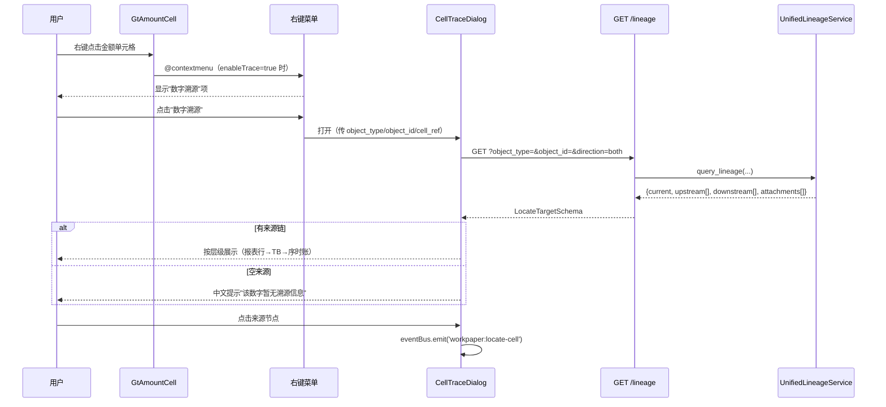
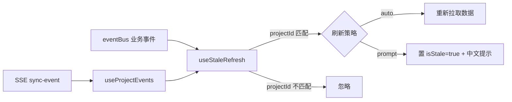
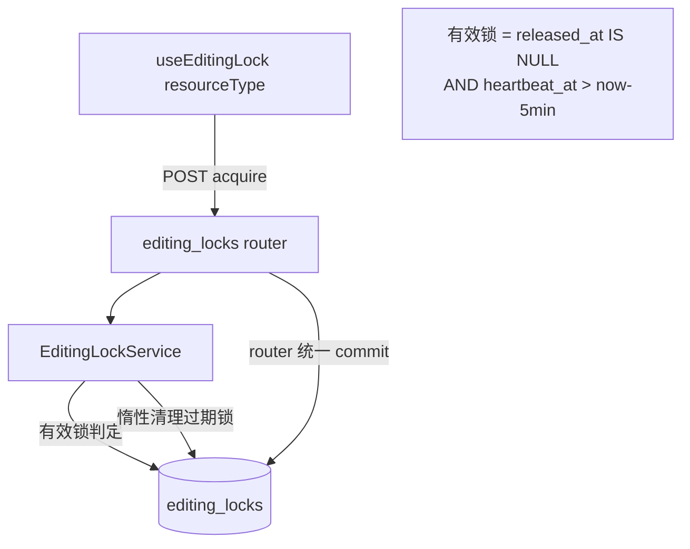
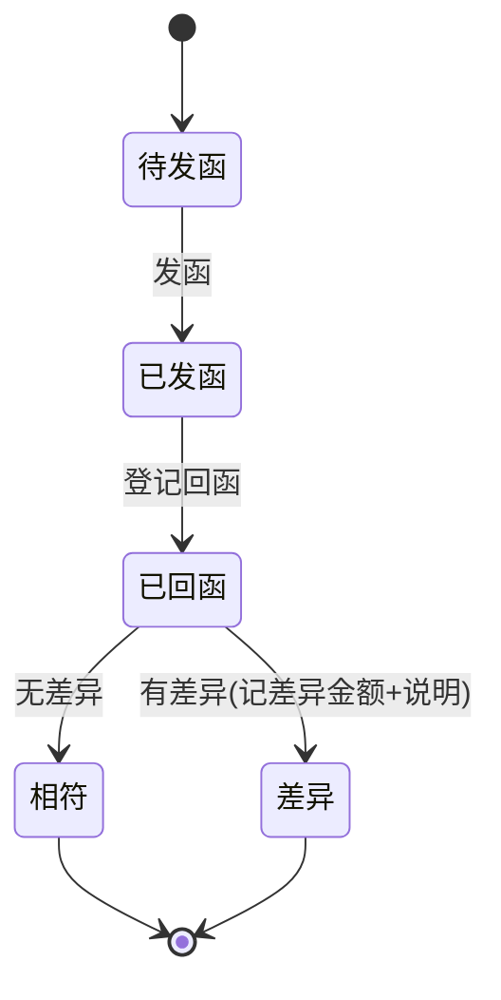

# Design Document — global-refinement-v5-closure

## Overview

本设计基于 v5.0 全局复盘确认的 4 个真实缺口，遵循"最小增量"原则：**能复用绝不新建**。四个能力域的复用边界已通过真实代码勘察确认：

- **A｜T5 单元格数字溯源**：后端基建（`unified_lineage_service` + `GET /lineage` 端点 + `router_registry/report.py §97` 注册）已 100% 就绪，前端 `useCellLocate`/`CellTraceDialog`/eventBus `workpaper:locate-cell` 已存在。本域**纯前端接线**：给 `GtAmountCell` 加可选右键菜单 → 调已有 `/lineage` 端点 → 复用 `CellTraceDialog` 展示。**零新建后端**。
- **B｜T5/T6 stale 全局刷新**：`useProjectEvents` composable 与 eventBus 全部事件已存在，当前约 6 文件接入。本域**前端范式统一**：抽 `useStaleRefresh` composable 封装"监听上游事件 → stale 标记/重拉"通用逻辑，六大数据页接入（6→12+）。**零新建后端**。
- **C｜T8 通用编辑锁**：以现有 `workpaper_editing_lock_models` + `editing_lock_service`（5min heartbeat 惰性清理模式）为蓝本，**新建**通用 `editing_locks` 表（resource_type 维度）+ V057 迁移 + ORM + `EditingLockService` + 通用 router；前端 `useEditingLock` 扩展 `resourceType` 参数，附注/报告编辑器从前端降级改真后端锁。
- **D｜T12 函证模块**：从 18 行 stub **全新建**：`confirmations` 表 + V058 迁移 + ORM + `ConfirmationService`（CRUD + 状态机）+ 重写 router + 前端 `ConfirmationList` 视图。

### 现状 grep 确认（复用 vs 新建边界）

| 能力域 | 产物 | 状态 | 代码锚点 |
|--------|------|------|----------|
| A | `GET /api/projects/{pid}/lineage` 端点 | ✅ 已有复用 | `backend/app/routers/lineage.py` |
| A | `UnifiedLineageService.query_lineage` | ✅ 已有复用 | `backend/app/services/unified_lineage_service.py` |
| A | lineage router 注册 | ✅ 已有复用 | `backend/app/router_registry/report.py §97` |
| A | `useCellLocate` / `LocateTarget` | ✅ 已有复用 | `frontend/src/composables/useCellLocate.ts` |
| A | `CellTraceDialog` | ✅ 已有复用 | `frontend/src/components/notes/CellTraceDialog.vue` |
| A | eventBus `workpaper:locate-cell` | ✅ 已有复用 | `frontend/src/utils/eventBus.ts` |
| A | `GtAmountCell` 右键菜单 + 上下文 prop | 🆕 新建（前端） | `frontend/src/components/common/GtAmountCell.vue` |
| B | `useProjectEvents`（SSE 项目级过滤） | ✅ 已有复用 | `frontend/src/composables/useProjectEvents.ts` |
| B | eventBus `trial-balance:updated`/`adjustment:saved`/`year:changed`/`dataset:activated` | ✅ 已有复用 | `frontend/src/utils/eventBus.ts` |
| B | `useStaleRefresh` 通用范式 composable | 🆕 新建（前端） | `frontend/src/composables/useStaleRefresh.ts` |
| C | `WorkpaperEditingLock` ORM（5min heartbeat 蓝本） | ✅ 已有参考 | `backend/app/models/workpaper_editing_lock_models.py` |
| C | `editing_lock_service`（acquire/release/heartbeat/force） | ✅ 已有参考 | `backend/app/services/editing_lock_service.py` |
| C | 通用 `editing_locks` 表 + V057 迁移 | 🆕 新建 | `backend/migrations/V057__*.sql` + `R057__*.sql` |
| C | `EditingLock` ORM + `EditingLockService` + 通用 router | 🆕 新建 | `backend/app/models/editing_lock_models.py` 等 |
| C | `useEditingLock` 扩展 `resourceType` | 🔧 改造（前端） | `frontend/src/composables/useEditingLock.ts` |
| D | `confirmations.py` router（18 行 stub） | 🔧 重写 | `backend/app/routers/confirmations.py` |
| D | confirmations 表 + V058 迁移 + ORM + service | 🆕 新建 | `backend/migrations/V058__*.sql` 等 |
| D | confirmations router 注册 | ✅ 已注册（重写沿用） | `backend/app/router_registry/collaboration.py §12` |
| D | eventBus `confirmation:received` | ✅ 已有复用 | `frontend/src/utils/eventBus.ts` |

**迁移排号**：当前最高 V056。编辑锁占 **V057**（`V057__editing_locks.sql` + `R057__editing_locks_rollback.sql`），函证占 **V058**（`V058__confirmations.sql` + `R058__confirmations_rollback.sql`）。按 version 数字唯一排号，不撞 V056。

## Architecture

### 能力域 A｜T5 单元格数字溯源（前端接线）



**设计要点**：
- `GtAmountCell` 新增可选 prop `traceContext?: { objectType, objectId, cellRef? }` + `enableTrace?: boolean`（默认 false，不破坏既有用法）。仅当 `enableTrace=true` 且 `traceContext` 存在时绑定 `@contextmenu`。
- 六大页通过各自的 prop 注入 `traceContext`：报表行用 `object_type=report_row` + `object_id=row_code`；TB 用 `tb_row` + `standard_account_code`；附注用 `note_cell` + `section_number`；底稿用 `wp_cell` + `wp_code!cell_ref`；调整用 `adjustment` + `adjustment_no`。
- 右键菜单为轻量内联组件（`GtCellContextMenu.vue` 或直接在 GtAmountCell 内用 teleport 浮层），仅"数字溯源"一项；GtAmountCell 改动**影响全仓**，须先跑 `codegraph impact "GtAmountCell"` 评估，prop 全部可选保证既有调用零改动。

### 能力域 B｜stale 全局刷新（前端范式）



**设计要点**：
- 新建 `useStaleRefresh(projectId, { events, mode, onRefresh })` composable，内部委托 `useProjectEvents`（SSE 项目级）+ 直接订阅 eventBus 业务事件（`trial-balance:updated`/`adjustment:saved`/`dataset:activated`/`dataset:rolledback`/`year:changed`）。
- 暴露 `isStale: Ref<boolean>` + `refresh()` + `markFresh()`。`mode='auto'` 时事件到达直接调 `onRefresh`；`mode='prompt'` 时置 `isStale=true` 由页面渲染中文 stale 横幅。
- projectId 匹配判定**复用 `useProjectEvents` 已有过滤逻辑**（`payload.project_id !== projectId.value` 则忽略），eventBus 业务事件 payload 也带 `projectId` 字段同样过滤。
- 六大页（TrialBalance/ReportView/WorkpaperEditor/调整页/错报页/DisclosureEditor）`onMounted` 调用 `useStaleRefresh`，使接入文件数 6→12+。

### 能力域 C｜通用编辑锁（后端新建 + 前端改造）



**设计要点**：
- 完全复刻 `editing_lock_service` 的 5min heartbeat 惰性清理模式，但以 `(resource_type, resource_id)` 为锁维度（替代 `wp_id`）。
- service 只 `flush` 不 `commit`，router 统一 `commit`（项目铁律）。
- 并发不变量"同 (resource_type, resource_id) 活跃锁 ≤ 1"：service 层先惰性清理过期锁 → 查活跃锁 → 无则创建。为防并发 race，acquire 在写入前用 `SELECT ... FOR UPDATE`（PG 行锁）或唯一部分索引兜底。设计采用**部分唯一索引** `WHERE released_at IS NULL` 作为最终防线 + service 层 SAVEPOINT 捕获唯一冲突转为 409。
- 前端 `useEditingLock` 扩展：`resourceType` 从 `'workpaper' | 'other'` 改为接受任意字符串（`workpaper` 仍走旧底稿专用端点保持兼容，其余 `disclosure_note`/`audit_report` 走新通用端点 `/api/editing-locks`）。

### 能力域 D｜函证模块（全新建）



**设计要点**：
- `confirmations` 表项目级，含函证类型枚举（应收/应付/银行/借款）、状态枚举（待发函/已发函/已回函/相符/差异）、关联 `wp_id` + `account_code`、差异金额 + 差异说明。
- `ConfirmationService` 提供 CRUD + `transition_status(confirmation_id, target_status)`，仅允许合法转换，非法转换抛中文 `ValueError`（router 转 400）。
- 回函登记（→已回函）成功后由前端 emit eventBus `confirmation:received`（后端不直接发 SSE，与现有事件体系一致）。
- 重写 `confirmations.py` 替换 stub，沿用 `router_registry/collaboration.py §12` 既有注册（prefix `/api`）。
- 前端新建 `ConfirmationList.vue`（中文 UI + GtAmountCell 展示金额 + GT 紫令牌）。

## Components and Interfaces

### A — 前端

```typescript
// GtAmountCell.vue 新增 props（全部可选，向后兼容）
interface TraceContext {
  objectType: 'wp_cell' | 'report_row' | 'note_cell' | 'tb_row' | 'adjustment'
  objectId: string          // 如 'D2-1!B5' / row_code / section_number / account_code
  cellRef?: string
}
props: {
  enableTrace?: boolean        // 默认 false
  traceContext?: TraceContext  // 默认 undefined
}
emit: {
  'trace-request': [ctx: TraceContext]  // 由页面或内置弹窗接住
}

// CellTraceDialog（复用）：新增打开入参对齐 lineage 端点
function openTrace(ctx: TraceContext): void  // 内部 GET /lineage
```

### B — 前端

```typescript
// useStaleRefresh.ts（新建）
interface StaleRefreshOptions {
  events?: Array<keyof Events>   // 默认 ['trial-balance:updated','adjustment:saved','dataset:activated','dataset:rolledback','year:changed']
  mode?: 'auto' | 'prompt'       // 默认 'prompt'
  onRefresh: () => void | Promise<void>
}
function useStaleRefresh(
  projectId: Ref<string>,
  options: StaleRefreshOptions
): {
  isStale: Ref<boolean>
  refresh: () => Promise<void>
  markFresh: () => void
}
```

### C — 后端

```python
# EditingLockService（新建，复刻 editing_lock_service 模式，维度改 resource_type+resource_id）
async def acquire_lock(db, resource_type: str, resource_id: str, holder_id: UUID, holder_name: str) -> dict
async def release_lock(db, resource_type: str, resource_id: str, holder_id: UUID) -> dict
async def heartbeat_lock(db, resource_type: str, resource_id: str, holder_id: UUID) -> dict
async def force_acquire_lock(db, resource_type: str, resource_id: str, holder_id: UUID, holder_name: str) -> dict
async def get_active_locks(db, resource_type: str | None = None) -> list[dict]

# router（新建）prefix=/api/editing-locks
POST   /api/editing-locks/{resource_type}/{resource_id}            # acquire
PATCH  /api/editing-locks/{resource_type}/{resource_id}/heartbeat  # 续期
DELETE /api/editing-locks/{resource_type}/{resource_id}            # release
POST   /api/editing-locks/{resource_type}/{resource_id}/force      # force-acquire
GET    /api/editing-locks/active                                   # 活跃锁列表
```

### D — 后端

```python
# ConfirmationService（新建）
async def create_confirmation(db, project_id: UUID, data: dict) -> dict
async def list_confirmations(db, project_id: UUID) -> list[dict]
async def get_confirmation(db, confirmation_id: UUID) -> dict
async def update_confirmation(db, confirmation_id: UUID, data: dict) -> dict
async def delete_confirmation(db, confirmation_id: UUID) -> dict
async def transition_status(db, confirmation_id: UUID, target: ConfirmationStatus) -> dict  # 状态机校验

# router（重写 confirmations.py）prefix=/projects/{project_id}/confirmations
GET    ""                          # 列表（替换 developing stub）
POST   ""                          # 创建
GET    /{confirmation_id}          # 详情（含关联+差异）
PUT    /{confirmation_id}          # 更新
DELETE /{confirmation_id}          # 删除
POST   /{confirmation_id}/transition  # 状态推进
```

## Data Models

### C — editing_locks（V057）

```sql
-- V057__editing_locks.sql
CREATE TABLE IF NOT EXISTS editing_locks (
    id            UUID         PRIMARY KEY DEFAULT gen_random_uuid(),
    resource_type VARCHAR(50)  NOT NULL,             -- disclosure_note / audit_report / workpaper / ...
    resource_id   VARCHAR(255) NOT NULL,             -- 资源标识（UUID 字符串 / 业务编码）
    holder_id     UUID         NOT NULL REFERENCES users(id),
    holder_name   VARCHAR(255),
    acquired_at   TIMESTAMPTZ  NOT NULL DEFAULT now(),
    heartbeat_at  TIMESTAMPTZ  NOT NULL DEFAULT now(),
    released_at   TIMESTAMPTZ
);

-- 锁查询索引（resource_type, resource_id）
CREATE INDEX IF NOT EXISTS idx_editing_locks_resource
    ON editing_locks (resource_type, resource_id);
CREATE INDEX IF NOT EXISTS idx_editing_locks_heartbeat
    ON editing_locks (heartbeat_at);

-- 并发不变量最终防线：同资源未释放锁唯一（部分唯一索引）
CREATE UNIQUE INDEX IF NOT EXISTS uq_editing_locks_active
    ON editing_locks (resource_type, resource_id)
    WHERE released_at IS NULL;
```

```sql
-- R057__editing_locks_rollback.sql
DROP TABLE IF EXISTS editing_locks;
```

> **不变量说明**：部分唯一索引 `WHERE released_at IS NULL` 保证同一资源任意时刻活跃锁 ≤ 1。过期但未清理的锁（heartbeat 超 5min）仍占索引位 → service 在 acquire 时**先惰性清理**（设 `released_at=now`）再插入新锁，确保过期锁不阻塞。

```python
# backend/app/models/editing_lock_models.py
class EditingLock(Base, TimestampMixin):
    __tablename__ = "editing_locks"
    id: Mapped[uuid.UUID] = mapped_column(PG_UUID(as_uuid=True), primary_key=True, default=uuid.uuid4)
    resource_type: Mapped[str] = mapped_column(String(50), nullable=False)
    resource_id: Mapped[str] = mapped_column(String(255), nullable=False)
    holder_id: Mapped[uuid.UUID] = mapped_column(PG_UUID(as_uuid=True), ForeignKey("users.id"), nullable=False)
    holder_name: Mapped[str | None] = mapped_column(String(255), nullable=True)
    acquired_at: Mapped[datetime] = mapped_column(sa.DateTime(timezone=True), nullable=False, server_default=sa.func.now())
    heartbeat_at: Mapped[datetime] = mapped_column(sa.DateTime(timezone=True), nullable=False, server_default=sa.func.now())
    released_at: Mapped[datetime | None] = mapped_column(sa.DateTime(timezone=True), nullable=True)
    __table_args__ = (
        Index("idx_editing_locks_resource", "resource_type", "resource_id"),
        Index("idx_editing_locks_heartbeat", "heartbeat_at"),
    )
```

### D — confirmations（V058）

```sql
-- V058__confirmations.sql
CREATE TABLE IF NOT EXISTS confirmations (
    id                UUID         PRIMARY KEY DEFAULT gen_random_uuid(),
    project_id        UUID         NOT NULL REFERENCES projects(id),
    confirm_type      VARCHAR(20)  NOT NULL,            -- receivable / payable / bank / loan
    counterparty      VARCHAR(255) NOT NULL,            -- 函证对象名称
    status            VARCHAR(20)  NOT NULL DEFAULT 'pending',  -- pending/sent/returned/matched/discrepancy
    wp_id             UUID         REFERENCES working_paper(id),  -- 关联底稿
    account_code      VARCHAR(50),                      -- 关联 TB 科目编码
    book_amount       NUMERIC(20,2),                    -- 账面金额
    confirmed_amount  NUMERIC(20,2),                    -- 回函金额
    diff_amount       NUMERIC(20,2),                    -- 差异金额
    diff_note         TEXT,                             -- 差异说明
    created_by        UUID         REFERENCES users(id),
    created_at        TIMESTAMPTZ  NOT NULL DEFAULT now(),
    updated_at        TIMESTAMPTZ  NOT NULL DEFAULT now()
);

CREATE INDEX IF NOT EXISTS idx_confirmations_project ON confirmations (project_id);
CREATE INDEX IF NOT EXISTS idx_confirmations_status  ON confirmations (status);
```

```sql
-- R058__confirmations_rollback.sql
DROP TABLE IF EXISTS confirmations;
```

```python
# backend/app/models/confirmation_models.py
class ConfirmationType(str, enum.Enum):
    receivable = "receivable"   # 应收
    payable = "payable"         # 应付
    bank = "bank"               # 银行
    loan = "loan"               # 借款

class ConfirmationStatus(str, enum.Enum):
    pending = "pending"           # 待发函
    sent = "sent"                 # 已发函
    returned = "returned"         # 已回函
    matched = "matched"           # 相符
    discrepancy = "discrepancy"   # 差异

class Confirmation(Base, TimestampMixin):
    __tablename__ = "confirmations"
    id: Mapped[uuid.UUID] = mapped_column(PG_UUID(as_uuid=True), primary_key=True, default=uuid.uuid4)
    project_id: Mapped[uuid.UUID] = mapped_column(PG_UUID(as_uuid=True), ForeignKey("projects.id"), nullable=False)
    confirm_type: Mapped[str] = mapped_column(String(20), nullable=False)
    counterparty: Mapped[str] = mapped_column(String(255), nullable=False)
    status: Mapped[str] = mapped_column(String(20), nullable=False, default="pending")
    wp_id: Mapped[uuid.UUID | None] = mapped_column(PG_UUID(as_uuid=True), ForeignKey("working_paper.id"), nullable=True)
    account_code: Mapped[str | None] = mapped_column(String(50), nullable=True)
    book_amount: Mapped[Decimal | None] = mapped_column(sa.Numeric(20, 2), nullable=True)
    confirmed_amount: Mapped[Decimal | None] = mapped_column(sa.Numeric(20, 2), nullable=True)
    diff_amount: Mapped[Decimal | None] = mapped_column(sa.Numeric(20, 2), nullable=True)
    diff_note: Mapped[str | None] = mapped_column(sa.Text, nullable=True)
    created_by: Mapped[uuid.UUID | None] = mapped_column(PG_UUID(as_uuid=True), ForeignKey("users.id"), nullable=True)
```

**合法状态转换表**（state machine）：

| 当前 → 目标 | pending | sent | returned | matched | discrepancy |
|-------------|---------|------|----------|---------|-------------|
| pending     | -       | ✅   | ❌       | ❌      | ❌          |
| sent        | ❌      | -    | ✅       | ❌      | ❌          |
| returned    | ❌      | ❌   | -        | ✅      | ✅          |
| matched     | ❌      | ❌   | ❌       | -       | ❌          |
| discrepancy | ❌      | ❌   | ❌       | ❌      | -           |

`_ALLOWED_TRANSITIONS = {pending: {sent}, sent: {returned}, returned: {matched, discrepancy}, matched: set(), discrepancy: set()}`

## Correctness Properties

*A property is a characteristic or behavior that should hold true across all valid executions of a system—essentially, a formal statement about what the system should do. Properties serve as the bridge between human-readable specifications and machine-verifiable correctness guarantees.*

经 prework 分析与属性反思（合并冗余）后，本 spec 保留 9 条核心属性。事件分发的 4 条验收标准（4.2/4.4/5.1/5.2）合并为单一分发不变量 P2；并发锁的 3 条（7.1/8.1/8.2）合并为活跃锁唯一不变量 P3；函证 CRUD 的 5 条（10.3/10.4/10.5/12.1/12.3）合并为持久化往返 P8；状态机 2 条（11.2/11.3）合并为 P9。

### Property 1: 溯源请求载荷完整性

*For any* 有效的 traceContext（objectType + objectId，可选 cellRef），当用户触发"数字溯源"时，发出的事件/请求载荷应包含项目标识、对象类型、对象标识，且 cellRef 存在时也应包含。

**Validates: Requirements 1.3**

### Property 2: 项目级事件分发不变量

*For any* 上游变更事件（`trial-balance:updated` / `adjustment:saved` / `dataset:activated` / `dataset:rolledback` / `year:changed`）与任意 projectId，当事件 projectId 与当前页 projectId 匹配时 useStaleRefresh 应触发刷新或置 stale；当不匹配时应忽略不触发。

**Validates: Requirements 4.2, 4.4, 5.1, 5.2**

### Property 3: 编辑锁活跃数唯一不变量

*For any* 作用于同一 (resource_type, resource_id) 的 acquire 请求序列（来自不同持有人），任意时刻该资源的活跃锁（released_at IS NULL 且 heartbeat 未过期）数量不超过 1；第二个持有人的 acquire 应被拒绝并返回当前持有人信息。

**Validates: Requirements 7.1, 8.1, 8.2**

### Property 4: 锁获取-释放往返

*For any* 资源，持有人 acquire 成功后再 release，该资源应回到无活跃锁状态，使得后续任意持有人的 acquire 可成功获取。

**Validates: Requirements 7.2**

### Property 5: 心跳续约保持锁有效并刷新时间

*For any* 持有有效锁的持有人，调用 heartbeat 后该锁的 heartbeat_at 应不早于调用前，且锁仍为活跃状态。

**Validates: Requirements 7.3**

### Property 6: 强制获取转移持有权

*For any* 已被持有的资源，调用 force-acquire 后新持有人应持有该资源唯一活跃锁，且返回的前持有人标识等于原持有人。

**Validates: Requirements 7.4**

### Property 7: 过期锁不阻塞新获取

*For any* 资源，若其活跃锁的 heartbeat_at 早于过期阈值（now - 5min），则其他持有人的 acquire 应成功获取（过期锁被惰性清理，不阻塞）。

**Validates: Requirements 8.3**

### Property 8: 函证持久化往返

*For any* 函证记录（含类型/对手方/可选关联底稿/可选 TB 科目/可选差异金额与说明），创建后通过列表或详情查询应能取回，且字段值与创建时一致；更新后查询反映更新值，删除后不再出现在列表中。

**Validates: Requirements 10.3, 10.4, 10.5, 12.1, 12.3**

### Property 9: 函证状态机合法性

*For any* 当前状态与目标状态的组合，仅当 (当前, 目标) 属于 `_ALLOWED_TRANSITIONS`（pending→sent, sent→returned, returned→matched, returned→discrepancy）时 transition 应成功；其余所有组合应被拒绝并返回中文错误说明，且函证状态保持不变。

**Validates: Requirements 11.2, 11.3**

## Error Handling

### A — 溯源
- 后端 `/lineage` 查询失败：`UnifiedLineageService` 各 `_query_*` 已内部 try/except 降级返回空列表（不抛），端点正常返回空来源链。
- 前端 `CellTraceDialog` GET 失败：经 `handleApiError` 展示中文错误提示，弹窗保持可用（Req 2.4）。
- 空来源链：弹窗显示中文"该数字暂无溯源信息"，不渲染空白弹窗（Req 1.4）。

### B — stale 刷新
- `onRefresh` 回调抛错：useStaleRefresh 捕获并保持 `isStale=true`，由页面 `handleApiError` 提示，不影响事件订阅。
- 事件 payload 缺 projectId：视为不匹配，忽略（与 useProjectEvents 既有行为一致）。

### C — 编辑锁
- acquire 锁冲突：返回 HTTP 409 + `{error_code: "LOCK_HELD", locked_by, locked_by_name, acquired_at}`（中文持有人名）。
- 部分唯一索引冲突（并发 race）：service 用 SAVEPOINT 捕获 `IntegrityError`，转为 409 锁冲突（不让事务污染，遵守 asyncpg 事务铁律）。
- heartbeat/release 无活跃锁：返回 404 中文"无活跃锁"。
- service 只 flush，router 统一 commit；冲突路径在 commit 前 rollback 到 SAVEPOINT。

### D — 函证
- 非法状态转换：`ConfirmationService.transition_status` 抛中文 `ValueError`，router 转 HTTP 400（如"不能从『已发函』直接转为『相符』"）。
- 函证不存在：返回 404 中文"函证记录不存在"。
- 创建缺必填字段（confirm_type/counterparty）：Pydantic 校验 422，或 service 显式中文校验。
- 写库前对可选字段用 `(data.get(k) or None)` 显式兜底，避免 `dict.get(k, default)` 在值为 None 时插入崩（项目铁律）。

## Testing Strategy

### 双层测试方法
- **单元/示例测试**：覆盖具体示例、边界、错误条件——溯源空来源提示、菜单中文文本、迁移幂等、枚举定义、UI 只读提示、事件触发等（prework 标记 `yes - example` 的项）。
- **属性测试（PBT）**：覆盖 9 条 Correctness Properties 的全称量化行为。

### PBT 配置（项目铁律）
- 库：后端 Python 用 **hypothesis**；前端 TS 用 **fast-check**（与既有前端 PBT 一致）。
- **每个属性测试配置 `max_examples=5`**（用户明确要求，禁默认 100）。hypothesis 用 `@settings(max_examples=5)`，fast-check 用 `{ numRuns: 5 }`。
- 每条属性由**单个** PBT 测试实现。
- 测试标签格式：`# Feature: global-refinement-v5-closure, Property {N}: {property_text}`。
- 不从零实现 PBT 框架。

### 属性→测试映射

| 属性 | 测试位置 | 库 | 备注 |
|------|----------|-----|------|
| P1 溯源载荷完整性 | 前端 `__tests__/GtAmountCell.trace.spec.ts` | fast-check | 随机 traceContext 验证 emit 载荷字段 |
| P2 事件分发不变量 | 前端 `__tests__/useStaleRefresh.spec.ts` | fast-check | 随机事件+projectId，匹配触发/不匹配忽略 |
| P3 活跃锁≤1 | 后端 `tests/services/test_editing_lock_service.py` | hypothesis | 随机 acquire 序列断言活跃锁数≤1（pg_only，部分唯一索引需 PG） |
| P4 release 往返 | 后端 同上 | hypothesis | acquire→release→acquire 成功 |
| P5 heartbeat 续约 | 后端 同上 | hypothesis | heartbeat 后 heartbeat_at 不减且活跃 |
| P6 force-acquire | 后端 同上 | hypothesis | 强抢后新持有人唯一+返回前持有人 |
| P7 过期锁不阻塞 | 后端 同上 | hypothesis | 注入过期 heartbeat 后 acquire 成功 |
| P8 函证 CRUD 往返 | 后端 `tests/services/test_confirmation_service.py` | hypothesis | 随机函证创建/更新/删除往返 |
| P9 状态机合法性 | 后端 同上 | hypothesis | 随机 (当前,目标) 组合验证接受/拒绝 |

### 测试环境注意
- 测试默认 SQLite in-memory（conftest），**P3/P7 依赖部分唯一索引 `WHERE released_at IS NULL` 是 PG 特性** → 标 `pg_only` marker，非 PG 自动 skip；P3 service 层 SAVEPOINT 逻辑同样需真 PG 验证。在 SQLite 上验证 service 的惰性清理/状态机纯逻辑部分。
- 编辑锁/函证 service 隔离测试用 in-process ASGI 或全 app model 加载，避免 FK `NoReferencedTableError`。
- 前端 fast-check 测试 mock eventBus 与 api，不依赖真实后端。

### 跨能力域门禁
- 新增/改动文件后跑 `python backend/scripts/check/check_file_size.py`（exit 0），撑大优先抽伴生模块而非抬基线。
- 三层一致校验：C/D 域必须 DB 迁移（V057/V058 + R 回滚）+ ORM `Mapped[]` + service 方法齐全，缺一视为伪绿。
- 新 router 必在 `router_registry` 注册（编辑锁需在 `collaboration.py` 或 `workpaper.py` 注册；函证沿用 `collaboration.py §12` 既有注册）。
- UI 全中文 + GtAmountCell + GT 紫令牌验收。
