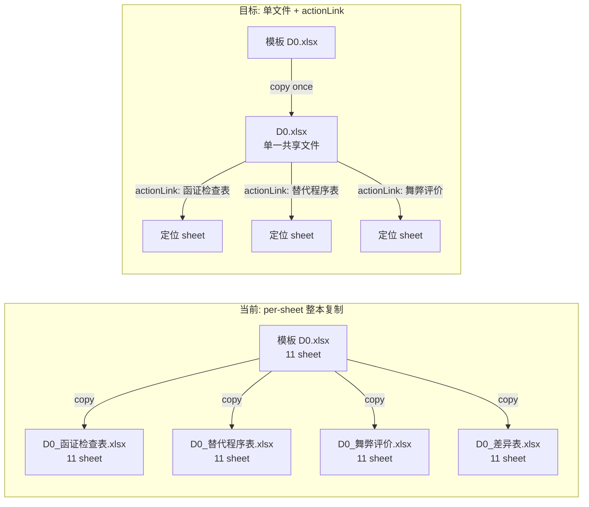
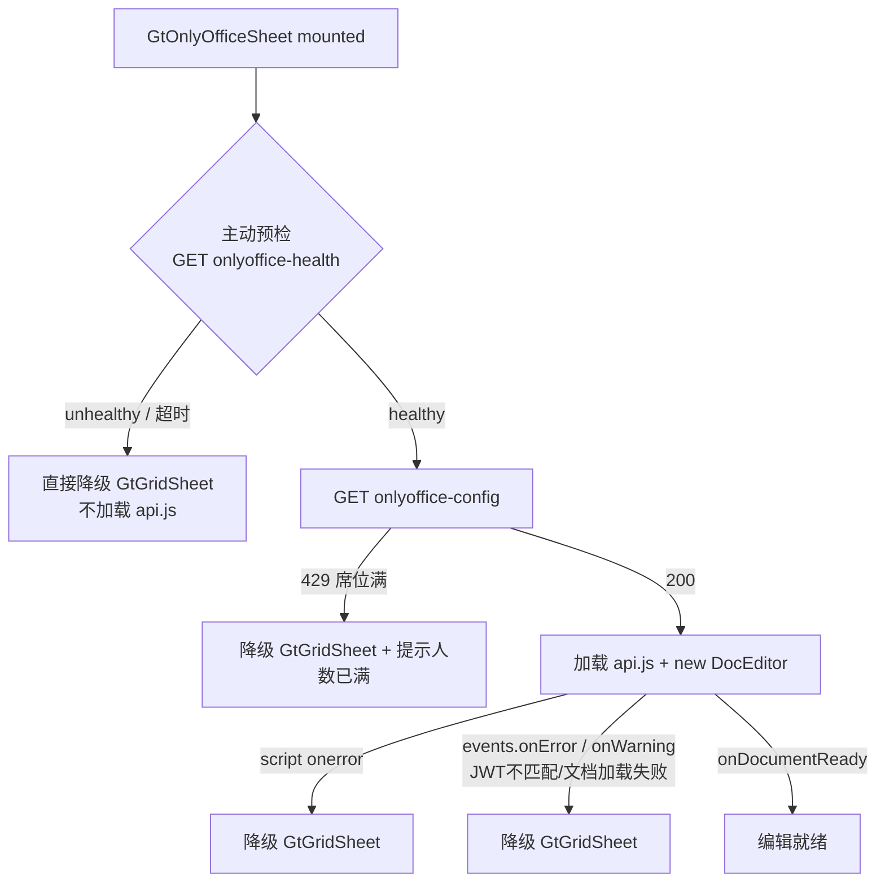
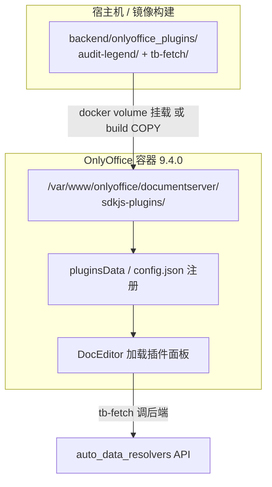
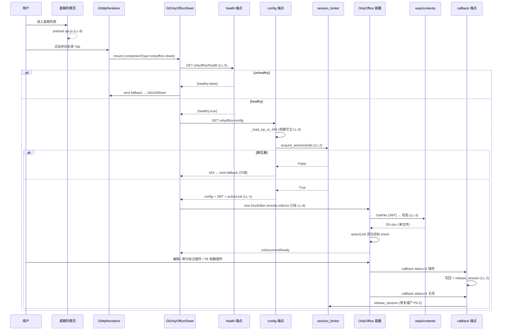

# 设计文档：底稿 OnlyOffice 集成优化（onlyoffice-integration-hardening）

## Overview

底稿模块已上线 OnlyOffice WOPI 集成（spec `d0-onlyoffice-migration`），采用**纯 iframe DocEditor 嵌入**渲染非白名单多 sheet 底稿（函证检查表/替代程序表/测算表等），降级到 `GtGridSheet` 只读网格。本 spec 在不改变"白名单 HTML / 非白名单 OnlyOffice / 降级只读网格"三层架构的前提下，修复 7 个经代码复核确认的缺陷（4 个 P0 + 3 个复核新增），落地 4 项工程优化，并新增 OnlyOffice Plugin SDK 方向（审计标识标注插件 + 取数联动插件）作为增强亮点。

核心矛盾是：当前实现把"能跑通"做出来了，但**并发限制器是死代码**、**per-sheet 整本复制**、**WOPI 端点零鉴权**、**前端 catch 不到 iframe 内部错误**——在 6000 人并发目标下会直接崩（每文档约 500MB，无席位约束的容器无限拉起），且存在越权下载底稿文件的安全风险。

本设计同时给出 **High-Level**（会话生命周期管理、单文件共享模型、健康预检降级链、插件载入机制 + 数据流图 + 组件关系）和 **Low-Level**（每个修复点的文件改动 + 函数级伪代码 + Plugin SDK 目录/config/manifest 骨架）。

### 约束与铁律（贯穿全设计）

- **JWT secret 三处一致**：`onlyoffice-dev-2026` = `config.py` + `docker-compose` + `local.json`，任何改动不触碰 secret 取值。
- **改 JSON override 需 touch `app/*.py`**：JSON 改动不触发 uvicorn reload，且 `_WP_CODE_OVERRIDE` 是模块级快照。
- **per-sheet renderer 隔离**：dispatch 循环单 sheet 失败不得拖垮整个底稿（已有 try/except+rollback）。
- **改动后必 Playwright 实测**；**1101+ render-config 冒烟零回归**；**5 个验收门槛见 tasks**。
- **共享容器**：底稿与交付模块共用同一 OnlyOffice 容器，所有改动不得影响交付模块（`onlyoffice_callback_service.py` 等）。

---

## High-Level Design

### HL-1 整体架构

```mermaid
graph TD
    subgraph Frontend["前端 audit-platform/frontend"]
        WPL[底稿列表页<br/>iframe preload]
        RENDER[GtWpRenderer<br/>componentType 分发]
        OOSHEET[GtOnlyOfficeSheet<br/>DocEditor iframe + events]
        GRID[GtGridSheet<br/>只读降级兜底]
    end

    subgraph Backend["后端 backend/app"]
        CFG["GET onlyoffice-config<br/>(席位获取 + doc_key + JWT)"]
        WOPI["GET wopi/contents<br/>(JWT 鉴权 + 单文件)"]
        CB["POST onlyoffice-callback<br/>(席位释放 + 写回)"]
        HEALTH["GET onlyoffice-health<br/>(健康预检)"]
        LIM[onlyoffice_session_limiter<br/>Redis 原子席位]
        SVC[onlyoffice_callback_service<br/>health_check 复用]
    end

    subgraph OO["OnlyOffice 容器 9.4.0 (共享)"]
        DOC[DocumentServer<br/>~500MB/doc]
        PLUGINS[自定义插件目录<br/>volume 挂载]
    end

    WPL -.preload api.js.-> OOSHEET
    RENDER -->|onlyoffice-sheet| OOSHEET
    RENDER -->|降级| GRID
    OOSHEET -->|1.预检| HEALTH
    OOSHEET -->|2.取配置| CFG
    OOSHEET -->|3.new DocEditor| DOC
    OOSHEET -->|events.onError 降级| GRID
    CFG --> LIM
    CB --> LIM
    HEALTH --> SVC
    DOC -->|GetFile| WOPI
    DOC -->|status callback| CB
    DOC -.加载.-> PLUGINS
    PLUGINS -->|审计标注/取数联动| DOC
```

### HL-2 会话生命周期管理（席位模型）

当前 `acquire_session`/`release_session` 全仓零调用 → config 端点从不获取席位 → 容器无限拉起。修复后形成完整生命周期：

```mermaid
sequenceDiagram
    participant FE as GtOnlyOfficeSheet
    participant CFG as onlyoffice-config
    participant LIM as session_limiter(Redis)
    participant CB as onlyoffice-callback

    FE->>CFG: GET config(wp_id, sheet_name)
    CFG->>LIM: acquire_session(user_id, doc_key)
    alt 席位已满 (count >= MAX_SESSIONS)
        LIM-->>CFG: False
        CFG-->>FE: 429 编辑人数已满
        FE->>FE: 降级 GtGridSheet (只读)
    else 获取成功 / 幂等续期
        LIM-->>CFG: True (set ex=TTL)
        CFG-->>FE: 200 config + JWT
        FE->>FE: new DocEditor (edit)
    end

    Note over FE,CB: 用户编辑 → 保存 / 关闭
    FE->>CB: callback status=2/6 (保存)
    CB->>CB: 下载写回文件
    FE->>CB: callback status=4 (关闭无修改)
    CB->>LIM: release_session(user_id, doc_key)
    Note over LIM: status=2 保存后也释放;<br/>TTL 仅作僵尸兜底
```

**席位释放触发点**（修复 P0-2）：
- `status=4`（关闭无修改）→ `release_session`
- `status=2`（保存后关闭）→ 写回成功后 `release_session`
- `status=3/7`（保存出错关闭）→ `release_session`（避免出错会话占座）
- TTL（`_SESSION_TTL=3600`）仅作最终兜底，不再是唯一回收手段。

**user_id 来源问题**：callback 端点当前无 `current_user`（OnlyOffice 容器内部调用，无用户态）。释放席位需要 `user_id + doc_key`。设计采用：config 端点把 `user_id` 写入 callback body 能携带的字段——OnlyOffice callback body 含 `users:[]` 与 `actions:[{type,userid}]`，从中提取 `userid`；doc_key 从 callback body 的 `key` 字段提取。详见 LL-2。

### HL-3 单文件共享模型（修复 P0-3 + P0-4）

当前 `_resolve_sheet_file` 按 `{wp_code}_{sheet_name}.xlsx` per-sheet 整本复制：D0 有 4 个非白名单 sheet → 生成 4 份完整工作簿，且每份在 OnlyOffice 里显示全部 tab（design §5 标记的"单 sheet 提取"从未落实）。

目标模型：**按 `wp_code` 单文件共享 + OnlyOffice 内 actionLink 定位目标 sheet**。



**收益**：4 份完整工作簿 → 1 份；doc_key 含 sheet_name 解决冲突（P0-4）；OnlyOffice 用 `editorConfig.actionLink` 跳转到目标 sheet 而非显示全部 tab。

**doc_key 模型**（修复 P0-4）：当前 `_generate_doc_key(file_path)` 仅含 path+mtime，同一 `wp_code` 单文件下多 sheet 会得到**相同 doc_key**（同一文件）→ OnlyOffice 协议要求 key 唯一标识"文档+版本"，但单文件多 sheet 共享同一物理文件、同一编辑会话是**合理的**。关键修复点是：保存写回是整文件级别，多个 sheet 共享同一 doc_key 是**正确语义**（它们就是同一个文件）。因此 doc_key 改为 `hash(wp_code + file_mtime_ns)`，不再含 sheet_name——sheet 切换由 actionLink 负责，不需要不同 doc_key。

> 注：原 P0-4 描述"doc_key 不含 sheet_name 导致冲突"是基于 per-sheet 复制模型的；在单文件共享模型下，冲突问题自然消解——同 wp_code 所有 sheet 本就该共享同一 doc_key。本设计采纳单文件模型作为 P0-3 与 P0-4 的统一解。

### HL-4 健康预检降级链（修复优化项 + R6 语义修正）

R6 声称"前端主动检测健康降级"，实际是"加载失败才降级"（被动）。`onlyoffice_callback_service.health_check()` 已存在但底稿模块无对应端点。



三层降级（修复 P-7）：
1. **主动预检层**：mounted 时先 `GET onlyoffice-health`，不健康直接降级，避免无谓加载 api.js。
2. **配置层**：429（席位满）/ 404 / 超时 → 降级。
3. **iframe 内部层**（修复 P-7 核心）：接 `events.onError` / `events.onWarning` —— JWT 不匹配、文档加载失败发生在 iframe 内部，脚本本身成功加载，Vue 侧 `try/catch` 捕获不到，必须通过 DocEditor 的 events 回调才能感知并降级。

### HL-5 插件载入机制（增强亮点）

底稿模块当前**无任何 OO 插件**（纯 iframe DocEditor）。本 spec 引入 2 个插件方向：
- **审计标识/勾稽标注插件**（`audit-legend`）：单元格叠加审计符号（√ 已核对 / ⓒ 已计算 / ➜ 索引跳转），移植平台已有 `audit-legend` 的 HTML 版逻辑。
- **取数联动插件**（`tb-fetch`）：选中单元格右键"从 TB 取数"，调后端 `auto_data_resolvers` 把底稿联动能力带进 OnlyOffice。



容器侧加载两种方式（详见 LL-7）：
- **方式 A（推荐，开发期）**：docker volume 挂载 `backend/onlyoffice_plugins/{plugin}` → 容器 `sdkjs-plugins/{plugin}`，改插件无需重建镜像。
- **方式 B（生产）**：自定义 Dockerfile `COPY` 插件目录进镜像，构建固化版本。

### HL-6 组件关系总览

| 层 | 组件 | 本 spec 改动 |
|---|---|---|
| 前端 | `GtOnlyOfficeSheet.vue` | 接 events.onError/onWarning、主动健康预检、只读 type:embedded |
| 前端 | 底稿列表页 | 新增 api.js preload |
| 前端 | `GtWpRenderer.vue` | 移除原 preload 责任（如有），保持分发 |
| 后端 | `wp_onlyoffice_router.py` | 4 端点全改：席位接入、单文件、WOPI 鉴权、软删守卫、新增 health |
| 后端 | `onlyoffice_session_limiter.py` | 接入（不改实现，改为被调用） |
| 后端 | `onlyoffice_callback_service.py` | 复用 health_check（不改） |
| 容器 | docker-compose / Dockerfile | 挂载插件目录 |
| 插件 | `backend/onlyoffice_plugins/` | 新增 audit-legend + tb-fetch 骨架 |

---

## Low-Level Design

下述伪代码均为对真实文件的函数级改动说明。后端为 Python（FastAPI + SQLAlchemy async），前端为 TypeScript（Vue 3 setup），插件为 OnlyOffice Plugin SDK（JS + config.json）。

### LL-0 通用 helper：软删守卫（修复 P-6，三端点复用）

`wp_onlyoffice_router.py` 三端点（config / wopi-contents / callback）当前只查 `WorkingPaper.is_deleted`，漏查 `projects.is_deleted`。复用 render-config Step1.5 的同款裸 SQL。

```python
# 新增 helper（wp_onlyoffice_router.py）
async def _load_wp_or_404(db: AsyncSession, wp_id: UUID) -> tuple[WorkingPaper, str]:
    """查询底稿 + wp_code，并执行项目软删守卫。三端点统一入口。"""
    result = await db.execute(
        sa.select(WorkingPaper, WpIndex.wp_code)
        .join(WpIndex, WpIndex.id == WorkingPaper.wp_index_id)
        .where(
            WorkingPaper.id == wp_id,
            WorkingPaper.is_deleted == sa.false(),
        )
    )
    row = result.first()
    if row is None:
        raise HTTPException(status_code=404, detail="底稿不存在")
    wp, wp_code = row[0], row[1]

    # 项目软删守卫（复用 render-config Step1.5 同款裸 SQL）
    proj_deleted = (await db.execute(
        sa.text("SELECT is_deleted FROM projects WHERE id = :pid"),
        {"pid": str(wp.project_id)},
    )).scalar()
    if proj_deleted:
        raise HTTPException(status_code=404, detail="项目已删除")

    return wp, wp_code
```

三端点把现有的"查询底稿"代码块统一替换为 `wp, wp_code = await _load_wp_or_404(db, wp_id)`。

### LL-1 单文件共享 + doc_key（修复 P0-3 + P0-4）

```python
# 改 _resolve_sheet_file → _resolve_wp_file（去掉 per-sheet，按 wp_code 单文件）
def _resolve_wp_file(
    project_id: UUID,
    wp_code: str,
    template_path: Path | None,
) -> Path:
    """解析 wp_code 对应的单一共享 xlsx 文件（不再 per-sheet 复制）。

    Precondition: project_id 有效；wp_code 非空。
    Postcondition: 返回存在的文件路径；首次从模板复制一次（整本）。
    """
    storage_dir = _onlyoffice_storage_dir(project_id)
    file_name = f"{wp_code}.xlsx"           # ← 单文件命名，去掉 _{sheet_name}
    target = storage_dir / file_name

    if target.exists():
        return target
    if template_path and template_path.exists():
        storage_dir.mkdir(parents=True, exist_ok=True)
        shutil.copy2(template_path, target)
        return target
    raise FileNotFoundError(f"OnlyOffice 文件不存在且无模板可复制: {file_name}")


def _generate_doc_key(file_path: Path, wp_code: str) -> str:
    """doc_key = hash(wp_code + mtime_ns)。同 wp_code 所有 sheet 共享同一 key
    （它们是同一物理文件、同一编辑会话）。文件变更（mtime 变）→ key 变 → OO 重新加载。
    """
    stat = file_path.stat()
    raw = f"{wp_code}:{stat.st_mtime_ns}"
    return hashlib.md5(raw.encode()).hexdigest()
```

**config 端点构建 actionLink 定位目标 sheet**（替代显示全部 tab）：

```python
# get_sheet_onlyoffice_config 内，config 构建处新增 actionLink
config = {
    "document": {
        "fileType": "xlsx",
        "key": doc_key,
        "title": f"{wp_code}.xlsx",
        "url": download_url,
        "permissions": {"edit": mode == "edit", "download": True, "print": True},
    },
    "documentType": "cell",
    "editorConfig": {
        "mode": mode,
        "lang": "zh-CN",
        "callbackUrl": callback_url,
        "actionLink": {                      # ← 新增：打开后定位到目标 sheet
            "action": {"type": "bookmark", "data": sheet_name},
        },
        "user": {"id": str(current_user.id), "name": current_user.username},
        "customization": {"forcesave": True, "compactHeader": True},
    },
    "type": "desktop",
}
```

> actionLink 的具体定位实现：OnlyOffice 电子表格用 `action.type` 跳转。若 bookmark 形式不被 9.4.0 cell 文档支持，回退方案是由前端 `events.onDocumentReady` 后调 `editorInstance.serviceCommand` / 插件 API 切换 active sheet。Low-Level 任务阶段需以真实 9.4.0 实测确定最终 API（见 tasks 风险项）。

### LL-2 席位接入（修复 P0-1 + P0-2）

**config 端点获取席位**：

```python
# get_sheet_onlyoffice_config 内，生成 doc_key 后、构建 config 前插入
from app.services.onlyoffice_session_limiter import acquire_session

# 仅 edit 模式占席位；view（只读）不占（只读不拉起可编辑实例的重负载）
if mode == "edit":
    ok = await acquire_session(current_user.id, doc_key)
    if not ok:
        raise HTTPException(
            status_code=429,
            detail="当前编辑人数已满，请稍后再试",
        )
```

**callback 端点释放席位**（status=2 保存后 / 4 关闭 / 3/7 出错关闭）：

```python
# post_sheet_onlyoffice_callback 内
from app.services.onlyoffice_session_limiter import release_session

body = await request.json()
status = body.get("status")
doc_key = body.get("key")                      # OO callback body 含 key
# 从 actions 提取 userid（OO callback body: actions:[{type,userid}], users:[ids]）
user_id = _extract_user_id_from_callback(body)

# status=2/6 保存：先写回，写回成功后释放席位
if status in _SAVE_STATUSES:
    wp, wp_code = await _load_wp_or_404(db, wp_id)   # 含软删守卫
    ok = await _download_and_write_back(body, wp.project_id, wp_code)
    if ok and user_id and doc_key:
        await release_session(user_id, doc_key)      # 保存后会话关闭即释放
    return {"error": 0 if ok else 1}

# status=4 关闭无修改 / 3,7 出错关闭：释放席位（修复 P0-2 僵尸会话）
_RELEASE_STATUSES = {3, 4, 7}
if status in _RELEASE_STATUSES:
    if user_id and doc_key:
        await release_session(user_id, doc_key)
    return {"error": 0}

return {"error": 0}    # status=1 编辑中，无操作


def _extract_user_id_from_callback(body: dict) -> UUID | None:
    """从 OO callback body 提取 userid。
    actions[].userid 优先（含 type=0 断开/type=1 连接），回退 users[0]。
    """
    actions = body.get("actions") or []
    for a in actions:
        uid = a.get("userid")
        if uid:
            try:
                return UUID(uid)
            except ValueError:
                return None
    users = body.get("users") or []
    if users:
        try:
            return UUID(users[0])
        except (ValueError, TypeError):
            return None
    return None
```

> **MAX_SESSIONS 配置**：当前默认 10，6000 人并发目标下需基于容器内存（~500MB/doc）与服务器规格设定真实上限。设计建议作为 `ONLYOFFICE_MAX_SESSIONS` 环境变量配置，不写死；席位满返回 429 + 前端降级只读，保证不崩。

### LL-3 WOPI 鉴权（修复 P-5：注释与实现不符）

当前 `get_sheet_wopi_contents` 注释声称"靠 doc_key 不可预测性 + 内网隔离保障"，但端点**根本不校验 doc_key**，知道 `wp_id+sheet_name` 即可下载底稿文件。

修复：WOPI GetFile 请求由 OnlyOffice 容器发起，OnlyOffice 在请求 header 带 JWT（`editorConfig` 配置 `document.url` 时，DocumentServer 会对外发请求附带签名）。校验该 JWT。

```python
@router.get("/{wp_id}/sheets/{sheet_name}/wopi/contents")
async def get_sheet_wopi_contents(
    wp_id: UUID,
    sheet_name: str,
    request: Request,
    db: AsyncSession = Depends(get_db),
):
    """WOPI GetFile — JWT 鉴权后返回 xlsx 内容。

    安全模型修正：不再依赖"doc_key 不可预测性"（端点从不校验它）。
    改为校验 OnlyOffice 下载请求所带 JWT（Authorization header 或 ?token= 查询参数）。
    """
    # 1. JWT 鉴权（复用 callback 同款校验逻辑）
    if not _verify_wopi_jwt(request):
        raise HTTPException(status_code=403, detail="WOPI 请求未授权")

    # 2. 软删守卫 + 查底稿
    wp, wp_code = await _load_wp_or_404(db, wp_id)

    # 3. 单文件解析
    template_path = find_template_file_any(wp_code)
    try:
        file_path = _resolve_wp_file(wp.project_id, wp_code, template_path)
    except FileNotFoundError as exc:
        raise HTTPException(status_code=404, detail=str(exc))

    return FileResponse(
        path=str(file_path),
        media_type="application/vnd.openxmlformats-officedocument.spreadsheetml.sheet",
        filename=file_path.name,
    )


def _verify_wopi_jwt(request: Request) -> bool:
    """校验 WOPI GetFile 请求 JWT。
    OnlyOffice 对 document.url 的下载请求带 JWT（header 或 token 查询参数）。
    无 JWT_SECRET 配置（测试环境）→ 直通。
    """
    if not settings.ONLYOFFICE_JWT_SECRET:
        return True
    token = request.headers.get("Authorization") or request.query_params.get("token")
    if not token:
        logger.warning("WOPI GetFile 缺少 JWT, wp_id 越权下载风险")
        return False
    try:
        if token.lower().startswith("bearer "):
            token = token[7:]
        jwt.decode(token, settings.ONLYOFFICE_JWT_SECRET, algorithms=["HS256"])
        return True
    except JWTError as exc:
        logger.warning("WOPI GetFile JWT 校验失败: %s", exc)
        return False
```

> **JWT 透传细节**：OnlyOffice 9.4.0 对 `document.url` 的内部下载请求是否带 JWT，取决于容器 `local.json` 的 `services.CoAuthoring.token.inbox/outbox` 配置。设计需在实施时确认容器配置启用了 outbox token；若容器不对 GetFile 附带 JWT，回退方案为**短时效签名 token 嵌入 download_url**（config 端点生成 `?token=<jwt(exp=300s, wp_id, sheet)>`，WOPI 端点校验该 token）。两方案都消除"零鉴权"问题。

### LL-4 callback 软删守卫接入（修复 P-6）

callback 端点的查底稿块替换为 `_load_wp_or_404`（见 LL-0），已在 LL-2 的伪代码中体现（`wp, wp_code = await _load_wp_or_404(db, wp_id)`）。

### LL-5 新增健康预检端点（修复优化项）

```python
# wp_onlyoffice_router.py 新增端点（静态路径，注意放在 /{wp_id} 通配之前）
@router.get("/onlyoffice/health")
async def get_onlyoffice_health(db: AsyncSession = Depends(get_db)):
    """底稿模块 OnlyOffice 健康预检。复用交付模块已有 health_check，不重复实现。
    前端 GtOnlyOfficeSheet mounted 时主动调用，不健康直接降级（不加载 api.js）。
    """
    from app.services.onlyoffice_callback_service import OnlyOfficeCallbackService
    svc = OnlyOfficeCallbackService(db)
    healthy = await svc.health_check()
    active = await get_active_count()       # session_limiter.get_active_count
    return {
        "healthy": healthy,
        "active_sessions": active,
        "max_sessions": MAX_SESSIONS,
    }
```

> **路由顺序铁律**：`/onlyoffice/health` 是静态路径，必须注册在 `/{wp_id}/...` 动态通配之前，否则 `onlyoffice` 会被当成 `wp_id` 解析。

### LL-6 前端 GtOnlyOfficeSheet 改动（修复 P-7 + 优化项）

**(a) 主动健康预检 + (b) events.onError/onWarning 降级 + (c) 只读 type:embedded**

```typescript
// GtOnlyOfficeSheet.vue <script setup> 改动

async function initialize() {
  loading.value = true
  error.value = false
  try {
    // Step 0 (新增): 主动健康预检 — 不健康直接降级，不加载 api.js
    const health = await http.get('/api/workpapers/onlyoffice/health', { _silent: true } as any)
    if (!health.data?.healthy) {
      throw new Error('OnlyOffice unhealthy (preflight)')
    }

    // Step 1: 取配置（429 席位满 → 进 catch → 降级）
    const response = await http.get(
      `/api/workpapers/${props.wpId}/sheets/${encodeURIComponent(props.sheetName)}/onlyoffice-config`,
      { _silent: true } as any,
    )
    const { config, token, onlyoffice_url } = response.data
    const baseUrl = onlyoffice_url || import.meta.env.VITE_ONLYOFFICE_URL || ''
    if (!baseUrl) throw new Error('OnlyOffice URL not configured')

    // Step 2: 加载 api.js（preload 后通常已缓存，见 LL-8）
    await loadScript(`${baseUrl.replace(/\/$/, '')}/web-apps/apps/api/documents/api.js`)

    const DocsAPI = (window as any).DocsAPI
    if (!DocsAPI?.DocEditor) throw new Error('DocsAPI not available')

    const editorConfig: any = { ...config, token }

    // (c) 只读模式用 type:embedded（更轻、无工具栏）
    if (props.readonly || config?.editorConfig?.mode === 'view') {
      editorConfig.type = 'embedded'
      if (editorConfig.editorConfig) editorConfig.editorConfig.mode = 'view'
    } else {
      // 编辑模式保留公式/数据 Tab：不要设 toolbarNoTabs
      editorConfig.type = 'desktop'
    }

    // (b) 关键修复：接 events 捕获 iframe 内部错误（JWT 不匹配/文档加载失败）
    editorConfig.events = {
      onError: (e: any) => {
        console.warn('[GtOnlyOfficeSheet] DocEditor onError:', e?.data)
        handleFallback('doceditor-error')
      },
      onWarning: (e: any) => {
        console.warn('[GtOnlyOfficeSheet] DocEditor onWarning:', e?.data)
        // warning 不一定致命：仅记录，不强制降级（除非特定 warning code）
      },
      onDocumentReady: () => { loading.value = false },
      onRequestClose: () => { /* 可选：通知父组件 */ },
    }

    editorInstance = new DocsAPI.DocEditor(containerId.value, editorConfig)
    // loading 由 onDocumentReady 关闭（不再在 new 之后立即关）
  } catch (err: any) {
    console.warn('[GtOnlyOfficeSheet] init failed:', err?.message || err)
    handleFallback(err?.message)
  }
}

function handleFallback(reason?: string) {
  loading.value = false
  error.value = true
  emit('fallback')          // 父组件 GtWpRenderer 切到 GtGridSheet 只读
}
```

**要点**：
- `loading` 关闭时机从"`new DocEditor` 之后立即关"改为"`onDocumentReady` 回调里关"——否则文档还在 iframe 内加载就提前显示就绪。
- `onError` 是捕获 JWT 不匹配/文档损坏的唯一通道（脚本加载成功但文档加载失败）。

### LL-7 OnlyOffice Plugin SDK 骨架（增强亮点）

新增源码目录 `backend/onlyoffice_plugins/`（放后端仓便于与容器卷挂载，不进前端构建）：

```
backend/onlyoffice_plugins/
├── audit-legend/                  # 审计标识/勾稽标注插件
│   ├── config.json                # 插件清单（OO Plugin SDK 规范）
│   ├── index.html                 # 插件 UI 面板
│   ├── scripts/
│   │   └── code.js                # window.Asc.plugin 逻辑（叠加 √/ⓒ/➜）
│   ├── resources/
│   │   └── icons/                 # 工具栏图标 (icon.png / icon@2x.png)
│   └── translations/
│       └── langs.json             # zh-CN 文案
└── tb-fetch/                      # 取数联动插件
    ├── config.json
    ├── index.html
    ├── scripts/
    │   └── code.js                # 右键"从 TB 取数" → 调后端 auto_data_resolvers
    ├── resources/icons/
    └── translations/langs.json
```

**audit-legend/config.json 骨架**（OnlyOffice Plugin SDK 规范）：

```json
{
  "name": "审计标识",
  "guid": "asc.{A1B2C3D4-1111-2222-3333-AUDITLEGEND01}",
  "version": "1.0.0",
  "minVersion": "9.4.0",
  "variations": [
    {
      "description": "在选中单元格叠加审计符号（√已核对/ⓒ已计算/➜索引跳转）",
      "url": "index.html",
      "icons": ["resources/icons/icon.png", "resources/icons/icon@2x.png"],
      "isViewer": false,
      "EditorsSupport": ["cell"],
      "isVisual": true,
      "isModal": false,
      "isInsideMode": false,
      "initDataType": "none",
      "initData": "",
      "buttons": [],
      "events": ["onTargetEmpty", "onContextMenuClick"]
    }
  ]
}
```

**audit-legend/scripts/code.js 骨架**：

```javascript
(function (window, undefined) {
  window.Asc.plugin.init = function () {
    // 插件初始化：无需自动动作，等待用户点击工具栏/右键
  };

  // 在选中单元格写入审计符号（移植 audit-legend HTML 版的符号语义）
  function applyLegend(symbol) {
    // √ 已核对 / ⓒ 已计算 / ➜ 索引跳转
    window.Asc.plugin.executeMethod("GetSelectedText", [], function () {
      window.Asc.plugin.callCommand(function () {
        var oWorksheet = Api.GetActiveSheet();
        var oRange = oWorksheet.GetSelection();
        // 在单元格批注/前缀叠加符号（具体 API 实测确定）
        oRange.SetValue(/*symbol + 原值*/ );
      }, false);
    });
  }

  window.Asc.plugin.button = function (id) {
    this.executeCommand("close", "");
  };

  window.Asc.plugin.onTranslate = function () {};
})(window, undefined);
```

**tb-fetch/config.json**：右键菜单事件 `onContextMenuClick`，`code.js` 选中单元格 → `fetch('/api/workpapers/{wp_id}/auto-data?source=...')` 调 `auto_data_resolvers` → 回填单元格。需注意插件 iframe 跨域调后端，要么走 OnlyOffice 容器反代，要么后端 CORS 放行插件源。

> **安全提示**：tb-fetch 插件从浏览器侧调后端取数 API，需复用平台既有鉴权（携带 session/token）；不得在插件内硬编码任何密钥。auto_data_resolvers 调用须经现有项目权限校验。

### LL-8 前端 preload（修复优化项：3s 首加载）

api.js preload 从 `GtWpRenderer` 移到**底稿列表页**——用户进入底稿列表时即预热脚本，打开非白名单 sheet 时 api.js 已缓存，减少首次 tab 切换的 3s 加载。

```typescript
// 底稿列表页（如 WorkpaperList.vue / 列表 mounted）
onMounted(() => {
  const baseUrl = import.meta.env.VITE_ONLYOFFICE_URL || ''
  if (baseUrl) {
    const link = document.createElement('link')
    link.rel = 'preload'
    link.as = 'script'
    link.href = `${baseUrl.replace(/\/$/, '')}/web-apps/apps/api/documents/api.js`
    document.head.appendChild(link)
  }
})
```

> 仅 `<link rel=preload>`，不执行脚本——避免列表页无谓初始化 DocsAPI；真正 `new DocEditor` 仍在 GtOnlyOfficeSheet。

---

## LL-9 容器侧插件加载（docker volume / 镜像构建）

**方式 A（开发期推荐）— docker-compose volume 挂载**：

```yaml
# docker-compose.yml（OnlyOffice 服务，与交付模块共享容器）
services:
  onlyoffice:
    image: onlyoffice/documentserver:9.4.0
    environment:
      - JWT_ENABLED=true
      - JWT_SECRET=onlyoffice-dev-2026        # 三处一致铁律
    volumes:
      # 自定义插件挂载（改插件无需重建镜像）
      - ./backend/onlyoffice_plugins/audit-legend:/var/www/onlyoffice/documentserver/sdkjs-plugins/audit-legend:ro
      - ./backend/onlyoffice_plugins/tb-fetch:/var/www/onlyoffice/documentserver/sdkjs-plugins/tb-fetch:ro
```

**方式 B（生产）— 自定义 Dockerfile**：

```dockerfile
FROM onlyoffice/documentserver:9.4.0
COPY backend/onlyoffice_plugins/audit-legend /var/www/onlyoffice/documentserver/sdkjs-plugins/audit-legend
COPY backend/onlyoffice_plugins/tb-fetch     /var/www/onlyoffice/documentserver/sdkjs-plugins/tb-fetch
```

**插件注册**：OnlyOffice 9.x 自动扫描 `sdkjs-plugins/` 目录下含 `config.json` 的插件；亦可在 `editorConfig.plugins.pluginsData` 显式声明插件 config.json 的 URL 以确保加载。挂载后需 `docker restart` 容器（铁律：禁 `docker exec` 手改容器内文件）。

> **共享容器影响评估**：插件挂载是新增目录，不改交付模块现有行为；但插件对所有该容器的编辑会话可见（含交付模块 docx）。config.json 用 `EditorsSupport:["cell"]` 限定仅电子表格可见，避免污染交付模块的 word 编辑器。

---

## 数据流图（端到端，修复后）



---

## Correctness Properties

以下性质将在 requirements 与 tasks 阶段细化为可测试断言（property / example / edge-case）。

1. **席位守恒**：对任意编辑会话序列，`acquire_session` 成功次数 - `release_session` 次数 = 当前活跃席位数；任何会话最终（保存/关闭/出错/TTL）都释放席位。∀ 会话 s: 终态 ∈ {released, ttl_expired}。
2. **席位上限**：活跃席位数恒 ≤ `MAX_SESSIONS`；超限时 config 返回 429，不创建 DocEditor。
3. **单文件唯一性**：∀ wp_code，项目存储中至多一个 `{wp_code}.xlsx`；同 wp_code 所有 sheet 共享同一 doc_key。
4. **WOPI 鉴权**：∀ GetFile 请求，无有效 JWT（且配置了 secret）→ 403，绝不返回文件字节。
5. **软删守卫**：∀ 三端点请求，若 `WorkingPaper.is_deleted` 或 `projects.is_deleted` 为真 → 404。
6. **降级完备性**：health 不健康 ∨ config 429/404/超时 ∨ DocEditor onError → 必降级到 GtGridSheet（用户永不见 OnlyOffice 原始报错页）。
7. **JWT 三处一致**：config/callback/wopi 使用的 secret 恒等于 `settings.ONLYOFFICE_JWT_SECRET`，与 docker-compose、local.json 一致。
8. **交付模块零回归**：底稿改动不修改 `onlyoffice_callback_service.py` 行为；共享容器插件 `EditorsSupport:["cell"]` 不影响 word 编辑器。

---

## 风险与待实测项

| 风险 | 说明 | 缓解 |
|---|---|---|
| actionLink 定位 sheet | 9.4.0 cell 文档 actionLink API 形式需实测 | 回退：onDocumentReady 后插件/serviceCommand 切 sheet |
| WOPI JWT 透传 | 容器是否对 GetFile 附带 outbox JWT 待确认 | 回退：download_url 嵌短时效签名 token |
| MAX_SESSIONS 真实上限 | 6000 并发 vs 容器内存 500MB/doc | 配置化 + 压测定值 + 429 降级保底 |
| 插件跨域调后端 | tb-fetch 从插件 iframe 调取数 API | 容器反代 或 后端 CORS 放行插件源 + 复用鉴权 |
| 共享容器插件污染 | 交付模块 word 编辑器误显插件 | config.json EditorsSupport 限定 cell |
| user_id 提取 | callback body actions/users 结构依赖 OO 版本 | 双通道提取 + 缺失时仅靠 TTL 兜底（不崩） |

---

## Dependencies

- 后端：`python-jose`（JWT，已用）、`httpx`（已用）、`redis`（session_limiter 已依赖）
- 前端：OnlyOffice JS API（`api.js`，已用）、Vue 3 / Element Plus（已用）
- 容器：`onlyoffice/documentserver:9.4.0`（已部署，共享）
- 测试：pytest（后端）、vitest（前端）、Playwright（端到端实测，铁律）
- 复用：`onlyoffice_callback_service.health_check`、`onlyoffice_session_limiter`、`auto_data_resolvers`、render-config Step1.5 软删守卫 SQL
