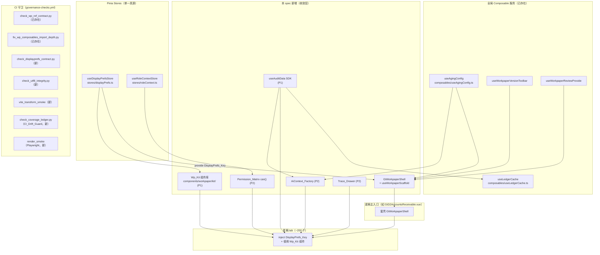
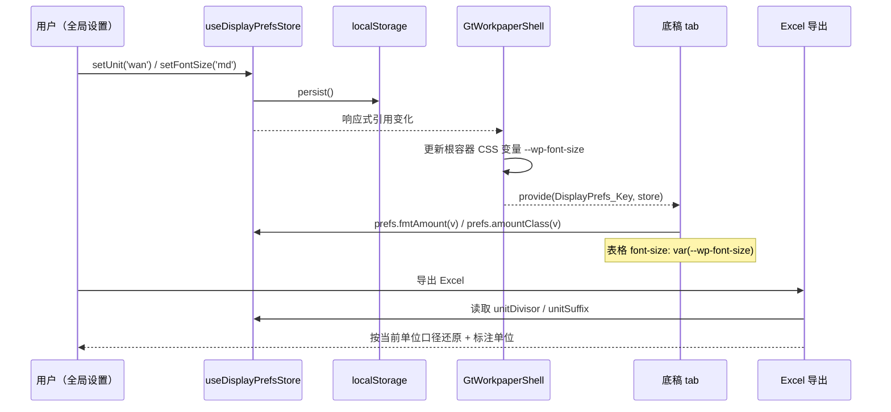
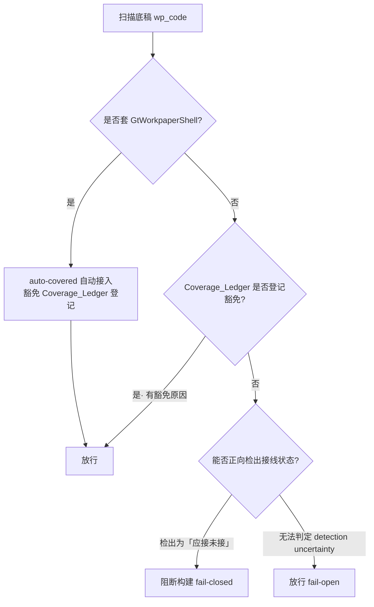

# Design Document · 全局工程加固与机制沉淀（platform-global-hardening）

## Overview

本设计将合伙人评估报告（`docs/proposals/platform-partner-review-2026-07-12.md`）与 `requirements.md` 中 9 条需求（P0/P1/P2 三波）转化为**可落地、非破坏、增量**的工程方案。核心原则：

- **存量收敛而非增量功能**：不新增审计业务能力，只把散落的一次性约定收敛为「单一真源 + 强制接线 + CI 阻断」。
- **一切以现存代码为锚**：所有新增能力都复用平台已有的成熟件——`useDisplayPrefsStore`（`audit-platform/frontend/src/stores/displayPrefs.ts`，227 行完整实现）、`useAgingConfig`（`audit-platform/frontend/src/composables/useAgingConfig.ts`）、`useLedgerCache`（`audit-platform/frontend/src/composables/useLedgerCache.ts`）、`useRoleContextStore`（`audit-platform/frontend/src/stores/roleContext.ts`）、既有 CI 守卫 `backend/scripts/check/check_wp_ref_contract.py` 与 `fix_wp_composables_import_depth.py`、既有工作流 `.github/workflows/governance-checks.yml`。
- **fail-open 优先**：所有 CI 漂移守卫在「守卫自身无法判定」时放行（fail-open），只在「被正向检出为违规」时阻断（fail-closed）。沿用 `governance-checks.yml` 现有的 `GOVERNANCE_ENFORCE_DATE` warning→fail 灰度机制。
- **渐进迁移**：约 200 个存量底稿 tab 通过 codemod 脚本 + 手工核验分批迁移，旧路径与新路径共存期内 CI 只 warn 不 block，迁移完成后翻转为 strict。

### 设计范围与波次映射

| 波次 | 需求 | 设计深度 | 组件 |
|------|------|---------|------|
| P0 Wave 1 | Req 1/2/3 | 详细、可直接开发 | DisplayPrefs 收敛、Workpaper_Shell、工程硬门禁 |
| P1 Wave 2 | Req 4/5 | 详细 | Wp_Kit 组件库、AuditData_SDK |
| P2 Wave 3 | Req 6/7/8/9 | 架构 + 接口（深细节延后） | 巨型文件拆分、Permission_Matrix、Trace_Drawer、AiContext_Factory |

## Architecture

### 全局能力关系图

下图展示加固后各全局能力的依赖关系：`GtWorkpaperShell` 作为「接线中枢」，把已有的全局服务默认注入给底稿；底稿 tab 只消费注入的契约，不再各自实现。



### 数据流：显示偏好从设置到底稿的单一路径



### CI_Drift_Guard 判定流（fail-open）



## Components and Interfaces

### P0-1 · DisplayPrefs 收敛（Req 1）

#### 现状（实测）
- `GtD2AccountsReceivable.vue:343`、`GtD1NotesReceivable.vue:743`、`GtD3PrepaidAccounts.vue:293` 等主入口 `provide('displayPrefs', {硬编码闭包})`：固定 2 位小数、固定「元」口径、固定负数括号，**非** `useDisplayPrefsStore`。
- 大量 tab（`d1/D1Tab*.vue`、`e1/E1Tab*.vue` 等）`inject<{fmtAmount}>('displayPrefs', {硬编码 fallback})`，自带一份 `v.toLocaleString('zh-CN',{minimumFractionDigits:2,maximumFractionDigits:2})` 兜底实现。
- `useDisplayPrefsStore` 已导出全部所需响应式引用与方法：`fmt`/`fmtAmount`/`amountClass`/`unitSuffix`/`unitDivisor`/`tableDensity`/`fontConfig`/`fmtPercent`/`fmtDateTime`（见 `stores/displayPrefs.ts` return 块）。
- `formatters.ts` 的 `FONT_SIZES` 已定义每档 `tableFont`（`md='13px'`），是 `fontConfig` 的底层。

#### 设计

**1. 类型化 InjectionKey（`DisplayPrefs_Key`）**

新增 `audit-platform/frontend/src/components/workpaper/composables/displayPrefsKey.ts`：

```ts
import type { InjectionKey } from 'vue'
import type { useDisplayPrefsStore } from '@/stores/displayPrefs'

// 注入的契约 = store 的公开返回类型（响应式引用 + 方法）
export type DisplayPrefsContract = ReturnType<typeof useDisplayPrefsStore>

// 类型化 key，替代字符串 'displayPrefs'
export const DisplayPrefs_Key: InjectionKey<DisplayPrefsContract> =
  Symbol('displayPrefs')
```

**2. 主入口 provide 收敛**

主入口把硬编码闭包替换为直接 provide store 实例（store 本身即响应式，Pinia setup store 的 ref/computed 保持响应性）：

```ts
// 替换 GtD2AccountsReceivable.vue:343 的 provide('displayPrefs', {...})
import { DisplayPrefs_Key } from './composables/displayPrefsKey'
import { useDisplayPrefsStore } from '@/stores/displayPrefs'
const displayPrefs = useDisplayPrefsStore()
provide(DisplayPrefs_Key, displayPrefs)
// 过渡期同时保留字符串 provide('displayPrefs', displayPrefs) 供未迁移 tab 兼容
```

> 兼容策略：过渡期主入口**同时** provide 字符串 key（值改为真 store，不再是硬编码闭包），使未迁移 tab 立即获得正确行为；tab 迁移到 `DisplayPrefs_Key` 后再移除字符串 provide。

**3. tab 消费收敛**

tab 从硬编码 fallback 改为：

```ts
import { inject } from 'vue'
import { DisplayPrefs_Key } from '../composables/displayPrefsKey'
import { useDisplayPrefsStore } from '@/stores/displayPrefs'
// 注入优先，未注入时回退到 store 本体（而非硬编码闭包）——保证单一真源
const displayPrefs = inject(DisplayPrefs_Key, null) ?? useDisplayPrefsStore()
```

**4. CSS 变量 `--wp-font-size` 传播**

`GtWorkpaperShell`（或过渡期主入口根 `<div>`）绑定：

```vue
<div class="gt-wp-root" :style="{ '--wp-font-size': displayPrefs.fontConfig.tableFont }">
```

底稿内表格样式统一改为 `font-size: var(--wp-font-size)`，替换散落的 `font-size: 13px` 字面量。默认值 fallback：`var(--wp-font-size, 13px)`，保证未套壳场景不退化。

**5. Excel 导出单位口径**

导出路径（各底稿 `useXImportExport` 走后端三端点，前端组装表头/数值）读取 `displayPrefs.unitDivisor` 与 `displayPrefs.unitSuffix`：导出数值 = 原始元值 / `unitDivisor`，表头标注 `（单位：{unitSuffix}）`。规则集中到一个纯函数 `applyExportUnit(rawYuan, divisor)`，供所有导出复用，杜绝「屏幕万元、导出元」。

**6. CI 守卫 `check_displayprefs_contract.py`（新）**

参照 `check_wp_ref_contract.py` 的零依赖、正则、`--strict` 结构新建脚本。拦截两类客观反模式：
- **A**：`inject(<...>)('displayPrefs', { ...本地 fmtAmount/toLocaleString 实现... })` —— 即 inject 第二参数是含格式化实现的对象字面量（正则识别 `inject(...'displayPrefs'...{...toLocaleString...}`）。允许 `inject(DisplayPrefs_Key, null)` 或 `inject(DisplayPrefs_Key, useDisplayPrefsStore())`。
- **B**：底稿组件 `<style>` / 模板内 `font-size: 13px`（及等价 `12px/11px/14px` 硬编码字面量）——建议改 `var(--wp-font-size)`。允许白名单：`displayPrefs.ts`/`formatters.ts` 的 `FONT_SIZES` 定义处。

灰度：先以报告模式挂 `governance-checks.yml` 新 job `displayprefs-contract-check`，迁移完成后加 `--strict`。

### P0-2 · GtWorkpaperShell 骨架（Req 2）

#### 设计

**组件 API**

新增 `audit-platform/frontend/src/components/workpaper/GtWorkpaperShell.vue`：

```ts
// props
interface Props {
  wpCode: string          // 底稿编码，如 'D2'
  wpId: string
  projectId: string
  year?: number           // 缺省时从 projectContext 解析
  agingSubject?: string   // 传给 useAgingConfig 的 subject（如 'D2'）
  readonly?: boolean
}
// emits
'jump-to-section', 'navigate-sheet', 'save', 'reload'
// slots
#toolbar   // 版本链工具栏 + 导入导出 dropdown 默认填充，可覆盖
#objective // 审计目标（el-alert）插槽
#guidance  // 编制提示（details）插槽
#default    // 底稿主体（tab 内容）
```

**默认注入清单（Req 2.1）** —— Shell 内部一次性完成，全部复用现存件：

| 注入项 | 来源（现存件） | provide key |
|--------|--------------|-------------|
| displayPrefs | `useDisplayPrefsStore()` | `DisplayPrefs_Key` |
| agingConfig | `useAgingConfig(projectIdRef, agingSubject)` | `AgingConfig_Key` |
| 版本链工具栏 | `useWorkpaperVersionToolbar` | provide toolbar ref |
| 复核 provide | `useWorkpaperReviewProvide({wpId, projectId})` | 既有 review provides |
| AI provide | 统一 `generateAndConfirm` 注入 | `provide('generateAiText', ...)` |
| 导入导出 dropdown | `#toolbar` 默认渲染 `<WpImportExport>`（P1）| slot |
| jumpToSection / reload | `useWorkpaperEntryInjections` | `'jumpToSection'` / `'reloadWorkpaperData'` |

**composable 替代方案 `useWorkpaperScaffold`**

为不便套壳组件模板的场景（已有复杂根结构的存量主入口）提供等价 composable，在 `<script setup>` 里调用即完成全部 provide，不强制改模板结构：

```ts
const scaffold = useWorkpaperScaffold({
  wpCode, wpId, projectId, year, agingSubject,
  onJumpToSection, reloadFn,
})
// scaffold 返回 { displayPrefs, agingConfig, versionToolbar, fontStyle } 供模板绑定
```

> Shell 组件与 `useWorkpaperScaffold` 共享同一份内部实现（Shell 的 `<script setup>` 内部调用 `useWorkpaperScaffold`），保证两条路径接线完全一致。

**缺失上下文错误提示（Req 2.6）**

`useWorkpaperScaffold` 在开发环境（`import.meta.env.DEV`）校验 `wpCode`/`wpId`/`projectId`（以及 year 无法解析时），缺失时 `console.error('[GtWorkpaperShell] 缺少必要上下文：{缺失项名称}')`，明确列出缺失项名称，不静默。

### P0-2 · Coverage_Ledger 与 CI_Drift_Guard（Req 2.3–2.8）

#### Coverage_Ledger 数据模型

采用**生成 + 手工豁免**双源的清单 JSON，落盘 `audit-platform/frontend/src/components/workpaper/coverage-ledger.json`（参考 memory 里 ACNR Coverage Ledger 思路）：

```jsonc
{
  "generatedAt": "2026-07-12T00:00:00Z",
  "capabilities": ["displayPrefs", "agingConfig", "version", "review", "ai", "importExport", "acnr"],
  "entries": {
    "D2": {
      "shellWrapped": true,            // 套壳 → auto-covered
      "detected": { "displayPrefs": true, "agingConfig": true, "version": true }
    },
    "X9": {
      "shellWrapped": false,
      "detected": { "displayPrefs": false },
      "exemption": { "reason": "纯展示型底稿无金额列", "approvedBy": "manager", "at": "2026-07-12" }
    }
  }
}
```

- `shellWrapped=true`：CI_Drift_Guard 视为 auto-covered，豁免显式登记（Req 2.7）。
- `detected`：由扫描器基于静态特征正向检出（是否 import 对应服务、是否 provide/inject 对应 key）。
- `exemption`：非套壳且确不需要某能力时登记豁免原因。

#### CI_Drift_Guard 算法（`check_coverage_ledger.py`，新）

判定逻辑严格遵循 Req 2.4/2.5/2.7/2.8（见上文 flowchart）：

1. 枚举 `wp_code_overrides.json` + `wp_index` 派生的全部 wp_code。
2. 对每个 wp_code：
   - 若 `shellWrapped==true` → auto-covered，放行（Req 2.7）。
   - 否则静态扫描主入口源码，正向检出各能力接线状态写入 `detected`。
   - 若正向检出某底稿「应接（有金额列/账龄列等触发特征）却未接（detected=false）」且无 `exemption` 登记 → **阻断**（Req 2.4/2.5，fail-closed）。
   - 若扫描器无法确定该底稿是否「应接」（如无法解析的动态结构、异常文件）→ **放行**（Req 2.8，fail-open）。
3. 输出漂移报告：`{wp_code}: 应接 {capability} 未接线`。

灰度：新 job `coverage-drift-check`，先报告模式，全量登记后翻 strict。

### P0-3 · 工程纪律硬门禁（Req 3）

全部挂载到 `.github/workflows/governance-checks.yml` 现有 job 群，复用其 `GOVERNANCE_ENFORCE_DATE` 灰度机制。

**1. UTF-8/U+FFFD 完整性检查 `check_utf8_integrity.py`（新，Req 3.1/3.7）**

```python
# 核心：raw = path.read_bytes(); count = raw.count(b'\xef\xbf\xbd')
# count > 0 → 记录违规文件
```
- 扫描 diff 内的 `.vue`/`.ts`/`.py` 等文本文件；`count > 0` 使 pre-commit 与 CI 失败并列出受影响文件。
- Vue 文件命中 U+FFFD → 判定「疑似 shell 文本替换破坏」（Req 3.7），错误信息提示「Vue 文件禁止 PowerShell Set-Content/-replace，只用结构化编辑工具」。
- 挂 `.git-hooks/pre-commit`（已存在）+ 新 CI job `utf8-integrity-check`。

**2. Vite transform 全树冒烟 `vite_transform_smoke`（新，Req 3.2）**

- CI 起前端 dev server（`vite`，非 build），对底稿源码树每个 `.vue` 与 `.ts` 请求 `http://localhost:3030/src/....`，判 HTTP 200/500。
- 任一文件 500 → 构建失败，列出返回 500 的文件路径（这是 memory 记载「比 Volar/get_diagnostics 更权威的崩溃检测」，能抓 import 解析失败/模板内嵌引号/结构损坏）。
- 实现为 Node 脚本 `backend/scripts/check/vite_transform_smoke.mjs`：启动 vite middleware mode → `transformRequest(url)` 遍历，收集抛错文件。CI job `vite-transform-smoke`。

**3. 既有 ref/import 守卫升为 blocking（Req 3.3/3.4）**

- `check_wp_ref_contract.py --strict`：已在 `governance-checks.yml` job `wp-ref-contract-check` 中以 strict 挂载（现状已 blocking），本 spec 确认其为阻断态。
- `fix_wp_composables_import_depth.py --check`：已在同 job 第二 step 挂载。本 spec 无需新建，仅在验收中确认二者对新增违规阻断。

**4. render 冒烟测试集（新，Req 3.5/3.6）**

- 架构：Playwright 测试集 `audit-platform/frontend/tests/render-smoke/`，按 wp_code 参数化（数据驱动，从 `wp_code_overrides.json` + registry 生成 wp_code 清单）。
- 每个 wp_code：登录（admin/admin123）→ 导航到该底稿 → 断言 `page.on('console', 'error')` 计数为 0，且关键区块选择器存在（如 `.gt-wp-root`、审定表/明细表容器）。
- 任一 wp_code 有 console error 或缺关键区块 → 测试失败并报告 wp_code + 错误摘要（Req 3.6）。
- 因需真实服务器，作为独立 CI job `render-smoke`（可 `continue-on-error` 灰度期，稳定后转 blocking）。

### P1-4 · Wp_Kit 组件库（Req 4）

新增目录 `audit-platform/frontend/src/components/workpaper/kit/`（当前不存在，全新沉淀）。把 memory 的「底稿 UI 铁律」从文字约定升级为组件。所有金额显示统一走 `DisplayPrefs_Key` 注入。

| 组件 | 职责 | 关键 API |
|------|------|---------|
| `<WpSection>` | 标题行 + 审计目标 el-alert + 编制提示 details + 右侧 AI/复核按钮 | props: `title`, `objective`, `guidance`; slots: `#actions`, `#default` |
| `<WpAmountCell>` | 金额格式统一走 displayPrefs（单位/小数/负数红字） | props: `value`, `priorValue?`, `rawUnit?`; 内部 `inject(DisplayPrefs_Key)` |
| `<WpFormulaCell>` | 公式列：虚线下划线 + `cursor:help` + 来源 tooltip | props: `value`, `formula`, `source` |
| `<WpOpinionCard>` | 审计说明/结论卡片，内置 `autosize {minRows:5}` textarea + AI + 复核 | props: `modelValue`, `section`, `wpCode`; emits: `update:modelValue` |
| `<WpImportExport>` | 「导入导出▾」dropdown（导出模板/导出数据/导入数据） | props: `wpId`, `endpoints`; 复用 `useXImportExport` 范式 |
| `<WpDynamicTable>` | 13px 字体、紧凑密度、auto-calc-col、合计行、动态增删行、账龄动态列 | props: `columns`, `rows`, `agingBands?`, `readonly?` |

**ESLint 规则（Req 4.6）**：新增本地 ESLint 插件规则 `no-adhoc-wp-structure`（`audit-platform/frontend/eslint-rules/`），在检出可用 Wp_Kit 组件的等价手写结构时报错。检测特征（保守，低误报）：
- 手写 `<el-input type="textarea" :autosize>` 且位于底稿说明/结论区 → 建议 `<WpOpinionCard>`。
- 手写 `<el-dropdown>` 内含「导入/导出」文案 → 建议 `<WpImportExport>`。
- 直接 `toLocaleString` 渲染金额单元格 → 建议 `<WpAmountCell>`。

灰度：先 `warn` 级，Wp_Kit 稳定 + 试点底稿迁移后升 `error`。

### P1-5 · useAuditData SDK（Req 5）

新增 `audit-platform/frontend/src/composables/useAuditData.ts`。收敛「审定数/未审数/科目余额/辅助余额/账龄/序时账/上年数」取数，内置 year 解析、字段归一、缓存复用、错误降级。

#### Hook 签名

```ts
export type AmountBasis = 'audited' | 'unadjusted'
export type Koujing = 'v1_debit_positive' | 'v2_positive' | 'pl_occurrence' // 借正贷负 / 正数 / 损益发生额

export interface UseAuditDataReturn {
  getTbAmount(accountCode: string, opts?: { basis?: AmountBasis }): Promise<number>
  getAging(subject: string): Promise<AgingBand[] /* 复用 useAgingConfig */>
  getLedgerEntries(opts?: { accountCode?: string }): Promise<LedgerCacheEntry[]>
  getPrevYear(accountCode: string, opts?: { basis?: AmountBasis }): Promise<number>
  loading: Ref<boolean>
  error: Ref<string>
}

export function useAuditData(
  projectId: Ref<string>,
  year?: Ref<number>,   // 缺省 → 从 projectContext 解析
): UseAuditDataReturn
```

#### 关键设计

- **year 自动解析（Req 5.2）**：`year` 未传时从 projectContext（沿用 memory「year 统一从 projectContext 注入」）解析，调用方无需手传，从根上杜绝「漏 year → 422」。
- **字段归一化层（Req 5.3）**：返回稳定语义字段，屏蔽后端字段名差异。归一化映射集中一处（参照 `useLedgerCache` 已有的 `r.debit_amount ?? r.debitAmount ?? r.debit` 多别名兜底范式）。
- **三口径按数据域（Req 5.4）**：不强制单一口径，按数据域返回正确口径——
  - 资产/负债/权益科目余额 → 遵循方向铁律（资产 `期初+借-贷`，负债/权益 `期初+贷-借`），底层取数区分 `tb_balance`（v1 借正贷负）与 `trial_balance`（v2 正数）。
  - 损益类 → `pl_occurrence`（从 `tb_ledger` 取发生额）。
  - 口径选择由内部 `resolveKoujing(accountCode, domain)` 决策，集中收敛，杜绝各底稿口径漂移。
- **缓存复用（Req 5.5）**：`getLedgerEntries` 直接委托 `useLedgerCache().getEntries(projectId, year)`，命中缓存不重复拉取。
- **错误降级（Req 5.6）**：所有方法 try/catch，失败返回明确降级值（金额 → `0` 或 `null` + 设置 `error`），绝不抛未捕获异常导致底稿白屏。
- **禁裸 fetch（Req 5.7）**：底稿只调语义方法；配套 ESLint/守卫检测底稿内直接 `api.get('/...ledger...')`/裸取数 URL（延后到 P1 收尾）。

## Data Models

本 spec 为工程加固，**不新增数据库表**（不产生迁移）。数据模型变更仅限前端清单文件与类型：

### 1. Coverage_Ledger 清单（新增文件，非 DB）

`audit-platform/frontend/src/components/workpaper/coverage-ledger.json` —— 结构见上文 P0-2。由 `check_coverage_ledger.py` 读取，非运行时消费（纯 CI 资产）。

### 2. DisplayPrefs 注入契约类型（新增类型，非数据）

`DisplayPrefsContract = ReturnType<typeof useDisplayPrefsStore>`（见 P0-1）。不改 `DisplayPrefsData` 持久化结构（`localStorage` key `gt_display_prefs` 不变），保证存量用户偏好无缝兼容。

### 3. AuditData_SDK 语义字段（新增类型，非数据）

复用既有 `LedgerCacheEntry`（`useLedgerCache.ts`）与 `AgingBand`（`useAgingConfig.ts`）。新增 `AmountBasis`/`Koujing` 枚举，无持久化。

### 4. P2 数据模型（延后细化）

- Permission_Matrix：前后端共享权限定义（复用 `roleContext` 的 `permission_level`，后端 `require_wp_edit_permission` 已存在于 `deps.py:248`），具体定义结构在 P2 深化。
- Trace_Drawer：溯源链数据复用既有 ReportTracePanel / ACNR addr_id 寻址，不新增存储。

## Correctness Properties

*属性（property）是系统在所有合法执行下都应成立的特征或行为——一条关于「系统应当做什么」的形式化陈述。属性是人类可读规格与机器可验证正确性保证之间的桥梁。*

本 spec 为工程加固，部分验收标准属于 CI 配置存在性（SMOKE）、真实浏览器渲染（INTEGRATION/Playwright）或 UI 结构断言（EXAMPLE），不适用属性测试；下列属性仅覆盖**可普适量化、测我方逻辑、输入变化有意义**的验收标准（详见上文 prework 分类与去冗余）。每条属性以单一属性测试实现，最少 100 次迭代。

### Property 1: 金额格式化输出与单一真源一致

*For any* 金额值 v（含 null/0/负数/超大数）与 *any* 显示设置组合（amountUnit ∈ {yuan,wan,qian}、decimals、negativeRed、showZero），任一底稿 tab 或 Wp_Kit 组件（`<WpAmountCell>`/`<WpDynamicTable>`）渲染出的金额文本，SHALL 等于 `useDisplayPrefsStore().fmtAmount(v)` 在相同设置下的输出。

**Validates: Requirements 1.4, 4.7**

### Property 2: DisplayPrefs 守卫检出反模式、放行合规写法

*For any* 底稿源码片段：当且仅当片段包含「`inject(...'displayPrefs'...)` 第二参数为含本地格式化实现（`toLocaleString`/`fmtAmount` 字面实现）的对象」或「底稿样式/模板中的 `font-size: 13px`（及等价 `11/12/14px`）硬编码字面量（白名单定义处除外）」时，`check_displayprefs_contract.py --strict` SHALL 判定为违规（退出码 1）；对使用 `inject(DisplayPrefs_Key, ...)` 或 `var(--wp-font-size)` 的合规片段 SHALL 放行。

**Validates: Requirements 1.3, 1.7**

### Property 3: CI_Drift_Guard 仅在正向检出时阻断、在不确定时放行

*For any* 底稿接线状态组合（shellWrapped、detected 各能力真值、是否登记 exemption、扫描是否可解析）：CI_Drift_Guard SHALL 遵循——若 `shellWrapped==true`（auto-covered）或已登记 `exemption` 或扫描无法确定接线状态（detection uncertainty），则放行（fail-open）；当且仅当被正向检出为「应接却未接」且无豁免时，才阻断（fail-closed）。

**Validates: Requirements 2.4, 2.5, 2.7, 2.8**

### Property 4: U+FFFD 完整性检查当且仅当含替换字符时失败

*For any* 文件字节内容：`check_utf8_integrity` 判定失败 SHALL 当且仅当 `raw.count(b'\xef\xbf\xbd') > 0`；对 `.vue` 文件命中时，其报告 SHALL 额外标注「疑似 shell 文本替换破坏」。

**Validates: Requirements 3.1, 3.7**

### Property 5: 导出单位换算可还原（度量关系）

*For any* 原始元值 rawYuan 与 *any* 单位除数 divisor ∈ {1, 1000, 10000}：`applyExportUnit(rawYuan, divisor) * divisor` SHALL 在浮点误差内等于 rawYuan，且导出表头 SHALL 标注与 divisor 对应的 `unitSuffix`（元/千元/万元）。

**Validates: Requirements 1.6**

### Property 6: year 自动解析后底层请求永不缺失 year

*For any* projectContext 中的有效年度 y 与 *any* 调用方式（显式传 year 或不传），任一 AuditData_SDK 语义方法向底层发起的请求参数中，year SHALL 恒为解析出的有效整数，SHALL NOT 出现 undefined/缺失（杜绝 422）。

**Validates: Requirements 5.2**

### Property 7: 字段归一化在任意别名组合下产出稳定语义字段

*For any* 后端返回行对象（字段名为 `debit_amount`/`debitAmount`/`debit` 等别名的任意子集组合）：AuditData_SDK 的归一化层 SHALL 产出稳定的语义字段，且对表示同一含义的不同别名产出相同的归一化值。

**Validates: Requirements 5.3**

### Property 8: 取数口径按数据域正确解析

*For any* 科目代码（覆盖资产、负债、权益、损益四域）：`resolveKoujing(accountCode, domain)` SHALL 返回该域约定的口径——资产/负债/权益余额遵循方向铁律（资产源自 v1 借正贷负、审定汇总为 v2 正数），损益类返回 `pl_occurrence`（发生额），SHALL NOT 强制统一为单一口径。

**Validates: Requirements 5.4**

### Property 9: 取数失败时返回降级值且不抛未捕获异常

*For any* 失败注入模式（请求 reject、空数据、畸形/缺字段响应）：任一 AuditData_SDK 语义方法 SHALL resolve 到明确的降级结果（金额降级为 0/null 并置 `error`），SHALL NOT 抛出未捕获异常（不致底稿白屏）。

**Validates: Requirements 5.6**

### Property 10: 权限判定与共享定义一致（覆盖 5 角色）

*For any* (role ∈ {审计助理, 现场经理, 业务合伙人, 质量控制复核合伙人, EQCR}, action, resource, context) 组合：`Permission_Matrix.can(action, resource, context)` SHALL 返回与前后端共享权限定义表一致的确定布尔值。

**Validates: Requirements 7.1, 7.6**

### Property 11: AiContext 工厂产出非空且含约定键集

*For any* (wpCode, sheet) 与其可用数据源：`buildAiContext(wpCode, sheet)` SHALL 返回非空 context，且包含约定的键集（联动数据、审定数、账龄、异常项、源模板方法论中该底稿实际具备的项），SHALL NOT 返回空 context。

**Validates: Requirements 9.1, 9.2**

### Property 12: AI 确认前不覆盖已有内容

*For any* 目标区已有内容 c0 与 *any* AI 生成输出 g：在用户确认之前，目标 model 的值 SHALL 恒等于 c0（生成阶段仅进入 diff 预览，不写入）；仅当用户确认后 model 才变为选定内容。

**Validates: Requirements 9.5, 9.6**

## Error Handling

### 前端

- **注入缺失降级（Req 1.3/2.6）**：tab `inject(DisplayPrefs_Key, null) ?? useDisplayPrefsStore()`——注入缺失时回退到 store 本体（单一真源），绝不回退硬编码闭包。Shell 缺 `wpCode/wpId/projectId/year` 时开发期 `console.error` 明确列出缺失项名称，生产环境不 throw（避免白屏）。
- **AuditData_SDK 降级（Req 5.6）**：所有语义方法 try/catch，失败返回降级值 + 设置 `error` ref，配 `_silent` 请求（沿用 `useAgingConfig`/`useLedgerCache` 现有的 `{_silent:true}` 范式）避免全局 404 弹窗。
- **AI 流程（Req 9.5）**：AI 生成失败（`/ai/generate-text` 503）时提示「AI 服务暂不可用」并保留用户已填内容不变，绝不覆盖。

### CI 守卫

- **fail-open 原则**：所有守卫（`check_utf8_integrity`/`check_coverage_ledger`/`vite_transform_smoke`）遇「无法读取/无法解析」的异常文件时**放行并 `::warning::`**，只对正向检出的违规 fail（防止守卫自身缺陷阻断全员）。沿用 `check_wp_ref_contract.py` 现有的 `except (UnicodeDecodeError, OSError): return []` 范式。
- **Windows 编码**：所有新脚本顶部 `sys.stdout.reconfigure(encoding='utf-8')`（沿用 `check_wp_ref_contract.py` 范式），防 GBK 控制台崩。
- **灰度**：新守卫先报告模式（退出码恒 0）挂 `governance-checks.yml`，复用 `GOVERNANCE_ENFORCE_DATE` 到期翻 `--strict`。

## Testing Strategy

### 双轨测试

- **单元/示例测试**：覆盖接口存在性（Req 1.1/2.1/5.1/6.5）、组件渲染结构（Req 4.1–4.5，snapshot/挂载断言）、错误场景（Req 2.6 edge-case）、缓存复用（Req 5.5 mock 计数）。
- **属性测试**：覆盖上文 P1–P12，验证普适正确性。

### 属性测试配置（PBT 适用部分）

- 前端属性测试用 **fast-check**（平台已有：memory 记载 advanced-query 用 `fast-check numRuns=20`；本 spec 按要求最少 **100 次迭代**，即 `fc.assert(prop, { numRuns: 100 })`）。
- 后端守卫属性测试（P2/P3/P4，Python）用 **hypothesis**（平台已配 `fast` profile，`HYPOTHESIS_MAX_EXAMPLES` env 覆盖；属性测试显式 `@settings(max_examples=100)`）。
- 每个属性测试注释标注：`Feature: platform-global-hardening, Property {number}: {property_text}`。
- 每条 Correctness Property 以**单一**属性测试实现。

### 不适用 PBT、改用其他策略的部分

| 验收标准 | 分类 | 测试策略 |
|---------|------|---------|
| 3.2 Vite transform 全树冒烟 | INTEGRATION | Node 脚本起 vite middleware，遍历 `transformRequest`，全树一次遍历收集 500 |
| 3.3/3.4 既有守卫挂 CI | SMOKE | 断言 `governance-checks.yml` 含 `--strict`/`--check` step |
| 3.5/3.6 render 冒烟 | INTEGRATION | Playwright 数据驱动，每 wp_code 一用例，断言 0 console error + 关键区块存在 |
| 4.1–4.5 Wp_Kit 结构 | EXAMPLE | Vitest 挂载/snapshot |
| 4.6 ESLint 规则 | EXAMPLE-heavy | ESLint RuleTester valid/invalid 例集 |
| 6.1–6.4 巨型文件拆分 | SMOKE/EXAMPLE | 拆分后既有测试 + render 冒烟回归（行为不变），size guard 例测 |
| 8.1–8.7 溯源/刷新链 | EXAMPLE/INTEGRATION | Trace_Drawer 挂载断言 + draft-refresh 5 角色 Playwright e2e（Req 8.7 保证与 Trace_Drawer 测试互相独立） |
| 9.3/9.4 AI 三段式时序 | EXAMPLE | 状态机转移断言 |

### 分层验证纪律（沿用 memory 铁律）

- **禁止假绿**：单测传真 ref 通过 ≠ 浏览器正常。P0-3 的 Vite transform 冒烟 + render 冒烟就是根治「假绿」的手段，二者视为本 spec 交付的验收硬门槛。
- **改动后必 Playwright**：迁移每批底稿后跑 render 冒烟子集实测。

## Migration / Rollout Strategy

迁移触及约 200 个存量底稿 tab，必须**增量、非破坏**。核心策略：新旧路径共存 + 守卫灰度 + codemod + 分批实测。

### 阶段 M0 · 地基（无行为变更）
1. 新增 `displayPrefsKey.ts`（`DisplayPrefs_Key` + 类型）。
2. 主入口 `provide('displayPrefs', ...)` 的**值**从硬编码闭包换成真 `useDisplayPrefsStore()`（字符串 key 暂留）——**此步已让所有存量 tab 立即获得正确的单位/字号/负数行为**（因为 tab 的硬编码 fallback 仅在 provide 缺失时才生效，而 provide 一直存在，tab 实际消费的是 provide 的值）。这是最小改动、最大体感的止血点，对应报告第一点。
3. 新增 CI 守卫（`check_displayprefs_contract.py`/`check_utf8_integrity.py`/`vite_transform_smoke`/`check_coverage_ledger.py`）以**报告模式**挂 `governance-checks.yml`。

### 阶段 M1 · Shell 与 codemod
4. 实现 `GtWorkpaperShell` + `useWorkpaperScaffold`（复用现存注入件）。
5. 试点 1 个底稿（建议 **D2**，与版本链/账龄试点一致）套壳，跑 render 冒烟验证等价。
6. **codemod 脚本** `backend/scripts/refactor/migrate_displayprefs_inject.py`：批量把 tab 的 `inject<{fmtAmount}>('displayPrefs', {硬编码})` 改写为 `inject(DisplayPrefs_Key, null) ?? useDisplayPrefsStore()`，并把 `font-size: 13px` 改为 `var(--wp-font-size, 13px)`。脚本仅用结构化文本替换、显式 UTF-8 读写（**禁止 PowerShell**，遵守 memory 铁律），支持 `--check`/`--apply`（沿用 `fix_wp_composables_import_depth.py` 范式）。
7. **手工核验**：codemod 后按循环分批（D→E→F→…）跑 render 冒烟子集，每批 Playwright 实测 0 console error 才合入。

### 阶段 M2 · 收敛与翻转
8. Coverage_Ledger 全量登记（生成器扫描 + 手工补豁免）。
9. 全部底稿迁移完成后，移除主入口的字符串 `provide('displayPrefs')`（只留 `DisplayPrefs_Key`），守卫从报告模式翻 `--strict`（`coverage-drift-check`/`displayprefs-contract-check`/render 冒烟转 blocking）。

### 阶段 M3 · P1/P2（后续波次）
10. Wp_Kit 与 useAuditData 上线后，试点底稿逐步替换手写结构与裸取数；ESLint 规则从 `warn` 升 `error`。P2（拆分/权限矩阵/溯源/AI 工厂）按报告第三波排期，架构已定、深细节届时细化。

### 回滚
- 每阶段独立可回滚：M0 换回旧 provide 值即恢复；codemod 有 `--check` 预演 + git 单 commit，异常直接 `git revert`。守卫报告模式期间不阻断，零上线风险。
