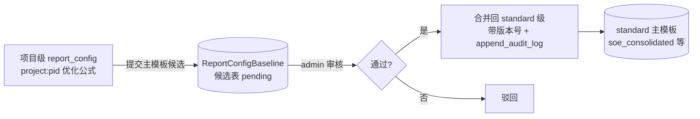
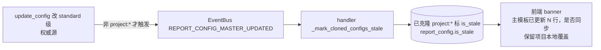

# 设计文档：report-config-baseline（报表配置主模板回填 + 联动）

> 关联调研：#[[file:docs/proposals/global-modules-status-and-improvement-2026-05-31.md]]（§六 报告模板库 + §12.3 克隆无回填 + §21.3.3 主模板→克隆联动断裂）
> 前置资产：`report_config_service`（clone_report_config/update_config）+ 附注侧 `GroupNoteTemplateBaseline`（成熟的双向 baseline 范式）+ `EventBus` + `append_audit_log`
> 范围：报表配置加"项目优化→主模板回填"通道 + "主模板更新→克隆项目"stale 通知 + 覆盖率 CI 校验
> 工作流：Design-First（HLD + LLD）

---

## 一、概述（Overview）

报表配置当前 `clone_report_config(project_id, standard)` 把 standard 级配置（soe_consolidated 等）克隆为项目级 `project:{pid}`，项目可自定义公式。但存在两个缺口：
1. **项目优化无法回流主模板**（§12.3）：某项目修对了一个公式，只留在 `project:{pid}`，其他项目不受益
2. **主模板更新不通知克隆项目**（§21.3.3 联动断裂）：standard 主模板升版后，已克隆项目继续用旧公式，审计师不知道

对比附注侧已有 `GroupNoteTemplateBaseline`（集团基线 + apply/diff/upgrade/feedback 双向机制），报表侧缺等价物。本 spec **仿附注 baseline 成熟范式**，不重新发明轮子：
- **回填评审通道**：项目级配置可"提交为主模板候选" → admin 审核 → 合并回 standard 级（带版本 + 审计留痕）
- **主模板更新单向派生**：standard 主模板升版 → EventBus → 已克隆项目标 `is_stale` + 前端 banner 提示 diff（保留项目本地覆盖）
- **覆盖率 CI 校验**：soe/listed × consol/standalone 四组合对四表（BS/IS/CFS/EQ）行次无缺漏

**核心架构原则（呼应 §二十一）**：standard 主模板 = 权威源（单向推送项目，diff 提示）；项目 → 主模板 = 走**评审门禁**（admin 审核后才合并，非自动双写）。即"双向**受控**传播"而非"双向**自动**同步"。

---

## 二、架构（Architecture）

### 2.1 回填评审通道（项目 → 主模板，受控）



### 2.2 主模板更新单向派生（主模板 → 克隆项目）



### 2.3 仿附注 GroupNoteTemplateBaseline 范式映射

| 附注侧（已有） | 报表侧（本 spec 新建） |
|---------------|---------------------|
| GroupNoteTemplateBaseline 表 | ReportConfigBaseline 表（或泛化复用） |
| apply_baseline | apply_master_update（主模板→项目同步） |
| diff_baseline | diff_vs_master（项目 vs 主模板差异） |
| suggest_feedback（child 反哺） | suggest_to_master（项目→主模板候选） |
| upgrade_baseline | （主模板升版触发 stale） |

---

## 三、组件与接口（Components and Interfaces）

### 组件 1：ReportConfigBaseline 表 + ORM + 迁移

```sql
-- V0XX__report_config_baseline.sql（+ R0XX 回滚）
CREATE TABLE IF NOT EXISTS report_config_baseline (
    id UUID PRIMARY KEY DEFAULT gen_random_uuid(),
    standard VARCHAR(40) NOT NULL,          -- 目标 standard（soe_consolidated 等）
    report_type VARCHAR(20) NOT NULL,
    row_code VARCHAR(40) NOT NULL,
    candidate_formula TEXT,                  -- 候选公式
    source_project_id UUID,                  -- 来源项目
    status VARCHAR(20) DEFAULT 'pending',    -- pending/approved/rejected
    version INT DEFAULT 1,
    submitted_by UUID, reviewed_by UUID,
    created_at TIMESTAMP DEFAULT now()
);
-- report_config 加 is_stale 列（主模板更新→克隆项目标脏）
ALTER TABLE report_config ADD COLUMN IF NOT EXISTS is_stale BOOLEAN DEFAULT false;
```

### 组件 2：report_config_service 扩展

```python
class ReportConfigService:
    async def suggest_to_master(self, project_id, row_code, ...) -> UUID:
        """项目级优化提交为主模板候选（写 ReportConfigBaseline pending）。"""
    async def review_candidate(self, candidate_id, approved: bool, reviewer) -> None:
        """admin 审核：通过则合并回 standard 级 + 版本号 + append_audit_log。"""
    async def diff_vs_master(self, project_id, standard) -> list[ConfigDiff]:
        """项目级 vs 主模板差异（仿 diff_baseline）。"""
    async def apply_master_update(self, project_id, standard, *, keep_local=True) -> int:
        """主模板更新同步到项目（保留项目本地覆盖）。"""
    # update_config 末尾追加：非 project:* 才发 REPORT_CONFIG_MASTER_UPDATED 事件
```

### 组件 3：EventBus handler（主模板→克隆项目 stale）

```python
# audit_platform_schemas.py: EventType.REPORT_CONFIG_MASTER_UPDATED = "report_config_master_updated"
# event_handlers.py:
async def _mark_cloned_configs_stale(payload):
    """主模板更新 → 查 applicable_standard LIKE 'project:%' 且 report_type+row_code 匹配 → 标 is_stale=True。"""
event_bus.subscribe(EventType.REPORT_CONFIG_MASTER_UPDATED, _mark_cloned_configs_stale)
```

### 组件 4：覆盖率 CI 校验脚本

```python
# backend/scripts/check/validate_report_config_coverage.py
# 确保 soe/listed × consolidated/standalone 四组合 standard 对四表（BS/IS/CFS/EQ）行次无缺漏
# 复用 report-module-enhancement 的 formula_coverage 模式；CI 卡点
```

### 组件 5：前端 ReportConfigTab 入口

```
· "提交主模板候选" 按钮（项目级配置行）
· "同步主模板更新" 入口（is_stale 时 banner 提示 N 行 diff，可选择性同步）
· admin 审核候选列表
```

---

## 四、实施阶段（~2 天）

- 阶段 1（~1 天）：ReportConfigBaseline 表 + ORM + 迁移 + report_config.is_stale 列 + service 4 方法
- 阶段 2（~0.5 天）：EventBus REPORT_CONFIG_MASTER_UPDATED + handler + 审计留痕（复用 `append_audit_log` 哈希链机制，**新增独立 event_type `report_config_changed`** 入 EVENT_TYPE_SCHEMAS，不复用 A 的 formula_changed）
- 阶段 3（~0.5 天）：覆盖率 CI 脚本 + 前端 ReportConfigTab 入口 + 集成测试

---

## 五、边界条件与冲突处理

| 场景 | 处理策略 | 版本 |
|------|---------|------|
| 同一 (standard, report_type, row_code) 重复提交候选 | V1 允许多个 pending 共存（admin 逐一审核）；V2 可加唯一约束或自动合并最新 | V1 |
| 候选审核通过时 standard 行已被其他候选更新（并发冲突） | V1 后到的 approved 直接覆盖（last-write-wins）；V2 可加乐观锁 version 校验 | V1 |
| `apply_master_update` 遇到 project_only 行（项目有但主模板没有） | 保留不动（不删除项目独有行），仅同步 master_only + modified | V1 |
| `_mark_cloned_configs_stale` 时项目已被删除（is_deleted=True） | WHERE is_deleted=false 过滤，已删项目不标 stale | V1 |
| 主模板行被删除后克隆项目如何感知 | V1 不处理（stale 只标公式变更）；V2 可加 DELETE 事件 | V1 延后 |
| 回滚 R040 后 service 方法调用 | is_stale 列不存在时 ORM 报错；需确保回滚前先停用相关端点或做版本检测 | V1 声明 |

---

## 六、正确性属性（PBT 守护）

- **E1 受控传播**：项目→主模板必经 admin 审核（pending→approved 才合并，无自动双写）
- **E2 本地覆盖保留**：apply_master_update(keep_local=True) 不覆盖项目已自定义的行
- **E3 stale 准确**：主模板某行更新 → 恰好标记引用该行的克隆项目 is_stale（不误标无关项目）
- **E4 结构完整性**：四组合 standard × 四表 seed 数据结构完整（行号连续、row_code 非空且唯一、16 组合全覆盖）。注：V1 校验 seed JSON 结构完整性；V2 对照 CAS 准则校验业务行次覆盖率
