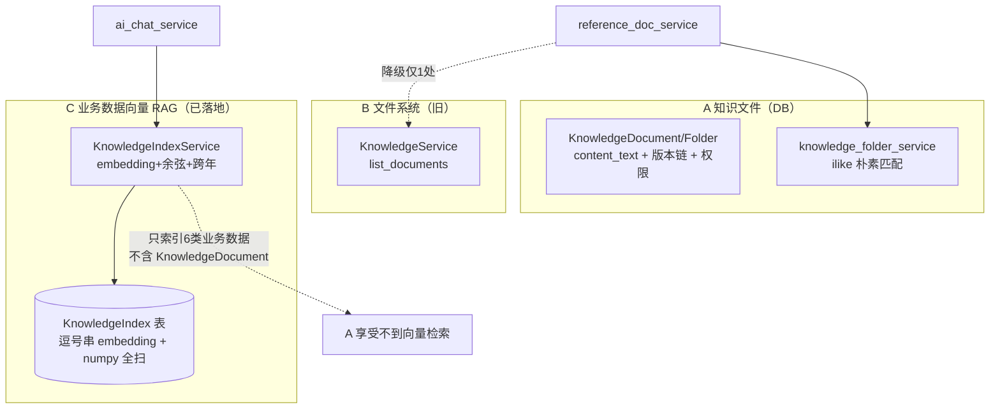
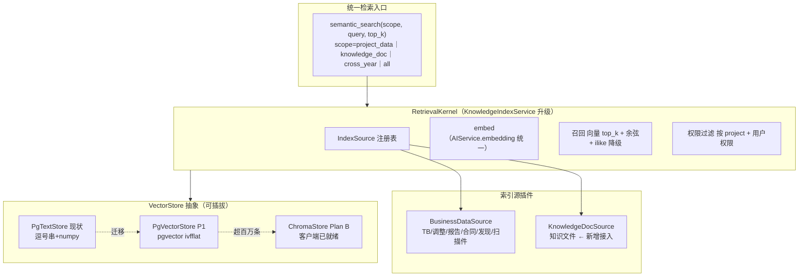
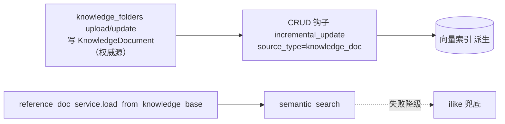

# 设计文档：retrieval-kernel-unification（检索/知识层统一架构）

> 关联调研：#[[file:docs/proposals/global-modules-status-and-improvement-2026-05-31.md]]（§十六 检索内核统一 + §七 知识库三套实证 + §21.3.1 联动断裂 + §20.4 pgvector 选型）
> 前置资产：`KnowledgeIndexService`（`knowledge_index_service.py`，已落地 PG 向量 RAG：build_index/semantic_search/incremental_update/search_cross_year）+ `AIService.embedding` + `EventBus`
> 范围：3 套知识/检索系统收敛为单一检索内核 + 知识文件入网联动 + 向量存储迁 pgvector
> 工作流：Design-First（HLD + LLD）

---

## 一、概述（Overview）

平台知识/检索域当前**三套并行系统**（已 grep 实证）：
- **A** `KnowledgeDocument`/`KnowledgeFolder`（`knowledge_folder_service.py`）：用户上传知识文件，`ilike('%kw%')` 朴素匹配
- **B** `KnowledgeService`（`knowledge_service.py`，旧）：文件系统文档，**全仓仅 1 处降级调用**（reference_doc_service）
- **C** `KnowledgeIndexService`（`knowledge_index_service.py`）：项目业务数据（TB/调整/报告/合同/发现/扫描件）**真向量语义检索**（embedding + 余弦），`ai_chat_service` 在用

三套割裂的核心问题：**A（知识文件）享受不到 C 已存在的向量检索**（C 的 `_fetch_project_texts` 只索引 6 类业务数据，不含 KnowledgeDocument）；C 的向量存储用 PG 文本列（逗号串）+ numpy 全表扫（O(N)），是历史选型债；B 是可清的旧尾巴。

本 spec 把三套收敛为 **单一检索内核 + 可插拔向量后端**：以 C（`KnowledgeIndexService`）升级为唯一内核，A 的知识文件作为新索引源接入，B 删除。**关键认知（§十三复盘）：不是"从零接 ChromaDB"，而是"把知识文件喂进已存在的 C 引擎"** —— C 已是完整 RAG，复用即可。向量存储抽 `VectorStore` Protocol，从 PG 文本列迁 pgvector（同库事务一致 + ivfflat 索引 + 零额外运维，§20.4 裁定优于闲置的 ChromaDB）。

**设计铁律**：检索失败降级 ilike（双保险）；权限继承（只检索用户有权访问的知识文件）；embedding 统一走 `AIService.embedding`；删 B 前 grep 确认仅 1 处调用方。

---

## 二、架构（Architecture）

### 2.1 收敛前现状（三套并行）



### 2.2 收敛后目标：单检索内核 + 可插拔 VectorStore



### 2.3 联动：知识文件 → 向量索引（单向派生，修 §21.3.1 断裂）



权威源 = `KnowledgeDocument`（用户上传，唯一可写）；派生 = 向量索引（文档变更事件自动重建，单向、可重建幂等）。

---

## 三、组件与接口（Components and Interfaces）

### 组件 1：RetrievalKernel（KnowledgeIndexService 升级）

```python
class KnowledgeIndexService:  # 升级为单一检索内核
    async def semantic_search(
        self, project_id, query, *, scope="all", top_k=10, user=None,
    ) -> list[SearchHit]:
        """统一检索入口。scope 决定索引源；user 用于权限过滤；向量召回失败降级 ilike。"""

    def _index_sources(self) -> list[IndexSource]:
        """可注册索引源列表（替代 _fetch_project_texts 6 类硬编码）。"""
```

> ⚠️ **现签名（代码实证）**：`semantic_search(project_id, query, top_k=10)` —— **当前无 `scope`/`user` 参数**，本 spec 需扩展（新增 2 个 kwarg，默认值保证现有调用方 ai_chat_service 零改）。`_fetch_project_texts` 现签名 `(project_id) -> list[(source_type, source_id, text)]`，索引 11 类（非文档所述 6 类）业务数据，重构为 IndexSource 注册表时按真实 11 类迁移。

### 组件 2：IndexSource Protocol（可扩展索引源）

```python
@runtime_checkable
class IndexSource(Protocol):
    source_type: str
    async def fetch_texts(self, project_id: UUID) -> list[tuple[str, str, str]]:
        """返回 [(item_type, item_id, text)]。"""

class BusinessDataSource:   # 业务数据（现有，重构为注册式）
    source_type = "business_data"  # 实际索引 11 类 KnowledgeSourceType 成员
class KnowledgeDocSource:   # 知识文件（新增）
    source_type = "knowledge_doc"
    async def fetch_texts(self, project_id): ...  # 读 KnowledgeDocument.content_text
```

> ⚠️ **前置（代码实证）**：`incremental_update` 真实签名是 `(project_id, source_type: str, source_id: UUID, content: str)`，内部 `KnowledgeSourceType(source_type)` 转**枚举**。`KnowledgeSourceType`（`ai_models.py`）现有 11 个成员（trial_balance/journal/.../prior_year_summary），**无 `knowledge_doc`** → 接入前必须先加枚举成员 `knowledge_doc = "knowledge_doc"`（enum 改动需配套 schema_drift：该枚举若落 DB 列则走迁移，否则纯 Python 枚举无需迁移，需 readCode 确认 KnowledgeIndex.source_type 列类型）。钩子调用用 `source_id`（非 doc_id）。

### 组件 3：VectorStore Protocol（可插拔后端）

```python
@runtime_checkable
class VectorStore(Protocol):
    async def add(self, key: str, embedding: list[float], meta: dict) -> None: ...
    async def query(self, embedding: list[float], top_k: int) -> list[tuple[str, float]]: ...
    async def delete(self, key: str) -> None: ...

class PgTextStore:    # 现状：KnowledgeIndex 逗号串 + numpy 全扫（保留降级）
class PgVectorStore:  # P1：pgvector vector 列 + ivfflat 索引（ORDER BY embedding <=> $1）
# class ChromaStore:  # Plan B：超百万条时（客户端已就绪）
```

### 组件 4：联动钩子（reference_doc_service + knowledge_folders）

```python
# knowledge_folders.py upload/update/delete 端点：
await KnowledgeIndexService(db).incremental_update(
    project_id, source_type="knowledge_doc", doc_id=str(doc.id), content=doc.content_text or "")
# reference_doc_service.load_from_knowledge_base：改调 semantic_search(scope=knowledge_doc) + ilike 降级
```

---

## 四、迁移路径（3 阶段 ~4 天，每阶段零回归）

- **阶段 1（~0.5 天）**：删 B（KnowledgeService 文件系统降级，仅 reference_doc_service 1 处）+ 标 deprecated
- **阶段 2（~1.5 天）**：`_fetch_project_texts` 重构为 IndexSource 注册表 + 接入 KnowledgeDocSource + knowledge_folders CRUD 钩子建向量 + reference_doc_service 改 semantic_search
- **阶段 3（~2 天）**：抽 VectorStore Protocol + 实现 PgVectorStore（pgvector 扩展 + ivfflat）+ feature flag 切换 + PgTextStore 保留降级 + ADR-RETRIEVAL-001

---

## 五、正确性属性（PBT 守护）

- **R1 召回降级**：向量召回失败时 semantic_search 降级 ilike 返回非空（双保险不崩）
- **R2 权限隔离**：semantic_search 只返回 user 有权访问的知识文件
- **R3 联动幂等**：同一 KnowledgeDocument 多次 incremental_update 向量索引收敛一致（可重建）
- **R4 VectorStore 等价**：PgTextStore 与 PgVectorStore 对同一 query 的 top_k 结果集一致（迁移零回归）
