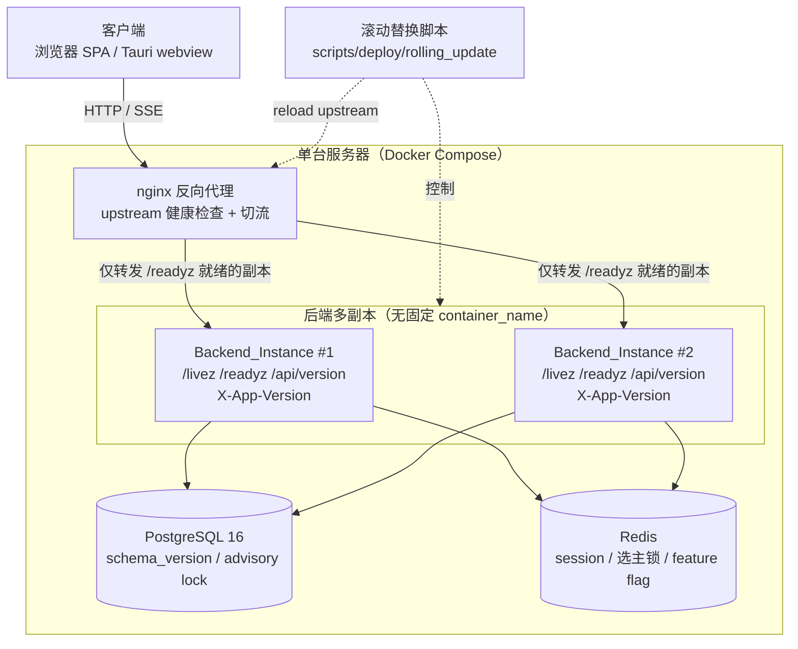
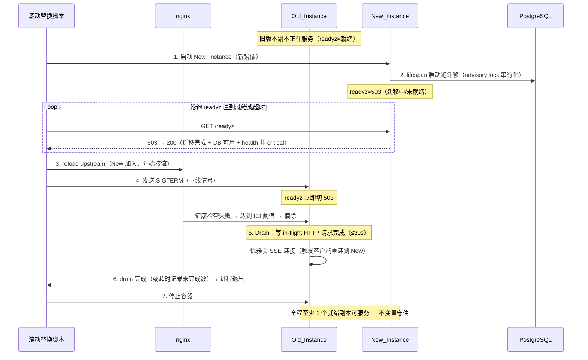
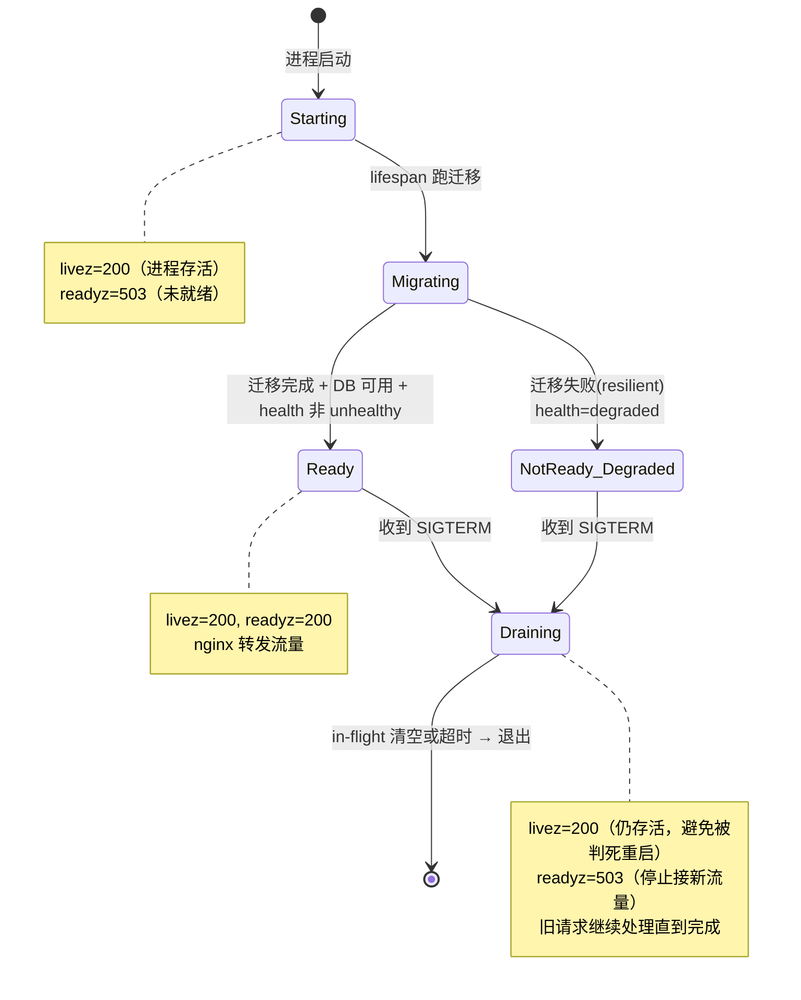
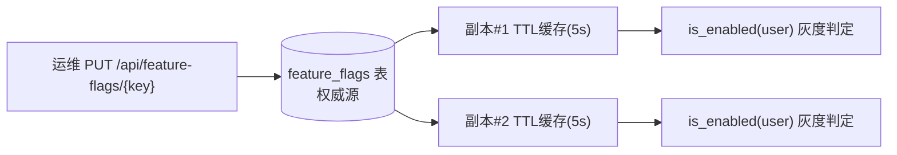

# 设计文档：服务器零停机滚动更新与无感版本迭代（zero-downtime-deployment）

## 概述

本设计为审计平台建立**服务器侧硬零停机部署能力**：后端版本迭代、数据库迁移、实例替换全程用户无感——不掉线、不报错、不需手动刷新、正在处理的请求不被中断。

### 设计定位（三条总纲）

1. **硬零停机，而非软无感。** 核心约束 = `Zero_Downtime_Invariant`（零停机不变量）：滚动期新旧 `Backend_Instance` 同时连接同一个数据库，**任意时刻到达的任意请求都不得返回 5xx 或连接中断**。本设计的每个环节（探针、下线、迁移、切流、SSE）都以"守住该不变量"为验收基线。

2. **部署架构 A 起步、预留 B 接口。**
   - **A（本期落地）**：单台服务器 Docker Compose 多后端副本 + nginx 反向代理切流 + 滚动替换脚本。适合事务所私有化交付（数据合规、单机自治）。
   - **B（仅预留抽象，本期不实现）**：未来迁移 K8s（Deployment / Service / Ingress + readiness/liveness probe + 原生滚动）。
   - **通用抽象**（`/readyz`、`/livez`、`Version_Endpoint`、`MigrationRunner` 幂等 + `pg_advisory_lock`、HTTP 优雅下线）对 A/B 无差别；**A 专属**（nginx 配置 + 切流脚本、Compose 多副本编排、滚动替换脚本）后续由 K8s 原语整体替换。设计末尾给出**替换映射表**。

3. **扩展接入已有体系，而非重建。** 经 codegraph 实证（见下"现状实证"），平台已具备零停机的多项关键基础。本设计仅补齐缺失的 7 项能力，凡已有组件一律"接入/适配/扩展"。

### 桌面端原则（仅声明，本期不展开）

桌面端为 P2，未来用 **Tauri**（系统 webview，非 Electron）封装同一套 Vue 前端壳。**关键原则：桌面壳的前端从服务器运行时加载，不打包死**——使零停机能力对 Web 端与桌面端统一生效。因此本设计的前端版本协商**不得假设客户端为固定打包版本**：版本检测、`X-App-Version`、非阻断提示等机制对"浏览器 SPA"与"Tauri webview 内的同一套 SPA"行为一致。

### 现状实证（基于真实代码，标注「已有 / 缺失 / 扩展」）

| 组件 | 位置 | 实证现状 | 本设计处置 |
|------|------|----------|-----------|
| `/api/version` | `backend/app/main.py` | **已有但硬编码** `return {"version":"1.0.0","api_prefix":"/api"}` | **扩展改造**：返回真实 `Build_Version`（git hash + 构建时间） |
| `/api/health` | `backend/app/api/health.py` | **已有**：PG + Redis + 迁移失败 + schema drift，`degraded`（仅 critical 漂移 orm_extra/enum_mismatch 翻 degraded）；200=healthy/degraded、503=unhealthy；**无需认证** | **复用为 `/readyz` 健康数据源**，不重建健康逻辑 |
| `lifespan` | `backend/app/main.py` | **已有**：启动 `_run_migrations()` + `register_event_handlers()` + 启动后台 worker；关闭时 worker 已 graceful（`stop_event.set()` + `task.cancel()` + `await t`，F44）+ `dispose_engine()` | **扩展**：加 HTTP 请求级 in-flight 计数 + SIGTERM drain（当前**仅后台 worker graceful，HTTP 请求无 drain**） |
| `MigrationRunner` | `backend/app/core/migration_runner.py` | **已有**：`run_pending()`；`_advisory_lock()` 用 `pg_advisory_lock(_MIGRATION_ADVISORY_LOCK_KEY)` 独立连接持锁串行化多 worker（非 PG 降级不加锁）；`scan_migrations()`（V/R 配对）；`schema_version` 表去重；`rollback_to(target, confirm, operator)`；resilient 模式（单迁移失败写 `schema_migration_failures` + health degraded 不阻塞启动） | **复用为零停机迁移执行内核**（A/B 通用），扩展向后兼容 CI 校验 |
| JWT 无状态认证 | 认证层 | **已有**：token 在客户端、session 走 Redis | **天然支持多副本**，无需改造（需求 4 前提） |
| `docker-compose.yml` | 仓库根 | **已有**：backend `profiles:[docker-backend]` + 固定 `container_name=audit-backend` + 端口 8000 + healthcheck `curl /api/health`；**nginx 不存在**；PG/PgBouncer/Redis(+sentinel HA)/OnlyOffice/Metabase/Paperless/vLLM | **改造**：去 `container_name` + 多副本；**新增 nginx 服务** |
| 前端 SPA + SSE | `audit-platform/frontend/` | **已有**：Vite SPA；`ImportProgress.vue` 已实现 EventSource `onerror` → 关流 → 轮询 `/jobs/{id}` 回退 → 重连（`MAX_RECONNECT_ATTEMPTS=30` ≈ 60s）；stale 走 `LINKAGE_STALE_CHANGED` | **扩展**：版本检测 composable + 非阻断提示；将 `ImportProgress` 重连模式抽为通用 `useSSEReconnect` 推广到所有 SSE |
| CI | `.github/workflows/ci.yml` | **已有**：多 job（backend-tests/lint/seed-validate 等）+ `sqlfluff-lint`（`continue-on-error` warning 级）+ file-size-guard | **接入**：新增 Breaking_DDL 检测 job，复用 `continue-on-error` 双档（warning/strict）模式 |
| `ResponseWrapperMiddleware` | `backend/app/middleware/response.py` | **已有**：包 `{code,message,data}`；健康/SSE 等已在 `_SKIP_PATHS` 跳过 | `/livez`/`/readyz` 须加入跳过集（探针消费方需原始 JSON + 裸状态码） |

### 缺失能力清单（本设计补齐 7 项）

| 编号 | 缺失 | 优先级 | 设计章节 |
|------|------|--------|----------|
| ① | 前后端版本协商 | P0 | §组件 1（version 注入 + X-App-Version + 前端协商） |
| ② | 迁移向后兼容 CI 卡点 | P0 | §组件 5（Breaking_DDL 检测脚本 + CI 双档） |
| ③ | 就绪探针 + HTTP 优雅下线 | P0 | §组件 2、3（/livez /readyz + GracefulShutdown） |
| ④ | nginx 反代 + 滚动替换 | P1 | §组件 6（nginx + 滚动脚本 + compose 改造） |
| ⑤ | SSE 零停机 | P1 | §组件 7（服务端优雅关 SSE + useSSEReconnect） |
| ⑥ | 在线 DDL 安全 | P2 | §组件 5（锁表语句检测，规约层卡点） |
| ⑦ | feature flag 灰度 | P2 | §组件 8（FeatureFlagService + V068） |

### 当前迁移版本号约定

经实证当前最高迁移 **V066**（`V066__template_fill_columns.sql`），`deliverable-lineage-and-writeback` spec 已规划占用 **V067**。故本 spec 若需迁移（feature flag 用 DB 存储时），使用 **V068**。

### 生产部署拓扑（关键前提，消除歧义）

> 本小节明确定义生产拓扑，解决"多容器副本 vs 单容器多 worker"与"nginx DNS vs 具名 upstream"两处歧义。**所有后续设计（nginx 配置、drain 协调、worker 选主、滚动脚本）均以此拓扑为唯一前提。**

**拓扑结论：N 个独立后端容器副本（每副本 1 个 uvicorn worker 进程）+ nginx 具名 upstream 列表。**

| 维度 | 选定方案 | 排除的方案 | 理由 |
|------|----------|------------|------|
| **副本形态** | **N 个独立容器**（显式具名多 service `backend1`/`backend2`，便于 nginx 具名 upstream 引用），每容器跑**单** uvicorn worker（`uvicorn app.main:app --workers 1`，非 `--reload`） | ❌ 单容器 `--workers N`（fork N 进程）；❌ `--scale backend=N`（动态名 `backend-1` 不便 nginx 具名引用） | 单容器多 worker 下每个 worker 进程各自跑 lifespan（各跑迁移注册/SIGTERM/drain/worker 选主），master 与 worker 的信号转发、in-flight 计数跨进程协调复杂且 drain 不可靠；**多容器单 worker 则"1 容器 = 1 进程 = 1 个干净的 lifespan + drain 单元"**，且每容器天然对应未来 K8s 的 1 个 Pod，迁移到 B 方案零认知差 |
| **nginx 上游成员** | **具名 upstream server 列表**（每副本一条 `server backendN:8000`），滚动脚本通过**改 upstream 成员 + `nginx -s reload`** 主动增删副本 | ❌ 单一服务名靠 Docker DNS 动态解析（`server backend:8000`） | 开源 nginx 默认**启动时只解析一次 DNS**，容器增减不自动感知（除非 `resolver` + 变量式 proxy_pass，但对已停容器仍可能短暂转发 → 502）；具名列表 + reload 是**确定性**控制：脚本明确知道哪个副本就绪后才加入、哪个排空后才移除，与零停机不变量严格对齐 |
| **进程级状态** | in-flight 计数、migration_state、shutdown_state、worker 选主均为**单进程内**单例（因每容器单 worker，进程级 = 副本级，无跨进程协调问题） | — | 简化 drain 与选主：drain 等本进程 in-flight 归零即可；worker 选主在 N 个容器间用 Redis/PG 锁（仍需要，因多容器） |

**worker 选主仍必要**：虽每容器单进程，但有 N 个容器副本，后台 worker（sla/outbox/cleanup）仍须跨副本去重 → 组件 9 的 Redis/PG 选主锁在**容器副本间**生效（非进程间）。

**与 K8s（B 方案）的对应**：N 容器副本 = N 个 Pod replica；nginx 具名 upstream = K8s Service Endpoints（readiness probe 自动增删）；滚动脚本逐副本 = Deployment RollingUpdate（maxUnavailable=0）。拓扑一一对应，迁移零改动通用抽象。


---

## 架构

### 整体拓扑（A 方案：单机多副本）



### 滚动替换流程（逐副本零停机切换）



### 探针状态机（readyz 是切流唯一依据）



### 零停机不变量贯穿点（每个环节如何守住「任意请求不 5xx」）

| 环节 | 风险（若不处理会 5xx / 中断） | 本设计守护机制 |
|------|------------------------------|----------------|
| 新副本启动 | 未就绪时被打流量 → 503/连接拒绝 | `/readyz` 启动期返 503，nginx 只转发就绪副本 |
| 迁移执行 | 多副本同时跑迁移冲突 / 破坏性 DDL 致旧副本读不到列 500 | `pg_advisory_lock` 串行化（已有）+ Breaking_DDL CI 卡点（向后兼容）+ Expand-Migrate-Contract |
| 新旧共存 | 旧副本遇到新迁移删/改的列 → 500 | 迁移铁律：禁同版破坏性 DDL，结构变更跨多次发布 |
| 旧副本下线 | 正在处理的请求被强杀 → 连接中断 | SIGTERM → readyz 置 503 → nginx 摘流 → drain 等 in-flight 完成（≤30s）→ 退出 |
| 切流瞬间 | nginx 仍把流量发往正在退出的副本 | nginx 健康检查 fail 阈值窗口 + readyz 先于退出置非就绪（留摘流时间差） |
| SSE 长连接 | 副本退出 SSE 静默挂起 → 前端永久 loading | 服务端 drain 时优雅关 SSE → 前端 `useSSEReconnect` 重连到新副本 + 轮询回退 |
| 前端版本 | 后端滚动到新版，老 SPA 调改动过的 API → 报错 | 版本协商非阻断提示 + API 契约用 Expand-Migrate-Contract 保留旧契约 |

### 关键设计决策

| 主题 | 选项 | 结论 | 理由 |
|------|------|------|------|
| **探针职责划分** | (a) 单一 health 端点兼任 (b) `/livez` + `/readyz` 分离 | **(b) 分离** | `livez`=进程存活（决定**是否重启**），只要事件循环能响应就 200，**不查 DB/依赖**（避免 DB 抖动误判进程死被反复重启）；`readyz`=可接流量（决定**是否切流**），查迁移完成 + DB ping + health 非 unhealthy。语义与 K8s liveness/readiness probe 一致（需求 13.4），B 方案直接复用 |
| **readyz 健康数据来源** | (a) 重写一套就绪检查 (b) 复用 `/api/health` | **(b) 复用** | `/api/health` 已含 PG/Redis/迁移失败/schema drift（critical 判定）；readyz 内部调用同一数据源，避免逻辑分裂。**差异**：health 的 `degraded`（critical drift / 迁移失败）→ readyz 仍可返 200（实例能服务，只是有可观测告警），但 `unhealthy`（PG/Redis 不可达）→ readyz 503 |
| **SIGTERM 优雅下线时序** | (a) 收到信号立即退出 (b) 信号 → readyz 非就绪 → drain → 退出 | **(b)** | 立即退出会中断 in-flight 请求（违反不变量 11.2）。正确时序：捕获 SIGTERM → 置 readyz 503 → 给 nginx 健康检查留摘流窗口 → drain 等待 in-flight HTTP 计数归零（默认 30s，可配 `GRACEFUL_SHUTDOWN_TIMEOUT`）→ 超时记录未完成数后退出 |
| **in-flight 请求追踪实现** | (a) ASGI 中间件计数 (b) uvicorn `--timeout-graceful-shutdown` (c) 二者结合 | **(c) 结合** | 中间件维护 in-flight 计数器（精确感知业务请求 + 可优雅关 SSE）；uvicorn 自身 `--timeout-graceful-shutdown` 作底层兜底。中间件优先，因需在 drain 期主动关 SSE + 暴露未完成数到日志 |
| **build version 注入** | (a) 运行时执行 `git rev-parse` (b) 构建期写 version 文件/env | **(b) 构建期注入** | 运行时跑 git 命令依赖容器内有 `.git` + git 二进制（生产镜像通常没有），脆弱。构建期由 CI 把 `git rev-parse --short HEAD` + 语义版本 + 构建时间写入 `backend/app/_build_version.json`（或 `BUILD_VERSION` 环境变量），`/api/version` 读取。镜像不可变 → 版本随镜像固定 |
| **版本协商交互** | (a) 强制刷新 (b) 非阻断「新版本可用」提示 | **(b) 非阻断** | 硬零停机的本质是老前端**继续可用**（需求 1.5），强制刷新 = 软无感、会打断用户操作。响应头 `X-App-Version` + 前端 ≤60s 轮询/读头 → 检测到版本变化只显示可关闭的「新版本可用」提示，用户自行刷新 |
| **迁移向后兼容检测** | (a) 正则匹配 SQL 文本 (b) sqlglot 解析 AST | **(b) sqlglot AST** | 正则易误报/漏报（注释、字符串、多语句）。用 `sqlglot` 解析 `V*.sql` 识别 `DROP COLUMN` / `RENAME COLUMN` / 不兼容 `ALTER COLUMN TYPE` / 加 `NOT NULL` 无默认列。`sqlglot` 已在仓库依赖（契约测试 `test_raw_sql_column_contract.py` 已用 pg dialect 解析），不引入新依赖 |
| **CI 卡点档位** | (a) 直接 strict 阻断 (b) warning/strict 双档开关 | **(b) 双档**（需求 2.8） | 初稿期 strict 阻断会拖慢开发；复用现有 `sqlfluff-lint` 的 `continue-on-error` warning 模式：默认 `warning`（仅告警），初稿稳定后团队显式切 `strict`（违规阻断合并）。档位由环境变量/CI 输入控制 |
| **nginx 滚动编排** | (a) docker compose scale + nginx upstream + 脚本 (b) K8s Deployment | **A=(a)，B 预留(b)** | A：去 `container_name` → `docker compose up --scale backend=N` → nginx upstream 列多副本 + 健康检查 → 滚动脚本逐副本替换。B：未来 K8s Deployment replicas + RollingUpdate strategy 替换。脚本与 nginx 配置标注 A 专属 |
| **SSE 零停机** | (a) 服务端不管，纯靠前端超时 (b) 服务端 drain 优雅关 + 前端通用重连 | **(b)** | 静默挂起让前端永久 loading。服务端 drain 时主动关闭 SSE 触发 `EventSource.onerror` → 前端 `useSSEReconnect`（抽自现有 `ImportProgress`）重连 + 轮询真实作业状态回退 |
| **feature flag 存储** | (a) 进程内配置 (b) Redis (c) DB 表 | **(c) DB 表 + 短 TTL 缓存**（需求 9.5 多副本一致） | 进程内配置无法多副本一致 + 关开关需重部署（违反 9.4）。DB 表（V068 `feature_flags`）作权威源，各副本读取加短 TTL（如 5s）内存缓存平衡一致性与性能；关开关即时生效（≤TTL）。Redis 作为可选加速层但 DB 是 source of truth（私有化单机 Redis 可能未持久化） |
| **多副本后台 worker 去重** | (a) 每副本都跑（重复）(b) 单独 worker 容器 (c) 选主 | **(c) 选主（advisory lock / Redis 锁）+ 已有开关** | 现状 `LEDGER_IMPORT_IN_PROCESS_RUNNER_ENABLED` 已可关进程内 runner 改用 standalone worker 进程。对仍需 in-process 的后台 worker（sla/outbox/cleanup 等），多副本下用「选主锁」（PG advisory lock 或 Redis SETNX + TTL）确保同一后台任务仅一个副本执行，未抢到锁的副本跳过该 worker 循环 |

---

## 组件与接口

> 每个组件标注「新增 / 扩展」+ A/B 归属。所有签名为设计意图，非最终实现。

### 组件 1：Build Version 注入 + Version Endpoint 改造 + X-App-Version 中间件（新增 + 扩展，A/B 通用）

**职责**：提供真实构建版本的单一来源；每个 HTTP 响应携带版本头；前端据此做版本协商。

**1a. 构建期版本注入**（CI 步骤，非运行时）

CI 在构建镜像时写入版本文件：
```python
# backend/app/core/build_version.py（新增）
from functools import lru_cache
import json, os
from pathlib import Path

_BUILD_VERSION_FILE = Path(__file__).resolve().parent.parent / "_build_version.json"

@lru_cache(maxsize=1)
def get_build_version() -> dict:
    """返回 {semantic_version, git_commit, build_time}。
    优先级：环境变量 BUILD_VERSION_JSON > _build_version.json 文件 > 兜底默认。
    运行时不执行 git 命令（生产镜像可能无 .git/git 二进制）。
    """
    # 1. 环境变量（容器注入）
    env_json = os.getenv("BUILD_VERSION_JSON")
    if env_json:
        return json.loads(env_json)
    # 2. 构建期写入的文件
    if _BUILD_VERSION_FILE.exists():
        return json.loads(_BUILD_VERSION_FILE.read_text(encoding="utf-8"))
    # 3. 兜底（本地开发未注入）
    return {"semantic_version": "dev", "git_commit": "unknown", "build_time": "unknown"}
```

CI 注入脚本（构建前）：`git rev-parse --short HEAD` + `date -u +%Y-%m-%dT%H:%M:%SZ` + 语义版本 → 写 `_build_version.json`。

**1b. `/api/version` 改造**（扩展 main.py 已有硬编码端点）
```python
@app.get("/api/version")
async def api_version():
    bv = get_build_version()
    return {
        "version": bv["semantic_version"],   # 语义版本号
        "git_commit": bv["git_commit"],       # git commit hash
        "build_time": bv["build_time"],       # 构建时间
        "api_prefix": "/api",
    }
```

**1c. `X-App-Version` 响应头中间件**（新增轻量中间件）
```python
# backend/app/middleware/app_version.py（新增）
class AppVersionHeaderMiddleware:
    """在每个响应注入 X-App-Version: {git_commit}。开销极小（启动时读一次缓存）。"""
    async def dispatch(self, request, call_next):
        response = await call_next(request)
        response.headers["X-App-Version"] = get_build_version()["git_commit"]
        return response
```
> 该中间件放在洋葱较外层，确保所有响应（含错误响应）都带版本头。

### 组件 2：探针端点 /livez 与 /readyz（新增，A/B 通用）

**职责**：`/livez` 反映进程存活（决定重启）；`/readyz` 反映可接流量（决定切流）。语义对齐 K8s probe。

```python
# backend/app/api/probes.py（新增，无需认证，须加入 ResponseWrapper _SKIP_PATHS）
router = APIRouter(tags=["探针"])

@router.get("/livez")
async def livez():
    """存活探针：只要事件循环能响应即 200。不查 DB/依赖（避免 DB 抖动误判进程死）。"""
    return JSONResponse(status_code=200, content={"status": "alive"})

@router.get("/readyz")
async def readyz():
    """就绪探针：迁移完成 + DB 可用 + health 非 unhealthy + 未处于 draining。
    - draining（收到 SIGTERM）→ 503
    - DB/Redis 不可达（health=unhealthy）→ 503
    - 迁移未完成 → 503
    - health=degraded（critical drift / 迁移失败但 resilient 启动）→ 仍 200（实例能服务，
      degraded 仅作可观测；需求 6.3 要求 readyz 反映 degraded → 在 body 暴露但状态码 200）

    性能：nginx 被动探测 + 滚动脚本轮询会高频打 readyz，而完整 /api/health 含 schema drift
    （查 information_schema）+ redis + 子健康检查，较重。故 readyz **不每次跑全量 health**：
    - draining / migration 标志是进程内单例，零成本先判（draining 或迁移未完成直接出结果）；
    - health 数据走 `get_health_snapshot()` 的**短 TTL 缓存（默认 2s，可配 READYZ_HEALTH_CACHE_TTL）**，
      高频探测命中缓存不压库；缓存过期才真正跑一次 health。
    """
    if shutdown_state.is_draining():
        return JSONResponse(status_code=503, content={"status": "draining"})
    if not migration_state.is_complete():
        return JSONResponse(status_code=503, content={
            "status": "not_ready", "migration_complete": False,
        })
    health = await get_health_snapshot(cache_ttl=2)   # 短 TTL 缓存，避免高频探测压库
    if health["status"] == "unhealthy":
        return JSONResponse(status_code=503, content={
            "status": "not_ready", "migration_complete": True, "health": "unhealthy",
        })
    return JSONResponse(status_code=200, content={
        "status": "ready",
        "degraded": health["status"] == "degraded",   # 6.3：暴露但不阻断接流
        "build_version": get_build_version()["git_commit"],
    })
```

**`migration_state` / `shutdown_state`**：进程级单例标志。`lifespan` 在 `_run_migrations()` 完成后置 `migration_state.complete = True`；SIGTERM handler 置 `shutdown_state.draining = True`。

### 组件 3：GracefulShutdown — HTTP in-flight 计数 + SIGTERM drain（扩展 lifespan，A/B 通用）

**职责**：扩展现有 lifespan 关闭流程（当前仅后台 worker graceful），加 HTTP 请求级 drain。

**3a. in-flight 计数中间件**（新增）
```python
# backend/app/middleware/inflight.py（新增）
class InflightTrackingMiddleware:
    """维护进程级 in-flight HTTP 请求计数；drain 时供等待判定。
    探针请求（/livez /readyz）不计数（避免健康检查永远阻止 drain 完成）。"""
    async def dispatch(self, request, call_next):
        if request.url.path in ("/livez", "/readyz"):
            return await call_next(request)
        inflight_counter.increment()
        try:
            return await call_next(request)
        finally:
            inflight_counter.decrement()
```

**3b. SIGTERM handler + drain 逻辑**（扩展 lifespan）
```python
# 在 lifespan 内注册信号处理
import signal
def _install_sigterm_handler():
    loop = asyncio.get_running_loop()
    def _on_sigterm():
        shutdown_state.draining = True   # 1. readyz 立即转 503
        drain_event.set()
    try:
        loop.add_signal_handler(signal.SIGTERM, _on_sigterm)  # POSIX
    except NotImplementedError:
        signal.signal(signal.SIGTERM, lambda *_: _on_sigterm())  # Windows 兜底

async def _drain_http_requests(timeout: float):
    """等待 in-flight HTTP 请求归零，上限 timeout（默认 30s）。"""
    deadline = loop.time() + timeout
    while inflight_counter.value() > 0 and loop.time() < deadline:
        await asyncio.sleep(0.2)
    remaining = inflight_counter.value()
    if remaining > 0:
        log.warning("[Shutdown] drain 超时，仍有 %d 个 in-flight 请求未完成", remaining)
```

**3c. lifespan 关闭顺序**（扩展现有 yield 后逻辑）
```
yield
1. （SIGTERM 已置 draining=True，readyz 已 503，nginx 摘流中）
2. 给 nginx 健康检查留窗口（sleep PRE_DRAIN_DELAY，默认 2s，覆盖 fail 阈值周期）
3. 优雅关闭所有 SSE 连接（sse_registry.close_all()，触发客户端重连，见组件 7）
4. await _drain_http_requests(GRACEFUL_SHUTDOWN_TIMEOUT=30s)
5. stop_event.set() + worker task.cancel() + await（现有 F44 逻辑，不变）
6. dispose_engine()（现有）
```

**配置**：`GRACEFUL_SHUTDOWN_TIMEOUT`（默认 30）、`PRE_DRAIN_DELAY`（默认 2）。
**Windows 注意**：`loop.add_signal_handler` 在 Windows 不支持 → `signal.signal` 兜底；生产 Linux 容器为主路径（见风险章节）。

### 组件 4：前端版本协商（新增，A/B 通用）

**职责**：检测服务端版本变化，非阻断提示，老前端继续运行。

**4a. `useVersionCheck` composable**（新增）
```typescript
// audit-platform/frontend/src/composables/useVersionCheck.ts（新增）
export function useVersionCheck() {
  const localVersion = ref<string>('')        // 页面加载时锁定的版本
  const serverVersion = ref<string>('')
  const updateAvailable = ref(false)

  // 读取响应头（来自任意 API 响应的 X-App-Version）或轮询 /api/version
  function recordServerVersion(v: string) {
    if (!localVersion.value) localVersion.value = v   // 首次锁定本地版本
    serverVersion.value = v
    if (localVersion.value && v && v !== localVersion.value) {
      updateAvailable.value = true                    // 检测到版本漂移
    }
  }

  // ≤60s 轮询（需求 1.3），或在 http 拦截器读 X-App-Version 后调 recordServerVersion
  let timer: number
  onMounted(() => {
    timer = window.setInterval(async () => {
      const { api } = await import('@/services/apiProxy')
      const v: any = await api.get('/api/version')
      recordServerVersion(v.git_commit)
    }, 60_000)
  })
  onUnmounted(() => clearInterval(timer))
  return { updateAvailable, localVersion, serverVersion, recordServerVersion }
}
```

**4b. 非阻断提示组件**（新增 `<NewVersionBanner>`）：检测到 `updateAvailable` → 显示可关闭的「新版本可用，建议刷新」横幅（GT 紫令牌），**不强制刷新、不中断操作**（需求 1.4/1.5）。

> http 拦截器可顺带从每个响应读 `X-App-Version` 调 `recordServerVersion`，使检测延迟远低于 60s 轮询上限（轮询作兜底）。

### 组件 5：迁移向后兼容检测脚本 + CI 接入（新增，A/B 通用）

**职责**：扫描新增 `V*.sql`，sqlglot 解析识别 Breaking_DDL + 锁表语句，双档处置。

```python
# backend/scripts/check/check_migration_compat.py（新增）
import sqlglot
from sqlglot import exp

BREAKING_PATTERNS = {
    "DROP_COLUMN":   "DROP COLUMN（破坏性：旧代码读不到列）",
    "RENAME_COLUMN": "RENAME COLUMN（破坏性：旧代码引用旧列名失败）",
    "ALTER_TYPE":    "ALTER COLUMN TYPE（可能不兼容旧代码读写）",
    "ADD_NOT_NULL_NO_DEFAULT": "新增 NOT NULL 无默认值列（旧代码 INSERT 不含该列将失败）",
}
LOCK_PATTERNS = {
    "CREATE_INDEX_NON_CONCURRENT": "CREATE INDEX 未用 CONCURRENTLY（大表锁表，需求 8.2）",
}
EXEMPTION_MARKER = "-- breaking-ddl-exempt:"   # 豁免声明注释（标前置收缩版本号）

def scan_migration(sql_text: str, filename: str) -> list[Violation]:
    """sqlglot 解析 AST 识别破坏性/锁表 DDL；带豁免注释的跳过并记录。"""
    violations = []
    has_exemption = EXEMPTION_MARKER in sql_text
    for stmt in sqlglot.parse(sql_text, read="postgres"):
        if stmt is None:
            continue
        # DROP COLUMN
        if isinstance(stmt, exp.AlterTable):
            for action in stmt.args.get("actions", []):
                if isinstance(action, exp.Drop) and action.args.get("kind") == "COLUMN":
                    violations.append(Violation(filename, "DROP_COLUMN", str(action), exempt=has_exemption))
                # ... RENAME / ALTER TYPE / ADD NOT NULL 无默认 / 同理
        # CREATE INDEX 非 CONCURRENTLY
        if isinstance(stmt, exp.Create) and stmt.args.get("kind") == "INDEX":
            if not _is_concurrent(stmt):
                violations.append(Violation(filename, "CREATE_INDEX_NON_CONCURRENT", str(stmt), exempt=False))
    return violations

def main(mode: str):   # mode = "warning" | "strict"
    violations = scan_changed_migrations()   # 仅扫本次 PR 新增的 V*.sql
    non_exempt = [v for v in violations if not v.exempt]
    report(violations)
    if mode == "strict" and non_exempt:
        sys.exit(1)    # strict 档阻断合并
    sys.exit(0)        # warning 档仅告警
```

**CI 接入**（`.github/workflows/ci.yml` 新增 job，复用 sqlfluff 的 continue-on-error 模式）：
```yaml
  migration-compat-check:
    runs-on: ubuntu-latest
    continue-on-error: ${{ vars.MIGRATION_COMPAT_MODE != 'strict' }}   # 双档：默认 warning
    steps:
      - uses: actions/checkout@v4
        with: { fetch-depth: 0 }   # 需 diff 出新增迁移文件
      - run: python backend/scripts/check/check_migration_compat.py --mode ${{ vars.MIGRATION_COMPAT_MODE || 'warning' }}
```
> 档位由仓库变量 `MIGRATION_COMPAT_MODE` 控制，默认 `warning`；初稿稳定后团队改为 `strict`（需求 2.8 / 10.3）。

### 组件 6：nginx 反向代理 + 滚动替换脚本 + compose 改造（新增，**A 专属**）

**6a. compose 改造**（去固定 container_name + 多副本，需求 5.1）
```yaml
  backend:
    profiles: [docker-backend]
    # container_name: audit-backend   ← 删除（固定名无法多副本）
    build: { context: ./backend }
    expose: ["8000"]                  # 不再 ports 直接映射宿主机，由 nginx 统一入口
    command: ["uvicorn", "app.main:app", "--host", "0.0.0.0", "--port", "8000", "--workers", "1"]  # 单 worker（多容器副本，非单容器多 worker）；生产禁 --reload
    stop_grace_period: 40s            # > GRACEFUL_SHUTDOWN_TIMEOUT(30s)，给 drain 足够时间
    environment:
      BUILD_VERSION_JSON: ${BUILD_VERSION_JSON}
      GRACEFUL_SHUTDOWN_TIMEOUT: "30"
    healthcheck:
      test: ["CMD-SHELL", "curl -f http://localhost:8000/readyz || exit 1"]   # 改用 readyz
```
> **拓扑对齐**（见概述「生产部署拓扑」）：每副本**单 uvicorn worker**（1 容器 = 1 进程 = 1 个干净 drain 单元）；副本数由滚动脚本管理的具名容器（如 `backend1` / `backend2`）体现，**不依赖 compose `deploy.replicas` + DNS**（那样 nginx 无法用具名 upstream 精确控制成员）。

**6b. nginx 配置**（新增 `docker/nginx/nginx.conf`，A 专属）
```nginx
upstream backend_pool {
    # 具名 upstream 列表：每副本一条 server（非单一服务名靠 Docker DNS 动态解析）。
    # 滚动脚本通过改写本列表成员 + `nginx -s reload` 主动增删副本（确定性控制，
    # 避免开源 nginx 启动只解析一次 DNS、不感知容器增减导致转发到已停容器 → 502）。
    server backend1:8000 max_fails=2 fail_timeout=5s;
    server backend2:8000 max_fails=2 fail_timeout=5s;
    # 滚动时：新副本就绪后追加其 server 行 reload；旧副本排空后移除其 server 行 reload
}
server {
    listen 80;
    location /livez  { proxy_pass http://backend_pool; }
    location /readyz { proxy_pass http://backend_pool; }
    location / {
        proxy_pass http://backend_pool;
        proxy_next_upstream error timeout http_502 http_503;  # 不就绪副本自动切下一个
        proxy_read_timeout 3600s;            # SSE 长连接
        proxy_buffering off;                 # SSE 需关闭缓冲
    }
}
```
> 开源 nginx 无主动健康检查，依赖被动 `max_fails` + `proxy_next_upstream` 兜底瞬时不一致；**成员增删由滚动脚本主动 reload 控制**（确定性），而非 DNS 被动感知。可选 nginx-plus / 第三方模块做主动 readyz 探测增强。upstream 成员列表可由脚本用模板渲染（`nginx.conf.template` + envsubst / 直接改 `include` 的 upstream 片段文件）。

**6c. 滚动替换脚本**（新增 `scripts/deploy/rolling_update.sh`，A 专属）
```
逐副本执行（需求 5.3）：
  for each old replica:
    1. 启动 new 容器（新镜像）
    2. 轮询 new 的 /readyz 直到 200 或超 READINESS_TIMEOUT → 超时则中止 + 保留 old（需求 5.5）
    3. nginx reload（new 进 upstream）
    4. docker stop old（发 SIGTERM，stop_grace_period=40s 内 drain）
    5. 确认 old 退出 + nginx reload（old 出 upstream）
  回滚（需求 5.6）：保留上一镜像 tag，失败时切回 old 版本
```

### 组件 7：SSE 优雅关闭 + 前端通用重连（扩展，服务端 A/B 通用 / 前端通用）

**7a. 服务端 SSE 注册表 + drain 优雅关**（新增）
```python
# backend/app/core/sse_registry.py（新增）
class SSERegistry:
    """登记所有活跃 SSE 连接；drain 时统一优雅关闭（发结束事件 + 关闭生成器），
    触发客户端 EventSource.onerror → 前端重连到新副本。"""
    async def close_all(self):
        for conn in list(self._active):
            await conn.send_event({"event": "server_draining"})  # 通知客户端即将断开
            conn.close()
```
> SSE 端点在建立连接时 register、断开时 unregister；lifespan drain 步骤 3 调 `close_all()`。
>
> **现有 SSE 端点盘点（须逐个接入 registry，漏接则该连接 drain 时静默挂起）**：实施前用 grep/codegraph 盘出全部 SSE 端点（已知至少：`events.py` `/api/events/stream`（stale/通用事件推送 `LINKAGE_STALE_CHANGED`）、导入进度 stream（`ledger_import_v2.py` `/jobs/{job_id}/stream`），可能还有 task_events 等）。**每个端点的 `EventSourceResponse`/生成器都须在进入时 `sse_registry.register(conn)`、退出时 `unregister`**。tasks 须含"盘点并逐个接入"子任务，不可只接一个。

**7b. 前端 `useSSEReconnect`**（新增，抽自现有 `ImportProgress.vue` 重连模式）
```typescript
// audit-platform/frontend/src/composables/useSSEReconnect.ts（新增）
export function useSSEReconnect(opts: {
  url: string
  onMessage: (data: any) => void
  pollFallback: () => Promise<'completed' | 'failed' | 'running'>  // 轮询真实状态
  maxAttempts?: number   // 默认 30（≈60s，与 ImportProgress 一致）
  backoffMs?: number     // 默认 2000
}) {
  // onerror → 关流 → pollFallback() 查真实状态：
  //   completed/failed → 渲染终态（不报"中断"，需求 7.4）
  //   running → 重连（≤maxAttempts，退避 backoffMs，需求 7.5）
  //   超 maxAttempts → 才提示中断
  // 收到消息重置 attempts（连接健康）
}
```
> 将 `ImportProgress.vue` 重构为消费 `useSSEReconnect`，其余 SSE 场景（stale 推送 `LINKAGE_STALE_CHANGED` 等）统一接入，消除重复实现（需求 7 推广）。

### 组件 8：FeatureFlagService（新增，A/B 通用，需 V068 迁移）

**职责**：DB 权威源 + 短 TTL 缓存，多副本一致；灰度命中（用户/百分比）；关开关即时生效不重部署。

```python
# backend/app/services/feature_flag_service.py（新增）
class FeatureFlagService:
    _CACHE_TTL_SECONDS = 5    # 短 TTL：多副本最终一致，关开关 ≤5s 全副本生效

    async def is_enabled(self, db, flag_key: str, *, user_id: str | None = None) -> bool:
        """读 feature_flags 表（TTL 缓存）；按 enabled + rollout 策略判定命中。
        - 全局关 → False（代码上线但功能不暴露，需求 9.2）
        - 全局开 + rollout_percentage → 按 user_id 稳定哈希判定灰度命中（需求 9.3）
        - 白名单用户 → 命中
        """
        flag = await self._get_flag_cached(db, flag_key)
        if flag is None or not flag.enabled:
            return False
        if user_id and user_id in (flag.whitelist_user_ids or []):
            return True
        if flag.rollout_percentage >= 100:
            return True
        if flag.rollout_percentage <= 0:
            return False
        # 稳定哈希：同一 user 对同一 flag 结果稳定（避免抖动）
        bucket = int(hashlib.md5(f"{flag_key}:{user_id}".encode()).hexdigest(), 16) % 100
        return bucket < flag.rollout_percentage
```

**读写端点**（新增 `backend/app/api/feature_flags.py`，需注册到 router_registry，需认证 admin）：
- `GET /api/feature-flags` — 列出所有开关（运维可观测）
- `GET /api/feature-flags/{key}` — 单开关状态
- `PUT /api/feature-flags/{key}` — 设置 enabled / rollout_percentage / whitelist（即时生效，无需重部署，需求 9.4）

### 组件 9：后台 worker 多副本去重（扩展，A/B 通用）

**职责**：多副本下同一后台任务仅一个副本执行。

**策略**：
- 已有开关 `LEDGER_IMPORT_IN_PROCESS_RUNNER_ENABLED`：生产多副本下关闭进程内 import runner，改用 standalone `python -m app.workers.import_worker` 单独容器（推荐，已有路径）。
- 对仍需 in-process 的 worker（sla/outbox/cleanup 等）：在 worker run loop 内用「选主锁」——每轮尝试 `pg_advisory_lock`（worker 专属 key）或 Redis `SET key value NX PX ttl`，抢到锁才执行本轮任务，未抢到则 sleep 跳过。锁随 TTL/连接释放，主副本退出后其他副本接管。

```python
# backend/app/workers/_leader_lock.py（新增辅助）
async def try_acquire_leadership(worker_key: str, ttl_ms: int) -> bool:
    """Redis SETNX + TTL 选主；返回是否成为本轮 leader。
    单机 Redis 不可用时降级为 PG advisory_try_lock（pg_try_advisory_lock，非阻塞）。"""
```

---

## 数据模型

本功能大部分能力**无需新增数据库表**（探针、版本注入、优雅下线、SSE、nginx 编排均为运行时/构建期/编排层，不落库）。唯一需要持久化的是 **feature flag**（需求 9.5 要求多副本一致 → 集中存储）。

### feature_flags 表（新增，V068 迁移）

> 当前最高迁移 V066，deliverable-lineage 占 V067，故本表用 **V068**。

| 列 | 类型 | 约束 | 说明 |
|----|------|------|------|
| `id` | UUID | PK，`gen_random_uuid()` | 主键 |
| `flag_key` | VARCHAR(128) | UNIQUE NOT NULL | 开关键（如 `new_consol_ui`） |
| `description` | TEXT | NULL | 开关用途描述 |
| `enabled` | BOOLEAN | NOT NULL DEFAULT false | 全局开关（默认关，需求 9.1） |
| `rollout_percentage` | SMALLINT | NOT NULL DEFAULT 0，CHECK 0~100 | 灰度百分比（需求 9.3） |
| `whitelist_user_ids` | JSONB | NULL | 白名单用户（精确灰度命中） |
| `created_at` | TIMESTAMPTZ | NOT NULL DEFAULT now() | TimestampMixin |
| `updated_at` | TIMESTAMPTZ | NOT NULL DEFAULT now() | TimestampMixin |

**三层一致性**（操作铁律）：
- **DB**：`V068__feature_flags.sql`（`CREATE TABLE IF NOT EXISTS` 幂等）+ `R068__rollback.sql`（DROP TABLE 配对回滚）；显式写 `created_at`/`updated_at`（TimestampMixin 列须同步到手写 DDL，否则 schema drift）。
- **ORM**：`FeatureFlag(Base, TimestampMixin)` 模型加入 `audit_platform_models.py`，`Mapped[]` 列与 DDL 对齐。
- **Service**：`FeatureFlagService` 方法消费该模型。

### 进程级运行时状态（非持久化，内存单例）

| 状态对象 | 字段 | 用途 |
|----------|------|------|
| `migration_state` | `complete: bool` | readyz 判定迁移是否完成 |
| `shutdown_state` | `draining: bool` | readyz 判定是否在排空（503）+ 关闭流程协调 |
| `inflight_counter` | `value: int` | drain 等待 in-flight HTTP 请求归零 |
| `sse_registry` | `active: set[SSEConnection]` | drain 时优雅关闭所有 SSE |

### Build Version（构建期产物，非数据库）

| 字段 | 来源 | 示例 |
|------|------|------|
| `semantic_version` | CI 注入 / tag | `1.1.0` |
| `git_commit` | `git rev-parse --short HEAD` | `8d17ec7b` |
| `build_time` | CI 构建时刻（UTC） | `2026-06-10T08:30:00Z` |

存储于镜像内 `backend/app/_build_version.json` 或环境变量 `BUILD_VERSION_JSON`，运行时只读。

### feature_flags 数据流



---

## API 契约

| 端点 | 方法 | 认证 | 响应（成功） | 说明 |
|------|------|------|--------------|------|
| `/livez` | GET | 否 | `200 {"status":"alive"}` | 存活探针；进程能响应即 200，不查依赖 |
| `/readyz` | GET | 否 | `200 {"status":"ready","degraded":bool,"build_version":"..."}` / `503 {"status":"not_ready"\|"draining",...}` | 就绪探针；切流唯一依据 |
| `/api/version` | GET | 否 | `200 {"version","git_commit","build_time","api_prefix"}` | 改造：真实 build version |
| （所有响应） | — | — | 响应头 `X-App-Version: {git_commit}` | 版本协商 |
| `/api/feature-flags` | GET | admin | `200 [{flag_key,enabled,rollout_percentage,...}]` | 列出开关（可观测） |
| `/api/feature-flags/{key}` | GET | admin | `200 {flag_key,enabled,...}` | 单开关 |
| `/api/feature-flags/{key}` | PUT | admin | `200 {flag_key,enabled,...}` | 设置开关（即时生效） |

**契约约定**：
- `/livez`、`/readyz` 须加入 `ResponseWrapperMiddleware._SKIP_PATHS`（探针消费方 nginx/K8s 需原始 JSON + 裸状态码，不能被包成 `{code,message,data}` 且状态码恒 200）。
- `/api/version`、feature-flags 端点经正常 `ResponseWrapper` 包装（前端 apiProxy 已解信封）。
- API 契约变更须遵循 Expand-Migrate-Contract（需求 1.6）：新增字段向后兼容；删除/重命名字段须跨多版本，旧契约保留至老前端自然刷新。

---

## 正确性属性（Correctness Properties）

*属性（property）是在系统所有有效执行中都应成立的特征或行为——本质上是关于"系统应该做什么"的形式化陈述。属性是人类可读规约与机器可验证正确性保证之间的桥梁。*

下列属性由验收准则经 prework 分析提炼并去重而来。每条属性均为全称量化（"对任意…"），可作为后续 property-based 测试的规约。规约性、流程性、UI 观感性、性能性准则（如需求 2.1/8.1 规约要求、1.3 轮询间隔、12.1 压测、13.x 架构组织）不可计算，不列为属性。

### Property 1：版本端点返回完整构建版本

*对任意* 构建版本来源（环境变量 `BUILD_VERSION_JSON` / `_build_version.json` 文件 / 兜底默认），`/api/version` 的响应都应包含 `version`（语义版本号）、`git_commit`、`build_time` 三个字段，且取值与生效来源一致（优先级：环境变量 > 文件 > 兜底）。

**Validates: Requirements 1.1, 1.7, 12.3**

### Property 2：每个响应携带版本头

*对任意* 端点的任意 HTTP 响应（含成功响应与错误响应），响应都应携带 `X-App-Version` 头，其值等于当前实例构建版本的 `git_commit`。

**Validates: Requirements 1.2**

### Property 3：版本不一致触发非阻断提示且不强制刷新

*对任意* 本地版本与服务端版本对，`useVersionCheck` 在二者不一致时应置 `updateAvailable=true`、一致时置 `false`；且在任意情形下都不触发自动刷新（不调用 `location.reload`），老前端继续运行。

**Validates: Requirements 1.4, 1.5**

### Property 4：破坏性 DDL 被检测并报告

*对任意* 迁移 SQL 文本，迁移兼容检测脚本应当且仅当该 SQL 包含破坏性 DDL（`DROP COLUMN` / `RENAME COLUMN` / 不兼容的 `ALTER COLUMN TYPE` / 新增 `NOT NULL` 无默认值列）时报告对应违规，并指出违规的文件与语句；不含破坏性 DDL 的迁移应通过。

**Validates: Requirements 2.2, 2.3, 2.5, 6.1, 10.1, 10.3**

### Property 5：豁免声明使破坏性 DDL 被放行

*对任意* 含破坏性 DDL 的迁移，若文件包含豁免声明注释（`-- breaking-ddl-exempt:` 标注前置收缩版本号），检测脚本应将其标记为 exempt 并放行；不含豁免声明时则报为违规。

**Validates: Requirements 2.6, 10.5**

### Property 6：非并发索引创建被标记为锁表风险

*对任意* 迁移 SQL，检测脚本应当且仅当存在未使用 `CONCURRENTLY` 的 `CREATE INDEX` 语句时标记锁表告警；使用 `CREATE INDEX CONCURRENTLY` 的语句不应被标记。

**Validates: Requirements 8.2, 8.3**

### Property 7：CI 双档模式按档位决定退出码

*对任意* 检测违规集合，`warning` 档检测脚本应以退出码 0 结束（仅告警不阻断）；`strict` 档应当且仅当存在非豁免违规时以非 0 退出码结束（阻断合并）。

**Validates: Requirements 2.8**

### Property 8：迁移 advisory lock 串行化多副本

*对任意* 多个并发启动的 `MigrationRunner`（PostgreSQL 方言），同一批待执行迁移最多被实际执行一次：仅持锁实例执行迁移，其余实例等锁释放后查 `schema_version` 发现无 pending 直接返回；最终 `schema_version` 中每个版本恰好记录一次。

**Validates: Requirements 2.7, 4.4**

### Property 9：V/R 迁移配对完整

*对任意* 已纳入的 `V{n}*.sql` 迁移文件，都应存在对应的 `R{n}*.sql` 回滚脚本，使收缩步骤可回滚。

**Validates: Requirements 10.4**

### Property 10：readyz 状态机正确反映可接流量

*对任意*（迁移完成标志、health 状态、draining 标志）组合，`/readyz` 应满足：draining=true → 503；health=unhealthy 或迁移未完成 → 503；其余 → 200 且 body 的 `degraded` 字段等于（health=degraded）。即只有在迁移完成、DB/依赖可达、未排空时才返回 200，degraded 作为可观测信息暴露但不阻断接流。

**Validates: Requirements 3.2, 3.3, 3.4, 6.3**

### Property 11：livez 在进程存活时恒为就绪

*对任意* 能够响应请求的进程状态，`/livez` 应返回 200，且不因 DB/依赖不可达而返回非 200（存活探针不查依赖，避免依赖抖动误判进程死）。

**Validates: Requirements 3.1**

### Property 12：Drain 等待 in-flight 请求完成

*对任意* 进入排空时的 in-flight HTTP 请求集合，drain 流程不应在仍有未完成请求且未超时的情况下返回；只有当 in-flight 计数归零或达到排空超时时才结束。探针请求不计入 in-flight 计数。

**Validates: Requirements 3.5, 11.2**

### Property 13：后台 worker 选主唯一性

*对任意* 多个副本对同一 worker key 并发尝试选主，同一时刻最多一个副本获得 leadership（`try_acquire_leadership` 仅对一个返回 true），其余跳过本轮，避免后台任务重复执行。

**Validates: Requirements 4.5**

### Property 14：Drain 时 SSE 被优雅关闭而非静默挂起

*对任意* 活跃 SSE 连接集合，实例进入 drain 调用 `sse_registry.close_all()` 后，所有连接都应收到结束信号并被关闭（触发客户端 `onerror`），不存在静默挂起的连接。

**Validates: Requirements 7.1**

### Property 15：SSE 断线重连并以真实状态回退

*对任意* SSE 断开事件，前端 `useSSEReconnect` 应触发轮询真实作业状态回退：作业为终态（completed/failed/canceled）时渲染终态而非"中断"错误；仍 running 时重连。重连后展示的状态与作业真实状态一致，不丢失或重复展示进度。

**Validates: Requirements 7.2, 7.3, 7.4**

### Property 16：SSE 重连次数有界

*对任意* 持续失败的连接，重连尝试次数都不超过配置的最大重连次数 `maxAttempts`，超过后停止重连并提示，不产生无限重连风暴。

**Validates: Requirements 7.5**

### Property 17：Feature flag 默认关闭且关闭即时不暴露

*对任意* feature flag，未显式启用（新建默认 / 被关闭）时 `is_enabled` 应返回 false，使代码已部署但功能不暴露、行为与未部署一致；将已启用 flag 关闭后（TTL 缓存过期内）`is_enabled` 转为 false，无需重新部署。

**Validates: Requirements 9.1, 9.2, 9.4**

### Property 18：灰度命中按百分比且对同一用户稳定

*对任意* `rollout_percentage` 与用户集合，被判定命中的用户比例应近似该百分比；且 `is_enabled` 对同一（flag, user）的判定稳定（多次调用结果一致，稳定哈希幂等），白名单用户恒命中。

**Validates: Requirements 9.3**

### Property 19：Feature flag 多副本一致

*对任意* feature flag 与用户，任意两个副本在缓存一致后（TTL 过期内）对同一（flag, user）读取应得到相同的 `is_enabled` 判定——DB 为唯一权威源，副本间不产生分歧。

**Validates: Requirements 9.5**

### Property 20：零停机不变量（滚动期任意请求不 5xx）

*对任意* 滚动更新期间到达的请求序列（新旧副本共存于同一数据库），系统都不应返回 5xx 错误或中断已建立的连接（SSE 长连接除外，其断开由前端自动重连，最终续传到终态）；且滚动全程始终至少有一个就绪副本可接收流量。

**Validates: Requirements 5.2, 5.3, 5.4, 11.1, 11.3**
### Property 21：部署就绪门控与回滚

*对任意* 滚动替换过程：(a) 若 New_Instance 在就绪超时（`READINESS_TIMEOUT`）内 `/readyz` 未变为就绪，编排应中止本次滚动、保留 Old_Instance 运行并报告失败，不停止任何旧副本；(b) 当一次部署被判失败需要回滚时，编排应将活跃流量指向上一个已知就绪的 Build_Version（保留的上一镜像 tag），使可观测的活跃版本回到该已知就绪版本。

**Validates: Requirements 5.5, 5.6, 12.2**

> **属性反思说明**：本节属性已对验收准则去冗余——破坏性 DDL 检测类准则（2.2/2.3/2.5/6.1/10.1/10.3）合并为 Property 4；版本来源与可追踪（1.7/12.3）并入 Property 1/2；degraded 暴露（6.3）并入 Property 10；drain 超时分支（3.6）并入 Property 12；豁免声明（2.6/10.5）合并为 Property 5；就绪超时中止（5.5）与失败回滚（5.6/12.2）合并为 Property 21。规约性（2.1/2.4/10.2）、流程治理（1.6/6.2/6.4/12.5）、UI 时序（1.3）、无状态架构（4.1/4.2/4.3）、性能压测（12.1）、K8s 文档组织（13.x）类准则不可计算，不列为属性。

---

## 错误处理

> 核心原则：错误处理本身不得违反零停机不变量——任何异常路径都应优先保证"不向客户端返回 5xx、不中断 in-flight 请求"。

| 场景 | 触发条件 | 处理策略 | 守护的需求/不变量 |
|------|----------|----------|-------------------|
| **构建版本缺失** | `_build_version.json` 与 `BUILD_VERSION_JSON` 均不存在（本地开发） | `get_build_version()` 返回兜底 `{semantic_version:"dev", git_commit:"unknown", build_time:"unknown"}`，不抛异常；`/api/version`、`X-App-Version` 正常返回兜底值 | 1.1（端点恒可用） |
| **readyz 健康数据获取失败** | `get_health_snapshot()` 内部抛错（DB/Redis 探测异常） | 视为 unhealthy → readyz 返回 503（保守），nginx 摘流；不让异常冒泡成 500 | 3.3、11.1 |
| **迁移失败（resilient）** | 单个 `V*.sql` 执行失败 | 沿用现有 resilient：写 `schema_migration_failures` + health=degraded + 不阻塞启动；readyz 在 health=degraded 时仍 200（实例可服务），body 暴露 `degraded=true` 供运维感知 | 6.3 |
| **迁移 advisory lock 等待** | 多副本同时启动，非持锁副本 | 等锁释放后查 `schema_version` 无 pending → 直接继续启动（非错误路径）；锁由持锁副本连接持有，副本崩溃锁自动释放（PG 会话级锁） | 2.7、4.4 |
| **drain 超时仍有 in-flight** | in-flight 计数在 `GRACEFUL_SHUTDOWN_TIMEOUT` 内未归零 | 记录未完成请求数（`log.warning`）后退出；不无限等待（避免部署卡死）。`stop_grace_period`（compose 40s）> drain 超时（30s），给日志与退出留余量 | 3.6 |
| **New_Instance 就绪超时** | 滚动脚本轮询 readyz 超 `READINESS_TIMEOUT` 未就绪 | 中止滚动、**不停止 Old_Instance**、保留旧副本继续服务、脚本以非 0 退出码报告失败 | 5.5、11.4 |
| **nginx 转发到正在退出的副本** | 切流时间差 | `proxy_next_upstream error timeout http_502 http_503` → 自动重试下一就绪副本；配合 readyz 先于退出置 503 + `PRE_DRAIN_DELAY` 摘流窗口 | 11.1、11.3 |
| **SSE 连接在 drain 时断开** | 副本退出关闭 SSE | 服务端发 `server_draining` 结束事件后关闭 → 前端 `useSSEReconnect` 重连到新副本 + 轮询真实状态回退；非静默挂起 | 7.1、7.2 |
| **feature flag DB 不可达** | `feature_flags` 查询失败 | 返回上次 TTL 缓存值；缓存亦无则按 flag 缺省（关闭）处理——保守不暴露未就绪功能；不抛错阻断业务请求 | 9.1、9.2 |
| **Windows 无 SIGTERM 信号** | 本地 Windows 开发环境 | `loop.add_signal_handler` 抛 `NotImplementedError` → `signal.signal` 兜底；生产为 Linux 容器（SIGTERM 主路径），Windows 仅开发期 | 跨平台兜底 |

**异常不吞原则**：迁移与健康检查的 SQL 异常按既有规约处理（事务 aborted 必 rollback，不在规则内 try/except 静默吞 SQL 异常）；探针与版本端点的异常统一转为保守的"非就绪/兜底值"而非 500。

---

## 测试策略

### 双测试策略（单元测试 + 属性测试互补）

- **单元测试**：覆盖具体示例、边界条件、错误分支与集成点（探针状态码具体值、SIGTERM handler 注册、nginx 配置解析、feature flag 端点权限矩阵等）。
- **属性测试**：覆盖上述 21 条正确性属性的全称量化规约，用随机输入广覆盖。

### 属性测试配置（强制）

- **库**：Python 侧用 **Hypothesis**（仓库既有依赖）；前端 TS 侧用 **fast-check**。不自行实现属性测试框架。
- **迭代次数**：依据本仓库操作铁律与用户明确要求，Hypothesis `max_examples=5`（非默认 100）；fast-check `numRuns` 同步设为 5。
- **标签**：每个属性测试以注释标注溯源——`# Feature: zero-downtime-deployment, Property {number}: {property_text}`。
- **一对一**：每条正确性属性由**单个**属性测试实现。

### 属性测试映射

| 属性 | 测试层 | 库 | 生成器/策略要点 |
|------|--------|----|----------------|
| P1 版本端点三字段 | 后端 | Hypothesis | 随机生成三种版本来源（env/file/兜底），断言字段与优先级 |
| P2 响应携带版本头 | 后端 | Hypothesis | 随机端点 + 成功/错误响应，断言 X-App-Version 存在且等于 git_commit |
| P3 版本协商非阻断 | 前端 | fast-check | 随机 (local, server) 版本对，断言 updateAvailable + 无 reload 调用 |
| P4 破坏性 DDL 检测 | 后端 | Hypothesis | 生成含/不含破坏性 DDL 的 SQL，断言当且仅当含时报告 |
| P5 豁免声明放行 | 后端 | Hypothesis | 破坏性 DDL ± 豁免注释，断言 exempt 标记 |
| P6 非并发索引标记 | 后端 | Hypothesis | CREATE INDEX ± CONCURRENTLY，断言标记 |
| P7 双档退出码 | 后端 | Hypothesis | 随机违规集合 × {warning, strict}，断言退出码 |
| P8 advisory lock 串行化 | 后端 | Hypothesis | 模拟 N 个并发 runner，断言每版本 schema_version 恰一次（需真实 PG） |
| P9 V/R 配对 | 后端 | Hypothesis | 扫描 migrations 目录，断言每 V{n} 有 R{n} |
| P10 readyz 状态机 | 后端 | Hypothesis | 随机 (migration_complete, health, draining) 组合，断言状态码 + degraded |
| P11 livez 恒就绪 | 后端 | Hypothesis | 随机依赖可达性，断言 livez 恒 200 |
| P12 drain 等待 in-flight | 后端 | Hypothesis | 随机 in-flight 序列，断言不提前返回 + 超时才结束 |
| P13 worker 选主唯一 | 后端 | Hypothesis | N 副本并发选主，断言至多一个 true |
| P14 SSE 优雅关闭 | 后端 | Hypothesis | 随机活跃连接集合，断言 close_all 后全部收到结束信号 |
| P15 SSE 重连真实状态 | 前端 | fast-check | 随机断开 + 作业状态，断言终态渲染 / running 重连 |
| P16 重连次数有界 | 前端 | fast-check | 持续失败，断言尝试 ≤ maxAttempts |
| P17 flag 默认关 + 关闭即时 | 后端 | Hypothesis | 随机 flag 状态，断言默认/关闭 → false |
| P18 灰度命中稳定 | 后端 | Hypothesis | 随机 rollout% + 用户集，断言比例近似 + 同用户幂等 |
| P19 flag 多副本一致 | 后端 | Hypothesis | 两副本缓存一致后，断言同 (flag,user) 判定相同 |
| P20 零停机不变量 | 集成 | Hypothesis + 持续打流量 | 滚动期持续请求序列，断言无 5xx + 始终≥1 就绪 |
| P21 就绪门控 + 回滚 | 集成 | Hypothesis | 随机 readyz 序列，断言超时中止保留旧 + 回滚切回上一就绪版本 |

### 关键集成测试（单元/属性之外的必备验证）

1. **零停机不变量验证（P20，最重要）**：滚动更新期间用持续负载（后台线程/协程以固定速率打真实 API 流量），断言整个滚动窗口内**零 5xx**、连接不中断；模拟新旧副本共存于同一 PG。这是硬零停机的核心验收，须在 CI 或预发环境跑。
2. **Breaking_DDL 检测脚本单测**：对一组已知破坏性/安全迁移样本断言检测结果，含豁免声明与双档退出码（P4/P5/P6/P7）。
3. **drain 集成测试**：发送 SIGTERM → 断言 readyz 立即 503 → 在 drain 窗口内发起的 in-flight 请求被完成（非中断）→ 进程在 in-flight 归零后退出（P12）。
4. **版本协商端到端**：构建期注入版本 → `/api/version` 与 `X-App-Version` 返回真实值 → 前端检测到漂移显示横幅且不刷新（P1/P2/P3）。
5. **负载基线（需求 12.1）**：在目标并发画像下（6000 用户陆续访问、非同时滚动，依用户确认）执行滚动，断言服务可用不降级到不可用。属负载测试，非属性测试。

### 验证执行约定（遵循 Windows 命令规范）

- 后端测试：`python -m pytest backend/tests/ -v --tb=short`（用 `rtk` 前缀压缩输出；`;` 连接多命令，不用 `&&`）。
- 前端测试：`npx vitest --run`（单次执行，非 watch）。
- 探针/drain 干净验证：用 in-process `httpx.ASGITransport(app=app)` 直调最可靠（避免 uvicorn `--reload` 父子进程残留旧代码）。

---

## 部署运行手册（A 方案：单机多副本）

> 本节为 **A 专属**操作流程；B（K8s）由原生滚动替代（见下节映射表）。

### 滚动更新步骤

1. **构建新镜像**：CI 注入 `_build_version.json`（`git rev-parse --short HEAD` + 语义版本 + UTC 构建时间），打镜像 tag（如 `audit-backend:8d17ec7b`）。
2. **运行迁移兼容检查**：CI `migration-compat-check` job（双档，初稿期 warning）；strict 档下破坏性 DDL 阻断合并。
3. **执行滚动脚本**：`bash scripts/deploy/rolling_update.sh --image audit-backend:<tag>`
   - 逐副本：启新容器 → 轮询 `/readyz` 至 200（超 `READINESS_TIMEOUT` 中止并保留旧副本）→ nginx reload 纳入新副本 → `docker stop` 旧副本（SIGTERM，40s `stop_grace_period` 内 drain）→ 确认退出 → nginx reload 移除旧副本。
   - 全程至少 1 个就绪副本可服务（不变量 11/需求 5.4）。
4. **验证**：`curl http://<host>/api/version` 确认各副本已是新 `git_commit`；`curl http://<host>/readyz` 确认就绪；观察日志无 drain 超时告警。

### 回滚步骤（需求 5.6 / 12.2）

1. 保留上一就绪镜像 tag（部署前记录当前活跃版本）。
2. 发现新版本有问题 → `bash scripts/deploy/rolling_update.sh --image audit-backend:<上一就绪 tag>`，按相同滚动流程切回。
3. 若涉及迁移：收缩步骤可经 `R*.sql` 经 `MigrationRunner.rollback_to(target_version, confirm=True, operator=...)` 回滚（仅在确认旧版本无引用时，遵循 Expand-Migrate-Contract，收缩才需回滚；扩展步骤向后兼容无需回滚）。

### 健康验证清单

| 检查项 | 命令/方式 | 期望 |
|--------|-----------|------|
| 各副本就绪 | `curl /readyz`（经 nginx 多次或直连各容器） | 200 `{"status":"ready"}` |
| 各副本存活 | `curl /livez` | 200 `{"status":"alive"}` |
| 版本一致 | `curl /api/version` | 各副本 `git_commit` 为新版本 |
| 无 schema 漂移阻断 | `/api/health` | status 非 unhealthy（degraded 可接受，需排查） |
| 滚动期无 5xx | 持续打流量监控 | 零 5xx |

---

## K8s 预留章节（需求 13）

### A/B 通用抽象 vs A 专属

| 能力 | 归属 | 说明 |
|------|------|------|
| `/livez`、`/readyz` 探针 | **A/B 通用** | 语义对齐 K8s liveness/readiness probe（readyz 决定接流、livez 决定重启），B 直接配置为 probe，零改动 |
| `/api/version` + `X-App-Version` | **A/B 通用** | 版本协商与可观测，B 复用 |
| `MigrationRunner` 幂等 + `pg_advisory_lock` 串行化 | **A/B 通用** | 多副本同启仅一个跑迁移，B 的多 Pod 同样适用 |
| HTTP 优雅下线（SIGTERM → drain） | **A/B 通用** | K8s 删 Pod 同样发 SIGTERM + `terminationGracePeriodSeconds`，drain 逻辑复用 |
| Breaking_DDL CI 检测 | **A/B 通用** | 与部署形态无关 |
| feature flag service | **A/B 通用** | DB 权威源，与编排无关 |
| 后台 worker 选主 | **A/B 通用** | 多副本/多 Pod 去重逻辑一致 |
| SSE 优雅关 + 前端重连 | **A/B 通用** | 与编排无关 |
| nginx 配置 + 切流脚本 | **A 专属** | B 用 K8s Service / Ingress |
| Docker Compose 多副本编排 | **A 专属** | B 用 K8s Deployment（replicas） |
| `rolling_update.sh` 滚动脚本 | **A 专属** | B 用 Deployment RollingUpdate strategy |

### A 专属 → B（K8s）替换映射表

| A 单机专属组件 | B（K8s）对应原语 | 迁移要点 |
|----------------|------------------|----------|
| `/readyz` 探针（端点不变） | `readinessProbe: httpGet /readyz` | 端点零改动，仅在 Deployment 声明 probe |
| `/livez` 探针（端点不变） | `livenessProbe: httpGet /livez` | 同上 |
| nginx upstream + 健康检查 | K8s `Service` + `Endpoints`（自动剔除未就绪 Pod） | readiness probe 失败 → Pod 自动移出 Service |
| nginx server / location 路由 | `Ingress`（nginx-ingress / 其他 controller） | SSE 的 `proxy_read_timeout` / `proxy_buffering off` → Ingress annotations |
| `docker compose --scale backend=N` | `Deployment.spec.replicas: N` | 副本声明 |
| `rolling_update.sh` 逐副本替换 | `Deployment.strategy.rollingUpdate`（maxSurge/maxUnavailable） | 原生滚动，maxUnavailable=0 保证始终≥1 就绪 |
| `stop_grace_period: 40s` | `terminationGracePeriodSeconds: 40` | drain 窗口一致 |
| 滚动脚本的就绪超时中止 | `progressDeadlineSeconds` + 失败自动回滚（`kubectl rollout undo`） | 就绪门控与回滚由 Deployment 原生提供 |
| `BUILD_VERSION_JSON` 环境变量注入 | ConfigMap / 镜像内文件 | 注入方式变，读取逻辑不变 |

> **结论**：迁移到 B 时，所有 A/B 通用抽象（探针/版本/迁移幂等/优雅下线/检测/flag/worker/SSE）**零改动**，仅替换 A 专属的 nginx + compose + 滚动脚本为 K8s Service/Ingress/Deployment 原语（需求 13.3）。

---

## 风险与缓解

| 风险 | 描述 | 缓解措施 |
|------|------|----------|
| **uvicorn `--reload` 父子进程 kill 不净** | 开发用 `--reload`（reloader 父进程 + worker 子进程）SIGTERM 不干净，drain 逻辑在 reload 模式下行为不可靠 | **生产禁用 `--reload`**：用 `uvicorn --workers N` 或 `gunicorn -k uvicorn.workers.UvicornWorker`（无 reloader，SIGTERM 直达 worker，drain 逻辑生效）；`--reload` 仅本地开发。文档与 compose 显式标注生产启动命令 |
| **迁移与多版本共存破坏旧实例** | 滚动期新副本跑了破坏性 DDL，旧副本读不到列 → 500 | Breaking_DDL CI 卡点（strict 档）+ Expand-Migrate-Contract 铁律：结构变更跨多次发布，同版本禁破坏性 DDL。Property 4/20 验证 |
| **SSE 重连风暴** | 实例替换瞬间大量 SSE 同时断开重连 → 惊群冲击新副本 | `useSSEReconnect` 退避间隔（默认 2s）+ 最大重连次数（30）+ 可加抖动（jitter）分散重连时刻；服务端 drain 前发 `server_draining` 让客户端有序重连。Property 16 验证 |
| **后台 worker 脑裂** | 选主锁 TTL 到期但原 leader 仍在跑 → 两副本同时执行后台任务 | 选主锁 TTL > 单轮任务最长耗时；任务设计幂等（重复执行不产生副作用，沿用现有 outbox/去重思路）；优先用 standalone worker 容器（单实例）彻底避免。Property 13 验证 |
| **nginx 被动健康检查滞后** | 开源 nginx 无主动 readyz 探测，靠 `max_fails` 被动摘除，切流瞬间可能有少量请求打到正在退出副本 | `proxy_next_upstream` 自动重试下一就绪副本（请求不失败）+ readyz 先于退出置 503 + `PRE_DRAIN_DELAY` 摘流窗口；可选升级 nginx-plus / 第三方主动健康检查模块 |
| **feature flag TTL 缓存延迟** | 关开关后各副本最多 TTL（5s）才生效，灰度回滚有窗口 | TTL 短（5s）；紧急关闭可附加 Redis pub/sub 主动失效缓存（可选增强）；默认行为满足需求 9.4"即时生效"的工程定义（≤TTL） |
| **drain 超时丢请求** | 极慢请求（如大导出）超 30s drain 仍未完成被强制退出 | `GRACEFUL_SHUTDOWN_TIMEOUT` 可配（按业务最长请求调大）；长耗时作业改异步任务 + SSE/轮询进度（已有模式），不占用 HTTP 长连接 |
| **Windows 开发环境信号差异** | `loop.add_signal_handler` Windows 不支持，drain 行为与生产不一致 | `signal.signal` 兜底 + 文档明确生产为 Linux 容器；drain 集成测试在 Linux/容器或 in-process 模拟信号验证 |
| **构建版本未注入** | CI 漏注入 → 版本协商失效（全 "unknown"） | `get_build_version()` 兜底不崩；CI 步骤显式校验 `_build_version.json` 存在且 git_commit 非 unknown，缺失则构建失败（fail-fast） |
