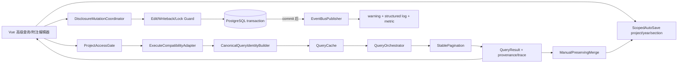

# Design Document

高级查询—附注集成加固

## Overview

本设计是既有 `advanced-query-module` 的集成加固层，不重写 `QueryOrchestrator`、ACNR、查询缓存、附注引擎或 `DisclosureEditor`。核心改动是：

1. 所有项目化读路径先授权，再生成查询身份/读缓存。
2. 所有附注 mutation 与 writeback 统一执行 edit/operation/归属/锁门禁。
3. 主 `/api/custom-query/execute` 经兼容适配器唯一调用 `QueryOrchestrator`。
4. `CanonicalQueryIdentity` 覆盖 columns/offset/sort/group/pivot/ACNR 等完整语义。
5. 最终查询管线执行真实、稳定分页。
6. 模板作用域规范化为 private/team/project/public，兼容读取 global。
7. 附注 mutation 明确 commit/rollback，EventBus 失败不再静默。
8. 自动保存以 project/year/section 响应式隔离，查询填充保持 manual/provenance/trace。
9. 历史上传桩诚实返回 501，前端能力禁用。

### 1.1 设计边界

- **复用而非重造**：使用现有 `OwnershipGuard`、`QueryOrchestrator`、`QueryCache`、`TemplateService`、`SnapshotWriter`、ACNR 与附注服务。
- **不新增 migration**：项目模板分享只使用现有 `shared_project_ids` 与 config；不改 schema。
- **不做异步大查询导出、批量 writeback、历史 Word/PDF 解析。**
- **不彻拆 DisclosureEditor**：仅提取/接入窄 composable 或 adapter，保持现有页面结构。

## Architecture



### 2.1 读取管线

固定顺序：`认证 → 解析 project_id → readonly 授权 → 规范化请求 → identity → cache → orchestrator → group/pivot → stable pagination → response`。

授权之前禁止调用缓存、ACNR 内容解析或领域查询。对象 id 入口只允许最小投影查询 `project_id`，随后立即进入统一授权；403 不返回对象是否存在之外的业务内容。

### 2.2 写入管线

固定顺序：`认证 → 对象归属 → edit + operation(writeback/note:edit) → 合并锁 → mutation_id 幂等门 → DB mutation → commit → EventBus publish → response`。

- commit 前异常：显式 rollback，不发布成功事件。
- commit 成功、EventBus 失败：不回滚已提交业务数据；响应 `warnings` 加 `event_delivery_failed`，写结构化 error log 与 counter metric。
- EventBus 事件包含 `mutation_id/project_id/year/section/action`，消费者可去重。
- Redis 幂等键使用 `disclosure:mutation:{project_id}:{mutation_id}`；业务写本身仍采用确定性 upsert/update，避免 Redis 降级时重复生成。

## Components and Interfaces

### 3.1 ProjectAccessGate

统一封装 readonly/edit/writeback/note:edit 与合并锁检查：

```python
class ProjectAccessGate:
    async def assert_read(self, user, project_id, db) -> None: ...
    async def assert_note_edit(self, user, project_id, db) -> None: ...
    async def assert_writeback(self, user, project_id, addr_ids, db) -> None: ...
```

`assert_writeback` 逐一解析目标 `addr_id` 的项目归属；任一失败即在进入 SnapshotWriter 前拒绝整个请求。

### 3.2 ExecuteCompatibilityAdapter

主 execute router 只做请求解析、权限依赖与响应映射：

```python
class ExecuteCompatibilityAdapter:
    def to_orchestrator_request(self, legacy: LegacyQueryRequest) -> QueryRequest: ...
    def to_legacy_response(self, result: QueryResult) -> dict: ...
```

适配器不得查询数据库，也不得保留旧执行分支。旧字段给出与旧版本一致的默认值；新字段无损透传。编排器业务拒绝映射为既有 4xx 信封，未知异常不回退旧逻辑。

### 3.3 CanonicalQueryIdentityBuilder

身份由版本化 canonical payload 的 UTF-8 稳定 JSON 计算 SHA-256。映射键递归排序；具有业务语义的数组保持顺序；集合语义仅在字段契约明确时去重排序。

### 3.4 StablePagination

分页位于 group/pivot 之后、序列化之前。排序规则为用户 sort 加唯一稳定 tie-breaker；无用户 sort 时使用领域默认排序加主键/addr_id tie-breaker。数据源可下推时使用数据库 `COUNT OVER` 或独立 count + `LIMIT/OFFSET`；不得先按默认上限截断再切页。

### 3.5 TemplateScopeAdapter

提供 API canonical scope 与旧存储语义之间的单点映射。`global` 仅允许输入/旧记录读取，输出一律归一为 `public`。`project` 通过已有 `shared_project_ids` 表达，不增加列。

### 3.6 DisclosureMutationCoordinator

统一包裹 generate/update/delete/restore/status 等 mutation 的事务边界、幂等与事件发布。路由不再散落 `commit()`、隐式 flush 或 `except Exception: pass`。

### 3.7 ScopedAutoSave 与 ManualPreservingMerge

- `useScopedDisclosureAutoSave(contextRef, getData, setData)` 监听 project/year/section 三元组。
- context 变化时先停止旧 timer，再计算新 key、检查新草稿、启动新 timer。
- payload 自带 context；恢复时双重校验。
- `mergeQueryIntoDisclosure` 按 cell 合并：manual=true 保留当前值；非 manual 可更新值和最新来源；历史 provenance/trace 追加或版本化，不删除。
## Data Models

### 4.1 HardenedQueryRequest

```typescript
interface SortSpec { field: string; direction: 'asc' | 'desc'; nulls?: 'first' | 'last' }
interface AggregateSpec { field: string; op: 'sum'|'count'|'avg'|'min'|'max'; alias?: string }
interface GroupSpec { dimensions: string[]; aggregates: AggregateSpec[] }
interface PivotSpec {
  rowDimensions: string[]
  columnDimensions: string[]
  valueField: string
  aggregate: AggregateSpec['op']
}
interface HardenedQueryRequest {
  project_id: string
  year: number
  source: string
  filters: Record<string, unknown>
  columns: string[]
  limit: number
  offset: number
  sort?: SortSpec[]
  group?: GroupSpec | null
  pivot?: PivotSpec | null
  acnr_targets?: string[]
}
```

兼容默认：`columns=[]` 表示现有“全部列”；`offset=0`；`sort=[]` 触发稳定默认排序；`group/pivot=null`；`acnr_targets=[]`。禁止 mutable default。

### 4.2 CanonicalQueryIdentityPayload

```json
{
  "contract_version": "aq-disclosure-v1",
  "schema_version": "<current>",
  "user_scope_signature": "<sha256>",
  "project_id": "<uuid>",
  "year": 2026,
  "source": "disclosure",
  "filters": {},
  "columns": [],
  "limit": 100,
  "offset": 0,
  "sort": [],
  "group": null,
  "pivot": null,
  "acnr_targets": []
}
```

用户权限范围只存稳定摘要，不把敏感明细写入 cache key/log。未知字段若契约未声明，builder 返回 `cacheable=false` 与 warning，执行继续但跳过缓存。

### 4.3 QueryResult

```typescript
interface CellSourceMeta {
  addr_id?: string
  manual?: boolean
  provenance?: Array<Record<string, unknown>>
  trace?: Array<Record<string, unknown>>
}
interface QueryResult {
  columns: Array<{ key: string; title: string; dtype?: string; source?: CellSourceMeta }>
  rows: Array<Record<string, unknown>>
  total: number
  limit: number
  offset: number
  warnings: Array<{ code: string; message: string; correlation_id?: string }>
  cache_hit?: boolean
}
```

`total` 是 group/pivot 后、分页前最终行数。旧客户端未知字段可忽略；既有字段类型不改变。

### 4.4 模板契约

```typescript
type CanonicalTemplateScope = 'private' | 'team' | 'project' | 'public'
type AcceptedTemplateScope = CanonicalTemplateScope | 'global'
interface TemplateVisibility {
  scope: AcceptedTemplateScope
  shared_project_ids: string[]
}
```

规范化规则：

| API 输入/旧记录 | canonical 输出 | 持久化策略 |
|---|---|---|
| private | private | 现有 private |
| team | team | 现有 team |
| project | project | 复用现有 scope/config + 非空 `shared_project_ids`；由 adapter 屏蔽物理表达 |
| public | public | 新写 canonical public |
| global | public | 兼容读；新写归一 public |

`TemplateScopeAdapter` 是唯一知道旧物理表达的组件；调用方只消费 canonical scope。项目分享列表去重并稳定排序，写入前逐项目 edit 授权。

### 4.5 附注 mutation 响应与事件

```typescript
interface MutationWarning { code: 'event_delivery_failed'; correlation_id: string }
interface DisclosureMutationResponse<T> {
  data: T
  mutation_id: string
  committed: true
  event_delivery: 'published' | 'failed'
  warnings: MutationWarning[]
}
```

事件载荷：`{event_type, mutation_id, project_id, year, section_code, actor_id, occurred_at}`。EventBus 失败不会伪装为 published；数据库 commit 失败时无成功响应、无成功事件。

### 4.6 DraftEnvelope 与附注单元格

```typescript
interface DraftContext { project_id: string; year: number; section: string }
interface DraftEnvelope<T> { context: DraftContext; data: T; savedAt: number; version: 1 }
interface DisclosureCell<T> {
  value: T
  manual: boolean
  provenance: Array<Record<string, unknown>>
  trace: Array<Record<string, unknown>>
  addr_id?: string
}
```

key：`autosave_disclosure_note_${project_id}_${year}_${encodeURIComponent(section)}`。禁止空 project/year/section 落为 global key。

### 4.7 能力发现

```json
{
  "advanced_query": true,
  "disclosure_writeback": true,
  "historical_upload": false,
  "historical_upload_reason": "历史 Word/PDF 解析尚未实现"
}
```

历史上传端点统一返回 501：`{"error_code":"HISTORICAL_UPLOAD_NOT_IMPLEMENTED","message":"历史 Word/PDF 解析尚未实现"}`，且不接收/持久化文件。

## 5. 兼容策略

1. **请求兼容**：旧 `QueryRequest` 字段原样接受；新增字段均 optional，有显式默认。
2. **响应兼容**：保留旧 rows/columns/total 等字段；分页与 warnings 为向后兼容扩展。
3. **单核心**：router 内旧执行逻辑移除或变成 adapter，禁止 orchestrator 失败后走旧查询。
4. **模板兼容**：读取 global 时输出 public；project 逻辑封装在 adapter，避免 DB migration。
5. **元数据兼容**：缺 manual/provenance/trace 的旧 cell 归一为 `false/[]/[]`；一旦存在不得降级丢失。
6. **草稿兼容**：只迁移能从旧 key 明确识别 context 的草稿；无法识别的旧草稿保留但不自动恢复。
7. **错误兼容**：保持平台响应信封；新增错误码放 detail，不改变认证 401、授权 403、校验 422、未实现 501。

## 6. 安全与事务

### 6.1 授权矩阵

| 操作 | 项目权限 | 操作权限/附加条件 |
|---|---|---|
| query/indicator/template execute/note read/trace | readonly | 对象归属先解析 |
| note mutation | edit | `note:edit`（适用时）+ 合并锁 |
| writeback preview/confirm | edit | writeback permission + 全 addr_id 归属 |
| project template share | edit（每个 shared project） | 模板所有者/管理员 |

前端禁用只改善体验，后端门禁始终为权威。

### 6.2 事务状态机

```text
AUTHORIZED → MUTATING → COMMITTING → COMMITTED → EVENT_PUBLISHING
                  ↘ error → ROLLED_BACK
EVENT_PUBLISHING → PUBLISHED
EVENT_PUBLISHING → EVENT_FAILED（数据仍 COMMITTED，warning/log/metric）
```

严禁在 `COMMITTED` 前发布成功事件，严禁以 EventBus 失败回滚已对外可见的已提交事务。由于本期不做 migration/outbox，失败事件通过同步响应 warning、结构化日志与指标暴露；消费者依靠 mutation_id 去重。

### 6.3 日志与隐私

日志记录 user id、project id、mutation/query correlation id、操作、结果和错误码；不得记录完整查询数据、附注正文、凭据或缓存值。403 与 501 均可审计但不泄露对象内容。

## 7. 前端状态设计

1. `queryContext`、`pageState`、`selectedTemplate` 分离；请求发出时拍摄 immutable snapshot，响应只应用到仍匹配 identity 的当前上下文。
2. project/year/section 为 `computed` context；watch 三元组而非初始化字符串。
3. 切换 context 时取消在途恢复提示、停止 timer；旧请求晚到时因 context token 不匹配而丢弃。
4. 查询结果合并附注前调用 `mergeQueryIntoDisclosure`，禁止组件直接覆盖 table_data。
5. readonly 用户隐藏/禁用保存和回写；历史上传由 capability flag 禁用，tooltip 显示中文原因。
6. 仅最小接线 DisclosureEditor：不在本期拆分其余编辑器职责。
## Correctness Properties

以下属性来自 requirements 验收项 prework；示例型、边界型和过程型验收在测试策略中补齐。

### Property 1: P1 — 授权先于读取且项目集合闭包

*For any* 用户、对象与项目集合，只有已授权项目可进入执行计划；未授权请求在缓存/ACNR 内容/领域数据读取前终止，且 403 不包含对象内容。

**Validates: Requirements 1.1, 1.2, 1.3, 1.4**

### Property 2: P2 — 写权限全有或全无

*For any* 附注 mutation 或 writeback 目标集合，只要任一项目/addr_id 缺 edit、operation 权限或锁检查失败，全部目标均保持原值且无部分事件。

**Validates: Requirements 2.1, 2.2, 2.3**

### Property 3: P3 — CanonicalQueryIdentity 完整、确定且保序

*For any* 有效查询，请求映射键置换不改变 identity；任一结果影响字段（含 columns/offset/sort/group/pivot/ACNR）发生语义变化则 identity 改变；有序字段的不同排列不得碰撞。

**Validates: Requirements 3.1, 3.2, 3.3**

### Property 4: P4 — 缓存与直接执行观测等价

*For any* 完整 identity，在授权范围与数据快照不变时，缓存结果与直接执行结果在 columns、rows、total、manual、provenance、trace 上相等。

**Validates: Requirements 3.4**

### Property 5: P5 — 真实分页稳定、完整、不重不漏

*For any* 有限最终结果集和合法页大小，按相同稳定排序拼接所有页，结果等于未分页序列；相邻页交集为空，total 恒等于最终未分页行数。

**Validates: Requirements 4.1, 4.2, 4.3, 4.5**

### Property 6: P6 — execute 适配观测等价且单核心

*For any* 旧请求，兼容适配后的主 execute 与直接调用 QueryOrchestrator 在旧可见字段和错误语义上等价，且每个请求只调用一次实际执行核心；新字段传递无损。

**Validates: Requirements 5.1, 5.2, 5.3, 5.4, 5.5**

### Property 7: P7 — 模板规范化与可见性

*For any* scope、所有者、团队、`shared_project_ids` 与用户授权集合，模板可见/可执行当且仅当对应规则成立；`normalize(global) = public`，新写不产生 global；project 分享列表非空、去重且均获 edit 授权。

**Validates: Requirements 6.1, 6.2, 6.3, 6.4, 6.5**

### Property 8: P8 — 附注事务—事件状态机

*For any* mutation 故障点：commit 前失败必 rollback 且无成功事件；commit 成功且 publish 成功得到 published；commit 成功但 publish 失败时业务数据保持已提交并产生 `event_delivery_failed` warning、日志和指标。

**Validates: Requirements 7.1, 7.2, 7.3, 7.4**

### Property 9: P9 — mutation_id 幂等

*For any* 相同 project、mutation_id 与请求摘要的重复序列，业务 mutation 与成功事件至多各发生一次，所有重试返回同一最终状态；摘要冲突则拒绝复用 mutation_id。

**Validates: Requirements 7.5**

### Property 10: P10 — 草稿命名空间隔离

*For any* 两个不同的 project/year/section 三元组，其 Draft_Key 不相等；任意响应式切换序列中，timer 只写当前 key，恢复只接受 context 完全相等的 DraftEnvelope。

**Validates: Requirements 8.1, 8.2**

### Property 11: P11 — manual 保序与来源历史保持

*For any* 查询自动填充和用户编辑操作序列，manual=true 的当前值不会被自动填充覆盖；用户编辑后 manual=true，既有 provenance/trace/addr_id 仍可追溯且仅追加/版本化、不被删除。

**Validates: Requirements 8.3, 8.4**

### Property 12: P12 — 跨生命周期元数据不变量与历史能力诚实性

*For any* 保存、刷新、分页、模板执行、重开章节序列，manual/provenance/trace 与 addr_id 关联保持；同时在 `historical_upload=false` 时，所有历史上传直调恒返回 501 且任务、文件、附注和查询状态均无副作用。

**Validates: Requirements 8.5, 9.1, 9.2, 9.3, 9.4**

**Validates: Req 8.5, 9.1–9.4**

## Error Handling

| 场景 | HTTP/行为 | 错误码/可观测性 |
|---|---|---|
| 未认证 | 401 | 现有认证信封 |
| 项目/对象越权 | 403 | `FORBIDDEN_PROJECT`，不读缓存/业务数据 |
| edit/writeback/锁失败 | 403/409 | 无部分写入 |
| 分页/sort 非法 | 422 | 字段级 detail |
| 未知 identity 字段 | 200 直查 | `CACHE_IDENTITY_UNSTABLE` warning + log |
| 编排器业务拒绝 | 对应 4xx | 保持既有错误语义 |
| 编排器未知异常 | 500 | correlation id，无旧路径回退 |
| DB mutation/commit 失败 | 500 | rollback，无成功事件 |
| EventBus 失败 | 2xx committed | `event_delivery_failed` warning + error log + metric |
| 历史上传 | 501 | `HISTORICAL_UPLOAD_NOT_IMPLEMENTED`，零副作用 |

## Testing Strategy

### 10.1 后端 pytest

- 授权顺序契约：依赖 spy 断言 403 前零 cache/domain 调用（P1/P2）。
- identity 单元/PBT：逐字段扰动、键序扰动、有序数组置换、不可序列化绕过缓存（P3/P4）。
- 分页集成：真实数据库 fixture，重复 sort 值 + tie-breaker，验证 total、相邻页与 group/pivot 后分页（P5）。
- execute 兼容契约：旧请求/响应 golden cases、orchestrator 入参捕获、调用次数恰一、4xx/500 映射（P6）。
- 模板权限矩阵：private/team/project/public/global、shared_project_ids 去重与逐项目授权（P7）。
- mutation 故障注入：mutation、flush、commit、publish 各点；检查 rollback/event/warning/log/metric（P8/P9）。
- 历史上传：501、机器码、零任务/文件/DB 副作用（P12）。

### 10.2 前端 Vitest

- request serializer 不丢 columns/offset/sort/group/pivot/ACNR。
- scope adapter 与按钮可见性；global 显示为 public。
- fake timers + reactive refs 验证 project/year/section 切换停止旧 timer、晚到响应丢弃（P10）。
- `mergeQueryIntoDisclosure` fast-check：manual 值保护及 provenance/trace 历史保持（P11/P12）。
- capability=false 时上传按钮禁用并显示中文理由。

### 10.3 optional PBT（本次仍必须完成）

- 后端 Hypothesis 覆盖 P1–P9、P12 中 API/纯函数属性，使用仓库 fast profile（默认 `max_examples=5`，可由环境覆盖）。
- 前端 fast-check 覆盖 P3、P5、P7、P10、P11，`numRuns` 使用项目既有快速配置。
- 每个属性测试标注 `Feature: advanced-query-disclosure-integration-hardening, Property Pn`。

### 10.4 diagnostics 与回归

对全部改动的 Python/Vue/TS 文件运行 diagnostics；运行相关 pytest 与 Vitest。spec 文档也先通过 Kiro Spec Format diagnostics。未执行、skip 或失败不得记为通过。

### 10.5 Playwright 两条中文主链

1. **高级查询主链**：登录 → 选择中文项目 → 指定 columns/sort/group/pivot → 执行 → 翻到下一页并验证不重行/total → 点击 ACNR/trace 下钻 → 保存为 project 模板 → 以有权/无权上下文验证可见性。
2. **附注闭环主链**：由查询结果定位附注 → 切换 project/year/section 验证三个草稿隔离 → 编辑自动填充单元格并形成 manual → 保存/刷新/重开 → 验证值与 provenance/trace → 验证历史上传 UI 禁用并通过 API 直调断言 501。

EventBus 失败不依赖浏览器环境随机故障，使用后端可控 fault injection 集成测试验证“commit 保留 + warning 可观测”。Playwright 必须记录页面断言、关键网络状态和 console error；两条主链不得只由 mock 代替。

## 11. 部署与回滚

- 不含 DB migration，可按后端 adapter/guard → 前端能力与状态接线顺序发布。
- 可用 feature flag 控制主 execute adapter 与 scoped autosave，但关闭 flag 不得绕过授权。
- 回滚时仅回退代码；新响应字段为兼容扩展，旧客户端不受影响。
