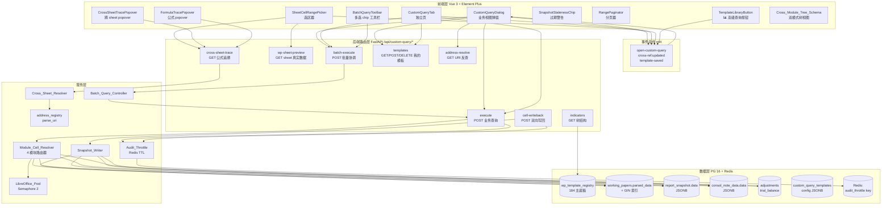
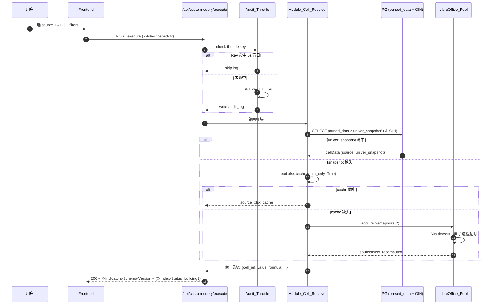
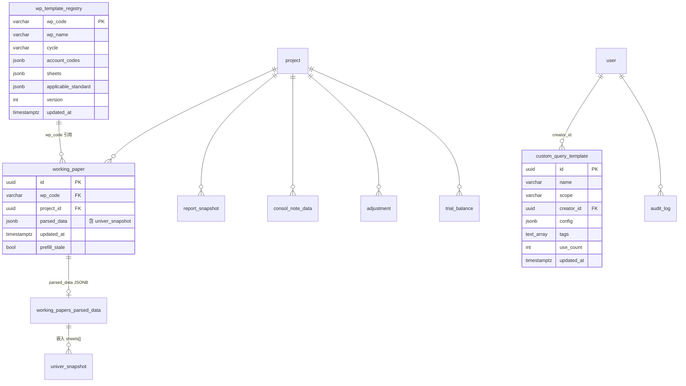
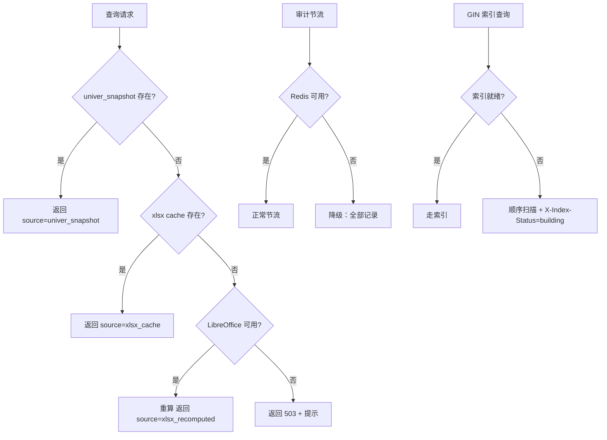

# Design Document — 高级查询模块剩余 P1-P2 增强项

> Spec: `advanced-query-enhancements-p1p2`
> Workflow: requirements-first
> Linked Requirements: `requirements.md`（15 个 Requirement）

---

## 1. Overview

本设计文档收口高级查询模块剩余 15 项增强（P1×6 + P2×5 + 体验×4），目标把"查询 + 编辑回写 + 跨 sheet 追溯 + 数据源治理 + 跨模块统一 + 模板联动 + 模板入口可达性"七条线一次性闭环。

### 1.1 设计核心决策（5 条权威红线，与 memory 已沉淀事实对齐）

| # | 决策 | 关联 Req | 理由 |
|---|------|---------|------|
| D1 | **写回乐观锁复用 attachments `X-File-Opened-At`** | Req 2 / Req 13 | 不引入新 ETag 体系；前端打开时拿 `working_papers.updated_at` → 提交时 HTTP 头回传 → 后端比对 → 冲突返回 HTTP 409 + `latest_updated_at` + `latest_editor` |
| D2 | **双源仲裁以 `step_sheet_mapping.json` 为权威源** | Req 4 | `wp_account_mapping.json`（206 条）粒度粗，`step_sheet_mapping.json`（179 底稿 / 1040 sheet）是 sheet 全集权威；migrate 字段冲突写 `logger.warning` 落入 migration 日志 |
| D3 | **GIN 索引强制 `CREATE CONCURRENTLY` + `_ccnew` 残骸清理** | Req 5 | PG 运维铁律：asyncpg raw conn + lock_timeout；失败先 cleanup `_ccnew`；构建中查询路径降级顺序扫描并加响应头 `X-Index-Status=building` |
| D4 | **审计节流走 Redis TTL=5s 分布式键** | Req 7 | 单进程内存方案在多 worker 失效；键 `audit:throttle:{user_id}:{sha1(source+filters)}`；Redis 不可用时降级"不节流全部记录"+ logger.warning 不阻塞请求 |
| D5 | **Windows LibreOffice 用 pid+tid 隔离 UserInstallation** | Req 8 | 多子进程共用 user profile 互锁导致启动失败；为每个调用拼 `-env:UserInstallation=file:///tmp/soffice_<pid>_<tid>`；4 路径 fallback 含 `C:\Program Files\LibreOffice\program\soffice.exe` |

### 1.2 范围与非目标

**In-scope**：15 个 Requirement 全部 acceptance criteria；`wp_template_registry` / `custom_query_templates` 两表 DDL；`parsed_data` GIN 索引；4 模块 cell 提取器统一抽象；模板库 3 页双向桥；选区器 + 模板入口完整性。

**Out-of-scope**：Univer 编辑器内嵌（P2-8）/ 真实 LLM 接入（phase3 UAT-3）/ 6000 并发压测验证（phase3 UAT-5）。

### 1.3 与已沉淀架构的兼容性约束

- **PG schema 红线**：`working_paper` 无 year 列（在 wizard_state JSONB）/ `wp_index` 真实字段是 `audit_cycle` 不是 `cycle` / `report_config` 是模板表无金额列（金额在 `report_snapshot.data` JSONB）/ `Project.audit_year` 派生而非列
- **三级数据源策略**：`parsed_data['univer_snapshot']` JSONB 优先 → `xlsx_cache` 次之 → LibreOffice 重算兜底（已是底层规约）
- **缓存自动失效**：用响应头 `X-Indicators-Schema-Version=N`，前端 fetch 拼缓存键 + 自动 purge 旧版本（取代手动 v 号升级）
- **6000 并发**：所有同步 IO 必须 `run_in_executor`；LibreOffice `asyncio.Semaphore(2)` 限流；批量查询前端 5 并发上限

---

## 2. Architecture

### 2.1 分层架构图



### 2.2 4 模块 cell 提取器架构（Req 13 核心）

```mermaid
graph LR
  Picker[SheetCellRangePicker<br/>统一选区器]
  Resolver{Module_Cell_Resolver<br/>路由器}

  Picker -->|workpaper:wp_code\|sheet\|range| WP[_query_workpaper_cell_range<br/>读 parsed_data univer_snapshot]
  Picker -->|report:type\|range| RP[_query_report_cells<br/>读 report_snapshot.data JSONB]
  Picker -->|note:section_id\|range| NT[_query_note_cells<br/>读 consol_note_data.data JSONB]
  Picker -->|adj:type\|range| AJ[_query_adj_cells<br/>读 adjustments 表 → 虚拟 sheet]
  Picker -->|tb:aux_dim\|range| TB[_query_tb_cells<br/>读 trial_balance → 虚拟 sheet]

  WP & RP & NT & AJ & TB --> Resolver
  Resolver -->|统一形态| Out["{cell_ref, value, formula, sheet_name, module}"]
```

### 2.3 数据流：业务查询主路径（含三级数据源 + GIN 索引降级）



---

## 3. Components and Interfaces

### 3.1 前端组件树

| 组件 | 路径 | 职责 | 关联 Req |
|------|------|------|---------|
| `CustomQueryDialog` | `frontend/src/components/CustomQueryDialog.vue` | 主弹窗（既有，扩展 `BatchQueryToolbar` + 模板入口同步） | 1, 14, 15 |
| `CustomQueryTab` | `frontend/src/views/CustomQueryTab.vue` | 独立页（既有，模板入口同步） | 15 |
| `AdvancedQueryBuilder` | `frontend/src/components/AdvancedQueryBuilder.vue` | 高级构建器（既有） | — |
| `SheetCellRangePicker` | `frontend/src/components/SheetCellRangePicker.vue` | 选区器（既有，扩展 4 模块 + 选区记忆 + 分页 + 保存模板） | 9, 11, 13, 15 |
| `BatchQueryToolbar` | `frontend/src/components/custom-query/BatchQueryToolbar.vue`（新建） | 多选 chip + 批量查询触发 | 1 |
| `BatchQueryResultGroup` | `frontend/src/components/custom-query/BatchQueryResultGroup.vue`（新建） | 分组渲染折叠面板 + 合并导出 | 1 |
| `CrossSheetTracePopover` | `frontend/src/components/custom-query/CrossSheetTracePopover.vue`（新建） | 跨 sheet 引用链 popover（最深 3 层 + 循环检测） | 3 |
| `FormulaTracePopover` | `frontend/src/components/custom-query/FormulaTracePopover.vue`（新建） | 公式 hover popover（300ms 延迟显示） | 12 |
| `SnapshotStalenessChip` | `frontend/src/components/custom-query/SnapshotStalenessChip.vue`（新建） | 过期警告 + 重算按钮 | 10 |
| `CellWritebackDialog` | `frontend/src/components/custom-query/CellWritebackDialog.vue`（新建） | 编辑态对话框 + 冲突 409 处理 | 2, 13 |
| `Cross_Module_Tree_Schema` | `frontend/src/components/custom-query/IndicatorTree.vue`（改造） | 双模式 toggle（按数据源 / 按模板形态） | 14 |
| `TemplateLibraryButton` | `frontend/src/components/wp-templates/TemplateLibraryButton.vue`（新建） | 3 模板页挂「📊 高级查询」按钮 | 14 |
| `MyTemplatesDialog` | `frontend/src/components/custom-query/MyTemplatesDialog.vue`（新建） | 「我的模板」对话框（3 入口共用） | 15 |
| `SaveAsTemplateButton` | `frontend/src/components/custom-query/SaveAsTemplateButton.vue`（新建） | 「保存为模板」按钮（3 入口共用） | 15 |

### 3.2 后端 service 层

| Service | 路径 | 关键方法 | 关联 Req |
|---------|------|---------|---------|
| `Batch_Query_Controller` | `backend/app/services/custom_query/batch_controller.py`（新建） | `execute_batch(wp_codes, filters) -> Dict[wp_code, result]`，前端层并发，后端无状态 | 1 |
| `Snapshot_Writer` | `backend/app/services/custom_query/snapshot_writer.py`（新建） | `write_cell(wp_id, sheet, cell_ref, new_value, opened_at) -> WritebackResult`，单事务写 JSONB + xlsx + 标 prefill_stale + emit cross-ref:updated | 2, 13 |
| `Cross_Sheet_Resolver` | `backend/app/services/custom_query/cross_sheet_resolver.py`（新建） | `resolve(wp_id, sheet, cell_ref, max_depth=3) -> RefChain`，BFS + 环检测 | 3, 12 |
| `Module_Cell_Resolver` | `backend/app/services/custom_query/module_cell_resolver.py`（新建） | 路由 4 模块到对应 `_query_*_cells`；统一返回 `{cell_ref, value, formula, sheet_name, module}` | 13 |
| `LibreOffice_Pool` | `backend/app/services/libreoffice_pool.py`（既有 `_find_libreoffice` 升级） | 模块级 `Semaphore(2)` + `convert_to_xlsx(path, timeout=60)` + 4 路径探测 + Windows pid+tid 隔离 | 8 |
| `Audit_Throttle` | `backend/app/services/audit_throttle.py`（新建） | `should_record(user_id, source, filters) -> bool`；Redis 键 + TTL=5s | 7 |
| `WpTemplateRegistryService` | `backend/app/services/wp_template_registry.py`（新建） | `load_tree() -> Tree`，从 PG 读取（不再读 JSON） | 4 |
| `RangeMemoryStore` | `frontend/src/composables/useRangeMemory.ts`（新建） | localStorage 持久化 + LRU 50 条上限 + sheet 越界 clamp | 9 |

### 3.3 关键 TypeScript / Python 接口签名

```typescript
// frontend/src/types/custom-query.ts (新增)
export interface CellWritebackPayload {
  wp_code: string;
  sheet_name: string;
  cell_ref: string;       // e.g. "B7"
  old_value: any;
  new_value: any;
  opened_at: string;      // ISO 8601, 用于 X-File-Opened-At
}

export interface RefChainNode {
  depth: number;          // 0..3
  uri: string;            // workpaper:D2|审定表D2-1|A2
  value: any;
  formula?: string;
  truncated?: boolean;    // 第 3 层后截断
  cycle?: boolean;        // 检测到循环
  missing?: boolean;      // 引用目标缺失
}

export interface ModuleCellResult {
  cell_ref: string;
  value: any;
  formula?: string;
  sheet_name: string;
  module: 'workpaper' | 'report' | 'note' | 'adj' | 'tb';
  source: 'univer_snapshot' | 'xlsx_cache' | 'xlsx_recomputed' | 'jsonb_direct';
  saved_at?: string;
}

export interface CustomQueryTemplateConfig {
  project_id?: string;
  year?: number;
  source: string;         // workpaper:D2|审定表D2-1
  sheet_name?: string;
  cell_range?: string;    // A1:B10,C1:C5
  filter_text?: string;
  conditions?: Array<{ field: string; op: string; value: any }>;
  selected_columns?: string[];
  available_columns?: string[];
  page_size?: 50 | 100 | 200 | 500;
  sort_field?: string;
  sort_order?: 'asc' | 'desc';
}
```

```python
# backend/app/services/custom_query/snapshot_writer.py (新建)
class WritebackConflict(Exception):
    def __init__(self, latest_updated_at: datetime, latest_editor: str):
        self.latest_updated_at = latest_updated_at
        self.latest_editor = latest_editor

class SnapshotWriter:
    async def write_cell(
        self,
        db: AsyncSession,
        user: User,
        wp_id: str,
        sheet_name: str,
        cell_ref: str,
        new_value: Any,
        opened_at: datetime,   # 来自 X-File-Opened-At header
    ) -> WritebackResult:
        """单事务写 parsed_data['univer_snapshot'] + xlsx + 标 prefill_stale.
        opened_at < working_papers.updated_at -> raise WritebackConflict (HTTP 409)
        """

# backend/app/services/custom_query/module_cell_resolver.py (新建)
class ModuleCellResolver:
    async def resolve(
        self,
        db: AsyncSession,
        source: str,           # workpaper:D2|审定表D2-1|A1:B10
        project_id: Optional[str],
    ) -> List[ModuleCellResult]:
        """按 source 命名空间路由到 4 个 _query_*_cells."""
```

---

## 4. Data Models

### 4.1 `wp_template_registry` 表 DDL（Req 4）

```sql
-- backend/alembic/versions/{ts}_create_wp_template_registry.py
CREATE TABLE wp_template_registry (
    wp_code             VARCHAR(32)    PRIMARY KEY,
    wp_name             VARCHAR(255)   NOT NULL,
    cycle               VARCHAR(2)     NOT NULL,        -- A~N+S (15 个枚举)
    account_codes       JSONB          NOT NULL DEFAULT '[]'::jsonb,  -- ["1122","1123",...]
    sheets              JSONB          NOT NULL DEFAULT '[]'::jsonb,  -- [{name,is_aux,sort_order},...]
    applicable_standard JSONB          NOT NULL DEFAULT '[]'::jsonb,  -- ["soe_standalone","listed_standalone",...]
    version             INTEGER        NOT NULL DEFAULT 1,
    source_origin       VARCHAR(64)    NOT NULL,        -- 'wp_account_mapping' | 'step_sheet_mapping' | 'merged'
    created_at          TIMESTAMPTZ    NOT NULL DEFAULT NOW(),
    updated_at          TIMESTAMPTZ    NOT NULL DEFAULT NOW(),
    CONSTRAINT ck_wp_template_registry_cycle CHECK (cycle IN ('A','B','C','D','E','F','G','H','I','J','K','L','M','N','S'))
);

CREATE INDEX idx_wp_template_registry_cycle ON wp_template_registry(cycle);
CREATE INDEX idx_wp_template_registry_updated ON wp_template_registry(updated_at DESC);
CREATE INDEX idx_wp_template_registry_account_codes ON wp_template_registry USING GIN (account_codes);

COMMENT ON TABLE wp_template_registry IS '主底稿模板注册表，从 wp_account_mapping.json + step_sheet_mapping.json 双源 migrate';
COMMENT ON COLUMN wp_template_registry.version IS '模板版本号，更新时 +1，触发 X-Indicators-Schema-Version 响应头递增';
COMMENT ON COLUMN wp_template_registry.source_origin IS 'migrate 来源；冲突时 step_sheet_mapping 为权威';
```

**migrate 仲裁规则**（Req 4 AC 4）：
- `sheets` 字段冲突 → 以 `step_sheet_mapping.json` 为准（D2 案例：wp_account_mapping 仅 4 个 sheet，step_sheet_mapping 有 20 个 → 取 20 个）
- `account_codes` 冲突 → 取并集
- `applicable_standard` 冲突 → 取并集
- 所有冲突 case 写 `logger.warning("wp_template_registry migrate conflict: wp_code=%s, field=%s, json_a=%s, json_b=%s, taken=%s", ...)`

### 4.2 `working_papers.parsed_data` GIN 索引 DDL（Req 5）

```sql
-- backend/alembic/versions/{ts}_create_parsed_data_gin_index.py
-- 必须用 asyncpg raw conn + lock_timeout（PG 运维铁律）
SET lock_timeout = '3s';
CREATE INDEX CONCURRENTLY IF NOT EXISTS idx_wp_parsed_data_gin
  ON working_papers
  USING GIN (parsed_data jsonb_path_ops);  -- 选 jsonb_path_ops 减少体积（仅支持 @>）

-- 失败清理 _ccnew 残骸的应急 SQL
-- DROP INDEX CONCURRENTLY IF EXISTS idx_wp_parsed_data_gin_ccnew;
```

**索引选择理由**：
- `jsonb_path_ops` vs `jsonb_ops`：本场景查询全部走 `parsed_data @> '{...}'` 形式（不用 `?` / `?&` 路径键存在判断），`jsonb_path_ops` 体积小 30-50%
- 体积告警阈值：> 500MB 触发 `pg_index_size` 监控告警，提示 DBA 评估分区索引

**降级路径**（Req 5 AC 4）：
- 应用启动时检查 `pg_stat_progress_create_index` 视图，若该索引正在 BUILDING → 全局 flag `INDEX_BUILDING=True`
- 查询路径检查 flag，若 True → 走顺序扫描 + 响应头 `X-Index-Status=building`

### 4.3 `custom_query_templates` 表完整字段（Req 15）

```sql
-- 已存在但 init_tables.py 未扫描创建（pre-existing bug，Req 15 AC 1 修复）
-- backend/scripts/_ensure_custom_query_tables.py 启动检查兜底建表
CREATE TABLE IF NOT EXISTS custom_query_templates (
    id           UUID           PRIMARY KEY DEFAULT gen_random_uuid(),
    name         VARCHAR(255)   NOT NULL,
    description  TEXT,
    scope        VARCHAR(16)    NOT NULL,    -- 'private' | 'team' | 'public'
    creator_id   UUID           NOT NULL REFERENCES users(id) ON DELETE CASCADE,
    config       JSONB          NOT NULL,    -- 见 4.4 schema
    tags         TEXT[]         NOT NULL DEFAULT '{}',
    use_count    INTEGER        NOT NULL DEFAULT 0,
    last_used_at TIMESTAMPTZ,
    created_at   TIMESTAMPTZ    NOT NULL DEFAULT NOW(),
    updated_at   TIMESTAMPTZ    NOT NULL DEFAULT NOW(),
    CONSTRAINT ck_custom_query_templates_scope CHECK (scope IN ('private','team','public'))
);

CREATE INDEX idx_cqt_scope_updated ON custom_query_templates(scope, updated_at DESC);
CREATE INDEX idx_cqt_creator_updated ON custom_query_templates(creator_id, updated_at DESC);
CREATE INDEX idx_cqt_tags ON custom_query_templates USING GIN (tags);
```

### 4.4 `custom_query_templates.config` JSONB Schema（Req 15 AC 3）

```jsonschema
{
  "$schema": "http://json-schema.org/draft-07/schema#",
  "title": "CustomQueryTemplateConfig",
  "type": "object",
  "required": ["source"],
  "properties": {
    "project_id":        { "type": ["string","null"], "format": "uuid" },
    "year":              { "type": ["integer","null"], "minimum": 2000, "maximum": 2100 },
    "source":            { "type": "string", "pattern": "^(workpaper|report|note|adj|tb|consol_unit|disclosure|disclosure_note)[:].*" },
    "sheet_name":        { "type": ["string","null"] },
    "cell_range":        { "type": ["string","null"], "description": "A1:B10,C1:C5 多区域语法" },
    "filter_text":       { "type": ["string","null"] },
    "conditions":        {
      "type": "array",
      "items": {
        "type": "object",
        "required": ["field","op","value"],
        "properties": {
          "field": { "type": "string" },
          "op":    { "type": "string", "enum": ["eq","ne","gt","gte","lt","lte","in","like","is_null"] },
          "value": {}
        }
      }
    },
    "selected_columns":  { "type": "array", "items": { "type": "string" } },
    "available_columns": { "type": "array", "items": { "type": "string" } },
    "page_size":         { "type": "integer", "enum": [50,100,200,500], "default": 100 },
    "sort_field":        { "type": ["string","null"] },
    "sort_order":        { "type": "string", "enum": ["asc","desc"], "default": "asc" }
  }
}
```

### 4.5 `report_snapshot.data` / `consol_note_data.data` 内 cell 形态约定（Req 13 AC 2）

报表 / 附注模块本身没有 Excel sheet 结构，需要把 JSONB 内 `rows` 拼装成"虚拟 sheet"以复用 SheetCellRangePicker。

```jsonc
// report_snapshot.data 结构（既有）
{
  "rows": [
    {
      "row_code": "BS-002",          // 模板 row_code
      "row_name": "货币资金",
      "current_period_amount": 12345.67,
      "prior_period_amount": 11000.00,
      "formula": "=tb:1001+tb:1002",  // 可选，模板含公式时
      "indent_level": 1
    }
  ],
  "saved_at": "2026-05-23T10:00:00Z",
  "saved_by": "user-uuid"
}

// 提取规则：rows[i] -> 虚拟 sheet 第 i+2 行（首行表头）
// 列映射：A=row_code, B=row_name, C=current_period_amount, D=prior_period_amount, E=formula
// cell_ref "C5" -> rows[3].current_period_amount
```

```jsonc
// consol_note_data.data 结构（既有）
{
  "section_id": "五-1-1",
  "rows": [
    { "code": "1001", "name": "现金", "year_end": 100, "year_begin": 90, "formula": null }
  ],
  "saved_at": "2026-05-23T10:00:00Z"
}
// 列映射：A=code, B=name, C=year_end, D=year_begin, E=formula
```

调整分录 `adjustments` / 试算表 `trial_balance` 同理拼装虚拟 sheet（详见 5.1 节 API）。

### 4.6 ER 图：本 Spec 涉及的表关系




---

## 5. API Endpoints / Routes

### 5.1 新增端点一览

| Method | Path | 关联 Req | 说明 |
|--------|------|---------|------|
| POST | `/api/custom-query/batch-execute` | 1 | 批量查询（前端并发 5 拆分，后端无状态） |
| POST | `/api/custom-query/cell-writeback` | 2, 13 | 双向写回单 cell |
| GET | `/api/custom-query/cross-sheet-trace` | 3, 12 | 跨 sheet 公式追溯（BFS 最深 3 层） |
| GET | `/api/custom-query/address-resolve` | 14 | URI 反查模板信息（模板溯源） |

### 5.2 端点详细定义

#### 5.2.1 `POST /api/custom-query/batch-execute`

```python
class BatchExecuteRequest(BaseModel):
    wp_codes: list[str]           # 1~20 个 wp_code
    project_id: str
    year: int | None = None
    filters: dict = {}
    cell_range: str | None = None
    sheet_name: str | None = None

class BatchExecuteResponse(BaseModel):
    results: dict[str, Any]       # {wp_code: {columns, rows, total, source} | {error: str}}
    total_success: int
    total_failed: int
```

- 前端 `BatchQueryToolbar` 拆分为 N 次 `/execute` 请求（最大并发 5），本端点仅做参数校验 + 审计日志聚合
- 后端实际复用 `execute_query` 内部逻辑，按 wp_code 循环调用
- 任一子请求失败不阻塞其它，错误信息写入对应 wp_code 的 result

#### 5.2.2 `POST /api/custom-query/cell-writeback`

```python
class CellWritebackRequest(BaseModel):
    wp_code: str
    sheet_name: str
    cell_ref: str                 # e.g. "B7"
    new_value: Any
    module: Literal['workpaper', 'report', 'note', 'adj', 'tb'] = 'workpaper'

# Headers: X-File-Opened-At (ISO 8601)
# Response 200: {success: true, updated_at: str}
# Response 409: {conflict: true, latest_updated_at: str, latest_editor: str}
# Response 403: {error: "no_write_permission"} 或 {error: "non_workpaper_source"}
```

- 按 `module` 路由写入目标：workpaper→`parsed_data['univer_snapshot']` / report→`report_snapshot.data` / note→`consol_note_data.data` / adj→`adjustments` UPDATE / tb→`trial_balance.audited_amount` UPDATE
- 单事务保证一致性；写入后标 `prefill_stale=True` + emit `cross-ref:updated`
- 敏感操作不参与审计节流（每次必记）

#### 5.2.3 `GET /api/custom-query/cross-sheet-trace`

```python
# Query params:
#   wp_code: str
#   sheet_name: str
#   cell_ref: str
#   project_id: str
#   max_depth: int = 3 (上限 3)

# Response 200:
class RefChainResponse(BaseModel):
    chain: list[RefChainNode]     # depth 0..3
    has_cycle: bool
    truncated_at_depth: int | None
```

- BFS 遍历 `=Sheet!Cell` 引用，每层调 `_try_extract_from_univer_snapshot` 取值
- 环检测：visited set，发现重复 URI 标 `cycle=True` 停止
- 引用目标缺失标 `missing=True` 不阻塞其它分支

#### 5.2.4 `GET /api/custom-query/address-resolve`

```python
# Query params:
#   uri: str  # e.g. "workpaper:D2|审定表D2-1|B7"

# Response 200:
class AddressResolveResponse(BaseModel):
    module: str                   # workpaper / report / note / adj / tb
    template_wp_code: str | None
    template_name: str | None
    sheet_name: str | None
    cell_ref: str | None
    registered: bool              # wp_template_registry 是否已注册
    route_path: str               # 前端跳转路径
    route_query: dict             # highlight 参数
```

### 5.3 既有端点改造

| 端点 | 改造内容 | 关联 Req |
|------|---------|---------|
| `GET /indicators` | 新增 `view_mode=source\|template` 参数切换树视图 | 14 |
| `POST /execute` | source 命名空间扩展 `report:` / `note:` / `adj:` / `tb:` 路由 | 13 |
| `GET /wp-sheet-preview` | 返回增加 `saved_at` 字段供前端判断过期 | 10 |
| `GET/POST/PUT/DELETE /templates` | config JSONB 扩展完整字段（cell_range/sheet_name/page_size/sort） | 15 |

---

## 6. Implementation Algorithms

### 6.1 批量查询协调（Req 1）

```
前端 BatchQueryToolbar:
  1. 收集 selectedWpCodes[] (ctrl+click 多选)
  2. 若 empty → ElMessage.warning 阻断
  3. 拆分为 chunks，每 chunk ≤ 5 并发
  4. Promise.allSettled(chunks.map(code => api.execute({...filters, source: `workpaper:${code}`})))
  5. 按 wp_code 分组渲染 BatchQueryResultGroup（折叠面板）
  6. 失败项展示 error message，不阻塞成功项
  7. 「合并导出」→ xlsx-js-style 多 sheet 写入
```

### 6.2 双向写回乐观锁（Req 2）

```
SnapshotWriter.write_cell(db, user, wp_id, sheet, cell_ref, new_value, opened_at):
  1. SELECT updated_at, parsed_data FROM working_papers WHERE id = wp_id FOR UPDATE
  2. IF opened_at < updated_at → raise WritebackConflict(updated_at, last_editor)
  3. 定位 parsed_data['univer_snapshot']['sheets'][sheet_name]['cellData'][row][col]
  4. old_value = cellData[row][col].get('v')
  5. cellData[row][col]['v'] = new_value
  6. UPDATE working_papers SET parsed_data = :new_pd, updated_at = NOW(), prefill_stale = True
  7. 同步更新 xlsx cache（run_in_executor + openpyxl write）
  8. emit event_bus('cross-ref:updated', {wp_code, sheet, cell_ref, new_value})
  9. audit_logger.log_action('custom_query.cell_writeback', ...)  # 不节流
  10. COMMIT
```

### 6.3 跨 sheet 公式追溯 BFS（Req 3）

```
CrossSheetResolver.resolve(wp_id, sheet, cell_ref, max_depth=3):
  queue = deque([(sheet, cell_ref, 0)])
  visited = set()
  chain = []
  
  while queue:
    cur_sheet, cur_cell, depth = queue.popleft()
    uri = f"{cur_sheet}!{cur_cell}"
    if uri in visited → chain.append(RefChainNode(cycle=True)); continue
    visited.add(uri)
    
    value, formula = extract_cell(wp_id, cur_sheet, cur_cell)
    chain.append(RefChainNode(depth, uri, value, formula))
    
    if depth >= max_depth → chain[-1].truncated = True; continue
    
    refs = parse_cross_sheet_refs(formula)  # regex: ='?([^'!]+)'?!([A-Z]+\d+)
    for ref_sheet, ref_cell in refs:
      queue.append((ref_sheet, ref_cell, depth + 1))
  
  return chain
```

### 6.4 审计节流 Redis 实现（Req 7）

```
AuditThrottle.should_record(user_id, source, filters) -> bool:
  key = f"audit:throttle:{user_id}:{sha1(source + json.dumps(filters, sort_keys=True))}"
  try:
    result = await redis.set(key, "1", nx=True, ex=5)  # SET NX EX 5
    return result is not None  # True = 首次，应记录
  except RedisError:
    logger.warning("Redis unavailable for audit throttle, fallback to always-record")
    return True  # 降级：不节流
```

### 6.5 LibreOffice 池化 + 超时 kill（Req 8）

```
_libreoffice_semaphore = asyncio.Semaphore(2)  # 模块级

async def convert_with_libreoffice(xlsx_path: Path, timeout: int = 60) -> Path:
  async with _libreoffice_semaphore:
    soffice = _find_soffice()  # 4 路径 fallback
    user_install = f"file:///tmp/soffice_{os.getpid()}_{threading.get_ident()}"
    cmd = [soffice, "--headless", "--calc", "--convert-to", "xlsx",
           f"-env:UserInstallation={user_install}", str(xlsx_path)]
    
    proc = await asyncio.create_subprocess_exec(*cmd, ...)
    try:
      await asyncio.wait_for(proc.wait(), timeout=timeout)
    except asyncio.TimeoutError:
      proc.kill()
      raise HTTPException(504, "LibreOffice timeout")
```

### 6.6 选区记忆 LRU（Req 9）

```typescript
// useRangeMemory.ts
const STORAGE_KEY = (userId: string) => `gt:cqd:range-memory:${userId}`
const MAX_ENTRIES = 50

function save(userId: string, wpCode: string, sheetName: string, rangeExpr: string) {
  const key = `${wpCode}:${sheetName}`
  const store = JSON.parse(localStorage.getItem(STORAGE_KEY(userId)) || '{}')
  store[key] = { rangeExpr, ts: Date.now() }
  // LRU 淘汰
  const entries = Object.entries(store).sort((a, b) => b[1].ts - a[1].ts)
  const pruned = Object.fromEntries(entries.slice(0, MAX_ENTRIES))
  localStorage.setItem(STORAGE_KEY(userId), JSON.stringify(pruned))
}

function load(userId: string, wpCode: string, sheetName: string): string | null {
  const store = JSON.parse(localStorage.getItem(STORAGE_KEY(userId)) || '{}')
  return store[`${wpCode}:${sheetName}`]?.rangeExpr ?? null
}
```

### 6.7 大 range 前端分页（Req 11）

```
RangePaginator 逻辑：
  - rows.length > 100 → 启用分页（默认 pageSize=100）
  - rows.length > 5000 → 强制分页 + 禁用「全部展开」
  - 切页 = allRows.slice((page-1)*size, page*size)，纯前端切片不重发请求
  - 「全部展开」→ ElMessageBox.confirm 警告后 pageSize = rows.length
```


---

## 7. Correctness Properties

*A property is a characteristic or behavior that should hold true across all valid executions of a system—essentially, a formal statement about what the system should do. Properties serve as the bridge between human-readable specifications and machine-verifiable correctness guarantees.*

### Property 1: Batch fault isolation

*For any* batch query containing N wp_codes where K of them fail (0 ≤ K ≤ N), the remaining N-K successful results should all be present and correctly grouped by wp_code in the response, unaffected by the failures.

**Validates: Requirements 1.3, 1.4**

### Property 2: Batch concurrency limit

*For any* batch query with N wp_codes (N > 5), at no point in time should more than 5 concurrent sub-requests be in flight simultaneously.

**Validates: Requirements 1.2**

### Property 3: Write transactional consistency

*For any* successful cell writeback operation, both `parsed_data['univer_snapshot']` JSONB and the xlsx file cache must contain the new value, and `prefill_stale` must be `True` on the corresponding working_paper record.

**Validates: Requirements 2.1, 2.2**

### Property 4: Optimistic lock conflict detection

*For any* cell writeback request where `X-File-Opened-At` timestamp is strictly earlier than the current `working_papers.updated_at`, the system must reject the write with HTTP 409 and return `latest_updated_at` + `latest_editor` in the response body.

**Validates: Requirements 2.3**

### Property 5: Write permission enforcement

*For any* source string that does not match the `workpaper:*` namespace pattern, or for any user without write permission on the target wp_code, the cell writeback endpoint must return HTTP 403 and never modify the underlying data.

**Validates: Requirements 2.5**

### Property 6: Cross-sheet reference parsing

*For any* formula string containing cross-sheet references in the form `='Sheet Name'!CellRef` or `=SheetName!CellRef`, the parser must extract all (sheet_name, cell_ref) pairs correctly, and for any formula without cross-sheet references, the parser must return an empty list.

**Validates: Requirements 3.1**

### Property 7: Resolver depth termination

*For any* reference chain of depth D > 3, the Cross_Sheet_Resolver must stop resolving at depth 3, mark the last node as `truncated=True`, and return a finite result within bounded time.

**Validates: Requirements 3.3**

### Property 8: Resolver cycle detection

*For any* reference graph containing a cycle (A → B → ... → A), the Cross_Sheet_Resolver must detect the cycle, mark the offending node as `cycle=True`, stop recursion on that branch, and return without infinite looping.

**Validates: Requirements 3.4**

### Property 9: Migration conflict resolution — step_sheet_mapping wins

*For any* wp_code present in both `wp_account_mapping.json` and `step_sheet_mapping.json` with conflicting `sheets` values, the migrated `wp_template_registry` row must contain the `sheets` value from `step_sheet_mapping.json`.

**Validates: Requirements 4.4**

### Property 10: Template version monotonic increment

*For any* update to a `wp_template_registry` row, the `version` field after update must equal the version before update plus exactly 1.

**Validates: Requirements 4.5**

### Property 11: Migration row count correctness

*For any* execution of the wp_template_registry migration against valid JSON source files, `SELECT count(*) FROM wp_template_registry` must equal the deduplicated union count of wp_codes across both JSON sources.

**Validates: Requirements 4.2**

### Property 12: Single-source snapshot round-trip

*For any* structure.json file content, after the migration script runs, the file must no longer exist on disk AND `parsed_data['univer_snapshot']` must contain equivalent structural data that, when read by the query path, produces the same cell values as the original file would have.

**Validates: Requirements 6.1, 6.4**

### Property 13: Audit throttle window

*For any* sequence of `audit_logger.log_action` calls with identical `(user_id, source, filters_hash)` triple, only the first call within any 5-second window should produce a database write; subsequent calls within the same window should be skipped. After 5 seconds elapse or any field in the triple changes, the next call should produce a write.

**Validates: Requirements 7.1, 7.2**

### Property 14: Sensitive operations bypass throttle

*For any* audit action of type `custom_query.cell_writeback` or `custom_query.cross_sheet_trace`, the Audit_Throttle must never skip the write regardless of the throttle window state.

**Validates: Requirements 7.4**

### Property 15: LibreOffice concurrency limit

*For any* number of concurrent LibreOffice conversion requests, at no point should more than 2 soffice subprocesses be alive simultaneously (enforced by `asyncio.Semaphore(2)`).

**Validates: Requirements 8.1**

### Property 16: LibreOffice Windows UserInstallation uniqueness

*For any* two concurrent soffice invocations on Windows, their `-env:UserInstallation` paths must be distinct (derived from pid + tid), preventing user profile lock conflicts.

**Validates: Requirements 8.2**

### Property 17: LibreOffice timeout enforcement

*For any* soffice subprocess that does not complete within 60 seconds, the process must be killed, the semaphore released, and an HTTP 504 returned to the caller.

**Validates: Requirements 8.4**

### Property 18: Range memory save/load round-trip

*For any* valid range expression saved via `Range_Memory.save(userId, wpCode, sheetName, rangeExpr)`, immediately calling `Range_Memory.load(userId, wpCode, sheetName)` must return the exact same `rangeExpr`.

**Validates: Requirements 9.1, 9.2**

### Property 19: Range memory LRU capacity

*For any* user with more than 50 stored range memory entries, the total stored entries must never exceed 50, and the evicted entries must be those with the oldest timestamps.

**Validates: Requirements 9.3**

### Property 20: Range memory bounds clamping

*For any* stored range expression where the referenced rows/columns exceed the current sheet dimensions, loading must return a clamped range that fits within `[1, maxRow]` × `[1, maxCol]` without error.

**Validates: Requirements 9.5**

### Property 21: Staleness chip variant selection

*For any* query result, the chip variant must be determined solely by `(source, saved_at)`: if `source=univer_snapshot` and `saved_at` is more than 30 days ago → orange warning chip; if `source=univer_snapshot` and `saved_at` ≤ 30 days → no chip; if `source=xlsx_recomputed` → blue chip; if `source=xlsx_cache` → gray chip; if `saved_at` is null → gray "unknown" chip.

**Validates: Requirements 10.1, 10.2, 10.4, 10.5**

### Property 22: Pagination threshold enforcement

*For any* result set with row count > 100, the paginator must be active (page size ≤ 100 by default). For any result set with row count > 5000, the "expand all" button must be disabled.

**Validates: Requirements 11.1, 11.5**

### Property 23: Formula classification

*For any* formula string, the classifier must correctly categorize it as either "cross-sheet" (contains `=...!...` pattern) or "local-only" (no sheet reference), and the popover rendering must match the classification.

**Validates: Requirements 12.2, 12.3**

### Property 24: Source URI parsing round-trip

*For any* valid source URI in the 5 supported namespaces (`workpaper:code|sheet|range`, `report:type|range`, `note:section|range`, `adj:type|range`, `tb:dim|range`), parsing then re-formatting must produce the original URI string.

**Validates: Requirements 13.1**

### Property 25: Module cell resolver routing and output shape

*For any* valid source URI, the Module_Cell_Resolver must route to the correct module-specific query function AND return results where every item contains all required fields: `{cell_ref, value, formula, sheet_name, module}` with `module` matching the source namespace prefix.

**Validates: Requirements 13.2, 13.3**

### Property 26: Cross-module write routing

*For any* cell writeback with `module` field set, the Snapshot_Writer must write to the correct target: workpaper→`parsed_data`, report→`report_snapshot.data`, note→`consol_note_data.data`, adj→`adjustments` table, tb→`trial_balance` table. After write, reading the same cell from the same module must return the new value.

**Validates: Requirements 13.5**

### Property 27: Template registry lookup for bridge

*For any* wp_code that exists in `wp_template_registry`, the address-resolve endpoint must return `registered=true` and a valid `route_path` for navigation. For any wp_code not in the registry, it must return `registered=false`.

**Validates: Requirements 14.3**

### Property 28: Event-driven tree reveal

*For any* valid source string emitted via `open-custom-query` event, the tree component must programmatically expand ancestors and scroll the matching leaf node into view, resulting in that node being selected.

**Validates: Requirements 14.5**

### Property 29: Template config save/load round-trip

*For any* valid `CustomQueryTemplateConfig` object, saving it as a template and then loading that template must restore the identical config (all fields including `cell_range`, `sheet_name`, `page_size`, `sort_field`, `sort_order`, `conditions`, `selected_columns`).

**Validates: Requirements 15.3, 15.4**


---

## 8. Error Handling

### 8.1 后端错误分类与响应

| 场景 | HTTP Code | 响应体 | 前端处理 |
|------|-----------|--------|---------|
| 写回乐观锁冲突 | 409 | `{conflict: true, latest_updated_at, latest_editor}` | 弹冲突对话框引导重载 |
| 无写权限 | 403 | `{error: "no_write_permission", reason}` | tooltip 说明 |
| 非 workpaper 源写回 | 403 | `{error: "non_workpaper_source"}` | 禁用编辑入口 |
| LibreOffice 超时 | 504 | `{error: "libreoffice_timeout", elapsed_seconds: 60}` | 提示稍后重试 |
| GIN 索引构建中 | 200 + header | `X-Index-Status=building` | 正常展示 + 提示"索引构建中，查询可能较慢" |
| 批量查询子请求失败 | 200（整体） | results[wp_code].error | 对应分组展示错误 |
| 模板 sheet 不存在 | 200 + warning | `{warning: "sheet_not_found", sheet_name}` | 弹对话框确认是否清空 cell_range |
| Redis 不可用（节流降级） | 正常 200 | 无感知 | 无（后端 logger.warning） |
| 循环引用检测 | 200 | chain 中 `cycle=True` 节点 | popover 标红 ⚠ |
| 引用目标缺失 | 200 | chain 中 `missing=True` 节点 | popover 红色提示 |
| custom_query_templates 表缺失 | 启动时自动修复 | — | 无感知 |

### 8.2 前端错误边界

- **BatchQueryResultGroup**：每个 wp_code 分组独立 error boundary，单组渲染失败不影响其它组
- **CrossSheetTracePopover**：API 超时 3s 后显示"加载超时"占位，不阻塞主界面
- **FormulaTracePopover**：公式解析失败显示原始字符串 + 红色提示
- **CellWritebackDialog**：网络错误自动重试 1 次（间隔 1s），仍失败提示用户

### 8.3 降级策略汇总



---

## 9. Testing Strategy

### 9.1 测试框架与工具

| 层 | 框架 | 用途 |
|----|------|------|
| 后端单测 + 属性测试 | pytest + Hypothesis | service 层逻辑验证 + 属性测试 |
| 后端集成测试 | pytest + httpx AsyncClient | API 端点 + DB 交互 |
| 前端单测 | vitest + @vue/test-utils | 组件逻辑 + composable |
| 前端 e2e | Playwright | 完整用户流程 |

### 9.2 Property-Based Testing 配置

- 库：**Hypothesis**（后端）/ **fast-check**（前端 vitest）
- 每个 property test 最少 **100 iterations**（`@settings(max_examples=100)`）
- 每个 test 必须注释引用 design property 编号
- Tag 格式：`# Feature: advanced-query-enhancements-p1p2, Property {N}: {title}`

### 9.3 测试矩阵

| Req | 属性测试 | 单测 | 集成/e2e | 总计 |
|-----|---------|------|---------|------|
| 1 | P1, P2 | 空集合阻断 | 批量查询 e2e | 4 |
| 2 | P3, P4, P5 | 409 冲突详情 | 写回 e2e | 5 |
| 3 | P6, P7, P8 | 缺失引用、解析失败 | 追溯 e2e | 5 |
| 4 | P9, P10, P11 | 幂等性、回滚 | migration e2e | 5 |
| 5 | — | GIN EXPLAIN | 索引降级 | 3 |
| 6 | P12 | 删除验证 | 单源化 e2e | 3 |
| 7 | P13, P14 | Redis 降级 | 节流 e2e | 4 |
| 8 | P15, P16, P17 | 健康探测 | 池化 e2e | 5 |
| 9 | P18, P19, P20 | 清除记忆 | — | 4 |
| 10 | P21 | 缺失 saved_at | — | 2 |
| 11 | P22 | 全部展开确认 | — | 2 |
| 12 | P23 | 解析失败 | — | 2 |
| 13 | P24, P25, P26 | 4 模块 × 选区/写回/公式 12 条 e2e | 15 |
| 14 | P27, P28 | 3 页面按钮 | 联动 e2e | 4 |
| 15 | P29 | 表缺失修复、3 入口同步 | 模板 e2e | 4 |
| **合计** | **29 properties** | **~25 unit** | **~12 e2e** | **≥ 66** |

### 9.4 属性测试实现要点

```python
# 后端示例：Property 4 - 乐观锁冲突检测
# Feature: advanced-query-enhancements-p1p2, Property 4: Optimistic lock conflict detection
from hypothesis import given, settings, strategies as st

@settings(max_examples=100)
@given(
    opened_offset=st.integers(min_value=1, max_value=86400),  # 秒数，opened_at 比 updated_at 早多少
)
async def test_optimistic_lock_rejects_stale_writes(opened_offset, db_session, sample_wp):
    """For any write where opened_at < updated_at, must reject with 409."""
    updated_at = sample_wp.updated_at
    opened_at = updated_at - timedelta(seconds=opened_offset)
    
    with pytest.raises(WritebackConflict) as exc_info:
        await snapshot_writer.write_cell(
            db=db_session, user=mock_user, wp_id=sample_wp.id,
            sheet_name="Sheet1", cell_ref="A1", new_value="test",
            opened_at=opened_at,
        )
    assert exc_info.value.latest_updated_at == updated_at
```

```typescript
// 前端示例：Property 18 - Range memory round-trip
// Feature: advanced-query-enhancements-p1p2, Property 18: Range memory save/load round-trip
import fc from 'fast-check'

test('range memory save then load returns same expression', () => {
  fc.assert(fc.property(
    fc.string({ minLength: 1, maxLength: 20 }),  // wpCode
    fc.string({ minLength: 1, maxLength: 50 }),  // sheetName
    fc.string({ minLength: 1, maxLength: 100 }), // rangeExpr (e.g. "A1:B10,C1:C5")
    (wpCode, sheetName, rangeExpr) => {
      const userId = 'test-user'
      save(userId, wpCode, sheetName, rangeExpr)
      const loaded = load(userId, wpCode, sheetName)
      expect(loaded).toBe(rangeExpr)
    }
  ), { numRuns: 100 })
})
```

### 9.5 关键集成测试场景

1. **Migration 幂等性**：运行 migration 两次，第二次无变化无报错
2. **Migration 回滚**：downgrade 后 `wp_template_registry` 表不存在
3. **跨模块 4×3 矩阵**：4 模块 × (选区查询 / 双向写回 / 公式还原) = 12 条 e2e
4. **模板入口 3 处同步**：3 个入口保存同一模板后 list 一致
5. **6000 并发模拟**：Locust 压测 batch-execute + cell-writeback 混合负载

### 9.6 测试数据策略

- **Hypothesis strategies**：自定义 `st_wp_code()`（从 184 个合法 wp_code 采样）/ `st_cell_ref()`（A1~ZZ9999）/ `st_source_uri()`（5 命名空间随机组合）
- **Fixture**：`sample_wp` 含预填 `parsed_data['univer_snapshot']` 的 working_paper 记录
- **Mock**：LibreOffice 调用全部 mock（测试环境无 soffice）；Redis 用 fakeredis

