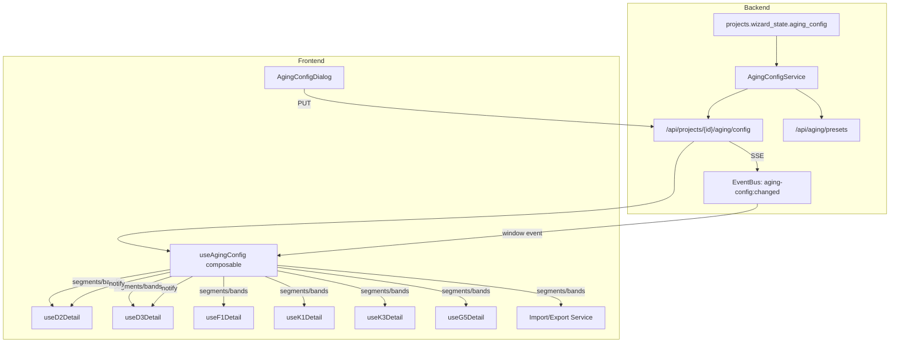

# Design Document: 往来款账龄配置动态化

## Overview

本设计将 D2/D3/F1/K1/K3/G5 六类往来款明细表的账龄段配置从硬编码提升为项目级动态配置。核心改造包括：

1. **后端 Aging_Config_Service**：基于现有 `wizard_state.aging_config` 存储，提供 preset/custom 配置的 CRUD + 校验 + 变更通知
2. **API 层**：GET/PUT 项目级配置端点 + 预设定义端点
3. **前端 useAgingConfig composable**：统一的响应式账龄段/列定义供所有明细表消费
4. **Detail Composable 改造**：D2 从 flat 字段迁移到 nested keyed 结构；D3/F1/K1/K3/G5 同步改造
5. **导入导出适配**：动态列头生成 + label 匹配导入
6. **D6 ECL 联动**：坏账准备账龄分组与项目配置同步
7. **旧数据迁移**：flat→nested 自动转换 + 默认推断

设计目标：**零停机升级**——所有旧数据在首次加载时自动迁移，不需要数据库迁移脚本修改已存储的 JSON。

## Architecture



### 数据流

1. **配置读取**：页面加载 → useAgingConfig.init(projectId, subject) → GET /api/projects/{id}/aging/config → 缓存 segments/bands
2. **配置变更**：AgingConfigDialog → PUT → 后端校验 → 写入 wizard_state → EventBus publish → SSE → 前端 useAgingConfig 刷新 → Detail composables 响应式更新列定义
3. **数据加载**：Detail composable loadRows → 检测 flat/nested 格式 → 若 flat 则自动 migrate → 后续 save 均以 nested 格式写入
4. **导出**：从 useAgingConfig.bands 动态生成列头 → XLSX
5. **导入**：读取 XLSX 列头 → 按 label 匹配 segments → 填入 nested 结构

## Components and Interfaces

### 1. AgingConfigService (Backend)

```python
# backend/app/services/aging_config_service.py

class AgingPreset(str, Enum):
    THREE_YEAR = "THREE_YEAR"   # 4段: 1年以内/1-2年/2-3年/3年以上
    FIVE_YEAR = "FIVE_YEAR"    # 6段: 1年以内/1-2年/2-3年/3-4年/4-5年/5年以上
    CUSTOM = "CUSTOM"          # 自定义 2-10 段

class AgingSegment(BaseModel):
    key: str          # 唯一标识 (e.g. "within1", "y1to2", "seg_custom_1")
    label: str        # 显示名 (e.g. "1年以内", "1-2年")
    dayFrom: int      # 起始天数 (含)
    dayTo: int | None # 结束天数 (含), None=无上限

class AgingConfigPayload(BaseModel):
    preset: AgingPreset
    custom_segments: list[AgingSegment] | None = None  # 仅 CUSTOM 时必填
    subject_overrides: dict[str, AgingPreset] | None = None  # e.g. {"D3": "THREE_YEAR"}

class AgingConfigResponse(BaseModel):
    preset: AgingPreset
    effective_segments: list[AgingSegment]  # 最终生效的段列表
    subject_overrides: dict[str, AgingPreset]

class AgingConfigService:
    PRESET_SEGMENTS: dict[AgingPreset, list[AgingSegment]]  # 预定义段列表
    DEFAULT_SUBJECT_PRESETS: dict[str, AgingPreset]  # D2/K1/K3/G5→FIVE_YEAR, D3/F1→THREE_YEAR

    async def get_config(project_id: UUID) -> AgingConfigResponse
    async def save_config(project_id: UUID, payload: AgingConfigPayload) -> AgingConfigResponse
    def validate_config(payload: AgingConfigPayload) -> list[str]  # 返回错误列表
    def resolve_segments(preset: AgingPreset, custom: list[AgingSegment] | None) -> list[AgingSegment]
    def get_effective_segments(project_id: UUID, subject: str) -> list[AgingSegment]
```

### 2. API Endpoints (Backend)

```python
# backend/app/routers/aging_config.py

GET  /api/projects/{project_id}/aging/config
     → AgingConfigResponse

PUT  /api/projects/{project_id}/aging/config
     ← AgingConfigPayload
     → AgingConfigResponse | 422 ValidationError

GET  /api/aging/presets
     → { presets: { THREE_YEAR: [...], FIVE_YEAR: [...] } }
```

### 3. useAgingConfig Composable (Frontend)

```typescript
// frontend/src/composables/useAgingConfig.ts

interface AgingBand {
  key: string           // segment key (唯一标识)
  label: string         // 显示名
  priorField: string    // 期初字段 key (e.g. "agingPrior.within1")
  currentField: string  // 期末未审字段 key (仅 D2 有)
  auditedField: string  // 期末审定字段 key
}

interface UseAgingConfigReturn {
  segments: Ref<AgingSegment[]>       // 有序段列表
  bands: Ref<AgingBand[]>             // 列定义（供 el-table-column 渲染）
  preset: Ref<AgingPreset>            // 当前预设
  loading: Ref<boolean>
  refresh: () => Promise<void>        // 手动刷新
}

function useAgingConfig(
  projectId: Ref<string>,
  subject?: string  // 'D2' | 'D3' | 'F1' | 'K1' | 'K3' | 'G5'
): UseAgingConfigReturn
```

### 4. AgingConfigDialog (Frontend)

```typescript
// frontend/src/components/workpaper/AgingConfigDialog.vue

Props: { projectId: string; visible: boolean }
Emits: { 'update:visible', 'config-saved' }

// 内部状态：preset radio + custom segment editor + subject override toggles
// 调用 PUT /api/projects/{id}/aging/config
// 成功后 emit 'config-saved' + window.dispatchEvent('aging-config:changed')
```

### 5. Detail Composable 改造接口

```typescript
// 所有明细表统一的 aging 数据结构（nested keyed）
interface AgingData {
  [segmentKey: string]: number  // e.g. { within1: 100, y1to2: 50, ... }
}

// D2 DetailRow 新增字段（替代 flat 字段）
interface D2DetailRowV2 {
  // ... existing non-aging fields ...
  agingPrior: AgingData      // 替代 priorAging1Year/priorAging1to2/...
  agingCurrent: AgingData    // 替代 currentAging1Year/currentAging1to2/...
  agingAudited: AgingData    // 替代 auditedAging1Year/auditedAging1to2/...
}

// D3/F1 已有的结构只需 key 从固定改为动态
interface D3F1DetailRowV2 {
  // ... existing non-aging fields ...
  agingPrior: AgingData      // 替代 { within1, y1to2, y2to3, over3 }
  agingAudited: AgingData    // 替代 { within1, y1to2, y2to3, over3 }
}
```

### 6. Migration Utility (Frontend)

```typescript
// frontend/src/composables/useAgingMigration.ts

// D2 flat → nested 映射
const D2_FLAT_TO_SEGMENT: Record<string, string> = {
  priorAging1Year: 'within1',
  priorAging1to2: 'y1to2',
  priorAging2to3: 'y2to3',
  priorAging3to4: 'y3to4',
  priorAging4to5: 'y4to5',
  priorAgingOver5: 'over5',
  // current/audited 同理
}

// D3/F1 旧 key → 新统一 key（实际上 key 不变，只是结构动态化）
// D3/F1 的 { within1, y1to2, y2to3, over3 } 本身已是 nested，
// 只需在加载时确保 key 与项目配置 segments 对齐

function migrateD2FlatToNested(raw: any): D2DetailRowV2
function migrateD3F1Keys(raw: any, segments: AgingSegment[]): D3F1DetailRowV2
function isLegacyD2Format(raw: any): boolean  // 检测是否含 priorAging1Year 等 flat 字段
```

## Data Models

### wizard_state.aging_config 存储结构

```json
{
  "aging_config": {
    "preset": "FIVE_YEAR",
    "custom_segments": null,
    "subject_overrides": {
      "D3": "THREE_YEAR",
      "F1": "THREE_YEAR"
    }
  }
}
```

当 preset 为 CUSTOM 时：

```json
{
  "aging_config": {
    "preset": "CUSTOM",
    "custom_segments": [
      { "key": "seg_1", "label": "6个月以内", "dayFrom": 0, "dayTo": 180 },
      { "key": "seg_2", "label": "6个月-1年", "dayFrom": 181, "dayTo": 365 },
      { "key": "seg_3", "label": "1-2年", "dayFrom": 366, "dayTo": 730 },
      { "key": "seg_4", "label": "2年以上", "dayFrom": 731, "dayTo": null }
    ],
    "subject_overrides": {}
  }
}
```

### 预设段定义

| Preset | Segments |
|--------|----------|
| THREE_YEAR | within1(1年以内, 0-365), y1to2(1-2年, 366-730), y2to3(2-3年, 731-1095), over3(3年以上, 1096+) |
| FIVE_YEAR | within1(1年以内, 0-365), y1to2(1-2年, 366-730), y2to3(2-3年, 731-1095), y3to4(3-4年, 1096-1460), y4to5(4-5年, 1461-1825), over5(5年以上, 1826+) |

### D2 DetailRow 新 JSON 格式

```json
{
  "rowId": "dr-xxx",
  "seq": 1,
  "customerName": "客户A",
  "agingPrior": { "within1": 100, "y1to2": 50, "y2to3": 0, "y3to4": 0, "y4to5": 0, "over5": 0 },
  "agingCurrent": { "within1": 80, "y1to2": 70, "y2to3": 0, "y3to4": 0, "y4to5": 0, "over5": 0 },
  "agingAudited": { "within1": 80, "y1to2": 70, "y2to3": 0, "y3to4": 0, "y4to5": 0, "over5": 0 }
}
```

### D3/F1 DetailRow 新 JSON 格式（与现有结构兼容，key 动态化）

```json
{
  "rowId": "row-xxx",
  "customerName": "供应商B",
  "agingPrior": { "within1": 200, "y1to2": 30, "y2to3": 10, "over3": 5 },
  "agingAudited": { "within1": 180, "y1to2": 40, "y2to3": 10, "over3": 5 }
}
```

### 旧→新字段映射表

| D2 旧字段 | 新 key | Period |
|-----------|--------|--------|
| priorAging1Year | agingPrior.within1 | prior |
| priorAging1to2 | agingPrior.y1to2 | prior |
| priorAging2to3 | agingPrior.y2to3 | prior |
| priorAging3to4 | agingPrior.y3to4 | prior |
| priorAging4to5 | agingPrior.y4to5 | prior |
| priorAgingOver5 | agingPrior.over5 | prior |
| currentAging1Year | agingCurrent.within1 | current |
| currentAging1to2 | agingCurrent.y1to2 | current |
| ... | ... | ... |
| auditedAging1Year | agingAudited.within1 | audited |
| auditedAging1to2 | agingAudited.y1to2 | audited |
| ... | ... | ... |


## Correctness Properties

*A property is a characteristic or behavior that should hold true across all valid executions of a system — essentially, a formal statement about what the system should do. Properties serve as the bridge between human-readable specifications and machine-verifiable correctness guarantees.*

### Property 1: Preset resolution returns correct segments

*For any* valid AgingPreset value (THREE_YEAR or FIVE_YEAR), calling `resolve_segments(preset, None)` SHALL return the predefined segment list with the correct number of segments (4 for THREE_YEAR, 6 for FIVE_YEAR) and correct labels in order.

**Validates: Requirements 1.1**

### Property 2: Default preset inference by subject

*For any* subject code in the set {D2, K1, K3, G5, D3, F1}, when a project has no `aging_config` in wizard_state, `get_effective_segments(project_id, subject)` SHALL return FIVE_YEAR segments for D2/K1/K3/G5 and THREE_YEAR segments for D3/F1.

**Validates: Requirements 1.2, 10.1**

### Property 3: Configuration round-trip preservation

*For any* valid AgingConfigPayload (with valid preset, valid custom_segments if CUSTOM, and valid subject_overrides), saving via `save_config` then loading via `get_config` SHALL return an equivalent configuration where preset, custom_segments, and subject_overrides are all preserved.

**Validates: Requirements 1.3**

### Property 4: Validation rejects invalid configurations

*For any* AgingConfigPayload where: (a) preset is CUSTOM and segments count is < 2 or > 10, OR (b) any segment has an empty/whitespace-only label, OR (c) two or more segments share the same label — `validate_config` SHALL return a non-empty error list.

**Validates: Requirements 1.4, 1.5, 2.3**

### Property 5: Config-to-bands transformation with subject override

*For any* valid AgingConfigResponse with N effective segments and optional subject_overrides, calling `useAgingConfig(projectId, subject)` SHALL produce: (a) a `segments` array of length N matching effective_segments, and (b) a `bands` array of length N where each band[i] has key=segments[i].key, label=segments[i].label, and correctly derived field paths. When a subject_override exists for the given subject, the override preset segments SHALL be used instead of the global preset.

**Validates: Requirements 3.1, 3.2, 3.4**

### Property 6: Three-period subject row generation (D2/K1/K3/G5)

*For any* segment count N (2 ≤ N ≤ 10), creating an empty detail row for a three-period subject (D2/K1/K3/G5) SHALL produce agingPrior, agingCurrent, and agingAudited objects each containing exactly N keys (one per segment), all initialized to 0.

**Validates: Requirements 4.1, 6.1, 6.2, 6.3**

### Property 7: Two-period subject row generation (D3/F1)

*For any* segment count N (2 ≤ N ≤ 10), creating an empty detail row for a two-period subject (D3/F1) SHALL produce agingPrior and agingAudited objects each containing exactly N keys (one per segment), all initialized to 0.

**Validates: Requirements 5.1, 5.2**

### Property 8: D2 legacy flat-to-nested migration preserves all values

*For any* D2 DetailRow in legacy flat format (containing priorAging1Year, priorAging1to2, ..., auditedAgingOver5 with arbitrary numeric values), `migrateD2FlatToNested` SHALL produce a nested structure where every original value is preserved at the corresponding segment key position, and no value is lost or duplicated.

**Validates: Requirements 4.3, 10.2, 10.3**

### Property 9: D3/F1 legacy key migration preserves values

*For any* D3 or F1 DetailRow with legacy aging object `{ within1, y1to2, y2to3, over3 }` containing arbitrary numeric values, migration SHALL produce a nested object with the same values mapped to the corresponding segment keys defined by the project configuration.

**Validates: Requirements 5.3, 5.4**

### Property 10: Config change preserves existing segment data

*For any* existing detail row with aging data and *any* configuration change (adding or removing segments), the resulting row SHALL: (a) preserve all numeric values for segments that exist in both old and new configs, and (b) initialize to 0 all values for newly added segments.

**Validates: Requirements 4.5**

### Property 11: Serialization produces exclusively nested format

*For any* detail row (regardless of whether it was loaded from legacy or new format), serialization SHALL produce a JSON object containing `agingPrior`, `agingCurrent` (for 3-period subjects), and `agingAudited` as nested keyed objects, and SHALL NOT contain any flat aging field keys (priorAging1Year, currentAging1to2, etc.).

**Validates: Requirements 4.2, 10.4**

### Property 12: Export header generation from bands

*For any* bands array of length N derived from a valid aging config, the export service SHALL generate column headers containing all N segment labels with appropriate period prefixes (期初/期末未审/期末审定 for D2, 期初/期末审定 for D3/F1), resulting in 3N headers for three-period subjects and 2N headers for two-period subjects.

**Validates: Requirements 8.1**

### Property 13: Import label matching maps correctly

*For any* imported XLSX with aging column headers labeled with segment names and *any* matching project aging config, the import service SHALL correctly map each column's values to the corresponding segment key in the nested aging structure. Columns whose labels do not match any current segment SHALL be skipped with warnings.

**Validates: Requirements 8.2, 8.3, 8.4**

### Property 14: ECL group syncs with aging config

*For any* valid aging config with N segments, creating a D6 ECL aging group SHALL produce exactly N child rows with labels matching the segment labels. When the config changes from M to N segments: (a) segments present in both old and new configs preserve their lossRate and bookBalance values, (b) new segments are added with zero values, (c) removed segments are marked for archival.

**Validates: Requirements 9.1, 9.2, 9.3**

## Error Handling

### Backend

| Error Scenario | HTTP Code | Error Code | Detail |
|---------------|-----------|------------|--------|
| Custom segments < 2 or > 10 | 422 | INVALID_SEGMENT_COUNT | "自定义账龄段数量必须在2-10之间" |
| Empty segment label | 422 | EMPTY_SEGMENT_LABEL | "账龄段名称不能为空: segments[{i}]" |
| Duplicate segment label | 422 | DUPLICATE_SEGMENT_LABEL | "账龄段名称重复: {label}" |
| Invalid preset value | 422 | INVALID_PRESET | "不支持的预设方案: {value}" |
| Project not found | 404 | PROJECT_NOT_FOUND | "项目不存在" |
| Unauthorized access | 403 | FORBIDDEN | "无权修改此项目配置" |

### Frontend

| Error Scenario | Handling |
|---------------|----------|
| API 请求失败 | ElMessage.error + 保留本地缓存继续使用 |
| 配置加载超时 | 使用默认配置兜底 (FIVE_YEAR) |
| 旧数据格式异常 | 静默降级为全零 aging 数据 + console.warn |
| EventBus 刷新失败 | 不影响已加载数据，下次打开重新加载 |
| 导入列不匹配 | ElMessage.warning 列出跳过的列名 |

### 边界情况

1. **并发编辑**：两个用户同时修改配置 → 后写入者覆盖 (last-write-wins, wizard_state 级别)
2. **空项目**：无 wizard_state → 返回默认值，不报错
3. **非法 subject**：传入非 D2/D3/F1/K1/K3/G5 的 subject → fallback 到全局 preset
4. **配置删除后重建**：wizard_state.aging_config 被清空 → 等同新项目，用默认值

## Testing Strategy

### Property-Based Tests (Hypothesis)

使用 Python `hypothesis` 库对后端纯逻辑进行属性测试，最少 100 次迭代：

| Property | Test File | Strategy |
|----------|-----------|----------|
| P1: Preset resolution | `test_aging_config_property.py` | `@given(preset=st.sampled_from(AgingPreset))` |
| P2: Default inference | `test_aging_config_property.py` | `@given(subject=st.sampled_from(['D2','D3','F1','K1','K3','G5']))` |
| P3: Round-trip | `test_aging_config_property.py` | `@given(payload=valid_config_strategy())` |
| P4: Validation | `test_aging_config_property.py` | `@given(segments=st.lists(st.text(), min_size=0, max_size=15))` |
| P5: Config→bands | `test_aging_config_property.py` | `@given(config=valid_config_strategy(), subject=subject_strategy())` |
| P8: D2 migration | `test_aging_migration_property.py` | `@given(row=legacy_d2_row_strategy())` |
| P10: Config change | `test_aging_migration_property.py` | `@given(row=nested_row_strategy(), new_segments=segment_list_strategy())` |
| P11: Serialization | `test_aging_migration_property.py` | `@given(row=any_d2_row_strategy())` |
| P14: ECL sync | `test_aging_config_property.py` | `@given(old_segments=segment_list_strategy(), new_segments=segment_list_strategy())` |

前端属性测试使用 `fast-check` (vitest)：

| Property | Test File | Strategy |
|----------|-----------|----------|
| P6: 3-period row gen | `useAgingConfig.property.test.ts` | `fc.integer({min:2, max:10})` → verify row structure |
| P7: 2-period row gen | `useAgingConfig.property.test.ts` | `fc.integer({min:2, max:10})` → verify row structure |
| P9: D3/F1 migration | `useAgingMigration.property.test.ts` | `fc.record(...)` → verify value preservation |
| P12: Export headers | `useAgingConfig.property.test.ts` | `fc.array(fc.record(...))` → verify header count |
| P13: Import matching | `useAgingConfig.property.test.ts` | `fc.array(...)` → verify mapping correctness |

**Tag format:** `Feature: aging-config-enhancement, Property {N}: {description}`

### Unit Tests (Example-Based)

- API 端点正常响应 (2.1, 2.2, 2.4, 2.5)
- Dialog 预设切换 UI 行为 (7.1-7.6)
- D2/D3/F1 列动态渲染 (4.4, 5.5, 6.4)
- EventBus 通知链路 (3.3, 3.5)
- 数据警告弹窗 (7.5)

### Integration Tests

- 完整 PUT→GET 配置流程
- 配置变更→EventBus→前端刷新链路
- D6 ECL 联动端到端
- 导入导出 XLSX 往返

### Playwright E2E

- 打开 AgingConfigDialog → 切换预设 → 确认 → 验证 D2 列数变化
- 自定义段 → 填写明细 → 切回3年段 → 确认数据警告 → 验证数据保留/清零
- 导出模板 → 修改配置 → 导入旧模板 → 验证 warning + 正确映射

