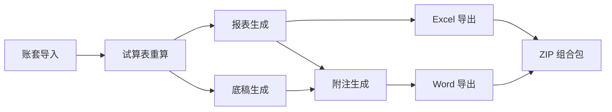

# 设计文档：审计全链路一键生成与导出

## Overview

本设计基于现有代码基础（report_engine.py 41KB / disclosure_engine.py 35KB / formula_engine.py 17KB / event_handlers.py 26KB），通过"补齐缺口+增强格式"策略实现审计全链路闭环。核心改动分为 4 层：

1. **编排层**：新建 `ChainOrchestrator` 服务，封装现有事件级联为单一端点 + SSE 进度流
2. **报表层**：补齐 report_config 公式覆盖率（26.5% → 90%+）+ 新建 Excel 模板导出引擎
3. **附注层**：接入 MD 模板校验公式 + 实现 TB()/WP()/REPORT() 取数函数 + 重写 Word 导出
4. **联动层**：打通报表↔附注↔底稿数据流 + 一致性门控 + 前端仪表盘

**不从零开发的组件**：事件级联（已就绪）、底稿预填充（已完成）、JSON 模板加载（已实现）、Redis 缓存（已集成）。



## Architecture

### 架构决策

**D1: 编排模式 — 顺序管线 + 容错跳过**

Chain_Orchestrator 采用顺序执行（非并行），原因：
- 步骤间有严格依赖（TB → Reports → Notes）
- 单步失败时需要决策是否继续
- SSE 进度推送需要明确的步骤边界

失败策略：某步骤失败后，检查后续步骤是否依赖该步骤。不依赖则继续，依赖则标记 skipped。

**D2: 报表导出 — 模板复制填充（非从零生成）**

基于 `审计报告模板/{版本}/{范围}/` 下的 xlsx 模板文件，使用 openpyxl 复制模板后填入数据。保留模板原有格式/边框/字体/列宽，仅写入数据单元格。

理由：致同模板格式复杂（合并单元格/条件格式/打印设置），从零生成无法完美复现。

**D3: 附注模板 — MD 为唯一真源，JSON 为运行时缓存**

`附注模版/` 目录下的 4 套 MD 文件是附注生成的唯一模板真源。系统启动时解析 MD → 生成运行时 JSON 结构缓存。`审计报告模板/` 下的 docx 附注文件仅作为 Word 导出的格式参考。

**D4: 附注公式引擎 — 扩展现有 formula_engine.py**

在现有 `FormulaEngine`（已支持 TB/SUM_TB/PREV/ROW）基础上，新增 3 个执行器：
- `WPExecutor`：从底稿 parsed_data 取数
- `REPORTExecutor`：从 financial_report 取数
- `NOTEExecutor`：从其他附注章节取数（交叉引用）

**D5: SSE 进度 — 复用现有 event_bus + SSE 通道**

不新建 WebSocket 服务。复用 `event_bus.publish_immediate` → SSE queue → `/events/stream` 已有通道。新增 `CHAIN_STEP_*` 事件类型。

**D6: 一致性门控 — 5 项检查分 blocking/warning**

导出前执行 5 项数据一致性检查。blocking 级别阻断导出，warning 级别允许导出但附加警告。force_export 参数可跳过所有检查。

**D7: 附注分层处理 — 5 层策略**

附注内容按 A/B/C/D/E 五层分类处理：
- A 层（会计政策）：模板文字 + 占位符替换，不联动底稿
- B 层（合并科目注释）：底稿联动核心，90%+ 自动填充
- C 层（母公司注释）：同 B 但取单体 TB
- D 层（补充信息）：50% 自动 + 50% 手动
- E 层（附录索引）：100% 自动生成

**D8: 互斥锁 — pg_advisory_xact_lock**

同一项目同一年度的全链路执行使用 PG 事务级咨询锁（`pg_advisory_xact_lock(project_id_hash, year)`），防止并发执行。SQLite 环境降级为内存锁。

**D9: 附注校验公式 — 声明式规则引擎**

校验规则从 MD 预设文件加载为声明式配置（JSON 结构），运行时由通用执行器解释执行。不硬编码具体校验逻辑。9 种校验类型各有独立执行器。

**D10: Word 导出 — python-docx 精确控制**

重写 `NoteWordExporter`，使用 python-docx 精确控制每个段落/表格/页眉页脚的格式。不使用 Word 模板填充（模板格式不稳定），而是程序化构建完整文档。

## Components and Interfaces

### 1. ChainOrchestrator（全链路编排服务）

```python
# backend/app/services/chain_orchestrator.py

class ChainStep(str, Enum):
    RECALC_TB = "recalc_tb"
    GENERATE_WORKPAPERS = "generate_workpapers"
    GENERATE_REPORTS = "generate_reports"
    GENERATE_NOTES = "generate_notes"

class StepStatus(str, Enum):
    PENDING = "pending"
    RUNNING = "running"
    COMPLETED = "completed"
    FAILED = "failed"
    SKIPPED = "skipped"

class ChainOrchestrator:
    STEP_ORDER = [
        ChainStep.RECALC_TB,
        ChainStep.GENERATE_WORKPAPERS,
        ChainStep.GENERATE_REPORTS,
        ChainStep.GENERATE_NOTES,
    ]
    DEPENDENCIES = {
        ChainStep.GENERATE_WORKPAPERS: [ChainStep.RECALC_TB],
        ChainStep.GENERATE_REPORTS: [ChainStep.RECALC_TB],
        ChainStep.GENERATE_NOTES: [ChainStep.GENERATE_REPORTS],
    }

    async def execute_full_chain(
        self, project_id: UUID, year: int,
        steps: list[ChainStep] | None = None,
        force: bool = False,
    ) -> ChainExecution: ...

    async def retry_execution(
        self, project_id: UUID, execution_id: UUID,
    ) -> ChainExecution: ...

    async def get_execution_history(
        self, project_id: UUID, limit: int = 100,
    ) -> list[ChainExecution]: ...
```

### 2. ReportExcelExporter（报表 Excel 导出引擎）

```python
# backend/app/services/report_excel_exporter.py

class ReportExcelExporter:
    TEMPLATE_MAP = {
        "soe_consolidated": "审计报告模板/国企版/合并/1.1-2025国企财务报表.xlsx",
        "soe_standalone": "审计报告模板/国企版/单体/1.1-2025国企财务报表.xlsx",
        "listed_consolidated": "审计报告模板/上市版/合并/2.股份年审－经审计的财务报表-202601.xlsx",
        "listed_standalone": "审计报告模板/上市版/单体/2.股份年审－经审计的财务报表-202601.xlsx",
    }

    async def export(
        self, project_id: UUID, year: int,
        mode: str = "audited",  # unadjusted | audited
        report_types: list[str] | None = None,
        include_prior_year: bool = True,
    ) -> BytesIO: ...
```

### 3. NoteWordExporter（附注 Word 导出引擎 — 增强版）

```python
# backend/app/services/note_word_exporter.py (重写)

class NoteWordExporter:
    # 致同标准格式常量
    PAGE_MARGINS = {"top": Cm(3.2), "bottom": Cm(2.54), "left": Cm(3), "right": Cm(3.18)}
    HEADER_MARGIN = Cm(1.3)
    FOOTER_MARGIN = Cm(1.3)
    BODY_FONT = "仿宋_GB2312"
    BODY_SIZE = Pt(12)  # 小四
    NUMBER_FONT = "Arial Narrow"

    async def export(
        self, project_id: UUID, year: int,
        template_type: str = "soe",
        sections: list[str] | None = None,
        skip_empty: bool = False,
    ) -> BytesIO: ...

    async def preview_html(
        self, project_id: UUID, year: int,
    ) -> str: ...
```

### 4. ConsistencyGate（一致性门控）

```python
# backend/app/services/consistency_gate.py

class CheckSeverity(str, Enum):
    BLOCKING = "blocking"
    WARNING = "warning"

class ConsistencyGate:
    async def run_all_checks(
        self, project_id: UUID, year: int,
    ) -> ConsistencyResult: ...

    async def check_tb_balance(self, project_id, year) -> CheckItem: ...
    async def check_bs_balance(self, project_id, year) -> CheckItem: ...
    async def check_is_reconciliation(self, project_id, year) -> CheckItem: ...
    async def check_notes_completeness(self, project_id, year) -> CheckItem: ...
    async def check_data_freshness(self, project_id, year) -> CheckItem: ...
```

### 5. ExportPackageService（组合导出包）

```python
# backend/app/services/export_package_service.py

class ExportPackageService:
    async def export_package(
        self, project_id: UUID, year: int,
        include_audit_report: bool = False,
        include_workpapers: bool = False,
        force_export: bool = False,
    ) -> BytesIO: ...
```

### 6. NoteValidationEngine（附注校验公式引擎）

```python
# backend/app/services/note_validation_engine.py

class ValidationType(str, Enum):
    BALANCE = "余额"
    WIDE_TABLE = "宽表"
    VERTICAL = "纵向"
    CROSS = "交叉"
    CROSS_ACCOUNT = "跨科目"
    SUB_ITEM = "其中项"
    SECONDARY_DETAIL = "二级明细"
    COMPLETENESS = "完整性"
    LLM_REVIEW = "LLM审核"

class NoteValidationEngine:
    async def load_preset(self, template_type: str) -> list[ValidationRule]: ...
    async def execute_all(
        self, project_id: UUID, year: int,
    ) -> list[ValidationResult]: ...
    async def execute_rule(
        self, rule: ValidationRule, context: ValidationContext,
    ) -> ValidationResult: ...
```

### 7. NoteMDTemplateParser（附注 MD 模板解析器）

```python
# backend/app/services/note_md_template_parser.py

class NoteMDTemplateParser:
    TEMPLATE_FILES = {
        ("soe", "consolidated"): "附注模版/国企报表附注.md",
        ("soe", "standalone"): "附注模版/国企报表附注_单体.md",
        ("listed", "consolidated"): "附注模版/上市报表附注.md",
        ("listed", "standalone"): "附注模版/上市报表附注_单体.md",
    }

    def parse(self, template_type: str, scope: str) -> list[NoteSection]: ...
    def extract_tables(self, section: NoteSection) -> list[TableDefinition]: ...
    def extract_placeholders(self, section: NoteSection) -> list[str]: ...
```

### API 端点

| 端点 | 方法 | 描述 |
|------|------|------|
| `/api/projects/{pid}/workflow/execute-full-chain` | POST | 执行全链路 |
| `/api/projects/{pid}/workflow/progress/{eid}` | GET(SSE) | 进度流 |
| `/api/projects/{pid}/workflow/executions` | GET | 执行历史 |
| `/api/projects/{pid}/workflow/retry/{eid}` | POST | 重试失败步骤 |
| `/api/projects/{pid}/workflow/consistency-check` | GET | 一致性检查 |
| `/api/projects/{pid}/workflow/export-package` | POST | 组合导出 |
| `/api/projects/{pid}/reports/export-excel` | POST | 报表 Excel 导出 |
| `/api/projects/{pid}/notes/export-word` | POST | 附注 Word 导出 |
| `/api/projects/{pid}/workflow/status` | GET | 工作流状态 |
| `/api/workflow/batch-execute` | POST | 批量执行 |


## Data Models

### ChainExecution（全链路执行记录）

```python
class ChainExecution(Base):
    __tablename__ = "chain_executions"

    id: Mapped[UUID] = mapped_column(primary_key=True, default=uuid4)
    project_id: Mapped[UUID] = mapped_column(ForeignKey("projects.id"))
    year: Mapped[int]
    status: Mapped[str]  # pending/running/completed/partially_failed/failed
    steps: Mapped[dict] = mapped_column(JSONB)  # {step_name: {status, started_at, completed_at, duration_ms, error, summary}}
    trigger_type: Mapped[str]  # manual/auto/batch
    triggered_by: Mapped[UUID | None]
    started_at: Mapped[datetime]
    completed_at: Mapped[datetime | None]
    total_duration_ms: Mapped[int | None]
    snapshot_before: Mapped[dict | None] = mapped_column(JSONB)  # 执行前快照
    created_at: Mapped[datetime] = mapped_column(default=func.now())
```

### NoteValidationResult（附注校验结果）

```python
class NoteValidationResult(Base):
    __tablename__ = "note_validation_results"

    id: Mapped[UUID] = mapped_column(primary_key=True, default=uuid4)
    project_id: Mapped[UUID] = mapped_column(ForeignKey("projects.id"))
    year: Mapped[int]
    section_code: Mapped[str]  # 附注章节编码
    rule_type: Mapped[str]  # 校验类型（9种之一）
    rule_expression: Mapped[str]  # 校验公式表达式
    passed: Mapped[bool]
    expected_value: Mapped[Decimal | None]
    actual_value: Mapped[Decimal | None]
    diff_amount: Mapped[Decimal | None]
    details: Mapped[dict | None] = mapped_column(JSONB)
    executed_at: Mapped[datetime] = mapped_column(default=func.now())
```

### NoteAccountMapping（附注科目对照映射）

```python
class NoteAccountMapping(Base):
    __tablename__ = "note_account_mappings"

    id: Mapped[UUID] = mapped_column(primary_key=True, default=uuid4)
    template_type: Mapped[str]  # soe/listed
    report_row_code: Mapped[str]  # 报表行次编码 (BS-002)
    note_section_code: Mapped[str]  # 附注章节编码
    table_index: Mapped[int] = mapped_column(default=0)  # 章节内第几个表格
    validation_role: Mapped[str | None]  # 余额/宽表/交叉/其中项/描述
    wp_code: Mapped[str | None]  # 对应底稿编码 (E1/D2/F2)
    fetch_mode: Mapped[str | None]  # total/detail/category/change
```

### ExportLog（导出日志）

```python
class ExportLog(Base):
    __tablename__ = "export_logs"

    id: Mapped[UUID] = mapped_column(primary_key=True, default=uuid4)
    project_id: Mapped[UUID] = mapped_column(ForeignKey("projects.id"))
    year: Mapped[int]
    export_type: Mapped[str]  # excel/word/package
    file_name: Mapped[str]
    file_size_bytes: Mapped[int | None]
    exported_by: Mapped[UUID]
    consistency_result: Mapped[dict | None] = mapped_column(JSONB)
    data_hash: Mapped[str | None]  # SHA-256 of exported data
    created_at: Mapped[datetime] = mapped_column(default=func.now())
```

### 现有模型扩展

```python
# DisclosureNote 扩展字段
class DisclosureNote:
    # 新增字段
    layer: Mapped[str | None]  # A/B/C/D/E 层级
    completion_status: Mapped[str] = mapped_column(default="not_started")  # not_started/auto_filled/editing/completed/reviewed
    assigned_to: Mapped[UUID | None]  # 负责人
    validation_status: Mapped[str | None]  # passed/warning/failed
    formula_bindings: Mapped[dict | None] = mapped_column(JSONB)  # 单元格公式绑定
    wp_code: Mapped[str | None]  # 关联底稿编码
    is_custom: Mapped[bool] = mapped_column(default=False)  # 用户自定义章节
    sort_order: Mapped[int] = mapped_column(default=0)

# Project 扩展字段（已有 template_type/report_scope）
class Project:
    # 确认已有
    template_type: Mapped[str | None]  # soe/listed
    report_scope: Mapped[str | None]  # consolidated/standalone
    # 新增
    amount_unit: Mapped[str] = mapped_column(default="yuan")  # yuan/wan/qian
    note_skip_empty: Mapped[bool] = mapped_column(default=True)
```

## Correctness Properties

*A property is a characteristic or behavior that should hold true across all valid executions of a system—essentially, a formal statement about what the system should do. Properties serve as the bridge between human-readable specifications and machine-verifiable correctness guarantees.*

### Property 1: 步骤依赖自动补充

*For any* subset of requested chain steps, the actually executed steps must always include all transitive prerequisites as defined in `DEPENDENCIES`. If step X depends on step Y, requesting only X must also execute Y.

**Validates: Requirements 1.3**

### Property 2: 互斥锁保证单一执行

*For any* two concurrent `execute_full_chain` calls with the same `(project_id, year)`, at most one should succeed; the other must receive a 409 Conflict response.

**Validates: Requirements 1.9**

### Property 3: SSE 事件完整性

*For any* chain execution that completes (success or partial failure), the SSE event stream must contain exactly one `running` event and one terminal event (`completed` or `failed`) per executed step, plus one final `chain_completed` event.

**Validates: Requirements 2.2, 2.3, 2.4, 2.5**

### Property 4: 报表模式取数正确性

*For any* report generation, when `mode=unadjusted` the values must equal `trial_balance.unadjusted_amount`, and when `mode=audited` the values must equal `trial_balance.audited_amount` for the corresponding account codes.

**Validates: Requirements 18.1, 18.2, 18.3**

### Property 5: Excel 导出格式不变性

*For any* exported Excel workbook, the template's original formatting (cell styles, borders, fonts, column widths, merged cells) must be preserved for all non-data cells. Only cells designated for data filling should differ from the template.

**Validates: Requirements 3.3, 3.5, 3.6, 3.7, 3.8**

### Property 6: Excel 合计行公式保留

*For any* total row in the exported Excel, the cell must contain an Excel SUM formula (not a hardcoded numeric value), and the formula range must cover all child rows.

**Validates: Requirements 3.10, 20.2**

### Property 7: Word 导出页面设置

*For any* exported Word document, the page margins must be exactly: top=3.2cm, bottom=2.54cm, left=3cm, right=3.18cm, header=1.3cm, footer=1.3cm.

**Validates: Requirements 4.2, 27.1**

### Property 8: 附注空章节占位文本

*For any* note section where all table cells are empty/zero and text_content is empty, the exported Word document must contain the text "本期无此项业务" for that section.

**Validates: Requirements 4.9, 27.6**

### Property 9: 组合导出包完整性

*For any* export package ZIP, it must contain at minimum: one `.xlsx` file (报表) and one `.docx` file (附注) and one `manifest.json`. When `include_audit_report=true`, an additional `.docx` must be present.

**Validates: Requirements 5.2, 5.3, 5.8**

### Property 10: 一致性门控正确性

*For any* consistency check result, `overall="pass"` if and only if all checks with `severity="blocking"` have `passed=true`. If any blocking check has `passed=false`, then `overall="fail"`.

**Validates: Requirements 6.5, 6.6**

### Property 11: 公式 fallback 取数

*For any* report row where the formula evaluates to 0 but the corresponding TB account has a non-zero balance, the final displayed value must equal the TB balance (fallback applied).

**Validates: Requirements 18.8, 20.1**

### Property 12: 附注模板选择正确性

*For any* project with `template_type` and `report_scope` configured, the disclosure engine must load the MD template file corresponding to that exact combination (4 possible combinations → 4 specific files).

**Validates: Requirements 21.2, 21.3**

### Property 13: 附注校验互斥规则

*For any* note section, the validation rules assigned to it must never simultaneously include `[余额]` together with `[其中项]` or `[宽表]`. These types are mutually exclusive.

**Validates: Requirements 22.3**

### Property 14: 宽表横向公式平衡

*For any* wide table row in a note section, the equation `期初余额 + 本期增加 - 本期减少 = 期末余额` must hold (within rounding tolerance of 0.01).

**Validates: Requirements 24.2**

### Property 15: 附注规则引擎驱动生成

*For any* note section where the corresponding report row amount is 0 AND no workpaper exists AND it's not a "必披露" section, the section must be marked as "本期无此项业务" (not generated with empty tables).

**Validates: Requirements 35.1, 35.2, 35.3**

### Property 16: 导出文件命名规范

*For any* exported file, the filename must match the pattern `{公司简称}_{年度}年度{文件类型}.{ext}` where special characters `/\:*?"<>|` are replaced with underscores.

**Validates: Requirements 32.1, 32.4**

### Property 17: 数据过期级联标记

*For any* adjustment creation/modification/deletion event, the trial balance must be marked stale, which cascades to mark all reports stale, which cascades to mark all notes stale.

**Validates: Requirements 8.1, 8.2, 8.3**

### Property 18: 交叉引用编号一致性

*For any* report row that has a linked note section, the "附注编号" column value must equal the note section's current sequential number (after any reordering/trimming).

**Validates: Requirements 42.1, 42.2, 42.3**

### Property 19: 变动分析生成阈值

*For any* account where `|current - prior| / |prior| > 0.20` (change rate > 20%), a variation analysis paragraph template must be generated. For accounts with change rate ≤ 20%, no variation analysis is generated (unless manually requested).

**Validates: Requirements 43.1, 43.5**

### Property 20: 签字后数据不可变

*For any* project where the audit report status is `final` (signed), attempts to modify report data or note data must be rejected (HTTP 403), and the `generate_reports`/`generate_notes` endpoints must refuse to overwrite locked data.

**Validates: Requirements 53.1, 53.3**

## Error Handling

### 编排层错误处理

| 错误场景 | 处理策略 | 用户反馈 |
|---------|---------|---------|
| 前置条件不满足 | force=false → 400; force=true → skip | 明确指出缺失条件 |
| 单步执行超时（>5min） | 标记 failed，继续后续 | SSE 推送 timeout 事件 |
| 互斥锁冲突 | 返回 409 + 当前执行者信息 | "项目正在执行中，操作人：XXX" |
| 数据库连接失败 | 重试 3 次，间隔指数退避 | SSE 推送 retrying 事件 |
| 全部步骤失败 | 标记 permanently_failed | ElNotification 错误摘要 |

### 导出层错误处理

| 错误场景 | 处理策略 | 用户反馈 |
|---------|---------|---------|
| 模板文件缺失 | 返回 500 + 具体文件路径 | "模板文件不存在：{path}" |
| 一致性检查失败 | force=false → 400; force=true → 附加 warnings | 列出不一致项 |
| 报表数据为空 | 返回 400 + prerequisite_action | "请先执行全链路刷新" |
| Word 生成 OOM | 分批处理章节，限制单次 100 章节 | "附注章节过多，请分批导出" |
| openpyxl 格式异常 | 降级为无格式填充 + warning | "部分格式未能保留" |

### 附注层错误处理

| 错误场景 | 处理策略 | 用户反馈 |
|---------|---------|---------|
| MD 模板解析失败 | 降级到 JSON 模板 | "MD 模板解析异常，使用默认模板" |
| 校验公式执行错误 | 记录 warning，不阻断生成 | 校验结果标记为 "error" |
| 底稿取数失败 | 标记单元格为"待填写" | 黄色背景 + tooltip |
| 公式循环引用 | 检测环路，标记涉及单元格 | "检测到循环引用：A→B→A" |

## Testing Strategy

### 测试框架选择

- **单元测试**：pytest + pytest-asyncio（后端）/ vitest（前端）
- **属性测试**：hypothesis（Python PBT 库）
- **集成测试**：pytest + SQLite in-memory（快速）+ PG 容器（CI）

### 属性测试配置

每个属性测试最少 100 次迭代（`@settings(max_examples=100)`）。每个测试用注释标注对应的设计属性：

```python
# Feature: audit-chain-generation, Property 1: 步骤依赖自动补充
@given(steps=st.lists(st.sampled_from(ChainStep), min_size=0, max_size=4))
@settings(max_examples=100)
def test_prerequisite_auto_inclusion(steps):
    ...
```

### 单元测试重点

- 报表公式计算正确性（TB/SUM_TB/ROW/CFS 间接法）
- Excel 模板复制后格式保留
- Word 导出页面设置/字体/段落格式
- 一致性门控 5 项检查逻辑
- 附注校验公式 9 种类型各自的执行逻辑
- MD 模板解析（章节/表格/占位符提取）

### 集成测试重点

- 全链路编排端到端（4 步顺序执行 + SSE 事件流）
- 导出包完整性（ZIP 内容 + manifest）
- 报表→附注联动（报表变更 → 附注 stale → 刷新）
- 并发互斥锁（同项目同年度双请求）

### 前端测试

- vitest：composable 单测（useChainExecution / useExportDialog）
- Playwright E2E：一键刷新按钮 → 进度条更新 → 完成通知
