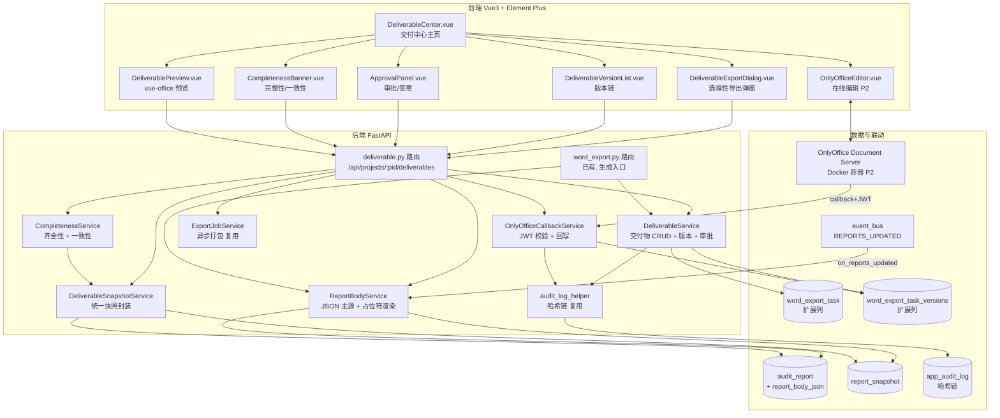
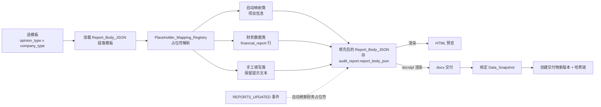
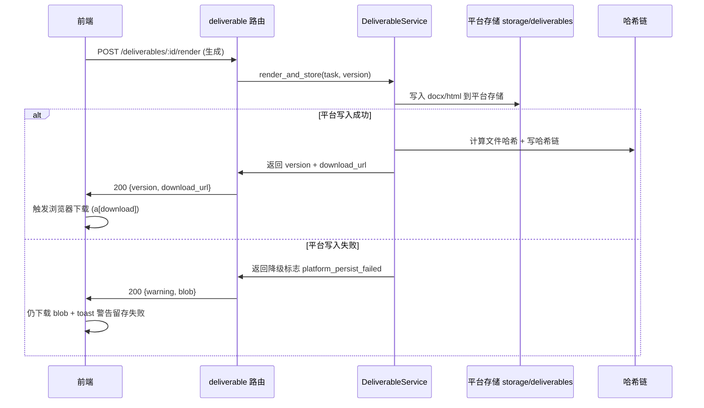

# 设计文档：审计报告交付件管理中心

## 概述

审计报告交付件管理中心（Deliverable Center）将现有「浏览器 blob 直接下载」的离散导出能力，升级为「选择性导出 → 双路径存储 → 版本管理 → 在线预览/编辑 → 审批/签章 → 哈希链防篡改 → 归档」的完整交付物生命周期管理体系。

本设计的核心策略是**最大化复用现有资产、最小化新增表**：

- **后端复用** `word_export_task` / `word_export_task_versions`（已有状态机 + 版本表）、`report_snapshot_service`（快照 + 哈希）、`audit_report` + `audit_report_template`（意见类型矩阵 + 占位符填充）、`event_bus` + `event_handlers`（数据联动）、`audit_log_helper`（哈希链）、`export_jobs_v2`（异步打包）。
- **前端复用** `@vue-office/docx` + `@vue-office/pdf`（预览）、`office_preview` 路由（LibreOffice 转 PDF 降级）、`ExportDialog.vue`（导出弹窗骨架）、`generateReports`（报表一键生成）。

设计按需求文档的 **P0 → P1 → P2** 优先级组织。每个设计小节标注其优先级，便于分批实施。OnlyOffice 在线编辑（需求 6）为 P2 且依赖 Docker 服务部署，本文档完整设计其集成方案并标注部署依赖。

### 关键设计决策

| 决策点 | 选项 | 结论 | 理由 |
|--------|------|------|------|
| 交付物表结构 | 新建独立表 vs 扩展 `word_export_task` | **扩展 `word_export_task` + 复用 `word_export_task_versions`** | 已有状态机、版本表、索引、router；避免数据迁移与双写。仅 ALTER ADD COLUMN |
| 报告正文主源 | docx 主源 vs 结构化 JSON 主源 | **Report_Body_JSON 为主源**，渲染 HTML（预览）+ docx（交付） | 支持占位符自动映射、段落级增删、KAM 多条目、Event_Linkage 自动刷新（需求 24） |
| docx 渲染库 | python-docx vs docxtpl | **docxtpl（Jinja2 模板）渲染交付 docx；python-docx 做水印后处理** | docxtpl 占位符语义与 Report_Body_JSON 段落天然契合，模板可视化维护 |
| 在线编辑 | TipTap vs OnlyOffice | **OnlyOffice Document Server（Docker 独立服务）** | docx/xlsx 高保真，规避双向转换格式丢失；小团队并发足够 |
| 三件套快照对齐 | 各自快照 vs 统一封装 | **统一快照封装层 `DeliverableSnapshotService`** | `report_snapshot` 仅覆盖报表；需对附注/报告正文统一快照标识与一致性校验（需求 19） |
| 哈希链 | 新建链 vs 复用 `audit_log_helper` | **复用 `app_audit_log` 哈希链 + 交付物文件哈希字段** | 遵循「审计只写哈希链」治理裁定，单链不分叉 |

## 架构

### 系统分层架构



### 报告正文生成与渲染管线（P0 核心）



### 双路径存储流程（P0 核心，需求 2）



## 组件与接口

### 后端服务接口

#### DeliverableService（扩展自 ExportTaskService）

复用并扩展现有 `ExportTaskService`（`backend/app/services/export_task_service.py`）。新增交付物维度方法，保持原有状态机方法不变。

```python
class DeliverableService(ExportTaskService):
    """交付物服务 — 在 ExportTaskService 基础上扩展交付中心能力"""

    # --- 列表与分组（需求 3）---
    async def list_deliverables(
        self, project_id: UUID, *,
        doc_type: str | None = None,
        status: str | None = None,
        date_from: datetime | None = None,
        date_to: datetime | None = None,
        keyword: str | None = None,
    ) -> list[DeliverableDTO]: ...

    # --- 版本链（需求 4）---
    async def get_version_chain(self, task_id: UUID) -> list[WordExportTaskVersion]: ...
    async def create_version(
        self, task_id: UUID, file_path: str, html_path: str | None,
        user_id: UUID, source_snapshot_refs: dict,
    ) -> WordExportTaskVersion:
        """版本号 = max(existing.version_no) + 1，单调递增"""

    async def export_or_new_deliverable(
        self, project_id: UUID, doc_type: str, ..., user_id: UUID,
    ) -> tuple[WordExportTask, WordExportTaskVersion]:
        """confirmed/signed/archived 状态再导出 → 新建独立交付物；
        否则 → 追加版本（需求 4.4）"""

    # --- 双路径存储（需求 2）---
    async def render_and_store(
        self, task_id: UUID, render_result: RenderResult, user_id: UUID,
    ) -> StoreResult:
        """写平台存储 + 记录元信息 + 哈希链；平台失败返回降级标志"""

    # --- 审批流（需求 7, P2）---
    async def submit_for_approval(self, task_id: UUID, user_id: UUID) -> WordExportTask
    async def approve(self, task_id: UUID, approver_id: UUID) -> WordExportTask
    async def reject(self, task_id: UUID, approver_id: UUID, reason: str) -> WordExportTask

    # --- 签章 + EQCR（需求 14, P1）---
    async def sign(self, task_id: UUID, signer_id: UUID, sign_type: str) -> WordExportTask
        """confirmed→signed；前置校验 EQCR_Gate；记录 sign_type"""

    # --- 归档（需求 11, P2）---
    async def archive_project_deliverables(self, project_id: UUID, user_id: UUID) -> int
    async def unarchive(self, task_id: UUID, admin_id: UUID, reason: str) -> WordExportTask
        """仅 admin；写 archive_unarchive 审计日志"""
```

#### 交付物状态机（扩展 VALID_STATUS_TRANSITIONS）

现有状态机 `draft→generating→generated→editing→confirmed→signed` 需扩展审批与归档态：

```python
VALID_STATUS_TRANSITIONS: dict[str, list[str]] = {
    "draft": ["generating"],
    "generating": ["generated"],
    "generated": ["editing"],
    "editing": ["pending_approval", "confirmed"],   # 需求 7 新增 pending_approval
    "pending_approval": ["confirmed", "editing"],    # 批准/驳回
    "confirmed": ["signed", "editing", "archived"],  # 需求 11 可归档
    "signed": ["archived"],
    "archived": [],                                   # 终态，仅 admin 解除
}
```

#### ReportBodyService（P0 核心，需求 22/23/24/26）

```python
class ReportBodyService:
    """审计报告正文 JSON 主源 + 占位符渲染"""

    async def load_body_template(
        self, opinion_type: OpinionType, company_type: CompanyType,
    ) -> ReportBodyJSON:
        """从 audit_report_template 组装段落数组 → Report_Body_JSON"""

    async def fill_placeholders(
        self, body: ReportBodyJSON, project_id: UUID, year: int,
    ) -> ReportBodyJSON:
        """按 Placeholder_Mapping_Registry 填充自动映射类 + 财务数据类；
        手工填写类保留提示文本"""

    async def refresh_financial_placeholders(
        self, project_id: UUID, year: int,
    ) -> None:
        """Event_Linkage REPORTS_UPDATED 触发，仅刷新财务数据类占位符"""

    def render_html(self, body: ReportBodyJSON) -> str:
        """渲染 HTML 供在线预览"""

    def render_docx(self, body: ReportBodyJSON, *, watermark: bool) -> Path:
        """docxtpl 渲染交付 docx；watermark=True 时叠加草稿水印"""

    # KAM 校验（需求 23）
    def validate_kam(self, body: ReportBodyJSON, company_type, is_pie, opinion_type) -> str | None:
        """上市/PIE 且非 disclaimer → KAM 必填非空，否则返回错误信息"""
```

#### DeliverableSnapshotService（P1，需求 13/19）

统一三类交付物的快照标识封装层。现有 `report_snapshot` 仅覆盖报表（BS/IS/CFS/EQ）；本服务在其之上统一封装。

```python
class DeliverableSnapshotService:
    """统一快照封装层 — 对齐报告正文/报表/附注三类交付物快照粒度"""

    async def capture_snapshot_ref(
        self, project_id: UUID, year: int, doc_type: str,
    ) -> SnapshotRef:
        """返回统一快照引用 {snapshot_id, tb_hash, captured_at}。
        - financial_report → 复用 report_snapshot_service
        - disclosure_notes → 取 disclosure_notes.bound_dataset_id + tb_hash
        - audit_report → 取 audit_report.financial_data 来源 tb_hash
        三类统一回退到 trial_balance MD5 哈希作为对齐基准"""

    async def check_trio_consistency(
        self, project_id: UUID, year: int,
    ) -> TrioConsistencyResult:
        """校验三件套 Data_Snapshot 是否来自同一次数据更新（同一 tb_hash）"""
```

> **可行性结论（需求 19）**：三类交付物的快照粒度**可对齐**到统一的 `trial_balance` MD5 哈希基准 —— 因为报表、附注、报告正文财务数据均最终源自同一份 `trial_balance`（经 `Event_Linkage` 链传播）。`DeliverableSnapshotService` 以该哈希为统一对齐键，无需为三者建立独立的快照表。

#### CompletenessService（P1，需求 8/19/20）

```python
class CompletenessService:
    async def check(self, project_id: UUID, year: int) -> CompletenessResult:
        """齐全性（需求 8）+ 数据一致性（需求 19）合并校验。
        齐全性：按项目类型必需件清单（标准三件套 / 专项报告，需求 20）。
        一致性：调 DeliverableSnapshotService.check_trio_consistency。
        二者均通过方为 passed=True"""

    def required_doc_types(self, project_type: str) -> list[str]:
        """可配置必需件清单：standard → [audit_report, financial_report, disclosure_notes]"""
```

#### OnlyOfficeCallbackService（P1 安全 + P2 编辑，需求 6/29）

```python
class OnlyOfficeCallbackService:
    def build_editor_config(self, task, version, mode: str, user) -> dict:
        """生成 OnlyOffice config（document/editorConfig）+ 签发 JWT"""

    def verify_callback_jwt(self, token: str, body: dict) -> bool:
        """校验 callback JWT 签名（需求 29）；失败写安全日志并拒绝"""

    async def handle_callback(self, task_id: UUID, body: dict) -> None:
        """status==2(ready)时下载编辑后文件 → 创建新版本 + 哈希链（需求 6.4）"""

    async def health_check(self) -> bool:
        """OnlyOffice /healthcheck 探测（需求 28.3）"""
```

### 后端 API 端点（新增 deliverable.py 路由）

新路由 `prefix="/api/projects/{project_id}/deliverables"`，在 `router_registry/report.py` 的 `register_report_routers` 中注册（铁律：新建 router 必注册否则 404）。

| 方法 | 路径 | 说明 | 需求 | 优先级 |
|------|------|------|------|--------|
| GET | `/` | 交付物列表（分组/筛选/搜索） | 3 | P0 |
| GET | `/{task_id}/versions` | 版本链 | 4 | P0 |
| POST | `/{task_id}/versions/compare` | 版本元信息对比 | 4.3 | P0 |
| GET | `/{task_id}/versions/{version_no}/download` | 下载指定版本 | 3.6 | P0 |
| GET | `/{task_id}/versions/{version_no}/preview-url` | 预览（docx 直读 / pdf 转换） | 5 | P0 |
| POST | `/report-body/load-template` | 加载报告正文 JSON 模板 | 24.1 | P0 |
| POST | `/report-body/render` | 渲染正文 HTML+docx 并存版本 | 24.7 | P0 |
| GET | `/report-body/preview-html` | 正文 HTML 预览 | 24.7 | P0 |
| GET | `/completeness` | 齐全性 + 一致性检查 | 8/19 | P1 |
| GET | `/{task_id}/snapshot-stale` | 数据过时检测 | 13 | P1 |
| POST | `/{task_id}/submit-approval` | 提交审批 | 7 | P2 |
| POST | `/{task_id}/approve` / `/reject` | 批准 / 驳回 | 7 | P2 |
| POST | `/{task_id}/sign` | 签章（EQCR 前置） | 14 | P1 |
| POST | `/archive` | 项目级归档 | 11/27 | P2 |
| POST | `/{task_id}/unarchive` | 解除归档（admin） | 11 | P2 |
| GET | `/{task_id}/integrity-verify` | 哈希链完整性校验 | 15 | P2 |
| POST | `/package` | 异步打包下载 | 10/30 | P2 |
| GET | `/onlyoffice/config/{task_id}/{version_no}` | OnlyOffice 编辑配置+JWT | 6 | P2 |
| POST | `/onlyoffice/callback/{task_id}` | OnlyOffice 保存回调（JWT 校验） | 6/29 | P2 |
| GET | `/onlyoffice/health` | OnlyOffice 健康检查 | 28 | P1 |

### 前端组件树

```
DeliverableCenter.vue (视图, 路由 /projects/:projectId/deliverable-center)
├── CompletenessBanner.vue          # 顶部完整性/一致性状态 (需求 3.7/8/19)
├── DeliverableToolbar.vue          # 筛选 + 搜索 + 生成入口 + 打包下载
│   └── GenerateEntryGroup.vue      # 报表/附注/报告 三处一致生成入口 (需求 21)
├── DeliverableGroupList.vue        # 按 doc_type 分组列表 (需求 3.1)
│   └── DeliverableRow.vue          # 单行：名称/版本/状态/操作
│       ├── DeliverableVersionList.vue  # 展开版本链 (需求 4)
│       └── DeliverableActions.vue      # 预览/下载/编辑/审批 按权限矩阵显隐
├── DeliverableExportDialog.vue     # 选择性导出弹窗 (需求 1, 复用 ExportDialog 骨架)
│   └── DocStructureTree.vue        # 章节/表格/段落 树形勾选
├── DeliverablePreview.vue          # 预览弹窗 (需求 5)
│   ├── VueOfficeDocx / VueOfficePdf # 复用 @vue-office
│   └── DraftWatermark.vue          # 草稿水印叠加 (需求 12)
├── OnlyOfficeEditor.vue            # 在线编辑 (需求 6, P2, 降级到 DeliverablePreview)
└── ApprovalPanel.vue               # 审批/签章面板 (需求 7/14)
```

前端 API 路径在 `apiPaths/report.ts` 新增 `deliverables` 命名空间，调用统一走 `apiProxy`（`api.get/post` 自动解 `{code,message,data}` 信封）。

## 数据模型

### 扩展 word_export_task（不新建主表）

通过迁移 `V059` 为 `word_export_task` 增列（全部 `ADD COLUMN IF NOT EXISTS`，可空，向后兼容）：

| 新增列 | 类型 | 说明 | 需求 |
|--------|------|------|------|
| `file_size` | BIGINT | 文件大小（字节） | 3.2 |
| `html_path` | TEXT | 报告正文 HTML 渲染路径（预览用） | 24.7 |
| `report_body_json` | JSONB | 报告正文结构化主源（仅 audit_report 类型） | 24.2 |
| `opinion_type` | VARCHAR(30) | 审计意见类型 | 22 |
| `company_type` | VARCHAR(20) | 公司类型 listed/non_listed/soe | 22 |
| `doc_subtype` | VARCHAR(40) | 专项报告子类型（special_report 用） | 20 |
| `is_pie` | BOOLEAN | 是否公共利益实体 | 23 |
| `source_snapshot_refs` | JSONB | 绑定的 Data_Snapshot 引用集合 | 13/19 |
| `selected_sections` | JSONB | 选择性导出勾选的章节列表 | 1/2.2 |
| `report_date` | DATE | 审计报告日期（可校验字段） | 25 |
| `prior_period_info` | VARCHAR(40) | 上期比较情形标注 | 26 |
| `approval_by` | UUID | 审批人 | 7 |
| `approval_at` | TIMESTAMPTZ | 审批时间 | 7 |
| `reject_reason` | TEXT | 驳回原因 | 7 |
| `signed_by` | UUID | 签章人 | 14 |
| `signed_at` | TIMESTAMPTZ | 签章时间 | 14 |
| `sign_type` | VARCHAR(20) | 签章类型 project_partner/eqcr_partner | 14 |
| `archived_at` | TIMESTAMPTZ | 归档时间 | 11 |

> `doc_type` 列已是 `VARCHAR(20)`，足以容纳 `audit_report` / `financial_report` / `disclosure_notes` / `full_package` / `special_report`，**保持可扩展枚举**（需求 20.1）。`status` 列已是 `VARCHAR(30)`，足以容纳新增 `pending_approval` / `archived`。

### 扩展 word_export_task_versions

| 新增列 | 类型 | 说明 | 需求 |
|--------|------|------|------|
| `html_path` | TEXT | 该版本 HTML 路径 | 24.7 |
| `file_size` | BIGINT | 该版本文件大小 | 3.2 |
| `file_hash` | VARCHAR(64) | 该版本文件 SHA256（哈希链锚点） | 15 |
| `hash_chain_entry_id` | UUID | 对应 app_audit_log 链条目 id | 15 |
| `source_snapshot_refs` | JSONB | 该版本绑定的快照引用 | 13 |
| `selected_sections` | JSONB | 该版本导出的章节选择 | 1/4.3 |
| `created_via` | VARCHAR(20) | 来源：generate/online_edit/repackage | 6 |

### audit_report 复用与扩展

`audit_report.paragraphs`（JSONB）已存段落，但为承载结构化主源（段落顺序、is_required、可编辑块、KAM 多条目），新增：

| 新增列 | 类型 | 说明 | 需求 |
|--------|------|------|------|
| `report_body_json` | JSONB | 结构化段落主源（见下方 schema） | 24.2 |
| `is_pie` | BOOLEAN | 是否 PIE | 23 |
| `prior_period_info` | VARCHAR(40) | 上期比较情形 | 26 |

> `company_type` 枚举现为 `listed/non_listed`，需求 22 提到「国企 soe」。设计采用 `non_listed` 覆盖国企（保持枚举不变），通过模板的 `template_type`（已有 `soe/listed`）区分措辞，避免 `ALTER TYPE`（PG 限制：枚举新增值不可事务内即用）。

### Report_Body_JSON Schema（需求 24 主源）

```jsonc
{
  "opinion_type": "unqualified_with_emphasis",
  "company_type": "listed",
  "is_pie": true,
  "sections": [
    {
      "section_id": "opinion",            // 稳定标识
      "section_name": "审计意见",
      "section_order": 1,
      "is_required": true,
      "deletable": false,                 // 可选段落可删（需求 22.6）
      "content": "我们审计了{entity_name}...",   // 含占位符
      "placeholders_resolved": {          // 解析快照，便于刷新
        "entity_name": {"type": "auto", "value": "XX股份有限公司"},
        "total_assets": {"type": "financial", "value": "1,234,567.00", "source": "BS-039"}
      }
    },
    {
      "section_id": "emphasis",           // 强调事项段（需求 22.3）
      "section_name": "强调事项",
      "is_required": false, "deletable": true,
      "content": "[请填写强调事项]"        // 手工填写类
    },
    {
      "section_id": "kam",
      "section_name": "关键审计事项",
      "is_required": true,                // 上市/PIE 必填（需求 23）
      "items": [                          // KAM 多条目（需求 23.5）
        {"matter": "收入确认", "response": "我们执行了..."}
      ]
    }
  ]
}
```

### Placeholder_Mapping_Registry（需求 24.3/24.4/24.8）

可配置注册表，存为种子 JSON（`backend/data/placeholder_mapping_registry.json`），运行时加载为字典，**新增占位符无需改渲染逻辑**：

```jsonc
{
  "auto": {
    "entity_name":       {"source": "project.basic_info.client_name"},
    "entity_short_name": {"source": "project.basic_info.entity_short_name"},
    "audit_period":      {"source": "computed.audit_period"},
    "report_scope":      {"source": "project.basic_info.report_scope"},
    "signing_partner":   {"source": "project.basic_info.signing_partner_name"},
    "report_date":       {"source": "deliverable.report_date"}
  },
  "financial": {
    "total_assets":   {"report_type": "balance_sheet",    "row_code": "BS-039"},
    "total_revenue":  {"report_type": "income_statement",  "row_code": "IS-001"},
    "net_profit":     {"report_type": "income_statement",  "row_code": "IS-024"}
  },
  "manual": ["保留意见事项", "关键审计事项", "强调事项"]
}
```

### 审计意见模板矩阵种子扩展（需求 22）

现有 `audit_report_template` 枚举 `opinion_type` 为 `unqualified/qualified/adverse/disclaimer`（4 类），需求要求 5 类，缺 `unqualified_with_emphasis`。

**实现策略（避免 ALTER TYPE 即用限制）**：不新增 PG 枚举值，而是将「带强调事项段的无保留意见」建模为 `unqualified` + 可选 `emphasis` 段落。即模板矩阵以 `unqualified` 模板为基础，`unqualified_with_emphasis` 在加载时附加 `emphasis` 段落（`is_required=false, deletable=true`）。种子文件 `audit_report_templates_seed.json` 补充：

- `qualified/adverse/disclaimer` 各公司类型补「形成X意见的基础」段落（需求 22.4）。
- `emphasis` 强调事项段模板（需求 22.3）。
- `other_matter` 其他事项段（上期比较，需求 26.2）。

### OnlyOffice 配置数据（需求 6/29，P2）

不新建表。OnlyOffice 编辑会话为无状态：编辑 config 由 `OnlyOfficeCallbackService` 即时生成，JWT 用 `settings.ONLYOFFICE_JWT_SECRET` 签发；callback 回写直接落 `word_export_task_versions`。新增配置项（`.env`）：

```
ONLYOFFICE_SERVER_URL=http://localhost:8080
ONLYOFFICE_JWT_SECRET=<secret>
ONLYOFFICE_CALLBACK_BASE=http://host.docker.internal:9980
```

## 正确性属性

*属性（property）是指在系统所有有效执行过程中都应保持为真的特征或行为——本质上是关于系统应当做什么的形式化陈述。属性是连接人类可读规格说明与机器可验证正确性保证之间的桥梁。*

下列属性根据已批准的验收标准及验收标准可测性预研分析得出。每条属性均为全称量化（for all）陈述，可由属性化测试实现。


### Property 1: 选择性导出投影一致性 (P0)

*For any* 文档章节集合与用户勾选的子集，导出引擎接收的章节集合恰好等于被勾选的子集（既不遗漏勾选项，也不包含未勾选项）。

**Validates: Requirements 1.3, 18.3**

### Property 2: 导出弹窗默认全选 (P0)

*For any* 文档结构树，初始化导出弹窗后，所有章节/表格节点均处于选中状态。

**Validates: Requirements 1.2**

### Property 3: 附注层级选择联动 (P0)

*For any* 附注目录树，勾选某父节点时其全部子节点被选中，取消父节点时其全部子节点被取消。

**Validates: Requirements 1.6**

### Property 4: 双路径存储原子记录 (P0)

*For any* 成功完成的导出任务，平台存储中存在对应文件，且交付物版本记录包含完整元信息（文件名、大小、文档类型、导出者、导出时间、所选章节列表）。

**Validates: Requirements 2.1, 2.2**

### Property 5: 状态机转换合法性 (P0)

*For any* 交付物状态与目标状态，状态转换被接受当且仅当目标状态在该当前状态的 `VALID_STATUS_TRANSITIONS` 允许集合内；非法转换被拒绝且状态保持不变。

**Validates: Requirements 2.5, 7.1, 7.2, 7.3**

### Property 6: 交付物分组分区性 (P0)

*For any* 交付物集合，按 `doc_type` 分组后各组的并集等于原集合、各组两两不相交，且每组内所有元素 `doc_type` 相同。

**Validates: Requirements 3.1**

### Property 7: 列表 DTO 字段完整性 (P0)

*For any* 交付物，其列表 DTO 均包含文件名、版本号、文档类型、导出者、导出时间、当前状态、文件大小七个字段。

**Validates: Requirements 3.2**

### Property 8: 版本链时间倒序 (P0)

*For any* 交付物的版本集合，展开版本链返回的序列按创建时间严格倒序排列。

**Validates: Requirements 3.3**

### Property 9: 筛选结果子集且满足条件 (P0)

*For any* 交付物集合与筛选条件（文档类型/状态/时间范围的任意组合），筛选结果是原集合的子集，且结果中每个元素都满足全部给定条件。

**Validates: Requirements 3.4, 9.2**

### Property 10: 关键字搜索相关性 (P0)

*For any* 交付物集合与关键字，搜索结果中每个元素的文件名或导出者包含该关键字，且原集合中所有匹配元素都出现在结果中。

**Validates: Requirements 3.5**

### Property 11: 版本号单调递增 (P0)

*For any* 交付物，每次追加新版本（无论来源为生成还是 OnlyOffice 保存回调）所分配的版本号等于当前最大版本号加一，由此版本号序列严格单调递增且无重复。

**Validates: Requirements 4.1, 6.4**

### Property 12: 历史版本不删除不变式 (P0)

*For any* 不含归档的操作序列，交付物的版本集合随操作单调不减（已有版本不会被删除）。

**Validates: Requirements 4.2**

### Property 13: 版本对比对称性 (P0)

*For any* 同一交付物的两个版本 a、b，`compare(a,b)` 与 `compare(b,a)` 给出对称的差异结果，且 `compare(a,a)` 为空差异。

**Validates: Requirements 4.3**

### Property 14: 终态再导出新建交付物 (P0)

*For any* 状态属于 {confirmed, signed, archived} 的交付物，对同一文档类型再次导出时创建新的独立交付物（新 task_id），而非在原交付物上追加版本。

**Validates: Requirements 4.4**

### Property 15: 不支持格式降级提示 (P0)

*For any* 文件后缀不属于 {.docx, .pdf} 的交付物版本，预览请求返回降级提示并附带下载链接，而不尝试渲染。

**Validates: Requirements 5.4**

### Property 16: 编辑器模式由状态决定 (P2)

*For any* 交付物，OnlyOffice 编辑器以只读模式打开当且仅当其状态属于 {confirmed, signed, archived}；其余可编辑状态以编辑模式打开。

**Validates: Requirements 6.5, 6.6**

### Property 17: 编辑器类型由扩展名决定 (P2)

*For any* 交付物版本文件，扩展名为 .docx 时以 Document Editor 加载，为 .xlsx 时以 Spreadsheet Editor 加载。

**Validates: Requirements 6.2**

### Property 18: 三件套齐全性判定 (P1)

*For any* 项目交付物集合，齐全性检查判定为齐全当且仅当审计报告正文、财务报表（至少含资产负债表与利润表）、附注三类必需件均存在。

**Validates: Requirements 8.1, 8.2, 18.4**

### Property 19: 完整性通过判定 (P1)

*For any* 项目交付物集合，完整性判定为通过当且仅当（三件套齐全 且 至少一类存在 confirmed 版本 且 三件套数据一致性通过）三者同时成立。

**Validates: Requirements 8.3, 19.4**

### Property 20: 不齐全则归档被阻止 (P2)

*For any* 不满足完整性的项目，归档操作被阻止（除非用户显式确认绕过）。

**Validates: Requirements 8.4, 11.3**

### Property 21: 打包内容为各类最新 confirmed 版本 (P2)

*For any* 交付物集合，打包 ZIP 包含且仅包含每个文档类型中状态为 confirmed 的最新版本文件。

**Validates: Requirements 10.1**

### Property 22: 打包结构与清单完整 (P2)

*For any* 打包操作，ZIP 内每个交付物文件位于以其文档类型命名的子目录下，且 ZIP 必含一份列出全部文件名、版本号与状态的清单文件（deliverable_manifest.txt）。

**Validates: Requirements 10.3, 10.4**

### Property 23: 项目归档级联状态一致性 (P2)

*For any* 项目，执行项目归档后其所有处于 {confirmed, signed} 的交付物状态变为 archived；不存在「项目已归档而仍有 confirmed/signed 交付物」的状态组合。

**Validates: Requirements 11.1, 27.1, 27.3**

### Property 24: 归档锁定不变式 (P2)

*For any* 状态为 archived 的交付物，任何编辑或创建新版本的操作均被拒绝，交付物内容与版本集合保持不变。

**Validates: Requirements 11.2**

### Property 25: 解除归档权限与留痕 (P2)

*For any* 解除归档请求，非 admin 角色被拒绝；admin 角色执行成功并写入一条 archive_unarchive 审计日志。

**Validates: Requirements 11.4**

### Property 26: 水印当且仅当草稿态 (P2)

*For any* 交付物，其预览叠加水印且生成的下载文件嵌入水印，当且仅当状态属于 {draft, editing}；状态为 {confirmed, signed} 时生成无水印文件。

**Validates: Requirements 12.1, 12.2, 12.3**

### Property 27: 快照绑定完整性 (P1)

*For any* 成功完成的导出，对应版本记录的 `source_snapshot_refs` 非空且包含数据快照哈希。

**Validates: Requirements 13.1, 13.2, 19.1**

### Property 28: 数据过时检测正确性 (P1)

*For any* 交付物版本，预览时返回的 stale 标志为真当且仅当其绑定的快照哈希与当前底层数据哈希不一致。

**Validates: Requirements 13.4, 13.5, 16.2**

### Property 29: EQCR 守卫 (P1)

*For any* 交付物，转入 confirmed 状态被允许当且仅当该项目的 EQCR 复核已通过；未通过时转换被阻止。

**Validates: Requirements 14.1, 14.2**

### Property 30: 签章字段完整性 (P1)

*For any* 转入 signed 状态的交付物，签章人、签章时间与签章类型三字段均被记录为非空。

**Validates: Requirements 14.3**

### Property 31: 哈希链绑定与连续性 (P2)

*For any* 交付物版本序列，每个版本均记录其文件 SHA256 哈希并写入哈希链，且链上每条记录的 `prev_hash` 等于前一条记录的 `entry_hash`（首条为创世哈希）。

**Validates: Requirements 15.1, 15.4**

### Property 32: 篡改检测正确性 (P2)

*For any* 交付物版本，完整性校验通过当且仅当当前文件哈希等于链上记录哈希；文件被篡改时校验返回失败并标识被篡改的版本号。

**Validates: Requirements 15.2, 15.3**

### Property 33: 在线编辑源数据隔离 (P2)

*For any* 在线编辑操作，编辑仅修改交付物文件副本，对应的源附注/报表/audit_report 数据在编辑前后保持不变。

**Validates: Requirements 16.1**

### Property 34: 权限矩阵授权一致性 (P1)

*For any* (角色, 操作, 交付物状态) 三元组，授权决策与权限矩阵定义一致：审计师及以上可导出/创建；项目成员（含 EQCR 只读）可预览/下载；审计师及以上且状态不属于 {confirmed,signed,archived} 可在线编辑；经理/合伙人可审批；经理及以上可归档；admin 可解除归档；EQCR 复核角色对所有写操作被拒、仅允许读操作。

**Validates: Requirements 14.4, 17.1, 17.2, 17.3, 17.4, 17.5, 17.6, 17.7**

### Property 35: doc_type 可扩展通用管理 (P1)

*For any* doc_type 取值（含新增专项报告类型），交付中心的列表、版本、预览、归档等通用管理操作均正常工作，无需针对具体类型的硬编码分支。

**Validates: Requirements 20.1, 20.2**

### Property 36: 必需件清单由项目类型决定 (P1)

*For any* 项目类型，齐全性检查所用的必需件清单等于该项目类型配置的清单（标准年报审计对应标准三件套；专项业务对应其配置清单）。

**Validates: Requirements 20.3, 20.4**

### Property 37: 生成前置数据就绪守卫 (P0)

*For any* 生成入口（报表/附注/报告正文），当生成所需的底层数据未就绪时，生成被阻止并给出前置检查提示。

**Validates: Requirements 21.4**

### Property 38: 意见×公司类型模板加载矩阵 (P0)

*For any* (意见类型, 公司类型) 组合（覆盖全部 5 类意见 × 公司类型），均能加载到非空的报告正文模板，且生成正文的段落来源于该组合对应的模板。

**Validates: Requirements 22.1, 22.2, 22.5, 24.1**

### Property 39: 强调意见模板结构 (P0)

*For any* 带强调事项段的无保留意见（unqualified_with_emphasis）模板，其段落集合等于标准无保留意见段落集合并入一个可编辑、可删除的强调事项段。

**Validates: Requirements 22.3**

### Property 40: 非无保留意见含形成基础段 (P0)

*For any* 意见类型属于 {qualified, adverse, disclaimer} 的报告正文模板，均包含一个「形成X意见的基础」段落。

**Validates: Requirements 22.4**

### Property 41: 可选段落增删往返 (P0)

*For any* 报告正文与其任一可选段落（deletable=true），删除该段后再以模板默认内容增回，正文段落结构恢复一致。

**Validates: Requirements 22.6**

### Property 42: KAM 必填判定 (P0)

*For any* 报告正文，KAM 段被标记为必填当且仅当（公司类型为 listed 或 is_pie 为真）且意见类型不为 disclaimer；意见类型为 disclaimer 时正文不含 KAM 段。

**Validates: Requirements 23.1, 23.2, 23.3**

### Property 43: KAM 必填定稿守卫 (P0)

*For any* 上市或 PIE 项目的报告正文，当 KAM 段为空时定稿（final）操作被阻止并提示 KAM 为必填项。

**Validates: Requirements 23.4**

### Property 44: KAM 多条目结构 (P0)

*For any* 报告正文的 KAM 段，其条目为数组形式，且每个条目同时包含「事项描述」与「审计应对」两部分。

**Validates: Requirements 23.5**

### Property 45: 自动映射占位符填充 (P0)

*For any* 报告正文模板，按占位符注册表填充后，自动映射类占位符均被替换为来自项目信息的对应值，正文中不残留未解析的自动映射类占位符。

**Validates: Requirements 24.3**

### Property 46: 财务占位符映射正确 (P0)

*For any* 报告正文模板，财务数据类占位符填充后的值等于占位符注册表所指 `financial_report` 行的当期金额。

**Validates: Requirements 24.4**

### Property 47: 手工占位符保留 (P0)

*For any* 报告正文模板，手工填写类占位符在自动填充后保持其原始提示文本不变。

**Validates: Requirements 24.5**

### Property 48: 财务占位符随源刷新 (P0)

*For any* 报告正文，当上游财务数据经 REPORTS_UPDATED 事件变更后，正文中财务数据类占位符的值刷新为最新报表值。

**Validates: Requirements 24.6**

### Property 49: 正文生成渲染往返 (P0)

*For any* 填充后的 Report_Body_JSON，点击生成正文后产出 HTML 与 docx、绑定数据快照并创建新版本；且将渲染后的 docx 重新解析回段落结构时，其段落数量与 section_id 集合与原 Report_Body_JSON 一致（结构等价，不要求全文样式无损——docx↔段落解析对样式/合并单元格有损，故仅约束段落数量与 section_id 集合）。

**Validates: Requirements 24.7**

### Property 50: 占位符注册表可扩展 (P0)

*For any* 在占位符注册表中新增的占位符项，渲染管线无需修改核心逻辑即可识别并填充该占位符。

**Validates: Requirements 24.8**

### Property 51: 报告日期下界合规 (P1)

*For any* 审计报告日期，当其早于「审计证据获取完成日」与「财务报表/治理层批准日」（含 EQCR 通过日）的最大值时，合规校验返回告警并要求确认。

**Validates: Requirements 25.1, 25.2, 25.3**

### Property 52: 首次委托其他事项段 (P2)

*For any* 上期比较情形属于 {前任注册会计师审计, 上期未经审计} 的报告，其正文包含相应的「其他事项段」说明上期比较信息责任。

**Validates: Requirements 26.2**

### Property 53: 项目阶段聚合完结 (P2)

*For any* 项目，当其全部交付物均为 archived 状态时，完成与报告阶段标记为完结。

**Validates: Requirements 27.2**

### Property 54: OnlyOffice 不可用降级 (P1)

*For any* 交付物，当 OnlyOffice 健康检查失败时，编辑入口降级为只读预览，而预览、下载、版本管理端点仍可正常响应。

**Validates: Requirements 28.1**

### Property 55: callback JWT 鉴权 (P1)

*For any* OnlyOffice 保存回调请求，携带合法 JWT 签名时被接受并据以创建新版本；JWT 签名校验失败时被拒绝且写入一条安全日志。

**Validates: Requirements 29.1, 29.2, 29.3**

### Property 56: 打包进度单调递增 (P2)

*For any* 异步打包任务，通过 SSE 推送的进度值随时间单调不减，并最终到达任务总量（progress_done == progress_total）。

**Validates: Requirements 30.2**

## 错误处理

遵循项目既有的三级降级风格与 service/router 事务约定。

| 场景 | 处理策略 | 需求 |
|------|----------|------|
| 平台存储写入失败 | 仍返回 blob 触发浏览器下载，附 `platform_persist_failed` 标志，前端 toast 警告 | 2.3 |
| 浏览器下载被阻止 | 平台已留存，提示「可从交付中心重新下载」 | 2.4 |
| 非法状态转换 | `update_status` 抛 `ValueError`，router 转 400，状态不变 | 2.5/7 |
| 预览不支持格式 | 返回降级提示 + 下载链接，不调用渲染 | 5.4 |
| LibreOffice/PDF 转换失败 | 复用 `office_preview` 既有降级：回退到 docx 直读或下载提示 | 5 |
| OnlyOffice 服务不可用 | 健康检查失败 → 编辑降级只读预览；核心功能不受影响 | 28.1/28.2 |
| callback JWT 校验失败 | 拒绝回调（401），写 `archived_exception_access` 风格安全日志，不覆盖文件 | 29.1/29.2 |
| EQCR 未通过转 confirmed | 阻止并提示「需先完成 EQCR 复核」 | 14.2 |
| 上市/PIE KAM 为空定稿 | 阻止 finalize，沿用 `AuditReportService._validate_finalize` 逻辑 | 23.4 |
| 三件套数据不一致 | 打包/交付前显示一致性警告，提示重新生成滞后交付物 | 19.3 |
| 报告日期不合规 | 告警 + 要求用户二次确认（非硬阻断） | 25.3 |
| 哈希链完整性校验失败 | 返回失败结果 + 被篡改版本号，标红展示 | 15.3 |
| 服务层异常 | service 只 `flush` 不 `commit`；router 统一 `commit`/`rollback` 保原子（铁律） | 全局 |

### 安全注意事项

- **OnlyOffice callback 为网络暴露的写入端点**：必须强制 JWT 校验（需求 29），且仅接受来自已配置 `ONLYOFFICE_SERVER_URL` 的请求。缺失鉴权将允许伪造回调覆盖已签章交付物，属高风险，本设计将其列为 P1 安全刚需先行实现。
- **下载/预览端点**需校验 `task.project_id == path project_id`（沿用 `word_export.py` 既有校验），防止越权访问他项目交付物。
- **JWT 密钥**通过 `.env` 配置，不硬编码；密钥缺失时 OnlyOffice 集成整体禁用并降级只读。

## 数据库迁移设计

> **更正**：记忆中「当前最高 V056」已过时，实际仓库已存在 `V057__editing_locks.sql` 与 `V058__confirmations.sql`。本特性新迁移为 **V059**，并配对 `R059` 回滚脚本（MigrationRunner 扫描 `V{ver}__{desc}.sql` + `R{ver}__{desc}.sql`）。

### V059__deliverable_center.sql（要点）

遵循铁律：`CREATE/ALTER` 必 `IF NOT EXISTS`；TimestampMixin 风格列显式写 `TIMESTAMPTZ`；不使用 `ALTER TYPE ADD VALUE`（PG 限制不可事务内即用，故 `opinion_type` 5 类、`company_type` soe 均通过应用层建模规避，不改 PG 枚举）。

```sql
-- 1. 扩展 word_export_task（交付物主表）
ALTER TABLE word_export_task ADD COLUMN IF NOT EXISTS file_size BIGINT;
ALTER TABLE word_export_task ADD COLUMN IF NOT EXISTS html_path TEXT;
ALTER TABLE word_export_task ADD COLUMN IF NOT EXISTS report_body_json JSONB;
ALTER TABLE word_export_task ADD COLUMN IF NOT EXISTS opinion_type VARCHAR(30);
ALTER TABLE word_export_task ADD COLUMN IF NOT EXISTS company_type VARCHAR(20);
ALTER TABLE word_export_task ADD COLUMN IF NOT EXISTS doc_subtype VARCHAR(40);
ALTER TABLE word_export_task ADD COLUMN IF NOT EXISTS is_pie BOOLEAN DEFAULT false;
ALTER TABLE word_export_task ADD COLUMN IF NOT EXISTS source_snapshot_refs JSONB;
ALTER TABLE word_export_task ADD COLUMN IF NOT EXISTS selected_sections JSONB;
ALTER TABLE word_export_task ADD COLUMN IF NOT EXISTS report_date DATE;
ALTER TABLE word_export_task ADD COLUMN IF NOT EXISTS prior_period_info VARCHAR(40);
ALTER TABLE word_export_task ADD COLUMN IF NOT EXISTS approval_by UUID REFERENCES users(id);
ALTER TABLE word_export_task ADD COLUMN IF NOT EXISTS approval_at TIMESTAMPTZ;
ALTER TABLE word_export_task ADD COLUMN IF NOT EXISTS reject_reason TEXT;
ALTER TABLE word_export_task ADD COLUMN IF NOT EXISTS signed_by UUID REFERENCES users(id);
ALTER TABLE word_export_task ADD COLUMN IF NOT EXISTS signed_at TIMESTAMPTZ;
ALTER TABLE word_export_task ADD COLUMN IF NOT EXISTS sign_type VARCHAR(20);
ALTER TABLE word_export_task ADD COLUMN IF NOT EXISTS archived_at TIMESTAMPTZ;

-- 2. 扩展 word_export_task_versions（版本表）
ALTER TABLE word_export_task_versions ADD COLUMN IF NOT EXISTS html_path TEXT;
ALTER TABLE word_export_task_versions ADD COLUMN IF NOT EXISTS file_size BIGINT;
ALTER TABLE word_export_task_versions ADD COLUMN IF NOT EXISTS file_hash VARCHAR(64);
ALTER TABLE word_export_task_versions ADD COLUMN IF NOT EXISTS hash_chain_entry_id UUID;
ALTER TABLE word_export_task_versions ADD COLUMN IF NOT EXISTS source_snapshot_refs JSONB;
ALTER TABLE word_export_task_versions ADD COLUMN IF NOT EXISTS selected_sections JSONB;
ALTER TABLE word_export_task_versions ADD COLUMN IF NOT EXISTS created_via VARCHAR(20) DEFAULT 'generate';

-- 3. 扩展 audit_report（报告正文主源）
ALTER TABLE audit_report ADD COLUMN IF NOT EXISTS report_body_json JSONB;
ALTER TABLE audit_report ADD COLUMN IF NOT EXISTS is_pie BOOLEAN DEFAULT false;
ALTER TABLE audit_report ADD COLUMN IF NOT EXISTS prior_period_info VARCHAR(40);

-- 4. 索引
CREATE INDEX IF NOT EXISTS idx_wet_doc_subtype ON word_export_task (project_id, doc_subtype);
CREATE INDEX IF NOT EXISTS idx_wetv_file_hash ON word_export_task_versions (file_hash);
```

`R059__deliverable_center_rollback.sql` 对应 `DROP COLUMN IF EXISTS` / `DROP INDEX IF EXISTS`。

> **三层一致校验铁律**：迁移 DDL + ORM 模型（`phase13_models.py` 的 `WordExportTask` / `WordExportTaskVersion` 与 `report_models.py` 的 `AuditReport`）+ service 三处必须同步增列，任一缺失即伪绿。契约测试 `test_raw_sql_column_contract.py` 会守护此一致性。

### 种子数据

- `backend/data/audit_report_templates_seed.json`：补充 `emphasis`、`other_matter`（上期比较）、各非无保留意见的「形成基础」段落，由 `AuditReportService.load_seed_templates` 幂等加载。
- `backend/data/placeholder_mapping_registry.json`：新建占位符映射注册表种子。

## 测试策略

采用单元测试与属性化测试互补的双重策略。

### 属性化测试（Property-Based Testing）

- **库选型**：后端 Python 用 **Hypothesis**（项目已大量使用，`.hypothesis` 缓存可见）；前端 TypeScript 用 **fast-check** + Vitest（项目已有 `property-*.spec.ts` 先例）。
- **不自行实现 PBT 框架**。
- **每个属性对应单一属性化测试**，测试以注释标注来源属性，格式：`# Feature: audit-report-deliverable-center, Property {n}: {属性标题}`。
- **迭代次数**：后端遵循项目铁律 `max_examples=5`（memory.md 约定）；该约定优先于通用 100 次建议，因 CI 时长与本仓库既有规模约束。前端 fast-check 用默认 `numRuns`（≥100）除非性能受限。
- **生成器**：构造随机交付物集合、版本序列、状态、角色、意见×公司类型组合、占位符模板、章节树、哈希链序列等。

属性测试重点覆盖：状态机合法性（Property 5）、版本号单调递增（11）、分组/筛选/搜索（6/9/10）、水印条件（26）、stale 检测（28）、哈希链连续性与篡改检测（31/32）、权限矩阵（34）、占位符填充与刷新（45/46/47/48）、模板矩阵（38）、KAM 判定（42）、渲染往返（49）、一致性判定（18/19）。

### 单元测试（具体示例与边界）

聚焦属性测试不便覆盖的具体示例、集成点与边界：

- **边界/边缘案例**：空选禁用确认（1.4）、平台写失败降级（2.3）、下载被阻止降级（2.4）、不完整打包警告继续（10.2）、OnlyOffice 不可用核心功能可用（28.2）。
- **示例案例**：docx/pdf 预览渲染（5.1/5.2/5.3）、三处生成入口存在（21.1/21.2/21.3）、上期比较三情形枚举（26.1）、健康检查端点（28.3）、异步打包返回 job 与下载链接（30.1/30.3）、A 循环导航入口（9.1/9.3）。
- **集成点**：`Event_Linkage`（REPORTS_UPDATED → 财务占位符刷新）、`report_snapshot_service` 对接、`audit_log_helper` 哈希链写入、`ExportJobService` 异步打包 + SSE 进度、`office_preview` 转换降级。

### 验证流程

- 后端：`python -m pytest backend/tests/ -v --tb=short`（按 windows-commands 规则用 `;` 连接、加 `rtk` 前缀压缩输出）。
- 前端：`rtk npx vitest run <spec>`。
- 迁移：MigrationRunner 应用 V059 后跑契约测试 `test_raw_sql_column_contract.py` 校验三层一致。
- 关键交互（交付中心页面、导出弹窗、预览、审批）改动后用 Playwright 实测（getDiagnostics 过 ≠ 运行时无错）。

### 不可自动化测试的验收标准

以下验收标准依赖人工或 UI 主观判断，不纳入自动化属性/单元测试，仅做人工验收：5.5（加载指示器观感）、6.7（Docker 部署架构）、7.4（通知触达）、9.4（阶段标记联动观感）、16.3（重新导出引导）、21.5/21.6/21.7（生成交互观感一致性）、13.3/18.1/18.2/24.2/25.4/26.3（实现/存储/架构约定）。
