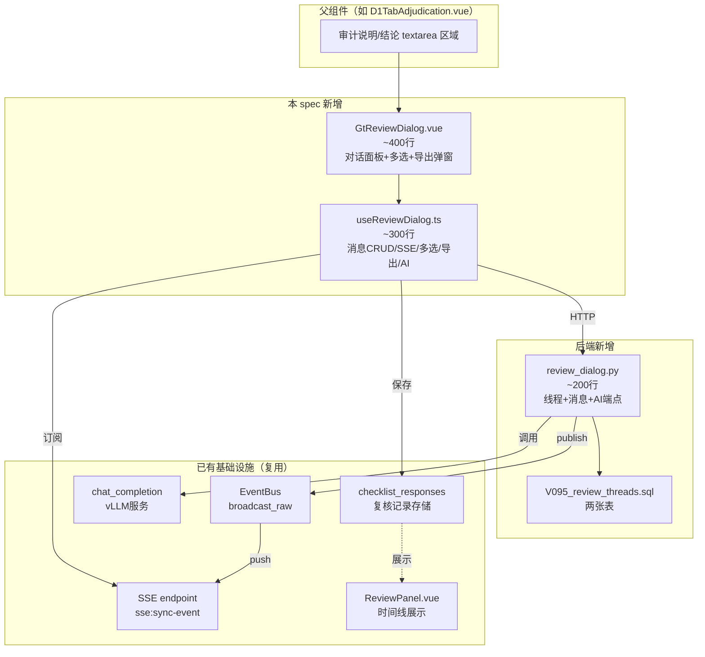
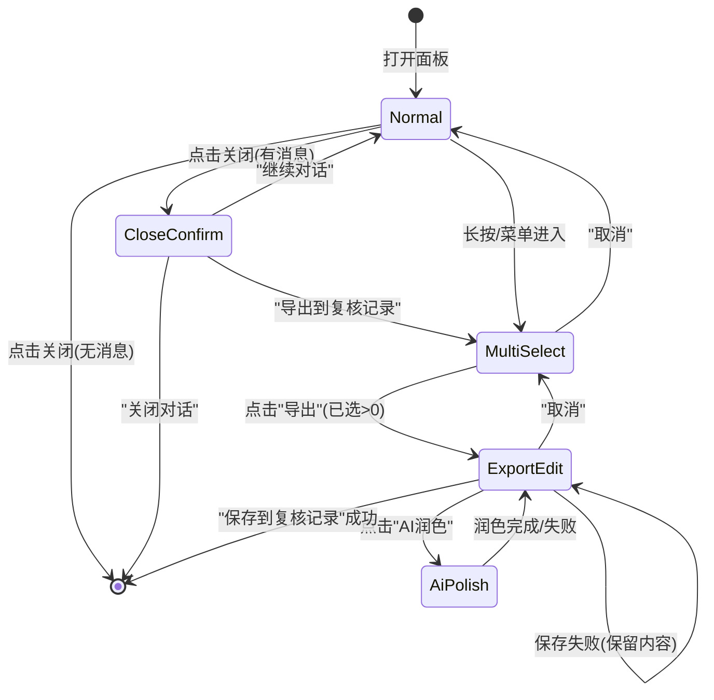

# Design Document: 通用审计复核对话组件 (GtReviewDialog)

## Overview

为所有 D~N 循环底稿的"审计说明"和"审计结论"区域提供嵌入式即时通讯对话面板。组件采用微信聊天交互模式，支持审计助理与复核人之间围绕底稿特定区域的实时对话，并集成 AI 生成辅助、多选导出到复核记录等完整工作流。

核心设计目标：
- 通用性：通过 Props 接口与任意底稿类型解耦，所有 D~N 底稿审计说明/结论区复用
- 实时性：SSE 推送 + 乐观更新，对话体验接近即时通讯
- 完整工作流：对话 → 多选 → AI 润色 → 导出复核记录，闭环
- 权限分层：编制人+复核人可写，质控+EQCR 只读
- 与现有体系打通：导出内容写入 checklist_responses，ReviewPanel 时间线可追溯

## Architecture

### 组件依赖关系



### 状态机：多选导出流程



### 文件结构

```
audit-platform/frontend/src/
├── components/collaboration/
│   └── GtReviewDialog.vue              # 新增：复核对话面板组件（~400行）
├── composables/
│   ├── useReviewDialog.ts              # 新增：复核对话逻辑composable（~300行）
│   └── useReviewDialogProvider.ts      # 新增：全局注入 Provider（~80行）
├── directives/
│   └── vReviewContext.ts               # 新增：右键菜单指令（~60行）

backend/
├── app/routers/
│   └── review_dialog.py                # 新增：复核对话路由（~200行）
├── migrations/
│   └── V095__review_threads.sql        # 新增：review_threads + review_messages 表
```

### 全局激活机制设计

```typescript
// useReviewDialogProvider.ts — 在 App.vue 或 WorkpaperEditor.vue 层 provide
// 任何子组件都可以 inject 后调用 openReviewDialog

export interface ReviewDialogActivation {
  wpId: string
  sectionId: string
  sectionLabel: string
  relatedData?: Record<string, unknown>
}

export function useReviewDialogProvider() {
  const isOpen = ref(false)
  const activationParams = ref<ReviewDialogActivation | null>(null)

  function openReviewDialog(params: ReviewDialogActivation): void {
    activationParams.value = params
    isOpen.value = true
  }

  function closeReviewDialog(): void {
    isOpen.value = false
    activationParams.value = null
  }

  // provide to children
  provide('reviewDialog', { openReviewDialog, closeReviewDialog, isOpen, activationParams })

  return { isOpen, activationParams, openReviewDialog, closeReviewDialog }
}

// 子组件中使用：
// const { openReviewDialog } = inject('reviewDialog')
// openReviewDialog({ wpId, sectionId: 'D1-adj-bank-current', sectionLabel: '银行承兑汇票-期末审定数', relatedData: {...} })
```

### 右键菜单集成

```typescript
// el-table 单元格右键示例（D1TabAdjudication.vue）：
// <el-table @cell-contextmenu="onCellContextMenu">
//
// function onCellContextMenu(row, column, cell, event) {
//   event.preventDefault()
//   showContextMenu(event, [
//     { label: '📝 发起复核对话', handler: () => {
//       openReviewDialog({
//         wpId: props.wpId,
//         sectionId: `D1-adj-${row.rowKey}-${column.property}`,
//         sectionLabel: `${row.label} - ${column.label}: ${fmtAmount(row[column.property])}`,
//         relatedData: { cellValue: row[column.property], cellLabel: column.label, priorValue: row.priorAudited }
//       })
//     }}
//   ])
// }
```

### 活跃线程标记

底稿渲染时，通过一次 `GET /api/review-threads/active?wp_id={wpId}` 批量查询当前底稿的所有活跃线程列表（含 section_id + has_unread），前端在对应位置渲染小圆点标记（蓝色=有对话，红色=有未读）。

## Components and Interfaces

### 1. TypeScript 接口定义

```typescript
// ============ 消息与线程类型 ============

export type SectionId = string  // 任意字符串：'audit-note' | 'audit-conclusion' | 'D1-adj-bank-current' | 'D1-cat-row-3' | ...
export type MessageType = 'text' | 'system' | 'quote'  // quote = 带引用数据的消息
export type ThreadStatus = 'open' | 'closed'
export type SenderRole = '审计助理' | '现场经理' | '业务合伙人' | '质量控制复核合伙人' | 'EQCR技术复核人'

export interface ReviewMessage {
  id: string
  thread_id: string
  sender_id: string
  sender_name: string
  sender_role: SenderRole
  content: string
  message_type: MessageType
  created_at: string          // ISO datetime
  // 前端本地状态
  _status?: 'sending' | 'sent' | 'failed'
  _tempId?: string            // 乐观更新临时ID
}

export interface ReviewThread {
  id: string
  project_id: string
  wp_id: string
  section_id: SectionId
  thread_key: string          // `{wp_id}:{section_id}`
  status: ThreadStatus
  created_by: string
  created_at: string
  updated_at: string
  messages: ReviewMessage[]
}

// ============ Props 接口 ============

export interface GtReviewDialogProps {
  wpId: string
  sectionId: string               // 任意字符串标识，如 'audit-note'、'D1-adj-bank-current'、'D1-cat-row-3'
  sectionLabel?: string           // 显示标题，如 "银行承兑汇票 - 期末审定数: ¥1,234,567"
  currentUser: {
    id: string
    name: string
    role: SenderRole
  }
  relatedData?: {
    wpCode?: string
    wpTitle?: string
    auditedData?: Record<string, unknown>   // 审定表变动context
    projectId?: string
    cellValue?: string | number             // 单元格级：当前值
    cellLabel?: string                      // 单元格级：字段名
    priorValue?: string | number            // 单元格级：上期值
    selectedText?: string                   // 选中文本引用
  }
}

// ============ Composable 返回接口 ============

export interface UseReviewDialogReturn {
  // 面板状态
  isOpen: Ref<boolean>
  isLoading: Ref<boolean>
  dialogTitle: ComputedRef<string>

  // 消息列表
  messages: Ref<ReviewMessage[]>
  threadId: Ref<string | null>
  threadStatus: Ref<ThreadStatus>

  // 多选模式
  isMultiSelectMode: Ref<boolean>
  selectedIds: Ref<Set<string>>
  selectedCount: ComputedRef<number>
  canExport: ComputedRef<boolean>

  // 导出编辑
  isExportDialogOpen: Ref<boolean>
  exportText: Ref<string>
  isAiPolishing: Ref<boolean>

  // AI 生成
  isAiGenerating: Ref<boolean>

  // 权限
  canWrite: ComputedRef<boolean>
  canRead: ComputedRef<boolean>

  // 未读
  unreadCount: Ref<number>

  // 关闭确认
  isCloseConfirmOpen: Ref<boolean>

  // 方法
  openDialog: () => Promise<void>
  closeDialog: () => void
  sendMessage: (content: string) => Promise<void>
  retryMessage: (tempId: string) => Promise<void>
  enterSelectMode: () => void
  exitSelectMode: () => void
  toggleSelect: (msgId: string) => void
  shiftSelect: (msgId: string) => void
  selectAll: () => void
  exportSelected: () => void           // 打开导出编辑弹窗
  aiPolish: () => Promise<void>        // AI 润色导出文本
  saveToReviewRecord: () => Promise<void>
  aiGenerate: (targetTextarea: Ref<string>) => Promise<void>
  handleClose: () => void              // 关闭前确认逻辑
  confirmClose: () => void             // 确认关闭
  confirmContinue: () => void          // 继续对话
  confirmExport: () => void            // 从确认弹窗进入多选
}
```

### 2. 后端 API 端点签名

```python
# ============ review_dialog.py (~200行) ============
# 注册到 router_registry/collaboration.py §125

router = APIRouter(prefix="/api", tags=["review-dialog"])

# --- 线程管理 ---

@router.get("/review-threads")
async def get_or_create_thread(
    wp_id: str,
    section_id: str,  # 'audit-note' | 'audit-conclusion'
    db: AsyncSession = Depends(get_db),
    current_user: User = Depends(get_current_user),
) -> ReviewThreadResponse:
    """获取线程（含消息列表）。若不存在则自动创建。"""

@router.post("/review-threads/{thread_id}/messages")
async def create_message(
    thread_id: str,
    body: CreateMessageRequest,
    db: AsyncSession = Depends(get_db),
    current_user: User = Depends(get_current_user),
) -> ReviewMessageResponse:
    """发送消息。成功后 broadcast_raw('review_message.created', ...)"""

# --- AI 生成 ---

@router.post("/workpapers/{wp_id}/review-dialog/ai-generate")
async def ai_generate_review_text(
    wp_id: str,
    body: AiGenerateRequest,
    db: AsyncSession = Depends(get_db),
    current_user: User = Depends(get_current_user),
) -> AiGenerateResponse:
    """AI 生成审计说明/结论文本。复用 chat_completion。"""

# --- Pydantic Models ---

class CreateMessageRequest(BaseModel):
    content: str
    message_type: str = "text"  # text | system

class AiGenerateRequest(BaseModel):
    section_id: str             # 'audit-note' | 'audit-conclusion'
    related_data: dict = {}     # 审定表变动 context
    existing_content: str = ""  # 当前 textarea 已有内容

class ReviewMessageResponse(BaseModel):
    id: str
    thread_id: str
    sender_id: str
    sender_name: str
    sender_role: str
    content: str
    message_type: str
    created_at: str

class ReviewThreadResponse(BaseModel):
    id: str
    thread_key: str
    status: str
    messages: list[ReviewMessageResponse]
```

### 3. SSE 事件流设计

```python
# 消息创建后，在 create_message 端点中：
from app.services.event_bus import event_bus

event_bus.broadcast_raw(
    "review_message.created",
    {
        "project_id": str(project_id),
        "thread_id": str(thread_id),
        "message": {
            "id": str(msg.id),
            "sender_id": str(msg.sender_id),
            "sender_name": sender_name,
            "sender_role": sender_role,
            "content": msg.content,
            "message_type": msg.message_type,
            "created_at": msg.created_at.isoformat(),
        },
    },
)
```

前端订阅：
```typescript
// useReviewDialog.ts 中
eventBus.on('sse:sync-event', (payload) => {
  if (payload.event_type !== 'review_message.created') return
  if (payload.extra?.thread_id !== threadId.value) return
  // 排除自己发送的（已乐观更新）
  if (payload.extra?.message?.sender_id === currentUser.id) return
  // 追加到消息列表
  messages.value.push(payload.extra.message)
})
```

### 4. 权限控制逻辑

```typescript
const WRITE_ROLES: SenderRole[] = ['审计助理', '现场经理', '业务合伙人']
const READ_ONLY_ROLES: SenderRole[] = ['质量控制复核合伙人', 'EQCR技术复核人']

const canWrite = computed(() => WRITE_ROLES.includes(currentUser.role))
const canRead = computed(() => [...WRITE_ROLES, ...READ_ONLY_ROLES].includes(currentUser.role))
```

## Data Models

### 后端 SQLAlchemy 模型 + 迁移 SQL

```sql
-- V095__review_threads.sql

CREATE TABLE IF NOT EXISTS review_threads (
    id UUID PRIMARY KEY DEFAULT gen_random_uuid(),
    project_id UUID NOT NULL REFERENCES projects(id),
    wp_id UUID NOT NULL REFERENCES working_paper(id),
    section_id VARCHAR(50) NOT NULL,          -- 'audit-note' | 'audit-conclusion'
    thread_key VARCHAR(200) NOT NULL,         -- '{wp_id}:{section_id}'
    status VARCHAR(20) NOT NULL DEFAULT 'open',  -- open | closed
    created_by UUID NOT NULL REFERENCES users(id),
    created_at TIMESTAMP NOT NULL DEFAULT now(),
    updated_at TIMESTAMP NOT NULL DEFAULT now()
);

CREATE UNIQUE INDEX IF NOT EXISTS uix_review_threads_thread_key
    ON review_threads(thread_key);

CREATE INDEX IF NOT EXISTS ix_review_threads_wp_id
    ON review_threads(wp_id);

CREATE TABLE IF NOT EXISTS review_messages (
    id UUID PRIMARY KEY DEFAULT gen_random_uuid(),
    thread_id UUID NOT NULL REFERENCES review_threads(id) ON DELETE CASCADE,
    sender_id UUID NOT NULL REFERENCES users(id),
    sender_role VARCHAR(50) NOT NULL,         -- '审计助理'|'现场经理'|'业务合伙人'|...
    content TEXT NOT NULL,
    message_type VARCHAR(20) NOT NULL DEFAULT 'text',  -- text | system
    created_at TIMESTAMP NOT NULL DEFAULT now()
);

CREATE INDEX IF NOT EXISTS ix_review_messages_thread_id
    ON review_messages(thread_id);

CREATE INDEX IF NOT EXISTS ix_review_messages_created_at
    ON review_messages(thread_id, created_at);
```

### 复核记录存储格式（checklist_responses）

导出到复核记录时写入 `checklist_responses` 表：

| 字段 | 值 |
|------|-----|
| wp_id | 当前底稿 wp_id |
| item_id | `{wp_code}-review-record-{timestamp}` (如 `D1-1-review-record-1719648000000`) |
| value | 编辑后的导出文本内容 |
| remark | JSON 元数据：`{"exported_at": "ISO", "exported_by": "user_id", "thread_id": "xxx", "message_ids": ["id1","id2"]}` |

### AI 生成 System Prompt

```python
_REVIEW_AI_SYSTEM_PROMPT = """你是一位资深注册会计师（CPA），正在协助编制审计底稿。
根据提供的审定表数据变动信息，生成专业的{section_type}文本。

要求：
- 语言：中文，审计专业用语
- 风格：客观陈述事实，引用具体数据
- 如为"审计说明"：描述审计程序执行情况和发现
- 如为"审计结论"：给出审计结论和建议
- 引用审定表数据时使用具体数字
- 不超过300字"""

_POLISH_SYSTEM_PROMPT = """你是一位资深注册会计师（CPA），请将以下复核对话内容润色为正式的审计复核记录。

要求：
- 保留关键信息和数据
- 使用审计专业用语
- 去除口语化表达
- 保持逻辑清晰、表述简洁
- 格式为连续段落，不使用对话格式"""
```

### thread_key 构建规则

```typescript
function buildThreadKey(wpId: string, sectionId: SectionId): string {
  return `${wpId}:${sectionId}`
}
```

唯一索引保证每个底稿每个区域最多一个活跃线程。前端通过 `GET /api/review-threads?wp_id=&section_id=` 获取或自动创建。

## Correctness Properties

*A property is a characteristic or behavior that should hold true across all valid executions of a system—essentially, a formal statement about what the system should do. Properties serve as the bridge between human-readable specifications and machine-verifiable correctness guarantees.*

### Property 1: thread_key 构建唯一性

*For any* wpId (UUID string) 和 sectionId ('audit-note' | 'audit-conclusion')，`buildThreadKey(wpId, sectionId)` 的结果应等于 `${wpId}:${sectionId}`，且对于不同的 (wpId, sectionId) 对应不同的 thread_key。

**Validates: Requirements 1.3, 9.3**

### Property 2: 消息气泡对齐方向由发送者决定

*For any* ReviewMessage 和 currentUser，当 message.sender_id === currentUser.id 时 alignment='right'，否则 alignment='left'。且渲染结果必须包含 sender_name、content、formatted time (HH:mm)、sender_role。

**Validates: Requirements 1.4, 1.5**

### Property 3: 乐观更新保持消息列表长度不变量

*For any* 消息列表（长度 N）和有效的消息内容（非空字符串），调用 sendMessage 后本地消息列表长度应为 N+1，且最后一条消息的 content 等于发送内容。

**Validates: Requirements 2.1, 2.2**

### Property 4: SSE 事件按 thread_id 过滤

*For any* SSE 事件 payload，当且仅当 payload.thread_id === 当前打开的 threadId 且 payload.sender_id !== currentUser.id 时，消息才追加到本地列表。不匹配的事件不影响列表。

**Validates: Requirements 2.4, 10.3**

### Property 5: 空消息列表跳过关闭确认

*For any* GtReviewDialog 状态，当 messages.length === 0 时调用 handleClose 应直接关闭面板（isOpen=false），不弹出确认弹窗（isCloseConfirmOpen 保持 false）。

**Validates: Requirements 3.6**

### Property 6: 选择状态切换为自身逆操作

*For any* 消息 ID 和当前 selectedIds 集合，执行 toggleSelect(id) 两次后 selectedIds 应回到初始状态（toggle 是 involution）。

**Validates: Requirements 4.3**

### Property 7: Shift 范围选择的正确性

*For any* 消息列表（长度 N ≥ 2）、lastClickIndex (0 ≤ i < N) 和 currentClickIndex (0 ≤ j < N, j ≠ i)，shiftSelect 应选中 [min(i,j), max(i,j)] 闭区间内的所有消息 ID。

**Validates: Requirements 4.7**

### Property 8: 导出文本按时间顺序格式化

*For any* 选中消息列表（按 created_at 排序），导出初始文本应为每条消息按 `[{sender_role} {HH:mm}] {content}` 格式拼接，且顺序与 created_at 升序一致。

**Validates: Requirements 5.2**

### Property 9: API 失败时状态保持不变

*For any* 导出编辑状态（exportText 有值），当 AI 润色或保存请求失败时，exportText 值应保持不变，且 isExportDialogOpen 保持 true。

**Validates: Requirements 5.9, 6.5**

### Property 10: 角色到权限的确定映射

*For any* 用户角色，canWrite 和 canRead 的值由以下规则唯一确定：
- 审计助理/现场经理/业务合伙人 → canWrite=true, canRead=true
- 质量控制复核合伙人/EQCR技术复核人 → canWrite=false, canRead=true
- 其他 → canWrite=false, canRead=false

**Validates: Requirements 8.1, 8.2, 8.3, 8.4**

### Property 11: 关闭线程拒绝新消息

*For any* 状态为 closed 的 ReviewThread，调用 POST /messages 应返回 HTTP 400 且消息不被持久化（messages 表无新增行）。

**Validates: Requirements 9.7**

### Property 12: 复核记录 item_id 格式合规

*For any* wpCode (string) 和 timestamp (number)，生成的 item_id 应匹配正则 `^[A-Z0-9-]+-review-record-\d{13}$`。

**Validates: Requirements 6.2**

### Property 13: 复核记录元数据完整性

*For any* 成功的导出操作，保存到 checklist_responses 的 remark JSON 必须包含 exported_at (ISO string)、exported_by (UUID string)、thread_id (UUID string)、message_ids (string[]) 四个字段，且 message_ids 与选中集合一致。

**Validates: Requirements 6.6**

### Property 14: 未读计数在面板关闭时单调递增

*For any* 序列的 SSE review_message.created 事件（thread_id 匹配且面板未打开），每收到一条事件 unreadCount 增加 1。打开面板后 unreadCount 重置为 0。

**Validates: Requirements 10.4**

## Error Handling

| 场景 | 处理方式 |
|------|---------|
| 消息发送失败 (网络/500) | 消息标记 `_status='failed'`，气泡旁显示红色 ❗+ "重发"按钮；不从列表移除 |
| AI 生成/润色服务不可用 (503) | ElMessage.warning "AI服务暂时不可用，请手动填写"；保留原内容不清空 |
| AI 润色超时 (>30s) | 自动取消请求；isAiPolishing=false；提示"润色超时，请重试" |
| 线程加载失败 (404/500) | ElMessage.error "加载对话失败"；面板显示空态+重试按钮 |
| 保存复核记录失败 | ElMessage.error "保存失败，请重试"；保留 exportText 不关闭弹窗 |
| SSE 连接断开 | 依赖已有 useSSEDegradation 机制；对话面板显示"连接中断"提示条 |
| 权限不足 (403) | 前端 canWrite/canRead 已守卫；后端额外校验返回 403 |
| 线程已关闭发送消息 | 后端返回 400；前端提示"该对话已关闭，无法发送新消息" |
| thread_key 冲突 (并发创建) | 后端 ON CONFLICT DO NOTHING + 二次查询返回已有线程 |
| 导出文本为空点击保存 | 前端禁用保存按钮（exportText.trim().length === 0） |

## Testing Strategy

### 单元测试（vitest）

- **useReviewDialog.ts 核心逻辑**：
  - buildThreadKey 构建
  - 消息对齐方向判断
  - 权限映射 (canWrite/canRead)
  - 多选切换 (toggleSelect/shiftSelect/selectAll)
  - 导出文本格式化
  - item_id 生成
  - SSE 事件过滤逻辑
  - 乐观更新 + 失败回滚
  - unreadCount 增减逻辑
  - 关闭确认条件判断

- **GtReviewDialog.vue 组件测试**：
  - Props 传入验证
  - 只读模式隐藏输入区
  - 多选模式 UI 状态
  - Enter 发送 / Shift+Enter 换行

### Property-Based Tests（fast-check）

| Property | 生成器 | 最少迭代 |
|----------|--------|---------|
| P1 thread_key 唯一性 | `fc.uuid()` + `fc.constantFrom('audit-note','audit-conclusion')` | 100 |
| P2 消息对齐 | 自定义 ReviewMessage 生成器 + `fc.uuid()` (currentUserId) | 100 |
| P3 乐观更新 | `fc.array(ReviewMessage生成器)` + `fc.string({minLength:1})` | 100 |
| P4 SSE 过滤 | `fc.uuid()` ×3 (threadId, eventThreadId, senderId) | 100 |
| P5 空列表跳过确认 | `fc.array(ReviewMessage生成器, {minLength:0, maxLength:0})` | 100 |
| P6 toggle 自逆 | `fc.uuid()` + `fc.set(fc.uuid())` | 100 |
| P7 shift 范围 | `fc.nat({max:49})` ×2 + `fc.array(fc.uuid(), {minLength:2, maxLength:50})` | 100 |
| P8 导出格式化 | `fc.array(ReviewMessage生成器, {minLength:1, maxLength:20})` | 100 |
| P9 失败状态保持 | `fc.string({minLength:1})` (exportText) | 100 |
| P10 角色权限 | `fc.constantFrom(...ALL_ROLES)` | 100 |
| P11 关闭线程拒绝 | 后端集成测试（hypothesis, max_examples=5） | 5 |
| P12 item_id 格式 | `fc.string({minLength:1,maxLength:10}).filter(alphanumDash)` + `fc.nat()` | 100 |
| P13 元数据完整 | 自定义导出参数生成器 | 100 |
| P14 未读计数 | `fc.array(fc.boolean(), {minLength:1, maxLength:20})` (panel open/closed序列) | 100 |

### 后端集成测试（hypothesis + pytest）

- `test_create_thread_unique_constraint`：同 thread_key 二次创建返回已有线程
- `test_closed_thread_rejects_message`：closed 线程发消息返回 400
- `test_message_creates_sse_event`：消息创建后 broadcast_raw 被调用
- `test_ai_generate_returns_text`：AI 端点正常返回生成文本
- `test_permission_guard`：无权限用户返回 403

### 测试标签格式

```typescript
// Feature: audit-review-dialog, Property {N}: {title}
// 例:
// Feature: audit-review-dialog, Property 6: toggle select is involution
```

### PBT 库选择

- 前端：**fast-check**（已在项目中使用）
- 后端：**hypothesis**（已在项目中使用，max_examples=5）
