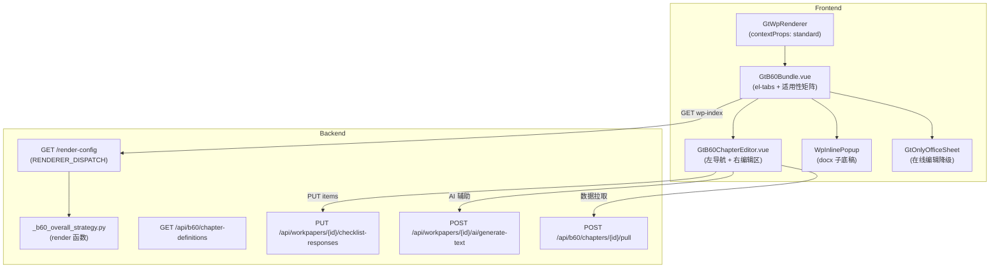

# Design Document: B60 Dedicated Component

## Overview

将 B60 系列底稿（总体审计策略及具体审计计划）从 `word-template` componentType 迁移为专用 HTML 组件，参照 A17 Bundle 架构模式（GtA17Bundle + GtA17Summary）。

核心交付物：
- **GtB60Bundle.vue** — 顶层聚合组件，el-tabs 管理子底稿 + 适用性矩阵
- **GtB60ChapterEditor.vue** — B60 主文档章节编辑器（左侧导航 + 右侧富文本）
- **useB60FormData.ts** — 章节内容持久化 composable（800ms 防抖 + checklist_responses）
- **useB60Applicability.ts** — 适用性矩阵状态管理 composable
- **_b60_overall_strategy.py** — 后端 render 策略
- **b60_chapter_definitions.json** — 静态章节定义文件
- **b60_chapters.py** — 章节定义 API 路由

设计决策：
1. **A17 Bundle 模式复用** — TABS 固定顺序定义 + wpIdMap 动态可见性 + defineAsyncComponent 懒加载，与 GtA17Bundle 完全同构
2. **章节编辑器独立组件** — 非内嵌在 Bundle 中，便于复用和测试
3. **checklist_responses 持久化** — 章节内容存 remark 字段（item_id = chapter_id），适用性存 `B60-applicability` 单条 JSON
4. **contextProps: 'standard'** — 复用 GtWpRenderer 自动透传 wp-id/project-id/wp-code/year

## Architecture



## Components and Interfaces

### 1. GtB60Bundle.vue（顶层聚合组件）

**Props:**
```typescript
interface GtB60BundleProps {
  wpId: string
  projectId: string
  sheetName?: string
  readonly?: boolean
  year?: number
}
```

**职责：**
- 通过 `GET /api/workpapers/{wpId}/wp-index` 构建 wpIdMap（wp_code → wp_id）
- 渲染适用性矩阵面板（8 个子底稿勾选）
- 管理 Tab 导航（固定顺序 10 个 Tab，动态可见性）
- 提供 el-segmented 模式切换（章节编辑 / 在线编辑）
- 挂载 GtWpVersionTrail + GtWpReviewDialogHost
- provide('openReviewDialog') 供子组件 inject

**Tab 定义数据结构：**
```typescript
interface B60TabDef {
  id: string          // Tab 唯一标识
  label: string       // Tab 显示名称
  wpCode: string      // 对应子底稿编码
  kind: 'chapter-editor' | 'navigate-sheet' | 'docx-inline'
}

const B60_TABS: B60TabDef[] = [
  { id: 'B60', label: 'B60 审计策略', wpCode: 'B60', kind: 'chapter-editor' },
  { id: 'B60-1', label: 'B60-1 工时表', wpCode: 'B60-1', kind: 'navigate-sheet' },
  { id: 'B60-2-1', label: 'B60-2-1 IT复杂性判断表', wpCode: 'B60-2-1', kind: 'docx-inline' },
  { id: 'B60-2-2', label: 'B60-2-2 IT审计进场前通知表', wpCode: 'B60-2-2', kind: 'docx-inline' },
  { id: 'B60-2-3', label: 'B60-2-3 IT审计计划备忘录', wpCode: 'B60-2-3', kind: 'docx-inline' },
  { id: 'B60-3', label: 'B60-3 评估专家工作计划', wpCode: 'B60-3', kind: 'docx-inline' },
  { id: 'B60A', label: 'B60A 内控审计特殊考虑', wpCode: 'B60A', kind: 'docx-inline' },
  { id: 'B60B', label: 'B60B IPO审计特殊考虑', wpCode: 'B60B', kind: 'docx-inline' },
  { id: 'B60C', label: 'B60C 国企审计特殊考虑', wpCode: 'B60C', kind: 'docx-inline' },
  { id: 'B60D', label: 'B60D 监管机构报送', wpCode: 'B60D', kind: 'docx-inline' },
]
```

### 2. GtB60ChapterEditor.vue（章节编辑器）

**Props:**
```typescript
interface GtB60ChapterEditorProps {
  wpId: string
  projectId: string
  year?: number
  chapterDefinitions: ChapterDefinition[]
  responsesSnapshot: Record<string, { conclusion: string | null; remark: string | null }>
  projectContext: { client_name: string; audit_year: string; business_category: string; partner_name: string }
}
```

**暴露方法：**
```typescript
defineExpose({
  flushPendingSaves: () => Promise<void>  // 供模式切换时调用
})
```

### 3. useB60FormData.ts（章节持久化 composable）

```typescript
interface UseB60FormDataOptions {
  wpId: Ref<string>
  projectId: Ref<string>
  chapterDefinitions: Ref<ChapterDefinition[]>
  responsesSnapshot: Ref<Record<string, { conclusion: string | null; remark: string | null }>>
}

interface UseB60FormDataReturn {
  chapterContents: Ref<Map<string, string>>  // chapter_id → content
  saveStatus: Ref<'saved' | 'saving' | 'unsaved'>
  updateChapter: (chapterId: string, content: string) => void
  flushPendingSaves: () => Promise<void>
  consecutiveFailures: Ref<number>
}
```

**持久化规则：**
- item_id = chapter_id（如 `B60-CH-01`）
- conclusion = null
- remark = 章节内容文本
- 800ms 防抖调用 `PUT /api/workpapers/{wpId}/checklist-responses`
- 成功后调用 scheduleAutoSnapshot()

### 4. useB60Applicability.ts（适用性矩阵 composable）

```typescript
interface UseB60ApplicabilityOptions {
  wpId: Ref<string>
  responsesSnapshot: Ref<Record<string, { conclusion: string | null; remark: string | null }>>
}

interface UseB60ApplicabilityReturn {
  applicabilityMap: Ref<Record<string, boolean>>  // wp_code → 是否适用
  toggleApplicability: (wpCode: string, value: boolean) => void
  isApplicable: (wpCode: string) => boolean
}
```

**存储规则：**
- item_id = `B60-applicability`
- remark = JSON 字符串 `{"B60-2-1": true, "B60-2-2": false, ...}`
- 800ms 防抖持久化

### 5. 后端 _b60_overall_strategy.py

```python
async def render(ctx: RenderContext) -> dict | None:
    """B60 总体策略渲染.
    
    返回:
    {
        "chapter_definitions": [...],
        "responses_snapshot": {"B60-CH-01": {"conclusion": null, "remark": "..."}, ...},
        "project_context": {"client_name": "...", "audit_year": "...", ...}
    }
    """
```

**SQL 查询：**
```sql
SELECT item_id, conclusion, remark 
FROM checklist_responses 
WHERE wp_id = :wp_id 
  AND (item_id LIKE 'B60-CH-%' OR item_id = 'B60-applicability')
```

### 6. b60_chapters.py（章节定义路由）

```python
@router.get("/api/b60/chapter-definitions")
async def get_chapter_definitions(project_id: str | None = None):
    """加载静态章节定义 JSON."""
    # 当前版本统一返回完整列表，project_id 为未来预留
```

### 7. b60_data_pull.py（数据拉取路由）

```python
@router.post("/api/b60/chapters/{chapter_id}/pull")
async def pull_chapter_data(
    chapter_id: str,
    body: PullRequest,  # { project_id, wp_id }
    db: AsyncSession = Depends(get_db),
):
    """从关联底稿提取数据填入章节."""
    # 返回 { content: str, source_label: str }
```

## Data Models

### ChapterDefinition（章节定义）

```typescript
interface ChapterDefinition {
  chapter_id: string    // 格式: B60-CH-{序号}，如 B60-CH-01
  title: string         // 章节标题，最大 200 字符
  level: 1 | 2 | 3     // 层级（1=顶级分组，2=子章节，3=细分条目）
  required: boolean     // 是否必填
  hint: string          // 编制提示文本，最大 2000 字符
  data_source: {        // 关联底稿提示（可选）
    label: string       // 显示标签，如 "B50 风险评估"
    wp_code: string     // 源底稿编码
  } | null
}
```

### checklist_responses 存储约定

| item_id 模式 | conclusion | remark | 用途 |
|---|---|---|---|
| `B60-CH-{序号}` | null | 章节正文内容 | 各章节叙述文本 |
| `B60-applicability` | null | `{"B60-2-1": true, ...}` JSON | 适用性矩阵状态 |

### wpIdMap 构建规则

从 `GET /api/workpapers/{wpId}/wp-index` 返回的数组中：
- 筛选 `wp_code` 前缀匹配 `B60-` 或精确匹配 `B60A`~`B60D`
- 映射键 = `item.wp_code`，映射值 = `item.wp_id`（非 `item.id`）

### Tab 可见性推导

```
visibleTab(tab) = 
  tab.kind === 'chapter-editor'  → 恒可见
  isApplicable(tab.wpCode) === false  → 隐藏
  wpIdMap[tab.wpCode] 存在  → 可见
  otherwise  → 隐藏（显示占位提示如适用性标记为适用）
```

## Correctness Properties

*A property is a characteristic or behavior that should hold true across all valid executions of a system—essentially, a formal statement about what the system should do. Properties serve as the bridge between human-readable specifications and machine-verifiable correctness guarantees.*

### Property 1: wpIdMap 构建使用 wp_id 字段

*For any* wp-index 响应数组（包含 id 和 wp_id 两个不同字段的 item），wpIdMap 的值必须取自 `item.wp_id` 字段而非 `item.id` 字段，且键匹配规则为 wp_code 前缀 `B60-` 或精确匹配 `B60A`~`B60D`。

**Validates: Requirements 1.4**

### Property 2: Tab 可见性由 wpIdMap + 适用性状态联合推导

*For any* wpIdMap（B60 系列 wp_code 子集 → wp_id 映射）和适用性状态（8 个子底稿 boolean 映射），visibleTabs 集合满足：(1) B60 主文档 Tab 恒可见；(2) 适用性为 false 的 Tab 不可见；(3) 适用性为 true 但 wpIdMap 中无对应 wp_id 的 Tab 不可见；(4) 适用性为 true 且 wpIdMap 中有对应 wp_id 的 Tab 可见。

**Validates: Requirements 2.1, 2.2, 3.2**

### Property 3: 适用性状态序列化/反序列化往返

*For any* 适用性状态 `Record<string, boolean>`（8 个 B60 系列子底稿编码为键），序列化为 JSON 字符串后再反序列化应产生与原始状态相等的映射。缺失键默认为 true。

**Validates: Requirements 3.2, 3.3, 3.4**

### Property 4: 章节列表按 chapter_id 排序不变量

*For any* 章节定义数组，渲染后的章节顺序必须满足 `chapters[i].chapter_id < chapters[i+1].chapter_id`（字典序），即 B60-CH-01 在 B60-CH-02 之前。

**Validates: Requirements 4.4**

### Property 5: 完成指示器颜色由 remark + required 推导

*For any* 章节定义（含 required 布尔值）和对应的 remark 内容，完成指示器颜色满足：remark 非空 → 绿色；remark 为空且 required=true → 橙色；remark 为空且 required=false → 灰色。

**Validates: Requirements 5.2**

### Property 6: 章节内容持久化往返

*For any* chapter_id 和非空章节内容文本，保存后的 PUT payload 中 item_id 等于 chapter_id 且 remark 等于内容文本且 conclusion 为 null；从 responses_snapshot 加载时，以 item_id 匹配 chapter_id 将 remark 还原到对应 textarea。

**Validates: Requirements 6.1, 6.2**

### Property 7: AI 请求 context 值全部为 string 类型

*For any* 章节定义（含 hint/title）和项目上下文（含 client_name/audit_year/business_category/chapter_title），调用 AI generate-text 的 request body 中 context 对象的所有值必须为 string 类型（不含 number/null/undefined）。

**Validates: Requirements 7.2**

### Property 8: 章节元数据驱动 UI 元素渲染

*For any* 章节定义，hint 字段非空时渲染编制提示块且 hint 为空时不渲染；data_source 字段非空时渲染带入按钮且 data_source 为空时不渲染。

**Validates: Requirements 5.5, 8.1**

### Property 9: 数据拉取追加语义

*For any* 已有章节内容（含空字符串）和拉取返回的 content 字符串，最终 textarea 值应为：已有内容为空时直接设为 content；已有内容非空时为 `existingContent + '\n\n' + content`。

**Validates: Requirements 8.3**

## Error Handling

| 场景 | 处理策略 |
|------|----------|
| wp-index 查询失败/空 | 渲染空状态占位"B60 系列子底稿尚未生成"，主文档 Tab 正常编辑 |
| 章节定义 API 超时(10s)/非 2xx | 使用前端内置默认章节定义数组，顶部显示 warning |
| 章节内容 PUT 连续失败 3 次 | 停止自动重试，ElMessage.warning 提示 |
| AI 生成失败/空内容 | ElMessage.warning("AI 生成失败，请稍后重试") |
| 数据拉取 404/空 | ElMessage.info("源底稿暂无数据") |
| 子底稿渲染组件加载失败 | Tab 内 ErrorBoundary 错误提示，不影响其他 Tab |
| OnlyOffice 健康检查 unhealthy | 禁用"在线编辑"选项，el-tooltip 提示 |
| render 策略 SQL 异常 | 记录 warning 日志，返回空 responses_snapshot |

## Testing Strategy

### Property-Based Tests (Hypothesis, min 100 iterations)

使用 Python Hypothesis 框架对后端纯函数 + TypeScript fast-check 对前端 composable 进行属性测试。

**后端 PBT（backend/tests/test_b60_properties.py）:**
- Property 1: wpIdMap 构建（生成随机 wp_index items，验证 wp_id 使用）
- Property 3: 适用性 JSON 往返（生成随机 boolean dict）
- Property 4: 章节排序（生成乱序章节数组，验证排序后字典序）
- Property 6: 持久化往返（生成随机 chapter_id + content）
- Property 7: AI context 类型安全（生成随机项目上下文含数字/None，验证转换后全 str）

**前端 PBT（vitest + fast-check）:**
- Property 2: Tab 可见性推导（生成随机 wpIdMap + applicability）
- Property 5: 完成指示器（生成随机 remark + required）
- Property 8: 元数据 UI 推导（生成随机 hint/data_source）
- Property 9: 追加语义（生成随机 existing + pulled content）

**Property Test Configuration:**
- 最低 100 iterations
- 每个测试注释引用 design property 编号
- Tag: `Feature: b60-dedicated-component, Property {N}: {text}`

### Unit Tests (Example-Based)

- 注册表包含 `b60-strategy` 条目（contextProps: 'standard'）
- wp_code_overrides.json 包含全部 10 个 B60 编码
- RENDERER_DISPATCH 包含 `b60-strategy` 键
- Tab 固定顺序验证
- 保存状态指示器状态机（saved → unsaved → saving → saved/error）
- 模式切换 flushPendingSaves 调用顺序
- 版本链 scheduleAutoSnapshot 触发

### Integration Tests

- render 策略返回正确结构（chapter_definitions + responses_snapshot + project_context）
- 章节定义 API 返回 200 + JSON 数组
- checklist_responses PUT/GET 往返
- 数据拉取端点功能验证

### Playwright E2E

- B60 底稿打开渲染章节编辑器
- Tab 切换 + 适用性矩阵勾选/取消
- 章节编辑 → 保存 → 刷新 → 回显
- AI 辅助按钮点击（降级测试）
- 模式切换（HTML ↔ OnlyOffice）
