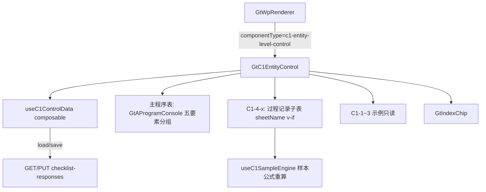

# Design Document

> C1 企业层面控制测试专属组件

## Overview

将 C1 企业层面控制测试（12 sheet）从通用 `d-form-table` 升级为专属组件 `GtC1EntityControl.vue`，对齐 D4 标准：sheetName v-if 分发 + 复用 GtAProgramConsole 渲染五要素分组程序表 + 财报内控过程记录子表（含样本公式）+ GtIndexChip + checklist_responses 持久化（item_id 前缀 `C1-`）。零新表、零新端点。

## Architecture



## Components and Interfaces

### GtC1EntityControl.vue

```typescript
interface Props {
  wpId: string
  projectId: string
  wpCode: string      // C1
  year: number
  readonly?: boolean
  sheetName?: string  // v-if 分发：program / C1-1 / C1-4 / C1-4-4 ...
}
```

### sheet 分发表

| sheetName | 渲染 |
|-----------|------|
| program（默认） | 主程序表五要素分组（GtAProgramConsole） |
| C1-1 / C1-2 / C1-3 | 示例只读 |
| C1-4 / C1-4-1~C1-4-6 | 财报内控过程记录子表 |

### 程序分组配置（源模板九段落地，Phase0 实测修正）

> 🔴 Phase0 核对发现：源模板主程序表**不是 5 段 COSO 五要素，而是九段（一~九）**，且无独立「控制活动」段。COSO 五要素保留为方法论叙述，程序表分组按源模板九段落地。详见 phase0-notes.md 第 3 节。

```typescript
// 九段 slug（供 item_id 与前端 key 使用）
type C1SectionSlug = 'ce' | 'ra' | 'mo' | 'bu' | 'ic' | 'fr' | 'el' | 'ye' | 'rp'
interface ProgramGroup { section: C1SectionSlug; title: string; startRow: number; endRow: number; steps: ProgramStep[]; defaultApplicable: boolean }
// 主程序表按 sheet 中「一~九」中文数字标题行切分为九组
// ce=控制环境(6-56) ra=风险评估(57-66) mo=监督(67-76) bu=监控业务单元(77-87,集团审计适用)
// ic=信息与沟通(88-93) fr=财务报告(94-120) el=对业务层面控制的影响(121-125)
// ye=年终程序(126-127) rp=关联方相关内容(128-136,有关联方交易适用)
// bu/rp 支持整段适用性裁剪
```

### useC1SampleEngine（纯函数）

```typescript
// C1-4-4 会计分录授权测试样本：借贷方勾稽
export interface JeSample { date: string; account: string; ref: string; desc: string; debit: number; credit: number }
export function calcSampleBalance(samples: JeSample[]): { debitTotal: number; creditTotal: number; balanced: boolean }
```

### 后端

- wp_code_overrides.json：`"C1": "c1-entity-level-control"`；C1-1~C1-4-6 子 sheet 由主组件内部分发（不单列目录）
- VALID_COMPONENT_TYPES：新增 `c1-entity-level-control`
- htmlRendererRegistry.ts：新增成员 + defineAsyncComponent + contextProps standard
- RENDERER_DISPATCH：注册 C1 render 策略
- 复用 GET/PUT `/api/workpapers/{wp_id}/checklist-responses`（零新端点）

## Data Models

### item_id 命名（checklist_responses，前缀 C1-）

| 区域 | item_id 模式 | conclusion / remark |
|------|-------------|---------------------|
| 程序适用性 | `C1-{element}-{n}-applicable` | Y/N / 不适用理由 |
| 程序结果说明 | `C1-{element}-{n}-result` | — / 说明文本 |
| 过程记录字段 | `C1-4-{k}-{field}` | — / 文本 |
| 样本明细 | `C1-4-4-sample-{s}-{col}` | — / 值 |

### 数据流

```
点击 C1 → GtWpRenderer(c1-entity-level-control) → GtC1EntityControl(sheetName v-if)
  onMounted: GET checklist-responses(C1-*) → 还原五要素分组适用性/结果 + 过程记录 + 样本
  编辑: 适用性/结论即时保存；文本 debounce 2s → PUT
  样本变更 → useC1SampleEngine 重算借贷勾稽（只读公式列）
```

## Correctness Properties

*属性是系统在所有合法执行路径下都应保持为真的行为声明。*

### Property 1: 组件注册完整性

*For any* C1 底稿，wp_code_overrides 映射为 `c1-entity-level-control` 且在 htmlRendererRegistry 与 VALID_COMPONENT_TYPES 均已注册。

**Validates: Requirements 1.1, 1.2, 1.3**

### Property 2: 九段分组完整性

*For any* 主程序表数据，每个程序步骤应被唯一归入九段之一（ce/ra/mo/bu/ic/fr/el/ye/rp）；分组步骤总数应等于程序步骤总数（无遗漏无重复）。

**Validates: Requirements 2.1**

### Property 3: 适用性进度排除不适用项

*For any* 程序步骤集合，某要素组完成进度的分母应等于该组「适用」步骤数（排除不适用），且不适用步骤必有理由方可保存。

**Validates: Requirements 3.2, 3.3**

### Property 4: 样本借贷勾稽正确性

*For any* JeSample 数组，`calcSampleBalance` 的 debitTotal = Σdebit，creditTotal = Σcredit，balanced = (debitTotal == creditTotal)（浮点误差内）。

**Validates: Requirements 4.4**

### Property 5: 数据持久化往返一致性

*For any* 有效的 C1- 前缀数据，PUT 保存后 GET 加载，所有字段值应与保存前一致。

**Validates: Requirements 7.1, 7.4**

### Property 6: readonly 禁编辑

*For any* readonly=true，所有输入单元格与样本行增删被禁止，仅浏览与跳转可用。

**Validates: Requirements 8.1**

## Error Handling

| 场景 | 处理 |
|------|------|
| GET/PUT 失败 | 提示错误，保留本地编辑 |
| 程序行为空 | GtGridSheet 只读兜底 |
| 不适用无理由 | 拒绝保存，提示填写理由 |
| 引用底稿不存在 | GtIndexChip 灰态 |
| sheetName 无效 | 回退 program |

## Testing Strategy

### 属性测试（PBT）

fast-check（前端）+ hypothesis（后端往返），每 property ≥100 次。Tag：`Feature: c1-entity-level-control, Property {N}: {title}`。

| Property | 生成器 |
|----------|--------|
| P1 注册 | 固定 C1 遍历 overrides + registry |
| P2 五要素分组 | `fc.array(fc.record({element: fc.constantFrom(...), row: fc.nat()}))` |
| P3 进度排除 | `fc.array(fc.record({applicable: fc.boolean()}))` |
| P4 样本勾稽 | `fc.array(fc.record({debit: fc.float(), credit: fc.float()}))` |
| P5 往返 | hypothesis C1- item_id + conclusion + remark |
| P6 readonly | `fc.boolean()` |

### 单元/集成测试

- 注册表 + VALID_COMPONENT_TYPES + RENDERER_DISPATCH 覆盖
- 五要素分组切分正确
- 适用性裁剪 + 理由校验
- C1-4-4 样本借贷勾稽重算
- sheetName v-if 分发各 sheet
- 只读禁编辑；Playwright 实测

## 交互增强设计（点选/附件OCR/回写）

### 点选控件映射

| 字段 | 控件 |
|------|------|
| 是否适用 | el-switch / 单选点选 |
| 测试方法 | el-checkbox-group（询问/观察/检查/重新执行）|
| 测试结论 | el-select 下拉 |
| 控制频率 | el-select 下拉 |
| 长文本（说明/理由）| autosize textarea + AI 按钮 |

### 附件上传 + OCR（复用行级 OCR 标准）

```typescript
// 复用 useRowAttachment + POST /d4/contract-ocr（或凭证 OCR 端点）
async function onUploadSample(file, sampleRow) {
  const ocr = await api.post('/d4/contract-ocr', form)   // http/axios
  const merged = await ElMessageBox.confirm(preview(ocr)) // 确认后 merge
  if (merged) mergeSampleRow(sampleRow, ocr)              // 不直接覆盖
}
// 附件与 item_id `C1-4-4-sample-{s}-attach` 关联持久化
```

### 回写与联动

```
C1 整体结论变更 → EventBus publish（企业层面控制结论）→ B50 订阅
识别缺陷 → GtIndexChip 一键跳转 A14 + 带入缺陷摘要
各要素结论 → 自动建议整体结论（点选可覆盖）
```

### 新增 Correctness Properties（补充）

- **P7 点选值合法性**：*For any* 点选字段，其保存值必属于该字段选项枚举（无自由文本注入）。**Validates: Requirements 9.1**
- **P8 OCR merge 非破坏性**：*For any* OCR 结果与既有样本行，merge 后仅填充空字段或经用户确认字段，未确认字段不被覆盖。**Validates: Requirements 10.3**
- **P9 结论回写事件正确性**：*For any* 整体结论变更，仅在新旧值不同时发布事件。**Validates: Requirements 11.1, 11.4**
