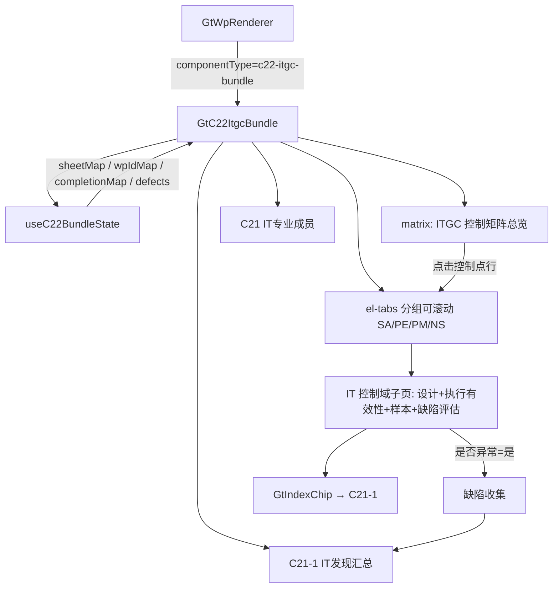

# Design Document

> C22 IT 一般控制测试聚合组件（含 C21 / C21-1）

## Overview

将 C22（34 sheet 工作簿）+ C21 + C21-1 聚合为 `c22-itgc-bundle` 组件，内部以「ITGC 矩阵总览 + 4 大类分组可滚动页签」切换。C22 的 33 个控制域子页同属一个工作簿的 sheet，通过组件内部 sheetName 分发；C21/C21-1 为独立底稿，通过 wp_index 解析 wp_id 渲染。遵循 `GtS34Bundle`/`GtA17Bundle` 模式，缺陷从子页联动汇总到 C21-1。

## Architecture



## Components and Interfaces

### GtC22ItgcBundle.vue

```typescript
interface Props {
  wpId: string        // C22 父底稿
  sheetName?: string  // 'SA-3' / 'matrix' / 'C21' / 'C21-1' ...
  readonly?: boolean
}

interface TabDef {
  id: string          // 'matrix' | 'SA-3' | ... | 'C21' | 'C21-1'
  label: string
  group: 'matrix' | '信息安全' | '运行维护' | '程序变更' | '新系统' | 'IT团队' | '发现汇总'
  kind: 'matrix' | 'itgc-sheet' | 'c21' | 'c21-1'
  sheet?: string      // C22 工作簿内 sheet 名
  wpCode?: string     // C21 / C21-1（独立底稿）
}
```

### 分组（对齐 requirements 4.1）

`信息安全 SA`：SA-3/4c/5/7/9/10/11/12/13/14；`运行维护 PE`：PE-3a/3d/5/6/7/8；`程序变更 PM`：PM-3/4c/4b/4e/5/6；`新系统 NS`：NS-1/3/4/5.1~5.4/6.1~6.2。（以 Phase0 实读为准）

### useC22BundleState composable

```typescript
export type CompletionStatus = 'completed' | 'in_progress' | 'not_started'
export interface ItgcDefect { controlId: string; group: string; description: string; defectNo: string }
export interface UseC22BundleStateReturn {
  wpIdMap: ComputedRef<Record<string, string>>   // C21/C21-1 → wp_id
  sheetTabs: ComputedRef<TabDef[]>                // C22 工作簿子页
  completionMap: ComputedRef<Record<string, CompletionStatus>>  // 按控制点
  defects: ComputedRef<ItgcDefect[]>              // 汇总缺陷
  progressSummary: ComputedRef<{ completed: number; inProgress: number; notStarted: number; defectCount: number }>
  refreshCompletion: (sheet?: string) => Promise<void>
}
```

### 完成状态推导

某控制点 = completed（设计+执行有效性结论均非空）/ in_progress（部分非空）/ not_started（全空）。

### 后端

- wp_code_overrides.json：`"C22": "c22-itgc-bundle"`；`"C21": "skip"`、`"C21-1": "skip"`
- VALID_COMPONENT_TYPES：新增 `c22-itgc-bundle`
- htmlRendererRegistry.ts：新增成员 + defineAsyncComponent + contextProps standard
- C22 子页复用 render-config 的 sheets 数据（同工作簿多 sheet）；C21/C21-1 通过 wp_index wp_id 独立渲染

## Data Models

### 数据流

```
点击 C22 → GtWpRenderer(c22-itgc-bundle) → GtC22ItgcBundle
  onMounted:
    1. 加载 C22 render-config → 33 子页 sheet 数据 + 主矩阵
    2. getWpIndex → wpIdMap（C21/C21-1 → wp_id）
    3. 计算 visibleTabs（matrix + 4 分组子页 + C21 + C21-1）
    4. 渲染 matrix 总览 + 分组可滚动 el-tabs
    5. useC22BundleState 收集缺陷 → C21-1 汇总
联动：子页缺陷评估「是否异常=是」→ defects 更新 → C21-1 汇总刷新 + 仪表盘缺陷数
```

### 缺陷汇总结构

```typescript
// 遍历所有子页，提取 是否异常=是 的项 → ItgcDefect[]
// C21-1 展示 defectNo / controlId / description + 允许补充影响/整改建议（持久化）
```

## Correctness Properties

*属性是系统在所有合法执行路径下都应保持为真的行为声明。*

### Property 1: skip 映射与注册完整性

*For any* {C21, C21-1} 映射为 `skip`，C22 映射为 `c22-itgc-bundle` 且在 registry 与 VALID_COMPONENT_TYPES 均已注册。

**Validates: Requirements 1.1, 1.2, 2.1, 2.2**

### Property 2: 子页分组完整性

*For any* C22 工作簿子页集合，每个 IT 控制域子页应被唯一归入 4 大类之一；matrix/C21/C21-1 不计入控制域分组。

**Validates: Requirements 4.1**

### Property 3: 缺陷汇总一致性

*For any* 子页集合，defects 应恰好等于所有「是否异常=是」子页的缺陷集合（无遗漏无重复），C21-1 汇总数量与之一致。

**Validates: Requirements 5.1, 5.2, 7.2**

### Property 4: 完成进度统计一致性

*For any* completionMap，progressSummary 的 completed+inProgress+notStarted 等于控制点总数，defectCount 等于 defects 长度。

**Validates: Requirements 7.1, 7.2**

### Property 5: sheetName 路由正确激活

*For any* 合法 Tab id，经 sheetName / query 传入时 active 切换为该值；非法值时保持不变（默认 matrix）。

**Validates: Requirements 6.1, 6.2, 6.3, 6.4**

### Property 6: readonly 透传

*For any* Tab 与任意 readonly 布尔值，子页/矩阵/汇总接收的 readonly 与父 props.readonly 一致。

**Validates: Requirements 9.1, 9.2**

## Error Handling

| 场景 | 处理 |
|------|------|
| C22 render-config 失败 | 提示错误，仅保留 matrix |
| C21/C21-1 wp_id 不存在 | 对应 Tab 隐藏 |
| sheetName 无效 | 回退 matrix |
| 子页渲染失败 | defineAsyncComponent errorComponent 兜底 |
| 缺陷汇总为空 | C21-1 显示「暂无 IT 审计发现」 |
| 引用底稿不存在 | GtIndexChip 灰态 |

## Testing Strategy

### 属性测试（PBT）

fast-check，每 property ≥100 次。Tag：`Feature: c22-itgc-bundle, Property {N}: {title}`。

| Property | 生成器 |
|----------|--------|
| P1 skip/注册 | 固定 C22/C21/C21-1 遍历 overrides + registry |
| P2 子页分组 | `fc.array(fc.record({sheet: fc.constantFrom(...ITGC_SHEETS)}))` |
| P3 缺陷汇总 | `fc.array(fc.record({controlId: fc.string(), abnormal: fc.boolean()}))` |
| P4 进度统计 | `fc.array(fc.constantFrom('completed','in_progress','not_started'))` |
| P5 sheetName 路由 | `fc.oneof(fc.constantFrom(...VALID_IDS), fc.string())` |
| P6 readonly | `fc.boolean()` |

### 单元/集成测试

- 注册表 + VALID_COMPONENT_TYPES 覆盖；C21/C21-1 skip 映射
- 4 大类分组切分正确
- matrix 点击行 → 切换子页
- 缺陷「是否异常=是」→ C21-1 汇总联动
- C21 下拉选项渲染
- 挂载 mock render-config + wp_index，验证子页渲染 + 只读透传 + Playwright 实测

## 交互增强设计（点选/附件OCR/缺陷回写）

### 点选控件映射

| 字段 | 控件 |
|------|------|
| 设计有效性结论 / 执行有效性结论 | el-select（有效/无效/部分有效）|
| 是否异常 | 单选点选（是/否）|
| IT 控制类别 / 相关应用系统 | el-select / 多选 tag |
| 长文本（审计程序/缺陷描述）| autosize textarea + AI 按钮 |

### 附件上传 + OCR + 证据编号

```typescript
// 子页审计证据/样本记录行 📎 上传
async function onUploadEvidence(file, sheet, row) {
  const idx = suggestEvidenceIndex(sheet)   // 如 C22.SA-3-1（按 sheet + 序号）
  const ocr = await api.post('/d4/contract-ocr', form)
  await ElMessageBox.confirm(preview(ocr))   // 确认后 merge 制度名称/更新时间/审批人
  mergeSampleRecord(row, ocr, idx)
}
```

### 缺陷回写联动 C21-1 ↔ A14

```
子页 是否异常=是 → useC22BundleState.defects 增加 → C21-1 汇总视图刷新
C21-1 缺陷条目 → GtIndexChip 一键跳转 A14 + 带入摘要（controlId/defectNo/description）
子页 是否异常=否 → 从 defects 移除对应条目（双向一致）
```

### 新增 Correctness Properties（补充）

- **P7 点选值合法性**：*For any* 点选字段，保存值属于选项枚举。**Validates: Requirements 10.1**
- **P8 证据编号规则**：*For any* 子页上传证据，建议索引号符合 `C22.{控制点}-{序号}` 规则且同子页内唯一。**Validates: Requirements 11.2**
- **P9 缺陷双向一致**：*For any* 子页异常状态切换，C21-1 汇总缺陷集合与「是否异常=是」子页集合始终一致。**Validates: Requirements 12.1, 12.4**
