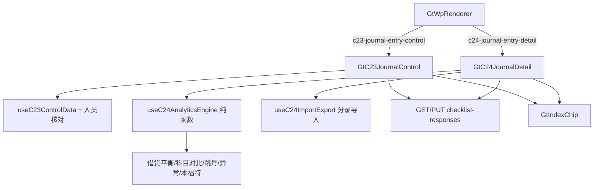

# Design Document

> C23/C24 会计分录测试专属组件

## Overview

为 C23（会计分录控制测试）与 C24（会计分录细节测试）各开发专属组件，对齐 D4 标准：sheetName v-if 分发 + 纯函数分析引擎 composable + 导入导出 + GtIndexChip + checklist_responses 持久化。C24 是数据分析密集型，核心为 `useC24AnalyticsEngine`（借贷平衡/科目余额对比/跳号/异常筛选/本福特分布）。

## Architecture



## Components and Interfaces

### sheet 分发

| 组件 | sheetName 分发 |
|------|----------------|
| GtC23JournalControl | C23A / C23-1 人员清单 / C23-2 控制测试 / 示例 |
| GtC24JournalDetail | C24A / C24-0 汇总 / C24-1 借贷发生额 / C24-2 分录余额对比 / C24-3 跳号 / C24-4 异常账户 / C24-5 异常分录 / 本福特 |

### useC24AnalyticsEngine（纯函数）

```typescript
export interface JournalEntry {
  voucherNo: string; date: string; account: string; debit: number; credit: number
  summary?: string; preparer?: string
}

// 完整性：借贷平衡
export function calcBalanceIntegrity(entries: JournalEntry[]): { debitTotal: number; creditTotal: number; balanced: boolean }

// 科目余额对比（分录汇总 vs 试算表）
export function compareToTrialBalance(entries: JournalEntry[], tb: Record<string, number>): { account: string; jeSum: number; tbAmount: number; diff: number }[]

// 跳号测试：识别缺号区间
export function detectGaps(voucherNos: string[]): { start: string; end: string; count: number }[]

// 异常分录筛选（规则参数化）
export interface AnomalyRules { holidays: string[]; nightStartHour: number; largeAmountThreshold: number; approvalLimit: number }
export function screenAnomalies(entries: JournalEntry[], rules: AnomalyRules): { entry: JournalEntry; reasons: string[] }[]

// 本福特首位数分布
export function benfordDistribution(amounts: number[]): { digit: number; actual: number; expected: number; deviation: number }[]
// expected(d) = log10(1 + 1/d)
```

### useC23ControlData

```typescript
// 人员清单完整性核对：样本分录的 preparer/poster/reviewer 是否在授权清单
export function checkPersonnel(samples: JeControlSample[], authorized: AuthorizedPerson[]): { sample: JeControlSample; deviation: boolean }[]
```

### 后端

- wp_code_overrides.json：`C23→c23-journal-entry-control`、`C24→c24-journal-entry-detail`
- VALID_COMPONENT_TYPES：新增两类
- htmlRendererRegistry.ts：新增成员 + defineAsyncComponent + contextProps standard
- RENDERER_DISPATCH：注册两类
- 导入导出三端点（分录明细导入 / 模板 / 数据导出）
- 复用 GET/PUT checklist-responses

## Data Models

### item_id 命名（前缀 C23-/C24-）

| 区域 | item_id 模式 |
|------|-------------|
| C23 授权人员 | `C23-person-{n}-{field}` |
| C23 样本 | `C23-sample-{s}-{field}` / `-deviation` |
| C24 数据来源 | `C24-0-source-{field}` |
| C24 测试项结论 | `C24-{k}-conclusion`（k=1~5） |
| C24 异常分录 | `C24-5-anomaly-{i}-{field}` |
| C24 本福特参数 | `C24-benford-{field}` |

### 数据流

```
点击 C23/C24 → 专属组件(sheetName v-if)
  C24: 导入分录明细 → useC24AnalyticsEngine 计算 借贷平衡/科目对比/跳号/异常/本福特 → 各 sheet 呈现（公式列只读）→ C24-0 汇总结论
  C23: 维护授权清单 + 录入样本 → checkPersonnel 标记偏差 → 完整性结论
  保存: 结论即时；文本 debounce 2s → PUT checklist-responses
```

## Correctness Properties

*属性是系统在所有合法执行路径下都应保持为真的行为声明。*

### Property 1: 组件注册完整性

*For any* {C23, C24}，wp_code_overrides 映射为对应类型且在 registry 与 VALID_COMPONENT_TYPES 均已注册。

**Validates: Requirements 1.1, 1.2, 1.3**

### Property 2: 借贷平衡完整性

*For any* JournalEntry 数组，calcBalanceIntegrity.debitTotal = Σdebit，creditTotal = Σcredit，balanced = (debitTotal == creditTotal)（浮点误差内）。

**Validates: Requirements 3.1**

### Property 3: 跳号识别正确性

*For any* 凭证号序列（可含缺口），detectGaps 返回的缺号区间应恰好覆盖所有缺失号且区间不重叠；连续无缺口时返回空。

**Validates: Requirements 3.3**

### Property 4: 本福特分布正确性

*For any* 正数金额数组，benfordDistribution 每个 digit(1-9) 的 expected = log10(1+1/digit)，actual 为该首位数出现频率，Σactual = 1（非空时），deviation = |actual - expected|。

**Validates: Requirements 5.1, 5.2**

### Property 5: 异常筛选规则确定性

*For any* JournalEntry 数组与 AnomalyRules，screenAnomalies 对每条分录的命中 reasons 应与规则确定性一致（约整数/大额/临界审批限额/假期/夜间可复现）。

**Validates: Requirements 4.1, 4.4**

### Property 6: C23 人员核对正确性

*For any* 样本与授权清单，checkPersonnel 标记 deviation=true 当且仅当样本的编制/过账/审核人存在不在授权清单内者。

**Validates: Requirements 2.4, 2.5**

### Property 7: 公式单元格不可手工覆盖

*For any* 分析结果单元格，其值恒等于引擎按输入重算的结果，手工写入被忽略。

**Validates: Requirements 3.4**

### Property 8: 持久化往返与 readonly

*For any* C23-/C24- 前缀数据，PUT 后 GET 一致；readonly=true 时禁止编辑与行增删。

**Validates: Requirements 8.1, 8.3**

## Error Handling

| 场景 | 处理 |
|------|------|
| 导入分录格式错误 | 提示错误行，不写入 |
| 借方合计≠贷方合计 | 标红提示完整性异常（非报错） |
| 本福特金额含 0/负数 | 按绝对值取首位数或排除，标注 |
| GET/PUT 失败 | 提示，保留本地编辑 |
| 引用底稿不存在 | GtIndexChip 灰态 |
| 大数据量分录 | 分批计算 + 进度提示，避免卡顿 |

## Testing Strategy

### 属性测试（PBT）

fast-check（前端引擎）+ hypothesis（后端往返），每 property ≥100 次。Tag：`Feature: c23-c24-journal-entry-testing, Property {N}: {title}`。

| Property | 生成器 |
|----------|--------|
| P1 注册 | 固定 C23/C24 遍历 overrides + registry |
| P2 借贷平衡 | `fc.array(fc.record({debit: fc.float(), credit: fc.float()}))` |
| P3 跳号 | `fc.array(fc.integer())` 转凭证号序列（含随机缺口） |
| P4 本福特 | `fc.array(fc.float({min: 1}))` |
| P5 异常筛选 | `fc.array(fc.record({date, amount})) × fc.record(rules)` |
| P6 人员核对 | `fc.array(sample) × fc.array(authorized)` |
| P7 公式不可覆盖 | 随机输入 + 手工写入尝试 |
| P8 往返/readonly | hypothesis C23-/C24- item_id + `fc.boolean()` |

### 单元/集成测试

- 注册表 + VALID_COMPONENT_TYPES + RENDERER_DISPATCH
- useC24AnalyticsEngine 各函数单元测试（边界：空/单条/大额/缺口）
- C23 人员核对偏差标记
- 导入分录 → 完整性/跳号/异常/本福特 端到端
- 导入导出往返；只读禁编辑；Playwright 实测

## 交互增强设计（点选/附件OCR/异常回写）

### 点选控件映射

| 字段 | 控件 |
|------|------|
| 是否偏差 / 测试结论 | el-select / 单选点选 |
| 异常分录规则启用 | el-checkbox-group（假期/夜间/频繁调整/大额/约整数/临界审批限额）|
| 阈值型规则（大额阈值/审批限额/夜间起始时点）| el-input-number |
| 长文本（异常说明/核查内容/结论）| autosize textarea + AI 按钮 |

### 附件上传 + OCR + 分录导入

```typescript
// C23-2 样本行 📎 上传凭证 → OCR 识别 编制人/过账人/审核人/日期
async function onUploadJeSample(file, row) {
  const ocr = await api.post('/d4/contract-ocr', form)
  await ElMessageBox.confirm(preview(ocr)); mergeSample(row, ocr)
}
// C24 分录导入：useC24ImportExport → 解析明细 → useC24AnalyticsEngine 输入
```

### 异常回写联动

```
C24 异常分录确认为错报 → GtIndexChip 一键跳转 A13 错报汇总/相关循环 + 带入分录摘要
C23/C24 测试项结论 → 回填 C24-0 汇总表对应项
本福特显著偏离 / 异常聚集 → 「建议扩大核查范围」提示
```

### 新增 Correctness Properties（补充）

- **P9 点选/规则值合法性**：*For any* 点选字段与规则勾选，保存值属于枚举/布尔，阈值为数值。**Validates: Requirements 9.1, 9.2**
- **P10 OCR merge 非破坏性**：*For any* OCR 结果与样本行，merge 仅填空或经确认字段。**Validates: Requirements 10.1**
- **P11 结论回填一致性**：*For any* 测试项结论变更，C24-0 汇总对应项与之一致。**Validates: Requirements 11.2**
