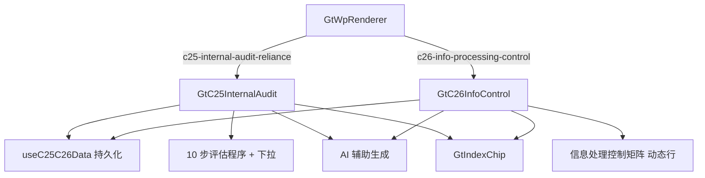

# Design Document

> C25/C26 专项控制测试专属组件

## Overview

为 C25（利用内审工作，叙述式评估程序）与 C26（信息处理控制矩阵）各开发专属组件，对齐 D4 标准：sheetName 分发（各为单主 sheet）+ 命名区域下拉 + AI 辅助文本 + GtIndexChip + checklist_responses 持久化。C25 无公式（叙述式），C26 为动态行矩阵。零新表零新端点。

## Architecture



## Components and Interfaces

### GtC25InternalAudit.vue / GtC26InfoControl.vue

```typescript
interface Props { wpId: string; projectId: string; wpCode: string; year: number; readonly?: boolean }
```

### C25 评估步骤

```typescript
interface C25Step { seq: string; procedure: string; applicable: 'Y'|'N'|null; performer: string; result: string; indexRef: string }
// 10 步（性质范围/领域识别/阅读报告/工作质量/重新执行程度/补充测试/利用结论/合作计划/一致性/初始判断复核）
```

### C26 控制矩阵行

```typescript
interface C26Control {
  index: number; cycle: string; category: string; controlIndexNo: string  // IT-R&R-xx
  purpose: string; plannedTest: string; walkthrough: string; controlTest: string
  result: string; clientFeedback: string; conclusion: string; evidenceRef: string
  elements: ('完整性'|'准确性'|'授权'|'访问限制')[]
}
```

### 后端

- wp_code_overrides.json：`C25→c25-internal-audit-reliance`、`C26→c26-info-processing-control`
- VALID_COMPONENT_TYPES：新增两类
- htmlRendererRegistry.ts：新增成员 + defineAsyncComponent + contextProps standard
- RENDERER_DISPATCH：注册两类
- AI 辅助复用现有 chat_completion 端点；复用 GET/PUT checklist-responses

## Data Models

### item_id 命名（前缀 C25-/C26-）

| 区域 | item_id 模式 | conclusion / remark |
|------|-------------|---------------------|
| C25 步骤适用性 | `C25-step-{n}-applicable` | Y/N / — |
| C25 执行说明 | `C25-step-{n}-result` | — / 文本 |
| C25 利用结论 | `C25-reliance-conclusion` | 结论值 / 说明 |
| C26 控制条目 | `C26-ctrl-{m}-{field}` | — / 文本 |
| C26 结论 | `C26-ctrl-{m}-conclusion` | 有效/无效等 / — |
| C26 四要素 | `C26-ctrl-{m}-elements` | 逗号分隔 / — |

### 数据流

```
点击 C25/C26 → 专属组件
  onMounted: GET checklist-responses(C25-/C26-) → 还原步骤/矩阵
  编辑: 适用性/结论/四要素即时保存；文本 debounce 2s → PUT
  C26: 动态增删控制行（新增命名行先 ElMessageBox.prompt 输入控制名）
```

## Correctness Properties

*属性是系统在所有合法执行路径下都应保持为真的行为声明。*

### Property 1: 组件注册完整性

*For any* {C25, C26}，wp_code_overrides 映射为对应类型且在 registry 与 VALID_COMPONENT_TYPES 均已注册。

**Validates: Requirements 1.1, 1.2, 1.3**

### Property 2: C25 步骤结构完整性

*For any* C25 数据，评估步骤应完整呈现 10 步，每步 applicable ∈ {Y, N, null}，不适用步骤不阻断整体结论录入。

**Validates: Requirements 2.1, 2.3**

### Property 3: C26 动态行增删一致性

*For any* 增删操作序列，C26 控制条目的 index 应保持唯一且连续可追溯；删除后剩余条目重新编号不产生 item_id 冲突。

**Validates: Requirements 3.3**

### Property 4: C26 四要素标记有效性

*For any* 控制条目，elements 应为 {完整性, 准确性, 授权, 访问限制} 的子集（无非法值）。

**Validates: Requirements 3.4**

### Property 5: 持久化往返一致性

*For any* C25-/C26- 前缀数据，PUT 保存后 GET 加载，所有字段值应与保存前一致。

**Validates: Requirements 6.1, 6.4**

### Property 6: readonly 禁编辑

*For any* readonly=true，所有输入编辑与行增删被禁止，仅浏览与跳转可用。

**Validates: Requirements 7.1**

## Error Handling

| 场景 | 处理 |
|------|------|
| GET/PUT 失败 | 提示，保留本地编辑 |
| AI 服务不可用 | 提示「AI 服务暂时不可用，请手动填写」 |
| C26 新增行未命名 | 拒绝创建，提示输入控制名 |
| 引用底稿不存在 | GtIndexChip 灰态 |

## Testing Strategy

### 属性测试（PBT）

fast-check（前端）+ hypothesis（后端往返），每 property ≥100 次。Tag：`Feature: c25-c26-internal-audit-info-control, Property {N}: {title}`。

| Property | 生成器 |
|----------|--------|
| P1 注册 | 固定 C25/C26 遍历 overrides + registry |
| P2 C25 步骤 | `fc.array(fc.record({applicable: fc.constantFrom('Y','N',null)}), {maxLength:10})` |
| P3 C26 增删 | `fc.array(fc.constantFrom('add','remove'))` 序列 |
| P4 四要素 | `fc.subsetOf(['完整性','准确性','授权','访问限制'])` |
| P5 往返 | hypothesis C25-/C26- item_id + conclusion + remark |
| P6 readonly | `fc.boolean()` |

### 单元/集成测试

- 注册表 + VALID_COMPONENT_TYPES + RENDERER_DISPATCH
- C25 10 步渲染 + 下拉 + 利用结论
- C26 矩阵动态增删 + 四要素 + 分组筛选
- AI 辅助按钮调用
- 方法论上下文区块渲染
- 只读禁编辑；Playwright 实测

## 交互增强设计（点选/附件OCR/联动）

### 点选控件映射

| 字段 | 控件 |
|------|------|
| 是否适用 / 测试结论 | el-select / 单选点选 |
| 信息处理四要素 | el-checkbox-group（完整性/准确性/授权/访问限制）|
| 控制类别 / 循环筛选 | el-select / 点选标签切换 |
| 长文本（说明/测试过程/结论）| autosize textarea + AI 按钮 |

### 附件上传 + OCR

```typescript
// C26 证据索引处 / C25 执行说明处 📎 上传 → 可识别文档走 OCR → 确认弹窗 merge
async function onUpload(file, row) {
  const ocr = await api.post('/d4/contract-ocr', form)
  await ElMessageBox.confirm(preview(ocr)); merge(row, ocr)
}
```

### 联动跳转与回写

```
C26 识别缺陷 → GtIndexChip 一键跳转 A14 / C21-1 + 带入缺陷摘要
C25 利用内审结论影响范围 → GtIndexChip 跳转计划/风险底稿
证据索引/程序索引列 → GtIndexChip 一键跳转（不存在灰态）
```

### 新增 Correctness Properties（补充）

- **P7 点选值合法性**：*For any* 点选字段与四要素多选，保存值属于枚举子集。**Validates: Requirements 8.1**
- **P8 OCR merge 非破坏性**：*For any* OCR 结果，merge 仅填空或经确认字段。**Validates: Requirements 9.3**
