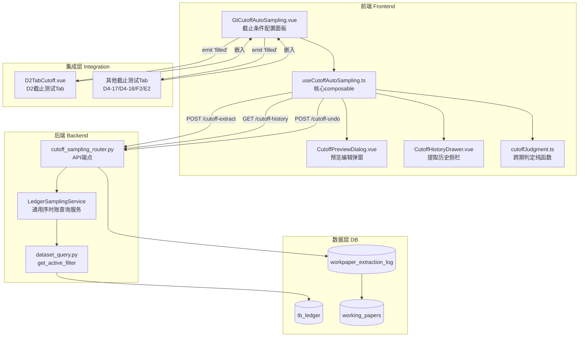
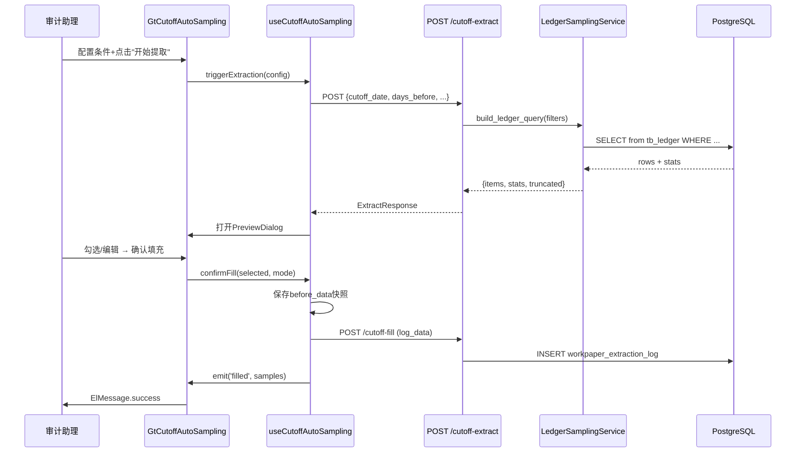

# Design Document: 通用截止测试自动提取组件

## Overview

通用截止测试自动提取组件（cutoff-test-auto-sampling）从 `tb_ledger` 表按用户配置条件自动查询凭证并填充到截止测试底稿。核心数据流：

**用户配置条件 → 后端构建SQL查询 → 执行并返回分页结果 → 前端预览弹窗 → 用户勾选确认 → 填充至底稿samples → 记录执行日志**

设计目标：
- 后端 `LedgerSamplingService` 作为独立共享层，同时被截止测试和未来抽凭引擎复用
- 前端 `GtCutoffAutoSampling.vue` 作为通用组件，通过 props 配置适配 D2/D4-17/D4-18/F2/E2 等所有截止性测试
- 跨期判定为纯函数 `determineCutoffStatus`，前后端可共用逻辑
- 执行留痕+撤销通过 `workpaper_extraction_log` 表实现完整审计溯源

## Architecture



### 文件结构

```
audit-platform/frontend/src/components/workpaper/
├── cutoff/                                    # 新增目录
│   ├── GtCutoffAutoSampling.vue              # 主组件（条件面板+操作入口，~300行）
│   ├── CutoffPreviewDialog.vue               # 预览编辑弹窗（~350行）
│   └── CutoffHistoryDrawer.vue               # 提取历史侧栏（~200行）
├── composables/
│   ├── useCutoffAutoSampling.ts              # 核心composable（~400行）
│   └── cutoffJudgment.ts                     # 跨期判定纯函数（~60行）

backend/app/services/
│   └── ledger_sampling_service.py            # 通用序时账条件查询服务（~250行）

backend/app/routers/
│   └── cutoff_sampling.py                    # API端点（~200行）

backend/migrations/
│   └── V095_create_workpaper_extraction_log.sql  # 新表迁移

backend/tests/
│   └── test_cutoff_sampling_pbt.py           # 后端PBT测试（hypothesis）

audit-platform/frontend/src/components/workpaper/__tests__/
│   ├── cutoffJudgment.spec.ts                # 跨期判定PBT（fast-check）
│   ├── cutoffAutoSampling.spec.ts            # composable单元测试
│   └── cutoffAutoSampling.property.spec.ts   # composable PBT测试
```

### 数据流序列图



## Components and Interfaces

### 1. cutoffJudgment.ts — 跨期判定纯函数

```typescript
export type CutoffDirection = 'post_cutoff' | 'pre_cutoff' | 'window'
export type CutoffStatus = '可能跨期' | '待检查' | '正常'

/**
 * 截止测试跨期判定纯函数
 * 
 * @param voucherDate - 凭证日期 (YYYY-MM-DD)
 * @param cutoffDate - 截止基准日 (YYYY-MM-DD)
 * @param direction - 判定模式
 * @param amount - 金额（借方为正、贷方为负）
 * @param daysBefore - 前窗口天数
 * @param daysAfter - 后窗口天数
 */
export function determineCutoffStatus(
  voucherDate: string,
  cutoffDate: string,
  direction: CutoffDirection,
  amount: number,
  daysBefore?: number,
  daysAfter?: number,
): CutoffStatus
```

判定逻辑：
- `post_cutoff`：voucherDate > cutoffDate 且 amount > 0（借方）→ "可能跨期"
- `pre_cutoff`：voucherDate < cutoffDate 且 amount < 0（贷方）→ "可能跨期"
- `window`：voucherDate 在 [cutoffDate - daysBefore, cutoffDate + daysAfter] 内 → "待检查"
- 其他情况 → "正常"

### 2. useCutoffAutoSampling.ts — 核心composable

```typescript
export interface CutoffAutoSamplingOptions {
  projectId: Ref<string>
  year: Ref<number>
  workpaperId: Ref<string>
  accountCode: string                    // 关联科目编码
  cutoffDirection: CutoffDirection       // 截止判定方向
  defaultConditions?: Partial<CutoffConfig>  // 默认条件覆盖
}

export interface CutoffConfig {
  cutoffDate: string        // YYYY-MM-DD
  daysBefore: number        // 默认5
  daysAfter: number         // 默认10
  amountThreshold: number   // 默认0(不限)
  accountCodes: string[]    // 科目列表(前缀匹配)
  directionFilter: 'debit' | 'credit' | 'all'
  voucherTypeFilter: string[]  // 记/收/付/转
  summaryKeyword: string
  excludeExtracted: boolean // 默认true
}

export interface ExtractedVoucher {
  voucherNo: string
  voucherDate: string
  summary: string | null
  debitAmount: string | null   // Decimal字符串
  creditAmount: string | null
  accountCode: string
  accountName: string | null
  counterpartAccount: string | null
  voucherType: string | null
  cutoffStatus: CutoffStatus
  remark: string
  selected: boolean
}

export interface ExtractStats {
  totalCount: number
  debitTotal: string
  creditTotal: string
  byVoucherType: Record<string, number>
  truncated: boolean
}

export type FillMode = 'append' | 'replace' | 'merge'

export interface ExtractionLogEntry {
  id: string
  createdAt: string
  userId: string
  fillMode: FillMode
  filledCount: number
  totalMatched: number
  extractionCriteria: CutoffConfig
  isUndone: boolean
}

export function useCutoffAutoSampling(options: CutoffAutoSamplingOptions) {
  return {
    // 状态
    config: Ref<CutoffConfig>,
    extractedVouchers: Ref<ExtractedVoucher[]>,
    stats: Ref<ExtractStats | null>,
    loading: Ref<boolean>,
    previewVisible: Ref<boolean>,
    historyVisible: Ref<boolean>,
    historyList: Ref<ExtractionLogEntry[]>,
    fillMode: Ref<FillMode>,
    
    // 计算属性
    selectedVouchers: ComputedRef<ExtractedVoucher[]>,
    selectedCount: ComputedRef<number>,
    cutoffErrorCount: ComputedRef<number>,
    selectedDebitTotal: ComputedRef<number>,
    selectedCreditTotal: ComputedRef<number>,
    dateRangeText: ComputedRef<string>,  // 计算后的日期范围提示
    
    // 操作
    triggerExtraction: () => Promise<void>,
    confirmFill: () => Promise<ExtractedVoucher[]>,
    loadHistory: () => Promise<void>,
    undoLastExtraction: (logId: string) => Promise<void>,
    toggleSelectAll: (selected: boolean) => void,
    
    // 校验
    validateConfig: () => boolean,
    configErrors: Ref<Record<string, string>>,
  }
}
```

### 3. GtCutoffAutoSampling.vue — 主组件接口

```typescript
// Props
interface GtCutoffAutoSamplingProps {
  accountCode: string
  cutoffDirection: CutoffDirection
  defaultConditions?: Partial<CutoffConfig>
  workpaperId: string
  projectId: string
  year: number
}

// Emits
interface GtCutoffAutoSamplingEmits {
  (e: 'filled', payload: { samples: ExtractedVoucher[]; fillMode: FillMode }): void
}
```

### 4. LedgerSamplingService — 后端共享服务

```python
from pydantic import BaseModel, Field
from decimal import Decimal
from uuid import UUID
from datetime import date
from typing import Optional

# ─── Pydantic Models ──────────────────────────────────────────────────────────

class LedgerQueryFilters(BaseModel):
    """通用序时账查询过滤条件（被截止测试和抽凭引擎共享）"""
    date_start: date
    date_end: date
    account_codes: list[str]             # 前缀匹配列表
    amount_threshold: Decimal = Decimal("0")
    direction_filter: str = "all"        # "debit" | "credit" | "all"
    voucher_type_filter: list[str] = []  # 空=不限
    summary_keyword: str = ""
    exclude_voucher_nos: list[str] = []  # 排除的凭证号列表

class StatsResult(BaseModel):
    """查询统计摘要"""
    total_count: int
    debit_total: Decimal
    credit_total: Decimal
    by_voucher_type: dict[str, int]
    truncated: bool

class ExtractionLogCreate(BaseModel):
    """提取日志创建模型"""
    project_id: UUID
    workpaper_id: UUID
    user_id: UUID
    extraction_type: str = "cutoff"
    extraction_criteria: dict
    total_matched: int
    filled_count: int
    fill_mode: str  # "append" | "replace" | "merge"
    before_data: Optional[list[dict]] = None

class CutoffExtractRequest(BaseModel):
    """截止测试提取请求"""
    cutoff_date: date
    days_before: int = Field(default=5, ge=0, le=60)
    days_after: int = Field(default=10, ge=0, le=60)
    amount_threshold: Decimal = Decimal("0")
    account_codes: list[str]
    direction_filter: str = "all"
    voucher_type_filter: list[str] = []
    summary_keyword: str = ""
    exclude_extracted: bool = True
    workpaper_id: UUID
    page: int = Field(default=1, ge=1)
    page_size: int = Field(default=50, ge=1, le=100)

# ─── Service Interface ────────────────────────────────────────────────────────

class LedgerSamplingService:
    """通用序时账条件查询服务
    
    被截止测试和未来 voucher-sampling-engine 共享。
    内置 get_active_filter 调用，外部调用者无需关心 dataset 可见性。
    """
    
    @staticmethod
    async def build_ledger_query(
        db: AsyncSession,
        project_id: UUID,
        year: int,
        filters: LedgerQueryFilters,
    ) -> Select:
        """构建带条件的SQLAlchemy Select对象
        
        内部调用 get_active_filter 确保只查询 active dataset。
        必须包含 project_id + year 安全隔离条件。
        """
    
    @staticmethod
    async def execute_with_stats(
        db: AsyncSession,
        query: Select,
        page: int,
        page_size: int,
        max_total: int = 500,
    ) -> tuple[list[dict], StatsResult]:
        """执行查询并返回分页数据+统计摘要
        
        - 分页返回（默认page_size=50）
        - 统计：总匹配笔数、借贷合计、按凭证类型分类
        - 超过max_total时标记truncated=true
        - 金额使用Decimal精度，序列化为字符串
        """
    
    @staticmethod
    async def record_extraction_log(
        db: AsyncSession,
        log_data: ExtractionLogCreate,
    ) -> dict:
        """记录提取日志到 workpaper_extraction_log"""
    
    @staticmethod
    async def get_extraction_history(
        db: AsyncSession,
        workpaper_id: UUID,
    ) -> list[dict]:
        """获取指定底稿的提取历史（按created_at DESC）"""
    
    @staticmethod
    async def undo_extraction(
        db: AsyncSession,
        log_id: UUID,
        workpaper_id: UUID,
    ) -> dict:
        """撤销指定提取记录，返回before_data"""
```

### 5. API 端点规格

```python
# POST /api/projects/{pid}/sampling/cutoff-extract
# 请求体: CutoffExtractRequest
# 响应: { items: [...], stats: StatsResult, page, page_size }

# GET /api/projects/{pid}/sampling/cutoff-history?wp_id={uuid}
# 响应: [ExtractionLogEntry, ...]

# POST /api/projects/{pid}/sampling/cutoff-undo?log_id={uuid}
# 响应: { success: true, before_data: [...] }

# POST /api/projects/{pid}/sampling/cutoff-fill
# 请求体: ExtractionLogCreate
# 响应: { id: uuid, created_at: ... }
```

## Data Models

### workpaper_extraction_log 表结构

| 列名 | 类型 | 约束 | 说明 |
|------|------|------|------|
| id | UUID | PK DEFAULT gen_random_uuid() | 主键 |
| project_id | UUID | FK projects.id NOT NULL | 项目ID |
| workpaper_id | UUID | FK working_papers.id NOT NULL | 底稿ID |
| user_id | UUID | NOT NULL | 操作人 |
| extraction_type | VARCHAR(50) | NOT NULL | 'cutoff' / 'voucher_sampling' |
| extraction_criteria | JSONB | NOT NULL | 提取条件JSON |
| total_matched | INTEGER | NOT NULL | 匹配总笔数 |
| filled_count | INTEGER | NOT NULL | 实际填充笔数 |
| fill_mode | VARCHAR(20) | NOT NULL | 'append'/'replace'/'merge' |
| before_data | JSONB | NULL | 填充前数据快照 |
| is_undone | BOOLEAN | DEFAULT FALSE | 是否已撤销 |
| created_at | TIMESTAMP | DEFAULT now() | 操作时间 |

索引：
- `idx_extraction_log_wp_created` (workpaper_id, created_at DESC) — 历史查询
- `idx_extraction_log_project` (project_id) — 项目级查询

### extraction_criteria JSON 结构

```json
{
  "cutoff_date": "2025-12-31",
  "days_before": 5,
  "days_after": 10,
  "amount_threshold": "10000.00",
  "account_codes": ["1122"],
  "direction_filter": "all",
  "voucher_type_filter": [],
  "summary_keyword": "",
  "exclude_extracted": true
}
```

### 填充后 samples 数据结构映射

| tb_ledger 字段 | 底稿 sample 字段 | 说明 |
|---------------|-----------------|------|
| voucher_no | 凭证号 | 原值 |
| voucher_date | 凭证日期 | YYYY-MM-DD |
| debit_amount | 借方金额 | Decimal字符串 |
| credit_amount | 贷方金额 | Decimal字符串 |
| summary | 摘要 | 原值 |
| counterpart_account | 对方科目 | 原值 |
| account_code | 科目编码 | 原值 |
| account_name | 科目名称 | 原值 |
| voucher_type | 凭证类型 | 原值 |
| — (computed) | 跨期判定 | determineCutoffStatus结果 |
| — (computed) | 数据来源 | "自动提取" |
| — (user input) | 备注 | 用户编辑 |


## Correctness Properties

*A property is a characteristic or behavior that should hold true across all valid executions of a system—essentially, a formal statement about what the system should do. Properties serve as the bridge between human-readable specifications and machine-verifiable correctness guarantees.*

### Property 1: 跨期判定纯函数正确性

*For any* voucher date, cutoff date, direction mode, and amount:
- When direction = "post_cutoff" and voucherDate > cutoffDate and amount > 0 (debit), the result SHALL be "可能跨期"
- When direction = "pre_cutoff" and voucherDate < cutoffDate and amount < 0 (credit amount present), the result SHALL be "可能跨期"
- When direction = "window" and voucherDate is within [cutoffDate - daysBefore, cutoffDate + daysAfter], the result SHALL be "待检查"
- All other cases SHALL return "正常"
- The function must always return one of exactly three values: "可能跨期" | "待检查" | "正常"

**Validates: Requirements 6.1, 6.2, 6.3**

### Property 2: 日期窗口计算正确性

*For any* valid cutoff date (YYYY-MM-DD), days_before (0-60), and days_after (0-60), the computed date range SHALL satisfy:
- range_start === cutoffDate minus days_before calendar days
- range_end === cutoffDate plus days_after calendar days
- range_start <= cutoffDate <= range_end
- The total window span in days === days_before + days_after

**Validates: Requirements 1.3, 2.5**

### Property 3: 查询安全隔离不变量

*For any* project_id and year, the SQL query generated by `build_ledger_query` SHALL always contain:
- `project_id = :pid` condition
- `year = :year` condition
- `get_active_filter` derived dataset visibility condition
These conditions must be present regardless of any combination of optional filter parameters.

**Validates: Requirements 2.2, 2.3, 10.3**

### Property 4: 查询过滤条件构建正确性

*For any* `LedgerQueryFilters` instance:
- account_codes ["1122", "6001"] SHALL produce `account_code LIKE ANY('{1122%,6001%}')` prefix matching
- direction_filter "debit" SHALL add `debit_amount > 0`; "credit" SHALL add `credit_amount > 0`; "all" SHALL add no direction condition
- amount_threshold > 0 SHALL add `GREATEST(COALESCE(debit_amount,0), COALESCE(credit_amount,0)) >= threshold`; threshold = 0 SHALL add no amount condition
- summary_keyword non-empty SHALL add `summary ILIKE '%keyword%'`; empty SHALL add no keyword condition

**Validates: Requirements 1.4, 2.4, 2.6, 2.7, 2.8**

### Property 5: 统计摘要准确性

*For any* query result set of ledger entries, the StatsResult SHALL satisfy:
- total_count === actual number of matching rows
- debit_total === sum of all debit_amount values (treating NULL as 0)
- credit_total === sum of all credit_amount values (treating NULL as 0)
- sum(by_voucher_type.values()) === total_count
- Each voucher type key in by_voucher_type corresponds to entries with that type

**Validates: Requirements 2.9**

### Property 6: 截断阈值行为

*For any* query result with total_count rows:
- IF total_count > 500 THEN truncated === true AND returned items count <= 500
- IF total_count <= 500 THEN truncated === false AND returned items count === total_count

**Validates: Requirements 2.10**

### Property 7: 金额 Decimal 序列化 Round-Trip

*For any* Decimal value with precision (20,2), serializing to string then parsing back to Decimal SHALL produce an equivalent value: `Decimal(str(original)) == original`

**Validates: Requirements 2.11**

### Property 8: 填充策略正确性

*For any* existing samples array (length N) and selected vouchers array (length M, all with unique voucher_no):
- **append**: result length === N + M; result[0:N] === existing; result[N:N+M] maps from selected
- **replace**: result length === M; result contains only mapped selected vouchers
- **merge**: result length === N + (M - overlap_count) where overlap_count = count of selected vouchers whose voucher_no exists in existing; no duplicate voucher_no in result

**Validates: Requirements 4.1, 4.2, 4.3, 4.4, 4.6**

### Property 9: 排除已提取凭证去重

*For any* set of previously extracted voucher numbers (from workpaper_extraction_log) and a new query result, when exclude_extracted=true:
- The filtered result SHALL NOT contain any voucher_no that appears in the previously extracted set
- The filtered result SHALL contain all voucher_no from the query result that are NOT in the previously extracted set (no false exclusions)

**Validates: Requirements 2.12**

### Property 10: 撤销 Round-Trip — before_data 快照与恢复

*For any* samples array state S_before, after executing a fill operation:
- The log entry's before_data SHALL deep-equal S_before (snapshot fidelity)
- After undo, the restored samples SHALL deep-equal S_before (restore fidelity)
- After undo, the log entry's is_undone SHALL be true
- Only the most recent non-undone log entry for a workpaper SHALL be undoable

**Validates: Requirements 5.6, 5.8, 9.1, 9.3, 9.4, 9.5**

## Error Handling

| 场景 | 处理方式 |
|------|---------|
| get_active_filter 失败（无 active dataset） | 降级为 project_id + year + is_deleted=false 基础过滤 |
| cutoff-extract API 超时（查询慢） | 前端 30s 超时 + ElMessage.warning "查询超时，请缩小条件范围" |
| 提取结果为空（0条匹配） | 不打开预览弹窗，直接 ElMessage.info "未找到符合条件的凭证" |
| 提取结果超500条 | 返回前500条 + truncated=true + 前端黄色 el-alert 提示 "结果已截断" |
| 金额字段含 NULL | COALESCE(amount, 0) 处理，前端显示 "-" |
| workpaper_extraction_log 写入失败 | 回滚填充操作 + ElMessage.error |
| 撤销非最新记录 | 按钮禁用 + tooltip "仅可撤销最近一次操作" |
| 撤销时 before_data 为 NULL | 恢复为空数组 [] |
| replace 模式确认弹窗取消 | 不执行任何操作，保持当前状态 |
| 网络断开时提取 | http.ts 全局重试机制 + 重试失败后 ElMessage.error |
| 校验失败（缺必填字段） | 对应字段下方红色提示，不发起请求 |
| 并发填充冲突（极端情况） | before_data 以发起时快照为准，后续撤销可逐次回滚 |

## Testing Strategy

### 单元测试（vitest）

- `cutoffJudgment.ts` 全部判定逻辑：三种模式 × 边界日期 × 正负金额
- `useCutoffAutoSampling.ts`：配置初始化、校验逻辑、日期窗口计算、选中统计
- 填充策略三种模式：append/replace/merge 各含边界案例
- 金额格式化：displayPrefs.fmtAmount 适配
- 凭证映射函数：tb_ledger → sample 字段映射

### Property-Based Tests（fast-check + hypothesis）

前端 PBT 库：**fast-check**（项目已有）
后端 PBT 库：**hypothesis**（项目已有）

每个 correctness property 对应一个 PBT 测试，最少 100 次迭代。

标签格式：`Feature: cutoff-test-auto-sampling, Property {N}: {title}`

| Property | 测试文件 | 框架 | 生成器 |
|----------|---------|------|--------|
| P1 跨期判定 | `cutoffJudgment.spec.ts` | fast-check | `fc.date` + `fc.oneof('post_cutoff','pre_cutoff','window')` + `fc.float` |
| P2 日期窗口 | `cutoffJudgment.spec.ts` | fast-check | `fc.date` + `fc.integer({min:0,max:60})` × 2 |
| P3 安全隔离 | `test_cutoff_sampling_pbt.py` | hypothesis | `st.uuids()` + `st.integers(2020,2030)` + 自定义 LedgerQueryFilters 策略 |
| P4 过滤条件 | `test_cutoff_sampling_pbt.py` | hypothesis | 自定义 LedgerQueryFilters 策略（覆盖所有字段组合） |
| P5 统计摘要 | `test_cutoff_sampling_pbt.py` | hypothesis | `st.lists(st.fixed_dictionaries({...}))` 随机凭证行 |
| P6 截断阈值 | `test_cutoff_sampling_pbt.py` | hypothesis | `st.integers(0,1000)` 控制结果数量 |
| P7 Decimal RT | `test_cutoff_sampling_pbt.py` | hypothesis | `st.decimals(min_value=-1e18, max_value=1e18, places=2)` |
| P8 填充策略 | `cutoffAutoSampling.property.spec.ts` | fast-check | 自定义 ExtractedVoucher[] 生成器 + `fc.oneof('append','replace','merge')` |
| P9 排除去重 | `test_cutoff_sampling_pbt.py` | hypothesis | `st.lists(st.text())` 已提取号 + 查询结果凭证号集合 |
| P10 撤销RT | `cutoffAutoSampling.property.spec.ts` | fast-check | 自定义 samples[] 生成器 |

### 后端集成测试（pytest）

- 完整流程：配置 → 提取 → 预览 → 填充 → 日志 → 撤销
- 安全隔离：跨项目不可见、跨年度不可见
- dataset 可见性：仅查询 active dataset 数据
- 分页正确性：page/page_size 参数
- 并发安全：同一底稿并发填充

### 测试配置

```typescript
// fast-check 配置
fc.assert(fc.property(...), { numRuns: 100 })

// 标签示例
// Feature: cutoff-test-auto-sampling, Property 1: 跨期判定纯函数正确性
```

```python
# hypothesis 配置
@settings(max_examples=100)
@given(...)
def test_property_N_xxx(self, ...):
    # Feature: cutoff-test-auto-sampling, Property N: xxx
    ...
```
