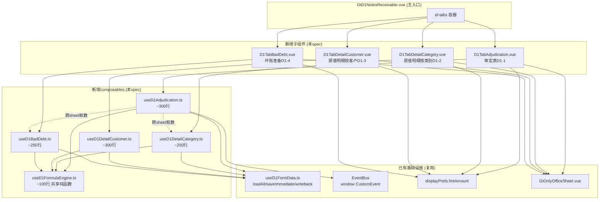
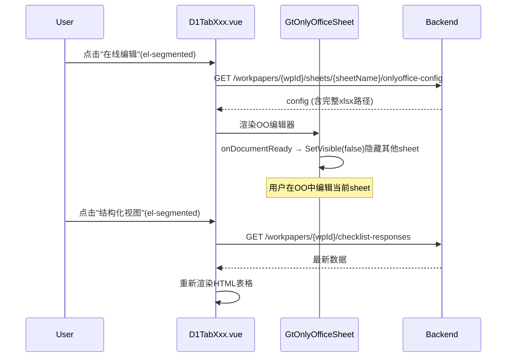

# Design Document: D1 审定表组件拆分

## Overview

将 `useD1NotesReceivable.ts`（1237行）中审定表D1-1、原值明细D1-2、原值明细D1-3、坏账准备D1-4 四个sheet的逻辑拆分为独立子组件+子composable。每个sheet成为独立的Vue组件（200-400行）配套独立composable，全部以HTML精美组件（el-table + 金额格式化 + 动态行）为主渲染模式，OnlyOffice仅作降级/偏好切换。

核心设计目标：
- 从1237行巨型composable中拆出~800行审定表相关逻辑
- 4个独立子组件 + 4个独立子composable + 1个共享公式引擎
- 跨sheet取数通过 `useD1FormData.loadSubWorkpaperData` 实现
- 双模式（HTML ↔ OO）不拆文件，OO API隐藏非当前sheet
- 持久化复用 checklist_responses 表 + useD1FormData 基础设施

## Architecture

### 组件依赖关系



### 文件结构

```
audit-platform/frontend/src/components/workpaper/
├── GtD1NotesReceivable.vue          # 主入口（修改：新增4个tab-pane引用子组件）
├── d1/                               # 新增目录
│   ├── D1TabAdjudication.vue         # 审定表D1-1（~350行）
│   ├── D1TabDetailCategory.vue       # 原值明细按类别D1-2（~300行）
│   ├── D1TabDetailCustomer.vue       # 原值明细按客户D1-3（~350行）
│   └── D1TabBadDebt.vue              # 坏账准备D1-4（~300行）
├── composables/
│   ├── useD1Adjudication.ts          # 审定表逻辑（~300行）
│   ├── useD1DetailCategory.ts        # 按类别明细逻辑（~250行）
│   ├── useD1DetailCustomer.ts        # 按客户明细逻辑（~300行）
│   ├── useD1BadDebt.ts               # 坏账准备逻辑（~250行）
│   └── useD1FormulaEngine.ts         # 共享公式纯函数（~100行）
│   └── useD1FormData.ts              # 已有，复用
│   └── useD1NotesReceivable.ts       # 已有，删除拆出部分

backend/app/routers/wp_render_strategies/
│   └── _d1_import_export.py          # 新增：导入导出端点（~200行）
```

### 与现有 useD1NotesReceivable 的拆分边界

| 拆出内容 | 原位置（行号范围） | 目标文件 |
|---------|-------------------|---------|
| `AdjudicationRow` 类型 + `ADJUDICATION_ROWS_CONFIG` | 55-70, 240-246 | useD1Adjudication.ts |
| `crossSheetData/d14Data/crossSheetValues` | 444-460 | useD1Adjudication.ts |
| `refreshCrossSheetData()` | 462-477 | useD1Adjudication.ts |
| `adjudicationRows` computed | 479-515 | useD1Adjudication.ts |
| 公式纯函数 `getAuditedAmount/getChangeRate` | 263-290 | useD1FormulaEngine.ts |
| `agingBands/eclSummary/migrationRateMatrix` | 620-700 | useD1BadDebt.ts |
| ECL公式函数 `calculateExpectedLossRate/calculateProvision/calculateDifference` | 292-310 | useD1FormulaEngine.ts |
| EventBus 审定表相关 `publishAdjudicated/watch adjudicationRows` | 1200-1260 | useD1Adjudication.ts |

拆分后 `useD1NotesReceivable.ts` 保留：Tab管理、程序表D1A、业务模式、背书贴现、贴息、监盘、质押、关联方、附注、调整分录 等逻辑（~500行）。

## Components and Interfaces

### 1. useD1FormulaEngine.ts — 共享纯函数模块

```typescript
// 所有公式为纯函数，无副作用，便于单元测试和PBT

/** 审定数 = 未审数 + AJE净额 + RJE净额（源模板公式 E8=B8+C8+D8，AJE/RJE为净额不分借贷） */
export function calcAuditedAmount(
  unadjusted: number, aje: number, rje: number
): number

/** 变动率: 期初=0且审定=0→'' | 期初=0→1 | 其他→(审定-期初)/期初 */
export function calcChangeRate(prior: number, audited: number): number | ''

/** 小计 = SUM(明细行对应列) */
export function calcSubtotal(rows: number[]): number

/** 净值 = 原值 - 坏账准备 */
export function calcNetValue(grossValue: number, badDebt: number): number

/** 增减比例绝对值是否超阈值 */
export function isChangeRateExceeding(rate: number | '', threshold: number): boolean

/** ECL迁徙率连乘 */
export function calcExpectedLossRate(migrationRates: number[]): number

/** 应计提 = 余额 × 损失率 */
export function calcProvision(balance: number, lossRate: number): number

/** 差异 = 实际 - 应计提 */
export function calcDifference(actual: number, should: number): number

/** 期末未审数 = 期初审定 + 计提 - 收回 - 转回 - 核销 + 其他 */
export function calcBadDebtEndBalance(
  priorAudited: number, provision: number, recovery: number,
  reversal: number, writeOff: number, other: number
): number

/** 解析数值(安全): null/undefined/空串/NaN → 0 */
export function parseNum(val: string | number | null | undefined): number
```

### 2. useD1Adjudication.ts — 审定表D1-1 composable

```typescript
export interface UseD1AdjudicationOptions {
  allResponses: Ref<Map<string, ChecklistResponse>>
  wpId: Ref<string>
  projectId: Ref<string>
  saveImmediate: SaveFn
  loadSubWorkpaperData: (subWpCode: string) => Promise<Record<string, string | number>>
  isReadonly: Ref<boolean>
  openReviewDialog?: (params: { sectionId: string; sectionLabel: string; relatedData?: Record<string, unknown> }) => void
}

export function useD1Adjudication(options: UseD1AdjudicationOptions) {
  // 返回:
  return {
    // 审定表三区块行数据（原值银行/商业/小计 + 坏账银行/商业/小计 + 净值银行/商业/小计）
    adjudicationSections: ComputedRef<AdjudicationSection[]>,
    // 跨sheet引用值（标记来源）
    crossSheetStatus: Ref<'loaded' | 'loading' | 'error'>,
    // 试算表差异行
    trialBalanceDiff: ComputedRef<TrialBalanceDiffRow>,
    // 审计说明
    auditNote: Ref<string>,
    // 操作
    refreshCrossSheetData: () => Promise<void>,
    updateCell: (rowKey: string, field: string, value: number) => void,
    saveAuditNote: (text: string) => void,
    // EventBus
    publishAdjudicated: () => void,
  }
}
```

### 3. useD1DetailCategory.ts — 原值明细(按类别) composable

```typescript
export interface CategoryRow {
  rowId: string          // 'fixed-bank' | 'fixed-commercial' | 'dynamic-{uuid}'
  category: string       // 票据种类名称
  isFixed: boolean       // 固定行不可删除
  priorUnadjusted: number
  priorAje: number
  priorRje: number
  priorAudited: number   // = prior + aje + rje (自动计算)
  currentIncrease: number
  currentDecrease: number
  currentUnadjusted: number  // 自动计算: = priorAudited + currentIncrease - currentDecrease（不可手填）
  currentAje: number
  currentRje: number
  currentAudited: number // = currentUnadjusted + aje + rje (自动计算)
}

export function useD1DetailCategory(options: UseD1BaseOptions) {
  return {
    rows: Ref<CategoryRow[]>,
    subtotalRow: ComputedRef<CategoryRow>,  // 自动SUM
    addRow: () => void,
    removeRow: (rowId: string) => void,
    updateCell: (rowId: string, field: string, value: number | string) => void,
  }
}
```

### 4. useD1DetailCustomer.ts — 原值明细(按客户) composable

```typescript
export interface CustomerRow {
  rowId: string
  customerName: string
  companyCode: string
  relationType: string    // '非关联方' | '关联方' | ''
  priorUnadjusted: number
  priorAje: number
  priorRje: number
  priorAudited: number
  currentIncrease: number
  currentDecrease: number
  currentBalance: number
  reclassification: number
  currentUnadjusted: number
  currentAje: number
  currentRje: number
  currentAudited: number
}

export function useD1DetailCustomer(options: UseD1BaseOptions & {
  relatedParties: Ref<string[]>  // 项目关联方名单
}) {
  return {
    rows: Ref<CustomerRow[]>,
    filteredRows: ComputedRef<CustomerRow[]>,  // 搜索过滤后
    subtotalRow: ComputedRef<CustomerRow>,
    searchQuery: Ref<string>,
    addRow: () => void,
    removeRow: (rowId: string) => void,
    updateCell: (rowId: string, field: string, value: number | string) => void,
    matchRelatedParty: (name: string) => string,
  }
}
```

### 5. useD1BadDebt.ts — 坏账准备明细表 composable

```typescript
export interface BadDebtRow {
  rowId: string
  category: 'individual' | 'portfolio'  // 按单项 | 按组合
  label: string
  isSubRow: boolean      // 是否为展开子行
  priorUnadjusted: number
  priorAje: number
  priorRje: number
  priorAudited: number
  currentProvision: number
  currentRecovery: number
  currentReversal: number
  currentWriteOff: number
  currentOther: number
  currentUnadjusted: number  // 自动计算
  currentAje: number
  currentRje: number
  currentAudited: number     // 自动计算
}

export function useD1BadDebt(options: UseD1BaseOptions & {
  eclTestTotal: Ref<number>  // ECL测试Tab结果，用于差异警告
}) {
  return {
    individualRows: Ref<BadDebtRow[]>,
    portfolioRows: Ref<BadDebtRow[]>,
    subtotalRow: ComputedRef<BadDebtRow>,
    eclDifference: ComputedRef<number>,   // 与ECL测试差异
    eclWarning: ComputedRef<string | null>,
    addSubRow: (category: 'individual' | 'portfolio') => void,
    removeSubRow: (rowId: string) => void,
    updateCell: (rowId: string, field: string, value: number) => void,
  }
}
```

### 6. 后端导入导出接口 — _d1_import_export.py

```python
# POST /api/workpapers/{wp_id}/d1/export-template?sheet=D1-2
# POST /api/workpapers/{wp_id}/d1/export-data?sheet=D1-2
# POST /api/workpapers/{wp_id}/d1/import-data?sheet=D1-2

async def export_template(wp_id: str, sheet: str) -> StreamingResponse:
    """生成空白xlsx模板（含表头+格式+公式，无数据行）"""

async def export_data(wp_id: str, sheet: str) -> StreamingResponse:
    """生成包含当前数据的xlsx"""

async def import_data(wp_id: str, sheet: str, file: UploadFile) -> dict:
    """解析上传xlsx，回写checklist_responses，返回摘要"""
```

### 7. 双模式切换流程



## Data Models

### checklist_responses item_id 命名规范

| Sheet | 前缀 | 示例 |
|-------|------|------|
| D1-1 审定表 | `D1-adj-` | `D1-adj-bank-acceptance-prior`, `D1-adj-bank-acceptance-current`, `D1-adj-bank-acceptance-aje-dr` |
| D1-1 审计说明 | `D1-adj-note` | `D1-adj-note` (remark字段存文本) |
| D1-1 试算表行 | `D1-adj-tb-` | `D1-adj-tb-amount` |
| D1-2 按类别 | `D1-cat-` | `D1-cat-rows` (remark存JSON数组) |
| D1-3 按客户 | `D1-cust-` | `D1-cust-rows` (remark存JSON数组) |
| D1-4 坏账准备 | `D1-bd-` | `D1-bd-individual-rows`, `D1-bd-portfolio-rows` (remark存JSON数组) |

### 审定表D1-1 三区块固定结构

```typescript
interface AdjudicationSection {
  sectionKey: 'gross' | 'bad-debt' | 'net-value'
  sectionLabel: string  // '一、应收票据原值' | '二、坏账准备' | '三、应收票据净值'
  rows: AdjudicationDetailRow[]
  subtotalRow: AdjudicationDetailRow  // 小计行（自动计算不可编辑）
}

interface AdjudicationDetailRow {
  rowKey: string
  label: string
  priorUnadjusted: number
  priorAje: number
  priorRje: number
  priorAudited: number     // = 未审 + AJE + RJE
  currentUnadjusted: number
  currentAje: number
  currentRje: number
  currentAudited: number   // = 未审 + AJE + RJE
  change: number           // = 期末审定 - 期初审定
  changeRate: number | ''  // = (期末-期初)/期初
  reasonAnalysis: string
  isFromCrossSheet: boolean
  isEditable: boolean      // 小计/净值行=false
}
```

### 动态行JSON存储格式（D1-2/D1-3/D1-4）

```json
// item_id: "D1-cat-rows", remark字段:
[
  {
    "rowId": "fixed-bank",
    "category": "银行承兑汇票",
    "isFixed": true,
    "priorUnadjusted": 1000000,
    "priorAje": 0,
    "priorRje": 0,
    "currentIncrease": 500000,
    "currentDecrease": 200000,
    "currentUnadjusted": 1300000,
    "currentAje": 0,
    "currentRje": 0
  },
  {
    "rowId": "dynamic-abc123",
    "category": "信用证",
    "isFixed": false,
    "priorUnadjusted": 0,
    ...
  }
]
```

### 跨Sheet取数映射

| D1-1目标行 | 数据来源 | item_id路径 |
|-----------|---------|------------|
| 原值-银行承兑(期初) | D1-2 小计行.priorAudited (银行承兑) | D1-cat-rows → filter(bank).priorAudited |
| 原值-银行承兑(期末) | D1-2 小计行.currentAudited (银行承兑) | D1-cat-rows → filter(bank).currentAudited |
| 原值-商业承兑(期初) | D1-2 小计行.priorAudited (商业承兑) | D1-cat-rows → filter(commercial).priorAudited |
| 原值-商业承兑(期末) | D1-2 小计行.currentAudited (商业承兑) | D1-cat-rows → filter(commercial).currentAudited |
| 坏账准备(期初) | D1-4 小计行.priorAudited | D1-bd-*-rows → sum(priorAudited) |
| 坏账准备(期末) | D1-4 小计行.currentAudited | D1-bd-*-rows → sum(currentAudited) |

新设计中跨sheet取数不再依赖 `loadSubWorkpaperData`（跨底稿API调用），而是在同一composable作用域内直接读取同底稿不同前缀的checklist_responses数据。因为D1-1/D1-2/D1-3/D1-4同属一个working_paper，数据在同一个 `allResponses` Map中。

**重要实现细节**：
- `useD1Adjudication` 接收与 `useD1DetailCategory`/`useD1BadDebt` 相同的 `allResponses` Ref
- 跨sheet取数 = 直接从 Map 中读取 `D1-cat-rows`/`D1-bd-individual-rows`/`D1-bd-portfolio-rows` 的 remark JSON
- 无需 API 调用，computed 自动响应式刷新（D1-2 编辑 → allResponses 变更 → D1-1 computed 重算）
- 原有 `refreshCrossSheetData()` 废弃，改为纯 computed 响应式链


## Correctness Properties

*A property is a characteristic or behavior that should hold true across all valid executions of a system—essentially, a formal statement about what the system should do. Properties serve as the bridge between human-readable specifications and machine-verifiable correctness guarantees.*

### Property 1: 审定数公式正确性

*For any* 三元组 (未审数, AJE净额, RJE净额)，其中各值为有限数值，`calcAuditedAmount` 的返回值应等于 `未审数 + AJE + RJE`（源模板公式 E=B+C+D，AJE/RJE列为净额）。

**Validates: Requirements 1.3, 4.5, 5.5, 6.3**

### Property 2: 变动额与变动率公式正确性

*For any* (期初审定数, 期末审定数) 对，变动额应等于 `期末 - 期初`；变动率应等于 `(期末-期初)/期初`（期初=0时特殊处理：审定也=0返回''，否则返回1）。

**Validates: Requirements 1.4**

### Property 3: 小计行恒等于明细行之和

*For any* 明细行列表（1~N行，每行含K个数值列），小计行的每个数值列应等于对应列所有明细行值的SUM。

**Validates: Requirements 1.5, 4.6, 5.6, 6.5**

### Property 4: 净值等于原值减坏账准备

*For any* (原值小计行, 坏账准备小计行) 对，净值行的每个数值列应等于 `原值对应列 - 坏账准备对应列`。

**Validates: Requirements 1.6**

### Property 5: 变动率阈值高亮判定

*For any* 变动率数值 r（非空），`isChangeRateExceeding(r, 0.3)` 应返回 true 当且仅当 `|r| > 0.3`。

**Validates: Requirements 1.7**

### Property 6: 跨Sheet数据流完整性

*For any* D1-2 类别行数据集和 D1-4 坏账行数据集，审定表D1-1中：原值区银行承兑行 = D1-2中银行承兑行数据，原值区商业承兑行 = D1-2中商业承兑行数据，坏账准备区 = D1-4全部行之和。

**Validates: Requirements 2.1, 2.2**

### Property 7: EventBus调整分录同步正确性

*For any* adjustment:created 事件 payload（含 entryType='AJE'|'RJE', amount, 科目），审定表对应行的 AJE/RJE 列应累加该金额。

**Validates: Requirements 3.1**

### Property 8: 动态行添加保持结构不变量

*For any* 当前行列表（长度N），执行 addRow() 后行列表长度应为 N+1，且新行位于小计行之前，新行所有数值字段为0。

**Validates: Requirements 4.3, 5.2**

### Property 9: 客户名称关联方自动匹配

*For any* 客户名称字符串和关联方名单列表，若客户名称存在于关联方名单中（模糊匹配），则 `matchRelatedParty` 返回 '关联方'；否则返回 '非关联方'。

**Validates: Requirements 5.3**

### Property 10: 客户搜索过滤正确性

*For any* 搜索关键字 q 和客户行列表，filteredRows 中每行的 customerName 应包含 q（大小写不敏感），且所有匹配行都应出现在结果中（无遗漏）。

**Validates: Requirements 5.7**

### Property 11: 坏账准备期末未审数公式

*For any* (期初审定, 计提, 收回, 转回, 核销, 其他) 六元组，`calcBadDebtEndBalance` 返回值应等于 `期初审定 + 计提 - 收回 - 转回 - 核销 + 其他`。

**Validates: Requirements 6.4**

### Property 12: ECL差异警告判定

*For any* (坏账准备小计审定数, ECL测试结果总额) 对，当两者不相等时应产生警告字符串（含差异金额）；相等时警告为 null。

**Validates: Requirements 6.6**

### Property 13: 动态行序列化Round-Trip

*For any* 有效的动态行数组（每行含完整字段），将其 JSON.stringify 序列化后再 JSON.parse 反序列化，结果应与原数组深度相等。扩展：导出xlsx再导入应还原等价的checklist_responses数据。

**Validates: Requirements 8.7, 9.3**

## Error Handling

| 场景 | 处理方式 |
|------|---------|
| 跨sheet数据加载失败 | 显示"-"占位符 + 黄色三角警告图标；crossSheetStatus='error' |
| checklist_responses API 失败 | ElMessage.warning提示；保留本地已有数据 |
| 导入xlsx格式不匹配 | 返回400 + 错误列名列表；前端ElMessage.error展示 |
| 导入xlsx行数超限(>500行) | 后端截断 + 返回警告摘要 |
| parseNum遇到NaN | 统一返回0（安全降级） |
| OnlyOffice健康检查失败 | 禁用"在线编辑"选项 + tooltip说明 |
| EventBus事件publish失败 | console.warn不阻塞主流程 |
| 动态行JSON解析失败 | 回退空数组 + ElMessage.warning |
| writebackTrialBalance失败 | ElMessage.warning提示手动确认 |
| 金额溢出（>Number.MAX_SAFE_INTEGER） | displayPrefs.fmtAmount内置处理 |

## Testing Strategy

### 单元测试（vitest）

- useD1FormulaEngine.ts 全部纯函数：边界值、零值、负数、NaN输入
- 各composable的computed逻辑：初始状态、添加/删除行后状态
- 金额格式化：千分位、负数括号、零值显示"-"、百分比
- 跨sheet数据映射：D1-2→D1-1、D1-4→D1-1 的取数逻辑
- EventBus事件payload结构验证
- 关联方匹配逻辑
- 搜索筛选逻辑

### Property-Based Tests（fast-check）

每个correctness property对应一个PBT测试，最少100次迭代。

库选择：**fast-check**（项目已有，前端PBT标准选择）

标签格式：`Feature: d1-adjudication-table, Property {N}: {title}`

| Property | 测试文件 | 生成器 |
|----------|---------|--------|
| P1 审定数公式 | `useD1FormulaEngine.spec.ts` | `fc.float({min:-1e9, max:1e9})` × 3 |
| P2 变动额/率 | `useD1FormulaEngine.spec.ts` | `fc.float` × 2 (含0边界) |
| P3 小计行 | `useD1FormulaEngine.spec.ts` | `fc.array(fc.float, {minLength:1, maxLength:20})` |
| P4 净值 | `useD1FormulaEngine.spec.ts` | `fc.float` × 2 |
| P5 阈值判定 | `useD1FormulaEngine.spec.ts` | `fc.float({min:-10, max:10})` |
| P6 跨Sheet流 | `useD1Adjudication.spec.ts` | 自定义 CategoryRow[] 生成器 |
| P7 EventBus同步 | `useD1Adjudication.spec.ts` | `fc.oneof('AJE','RJE')` + `fc.float` |
| P8 动态行添加 | `useD1DetailCategory.spec.ts` | `fc.array(CategoryRow)` |
| P9 关联方匹配 | `useD1DetailCustomer.spec.ts` | `fc.string` + `fc.array(fc.string)` |
| P10 搜索过滤 | `useD1DetailCustomer.spec.ts` | `fc.string` + `fc.array(CustomerRow)` |
| P11 坏账期末 | `useD1FormulaEngine.spec.ts` | `fc.float` × 6 |
| P12 ECL差异 | `useD1BadDebt.spec.ts` | `fc.float` × 2 |
| P13 Round-trip | `useD1DetailCategory.spec.ts` | 自定义 CategoryRow[] JSON生成器 |

### 后端集成测试（hypothesis）

- 导入导出round-trip：生成随机行数据→export→import→验证等价
- 模板格式校验：随机列名排列→验证错误检测

### 测试配置

```typescript
// fast-check 配置
fc.assert(fc.property(...), { numRuns: 100 })

// 标签示例
// Feature: d1-adjudication-table, Property 1: 审定数公式正确性
```

