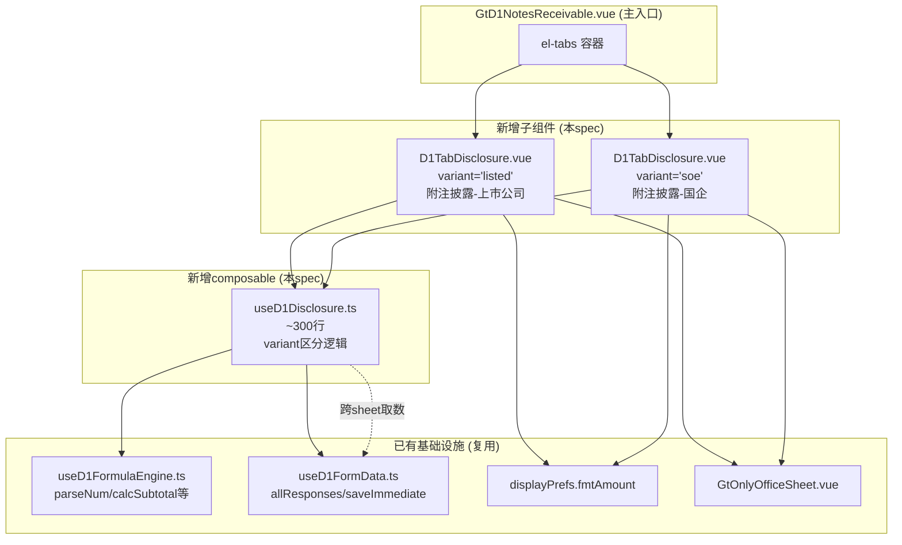
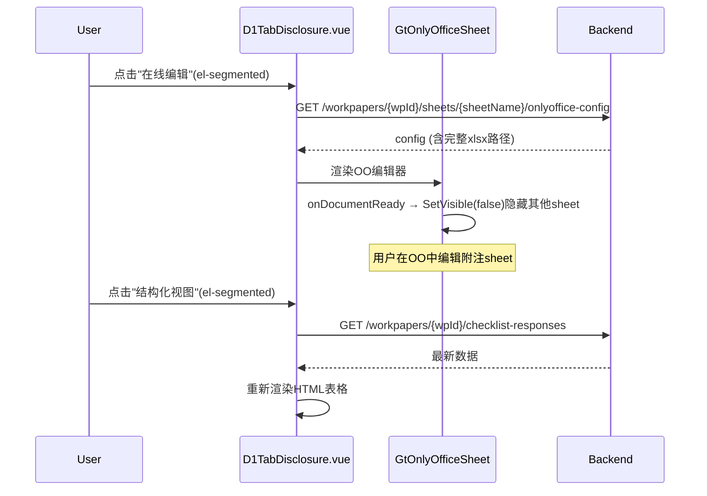

# Design Document: D1 附注披露组专属组件

## Overview

将 `useD1NotesReceivable.ts` 中附注披露（上市公司）和附注披露（国企）两个sheet的逻辑拆分为独立子组件+子composable。共用一个 composable `useD1Disclosure.ts`（~300行）通过 variant='listed'|'soe' 区分版本；共用一个 Vue 组件 `D1TabDisclosure.vue`（~350行）根据 variant 动态显示/隐藏子节，每个子节用 el-card 折叠卡片渲染。

核心设计目标：
- 上市版6子节 + 国企版7子节，通过 variant 控制显示逻辑
- 坏账分类子节最复杂（嵌套分组：单项/组合 × 期末/上年 × 银行/商业）
- 跨sheet取数从同一个 allResponses Map 读取 D1-adj- 前缀数据（纯 computed 响应式）
- 复用 useD1FormulaEngine.ts 公式纯函数
- 持久化用 checklist_responses 表（item_id 前缀 D1-disc-listed-/D1-disc-soe- 隔离）
- 双模式切换 + 导入导出三级

## Architecture

### 组件依赖关系



### 文件结构

```
audit-platform/frontend/src/components/workpaper/
├── d1/
│   ├── D1TabAdjudication.vue         # 已有(Spec 1)
│   ├── D1TabDetailCategory.vue       # 已有(Spec 1)
│   ├── D1TabDetailCustomer.vue       # 已有(Spec 1)
│   ├── D1TabBadDebt.vue              # 已有(Spec 1)
│   └── D1TabDisclosure.vue           # 新增：附注披露（~350行，variant双用）
├── composables/
│   ├── useD1FormulaEngine.ts         # 已有(Spec 1)，复用
│   ├── useD1FormData.ts              # 已有，复用
│   ├── useD1Disclosure.ts            # 新增：附注披露逻辑（~300行）
│   └── useD1NotesReceivable.ts       # 已有，删除拆出部分

backend/app/routers/wp_render_strategies/
│   └── _d1_disclosure_export.py      # 新增：附注披露导入导出（~150行）
```

### 子节结构对比（上市 vs 国企）

| 序号 | 上市版子节 | 国企版子节 | 共用逻辑 |
|------|-----------|-----------|---------|
| 1 | 质押票据(R14-19) | 票据分类(R5-10) | 质押/背书/转应收共用 |
| 2 | 背书贴现(R20-30) | 坏账分类(R11-25) | 坏账分类共用(列差异) |
| 3 | 转应收账款(R31-36) | 坏账变动(R45-59) | 坏账变动共用(行结构差异) |
| 4 | 坏账分类(R37-91) | 质押票据(R60-65) | - |
| 5 | 坏账变动(R92-106) | 背书贴现(R66-73) | - |
| 6 | 核销(R107-118) | 转应收+核销(R74-88) | - |
| 7 | - | (第7子节合并到第6) | - |

## Components and Interfaces

### 1. useD1Disclosure.ts — 附注披露 composable

```typescript
export type DisclosureVariant = 'listed' | 'soe'

export interface UseD1DisclosureOptions {
  allResponses: Ref<Map<string, ChecklistResponse>>
  wpId: Ref<string>
  projectId: Ref<string>
  variant: DisclosureVariant
  saveImmediate: SaveFn
  isReadonly: Ref<boolean>
}

// --- 子节数据模型 ---

/** 质押票据行 */
export interface PledgedRow {
  rowId: string
  category: string       // 票据种类
  isFixed: boolean
  pledgedAmount: number  // 期末质押金额
}

/** 背书贴现行 */
export interface EndorsedRow {
  rowId: string
  category: string
  isFixed: boolean
  derecognizedAmount: number   // 终止确认金额
  notDerecognizedAmount: number // 未终止确认金额
}

/** 转应收账款行 */
export interface TransferRow {
  rowId: string
  category: string
  isFixed: boolean
  transferAmount: number
}

/** 坏账分类行（期末/上年通用） */
export interface BadDebtClassRow {
  rowId: string
  label: string
  isFixed: boolean
  isGroupHeader: boolean  // 单项/组合分组头
  balance: number         // 账面余额
  ratio: number           // 比例(%) = IFERROR(balance / total, 0)
  provision: number       // 坏账准备
  lossRate: number        // 预期信用损失率(%) = IFERROR(provision / balance, 0)
  bookValue: number       // 账面价值 = balance - provision
}

/** 按单项明细行 */
export interface IndividualDetailRow {
  rowId: string
  name: string            // 名称
  isFixed: boolean
  balance: number         // 账面余额
  provision: number       // 坏账准备
  lossRate: number        // 预期信用损失率
  basis: string           // 计提依据
}

/** 按组合明细行 */
export interface PortfolioDetailRow {
  rowId: string
  drawerTypeOrAging: string  // 出票人类型或账龄
  isFixed: boolean
  balance: number            // 应收票据余额
  provision: number          // 坏账准备
  lossRate: number           // 预期信用损失率
}

/** 坏账变动行 */
export interface BadDebtMovementRow {
  rowId: string
  label: string           // 项目名（上市版只有合计；国企版=单项/组合/合计）
  isFixed: boolean
  priorBalance: number    // 上年末余额
  provision: number       // 本期计提
  reversal: number        // 本期转回
  writeOff: number        // 本期核销
  transfer: number        // 本期转销
  other: number           // 其他变动
  endBalance: number      // 期末余额 = prior + provision - reversal - writeOff - transfer + other
}

/** 重要转回明细行 */
export interface ReversalDetailRow {
  rowId: string
  isFixed: boolean
  companyName: string     // 单位名称
  reversalReason: string  // 转回原因
  originalMethod: string  // 原确认方式
  reversalBasis: string   // 转回依据
  amount: number          // 转回金额
}

/** 重要核销明细行 */
export interface WriteOffDetailRow {
  rowId: string
  isFixed: boolean
  companyName: string     // 单位名称
  noteType: string        // 票据性质
  amount: number          // 核销金额
  reason: string          // 核销原因
  procedure: string       // 履行程序情况
}

/** 票据分类行（国企专有） */
export interface CategorySummaryRow {
  rowId: string
  category: string
  isFixed: boolean
  endBalance: number      // 期末余额（跨sheet取数）
  endProvision: number    // 期末坏账准备（跨sheet取数）
  endBookValue: number    // 期末账面价值 = endBalance - endProvision
  priorBalance: number    // 期初余额（跨sheet取数）
  priorProvision: number  // 期初坏账准备（跨sheet取数）
  priorBookValue: number  // 期初账面价值 = priorBalance - priorProvision
}

export function useD1Disclosure(options: UseD1DisclosureOptions) {
  // 返回:
  return {
    // --- 通用 ---
    variant: DisclosureVariant,
    sectionOrder: ComputedRef<string[]>,  // 子节显示顺序
    isLoading: Ref<boolean>,

    // --- 跨sheet取数（顶部引用区/国企票据分类） ---
    crossSheetData: ComputedRef<{
      bankEndBalance: number
      bankPriorBalance: number
      bankEndProvision: number
      bankPriorProvision: number
      commercialEndBalance: number
      commercialPriorBalance: number
      commercialEndProvision: number
      commercialPriorProvision: number
    }>,
    crossSheetStatus: ComputedRef<'loaded' | 'empty'>,

    // --- 质押票据 ---
    pledgedRows: Ref<PledgedRow[]>,
    pledgedTotal: ComputedRef<PledgedRow>,
    addPledgedRow: () => void,
    removePledgedRow: (rowId: string) => void,

    // --- 背书贴现 ---
    endorsedRows: Ref<EndorsedRow[]>,
    endorsedTotal: ComputedRef<EndorsedRow>,
    addEndorsedRow: () => void,
    removeEndorsedRow: (rowId: string) => void,

    // --- 转应收账款 ---
    transferRows: Ref<TransferRow[]>,
    transferTotal: ComputedRef<TransferRow>,

    // --- 坏账分类（期末+上年 × 分类总表+单项明细+银行组合+商业组合）---
    classEndRows: Ref<BadDebtClassRow[]>,
    classEndTotal: ComputedRef<BadDebtClassRow>,
    classPriorRows: Ref<BadDebtClassRow[]>,
    classPriorTotal: ComputedRef<BadDebtClassRow>,
    individualEndRows: Ref<IndividualDetailRow[]>,
    individualPriorRows: Ref<IndividualDetailRow[]>,
    bankPortfolioEndRows: Ref<PortfolioDetailRow[]>,
    bankPortfolioPriorRows: Ref<PortfolioDetailRow[]>,
    commercialPortfolioEndRows: Ref<PortfolioDetailRow[]>,
    commercialPortfolioPriorRows: Ref<PortfolioDetailRow[]>,
    addIndividualRow: (period: 'end' | 'prior') => void,
    removeIndividualRow: (rowId: string, period: 'end' | 'prior') => void,
    addPortfolioRow: (type: 'bank' | 'commercial', period: 'end' | 'prior') => void,
    removePortfolioRow: (rowId: string, type: 'bank' | 'commercial', period: 'end' | 'prior') => void,

    // --- 坏账变动 ---
    movementRows: Ref<BadDebtMovementRow[]>,
    movementTotal: ComputedRef<BadDebtMovementRow>,
    reversalDetailRows: Ref<ReversalDetailRow[]>,
    reversalDetailTotal: ComputedRef<ReversalDetailRow>,
    addReversalRow: () => void,
    removeReversalRow: (rowId: string) => void,

    // --- 核销 ---
    writeOffAmount: Ref<number>,
    writeOffDetailRows: Ref<WriteOffDetailRow[]>,
    writeOffDetailTotal: ComputedRef<WriteOffDetailRow>,
    addWriteOffRow: () => void,
    removeWriteOffRow: (rowId: string) => void,

    // --- 国企专有：票据分类 ---
    categorySummaryRows: ComputedRef<CategorySummaryRow[]>,
    categorySummaryTotal: ComputedRef<CategorySummaryRow>,

    // --- 通用操作 ---
    updateCell: (section: string, rowId: string, field: string, value: number | string) => void,
  }
}
```

### 2. D1TabDisclosure.vue — 附注披露 Vue 组件

```vue
<template>
  <div class="d1-disclosure">
    <!-- 双模式切换 -->
    <div class="d1-disclosure__header">
      <el-tag>{{ variant === 'listed' ? '上市公司版' : '国企版' }}</el-tag>
      <el-segmented v-model="editorMode" :options="modeOptions" />
      <div class="d1-disclosure__toolbar">
        <el-button-group>
          <el-button @click="exportTemplate">导出模板</el-button>
          <el-button @click="exportData">导出数据</el-button>
          <el-upload :http-request="importData"><el-button>导入数据</el-button></el-upload>
        </el-button-group>
      </div>
    </div>

    <!-- HTML 结构化视图 -->
    <template v-if="editorMode === 'html'">
      <el-skeleton v-if="isLoading" :rows="10" animated />
      <template v-else>
        <!-- 跨sheet取数区（上市版顶部/国企版在票据分类子节） -->
        <div v-if="variant === 'listed'" class="cross-sheet-summary">
          <!-- 银行承兑/商业承兑 期末/期初 余额+坏账 -->
        </div>

        <!-- 按 sectionOrder 动态渲染子节 -->
        <el-card v-for="section in sectionOrder" :key="section" class="d1-section-card">
          <template #header>
            <span>{{ sectionLabels[section] }}</span>
            <el-button text @click="toggleSection(section)">
              {{ collapsedSections[section] ? '展开' : '收起' }}
            </el-button>
          </template>
          <component
            v-show="!collapsedSections[section]"
            :is="sectionComponents[section]"
            v-bind="sectionProps[section]"
          />
        </el-card>
      </template>
    </template>

    <!-- OnlyOffice 在线编辑 -->
    <GtOnlyOfficeSheet v-else :wp-id="wpId" :sheet-name="sheetName" />
  </div>
</template>
```

Props:
- `variant: 'listed' | 'soe'`
- `allResponses: Map<string, ChecklistResponse>`
- `wpId: string`
- `projectId: string`
- `isReadonly: boolean`

### 3. 后端导入导出 — _d1_disclosure_export.py

```python
# POST /api/workpapers/{wp_id}/d1/disclosure/export-template?variant=listed
# POST /api/workpapers/{wp_id}/d1/disclosure/export-data?variant=listed
# POST /api/workpapers/{wp_id}/d1/disclosure/import-data?variant=listed

async def export_template(wp_id: str, variant: str) -> StreamingResponse:
    """生成空白xlsx模板（含表头+格式，无数据行）"""

async def export_data(wp_id: str, variant: str) -> StreamingResponse:
    """生成包含当前数据的xlsx"""

async def import_data(wp_id: str, variant: str, file: UploadFile) -> dict:
    """解析上传xlsx，回写checklist_responses，返回摘要"""
```

### 4. 双模式切换流程



## Data Models

### checklist_responses item_id 命名规范

| 子节 | item_id | remark 存储内容 |
|------|---------|----------------|
| 质押票据(上市) | `D1-disc-listed-pledged-rows` | PledgedRow[] JSON |
| 背书贴现(上市) | `D1-disc-listed-endorsed-rows` | EndorsedRow[] JSON |
| 转应收(上市) | `D1-disc-listed-transfer-rows` | TransferRow[] JSON |
| 坏账分类-期末(上市) | `D1-disc-listed-class-end-rows` | BadDebtClassRow[] JSON |
| 坏账分类-上年(上市) | `D1-disc-listed-class-prior-rows` | BadDebtClassRow[] JSON |
| 单项明细-期末(上市) | `D1-disc-listed-individual-end-rows` | IndividualDetailRow[] JSON |
| 单项明细-上年(上市) | `D1-disc-listed-individual-prior-rows` | IndividualDetailRow[] JSON |
| 银行组合-期末(上市) | `D1-disc-listed-bank-portfolio-end-rows` | PortfolioDetailRow[] JSON |
| 银行组合-上年(上市) | `D1-disc-listed-bank-portfolio-prior-rows` | PortfolioDetailRow[] JSON |
| 商业组合-期末(上市) | `D1-disc-listed-commercial-portfolio-end-rows` | PortfolioDetailRow[] JSON |
| 商业组合-上年(上市) | `D1-disc-listed-commercial-portfolio-prior-rows` | PortfolioDetailRow[] JSON |
| 坏账变动(上市) | `D1-disc-listed-movement-rows` | BadDebtMovementRow[] JSON |
| 重要转回(上市) | `D1-disc-listed-reversal-rows` | ReversalDetailRow[] JSON |
| 核销金额(上市) | `D1-disc-listed-writeoff-amount` | 单值 |
| 核销明细(上市) | `D1-disc-listed-writeoff-rows` | WriteOffDetailRow[] JSON |
| 国企版 | `D1-disc-soe-{同上}` | 同上结构，前缀替换 |

### 跨Sheet取数映射

| 附注目标字段 | 数据来源 | allResponses路径 |
|-------------|---------|-----------------|
| 银行承兑-期末余额 | 审定表D1-1 原值区银行承兑行.currentAudited | `D1-adj-gross-bank-current-audited` |
| 银行承兑-期初余额 | 审定表D1-1 原值区银行承兑行.priorAudited | `D1-adj-gross-bank-prior-audited` |
| 银行承兑-期末坏账 | 审定表D1-1 坏账区银行承兑行.currentAudited | `D1-adj-baddebt-bank-current-audited` |
| 银行承兑-期初坏账 | 审定表D1-1 坏账区银行承兑行.priorAudited | `D1-adj-baddebt-bank-prior-audited` |
| 商业承兑-期末余额 | 审定表D1-1 原值区商业承兑行.currentAudited | `D1-adj-gross-commercial-current-audited` |
| 商业承兑-期初余额 | 审定表D1-1 原值区商业承兑行.priorAudited | `D1-adj-gross-commercial-prior-audited` |
| 商业承兑-期末坏账 | 审定表D1-1 坏账区商业承兑行.currentAudited | `D1-adj-baddebt-commercial-current-audited` |
| 商业承兑-期初坏账 | 审定表D1-1 坏账区商业承兑行.priorAudited | `D1-adj-baddebt-commercial-prior-audited` |

**重要实现细节**：
- `useD1Disclosure` 接收与 `useD1Adjudication` 相同的 `allResponses` Ref
- 跨sheet取数 = 直接从 Map 中读取 `D1-adj-*` 前缀的 response.value 字段
- 纯 computed 响应式：审定表编辑 → allResponses 变更 → 附注 computed 重算
- 无需 API 调用，无延迟

### 与 d1-adjudication-table (Spec 1) 的数据契约

| 附注读取的 item_id | 来源 (Spec 1 useD1Adjudication 写入) | 含义 |
|-------------------|--------------------------------------|------|
| `D1-adj-gross-bank-current-audited` | 审定表原值区银行承兑行.currentAudited | 银行承兑期末审定数 |
| `D1-adj-gross-bank-prior-audited` | 审定表原值区银行承兑行.priorAudited | 银行承兑期初审定数 |
| `D1-adj-gross-commercial-current-audited` | 审定表原值区商业承兑行.currentAudited | 商业承兑期末审定数 |
| `D1-adj-gross-commercial-prior-audited` | 审定表原值区商业承兑行.priorAudited | 商业承兑期初审定数 |
| `D1-adj-baddebt-bank-current-audited` | 审定表坏账区银行承兑行.currentAudited | 银行承兑坏账期末审定数 |
| `D1-adj-baddebt-bank-prior-audited` | 审定表坏账区银行承兑行.priorAudited | 银行承兑坏账期初审定数 |
| `D1-adj-baddebt-commercial-current-audited` | 审定表坏账区商业承兑行.currentAudited | 商业承兑坏账期末审定数 |
| `D1-adj-baddebt-commercial-prior-audited` | 审定表坏账区商业承兑行.priorAudited | 商业承兑坏账期初审定数 |

**约定**：Spec 1 的 `useD1Adjudication.ts` 在保存审定表数据时，必须使用上述 item_id 格式写入 allResponses/checklist_responses。Spec 2 的 `useD1Disclosure.ts` 从这些 key 读取数据。两个 spec 通过此 item_id 命名契约解耦。

### 提示文字常量定义

```typescript
/** 源模板中各子节的编制提示文字（红/绿色字体内容）→ 只读折叠区 */
export const DISCLOSURE_GUIDANCE: Record<string, string[]> = {
  top: [
    '企业因销售商品、提供服务等取得的、不属于《中华人民共和国票据法》规范票据的"云信"、"融信"等数字化应收账款债权凭证...',
  ],
  endorsed: [
    '证监会《2014年上市公司年报会计监管报告》，对已背书或贴现且尚未到期的银行承兑汇票予以终止确认后...',
    '终止确认判断标准：信用等级较高→终止确认；信用等级不高→未终止确认',
  ],
  badDebtClassification: [
    '此处披露未逾期的应收票据计提的坏账准备。若票据逾期，则应转入应收账款并计提坏账准备，账龄应连续计算',
  ],
  writeOff: [
    '对于其中重要的应收票据，应逐项披露款项性质、核销原因、履行的核销程序及核销金额。实际核销的款项由关联交易产生的，应单独披露',
  ],
}

/** 适用性判断模板文本（用户选择适用场景后预填的可编辑文本） */
export const ENDORSED_JUDGMENT_TEMPLATES: Record<string, string> = {
  derecognized: '用于贴现的银行承兑汇票是由信用等级较高的银行承兑，信用风险和延期付款风险很小，并且票据相关的利率风险已转移给银行，可以判断票据相关的所有风险和报酬已经转移。根据上述主要风险和报酬已经转移，故终止确认。',
  notDerecognized: '用于贴现的银行承兑汇票是由信用等级不高的银行承兑，贴现不影响追索权，票据相关的信用风险和延期付款风险仍没有转移，故未终止确认。',
}

export type EndorsedJudgment = 'derecognized' | 'notDerecognized' | 'both'
```

### "说明"文本区的三种模式

底稿中的"说明"文本区分为三种交互模式（由源模板结构决定）：

| 模式 | 对应位置 | 交互方式 |
|------|---------|---------|
| **纯文本说明** | R12 顶部"说明："、R90 坏账分类说明 | textarea 直接编辑，双向回写附注 |
| **适用性判断+预填** | R27-30 背书贴现终止确认判断 | 先 el-radio 选场景(终止/未终止/均有)→预填模板→可编辑→双向回写 |
| **动态行提示** | R18/R24 "可无限量添加行"、R26 "上面各张表均可添加行项目" | 浅灰色占位行（点击→addRow），不存储，纯交互提示 |

每种模式持久化方式不同：
- 纯文本：item_id = `D1-disc-{variant}-note-{sectionKey}`，remark = 文本
- 适用性判断：item_id = `D1-disc-{variant}-judgment-{sectionKey}`，conclusion = 判断值('derecognized'/'notDerecognized'/'both')，remark = 编辑后文本
- 动态行提示：不持久化（纯前端 UI 行为）

### 行类型定义

```typescript
export type RowType = 'fixed' | 'dynamic' | 'summary'

export interface BaseDisclosureRow {
  rowId: string
  rowType: RowType
  // ... 各子节特有字段
}
```

每个子节的表格行类型分布：
- 质押/背书/转应收：2固定行(银行+商业) + N浮动行 + 1合计行
- 坏账分类总表：2固定行(单项+组合) + 组合下2固定子行(银行+商业) + 1合计行（全固定，无浮动）
- 按单项明细：全浮动行 + 1合计行
- 按组合明细（银行/商业）：全浮动行(出票人类型/账龄) + 1合计行
- 坏账变动：上市版1固定行 / 国企版3固定行(单项+组合+合计)（全固定，无浮动）
- 重要转回/核销明细：全浮动行 + 1合计行

### 联动跳转配置

```typescript
/** GtIndexChip 跳转目标配置 */
export const DISCLOSURE_LINKAGE: Record<string, { targetTab: string; label: string; icon?: string }> = {
  'cross-sheet-bank': { targetTab: 'adjudication', label: '审定表D1-1' },
  'cross-sheet-commercial': { targetTab: 'adjudication', label: '审定表D1-1' },
  'bad-debt-class': { targetTab: 'bad-debt', label: '坏账准备D1-4' },
  'bad-debt-movement': { targetTab: 'bad-debt', label: '坏账准备D1-4' },
  'note-module': { targetTab: 'external:note', label: '附注全文' },
}
```

### 说明文本与附注模块双向回写设计

```typescript
/**
 * "说明："textarea（可编辑）vs "【提示：】"折叠区（只读）的区分：
 * - "说明：" = 用户编写的文本，对上方表格数据的补充说明，内容同步到附注模块
 * - "【提示：】" = 源模板固定指导文字，告诉用户何时/如何编写说明，不可编辑
 */

/** 说明文本双向同步事件 */
export interface DisclosureNoteTextEvent {
  wpCode: string
  variant: 'listed' | 'soe'
  sectionKey: string        // 如 'top'(顶部说明)、'endorsed'(背书贴现说明)、'bad-debt-class'(坏账分类说明)
  content: string           // 说明文本内容
  updatedBy: string         // 用户ID
  updatedAt: string         // ISO timestamp
}

// 发布：披露表 → 附注模块
eventBus.publish('disclosure:note-text-updated', payload as DisclosureNoteTextEvent)

// 监听：附注模块 → 披露表
eventBus.on('note:section-updated', (payload) => {
  if (payload.wpCode === currentWpCode && payload.sectionKey === currentSectionKey) {
    noteTextRefs[sectionKey].value = payload.content
  }
})
```

存储：
- item_id = `D1-disc-{variant}-note-{sectionKey}`（如 `D1-disc-listed-note-top`）
- remark = 说明文本内容
- 附注模块通过 cross_wp_references 的 ref_id 关联到相同的 item_id

冲突解决：last-write-wins（以最后保存的 updatedAt 为准），前端 tooltip 显示"最近由xxx在xxx更新"。

### 公式计算逻辑

| 公式 | 对应源模板 | 实现 |
|------|-----------|------|
| 比例 = balance / totalBalance | IFERROR(x/$B$49, 0) | `parseNum(balance) / parseNum(total) \|\| 0` |
| 损失率 = provision / balance | IFERROR(坏账/余额, 0) | `parseNum(provision) / parseNum(balance) \|\| 0` |
| 账面价值 = balance - provision | 余额-坏账 | `calcNetValue(balance, provision)` |
| 期末 = prior + provision - reversal - writeOff - transfer + other | 源模板期末公式 | `calcBadDebtEndBalance(...)` |
| 合计 = SUM(明细行) | SUM() | `calcSubtotal(rows.map(r => r.field))` |

所有公式复用 `useD1FormulaEngine.ts` 已有纯函数。新增一个辅助函数：

```typescript
/** 安全除法: divisor=0时返回0 */
export function safeDivide(numerator: number, divisor: number): number {
  return divisor === 0 ? 0 : numerator / divisor
}
```

## Correctness Properties

### Property 1: 比例计算正确性（IFERROR语义）

*For any* (余额, 合计) 对，当合计=0时比例=0；否则比例=余额/合计。对应源模板 IFERROR(x/$B$49, 0)。

**Validates: Requirements 5.4**

### Property 2: 预期信用损失率计算正确性

*For any* (坏账准备, 账面余额) 对，当余额=0时损失率=0；否则损失率=坏账准备/余额。

**Validates: Requirements 5.5, 6.2, 7.3**

### Property 3: 账面价值等于余额减坏账

*For any* (账面余额, 坏账准备) 对，账面价值=余额-坏账准备。

**Validates: Requirements 5.6, 10.3**

### Property 4: 合计行恒等于明细行之和

*For any* 明细行列表（1~N行，每行含K个数值列），合计行的每个数值列应等于对应列所有明细行值的SUM。

**Validates: Requirements 2.5, 3.4, 4.3, 5.7, 8.7, 9.4**

### Property 5: 坏账变动期末余额公式

*For any* (上年末, 计提, 转回, 核销, 转销, 其他) 六元组，期末余额=上年末+计提-转回-核销-转销+其他。

**Validates: Requirements 8.2**

### Property 6: 动态行添加保持结构不变量

*For any* 当前行列表（长度N），执行 addRow() 后行列表长度应为 N+1，且新行所有数值字段为0。

**Validates: Requirements 2.3, 3.3, 6.3, 8.6, 9.3**

### Property 7: 跨Sheet取数响应式一致性

*For any* D1-adj-* 数据集，附注中的 crossSheetData 字段值应等于 allResponses Map 中对应 key 的 value（parseNum后）。

**Validates: Requirements 10.2, 11.2, 11.3**

### Property 8: 动态行序列化 Round-Trip

*For any* 有效的动态行 JSON 数组，JSON.stringify 后再 JSON.parse 结果应与原数组深度相等。

**Validates: Requirements 13.4, 13.5**

### Property 9: 变体子节顺序正确性

*For any* variant 值（'listed'|'soe'），sectionOrder 返回的数组应严格匹配对应版本的子节顺序定义。

**Validates: Requirements 1.2, 1.3**

### Property 10: safeDivide 安全除法

*For any* (分子, 分母) 对，当分母=0时返回0；否则返回分子/分母。

**Validates: Requirements 5.4, 5.5, 6.2, 7.3**

## Error Handling

| 场景 | 处理方式 |
|------|---------|
| 跨sheet D1-adj-* 数据不存在 | 显示"-"占位符 + 黄色三角警告图标；crossSheetStatus='empty' |
| checklist_responses API 失败 | ElMessage.warning 提示；保留本地已有数据 |
| 动态行 JSON 解析失败 | 回退空数组 + ElMessage.warning |
| 导入xlsx格式不匹配 | 返回400 + 错误列名列表；前端 ElMessage.error 展示 |
| OnlyOffice 健康检查失败 | 禁用"在线编辑"选项 + tooltip 说明 |
| parseNum 遇到 NaN | 统一返回 0（安全降级） |
| safeDivide 分母为 0 | 返回 0（对应 IFERROR 语义） |

## Testing Strategy

### 单元测试（vitest）

- useD1Disclosure.ts 各子节数据模型初始化
- 公式计算：safeDivide、比例、损失率、账面价值
- 跨sheet取数映射：D1-adj-* → crossSheetData
- 动态行 CRUD：添加/删除/更新
- 变体子节顺序：listed 6子节 / soe 7子节
- 金额格式化集成

### Property-Based Tests（fast-check）

| Property | 测试文件 | 生成器 |
|----------|---------|--------|
| P1 比例计算 | `useD1Disclosure.spec.ts` | `fc.float({min:-1e9, max:1e9})` × 2 |
| P2 损失率 | `useD1Disclosure.spec.ts` | `fc.float` × 2 (含0边界) |
| P3 账面价值 | `useD1Disclosure.spec.ts` | `fc.float` × 2 |
| P4 合计行 | `useD1Disclosure.spec.ts` | `fc.array(fc.float, {minLength:1, maxLength:20})` |
| P5 坏账变动期末 | `useD1Disclosure.spec.ts` | `fc.float` × 6 |
| P6 动态行添加 | `useD1Disclosure.spec.ts` | `fc.array(PledgedRow生成器)` |
| P7 跨Sheet取数 | `useD1Disclosure.spec.ts` | 自定义 Map<string, {value: string}> 生成器 |
| P8 Round-trip | `useD1Disclosure.spec.ts` | 自定义各类 Row[] JSON 生成器 |
| P9 变体顺序 | `useD1Disclosure.spec.ts` | `fc.oneof('listed', 'soe')` |
| P10 safeDivide | `useD1Disclosure.spec.ts` | `fc.float` × 2 (含0) |

### 测试配置

```typescript
// fast-check 配置
fc.assert(fc.property(...), { numRuns: 100 })

// 标签格式
// Feature: d1-disclosure-note, Property {N}: {title}
```
