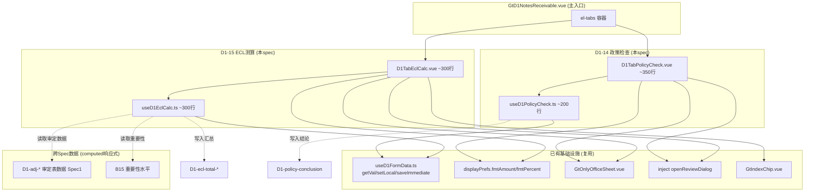
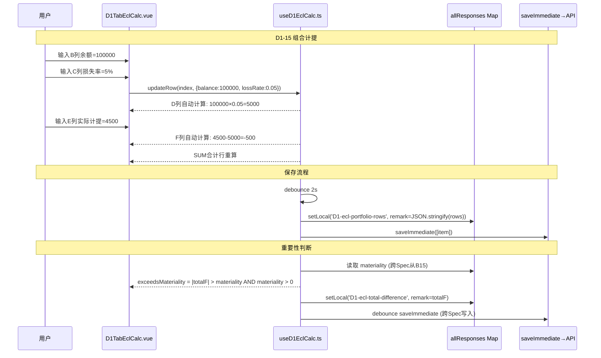

# Design Document: D1 ECL坏账准备专属组件

## Overview

将 `useD1NotesReceivable.ts`（1237行）中ECL坏账准备相关的D1-14/D1-15两个sheet的逻辑拆分为2个独立子组件+2个独立子composable。

- **D1-14 应收票据坏账准备会计政策检查**：d-form-paragraph类型，左右分栏段落式布局（左60%政策描述 / 右40%审计师核查意见），包含5个section（审计目标/政策概述/ECL模型描述/政策变更/审计结论），无动态表格。
- **D1-15 应收票据坏账准备测算表**：univer类型8列计算表，分2个section（按组合计提 rows 13-18 + 按单项计提 rows 20-24），公式简单：D=B×C / F=E-D / SUM合计行。

架构：2 Vue组件 + 2 composable，每文件200-400行。HTML精美组件为主渲染模式，OnlyOffice仅作降级/偏好切换。

核心设计挑战：
- D1-14段落式左右分栏布局的5个section渲染+独立item_id持久化
- D1-15的D=B×C / F=E-D公式引擎 + 组合/单项两section各自SUM + 总合计
- 动态行增删（组合预设5行/单项预设3行）+ 行数据JSON持久化
- 跨Spec读取重要性水平（B15）+ 跨Spec写入汇总结果
- 损失率输入校验clamp[0,1] + 金额格式化（负数括号/零显示"-"）

## Architecture

### 组件依赖关系



### 数据流



### 文件结构

```
audit-platform/frontend/src/components/workpaper/
├── GtD1NotesReceivable.vue              # 主入口（修改：新增2个tab-pane）
├── d1/
│   ├── D1TabPolicyCheck.vue             # D1-14 政策检查（~350行）
│   └── D1TabEclCalc.vue                 # D1-15 ECL测算（~300行）
├── composables/
│   ├── useD1PolicyCheck.ts              # D1-14 逻辑（~200行）
│   └── useD1EclCalc.ts                  # D1-15 逻辑（~300行）
```

## Components and Interfaces

### 1. useD1PolicyCheck.ts — D1-14政策检查 composable (~200行)

```typescript
// ═══════════════════════════════════════════════════════════════════════════
// 类型定义
// ═══════════════════════════════════════════════════════════════════════════

export type PolicyConclusion = '合理' | '基本合理但需关注' | '不合理' | ''
export type PolicyChangeFlag = '是' | '否' | ''

export interface PolicySectionData {
  sectionId: string           // section标识
  leftContent: string         // 左侧政策描述文本
  rightOpinion: string        // 右侧审计师核查意见
}

export interface UseD1PolicyCheckOptions {
  allResponses: Ref<Map<string, ChecklistResponse>>
  wpId: Ref<string>
  projectId: Ref<string>
  saveImmediate: SaveFn
  debouncedSave: SaveFn
  isReadonly: Ref<boolean>
}

// ═══════════════════════════════════════════════════════════════════════════
// Composable 导出接口
// ═══════════════════════════════════════════════════════════════════════════

export function useD1PolicyCheck(options: UseD1PolicyCheckOptions) {
  return {
    // ─── Section 2: 政策概述 ───
    policyOverviewLeft: Ref<string>,          // 左侧政策描述
    policyOverviewRight: Ref<string>,         // 右侧审计师意见 (J22:R22)
    savePolicyOverview: () => void,           // debounce保存

    // ─── Section 3: ECL模型描述 ───
    eclModelPortfolio: Ref<string>,           // 组合评估方法textarea
    eclModelIndividual: Ref<string>,          // 单项评估标准textarea
    eclModelMigration: Ref<string>,           // 迁徙率法参数textarea
    eclModelRight: Ref<string>,              // 右侧审计师意见 (J31:R31)
    saveEclModel: () => void,

    // ─── Section 4: 政策变更 ───
    policyChangeFlag: Ref<PolicyChangeFlag>,  // 是/否
    policyChangeContent: Ref<string>,         // 变更内容 (B38:I38)
    policyChangeReason: Ref<string>,          // 变更原因 (B39:I39)
    showPolicyChangeDetails: ComputedRef<boolean>,  // flag==='是'时展开
    setPolicyChangeFlag: (flag: PolicyChangeFlag) => void,  // 立即保存
    savePolicyChange: () => void,

    // ─── Section 5: 审计结论 ───
    policyConclusion: Ref<PolicyConclusion>,
    conclusionText: Ref<string>,
    setPolicyConclusion: (c: PolicyConclusion) => void,  // 立即保存
    saveConclusionText: () => void,

    // ─── 加载状态 ───
    isLoading: Ref<boolean>,
    hydrate: () => void,
  }
}
```

### 2. useD1EclCalc.ts — D1-15 ECL测算 composable (~300行)

```typescript
// ═══════════════════════════════════════════════════════════════════════════
// 类型定义
// ═══════════════════════════════════════════════════════════════════════════

export interface EclRow {
  id: string                  // 行唯一标识（nanoid）
  debtor: string              // A: 债务人名称
  balance: number             // B: 审定应收票据账面余额
  lossRate: number            // C: 预期信用损失率 [0,1]（内部小数存储）
  shouldProvision: number     // D: 期末应计提 = B×C（computed只读）
  actualProvision: number     // E: 期末坏账准备账面余额
  difference: number          // F: 差异 = E-D（computed只读）
  basis: string               // G: 计提依据及文件
  indexRef: string            // H: 索引号
}

export interface SumRow {
  balance: number             // SUM(B)
  shouldProvision: number     // SUM(D)
  actualProvision: number     // SUM(E)
  difference: number          // SUM(F)
}

export interface UseD1EclCalcOptions {
  allResponses: Ref<Map<string, ChecklistResponse>>
  wpId: Ref<string>
  projectId: Ref<string>
  saveImmediate: SaveFn
  debouncedSave: SaveFn
  isReadonly: Ref<boolean>
}

// ═══════════════════════════════════════════════════════════════════════════
// Composable 导出接口
// ═══════════════════════════════════════════════════════════════════════════

export function useD1EclCalc(options: UseD1EclCalcOptions) {
  return {
    // ─── 组合计提 Section (Portfolio) ───
    portfolioRows: Ref<EclRow[]>,             // 动态行数据（预设5行）
    addPortfolioRow: () => void,              // 添加组合行
    removePortfolioRow: (index: number) => void,
    portfolioSumRow: ComputedRef<SumRow>,     // 组合合计行

    // ─── 单项计提 Section (Individual) ───
    individualRows: Ref<EclRow[]>,            // 动态行数据（预设3行）
    addIndividualRow: () => void,             // 添加单项行
    removeIndividualRow: (index: number) => void,
    individualSumRow: ComputedRef<SumRow>,    // 单项合计行

    // ─── 总合计 ───
    grandTotalRow: ComputedRef<SumRow>,       // = 组合合计 + 单项合计

    // ─── 重要性判断 ───
    materialityThreshold: ComputedRef<number>,  // 从B15跨Spec读取
    exceedsMateriality: ComputedRef<boolean>,   // |grandTotal.difference| > materiality AND materiality > 0

    // ─── 审计说明/结论 ───
    auditNote: Ref<string>,
    auditConclusion: Ref<string>,
    saveAuditNote: () => void,
    saveAuditConclusion: () => void,

    // ─── 导入导出 ───
    exportTemplate: () => void,
    exportData: () => void,
    importData: (file: File) => Promise<ImportResult>,

    // ─── 加载状态 ───
    isLoading: Ref<boolean>,
    hydrate: () => void,
  }
}
```

### 3. D1TabPolicyCheck.vue — 组件结构 (~350行)

```typescript
// Props
interface Props {
  wpId: string
  projectId: string
  allResponses: Map<string, ChecklistResponse>
  isReadonly?: boolean
  displayPrefs: DisplayPrefs
}

// Template 结构概要：
// <el-segmented> 结构化视图 | 在线编辑
// <el-skeleton v-if="isLoading" />
// <div v-else class="policy-check-form">
//
//   <!-- Section 1: 底稿抬头 + 审计目标 -->
//   <div class="section-header">致同/应收票据坏账准备/entity/period/index/page</div>
//   <el-alert type="info">审计目标文本（全宽只读）</el-alert>
//
//   <!-- Section 2: 政策概述 (左右分栏) -->
//   <el-row :gutter="16">
//     <el-col :lg="14" :md="12">  <!-- 左60% -->
//       <div class="left-panel bg-gray">
//         <textarea>ECL方法概述</textarea>
//         <textarea>组合评估范围</textarea>
//         <textarea>账龄划分标准</textarea>
//         <textarea>损失率确定依据</textarea>
//       </div>
//     </el-col>
//     <el-col :lg="10" :md="12">  <!-- 右40% -->
//       <div class="right-panel" :class="{'filled': policyOverviewRight}">
//         <textarea>审计师核查意见 (J22:R22)</textarea>
//       </div>
//     </el-col>
//   </el-row>
//
//   <!-- Section 3: ECL模型描述 (左右分栏) -->
//   <el-row :gutter="16">
//     <el-col :lg="14" :md="12">
//       <textarea>组合评估方法</textarea>
//       <textarea>单项评估标准</textarea>
//       <textarea>迁徙率法参数</textarea>
//     </el-col>
//     <el-col :lg="10" :md="12">
//       <textarea>审计师核查意见 (J31:R31)</textarea>
//     </el-col>
//   </el-row>
//
//   <!-- Section 4: 政策变更 -->
//   <el-radio-group v-model="policyChangeFlag">是 / 否</el-radio-group>
//   <div v-if="showPolicyChangeDetails">
//     <textarea>变更内容 (B38:I38)</textarea>
//     <textarea>变更原因 (B39:I39)</textarea>
//   </div>
//   <span v-else class="text-gray">本期无政策变更</span>
//
//   <!-- Section 5: 审计结论 -->
//   <el-radio-group v-model="policyConclusion">合理/基本合理但需关注/不合理</el-radio-group>
//   <textarea v-model="conclusionText" />
//   <el-button>🤖AI生成</el-button>
//   <el-button>💬复核对话</el-button>
//   <details class="guidance-details">编制提示（CAS22/CAS28等）</details>
//
// </div>
// <GtOnlyOfficeSheet v-if="isOOMode" />
```

### 4. D1TabEclCalc.vue — 组件结构 (~300行)

```typescript
// Props（同D1TabPolicyCheck）

// Template 结构概要：
// <el-segmented> 结构化视图 | 在线编辑
// <el-skeleton v-if="isLoading" />
// <div v-else class="ecl-calc-table">
//
//   <!-- Section 1: 按组合计提 (Portfolio) -->
//   <el-divider>按组合计提</el-divider>
//   <el-table :data="portfolioRows" border>
//     <el-table-column label="债务人名称" prop="debtor">  <!-- A -->
//     <el-table-column label="审定余额" prop="balance" align="right">  <!-- B -->
//     <el-table-column label="预期信用损失率" prop="lossRate" align="center">  <!-- C -->
//     <el-table-column label="应计提" prop="shouldProvision" align="right">  <!-- D 只读灰色 -->
//     <el-table-column label="账面余额" prop="actualProvision" align="right">  <!-- E -->
//     <el-table-column label="差异" prop="difference" align="right">  <!-- F 只读灰色 -->
//     <el-table-column label="计提依据" prop="basis">  <!-- G -->
//     <el-table-column label="索引号" prop="indexRef">  <!-- H: GtIndexChip -->
//   </el-table>
//   <!-- 合计行(固定底部): portfolioSumRow -->
//   <el-button @click="addPortfolioRow">+ 添加组合</el-button>
//
//   <!-- Section 2: 按单项计提 (Individual) -->
//   <el-divider>按单项计提</el-divider>
//   <el-table :data="individualRows" border>
//     <!-- 同上8列 -->
//   </el-table>
//   <!-- 合计行: individualSumRow -->
//   <el-button @click="addIndividualRow">+ 添加单项</el-button>
//
//   <!-- 总合计行: grandTotalRow -->
//   <div class="grand-total-row">组合合计 + 单项合计</div>
//
//   <!-- 差异分析卡片 -->
//   <el-card class="diff-analysis">
//     组合差异合计 | 单项差异合计 | 差异总额 | 重要性水平 | 是否超重要性
//     <div v-if="exceedsMateriality" class="exceed-warning">⚠️超重要性水平</div>
//     <div v-else class="within-ok">✓未超重要性水平</div>
//   </el-card>
//
//   <!-- 审计说明 + 审计结论 -->
//   <textarea v-model="auditNote" /> + 🤖AI + 💬复核
//   <textarea v-model="auditConclusion" /> + 🤖AI + 💬复核
//   <details class="guidance-details">编制提示（D=B×C/F=E-D/不重复覆盖/超重要性建议）</details>
//
// </div>
// <GtOnlyOfficeSheet v-if="isOOMode" />
```

### 5. 纯函数（从composable导出，供PBT测试）

```typescript
/** 应计提 = 余额 × 损失率 (D=B×C) */
export function calculateShouldProvision(balance: number, lossRate: number): number {
  return balance * lossRate
}

/** 差异 = 实际计提 - 应计提 (F=E-D) */
export function calculateDifference(actualProvision: number, shouldProvision: number): number {
  return actualProvision - shouldProvision
}

/** SUM合计行：对rows数组的指定数值字段求和 */
export function calculateSumRow(rows: EclRow[]): SumRow {
  return {
    balance: rows.reduce((s, r) => s + r.balance, 0),
    shouldProvision: rows.reduce((s, r) => s + r.shouldProvision, 0),
    actualProvision: rows.reduce((s, r) => s + r.actualProvision, 0),
    difference: rows.reduce((s, r) => s + r.difference, 0),
  }
}

/** 总合计 = 组合合计 + 单项合计 */
export function calculateGrandTotal(portfolioSum: SumRow, individualSum: SumRow): SumRow {
  return {
    balance: portfolioSum.balance + individualSum.balance,
    shouldProvision: portfolioSum.shouldProvision + individualSum.shouldProvision,
    actualProvision: portfolioSum.actualProvision + individualSum.actualProvision,
    difference: portfolioSum.difference + individualSum.difference,
  }
}

/** 重要性判断: |totalDifference| > materiality AND materiality > 0 */
export function checkExceedsMateriality(totalDifference: number, materiality: number): boolean {
  return materiality > 0 && Math.abs(totalDifference) > materiality
}

/** 损失率截断到[0,1]区间 */
export function clampLossRate(value: number): number {
  return Math.max(0, Math.min(1, value))
}

/** 负数金额格式化：负数→括号格式 (1,234.56)，零→"-" */
export function formatAmountDisplay(amount: number, fmtAmount: (n: number) => string): string {
  if (amount === 0) return '-'
  if (amount < 0) {
    const formatted = fmtAmount(Math.abs(amount))
    return `(${formatted})`
  }
  return fmtAmount(amount)
}

/** 行JSON序列化（持久化用） */
export function serializeRows(rows: EclRow[]): string {
  return JSON.stringify(rows.map(r => ({
    id: r.id,
    debtor: r.debtor,
    balance: r.balance,
    lossRate: r.lossRate,
    actualProvision: r.actualProvision,
    basis: r.basis,
    indexRef: r.indexRef,
  })))
}

/** 行JSON反序列化（hydrate用） */
export function deserializeRows(json: string): EclRow[] {
  const parsed = JSON.parse(json) as Array<Record<string, unknown>>
  return parsed.map(r => ({
    id: (r.id as string) || nanoid(),
    debtor: (r.debtor as string) || '',
    balance: Number(r.balance) || 0,
    lossRate: clampLossRate(Number(r.lossRate) || 0),
    shouldProvision: (Number(r.balance) || 0) * clampLossRate(Number(r.lossRate) || 0),
    actualProvision: Number(r.actualProvision) || 0,
    difference: (Number(r.actualProvision) || 0) - (Number(r.balance) || 0) * clampLossRate(Number(r.lossRate) || 0),
    basis: (r.basis as string) || '',
    indexRef: (r.indexRef as string) || '',
  }))
}
```

## Data Models

### checklist_responses item_id 命名规范

| Sheet | 前缀 | 字段示例 |
|-------|------|---------|
| D1-14 政策概述 | `D1-policy-overview-` | left-ecl / left-portfolio / left-aging / left-basis / right (均remark) |
| D1-14 ECL模型 | `D1-policy-ecl-` | portfolio / individual / migration / right (均remark) |
| D1-14 政策变更 | `D1-policy-change-` | flag(conclusion) / content(remark) / reason(remark) |
| D1-14 审计结论 | `D1-policy-conclusion` | conclusion字段=合理性评价, remark字段=结论文本 |
| D1-15 组合行 | `D1-ecl-portfolio-rows` | remark=JSON数组（每行含id/debtor/balance/lossRate/actualProvision/basis/indexRef） |
| D1-15 单项行 | `D1-ecl-individual-rows` | remark=JSON数组（格式同上） |
| D1-15 审计说明 | `D1-ecl-audit-note` | remark=文本 |
| D1-15 审计结论 | `D1-ecl-audit-conclusion` | remark=文本 |
| D1-15 汇总写出 | `D1-ecl-total-` | should-provision / actual-provision / difference (均remark=数值字符串) |

### EclRow JSON存储格式

```json
// item_id: "D1-ecl-portfolio-rows", remark字段:
[
  { "id": "abc123", "debtor": "1年以内", "balance": 5000000, "lossRate": 0.05, "actualProvision": 260000, "basis": "账龄分析法", "indexRef": "D1-1" },
  { "id": "def456", "debtor": "1-2年", "balance": 2000000, "lossRate": 0.10, "actualProvision": 190000, "basis": "账龄分析法", "indexRef": "D1-1" }
]
// shouldProvision和difference为计算字段，hydrate时从balance×lossRate和actualProvision-shouldProvision重算
```

### 跨Spec数据契约

| 方向 | item_id | 用途 | 数据格式 |
|------|---------|------|---------|
| 读入 | `D1-adj-*` | 审定表坏账准备期末数据(Spec1) | remark=数值字符串 |
| 读入 | 含`materiality`前缀 | B15重要性水平 | remark=数值字符串 |
| 写出 | `D1-ecl-total-should-provision` | 应计提合计(供审定表引用) | remark=数值字符串 |
| 写出 | `D1-ecl-total-actual-provision` | 账面余额合计(供审定表引用) | remark=数值字符串 |
| 写出 | `D1-ecl-total-difference` | 差异合计(供审定表引用) | remark=数值字符串 |
| 写出 | `D1-policy-conclusion` | 政策合理性评价(供审计报告引用) | conclusion=合理/基本合理但需关注/不合理 |

## Correctness Properties

*A property is a characteristic or behavior that should hold true across all valid executions of a system — essentially, a formal statement about what the system should do. Properties serve as the bridge between human-readable specifications and machine-verifiable correctness guarantees.*

### Property 1: D=B×C 应计提公式正确性

*For any* EclRow with balance (any real number) and lossRate ∈ [0,1], the computed `shouldProvision` must equal `balance × lossRate`. This applies uniformly to both portfolio section and individual section rows.

**Validates: Requirements 6.4, 7.4**

### Property 2: F=E-D 差异公式正确性

*For any* EclRow with actualProvision (any real number) and shouldProvision (computed from D=B×C), the computed `difference` must equal `actualProvision - shouldProvision`.

**Validates: Requirements 6.5, 7.4**

### Property 3: SUM合计行不变量

*For any* list of EclRow[] (portfolio or individual section), the sum row's `balance` must equal `Σ(row.balance)`, `shouldProvision` must equal `Σ(row.shouldProvision)`, `actualProvision` must equal `Σ(row.actualProvision)`, and `difference` must equal `Σ(row.difference)`. Furthermore, `grandTotalRow` must equal the component-wise sum of `portfolioSumRow` and `individualSumRow`.

**Validates: Requirements 6.6, 7.5, 7.7**

### Property 4: 重要性判断公式正确性

*For any* pair (totalDifference: real number, materialityThreshold: real number), `exceedsMateriality` must equal `materialityThreshold > 0 AND |totalDifference| > materialityThreshold`. When materialityThreshold ≤ 0, result is always false.

**Validates: Requirements 8.3**

### Property 5: 动态行增删计数不变量

*For any* row list of length N (N ≥ 0), calling `addRow()` must produce a list of length N+1; calling `removeRow(i)` where 0 ≤ i < N must produce a list of length N-1. This applies to both `portfolioRows` and `individualRows`.

**Validates: Requirements 6.3, 7.3**

### Property 6: 损失率clamp [0,1]不变量

*For any* real number v, `clampLossRate(v)` must satisfy: result ∈ [0, 1]; when v ∈ [0,1] then result === v; when v < 0 then result === 0; when v > 1 then result === 1.

**Validates: Requirements 16.1, 16.2**

### Property 7: JSON Round-Trip行数据持久化

*For any* valid EclRow[] array, `deserializeRows(serializeRows(rows))` must produce an array where each row has equivalent `debtor`, `balance`, `lossRate`, `actualProvision`, `basis`, `indexRef` fields, and the recomputed `shouldProvision` and `difference` are consistent with `balance × lossRate` and `actualProvision - shouldProvision` respectively.

**Validates: Requirements 12.5, 12.6**

### Property 8: 负数金额括号格式

*For any* negative number amount (amount < 0), `formatAmountDisplay(amount, fmtAmount)` must return a string containing '(' and ')' characters, and must NOT contain the '-' character.

**Validates: Requirements 15.2**

## Error Handling

| 场景 | 处理方式 |
|------|---------|
| B15重要性水平未加载（allResponses中不存在materiality key） | 重要性位置显示"-"占位+黄色三角⚠️图标；exceedsMateriality=false |
| 跨Spec审定数据未加载（D1-adj-*不存在） | 相关引用位置显示"-"占位 |
| checklist_responses API保存失败 | ElMessage.warning"保存失败，请重试"；保留本地状态不丢失 |
| C列损失率输入<0或>100% | 自动截断至边界(0/1) + 输入框黄色边框1.5s提示 |
| B列余额为负数 | 允许计算（shouldProvision可能为负），显示warning tooltip"余额为负，请核实" |
| B列输入非数字字符 | 忽略非数字输入，保留原值 |
| 行JSON解析失败 | 回退空数组[] + console.warn |
| 导入xlsx列数≠8或缺少section header | ElMessage.error + 弹窗列出期望列名和实际列名差异 |
| 导入xlsx行数>200行 | 截断到200行 + ElMessage.warning |
| 动态行删除index越界 | 静默忽略（guard返回） |
| OnlyOffice服务不可用 | 禁用"在线编辑"选项 + tooltip"OnlyOffice服务不可用" |
| 金额为零 | 显示"-"而非"0.00" |
| F列差异≠0 | 红色字体显示差异值 |

## Testing Strategy

### 单元测试（vitest）

- `calculateShouldProvision` 纯函数：balance=0/rate=0/正常值/负余额
- `calculateDifference` 纯函数：正差异/负差异/零差异
- `calculateSumRow` 纯函数：空数组/单行/多行
- `calculateGrandTotal` 纯函数：两个SumRow相加
- `checkExceedsMateriality` 纯函数：materiality=0/正值+超/正值+未超/负difference
- `clampLossRate` 纯函数：边界值(-0.01/0/0.5/1/1.01)
- `formatAmountDisplay` 纯函数：正数/负数/零/大数
- `serializeRows`/`deserializeRows` 纯函数：正常数据/空数组/损坏JSON
- composable初始状态：空allResponses时portfolioRows预设5行空行
- addPortfolioRow/removePortfolioRow操作序列
- addIndividualRow/removeIndividualRow操作序列
- 跨Spec取数mock：设置allResponses含materiality→验证exceedsMateriality
- useD1PolicyCheck：policyChangeFlag切换→showPolicyChangeDetails联动

### Property-Based Tests（fast-check）

每个correctness property对应一个PBT测试，最少100次迭代。

| Property | 测试标签 | 生成器 |
|----------|---------|--------|
| P1 D=B×C | Feature: d1-ecl-provision, Property 1: D=B×C应计提公式 | `fc.float({min:-1e8, max:1e8, noNaN:true})` × balance + `fc.float({min:0, max:1, noNaN:true})` × lossRate |
| P2 F=E-D | Feature: d1-ecl-provision, Property 2: F=E-D差异公式 | `fc.float({min:-1e8, max:1e8, noNaN:true})` × actualProvision + `fc.float({min:-1e8, max:1e8, noNaN:true})` × shouldProvision |
| P3 SUM合计 | Feature: d1-ecl-provision, Property 3: SUM合计行不变量 | `fc.array(eclRowArb, {minLength:0, maxLength:10})` 自定义EclRow生成器 |
| P4 exceedsMateriality | Feature: d1-ecl-provision, Property 4: 重要性判断公式 | `fc.float({min:-1e9, max:1e9, noNaN:true})` × totalDiff + `fc.float({min:-100, max:1e9, noNaN:true})` × materiality |
| P5 行增删 | Feature: d1-ecl-provision, Property 5: 动态行增删计数 | `fc.integer({min:0, max:20})` × initialLength + `fc.boolean()` × operations |
| P6 clamp | Feature: d1-ecl-provision, Property 6: 损失率clamp | `fc.float({min:-10, max:10, noNaN:true})` |
| P7 JSON RT | Feature: d1-ecl-provision, Property 7: JSON Round-Trip | 自定义EclRow[]生成器（debtor:fc.string / balance:fc.float / lossRate:fc.float({0,1}) / actualProvision:fc.float） |
| P8 负数括号 | Feature: d1-ecl-provision, Property 8: 负数金额括号格式 | `fc.float({min:-1e9, max:-0.01, noNaN:true})` |

### PBT测试示例

```typescript
// Feature: d1-ecl-provision, Property 1: D=B×C应计提公式
it('shouldProvision equals balance × lossRate for all inputs', () => {
  fc.assert(
    fc.property(
      fc.float({ min: -1e8, max: 1e8, noNaN: true }),
      fc.float({ min: 0, max: 1, noNaN: true }),
      (balance, lossRate) => {
        const result = calculateShouldProvision(balance, lossRate)
        expect(result).toBeCloseTo(balance * lossRate, 10)
      }
    ),
    { numRuns: 100 }
  )
})

// Feature: d1-ecl-provision, Property 3: SUM合计行不变量
it('sum row equals component-wise sum of all rows', () => {
  fc.assert(
    fc.property(
      fc.array(eclRowArbitrary(), { minLength: 0, maxLength: 10 }),
      fc.array(eclRowArbitrary(), { minLength: 0, maxLength: 10 }),
      (portfolioRows, individualRows) => {
        const pSum = calculateSumRow(portfolioRows)
        const iSum = calculateSumRow(individualRows)
        const grand = calculateGrandTotal(pSum, iSum)
        expect(grand.balance).toBeCloseTo(pSum.balance + iSum.balance, 10)
        expect(grand.shouldProvision).toBeCloseTo(pSum.shouldProvision + iSum.shouldProvision, 10)
        expect(grand.actualProvision).toBeCloseTo(pSum.actualProvision + iSum.actualProvision, 10)
        expect(grand.difference).toBeCloseTo(pSum.difference + iSum.difference, 10)
      }
    ),
    { numRuns: 100 }
  )
})
```

### 后端集成测试（hypothesis）

- 导入导出round-trip：生成随机行数据→export生成xlsx buffer→import解析→验证数据等价
- 模板格式校验：验证导出模板含8列表头+2 section header

### 测试配置

```typescript
// fast-check 全局配置
fc.assert(fc.property(...), { numRuns: 100 })
```

### 测试方法对照

| 测试类型 | 覆盖范围 | 框架 |
|---------|---------|------|
| Property tests | P1~P8 universal properties | fast-check (100+ iterations) |
| Unit tests | 边界值、初始状态、操作序列、跨Spec mock、条件展开 | vitest |
| Integration tests | 导入导出round-trip、xlsx解析 | hypothesis + vitest |
| E2E tests | 双模式切换、公式联动、左右分栏交互 | Playwright |
