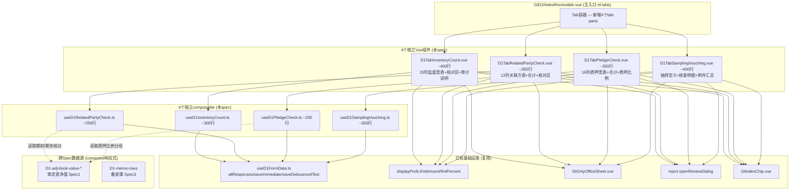
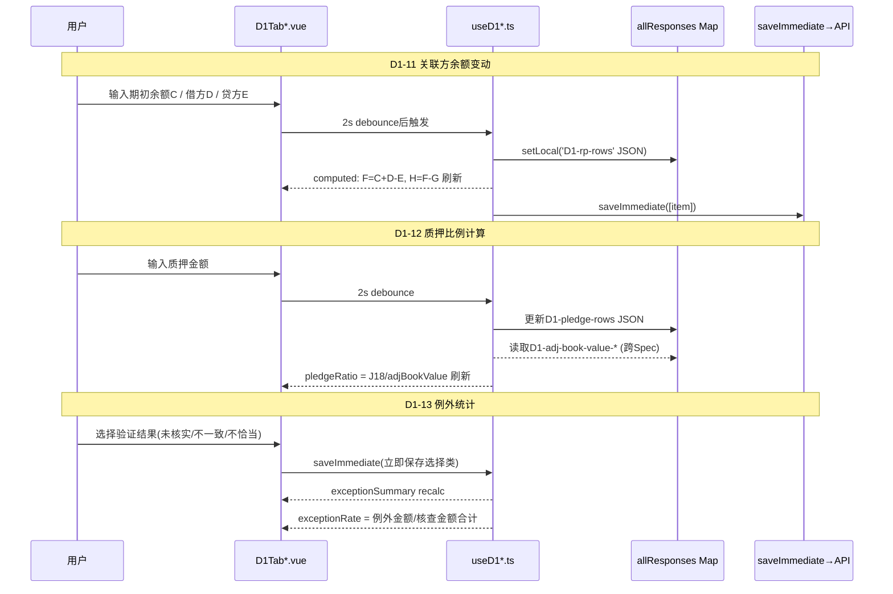

# Design Document: D1 监盘核查组专属组件

## Overview

将 `useD1NotesReceivable.ts`（1237行）中监盘核查相关的 D1-10/D1-11/D1-12/D1-13 四个 sheet 的逻辑拆分为 **4个独立Vue组件 + 4个独立composable**。每个sheet一个组件+一个composable（每文件200-400行），全部做HTML精美组件（el-table + 金额格式化 + 动态行 + 公式自动计算），OnlyOffice仅作降级模式。

核心业务逻辑：
- **D1-10**：应收票据实物监盘表（d-form-confirmation类，15列宽表），逐笔记录监盘日结存票据完整信息并核对差异
- **D1-11**：关联方关系及交易检查表（13列），登记关联方票据往来的期初/期末余额变动+坏账准备+账龄+性质+期后回收
- **D1-12**：应收票据质押检查表（16列），逐笔登记已质押票据的完整票据信息+质押详情（质权人/原因/条件/期限/协议）
- **D1-13**：应收票据检查表（抽样/凭证核对form），定义抽样总体和样本量→逐笔核查→汇总例外并得出结论

设计挑战：
- D1-11 公式引擎：期末余额 F=C+D-E、账面价值 H=F-G、合计行SUM（7列）
- D1-12 跨Spec取数：质押比例 = J18/审定表净值，零值守卫
- D1-13 例外统计：三类例外占比 = 例外金额/核查金额合计
- 四表共享：动态行增删 + 金额格式化（负数括号）+ 导入导出Round-Trip + 双模式切换

## Architecture

### 组件依赖关系



### 数据流



### 文件结构

```
audit-platform/frontend/src/components/workpaper/
├── GtD1NotesReceivable.vue              # 主入口（修改：新增4个tab-pane引用）
├── d1/
│   ├── D1TabInventoryCount.vue          # D1-10 监盘表 (~400行)
│   ├── D1TabRelatedPartyCheck.vue       # D1-11 关联方检查 (~350行)
│   ├── D1TabPledgeCheck.vue             # D1-12 质押检查 (~350行)
│   └── D1TabSamplingVouching.vue        # D1-13 抽样凭证核对 (~400行)
├── composables/
│   ├── useD1InventoryCount.ts           # D1-10 逻辑 (~300行)
│   ├── useD1RelatedPartyCheck.ts        # D1-11 逻辑 (~250行)
│   ├── useD1PledgeCheck.ts              # D1-12 逻辑 (~250行)
│   └── useD1SamplingVouching.ts         # D1-13 逻辑 (~350行)
```

## Components and Interfaces

### 1. useD1InventoryCount.ts — D1-10 监盘表composable (~300行)

```typescript
// ═══════════════════════════════════════════════════════════════════════════
// 类型定义
// ═══════════════════════════════════════════════════════════════════════════

/** D1-10 监盘日结存行（15列） */
export interface InventoryCountRow {
  id: string                    // 唯一标识(uuid)
  noteType: string              // A: 票据类型（银行承兑汇票/商业承兑汇票）
  noteNo: string                // B: 票据号
  issueDate: string             // C: 出票日
  drawer: string                // D: 出票人
  acceptor: string              // E: 承兑人
  amount: number                // F: 金额
  maturityDate: string          // G: 到期日
  predecessor: string           // H: 前手
  receiveDate: string           // I: 收到日期
  endorseDate: string           // J: 背书/贴现日
  endorsee: string              // K: 被背书人/贴现行
  noteStatus: string            // L: 票据状态
  hasDifference: string         // M: 是否存在差异（是/否）
  differenceReason: string      // N: 差异原因
  indexRef: string              // O: 索引号
}

/** D1-10 核对区 */
export interface InventoryReconArea {
  sumAmount: number             // A25: 监盘日票据结存合计 (=SUM H列)
  bookBalance: number           // D25: 账面应收票据余额 (跨sheet)
  differenceAmount: number      // F25: 差异金额 (=A25-D25)
  explanation: string           // I25: 监盘差异说明
  conclusion: string            // L25: 审计结论
  indexRef: string              // N25: 索引号
}

export interface UseD1InventoryCountOptions {
  allResponses: Ref<Map<string, ChecklistResponse>>
  wpId: Ref<string>
  projectId: Ref<string>
  saveImmediate: SaveFn
  saveDebouncedText: DebounceSaveFn
  isReadonly: Ref<boolean>
}

export function useD1InventoryCount(options: UseD1InventoryCountOptions) {
  return {
    // ─── 动态行 ───
    rows: ComputedRef<InventoryCountRow[]>,
    addRow: () => void,
    removeRow: (id: string) => void,
    updateRow: (id: string, field: keyof InventoryCountRow, value: any) => void,

    // ─── 合计行 ───
    sumAmount: ComputedRef<number>,  // H21 = SUM(rows.amount)

    // ─── 核对区 ───
    reconArea: ComputedRef<InventoryReconArea>,
    bookBalance: ComputedRef<number>,         // 跨Spec取数
    bookBalanceLoaded: ComputedRef<boolean>,  // 是否已加载
    differenceAmount: ComputedRef<number>,    // A25-D25
    hasDifference: ComputedRef<boolean>,      // F25≠0

    // ─── 审计说明/结论 ───
    auditNote: Ref<string>,
    auditConclusion: Ref<string>,

    // ─── 导入导出 ───
    exportTemplate: () => Promise<void>,
    exportData: () => Promise<void>,
    importData: (file: File) => Promise<ImportResult>,
  }
}
```

### 2. useD1RelatedPartyCheck.ts — D1-11 关联方检查composable (~250行)

```typescript
/** D1-11 关联方行（13列） */
export interface RelatedPartyRow {
  id: string
  partyName: string             // A: 关联方名称
  relationship: string          // B: 关联关系
  openingBalance: number        // C: 期初余额
  debitOccurrence: number       // D: 借方发生
  creditOccurrence: number      // E: 贷方发生
  closingBalance: number        // F: 期末余额 (公式: C+D-E, 只读)
  badDebtProvision: number      // G: 减：坏账准备
  bookValue: number             // H: 账面价值 (公式: F-G, 只读)
  agingInfo: string             // I: 发生时间及账龄
  transactionNature: string     // J: 发生原因（款项性质）
  postHonored: number           // K: 期后已兑现或已贴现
  indexRef: string              // L: 索引号
  remark: string                // M: 备注
}

export function useD1RelatedPartyCheck(options: UseD1RelatedPartyCheckOptions) {
  return {
    // ─── 动态行 ───
    rows: ComputedRef<RelatedPartyRow[]>,
    addRow: () => void,
    removeRow: (id: string) => void,
    updateRow: (id: string, field: keyof RelatedPartyRow, value: any) => void,

    // ─── 公式计算（逐行） ───
    // F = C + D - E (每行自动计算)
    // H = F - G (每行自动计算)
    computeClosingBalance: (c: number, d: number, e: number) => number,
    computeBookValue: (f: number, g: number) => number,

    // ─── 合计行 Row14 ───
    summaryRow: ComputedRef<{
      openingBalance: number,   // SUM(C列)
      debitOccurrence: number,  // SUM(D列)
      creditOccurrence: number, // SUM(E列)
      closingBalance: number,   // SUM(F列)
      badDebtProvision: number, // SUM(G列)
      bookValue: number,        // SUM(H列)
      postHonored: number,      // SUM(K列)
    }>,

    // ─── 核对区 ───
    adjClosingBalance: ComputedRef<number>,   // 跨Spec: 审定表期末余额
    adjDataLoaded: ComputedRef<boolean>,
    reconDifference: ComputedRef<number>,     // 合计F - 审定表期末

    // ─── 审计说明/结论 ───
    auditNote: Ref<string>,
    auditConclusion: Ref<string>,

    // ─── 导入导出 ───
    exportTemplate: () => Promise<void>,
    exportData: () => Promise<void>,
    importData: (file: File) => Promise<ImportResult>,
  }
}
```

### 3. useD1PledgeCheck.ts — D1-12 质押检查composable (~250行)

```typescript
/** D1-12 质押行（16列） */
export interface PledgeRow {
  id: string
  noteType: string              // A: 票据类型
  noteNo: string                // B: 票据号码
  receiveDate: string           // C: 收到票据日期
  predecessor: string           // D: 票据前手名称
  issueDate: string             // E: 出票日期
  drawer: string                // F: 出票人名称
  acceptor: string              // G: 承兑人名称
  noteAmount: number            // H: 票据金额
  maturityDate: string          // I: 票据到期日
  pledgeAmount: number          // J: 质押金额
  pledgee: string               // K: 质权人
  pledgeReason: string          // L: 质押原因
  pledgeCondition: string       // M: 质押条件
  pledgePeriod: string          // N: 质押期限 (日期范围)
  pledgeAgreement: string       // O: 质押协议
  indexRef: string              // P: 索引号
}

export function useD1PledgeCheck(options: UseD1PledgeCheckOptions) {
  return {
    // ─── 动态行 ───
    rows: ComputedRef<PledgeRow[]>,
    addRow: () => void,
    removeRow: (id: string) => void,
    updateRow: (id: string, field: keyof PledgeRow, value: any) => void,

    // ─── 合计行 Row18 ───
    sumNoteAmount: ComputedRef<number>,    // H18 = SUM(票据金额列)
    sumPledgeAmount: ComputedRef<number>,  // J18 = SUM(质押金额列)

    // ─── 质押比例 ───
    adjBookValue: ComputedRef<number | null>,  // 跨Spec: 审定表净值
    adjDataLoaded: ComputedRef<boolean>,
    pledgeRatio: ComputedRef<number | null>,   // J18 / adjBookValue
    pledgeRatioDisplay: ComputedRef<string>,   // 百分比或"N/A"
    isPledgeWarning: ComputedRef<boolean>,     // > 50%

    // ─── 审计说明/结论 ───
    auditNote: Ref<string>,
    auditConclusion: Ref<string>,

    // ─── 导入导出 ───
    exportTemplate: () => Promise<void>,
    exportData: () => Promise<void>,
    importData: (file: File) => Promise<ImportResult>,
  }
}
```

### 4. useD1SamplingVouching.ts — D1-13 抽样凭证核对composable (~350行)

```typescript
/** D1-13 抽样总体定义 */
export interface SamplePopulation {
  populationDesc: string        // 抽样总体描述
  totalCount: number            // 总体笔数
  totalAmount: number           // 总体金额
  sampleSize: number            // 确定的抽样样本量
  actualDrawn: number           // 实际抽取笔数
  sampleCalcRef: string         // 样本计算器索引号
}

/** D1-13 特定样本行 */
export interface SpecificSampleRow {
  id: string
  description: string           // 项目描述
  amount: number                // 金额
  reason: string                // 抽出原因
}

/** D1-13 凭证核对明细行 */
export interface VouchingRow {
  id: string
  seq: number                   // 序号（自动编号）
  noteType: string              // 票据类型
  noteNo: string                // 票据号码
  drawer: string                // 出票人
  acceptor: string              // 承兑人
  amount: number                // 金额
  maturityDate: string          // 到期日
  existenceCheck: string        // 存在性验证（已核实/未核实/不适用）
  accuracyCheck: string         // 准确性验证（金额一致/金额不一致/不适用）
  appropriatenessCheck: string  // 记录恰当性（恰当/不恰当/不适用）
  remark: string                // 备注
  indexRef: string              // 索引号
}

/** D1-13 例外汇总行 */
export interface ExceptionSummaryRow {
  category: string              // 存在性/准确性/记录恰当性
  count: number                 // 例外笔数
  amount: number                // 例外金额
  rate: number                  // 占比 (= amount / totalCheckedAmount)
}

export function useD1SamplingVouching(options: UseD1SamplingVouchingOptions) {
  return {
    // ─── 抽样总体 ───
    population: Ref<SamplePopulation>,
    specificSamples: ComputedRef<SpecificSampleRow[]>,
    addSpecificSample: () => void,
    removeSpecificSample: (id: string) => void,

    // ─── 凭证核对明细 ───
    vouchingRows: ComputedRef<VouchingRow[]>,
    addVouchingRow: () => void,
    removeVouchingRow: (id: string) => void,
    updateVouchingRow: (id: string, field: keyof VouchingRow, value: any) => void,

    // ─── 核对结果统计 ───
    checkedCount: ComputedRef<number>,        // G32: COUNT已填写行
    checkedAmountTotal: ComputedRef<number>,  // H32: SUM金额列
    vouchingAmountTotal: ComputedRef<number>, // G45: SUM凭证核对金额

    // ─── 例外汇总 E48-G50 ───
    exceptionSummary: ComputedRef<ExceptionSummaryRow[]>,  // 3行
    computeExceptionRate: (exceptionAmount: number, totalAmount: number) => number,
    hasExceedingException: ComputedRef<boolean>,  // 任一占比超标
    tolerableErrorRate: Ref<number>,  // 可容忍误差率(默认5%)

    // ─── 测试结论 ───
    testConclusion: Ref<string>,

    // ─── 审计说明/结论 ───
    auditNote: Ref<string>,
    auditConclusion: Ref<string>,

    // ─── 导入导出 ───
    exportTemplate: () => Promise<void>,
    exportData: () => Promise<void>,
    importData: (file: File) => Promise<ImportResult>,
  }
}
```

### 5. 纯函数（可独立导出用于测试）

```typescript
/** D1-11 期末余额公式: F = C + D - E */
export function computeClosingBalance(
  openingBalance: number, debit: number, credit: number
): number {
  return openingBalance + debit - credit
}

/** D1-11 账面价值公式: H = F - G */
export function computeBookValue(
  closingBalance: number, badDebtProvision: number
): number {
  return closingBalance - badDebtProvision
}

/** SUM合计: 对数组某字段求和 */
export function sumColumn<T>(rows: T[], field: keyof T): number {
  return rows.reduce((sum, row) => sum + (Number(row[field]) || 0), 0)
}

/** D1-12 质押比例: J18 / adjBookValue，零值守卫 */
export function computePledgeRatio(
  pledgeTotal: number, adjBookValue: number | null
): number | null {
  if (adjBookValue == null || adjBookValue === 0) return null
  return pledgeTotal / adjBookValue
}

/** D1-13 例外占比: exceptionAmount / totalCheckedAmount */
export function computeExceptionRate(
  exceptionAmount: number, totalCheckedAmount: number
): number {
  if (totalCheckedAmount === 0) return 0
  return exceptionAmount / totalCheckedAmount
}

/** 负数金额括号格式化: -1234.56 → "(1,234.56)" */
export function formatNegativeAmount(value: number): string {
  if (value >= 0) return ''  // 非负数不处理
  const abs = Math.abs(value)
  const formatted = abs.toLocaleString('zh-CN', {
    minimumFractionDigits: 2,
    maximumFractionDigits: 2,
  })
  return `(${formatted})`
}
```

### 6. Vue组件模板结构概要

#### D1TabInventoryCount.vue (~400行)
```
<el-segmented> 结构化视图 | 在线编辑
审计目标区域 (只读静态文本 rows 5-9)
<el-table :data="rows" border stripe style="width:100%" max-height="500">
  <el-table-column label="监盘日结存" header-align="center">  <!-- A-L 合并表头 -->
    <el-table-column prop="noteType" label="票据类型" width="120" />  <!-- el-select -->
    <el-table-column prop="noteNo" label="票据号" width="140" />
    ... (12列)
  </el-table-column>
  <el-table-column label="核查结果" header-align="center">  <!-- M-O -->
    <el-table-column prop="hasDifference" label="是否存在差异" width="100" />
    <el-table-column prop="differenceReason" label="差异原因" min-width="150" />
    <el-table-column prop="indexRef" label="索引号" width="100" />
  </el-table-column>
</el-table>
<el-button @click="addRow">添加票据</el-button>
核对区 (A25-N25: sumAmount | bookBalance | difference | explanation | conclusion | indexRef)
审计说明 (textarea + 🤖AI + 💬复核)
审计结论 (textarea + 🤖AI + 💬复核)
编制提示 (<details> 折叠)
<GtOnlyOfficeSheet v-if="isOOMode" />
```

#### D1TabRelatedPartyCheck.vue (~350行)
```
<el-segmented> 结构化视图 | 在线编辑
审计目标区域 (只读静态文本 rows 5-8)
<el-table :data="rows" border>
  13列: A关联方名称 | B关联关系 | C期初余额 | D借方发生 | E贷方发生 |
        F期末余额(只读) | G减坏账准备 | H账面价值(只读) |
        I账龄 | J款项性质 | K期后兑现 | L索引号 | M备注
</el-table>
<el-button @click="addRow">添加关联方</el-button>
合计行 Row14 (7列SUM)
核对区 (合计F vs 审定表期末 → 差异)
审计说明 + 审计结论 + 编制提示
<GtOnlyOfficeSheet v-if="isOOMode" />
```

#### D1TabPledgeCheck.vue (~350行)
```
<el-segmented> 结构化视图 | 在线编辑
审计目标区域 (只读静态文本 rows 5-8)
<el-table :data="rows" border style="width:100%">
  <el-table-column label="票据基本信息" header-align="center">  <!-- A-I -->
    9列: 票据类型|号码|收到日期|前手|出票日|出票人|承兑人|金额|到期日
  </el-table-column>
  <el-table-column label="质押详情" header-align="center">  <!-- J-P -->
    7列: 质押金额|质权人|原因|条件|期限|协议|索引号
  </el-table-column>
</el-table>
<el-button @click="addRow">添加质押票据</el-button>
合计行 Row18 (H18票据金额合计 | J18质押金额合计)
质押汇总区 (H18 | J18 | 审定表净值 | 质押比例% | 预警标签)
审计说明 + 审计结论 + 编制提示
<GtOnlyOfficeSheet v-if="isOOMode" />
```

#### D1TabSamplingVouching.vue (~400行)
```
<el-segmented> 结构化视图 | 在线编辑
审计目标区域 (只读静态文本 rows 5-7)
抽样总体定义区 (textarea + 笔数 + 金额 + 样本量 + 抽取笔数 + GtIndexChip)
特定样本区域 (动态行: 描述|金额|原因)
--- 分隔线 ---
凭证核对明细 <el-table>
  序号|票据类型|号码|出票人|承兑人|金额|到期日|
  存在性验证|准确性验证|记录恰当性|备注|索引号
</el-table>
核对结果区 (G32笔数 | H32金额)
例外汇总区 E48-G50 (3行×3列: 类别|笔数|金额|占比)
测试结论 (el-select)
审计说明 + 审计结论 + 编制提示
<GtOnlyOfficeSheet v-if="isOOMode" />
```

## Data Models

### checklist_responses item_id 命名规范

| Sheet | 前缀 | 存储方式 | 字段示例 |
|-------|------|---------|---------|
| D1-10 监盘表 | `D1-inventory-` | JSON数组 remark | rows (15列动态行), recon-explanation, recon-conclusion, recon-indexRef, note, conclusion |
| D1-11 关联方 | `D1-rp-` | JSON数组 remark | rows (13列动态行), note, conclusion |
| D1-12 质押 | `D1-pledge-` | JSON数组 remark | rows (16列动态行), note, conclusion |
| D1-13 抽样 | `D1-sampling-` | JSON数组 remark | population-desc, population-count, population-amount, sample-size, actual-drawn, sample-calc-ref, specific-samples (JSON), vouching-rows (JSON), exception-* , test-conclusion, note, conclusion |

### 存储模式说明

- **动态行**：以 JSON 数组格式存储于 remark 字段（如 `item_id="D1-inventory-rows"` → remark = JSON.stringify(InventoryCountRow[])）
- **固定字段**：独立 item_id（如 `D1-inventory-recon-explanation` → remark = 文本内容）
- **选择字段**：conclusion 字段存值（如 `D1-inventory-recon-conclusion` → conclusion = "无差异"）
- **行类型**：dynamic（可增删） / summary（自动合计，不可编辑）

### 跨Spec数据契约

| 数据源 | item_id模式 | 用途 | 来源Spec |
|--------|------------|------|---------|
| 审定表净值 | `D1-adj-book-value-*` | D1-12质押比例分母 | d1-adjudication-table (Spec1) |
| 审定表期末余额 | `D1-adj-*-current-audited` | D1-11核对区 / D1-10核对区 | d1-adjudication-table (Spec1) |
| 备查簿行数据 | `D1-memo-rows` | D1-10跨sheet引用 | d1-endorsement-discount (Spec3) |

### D1-11 关联关系下拉选项

```typescript
const RELATIONSHIP_OPTIONS = [
  '母公司', '子公司', '联营企业', '合营企业', '关键管理人员', '其他关联方'
]
```

### D1-10 票据状态/类型下拉选项

```typescript
const NOTE_TYPE_OPTIONS = ['银行承兑汇票', '商业承兑汇票']
const NOTE_STATUS_OPTIONS = ['在库', '已背书', '已贴现', '已到期', '已质押']
const DIFFERENCE_OPTIONS = ['是', '否']
```

### D1-13 验证结果下拉选项

```typescript
const EXISTENCE_OPTIONS = ['已核实', '未核实', '不适用']
const ACCURACY_OPTIONS = ['金额一致', '金额不一致', '不适用']
const APPROPRIATENESS_OPTIONS = ['恰当', '不恰当', '不适用']
const TEST_CONCLUSION_OPTIONS = [
  '未发现重大例外', '发现例外已获合理解释',
  '发现例外需扩大测试', '发现重大错报'
]
```

## Correctness Properties

*A property is a characteristic or behavior that should hold true across all valid executions of a system — essentially, a formal statement about what the system should do. Properties serve as the bridge between human-readable specifications and machine-verifiable correctness guarantees.*

### Property 1: D1-11 期末余额公式 F=C+D-E

*For any* 三元组 (openingBalance: number, debit: number, credit: number)，`computeClosingBalance(openingBalance, debit, credit)` 的返回值应严格等于 `openingBalance + debit - credit`。此公式适用于 D1-11 每一行的 F 列自动计算。

**Validates: Requirements 4.4**

### Property 2: D1-11 账面价值公式 H=F-G

*For any* 二元组 (closingBalance: number, badDebtProvision: number)，`computeBookValue(closingBalance, badDebtProvision)` 的返回值应严格等于 `closingBalance - badDebtProvision`。此公式链式依赖 Property 1 的 F 值。

**Validates: Requirements 4.5**

### Property 3: D1-11/D1-12 SUM合计行正确性

*For any* 含数值字段的动态行列表 rows 和任意数值字段名 field，`sumColumn(rows, field)` 应严格等于 `rows.reduce((s, r) => s + Number(r[field]) || 0, 0)`。此属性覆盖 D1-10 H21合计、D1-11 Row14 七列合计（C/D/E/F/G/H/K）、D1-12 Row18 H18/J18合计、D1-13 G45合计。

**Validates: Requirements 2.1, 5.1, 8.1, 12.1, 12.2**

### Property 4: D1-12 质押比例计算与零值守卫

*For any* (pledgeTotal ≥ 0, adjBookValue: number | null)，当 adjBookValue 为 null 或 0 时 `computePledgeRatio(pledgeTotal, adjBookValue)` 应返回 null；当 adjBookValue ≠ 0 且 ≠ null 时应返回 `pledgeTotal / adjBookValue`。且当结果 > 0.5 时 `isPledgeWarning` 应为 true。

**Validates: Requirements 8.3, 8.4**

### Property 5: D1-13 例外占比公式

*For any* (exceptionAmount ≥ 0, totalCheckedAmount ≥ 0)，当 totalCheckedAmount = 0 时 `computeExceptionRate(exceptionAmount, totalCheckedAmount)` 应返回 0；当 totalCheckedAmount > 0 时应返回 `exceptionAmount / totalCheckedAmount`。此属性覆盖存在性/准确性/记录恰当性三类例外占比。

**Validates: Requirements 12.4**

### Property 6: 动态行增删计数不变量

*For any* 动态行列表（长度 N，N ≥ 0），执行 `addRow()` 后列表长度应为 N+1；对长度 N > 0 的列表执行 `removeRow(validId)` 后列表长度应为 N-1。此属性覆盖四表（D1-10/D1-11/D1-12/D1-13凭证核对+特定样本）的所有动态行操作。

**Validates: Requirements 1.4, 4.3, 7.4, 10.3, 11.2**

### Property 7: 负数金额括号格式

*For any* 负数 value (value < 0)，`formatNegativeAmount(value)` 的返回字符串应包含 '(' 和 ')' 字符，且不包含 '-' 字符；*For any* 非负数 value (value ≥ 0)，该函数不应产生括号格式输出。

**Validates: Requirements 18.2**

### Property 8: 导入导出 Round-Trip

*For any* 有效的动态行列表（D1-10 InventoryCountRow[] / D1-11 RelatedPartyRow[] / D1-12 PledgeRow[] / D1-13 VouchingRow[]），执行 `exportData` 生成 xlsx 后再 `importData` 解析回写，导入后的行数据应与导出前在所有字段上深度相等（数值字段允许浮点精度误差 ±0.01）。

**Validates: Requirements 15.7, 15.8, 15.9, 15.10, 16.2, 16.3**

## Error Handling

| 场景 | 处理方式 |
|------|---------|
| 跨Spec审定表净值未加载（D1-adj-book-value-*不存在） | D1-12质押比例显示"N/A" + 汇总区"审定表净值"显示"-"占位+黄色三角警告 |
| 跨Spec审定表期末余额未加载 | D1-11/D1-10核对区账面余额显示"-"+黄色三角警告图标 |
| checklist_responses API保存失败 | ElMessage.warning("保存失败，请重试")；保留本地状态不回滚 |
| 质押比例分母为零 | pledgeRatioDisplay = "N/A"，isPledgeWarning = false |
| 例外占比分母为零（核查金额合计=0） | 占比显示"0.00%"，不触发超标预警 |
| 导入xlsx列名不匹配 | ElMessage.error + 弹窗列出不匹配列名（期望vs实际） |
| 导入xlsx行数超过当前行数 | 自动扩展动态行容纳全部数据（Req 16.5） |
| D1-13导入跳过非明细区域 | 仅解析凭证核对明细行，跳过抽样定义和例外汇总（Req 16.7） |
| 动态行删除越界（id不存在） | 静默忽略（guard return） |
| OnlyOffice服务不可用 | 禁用"在线编辑"选项 + tooltip"OnlyOffice服务不可用" |
| parseNum解析非数字字符串 | 安全降级为0（`Number(val) \|\| 0`） |
| 金额为零 | 显示"-"而非"0.00"（Req 18.3） |
| 数据加载中 | 表格区域显示 el-skeleton 占位动画（Req 18.7） |

## Testing Strategy

### 单元测试（vitest）

**D1-10 useD1InventoryCount:**
- 15列动态行CRUD：addRow增加空行、removeRow按id删除、updateRow更新指定字段
- H21合计行：空列表=0、单行=行金额、多行=算术和
- 核对区差异计算：sumAmount - bookBalance、差异高亮触发条件
- 跨Spec取数mock：allResponses含D1-adj-*时正确读取；不含时降级

**D1-11 useD1RelatedPartyCheck:**
- 公式逐行计算：F=C+D-E边界（含负数/零/大数）、H=F-G链式
- Row14合计行：7列独立SUM、空行时全部为0
- 核对区：合计F vs 审定表期末 → 差异
- 动态行增删：索引重排、字段默认值

**D1-12 useD1PledgeCheck:**
- Row18合计：H18=SUM票据金额、J18=SUM质押金额
- 质押比例：正常值/零分母/null分母/超50%预警
- 16列动态行CRUD

**D1-13 useD1SamplingVouching:**
- 凭证核对明细行CRUD + 自动编号(seq)
- 核对结果统计：G32=COUNT已填行、H32=SUM金额
- 例外汇总：三类例外的笔数/金额/占比正确性
- 超标判定：占比>tolerableErrorRate时hasExceedingException=true
- 特定样本动态行

**纯函数边界测试:**
- computeClosingBalance: (0,0,0)=0, 负值输入, MAX_SAFE_INTEGER
- computeBookValue: 链式F→H
- computePledgeRatio: null/0/正值/负值
- computeExceptionRate: 0/0=0, 正常值
- formatNegativeAmount: -0.01, -999999.99, 0, 正数
- sumColumn: 空数组, NaN字段值, 混合类型

### Property-Based Tests（fast-check）

每个correctness property对应一个PBT测试，最少100次迭代。

| Property | 测试文件 | 生成器 |
|----------|---------|--------|
| P1 期末余额F=C+D-E | `useD1RelatedPartyCheck.spec.ts` | `fc.float({min:-1e8, max:1e8, noNaN:true})` × 3 |
| P2 账面价值H=F-G | `useD1RelatedPartyCheck.spec.ts` | `fc.float({min:-1e8, max:1e8, noNaN:true})` × 2 |
| P3 SUM合计行 | `d1InspectionFormulas.spec.ts` | `fc.array(fc.float({min:-1e6, max:1e6, noNaN:true}), {minLength:0, maxLength:30})` |
| P4 质押比例+零值守卫 | `useD1PledgeCheck.spec.ts` | `fc.float({min:0, max:1e9})` × pledgeTotal + `fc.option(fc.float({min:-1e6, max:1e9}))` × adjBookValue |
| P5 例外占比 | `useD1SamplingVouching.spec.ts` | `fc.float({min:0, max:1e8})` × 2 |
| P6 动态行增删 | `d1DynamicRows.spec.ts` | `fc.array(RowArbitrary, {minLength:0, maxLength:20})` + `fc.nat({max:N-1})` |
| P7 负数括号格式 | `d1InspectionFormulas.spec.ts` | `fc.float({min:-1e9, max:-0.01, noNaN:true})` for负, `fc.float({min:0, max:1e9})` for非负 |
| P8 导入导出RT | `d1ImportExport.spec.ts` | 自定义 InventoryCountRow[]/RelatedPartyRow[]/PledgeRow[]/VouchingRow[] 生成器 |

### 测试Tag格式

```typescript
// Feature: d1-inspection-check, Property 1: D1-11 期末余额公式 F=C+D-E
it('P1: closingBalance = opening + debit - credit', () => {
  fc.assert(
    fc.property(
      fc.float({ min: -1e8, max: 1e8, noNaN: true }),
      fc.float({ min: -1e8, max: 1e8, noNaN: true }),
      fc.float({ min: -1e8, max: 1e8, noNaN: true }),
      (c, d, e) => {
        expect(computeClosingBalance(c, d, e)).toBeCloseTo(c + d - e)
      }
    ),
    { numRuns: 100 }
  )
})
```

### 后端集成测试（hypothesis, max_examples=5）

- 导入导出round-trip：生成随机行数据→export xlsx buffer→import解析→验证等价
- D1-10/D1-11/D1-12/D1-13 四表模板列名验证

### 测试方法对照

| 测试类型 | 覆盖范围 | 框架 |
|---------|---------|------|
| Property tests | P1~P8 universal properties | fast-check (100+ iterations) |
| Unit tests | 边界值、初始状态、CRUD序列、跨Spec mock、下拉选项 | vitest |
| Integration tests | 导入导出round-trip、xlsx解析 | hypothesis + vitest |
| E2E tests | 四Tab交互、双模式切换、公式联动 | Playwright |
