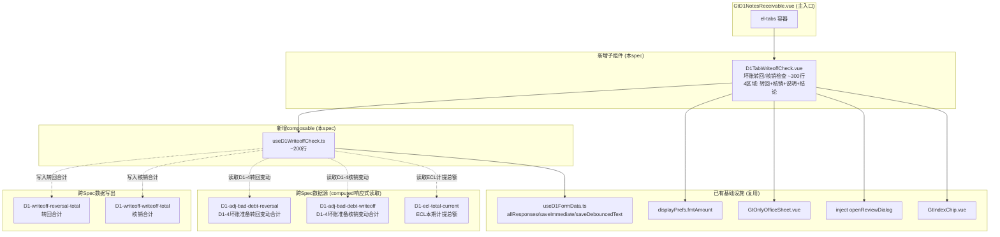
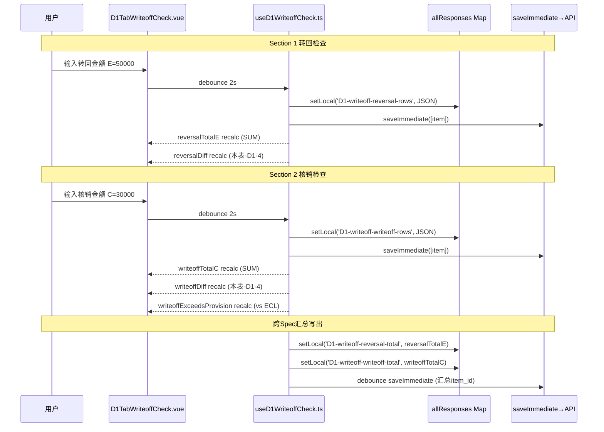

# Design Document: D1-16 坏账准备转回/核销检查表

## Overview

将 `useD1NotesReceivable.ts`（1237行）中D1-16转回/核销检查表相关逻辑拆分为独立子组件+子composable。1个Vue组件（~300行，含4个区域）+ 1个独立composable（~200行），全部以HTML精美组件（el-table + 金额格式化 + 动态行 + SUM公式）为主渲染模式，OnlyOffice仅作降级模式。

核心设计挑战：
- 双段表格（Section 1转回8列 + Section 2核销5列）各自有动态行+SUM合计行
- 跨Spec校验：转回合计 vs D1-4转回变动列、核销合计 vs D1-4核销变动列
- 预警系统：转回金额超原计提（E>F）、核销超ECL计提总额、必填字段缺失
- 审计说明/结论区含🤖AI生成 + 💬复核对话 + 编制提示折叠
- 持久化复用 checklist_responses 表 + useD1FormData 基础设施

## Architecture

### 组件依赖关系



### 数据流



### 文件结构

```
audit-platform/frontend/src/components/workpaper/
├── GtD1NotesReceivable.vue              # 主入口（修改：新增1个tab-pane）
├── d1/
│   └── D1TabWriteoffCheck.vue           # 转回/核销检查表（~300行）
├── composables/
│   └── useD1WriteoffCheck.ts            # 转回/核销逻辑（~200行）
```

## Components and Interfaces

### 1. useD1WriteoffCheck.ts — 类型定义

```typescript
// ═══════════════════════════════════════════════════════════════════════════
// 类型定义
// ═══════════════════════════════════════════════════════════════════════════

export interface ReversalRow {
  id: string                    // uuid
  unitName: string              // A: 单位名称
  reason: string                // B: 转回原因
  recoveryMethod: string        // C: 收回方式（现金收回/银行转账/票据兑现/以物抵债/债务重组/其他）
  originalBasis: string         // D: 原确定坏账准备的依据
  reversalAmount: number        // E: 收回或转回金额
  priorProvisionAmount: number  // F: 收回或转回前累计已计提坏账准备金额
  reasonabilityAnalysis: string // G: 合理性分析
  indexRef: string              // H: 索引号
}

export interface WriteoffRow {
  id: string                    // uuid
  unitName: string              // A: 单位名称
  noteNature: string            // B: 应收票据的性质（银行承兑汇票/商业承兑汇票/其他）
  writeoffAmount: number        // C: 核销金额
  writeoffReason: string        // D: 核销原因
  writeoffProcedure: string     // E: 履行的核销程序
}

export type RecoveryMethod = '现金收回' | '银行转账' | '票据兑现' | '以物抵债' | '债务重组' | '其他'
export type NoteNature = '银行承兑汇票' | '商业承兑汇票' | '其他'

export interface UseD1WriteoffCheckOptions {
  allResponses: Ref<Map<string, ChecklistResponse>>
  wpId: Ref<string>
  projectId: Ref<string>
  saveImmediate: SaveFn
  saveDebouncedText: (item: ChecklistItem) => void
  isReadonly: Ref<boolean>
}
```

### 2. useD1WriteoffCheck.ts — Composable 导出接口

```typescript
export function useD1WriteoffCheck(options: UseD1WriteoffCheckOptions) {
  return {
    // ─── Section 1: 转回检查 ───
    reversalRows: Ref<ReversalRow[]>,
    addReversalRow: () => void,
    removeReversalRow: (id: string) => void,
    updateReversalRow: (id: string, field: keyof ReversalRow, value: string | number) => void,
    reversalTotalE: ComputedRef<number>,           // SUM(rows.reversalAmount)
    reversalTotalF: ComputedRef<number>,           // SUM(rows.priorProvisionAmount)

    // ─── Section 2: 核销检查 ───
    writeoffRows: Ref<WriteoffRow[]>,
    addWriteoffRow: () => void,
    removeWriteoffRow: (id: string) => void,
    updateWriteoffRow: (id: string, field: keyof WriteoffRow, value: string | number) => void,
    writeoffTotalC: ComputedRef<number>,           // SUM(rows.writeoffAmount)

    // ─── 跨Spec校验 ───
    d14ReversalTotal: ComputedRef<number | null>,  // D1-4转回变动合计（null=未加载）
    d14WriteoffTotal: ComputedRef<number | null>,  // D1-4核销变动合计（null=未加载）
    eclCurrentTotal: ComputedRef<number | null>,   // ECL本期计提总额（null=未加载）
    reversalDiff: ComputedRef<number | null>,      // 本表转回合计 - D1-4转回（null=D1-4未加载）
    writeoffDiff: ComputedRef<number | null>,      // 本表核销合计 - D1-4核销（null=D1-4未加载）

    // ─── 预警判断 ───
    reversalExceedsProvision: (row: ReversalRow) => boolean,  // E > F
    writeoffExceedsProvision: ComputedRef<boolean>,           // writeoffTotalC > eclCurrentTotal
    missingReversalFields: (row: ReversalRow) => string[],    // amount>0时缺失的必填字段
    missingWriteoffFields: (row: WriteoffRow) => string[],    // amount>0时缺失的必填字段

    // ─── Section 3/4: 审计说明/结论 ───
    auditNote: Ref<string>,
    auditConclusion: Ref<string>,

    // ─── 加载状态 ───
    isLoading: Ref<boolean>,
  }
}
```

### 3. D1TabWriteoffCheck.vue — 组件结构

```typescript
// Props
interface Props {
  wpId: string
  projectId: string
  allResponses: Map<string, ChecklistResponse>
  isReadonly?: boolean
  displayPrefs: DisplayPrefs
}

// Template 结构概要：
// <el-segmented v-model="viewMode"> 结构化视图 | 在线编辑
// <el-skeleton v-if="isLoading" />
// <div v-else-if="viewMode==='html'" class="writeoff-check-container">
//
//   <!-- Section 1: 转回检查 -->
//   <section class="reversal-section">
//     <h3>(一)本期重要的坏账准备转回检查</h3>
//     <div class="section-stat">共{{reversalRows.length}}笔转回，合计金额{{fmtAmount(reversalTotalE)}}元</div>
//     <el-table :data="reversalRows" border>
//       A:单位名称(el-input) / B:转回原因(textarea) / C:收回方式(el-select)
//       D:原依据(textarea) / E:转回金额(number+fmtAmount) / F:原计提(number+fmtAmount)
//       G:合理性分析(textarea) / H:索引号(GtIndexChip)
//       操作列(删除按钮)
//     </el-table>
//     <el-button @click="addReversalRow">添加转回项</el-button>
//     <!-- 合计行（灰色背景不可编辑） -->
//     <div class="sum-row">合计: E={{fmtAmount(reversalTotalE)}} F={{fmtAmount(reversalTotalF)}}</div>
//     <!-- 核对区 -->
//     <div class="reconciliation">
//       本表转回合计 | D1-4转回变动合计 | 差异(红色高亮 if ≠0)
//     </div>
//   </section>
//
//   <el-divider />
//
//   <!-- Section 2: 核销检查 -->
//   <section class="writeoff-section">
//     <h3>(二)本期重要的核销应收票据检查</h3>
//     <div class="section-stat">共{{writeoffRows.length}}笔核销，合计金额{{fmtAmount(writeoffTotalC)}}元</div>
//     <el-table :data="writeoffRows" border>
//       A:单位名称(el-input) / B:性质(el-select) / C:核销金额(number+fmtAmount)
//       D:核销原因(textarea) / E:核销程序(textarea)
//       操作列(删除按钮)
//     </el-table>
//     <el-button @click="addWriteoffRow">添加核销项</el-button>
//     <!-- 合计行 -->
//     <div class="sum-row">合计: C={{fmtAmount(writeoffTotalC)}}</div>
//     <!-- 核对区 -->
//     <div class="reconciliation">
//       本表核销合计 | D1-4核销变动合计 | 差异(红色高亮 if ≠0)
//     </div>
//     <!-- ECL预警 -->
//     <div v-if="writeoffExceedsProvision" class="ecl-warning">
//       ⚠️ 核销金额超过本期计提总额，请关注坏账准备充足性
//     </div>
//   </section>
//
//   <el-divider />
//
//   <!-- Section 3: 审计说明 -->
//   <section class="audit-note-section">
//     <h3>三、审计说明</h3>
//     <div class="section-toolbar">
//       <el-button size="small" disabled>🤖 AI生成</el-button>
//       <el-button size="small" @click="openReviewDialog({sectionId:'D1-writeoff-audit-note'})">💬</el-button>
//     </div>
//     <el-input type="textarea" v-model="auditNote" :min-rows="4" />
//   </section>
//
//   <!-- Section 4: 审计结论 -->
//   <section class="audit-conclusion-section">
//     <h3>四、审计结论</h3>
//     <div class="section-toolbar">
//       <el-button size="small" disabled>🤖 AI生成</el-button>
//       <el-button size="small" @click="openReviewDialog({sectionId:'D1-writeoff-audit-conclusion'})">💬</el-button>
//     </div>
//     <el-input type="textarea" v-model="auditConclusion" :min-rows="4" />
//     <!-- 编制提示 -->
//     <details class="guidance-details">
//       <summary>📋 编制提示</summary>
//       <div class="guidance-content">
//         坏账准备转回条件 / 核销审批程序 / 关联方核销披露 / 损益影响分析
//       </div>
//     </details>
//   </section>
// </div>
//
// <GtOnlyOfficeSheet v-if="viewMode==='oo'" ... />
```

### 4. 纯函数（从composable导出供测试）

```typescript
/** 解析数值(安全): null/undefined/空串/NaN → 0 */
export function parseNum(val: string | number | null | undefined): number {
  if (val == null || val === '') return 0
  const n = typeof val === 'number' ? val : Number(val)
  return Number.isFinite(n) ? n : 0
}

/** SUM数组 */
export function sumArray(values: number[]): number {
  return values.reduce((acc, v) => acc + v, 0)
}

/** 转回金额超原计提判定: E > F 且 E > 0 */
export function isReversalExceedsProvision(reversalAmount: number, priorProvision: number): boolean {
  return reversalAmount > 0 && reversalAmount > priorProvision
}

/** 核销超计提判定: writeoffTotal > eclTotal 且 eclTotal > 0 */
export function isWriteoffExceedsProvision(writeoffTotal: number, eclTotal: number | null): boolean {
  if (eclTotal == null || eclTotal <= 0) return false
  return writeoffTotal > eclTotal
}

/** 缺失必填字段检查(转回行): amount>0时reason和analysis必填 */
export function getMissingReversalFields(row: ReversalRow): string[] {
  const missing: string[] = []
  if (row.reversalAmount > 0) {
    if (!row.reason.trim()) missing.push('reason')
    if (!row.reasonabilityAnalysis.trim()) missing.push('reasonabilityAnalysis')
  }
  return missing
}

/** 缺失必填字段检查(核销行): amount>0时reason和procedure必填 */
export function getMissingWriteoffFields(row: WriteoffRow): string[] {
  const missing: string[] = []
  if (row.writeoffAmount > 0) {
    if (!row.writeoffReason.trim()) missing.push('writeoffReason')
    if (!row.writeoffProcedure.trim()) missing.push('writeoffProcedure')
  }
  return missing
}
```

## Data Models

### checklist_responses item_id 命名规范

| 用途 | item_id | 字段 | 格式 |
|------|---------|------|------|
| 转回明细行 | `D1-writeoff-reversal-rows` | remark | JSON数组 `ReversalRow[]` |
| 核销明细行 | `D1-writeoff-writeoff-rows` | remark | JSON数组 `WriteoffRow[]` |
| 审计说明 | `D1-writeoff-audit-note` | remark | 纯文本 |
| 审计结论 | `D1-writeoff-audit-conclusion` | remark | 纯文本 |
| 转回合计(写出) | `D1-writeoff-reversal-total` | remark | 数值字符串 |
| 核销合计(写出) | `D1-writeoff-writeoff-total` | remark | 数值字符串 |

### JSON存储格式

```json
// item_id: "D1-writeoff-reversal-rows", remark字段:
[
  {
    "id": "uuid-1",
    "unitName": "ABC贸易有限公司",
    "reason": "债务人经营恢复正常，已全额收回欠款",
    "recoveryMethod": "银行转账",
    "originalBasis": "逾期超1年且债务人经营困难",
    "reversalAmount": 500000,
    "priorProvisionAmount": 800000,
    "reasonabilityAnalysis": "债务人2025年度营收恢复，已签订还款协议并到账",
    "indexRef": "D1-3-1"
  }
]

// item_id: "D1-writeoff-writeoff-rows", remark字段:
[
  {
    "id": "uuid-2",
    "unitName": "XYZ实业集团",
    "noteNature": "商业承兑汇票",
    "writeoffAmount": 300000,
    "writeoffReason": "出票人破产清算，法院裁定无财产可执行",
    "writeoffProcedure": "经总经理办公会审批，取得法院执行裁定书"
  }
]
```

### 跨Spec数据契约

| 方向 | item_id前缀/key | 来源Spec | 数据格式 | 用途 |
|------|----------------|---------|---------|------|
| 读入 | `D1-adj-bad-debt-reversal` | d1-adjudication-table | remark=数值字符串 | D1-4坏账准备转回变动合计 |
| 读入 | `D1-adj-bad-debt-writeoff` | d1-adjudication-table | remark=数值字符串 | D1-4坏账准备核销变动合计 |
| 读入 | `D1-ecl-total-current` | d1-ecl-provision | remark=数值字符串 | ECL本期计提总额 |
| 写出 | `D1-writeoff-reversal-total` | 本spec | remark=数值字符串 | 供D1-4审定表引用 |
| 写出 | `D1-writeoff-writeoff-total` | 本spec | remark=数值字符串 | 供D1-4审定表引用 |

跨Spec取数方式：所有D1-*前缀数据在同一个working_paper的`allResponses` Map中，computed响应式读取，无需额外API调用。

### 收回方式枚举

```typescript
export const RECOVERY_METHODS: RecoveryMethod[] = [
  '现金收回', '银行转账', '票据兑现', '以物抵债', '债务重组', '其他'
]
```

### 应收票据性质枚举

```typescript
export const NOTE_NATURES: NoteNature[] = [
  '银行承兑汇票', '商业承兑汇票', '其他'
]
```


## Correctness Properties

*A property is a characteristic or behavior that should hold true across all valid executions of a system — essentially, a formal statement about what the system should do. Properties serve as the bridge between human-readable specifications and machine-verifiable correctness guarantees.*

### Property 1: Reversal SUM 合计行公式正确性

*For any* 转回明细行数组 `ReversalRow[]`（长度0~N），`reversalTotalE` 应等于 `Σ(rows[i].reversalAmount)`，`reversalTotalF` 应等于 `Σ(rows[i].priorProvisionAmount)`。空数组时两者均为0。

**Validates: Requirements 2.1**

### Property 2: Writeoff SUM 合计行公式正确性

*For any* 核销明细行数组 `WriteoffRow[]`（长度0~N），`writeoffTotalC` 应等于 `Σ(rows[i].writeoffAmount)`。空数组时为0。

**Validates: Requirements 5.1**

### Property 3: 动态行增删计数不变量

*For any* 转回行列表（长度N，N≥0）或核销行列表（长度M，M≥0），执行 `addReversalRow()`/`addWriteoffRow()` 后列表长度为 N+1/M+1；执行 `removeReversalRow(id)`/`removeWriteoffRow(id)`（id存在于列表中）后列表长度为 N-1/M-1。删除不存在的id时列表长度不变。

**Validates: Requirements 1.3, 4.3**

### Property 4: reversalExceedsProvision 判定正确性

*For any* 转回行，`isReversalExceedsProvision(reversalAmount, priorProvisionAmount)` 应返回 true 当且仅当 `reversalAmount > 0 AND reversalAmount > priorProvisionAmount`。

**Validates: Requirements 3.1**

### Property 5: JSON Round-Trip 序列化完整性

*For any* 有效的 `ReversalRow[]` 或 `WriteoffRow[]` 数组（字段值为有限数值和非null字符串），执行 `JSON.stringify` 后再 `JSON.parse`，结果应与原数组深度相等（所有字段值保持不变）。

**Validates: Requirements 9.5**

### Property 6: 负数金额括号格式

*For any* 负数 amount（amount < 0），经 `displayPrefs.fmtAmount` 格式化后的字符串应包含括号字符 '(' 和 ')'，且不包含负号 '-'。

**Validates: Requirements 12.2**

## Error Handling

| 场景 | 处理方式 |
|------|---------|
| D1-4跨Spec数据未加载（Map中无对应key） | 核对区D1-4列显示"-"占位+黄色三角⚠️图标；reversalDiff/writeoffDiff=null |
| ECL计提数据未加载（D1-ecl-total-current不存在） | writeoffExceedsProvision=false；ECL列显示"-"占位 |
| checklist_responses API保存失败 | ElMessage.warning提示"保存失败，请重试"；保留本地状态不丢 |
| 转回/核销行JSON解析失败 | 回退空数组[] + console.warn |
| 动态行删除id不存在 | 静默忽略（开头guard返回） |
| OnlyOffice服务不可用 | 禁用"在线编辑"选项+tooltip"OnlyOffice服务不可用" |
| parseNum遇到非数字字符串 | 安全降级为0 |
| 金额为0 | 显示"-"而非"0.00" |
| 金额为负数 | 红色字体+括号格式如(1,234.56) |

## Testing Strategy

### 单元测试（vitest）

- `parseNum` 纯函数：null/undefined/空串/NaN/'abc'/正常数字
- `sumArray` 纯函数：空数组→0/单值/多值/含0
- `isReversalExceedsProvision` 纯函数：E>F/E=F/E<F/E=0/F=0
- `isWriteoffExceedsProvision` 纯函数：eclTotal=null/eclTotal=0/超/未超
- `getMissingReversalFields` 纯函数：amount=0无必填/amount>0缺reason/缺analysis/都缺/都有
- `getMissingWriteoffFields` 纯函数：amount=0无必填/amount>0缺reason/缺procedure/都缺/都有
- composable初始状态：空allResponses时reversalRows=[]/writeoffRows=[]
- addReversalRow/removeReversalRow操作序列
- addWriteoffRow/removeWriteoffRow操作序列
- 跨Spec取数mock：设置allResponses含`D1-adj-bad-debt-reversal`→验证reversalDiff计算
- 跨Spec取数mock：设置allResponses含`D1-ecl-total-current`→验证writeoffExceedsProvision

### Property-Based Tests（fast-check）

每个correctness property对应一个PBT测试，最少100次迭代。

库选择：**fast-check**（项目已有，前端PBT标准选择）

标签格式：`Feature: d1-writeoff-check, Property {N}: {title}`

| Property | 测试文件 | 生成器 |
|----------|---------|--------|
| P1 Reversal SUM | `useD1WriteoffCheck.spec.ts` | `fc.array(fc.record({reversalAmount: fc.float({min:0, max:1e8, noNaN:true}), priorProvisionAmount: fc.float({min:0, max:1e8, noNaN:true})}), {minLength:0, maxLength:20})` |
| P2 Writeoff SUM | `useD1WriteoffCheck.spec.ts` | `fc.array(fc.record({writeoffAmount: fc.float({min:0, max:1e8, noNaN:true})}), {minLength:0, maxLength:20})` |
| P3 动态行增删 | `useD1WriteoffCheck.spec.ts` | `fc.integer({min:0, max:20})` × initialLength + `fc.commands(addCmd, removeCmd)` |
| P4 reversalExceedsProvision | `useD1WriteoffCheck.spec.ts` | `fc.float({min:-1e6, max:1e8, noNaN:true})` × 2 (reversalAmount, priorProvision) |
| P5 JSON Round-Trip | `useD1WriteoffCheck.spec.ts` | 自定义 ReversalRow[]/WriteoffRow[] 生成器 |
| P6 负数括号 | `useD1WriteoffCheck.spec.ts` | `fc.float({min:-1e9, max:-0.01, noNaN:true})` |

### 测试Tag示例

```typescript
// Feature: d1-writeoff-check, Property 1: Reversal SUM 合计行公式正确性
it('reversalTotalE equals sum of all rows reversalAmount', () => {
  fc.assert(
    fc.property(
      fc.array(
        fc.record({
          reversalAmount: fc.float({ min: 0, max: 1e8, noNaN: true }),
          priorProvisionAmount: fc.float({ min: 0, max: 1e8, noNaN: true }),
        }),
        { minLength: 0, maxLength: 20 }
      ),
      (rows) => {
        const totalE = sumArray(rows.map(r => r.reversalAmount))
        const totalF = sumArray(rows.map(r => r.priorProvisionAmount))
        const expectedE = rows.reduce((acc, r) => acc + r.reversalAmount, 0)
        const expectedF = rows.reduce((acc, r) => acc + r.priorProvisionAmount, 0)
        expect(totalE).toBeCloseTo(expectedE, 10)
        expect(totalF).toBeCloseTo(expectedF, 10)
      }
    ),
    { numRuns: 100 }
  )
})
```

### 测试配置

```typescript
// fast-check 配置
fc.assert(fc.property(...), { numRuns: 100 })
```

### 测试方法对照

| 测试类型 | 覆盖范围 | 框架 |
|---------|---------|------|
| Property tests | P1~P6 universal properties | fast-check (100+ iterations) |
| Unit tests | 边界值、初始状态、操作序列、跨Spec mock、缺失字段验证 | vitest |
| E2E tests | 双段表格交互、双模式切换、SUM自动计算、预警高亮 | Playwright |
