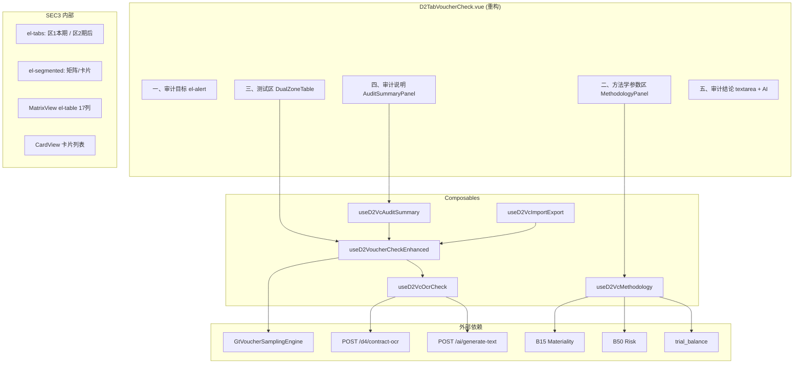

# Design Document — D2-7 凭证检查表增强

## Overview

本设计将 D2-7 凭证检查表从当前单区 flat 表格 + 基础抽样参数区升级为：双区检查表（本期增减变动 + 期后收款调整）、源模板五大区段对齐、卡片+矩阵双视图、行级附件 OCR + AI 核对确认回填、方法学 AI 辅助（联动 B15/B50）、审计说明统计自动化，以及双区分 sheet 导入导出。

### 设计目标

1. **双区独立**：两区数据隔离存储、独立编辑、互不干扰
2. **方法学科学性**：样本量/方法推荐联动重要性水平与风险评估，符合 CAS 1314
3. **AI 辅助闭环**：OCR 识别 → 自动比对 → 确认回填 → PostFill 复核 → 审计说明生成
4. **交互友好**：卡片概览 + 矩阵编辑双视图，减少横滚，一键操作

### 关键设计决策

| 决策 | 选择 | 理由 |
|------|------|------|
| 双区切换方式 | el-tabs（区1/区2）而非 el-segmented | 区块级切换需独立数据空间，tabs 语义更明确 |
| 视图切换 | el-segmented（矩阵/卡片） | 轻量切换，共享数据源 |
| 数据存储粒度 | 每区 JSON 打包存 1 条 remark | 避免逐行存储（铁律：>100行必须打包） |
| 方法学计算 | 复用 useSamplingAlgorithms.ts 现有纯函数 | 已有 CAS 1314 泊松表+MUS 间隔+样本量计算 |
| OCR 服务 | 复用 /d4/contract-ocr（UnifiedOCRService） | 平台统一 OCR 端点，已验证可用 |
| AI 服务 | 复用通用 /api/workpapers/{wpId}/ai/generate-text | 统一 AI 端点，section 参数区分用途 |
| 导入导出 | 复用 useD2TabImportExport → 后端三端点 | 铁律：复用现有 import/export composable |

## Architecture



## Components and Interfaces

### 1. 主组件 D2TabVoucherCheck.vue（重构）

**职责**：五区段容器，编排子组件与 composable。

```typescript
// Props（不变）
interface D2VoucherCheckProps {
  wpId: string
  projectId: string
  allResponses: Map<string, any>
  isReadonly: boolean
  bsDate: string
}
```

### 2. useD2VoucherCheckEnhanced.ts（新建，替代现有 useD2VoucherCheck）

**职责**：双区数据管理、视图状态、行级 CRUD、抽凭填充路由。

```typescript
interface UseD2VoucherCheckEnhancedOptions {
  allResponses: Ref<Map<string, any>>
  isReadonly: Ref<boolean>
  bsDate: Ref<string>
}

interface DualZoneState {
  currentRows: Ref<VoucherCheckRow[]>   // 区1 本期增减变动
  postRows: Ref<VoucherCheckRow[]>      // 区2 期后收款调整
  activeZone: Ref<'current' | 'post'>
  viewMode: Ref<'matrix' | 'card'>
}

// 17列行模型
interface VoucherCheckRow {
  rowId: string
  seq: number
  customerName: string        // 客户名称
  voucherDate: string         // 日期
  voucherNo: string           // 凭证编号
  businessContent: string     // 业务内容
  counterpartAccount: string  // 对方科目
  counterpartDetail: string   // 对方明细科目
  debitAmount: number         // 借方金额
  creditAmount: number        // 贷方金额
  supportingDoc: string       // 支持性文件（附件引用）
  check1: string              // 核对内容1：金额一致性
  check2: string              // 核对内容2：日期一致性
  check3: string              // 核对内容3：对方科目匹配
  check4: string              // 核对内容4：业务内容相符
  check5: string              // 核对内容5：附件完整性
  indexRef: string            // 索引号
  isAbnormal: string          // 是否异常
  remark: string              // 备注说明
  // 元数据
  attachments: AttachmentMeta[]
  ocrResult?: OcrExtractedData
  source?: string             // 来源标记：手动/自动抽凭
}

interface AttachmentMeta {
  fileId: string
  fileName: string
  uploadTime: string
  thumbnailUrl?: string
  ocrStatus: 'pending' | 'success' | 'failed'
}
```

### 3. useD2VcMethodology.ts（新建）

**职责**：方法学参数管理、B15/B50 联动、样本量推荐、测试总体 AI 生成。

```typescript
interface MethodologyState {
  testPopulation: Ref<PopulationDesc>       // 测试总体
  specificSamples: Ref<SpecificSampleItem[]> // 特定样本
  samplingPopulation: Ref<PopulationDesc>   // 抽样总体（自动计算）
  samplingMethod: Ref<string>               // 抽样方法
  samplingProcedure: Ref<string>            // 抽样程序
  recommendedMethod: Ref<string | null>     // AI 推荐方法
  recommendedSampleSize: Ref<number>        // AI 推荐样本量
  recommendedReason: Ref<string>            // 推荐理由
  userSampleSize: Ref<number>               // 用户设定样本量
  sampleSizeDeviation: Ref<'below' | 'ok' | null>
}

interface PopulationDesc {
  amount: number    // 金额合计
  count: number     // 笔数
  description: string // 文字描述
}

interface SpecificSampleItem {
  id: string
  customerName: string
  amount: number
  reason: string         // 标记原因
  confirmed: boolean     // 用户确认
}
```

### 4. useD2VcOcrCheck.ts（新建）

**职责**：行级 OCR 上传 → 识别 → AI 比对 → 确认弹窗 → 回填。

```typescript
interface OcrExtractedData {
  amount?: number
  date?: string
  counterparty?: string
  contractNo?: string
  rawText?: string
}

interface CheckCompareResult {
  amountMatch: 'consistent' | 'inconsistent' | 'undetermined'
  dateMatch: 'consistent' | 'inconsistent' | 'undetermined'
  counterpartyMatch: 'consistent' | 'inconsistent' | 'undetermined'
  businessMatch: 'consistent' | 'inconsistent' | 'undetermined'
  attachmentComplete: 'consistent' | 'inconsistent' | 'undetermined'
}

// 核心流程
async function uploadAndOcr(rowId: string, file: File): Promise<void>
function compareOcrWithRow(ocrData: OcrExtractedData, row: VoucherCheckRow): CheckCompareResult
async function showConfirmDialog(result: CheckCompareResult): Promise<CheckCompareResult | null>
function backfillCheckColumns(rowId: string, confirmed: CheckCompareResult): void
```

### 5. useD2VcAuditSummary.ts（新建）

**职责**：审计说明统计指标自动计算、AI 说明生成。

```typescript
interface AuditSummaryStats {
  occurrenceAmount: number      // 本期发生额合计（from TB）
  checkedAmount: number         // 已检查金额合计
  coverageRatio: number         // 检查覆盖比例 (%)
  checkedCount: number          // 已检查笔数
  abnormalCount: number         // 异常笔数
  abnormalAmount: number        // 异常金额合计
  abnormalRate: number          // 异常率 (%)
}
```

### 6. useD2VcImportExport.ts（新建）

**职责**：双区分 sheet 导入导出（复用后端三端点模式）。

```typescript
// 导出模板：两 sheet（本期增减变动检查 / 期后收款调整检查）各 17 列表头
// 导出数据：两 sheet + 已填数据
// 导入数据：读两 sheet → 分别导入对应区 → 按凭证编号合并
```

## Data Models

### 持久化结构（checklist_responses）

| item_id | 内容 |
|---------|------|
| `D2-vc-current-rows` | 区1 行数据 JSON 数组 |
| `D2-vc-current-params` | 区1 抽样参数 JSON |
| `D2-vc-post-rows` | 区2 行数据 JSON 数组 |
| `D2-vc-post-params` | 区2 抽样参数 JSON |
| `D2-vc-methodology` | 方法学参数区 JSON（测试总体/特定样本/抽样总体/方法/程序） |
| `D2-vc-audit-summary` | 审计说明文字 |
| `D2-vc-conclusion` | 审计结论文字 |
| `D2-vc-view-prefs` | 视图偏好（当前zone/viewMode） |

### 区块分类逻辑

```typescript
function classifyVoucherToZone(voucherDate: string, bsDate: string): 'current' | 'post' {
  if (!voucherDate || !bsDate) return 'current' // 默认归区1
  return voucherDate <= bsDate ? 'current' : 'post'
}
```

### SampledVoucher → VoucherCheckRow 映射

| SampledVoucher 字段 | VoucherCheckRow 字段 |
|---------------------|---------------------|
| voucherNo | voucherNo |
| voucherDate | voucherDate |
| debitAmount | debitAmount |
| creditAmount | creditAmount |
| summary | businessContent |
| counterpartAccount | counterpartAccount |
| accountCode | counterpartDetail |
| （新增）customerName | customerName |

## Correctness Properties

*A property is a characteristic or behavior that should hold true across all valid executions of a system—essentially, a formal statement about what the system should do. Properties serve as the bridge between human-readable specifications and machine-verifiable correctness guarantees.*

### Property 1: Zone data isolation on switch

*For any* sequence of edits applied to zone A's rows, switching the active zone to B and then back to A should yield the exact same row data that was present before the switch.

**Validates: Requirements 1.2**

### Property 2: Voucher date-based zone classification

*For any* voucher date string and balance sheet date string, if voucherDate <= bsDate then classification returns 'current', otherwise it returns 'post'. An empty/null voucherDate always defaults to 'current'.

**Validates: Requirements 1.5, 10.1**

### Property 3: Storage prefix isolation

*For any* row stored in zone 'current', its serialized item_id starts with `D2-vc-current-`; for any row stored in zone 'post', its serialized item_id starts with `D2-vc-post-`. No cross-contamination occurs.

**Validates: Requirements 1.4**

### Property 4: View mode switch preserves data

*For any* dual-zone dataset, toggling viewMode between 'matrix' and 'card' (in any order, any number of times) does not alter the underlying row data arrays.

**Validates: Requirements 3.4**

### Property 5: OCR field extraction correctness

*For any* OCR response object containing fields (amount/date/counterparty/contractNo) with varying key names and value formats, the extraction function produces the correct OcrExtractedData with parsed numeric amounts, normalized date strings, and trimmed counterparty strings.

**Validates: Requirements 4.3**

### Property 6: OCR comparison correctness

*For any* pair of (OcrExtractedData, VoucherCheckRow), the comparison function produces correct match status for each dimension: amount matches if absolute difference < 0.01; date matches if string-equal after normalization; counterparty matches if fuzzy similarity > threshold.

**Validates: Requirements 5.1, 5.2, 5.3**

### Property 7: Check result backfill mapping

*For any* confirmed CheckCompareResult (5-tuple of match statuses), backfilling maps exactly: check1 ← amountMatch text, check2 ← dateMatch text, check3 ← counterpartyMatch text, check4 ← businessMatch text, check5 ← attachmentComplete text.

**Validates: Requirements 5.5**

### Property 8: Cancel preserves existing check values

*For any* VoucherCheckRow with pre-existing non-empty check1~check5 values, invoking the cancel action on the confirmation dialog leaves all five columns unchanged.

**Validates: Requirements 5.6**

### Property 9: MUS sample size computation

*For any* positive tolerable misstatement T, valid risk level (high→0.95/medium→0.90/low→0.80), positive expected misstatement E (where E < T), and positive population amount P: the MUS interval = T / reliabilityFactor(confidence, E/T); sample size = ceil(P / interval). Furthermore, higher risk (higher confidence) produces equal or larger sample size (monotonicity).

**Validates: Requirements 6.3, 11.2**

### Property 10: Random sampling sample size computation

*For any* population size N > 0, confidence level C ∈ {0.80, 0.90, 0.95}, and expected error rate r ∈ [0, 1): the computed sample size follows the formula and is monotonically non-decreasing with confidence level.

**Validates: Requirements 11.3**

### Property 11: Specific sample marking rules

*For any* transaction with amount A, party type (related/normal), and date characteristics (business-day/non-business-day/period-end-cluster), given tolerable misstatement T: the transaction is marked as specific sample if and only if (A >= T) OR (party == related) OR (date is non-business-day or period-end-cluster).

**Validates: Requirements 8.1**

### Property 12: Sampling population arithmetic invariant

*For any* test population (amount_t, count_t) and specific samples subset (amount_s, count_s) where amount_s <= amount_t and count_s <= count_t: sampling_population_amount == amount_t - amount_s AND sampling_population_count == count_t - count_s.

**Validates: Requirements 8.3, 8.4**

### Property 13: Audit summary statistics correctness

*For any* set of VoucherCheckRows across both zones, the computed audit summary satisfies: checkedAmount == sum(debitAmount + creditAmount) over all rows; abnormalCount == count of rows where isAbnormal is truthy; abnormalRate == abnormalCount / totalRows * 100 (or 0 if no rows); coverageRatio == checkedAmount / occurrenceAmount * 100 (or 0 if occurrenceAmount is 0).

**Validates: Requirements 9.1, 9.2**

### Property 14: Merge deduplication on fill

*For any* existing row set E and incoming sampled row set I, merge-mode fill produces a result where: (1) every row in E with voucherNo matching a row in I retains its original check1~check5 values; (2) rows from I whose voucherNo is not in E are appended; (3) total row count == |E| + |I \ E_nos|.

**Validates: Requirements 10.3**

### Property 15: SampledVoucher field mapping completeness

*For any* valid SampledVoucher object, the mapping function produces a VoucherCheckRow where every non-null source field is correctly placed in the corresponding target column, and no target column contains data from the wrong source field.

**Validates: Requirements 10.2**

### Property 16: Sample size deviation indicator

*For any* user-entered sample size U and recommended sample size R (where R > 0): if U < R then deviation == 'below' (⚠️ warning); if U >= R then deviation == 'ok' (✓ satisfied).

**Validates: Requirements 11.5**

### Property 17: Import/Export round trip

*For any* dual-zone dataset (currentRows, postRows), exporting to xlsx (two sheets) and then importing that xlsx back should produce datasets equivalent to the originals (preserving all 17 column values per row, ordering may differ but content is identical by voucherNo key).

**Validates: Requirements 12.3, 12.4**

## Error Handling

| 场景 | 处理策略 |
|------|---------|
| OCR 服务不可用 | ElMessage.warning 降级提示，保留附件记录，用户可手动录入 |
| AI 服务不可用 | ElMessage.warning，所有 AI 按钮禁用态，不阻断手动操作 |
| B15/B50 数据缺失 | 方法学参数区显示"数据未配置"，禁用 AI 推荐但允许手动填写 |
| 试算表 1122 无数据 | 测试总体显示"未获取到试算表数据"，AI 生成按钮禁用 |
| 导入 xlsx 缺少 sheet | 仅导入存在的 sheet，ElMessage.info 提示跳过 |
| 导入 xlsx 列不匹配 | 按列名匹配（容忍顺序不同），无法匹配的列跳过并 warn |
| JSON 解析失败 | 返回空数组/默认值，不崩溃 |
| 凭证编号重复（合并模式）| 保留已有行的核对结果，不覆盖 |
| 附件上传失败 | ElMessage.error，不影响行其他数据 |

## Testing Strategy

### Property-Based Testing (PBT)

本特性包含大量纯函数计算逻辑，适合 PBT：

- **框架**：fast-check（前端 TypeScript，已在项目中使用）
- **迭代次数**：每个 property test 最少 100 次
- **标签格式**：`Feature: d2-7-voucher-check-enhancement, Property {N}: {title}`

重点 PBT 覆盖：
- P2 日期分类（classifyVoucherToZone 纯函数）
- P5 OCR 字段提取（mapOcrToCheckFields 纯函数）
- P6 OCR 比对（compareOcrWithRow 纯函数）
- P7 回填映射（backfillCheckColumns 纯函数）
- P9 MUS 样本量计算（复用 computeMusInterval / computeSampleSize）
- P11 特定样本标记（markSpecificSamples 纯函数）
- P12 抽样总体计算（computeSamplingPopulation 纯函数）
- P13 统计指标（computeAuditSummary 纯函数）
- P14 合并去重（mergeVoucherRows 纯函数）
- P17 导入导出 round trip

### Unit Tests (Example-Based)

- 五区段渲染顺序
- 默认视图为矩阵
- el-segmented / el-tabs 正确渲染
- AI 推荐标签格式
- 只读计算字段样式
- PostFill 弹窗触发时机

### Integration Tests

- B15/B50 数据获取
- OCR 端点调用与响应解析
- AI 端点调用（generate-text）
- checklist_responses PUT 持久化
- 试算表数据获取

### Edge Case Tests

- OCR 服务 500 → 降级
- 导入 xlsx 缺 sheet → 部分导入
- 空行数据 → 统计为 0
- bsDate 为空 → 全部归区1
