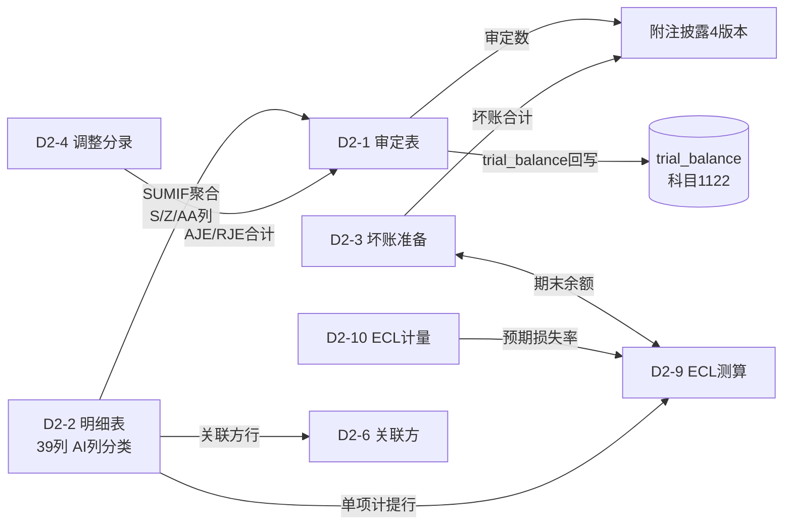

# Design Document: D2 应收账款底稿精细化组件拆分

## Overview

将 `useD2AccountsReceivable.ts`（1123行）巨型composable拆分为18个独立子composable + 对应Vue子组件。D2来自3个源xlsx共22个有效sheet，按功能域分为：审定表组（D2-1）、明细表组（D2-2/D2-3/D2-4）、分析组（D2-5）、检查组（D2-6~D2-8/D2-11~D2-13）、ECL组（D2-9/D2-10）、截止测试（D2-14相关）、附注组（4版本）和通用架构（公式引擎/导入导出/双模式/程序表）。

核心设计目标：
- 从1123行巨型composable中拆出~800行各sheet逻辑
- 18个独立子composable + 对应Vue子组件 + 1个共享公式引擎
- 主入口 useD2AccountsReceivable.ts 降至~300行（Tab管理+联动协调+EventBus监听）
- SUMIF引擎（D2-2按信用风险组合方式聚合→D2-1）为D2独有核心
- 跨sheet取数通过同一 allResponses Map 的 computed 响应式链（不走API）
- 双模式（HTML ↔ OO）不拆文件，OO API隐藏非当前sheet
- 持久化复用 checklist_responses 表 + useD2FormData 基础设施

## Architecture

### 组件依赖关系

```mermaid
graph TD
    subgraph "GtD2AccountsReceivable.vue (主入口)"
        MAIN[el-tabs 容器 17个Tab]
    end

    subgraph "新增子组件 (本spec)"
        ADJ[D2TabAdjudication.vue<br/>审定表D2-1]
        DET[D2TabDetail.vue<br/>明细表D2-2 39列]
        BD[D2TabBadDebt.vue<br/>坏账准备D2-3]
        ENT[D2TabAdjustment.vue<br/>调整分录D2-4]
        ANA[D2TabAnalysis.vue<br/>分析程序D2-5]
        RP[D2TabRelatedParty.vue<br/>关联方D2-6]
        VC[D2TabVoucherCheck.vue<br/>凭证抽查D2-7]
        POL[D2TabPolicyCheck.vue<br/>政策检查D2-8]
        ECL[D2TabEcl.vue<br/>ECL测算D2-9+D2-10]
        WO[D2TabWriteoffCheck.vue<br/>转回核销D2-11]
        PL[D2TabPledgeCheck.vue<br/>质押保理D2-12]
        BIZ[D2TabBizModel.vue<br/>业务模式D2-13]
        CUT[D2TabCutoff.vue<br/>截止测试]
        DISC[D2TabDisclosure.vue<br/>附注披露4版本]
        PROC[D2TabProcedure.vue<br/>程序表D2A]
    end

    subgraph "新增composables (本spec)"
        USE_ADJ[useD2Adjudication.ts ~350行]
        USE_DET[useD2Detail.ts ~400行]
        USE_BD[useD2BadDebt.ts ~300行]
        USE_ENT[useD2Adjustment.ts ~250行]
        USE_ANA[useD2Analysis.ts ~200行]
        USE_RP[useD2RelatedParty.ts ~200行]
        USE_VC[useD2VoucherCheck.ts ~250行]
        USE_POL[useD2PolicyCheck.ts ~200行]
        USE_ECL[useD2Ecl.ts ~400行]
        USE_WO[useD2WriteoffCheck.ts ~200行]
        USE_PL[useD2PledgeCheck.ts ~250行]
        USE_BIZ[useD2BizModel.ts ~200行]
        USE_CUT[useD2Cutoff.ts ~200行]
        USE_DISC[useD2Disclosure.ts ~350行]
        USE_PROC[useD2Procedure.ts ~200行]
        FORMULA[useD2FormulaEngine.ts ~150行]
        IE[useD2ImportExport.ts ~200行]
        DM[useD2DualMode.ts ~100行]
    end

    subgraph "已有基础设施 (复用)"
        FORM_DATA[useD2FormData.ts<br/>loadAll/saveImmediate/writeback]
        EVENT_BUS[EventBus<br/>window CustomEvent]
        DISPLAY[displayPrefs.fmtAmount]
        OO[GtOnlyOfficeSheet.vue]
    end

    MAIN --> ADJ & DET & BD & ENT & ANA & RP & VC & POL & ECL & WO & PL & BIZ & CUT & DISC & PROC
    ADJ --> USE_ADJ
    DET --> USE_DET
    BD --> USE_BD
    ENT --> USE_ENT
    ANA --> USE_ANA
    RP --> USE_RP
    VC --> USE_VC
    POL --> USE_POL
    ECL --> USE_ECL
    WO --> USE_WO
    PL --> USE_PL
    BIZ --> USE_BIZ
    CUT --> USE_CUT
    DISC --> USE_DISC
    PROC --> USE_PROC

    USE_ADJ --> FORMULA & FORM_DATA & EVENT_BUS
    USE_DET --> FORMULA & FORM_DATA
    USE_BD --> FORMULA & FORM_DATA
    USE_ENT --> FORMULA & FORM_DATA & EVENT_BUS
    USE_ANA --> FORMULA & FORM_DATA
    USE_RP --> FORMULA & FORM_DATA
    USE_VC --> FORMULA & FORM_DATA
    USE_POL --> FORM_DATA
    USE_ECL --> FORMULA & FORM_DATA
    USE_WO --> FORMULA & FORM_DATA
    USE_PL --> FORMULA & FORM_DATA
    USE_BIZ --> FORM_DATA
    USE_CUT --> FORMULA & FORM_DATA
    USE_DISC --> FORMULA & FORM_DATA
    USE_PROC --> FORM_DATA & EVENT_BUS

    USE_ADJ -.->|SUMIF取数| USE_DET
    USE_ADJ -.->|AJE/RJE| USE_ENT
    USE_BD -.->|ECL差异| USE_ECL
    USE_ECL -.->|损失率输出| USE_BD
    USE_DISC -.->|审定数引用| USE_ADJ
    USE_DISC -.->|坏账引用| USE_BD
    USE_RP -.->|关联方导入| USE_DET

    ADJ & DET & BD & ENT & ANA & RP & VC & ECL & WO & PL & CUT --> DISPLAY & OO & IE & DM
```



### 跨Sheet数据流



### 文件结构

```
audit-platform/frontend/src/components/workpaper/
├── GtD2AccountsReceivable.vue        # 主入口（修改：17个tab-pane引用子组件）
├── d2/                                # 新增目录
│   ├── D2TabAdjudication.vue          # 审定表D2-1（~350行）
│   ├── D2TabDetail.vue                # 明细表D2-2 39列（~400行）
│   ├── D2TabBadDebt.vue               # 坏账准备D2-3（~300行）
│   ├── D2TabAdjustment.vue            # 调整分录D2-4（~250行）
│   ├── D2TabAnalysis.vue              # 分析程序D2-5（~250行）
│   ├── D2TabRelatedParty.vue          # 关联方D2-6（~250行）
│   ├── D2TabVoucherCheck.vue          # 凭证抽查D2-7（~300行）
│   ├── D2TabPolicyCheck.vue           # 政策检查D2-8（~300行）
│   ├── D2TabEcl.vue                   # ECL测算D2-9+D2-10（~400行）
│   ├── D2TabWriteoffCheck.vue         # 转回核销D2-11（~250行）
│   ├── D2TabPledgeCheck.vue           # 质押保理D2-12（~300行）
│   ├── D2TabBizModel.vue              # 业务模式D2-13（~250行）
│   ├── D2TabCutoff.vue                # 截止测试（~200行）
│   ├── D2TabDisclosure.vue            # 附注披露4版本（~350行）
│   └── D2TabProcedure.vue             # 程序表D2A（~250行）
├── composables/
│   ├── useD2FormulaEngine.ts          # 共享公式纯函数（~150行）
│   ├── useD2Adjudication.ts           # 审定表逻辑（~350行）
│   ├── useD2Detail.ts                 # 明细表逻辑（~400行）
│   ├── useD2BadDebt.ts                # 坏账准备逻辑（~300行）
│   ├── useD2Adjustment.ts             # 调整分录逻辑（~250行）
│   ├── useD2Analysis.ts               # 分析程序逻辑（~200行）
│   ├── useD2RelatedParty.ts           # 关联方逻辑（~200行）
│   ├── useD2VoucherCheck.ts           # 凭证抽查逻辑（~250行）
│   ├── useD2PolicyCheck.ts            # 政策检查逻辑（~200行）
│   ├── useD2Ecl.ts                    # ECL合并逻辑（~400行）
│   ├── useD2WriteoffCheck.ts          # 转回核销逻辑（~200行）
│   ├── useD2PledgeCheck.ts            # 质押保理逻辑（~250行）
│   ├── useD2BizModel.ts              # 业务模式逻辑（~200行）
│   ├── useD2Cutoff.ts                 # 截止测试逻辑（~200行）
│   ├── useD2Disclosure.ts             # 附注披露逻辑（~350行）
│   ├── useD2Procedure.ts              # 程序表逻辑（~200行）
│   ├── useD2ImportExport.ts           # 导入导出通用（~200行）
│   ├── useD2DualMode.ts               # 双模式切换（~100行）
│   ├── useD2FormData.ts               # 已有，复用
│   └── useD2AccountsReceivable.ts     # 已有，删除拆出部分→~300行

backend/app/routers/wp_render_strategies/
│   └── _d2_import_export.py           # 新增：导入导出端点（~250行）
```

### 与现有 useD2AccountsReceivable 的拆分边界

| 拆出内容 | 目标文件 |
|---------|---------|
| SUMIF聚合逻辑 + 审定表三分类行计算 + EventBus审定回写 | useD2Adjudication.ts |
| D2-2明细表39列行管理 + 关联方匹配 + 虚拟滚动 | useD2Detail.ts |
| D2-3坏账准备变动表 + ECL差异校验 | useD2BadDebt.ts |
| D2-4调整分录CRUD + 借贷平衡校验 + EventBus发布 | useD2Adjustment.ts |
| D2-5分析指标计算(周转率/天数/坏账率) | useD2Analysis.ts |
| D2-6关联方检查表 + 从D2-2导入 | useD2RelatedParty.ts |
| D2-7凭证抽样参数 + 明细表 + 异常标记 | useD2VoucherCheck.ts |
| D2-8段落型政策检查 + 进度追踪 | useD2PolicyCheck.ts |
| D2-9单项ECL + D2-10迁徙率矩阵 + 跨sheet联动 | useD2Ecl.ts |
| D2-11转回/核销双段表 + D2-3校验 | useD2WriteoffCheck.ts |
| D2-12质押表 + 保理终止确认(CAS 23) | useD2PledgeCheck.ts |
| D2-13 QA问答 + 业务模式推荐 | useD2BizModel.ts |
| 截止测试 + determineCutoff跨期判定 | useD2Cutoff.ts |
| 附注4版本(上市×2+国企×2) + 动态切换 | useD2Disclosure.ts |
| 程序表D2A卡片 + EventBus监听风险/控制 | useD2Procedure.ts |
| 全部纯公式函数(9个) | useD2FormulaEngine.ts |
| 导入导出三级(8个sheet) | useD2ImportExport.ts |
| HTML↔OO切换逻辑 | useD2DualMode.ts |

拆分后 `useD2AccountsReceivable.ts` 保留：Tab管理、activeTab路由同步、联动协调（跨sheet computed链）、EventBus监听/转发（~300行）。

## Components and Interfaces

### 1. useD2FormulaEngine.ts — 共享纯函数模块

```typescript
// 所有公式为纯函数，无副作用，便于单元测试和PBT

/** 安全数值解析: null/undefined/空串/NaN → 0 */
export function parseNum(val: string | number | null | undefined): number

/** 审定数 = 未审数 + AJE净额 + RJE净额 */
export function getAuditedAmount(unadjusted: number, aje: number, rje: number): number

/** 变动率: 期初=0且审定=0→'' | 期初=0→1 | 其他→(审定-期初)/期初 */
export function getChangeRate(prior: number, audited: number): number | ''

/** 应计提坏账 = 余额 × 损失率 */
export function calculateProvision(balance: number, lossRate: number): number

/** 差异 = 实际账面 - 应计提 */
export function calculateDifference(actual: number, should: number): number

/** 质押比例 = 质押总额 / 应收账款审定总额 */
export function calculatePledgeRatio(pledged: number, total: number): number

/** 截止判定: 收入日期 > 资产负债表日 → true(跨期) */
export function determineCutoff(revenueDate: string, bsDate: string): boolean

/** SUMIF: 从行数组中按分类字段聚合指定值列 */
export function sumif<T extends Record<string, any>>(
  rows: T[], classificationField: keyof T,
  classificationValue: string, valueField: keyof T
): number

/** ECL迁徙率连乘计算预期损失率 */
export function calculateExpectedLossRate(migrationRates: number[]): number

/** 周转率 = 营业收入 / 平均应收账款 */
export function calculateTurnoverRate(revenue: number, avgReceivable: number): number

/** 周转天数 = 365 / 周转率 */
export function calculateTurnoverDays(turnoverRate: number): number
```

### 2. useD2Adjudication.ts — 审定表D2-1 composable

```typescript
export interface AdjudicationRow {
  rowKey: string              // 'individual' | 'aging' | 'customer-type' | 'total'
  label: string               // '单项计提' | '账龄组合' | '客户类型组合' | '合计'
  // 期初
  priorUnadjusted: number
  priorAje: number
  priorRje: number
  priorAudited: number        // = 未审 + AJE + RJE
  // 期末
  currentUnadjusted: number   // SUMIF从D2-2取得
  currentAje: number          // SUMIF从D2-2取得
  currentRje: number          // SUMIF从D2-2取得
  currentAudited: number      // = 未审 + AJE + RJE
  // 变动
  change: number              // = 期末审定 - 期初审定
  changeRate: number | ''     // = (期末-期初)/期初
  reasonAnalysis: string
  isFromSumif: boolean        // SUMIF自动取数标记
  isEditable: boolean         // 合计行=false
}

export function useD2Adjudication(options: UseD2BaseOptions) {
  return {
    adjudicationRows: ComputedRef<AdjudicationRow[]>,
    totalRow: ComputedRef<AdjudicationRow>,
    trialBalanceDiff: ComputedRef<{ amount: number; isZero: boolean }>,
    updateCell: (rowKey: string, field: string, value: number | string) => void,
    publishAdjudicated: () => void,
    // SUMIF状态
    sumifStatus: Ref<'loaded' | 'computing' | 'error'>,
  }
}
```

### 3. useD2Detail.ts — 明细表D2-2 composable (39列)

```typescript
export interface DetailRow {
  rowId: string
  seq: number                    // 序号
  customerName: string           // 客户名称
  companyCode: string            // 公司代码
  relationType: string           // 关联方类型(非关联方/控股股东/实际控制人/其他关联方)
  // 期初(4列)
  priorUnadjusted: number
  priorAje: number
  priorRje: number
  priorAudited: number           // 自动计算
  // 期初审定账龄(6档)
  priorAging1Year: number
  priorAging1to2: number
  priorAging2to3: number
  priorAging3to4: number
  priorAging4to5: number
  priorAgingOver5: number
  // 本期发生
  debitOccurrence: number        // 借方发生
  creditOccurrence: number       // 贷方发生
  endBalance: number             // 期末余额 = 期初审定+借方-贷方
  reclassification: number       // 被审计单位重分类
  currentUnadjusted: number      // 期末未审 = 期末余额+重分类
  // 期末未审账龄(6档)
  currentAging1Year: number
  currentAging1to2: number
  currentAging2to3: number
  currentAging3to4: number
  currentAging4to5: number
  currentAgingOver5: number
  // 调整
  currentAje: number             // 账项调整(Z列)
  currentRje: number             // 重分类调整(AA列)
  currentAudited: number         // 期末审定 = 期末未审+AJE+RJE
  // 期末审定账龄(6档)
  auditedAging1Year: number
  auditedAging1to2: number
  auditedAging2to3: number
  auditedAging3to4: number
  auditedAging4to5: number
  auditedAgingOver5: number
  // 分类与标记
  creditRiskClassification: string  // 信用风险组合方式(AI列): 单项计提/账龄组合/客户类型组合
  groupName: string              // 组合名称(AJ列)
  isConfirmation: boolean        // 是否函证
  postPayment: number            // 期后回款
  remark: string                 // 备注
}

export function useD2Detail(options: UseD2BaseOptions & {
  relatedParties: Ref<string[]>
}) {
  return {
    rows: Ref<DetailRow[]>,
    filteredRows: ComputedRef<DetailRow[]>,
    totalRow: ComputedRef<Partial<DetailRow>>,
    searchQuery: Ref<string>,
    addRow: () => void,
    removeRow: (rowId: string) => void,
    updateCell: (rowId: string, field: string, value: any) => void,
    matchRelatedParty: (name: string) => string,
    // 虚拟滚动
    useVirtualScroll: ComputedRef<boolean>,  // rows.length > 30
  }
}
```

### 4. useD2BadDebt.ts — 坏账准备明细表D2-3 composable

```typescript
export interface BadDebtRow {
  rowId: string
  category: 'individual' | 'aging' | 'customer-type'  // 三分类
  label: string               // 债务人/组合名称
  isSubRow: boolean           // 子行(可展开)
  isFixed: boolean            // 分类汇总行不可删
  // 期初(4列)
  priorUnadjusted: number
  priorAje: number
  priorRje: number
  priorAudited: number        // = 未审+AJE+RJE
  // 本期增加(2列)
  currentProvision: number    // 计提
  currentTransferIn: number   // 转入
  // 本期减少(3列)
  currentRecovery: number     // 收回
  currentReversal: number     // 转回
  currentWriteOff: number     // 核销
  // 期末(4列)
  currentUnadjusted: number   // = 期初审定+计提+转入-收回-转回-核销
  currentAje: number
  currentRje: number
  currentAudited: number      // = 期末未审+AJE+RJE
}

export function useD2BadDebt(options: UseD2BaseOptions & {
  eclTestTotal: Ref<number>   // D2-9 ECL测试结果
}) {
  return {
    individualRows: Ref<BadDebtRow[]>,
    agingRows: Ref<BadDebtRow[]>,
    customerTypeRows: Ref<BadDebtRow[]>,
    totalRow: ComputedRef<BadDebtRow>,
    eclDifference: ComputedRef<number>,
    eclWarning: ComputedRef<string | null>,
    addSubRow: (category: BadDebtRow['category']) => void,
    removeSubRow: (rowId: string) => void,
    updateCell: (rowId: string, field: string, value: number) => void,
  }
}
```

### 5. useD2Adjustment.ts — 调整分录D2-4 composable

```typescript
export interface AdjustmentEntry {
  rowId: string
  description: string          // 调整事项说明
  entryType: 'AJE' | 'RJE'   // 类别
  reportItem: string           // 报表项目
  accountName: string          // 科目名称
  noteItem: string             // 附注项目
  debitAmount: number          // 借方调整金额
  creditAmount: number         // 贷方调整金额
  indexRef: string             // 索引
  remark: string               // 备注
}

export function useD2Adjustment(options: UseD2BaseOptions) {
  return {
    entries: Ref<AdjustmentEntry[]>,
    debitTotal: ComputedRef<number>,
    creditTotal: ComputedRef<number>,
    isBalanced: ComputedRef<boolean>,
    balanceDiff: ComputedRef<number>,
    addEntry: () => void,
    removeEntry: (rowId: string) => void,
    updateEntry: (rowId: string, field: string, value: any) => void,
    publishAdjustment: () => void,    // EventBus 'adjustment:created'
    pushToA13: (rowIds: string[]) => void,
  }
}
```

### 6. useD2Analysis.ts — 分析程序D2-5 composable

```typescript
export interface AnalysisIndicators {
  turnoverRate: number         // 周转率
  turnoverDays: number         // 周转天数
  priorTurnoverDays: number    // 上期周转天数
  turnoverDaysChange: number   // 周转天数变动率
  badDebtRate: number          // 坏账计提比率
  top5Concentration: number    // 前五大客户集中度
  agingDistribution: { aging: string; amount: number; ratio: number }[]
}

export function useD2Analysis(options: UseD2BaseOptions) {
  return {
    indicators: ComputedRef<AnalysisIndicators>,
    turnoverDaysWarning: ComputedRef<boolean>,  // 变动>30%
    dataSource: Ref<string>,
    remark: Ref<string>,
    updateManualField: (field: string, value: any) => void,
  }
}
```

### 7. useD2Ecl.ts — ECL合并composable (D2-9 + D2-10)

```typescript
// D2-9 单项ECL
export interface EclSingleRow {
  rowId: string
  debtorName: string           // 债务人名称
  auditedBalance: number       // 审定账面余额
  expectedLossRate: number     // 预期信用损失率
  shouldProvision: number      // 期末应计提 = 余额×损失率
  actualBalance: number        // 期末坏账准备账面余额(从D2-3取)
  difference: number           // 差异 = 实际 - 应计提
  basis: string                // 计提依据及文件
  indexRef: string             // 索引号
}

// D2-10 组合迁徙率
export interface MigrationRateRow {
  agingBand: string            // 账龄段
  year1Rate: number            // 年度1迁徙率
  year2Rate: number            // 年度2迁徙率
  year3Rate: number            // 年度3迁徙率
  avgRate: number              // 三年平均 = AVG(y1,y2,y3)
  expectedLossRate: number     // 预期损失率 = 连乘
}

// D2-10 单项折现
export interface EclDiscountRow {
  rowId: string
  debtorName: string
  balance: number
  scenarios: { cashflow: number; discountedValue: number; probability: number; weighted: number }[]
  expectedLossRate: number     // = 1 - ΣPV/余额
  conclusion: string
}

export function useD2Ecl(options: UseD2BaseOptions & {
  badDebtActualTotal: Ref<number>  // 从D2-3取
}) {
  return {
    // D2-9
    singleRows: Ref<EclSingleRow[]>,
    singleTotal: ComputedRef<{ balance: number; should: number; actual: number; diff: number }>,
    addSingleRow: () => void,
    removeSingleRow: (rowId: string) => void,
    importFromDetail: () => void,  // 从D2-2筛选单项计提行导入
    // D2-10 单项折现
    discountRows: Ref<EclDiscountRow[]>,
    // D2-10 组合迁徙率
    migrationMatrix: Ref<MigrationRateRow[]>,
    // 输出到D2-9
    outputLossRates: ComputedRef<Map<string, number>>,  // 债务人→损失率
    // 变动提示
    migrationChangeWarning: ComputedRef<{ band: string; change: number }[]>,
    updateCell: (section: 'single' | 'discount' | 'migration', rowId: string, field: string, value: any) => void,
  }
}
```

### 8. useD2RelatedParty.ts — 关联方D2-6 composable

```typescript
export interface RelatedPartyRow {
  rowId: string
  partyName: string            // 关联方名称
  relationship: string         // 关联关系
  priorBalance: number         // 期初余额
  debitOccurrence: number      // 借方发生
  creditOccurrence: number     // 贷方发生
  endBalance: number           // 期末余额 = 期初+借方-贷方
  badDebtProvision: number     // 减：坏账准备
  bookValue: number            // 账面价值 = 期末-坏账
  agingInfo: string            // 发生时间及账龄
  reason: string               // 发生原因（款项性质）
  postPayment: number          // 期后回款
  indexRef: string             // 索引号
}

export function useD2RelatedParty(options: UseD2BaseOptions) {
  return {
    rows: Ref<RelatedPartyRow[]>,
    totalRow: ComputedRef<Partial<RelatedPartyRow>>,
    addRow: () => void,
    removeRow: (rowId: string) => void,
    importFromDetail: () => void,  // 从D2-2按关联方类型≠非关联方导入
    updateCell: (rowId: string, field: string, value: any) => void,
  }
}
```

### 9. useD2VoucherCheck.ts — 凭证抽查D2-7 composable

```typescript
export interface SamplingParams {
  totalPopulation: string      // 抽样总体描述
  specificSamples: string      // 特定样本
  targetSampleSize: number     // 目标样本量
  samplingMethod: string       // 抽取方式
}

export interface VoucherSampleRow {
  rowId: string
  seq: number
  voucherNo: string            // 凭证号
  voucherDate: string          // 凭证日期
  summary: string              // 摘要
  debitAmount: number          // 借方金额
  creditAmount: number         // 贷方金额
  counterAccount: string       // 对方科目
  invoiceNo: string            // 发票号
  invoiceDate: string          // 发票日期
  invoiceAmount: number        // 发票金额
  contractNo: string           // 合同编号
  deliveryNo: string           // 出库单号
  customerConfirm: string      // 客户确认
  agingVerify: string          // 账龄核实
  abnormalFlag: string         // 异常标记
  conclusion: string           // 结论
  indexRef: string             // 索引号
}

export function useD2VoucherCheck(options: UseD2BaseOptions) {
  return {
    params: Ref<SamplingParams>,
    samples: Ref<VoucherSampleRow[]>,
    progress: ComputedRef<{ current: number; target: number; ratio: number }>,
    abnormalCount: ComputedRef<number>,
    abnormalRate: ComputedRef<number>,
    addSample: () => void,
    removeSample: (rowId: string) => void,
    updateCell: (rowId: string, field: string, value: any) => void,
    autoMarkCutoff: (rowId: string) => void,  // 自动标记跨期
  }
}
```

### 10. useD2PolicyCheck.ts — 政策检查D2-8 composable

```typescript
export interface PolicyParagraph {
  paragraphId: string
  title: string                // 政策段落标题
  policyDescription: string    // 政策条款描述(只读)
  actualSituation: string      // 被审计单位实际情况(可编辑)
  auditorEvaluation: string    // 审计师评价(可编辑)
  conclusion: 'Y' | 'N' | 'NA' | ''  // 结论
}

export function useD2PolicyCheck(options: UseD2BaseOptions) {
  return {
    paragraphs: Ref<PolicyParagraph[]>,
    completedCount: ComputedRef<number>,
    totalCount: ComputedRef<number>,
    hasNonCompliant: ComputedRef<boolean>,
    updateParagraph: (id: string, field: string, value: string) => void,
  }
}
```

### 11. useD2WriteoffCheck.ts — 转回核销D2-11 composable

```typescript
export interface WriteoffRow {
  rowId: string
  section: 'reversal' | 'writeoff'  // 转回区/核销区
  entityName: string           // 单位名称
  reason: string               // 转回/核销原因
  method: string               // 收回方式/核销审批程序
  originalBasis: string        // 原确定坏账准备的依据
  amount: number               // 收回或转回/核销金额
  cumulativeProvision: number  // 收回前累计已计提金额
  analysis: string             // 合理性分析
  indexRef: string             // 索引号
}

export function useD2WriteoffCheck(options: UseD2BaseOptions) {
  return {
    reversalRows: Ref<WriteoffRow[]>,
    writeoffRows: Ref<WriteoffRow[]>,
    reversalTotal: ComputedRef<number>,
    writeoffTotal: ComputedRef<number>,
    reversalConsistencyWarning: ComputedRef<string | null>,  // 与D2-3校验
    addRow: (section: 'reversal' | 'writeoff') => void,
    removeRow: (rowId: string) => void,
    updateCell: (rowId: string, field: string, value: any) => void,
  }
}
```

### 12. useD2PledgeCheck.ts — 质押保理D2-12 composable

```typescript
export interface PledgeRow {
  rowId: string
  customerName: string
  endBalance: number           // 期末余额
  pledgeAmount: number         // 质押金额
  pledgee: string              // 质权人
  pledgeReason: string         // 质押原因
  pledgeCondition: string      // 质押条件
  pledgePeriod: string         // 质押期限
  pledgeAgreement: string      // 质押协议
  indexRef: string
}

export interface FactoringRow {
  rowId: string
  customerName: string
  factoringAmount: number      // 保理金额
  factor: string               // 保理商
  contractNo: string           // 合同号
  riskTransferred: boolean     // 是否转移风险
  controlRetained: boolean     // 是否保留控制
  derecognitionConclusion: string  // 终止确认结论(自动判定)
  remark: string
}

export function useD2PledgeCheck(options: UseD2BaseOptions & {
  auditedTotal: Ref<number>    // 应收账款审定总额
}) {
  return {
    pledgeRows: Ref<PledgeRow[]>,
    factoringRows: Ref<FactoringRow[]>,
    pledgeTotal: ComputedRef<number>,
    pledgeRatio: ComputedRef<number>,       // 质押比例
    pledgeRatioWarning: ComputedRef<boolean>,  // >50%
    addPledgeRow: () => void,
    addFactoringRow: () => void,
    removeRow: (rowId: string) => void,
    updateCell: (rowId: string, field: string, value: any) => void,
    // CAS 23 自动判定
    autoDerecognition: (rowId: string) => string,
  }
}
```

### 13. useD2BizModel.ts — 业务模式D2-13 composable

```typescript
export interface BizModelJudgment {
  questionId: string
  question: string             // 判断题文本
  answer: 'Y' | 'N' | ''      // 回答
  basis: string                // 依据
}

export interface BizModelGroup {
  rowId: string
  groupName: string            // 组合名称
  businessModel: string        // 管理业务模式
  basis: string                // 具体依据
  indexRef: string
  remark: string
  reportItem: string           // 报表项目分类
}

export function useD2BizModel(options: UseD2BaseOptions) {
  return {
    judgments: Ref<BizModelJudgment[]>,     // 4个Y/N判断题
    groups: Ref<BizModelGroup[]>,           // 业务模式判定区
    recommendedModel: ComputedRef<string>,  // 自动推荐
    allAnswered: ComputedRef<boolean>,
    addGroup: () => void,
    removeGroup: (rowId: string) => void,
    updateJudgment: (id: string, field: string, value: string) => void,
    updateGroup: (rowId: string, field: string, value: string) => void,
  }
}
```

### 14. useD2Cutoff.ts — 截止测试 composable

```typescript
export interface CutoffSample {
  rowId: string
  seq: number
  invoiceNo: string            // 发票号
  revenueDate: string          // 收入确认日期
  receivableDate: string       // 应收账款入账日期
  amount: number               // 金额
  isCutoff: boolean            // 跨期判定(自动)
  conclusion: string           // 结论
  remark: string
}

export function useD2Cutoff(options: UseD2BaseOptions & {
  bsDate: Ref<string>          // 资产负债表日
}) {
  return {
    samples: Ref<CutoffSample[]>,
    cutoffCount: ComputedRef<number>,
    cutoffTotalAmount: ComputedRef<number>,
    hasCutoffIssue: ComputedRef<boolean>,
    addSample: () => void,
    removeSample: (rowId: string) => void,
    updateCell: (rowId: string, field: string, value: any) => void,
  }
}
```

### 15. useD2Disclosure.ts — 附注披露 composable (4版本)

```typescript
export type DisclosureVersion = 'listed-d2-1' | 'soe-d2-1' | 'listed-aging' | 'soe-aging'

export interface DisclosureSection {
  sectionId: string
  sectionLabel: string
  rows: DisclosureRow[]
  totalRow?: DisclosureRow
}

export interface DisclosureRow {
  rowId: string
  label: string
  amount: number
  ratio: number               // 自动计算 = amount/total×100%
  badDebt: number
  badDebtRatio: number
  netAmount: number           // = amount - badDebt
  isEditable: boolean
  isFromCrossSheet: boolean   // 从审定表/坏账表自动取数
}

export function useD2Disclosure(options: UseD2BaseOptions) {
  return {
    activeVersion: Ref<DisclosureVersion>,
    sections: ComputedRef<DisclosureSection[]>,
    switchVersion: (version: DisclosureVersion) => void,
    updateCell: (sectionId: string, rowId: string, field: string, value: number) => void,
    // 跨sheet一致性
    inconsistencyWarnings: ComputedRef<{ cell: string; expected: number; actual: number }[]>,
  }
}
```

### 16. useD2Procedure.ts — 程序表D2A composable

```typescript
export interface ProcedureStep {
  stepId: string
  seq: number
  description: string          // 审计程序描述
  category: string             // 程序分类
  objective: string            // 审计目标
  status: 'not_started' | 'in_progress' | 'completed' | 'not_applicable'
  executor: string             // 执行人
  date: string                 // 日期
  finding: string              // 发现
  conclusion: string           // 结论
  indexRef: string             // 索引号
  riskLevel: 'H' | 'M' | 'L' | ''  // 风险等级(从EventBus)
  controlConclusion: string    // 控制测试结论(从EventBus)
}

export function useD2Procedure(options: UseD2BaseOptions) {
  return {
    steps: Ref<ProcedureStep[]>,
    completedCount: ComputedRef<number>,
    totalCount: ComputedRef<number>,
    allNecessaryDone: ComputedRef<boolean>,
    overallConclusion: Ref<string>,
    updateStep: (stepId: string, field: string, value: any) => void,
    // EventBus监听
    onRiskAssessed: (payload: { riskLevel: string }) => void,
    onControlConcluded: (payload: { conclusion: string }) => void,
  }
}
```

### 17. useD2ImportExport.ts — 导入导出通用 composable

```typescript
export type ImportableSheet = 'D2-2' | 'D2-3' | 'D2-4' | 'D2-6' | 'D2-7' | 'D2-9' | 'D2-11' | 'D2-12'

export function useD2ImportExport(options: { wpId: Ref<string> }) {
  return {
    exportTemplate: (sheet: ImportableSheet) => Promise<void>,
    exportData: (sheet: ImportableSheet) => Promise<void>,
    importData: (sheet: ImportableSheet, file: File) => Promise<{ rowCount: number; fieldCount: number }>,
    importing: Ref<boolean>,
    lastError: Ref<string | null>,
  }
}
```

### 18. useD2DualMode.ts — 双模式切换 composable

```typescript
export function useD2DualMode(options: {
  wpId: Ref<string>
  currentSheet: Ref<string>
  onSwitchToHtml: () => Promise<void>  // 重新加载数据
}) {
  return {
    mode: Ref<'html' | 'onlyoffice'>,
    ooAvailable: Ref<boolean>,
    switchMode: (target: 'html' | 'onlyoffice') => Promise<void>,
    ooConfig: Ref<any>,
  }
}
```

### 19. 后端导入导出接口 — _d2_import_export.py

```python
# POST /api/workpapers/{wp_id}/d2/export-template?sheet=D2-2
# POST /api/workpapers/{wp_id}/d2/export-data?sheet=D2-2
# POST /api/workpapers/{wp_id}/d2/import-data?sheet=D2-2

SUPPORTED_SHEETS = ['D2-2', 'D2-3', 'D2-4', 'D2-6', 'D2-7', 'D2-9', 'D2-11', 'D2-12']

async def export_template(wp_id: str, sheet: str) -> StreamingResponse:
    """生成空白xlsx模板（含表头+格式+公式，无数据行）"""

async def export_data(wp_id: str, sheet: str) -> StreamingResponse:
    """生成包含当前数据的xlsx"""

async def import_data(wp_id: str, sheet: str, file: UploadFile) -> dict:
    """解析上传xlsx，回写checklist_responses，返回摘要
    Returns: {"rows_imported": N, "fields_updated": M, "warnings": [...]}
    """
```

## Data Models

### checklist_responses item_id 命名规范

| Sheet | 前缀 | 示例 |
|-------|------|------|
| D2-1 审定表 | `D2-adj-` | `D2-adj-individual-current-unadj`, `D2-adj-note` |
| D2-2 明细表 | `D2-detail-` | `D2-detail-rows` (remark存JSON数组) |
| D2-3 坏账准备 | `D2-bd-` | `D2-bd-individual-rows`, `D2-bd-aging-rows`, `D2-bd-customer-rows` |
| D2-4 调整分录 | `D2-entry-` | `D2-entry-rows` (remark存JSON数组) |
| D2-5 分析程序 | `D2-analysis-` | `D2-analysis-remark`, `D2-analysis-source` |
| D2-6 关联方 | `D2-rp-` | `D2-rp-rows` (remark存JSON数组) |
| D2-7 凭证抽查 | `D2-check7-` | `D2-check7-params`, `D2-check7-rows` |
| D2-8 政策检查 | `D2-policy-` | `D2-policy-{paragraphId}-situation`, `D2-policy-{paragraphId}-conclusion` |
| D2-9 ECL单项 | `D2-ecl9-` | `D2-ecl9-rows` (remark存JSON数组) |
| D2-10 ECL计量 | `D2-ecl10-` | `D2-ecl10-discount-rows`, `D2-ecl10-migration-rows` |
| D2-11 转回核销 | `D2-writeoff-` | `D2-writeoff-reversal-rows`, `D2-writeoff-writeoff-rows` |
| D2-12 质押保理 | `D2-pledge-` | `D2-pledge-rows`, `D2-pledge-factoring-rows` |
| D2-13 业务模式 | `D2-bizmodel-` | `D2-bizmodel-judgments`, `D2-bizmodel-groups` |
| 截止测试 | `D2-cutoff-` | `D2-cutoff-rows` (remark存JSON数组) |
| 附注披露 | `D2-disc-` | `D2-disc-{version}-{sectionId}-rows` |
| 程序表D2A | `D2-proc-` | `D2-proc-{stepId}-status`, `D2-proc-conclusion` |

### 动态行JSON存储格式

```json
// item_id: "D2-detail-rows", remark字段:
[
  {
    "rowId": "row-uuid-1",
    "seq": 1,
    "customerName": "客户A",
    "companyCode": "001",
    "relationType": "非关联方",
    "priorUnadjusted": 1000000,
    "priorAje": 0,
    "priorRje": 0,
    "creditRiskClassification": "账龄组合",
    "groupName": "一般客户",
    ...
  }
]
```

### 跨Sheet数据流映射

| D2-1目标 | 数据来源 | 取数方式 |
|----------|---------|---------|
| 单项计提行.期末未审 | D2-2 AI列="单项计提" 的S列SUM | sumif(detailRows, 'creditRiskClassification', '单项计提', 'currentUnadjusted') |
| 账龄组合行.期末未审 | D2-2 AI列="账龄组合" 的S列SUM | sumif(detailRows, 'creditRiskClassification', '账龄组合', 'currentUnadjusted') |
| 客户类型组合行.期末未审 | D2-2 AI列="客户类型组合" 的S列SUM | sumif(detailRows, 'creditRiskClassification', '客户类型组合', 'currentUnadjusted') |
| 各分类行.AJE | D2-2 AI列=分类 的Z列SUM | sumif(..., 'currentAje') |
| 各分类行.RJE | D2-2 AI列=分类 的AA列SUM | sumif(..., 'currentRje') |
| D2-9.实际余额 | D2-3 对应分类期末审定 | 从D2-bd-individual-rows JSON读取 |
| D2-9.损失率 | D2-10 迁徙率计算输出 | outputLossRates Map |
| 附注.审定数 | D2-1 各分类审定数 | 从adjudicationRows computed取 |
| 附注.坏账 | D2-3 合计行审定数 | 从totalRow computed取 |

**实现方式**：所有跨sheet数据在同一composable作用域内通过 `allResponses` Map 的 computed 响应式链完成。D2-2编辑 → allResponses变更 → SUMIF computed重算 → D2-1显示更新。无API调用延迟。

## Correctness Properties

*A property is a characteristic or behavior that should hold true across all valid executions of a system—essentially, a formal statement about what the system should do. Properties serve as the bridge between human-readable specifications and machine-verifiable correctness guarantees.*

### Property 1: 审定数公式正确性

*For any* 三元组 (未审数, AJE净额, RJE净额)，其中各值为有限数值，`getAuditedAmount` 的返回值应等于 `未审数 + AJE + RJE`。

**Validates: Requirements 1.4, 3.3, 6.3, 9.2**

### Property 2: 合计行恒等于明细行之和

*For any* 明细行数组（1~N行，每行含K个数值列），合计行的每个数值列应等于对应列所有明细行值的SUM。适用于所有包含合计行的表格（D2-1/D2-2/D2-3/D2-6/D2-9/D2-11）。

**Validates: Requirements 1.5, 2.8, 3.5, 6.4, 9.4, 11.5**

### Property 3: 动态行添加保持结构不变量

*For any* 当前行列表（长度N），执行 addRow() 后行列表长度应为 N+1，新行所有数值字段为0/空串，且新行位于合计行之前。

**Validates: Requirements 2.4, 3.7, 4.2, 6.2, 7.3, 9.6, 11.4, 12.6, 14.4**

### Property 4: 变动额与变动率公式正确性

*For any* (期初审定数, 期末审定数) 对，变动额应等于 `期末 - 期初`；变动率应等于 `(期末-期初)/期初`（期初=0且期末=0→''，期初=0且期末≠0→1）。

**Validates: Requirements 1.6**

### Property 5: 变动率阈值高亮判定

*For any* 变动率数值 r（非空），阈值判定函数应返回 true 当且仅当 `|r| > threshold`。

**Validates: Requirements 1.7**

### Property 6: SUMIF聚合正确性

*For any* DetailRow数组和分类值（'单项计提'|'账龄组合'|'客户类型组合'），`sumif(rows, 'creditRiskClassification', classValue, valueField)` 的返回值应等于手动筛选 rows 中 creditRiskClassification===classValue 的行后对 valueField 求和。

**Validates: Requirements 1.2**

### Property 7: D2-2行公式链正确性

*For any* DetailRow各输入字段值，公式链计算结果应满足：priorAudited = priorUnadj+aje+rje; endBalance = priorAudited+debit-credit; currentUnadj = endBalance+reclass; currentAudited = currentUnadj+aje+rje。

**Validates: Requirements 2.7**

### Property 8: 客户名称关联方自动匹配

*For any* 客户名称字符串和关联方名单列表，若客户名称存在于关联方名单中（模糊匹配contains），则 `matchRelatedParty` 返回匹配的关联关系；否则返回 '非关联方'。

**Validates: Requirements 2.5**

### Property 9: 客户搜索过滤正确性

*For any* 搜索关键字 q 和客户行列表，filteredRows 中每行的 customerName 应包含 q（大小写不敏感），且所有匹配行都应出现在结果中（无遗漏无多余）。

**Validates: Requirements 2.9**

### Property 10: 坏账准备期末未审数公式

*For any* (期初审定, 计提, 转入, 收回, 转回, 核销) 六元组，期末未审数应等于 `期初审定 + 计提 + 转入 - 收回 - 转回 - 核销`。

**Validates: Requirements 3.4**

### Property 11: 跨sheet一致性差异警告

*For any* (本表合计值, 引用源合计值) 对，当两者不相等时应产生包含差异金额的警告字符串；相等时警告为 null。适用于D2-3↔D2-9、D2-11↔D2-3、附注↔D2-1。

**Validates: Requirements 3.6, 11.6, 15.7**

### Property 12: 调整分录借贷平衡校验

*For any* 调整分录列表，isBalanced 应为 true 当且仅当 SUM(所有借方金额) === SUM(所有贷方金额)。

**Validates: Requirements 4.3**

### Property 13: ECL应计提与差异计算

*For any* (审定余额, 损失率, 实际账面余额) 三元组，应计提 = 余额×损失率；差异 = 实际 - 应计提。

**Validates: Requirements 9.2**

### Property 14: ECL迁徙率连乘与概率加权

*For any* 迁徙率数组 [r1, r2, ..., rn]，`calculateExpectedLossRate` 应返回 r1×r2×...×rn。*For any* 折现场景 (discountedValue, probability)，概率加权 = discountedValue×probability；损失率 = 1 - Σ(各场景加权)/余额。

**Validates: Requirements 10.3, 10.5**

### Property 15: CAS 23 终止确认自动判定

*For any* (riskTransferred: boolean, controlRetained: boolean) 组合，判定逻辑应为：riskTransferred=true→'终止确认'；riskTransferred=false且controlRetained=false→'终止确认'；其余→'不终止确认'。

**Validates: Requirements 12.4**

### Property 16: 质押比例计算与阈值警告

*For any* (质押总额, 审定总额) 对（审定总额≠0），质押比例 = 质押/审定；当比例 > 0.5 时应触发警告。

**Validates: Requirements 12.5**

### Property 17: 业务模式自动推荐

*For any* 4个Y/N判断题回答组合，当全部回答完毕后，系统应根据确定性决策逻辑推荐对应的业务模式分类（收取合同现金流/出售/两者兼有）。

**Validates: Requirements 13.4**

### Property 18: 截止日期跨期判定

*For any* (收入确认日期, 资产负债表日) 对，`determineCutoff` 应返回 true 当且仅当 收入确认日期 > 资产负债表日。

**Validates: Requirements 7.5, 14.2**

### Property 19: 动态行序列化Round-Trip

*For any* 有效的动态行数组（DetailRow[]/BadDebtRow[]/等），将其 JSON.stringify 序列化后再 JSON.parse 反序列化，结果应与原数组深度相等。扩展：后端 export-data → import-data 应还原等价数据。

**Validates: Requirements 18.4, 18.5, 19.3**

### Property 20: 金额格式化正确性

*For any* 数值，格式化后应满足：正数→千分位分隔+2位小数；负数→红色括号格式如"(1,234.56)"；零→"-"。

**Validates: Requirements 22.1, 22.2, 22.3**

### Property 21: 从D2-2按条件导入过滤

*For any* DetailRow列表和筛选条件（如 creditRiskClassification='单项计提' 或 relationType≠'非关联方'），导入结果应恰好包含满足条件的所有行（无遗漏无多余）。

**Validates: Requirements 6.5, 9.7**

### Property 22: 周转率与周转天数公式

*For any* (营业收入, 平均应收账款) 对（平均应收≠0），周转率 = 收入/平均应收；周转天数 = 365/周转率。

**Validates: Requirements 5.2**

## Error Handling

| 场景 | 处理方式 |
|------|---------|
| SUMIF计算源数据为空 | 返回0，sumifStatus='loaded' |
| 跨sheet数据加载失败 | 显示"-"占位符 + 黄色三角警告图标 |
| checklist_responses API 失败 | ElMessage.warning提示；保留本地已有数据 |
| 导入xlsx格式不匹配 | 返回400 + 错误列名列表；前端ElMessage.error展示 |
| 导入xlsx行数超限(>500行) | 后端截断 + 返回警告摘要 |
| parseNum遇到NaN/null/undefined | 统一返回0（安全降级） |
| OnlyOffice健康检查失败 | 禁用"在线编辑"选项 + tooltip说明 |
| EventBus事件publish失败 | console.warn不阻塞主流程 |
| 动态行JSON解析失败 | 回退空数组 + ElMessage.warning |
| writebackTrialBalance失败 | ElMessage.warning提示手动确认 |
| 金额溢出（>Number.MAX_SAFE_INTEGER） | displayPrefs.fmtAmount内置处理 |
| D2-2行数>30触发虚拟滚动失败 | 降级为普通el-table渲染 |
| 附注版本切换数据缺失 | 显示空表格骨架 + 提示"请先完成审定表" |
| CAS 23判定输入不完整 | 返回空串不显示结论 |
| ECL迁徙率含0或负值 | calculateExpectedLossRate正常计算（连乘含0→结果为0） |

## Risks & Mitigations（潜在风险与注意事项）

| 风险 | 影响 | 缓解措施 |
|------|------|---------|
| D2-2行数过多（100+客户×39字段）导致JSON remark超大 | checklist_responses单条remark可能超10KB，PG jsonb无硬限制但影响读写性能 | 行数>200时分片存储（D2-detail-rows-p1/p2），或改为每行独立item_id模式 |
| SUMIF在每次keystroke后computed重算（100+行filter+reduce） | 输入卡顿、CPU占用高 | debounce 2s已设计；computed内缓存上次结果仅数据变化时重算（Vue3 computed天然lazy） |
| 附注4版本共632个公式全在前端computed | 切换版本时可能卡顿 | 分版本lazy加载（v-if非v-show），首次切换时计算+缓存；若仍慢则后端预计算返回 |
| 5方EventBus监听（B50/C3/D0/adjustment/analytical）未清理 | 组件卸载后幽灵监听→内存泄漏 | 每个composable在onUnmounted中removeEventListener；统一在useD2AccountsReceivable的onUnmounted清理全部 |
| 39列el-table横向滚动在低分辨率屏幕上体验差 | 1366×768屏幕可视区仅5-6列 | 固定前2列(序号/客户名)已设计；增加列可见性配置（用户可隐藏不常用列如6档账龄） |
| D2-10迁徙率矩阵198公式含除零风险 | 某账龄段余额为0时连乘结果意外 | calcExpectedLossRate内置guards：rates含0→结果0（合理：该段无余额则损失率链断）；除零返回0 |
| 预审/年审数据隔离（D2-7/截止测试）与D2 refactor无直接关系但共存 | 年审执行D2 refactor后可能覆盖预审已填数据 | D2 refactor不涉及phase字段（那是voucher-sampling-engine的范畴）；拆分操作不变更数据，仅改渲染方式 |
| OnlyOffice双模式切回HTML时数据可能不同步 | 用户在OO中编辑后切回，checklist_responses未更新 | 切回时强制reload allResponses（设计已含）；OO callback → 后端同步到checklist_responses需确认链路完整 |
| D2-2"信用风险组合方式"列值不规范（用户手填非标准值） | SUMIF聚合遗漏行 | 该列改为el-select下拉（仅3个值），禁止自由输入；已有设计（Req 2.3）但需确保执行时不用el-input |

## Testing Strategy

### 单元测试（vitest）

- useD2FormulaEngine.ts 全部纯函数：边界值、零值、负数、NaN输入、除零处理
- SUMIF引擎：空数组、单元素、全部匹配、无匹配、混合分类
- D2-2行公式链：正常值、含负数、含零、全零
- 各composable的computed逻辑：初始状态、添加/删除行后状态
- 金额格式化：千分位、负数括号、零值显示"-"、百分比
- 跨sheet数据映射：D2-2→D2-1 SUMIF、D2-3↔D2-9、D2-10→D2-9
- CAS 23终止确认：全组合测试(2×2=4种)
- 业务模式推荐：全组合(2^4=16种)
- EventBus事件payload结构验证
- 关联方匹配逻辑
- 搜索筛选逻辑
- 截止日期判定

### Property-Based Tests（fast-check）

每个correctness property对应一个PBT测试，最少100次迭代。

库选择：**fast-check**（项目已有，前端PBT标准选择）

标签格式：`Feature: d2-accounts-receivable-refactor, Property {N}: {title}`

| Property | 测试文件 | 生成器 |
|----------|---------|--------|
| P1 审定数公式 | `useD2FormulaEngine.spec.ts` | `fc.float({min:-1e9, max:1e9})` × 3 |
| P2 合计行 | `useD2FormulaEngine.spec.ts` | `fc.array(fc.float, {minLength:1, maxLength:30})` |
| P3 动态行添加 | `useD2Detail.spec.ts` | `fc.array(DetailRow生成器, {minLength:0, maxLength:10})` |
| P4 变动额/率 | `useD2FormulaEngine.spec.ts` | `fc.float` × 2 (含0边界策略) |
| P5 阈值判定 | `useD2FormulaEngine.spec.ts` | `fc.float({min:-10, max:10})` + `fc.float({min:0.01, max:1})` |
| P6 SUMIF聚合 | `useD2Adjudication.spec.ts` | 自定义 DetailRow[] 生成器(随机classification) |
| P7 D2-2行公式链 | `useD2Detail.spec.ts` | `fc.float` × 8 (各输入字段) |
| P8 关联方匹配 | `useD2Detail.spec.ts` | `fc.string({minLength:1})` + `fc.array(fc.string)` |
| P9 搜索过滤 | `useD2Detail.spec.ts` | `fc.string` + `fc.array(DetailRow生成器)` |
| P10 坏账期末未审 | `useD2FormulaEngine.spec.ts` | `fc.float` × 6 |
| P11 一致性警告 | `useD2BadDebt.spec.ts` | `fc.float` × 2 |
| P12 借贷平衡 | `useD2Adjustment.spec.ts` | `fc.array(fc.record({debit:fc.float, credit:fc.float}))` |
| P13 ECL应计提 | `useD2FormulaEngine.spec.ts` | `fc.float({min:0})` × 3 |
| P14 迁徙率连乘 | `useD2FormulaEngine.spec.ts` | `fc.array(fc.float({min:0, max:1}), {minLength:1, maxLength:6})` |
| P15 CAS 23判定 | `useD2PledgeCheck.spec.ts` | `fc.boolean` × 2 |
| P16 质押比例 | `useD2PledgeCheck.spec.ts` | `fc.float({min:0})` × 2 |
| P17 业务模式 | `useD2BizModel.spec.ts` | `fc.array(fc.oneof(fc.constant('Y'), fc.constant('N')), {minLength:4, maxLength:4})` |
| P18 截止判定 | `useD2FormulaEngine.spec.ts` | 自定义日期对生成器 |
| P19 Round-trip | `useD2Detail.spec.ts` | 自定义 DetailRow[] JSON生成器 |
| P20 金额格式化 | `useD2FormulaEngine.spec.ts` | `fc.float({min:-1e12, max:1e12})` |
| P21 条件导入 | `useD2Detail.spec.ts` | `fc.array(DetailRow生成器)` + `fc.oneof(分类值)` |
| P22 周转率/天数 | `useD2FormulaEngine.spec.ts` | `fc.float({min:1})` × 2 |

### 后端集成测试（hypothesis）

- 导入导出round-trip：生成随机行数据→export-data→import-data→验证等价
- 模板格式校验：随机列名排列→验证错误检测
- 8个sheet各自的导入导出round-trip

### 测试配置

```typescript
// fast-check 配置
fc.assert(fc.property(...), { numRuns: 100 })

// 标签示例
// Feature: d2-accounts-receivable-refactor, Property 6: SUMIF聚合正确性
```

## 补充设计：联动加强、复核对话与交叉索引

### D0函证→D2-2自动标记联动

```typescript
// 在 useD2Detail.ts 中监听EventBus
function registerConfirmationListener() {
  window.addEventListener('confirmation:completed', (e: CustomEvent) => {
    const { customerName } = e.detail
    // 模糊匹配D2-2中的客户行
    const matched = rows.value.filter(r => 
      r.customerName.includes(customerName) || customerName.includes(r.customerName)
    )
    matched.forEach(row => {
      row.isConfirmation = true  // AK列标Y
      row._confirmationAutoMarked = true  // 浅绿色标记来源
    })
    if (matched.length > 0) debouncedSave()
  })
}
```

### D2-2从辅助余额表直接导入

```typescript
// 在 useD2Detail.ts 中新增
async function importFromAuxBalance(): Promise<{ imported: number; updated: number; added: number }> {
  // 调用 GET /api/projects/{pid}/ledger/aux-balance-detail?account_code=1122&aux_type=customer
  const auxData = await http.get(ledger.auxBalanceDetail(projectId.value), {
    params: { account_code: '1122', aux_type: 'customer' }
  })
  // merge模式：按客户名去重，仅更新余额字段不覆盖AJE/RJE/账龄等手工字段
  let imported = 0, updated = 0, added = 0
  for (const item of auxData) {
    const existing = rows.value.find(r => r.customerName === item.aux_name)
    if (existing) {
      existing.priorUnadjusted = parseNum(item.opening_balance)
      existing.endBalance = parseNum(item.closing_balance)
      updated++
    } else {
      addRow() // 新增行
      const newRow = rows.value[rows.value.length - 1]
      newRow.customerName = item.aux_name
      newRow.priorUnadjusted = parseNum(item.opening_balance)
      newRow.endBalance = parseNum(item.closing_balance)
      added++
    }
    imported++
  }
  return { imported, updated, added }
}
```

### D2-5分析异常→A1-13联动推送

```typescript
// 在 useD2Analysis.ts 中
watch(indicators, (newVal) => {
  if (Math.abs(newVal.turnoverDaysChange) > 0.3) {
    window.dispatchEvent(new CustomEvent('analytical:significant-change', {
      detail: {
        wpCode: 'D2',
        indicator: 'turnover_days',
        changeRate: newVal.turnoverDaysChange,
        currentValue: newVal.turnoverDays,
        priorValue: newVal.priorTurnoverDays,
      }
    }))
  }
})
```

### 复核对话集成模式（零成本inject）

```typescript
// 每个D2子组件中统一模式：
const openReviewDialog = inject<OpenReviewDialogFn>('openReviewDialog', undefined)

// el-table 右键菜单
function onCellContextMenu(row: any, column: any, event: MouseEvent) {
  event.preventDefault()
  if (openReviewDialog) {
    openReviewDialog({
      sectionId: `D2-${tabName}-${row.rowId}-${column.property}`,
      sectionLabel: `D2 ${tabLabel} - ${row.label || row.customerName || row.voucherNo}`,
      relatedData: { value: row[column.property], rowData: row }
    })
  }
}

// 固定入口按钮（审计说明/结论/异常行旁）
<el-button v-if="openReviewDialog" text size="small" @click="openReviewDialog({...})">💬</el-button>

// 活跃线程标记
onMounted(async () => {
  const threads = await http.get(`/api/review-threads/active?wp_id=${wpId.value}`, { _silent: true })
  activeThreadSections.value = new Set(threads.map(t => t.section_id))
})
```

### 交叉索引GtIndexChip位置清单

| 组件 | 位置 | 跳转目标 | 触发条件 |
|------|------|---------|---------|
| D2TabAdjudication | "原因分析"列 | D2-5分析程序Tab | 变动率>30% |
| D2TabBadDebt | "计提"列旁 | D2-9 ECL对应债务人 | 始终显示 |
| D2TabRelatedParty | "索引号"列 | A17-1重大事项 | 始终显示 |
| D2TabVoucherCheck | "对方科目"列 | 对方科目底稿 | 科目可识别时 |
| D2TabProcedure | 每步索引号 | 关联子Tab | 始终显示 |
| D2TabEcl | 差异超重要性行 | D2-3坏账准备 | 差异≠0 |
| D2TabDisclosure | 审定数引用列 | D2-1审定表 | 始终显示 |

```vue
<!-- GtIndexChip 使用示例 -->
<GtIndexChip
  :target-wp-code="'D2-5'"
  :label="'D2-5'"
  :tooltip="'跳转到分析程序'"
  @click="setActiveTab('analysis')"
/>
```
