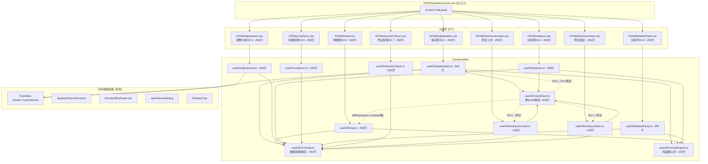
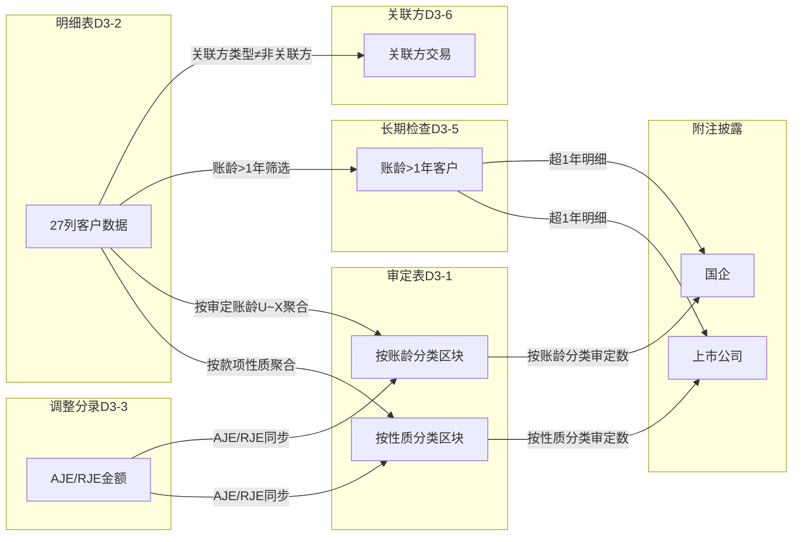

# Design Document: D3 预收账款底稿专属HTML精美组件

## Overview

将D3预收账款底稿从通用`d-form-table`渲染升级为独立专属组件`d3-prepaid-accounts`。覆盖源模板10个有效sheet（程序表D3A + 审定表D3-1 + 明细表D3-2 + 调整分录D3-3 + 分析表D3-4 + 长期检查D3-5 + 关联方D3-6 + 凭证检查D3-7 + 附注上市 + 附注国企），合计294个公式。

核心设计目标：
- 新 componentType `d3-prepaid-accounts`，主入口 GtD3PrepaidAccounts.vue（el-tabs 9个tab-pane）
- 每个sheet独立子组件（200-400行）+ 独立composable
- 共享纯函数公式引擎 useD3FormulaEngine.ts（贷方科目：期末=期初+贷方-借方）
- 跨sheet数据流通过 allResponses Map computed 响应式链（不走API）
- 5方EventBus联动 + GtIndexChip 6处交叉索引
- 双模式（HTML ↔ OnlyOffice）+ 导入导出三级 + AI审计说明

科目特征：2203贷方科目/负债类。核心差异vs D2：无坏账/无ECL/无SUMIF三分类/无截止独立sheet/无保理。新增：期后结转检查、款项性质分类、CAS14收入准则联动、双区块凭证检查。

## Architecture

### 组件依赖关系



### 文件结构

```
audit-platform/frontend/src/components/workpaper/
├── GtD3PrepaidAccounts.vue              # 主入口 el-tabs（~150行）
├── d3/                                   # 新增目录
│   ├── D3TabAdjudication.vue            # 审定表D3-1（~400行）
│   ├── D3TabDetail.vue                  # 明细表D3-2（~400行）
│   ├── D3TabAdjustment.vue              # 调整分录D3-3（~250行）
│   ├── D3TabAnalysis.vue                # 分析表D3-4（~350行）
│   ├── D3TabLongTerm.vue                # 长期检查D3-5（~250行）
│   ├── D3TabRelatedParty.vue            # 关联方D3-6（~250行）
│   ├── D3TabVoucherCheck.vue            # 凭证检查D3-7（~350行）
│   ├── D3TabDisclosureListed.vue        # 附注上市（~250行）
│   └── D3TabDisclosureSoe.vue           # 附注国企（~200行）
├── composables/
│   ├── useD3FormData.ts                 # 数据加载/保存基础（~200行）
│   ├── useD3FormulaEngine.ts            # 纯函数公式引擎（~150行）
│   ├── useD3CrossSheet.ts               # 跨sheet联动computed（~200行）
│   ├── useD3Adjudication.ts             # 审定表逻辑（~300行）
│   ├── useD3Detail.ts                   # 明细表逻辑（~350行）
│   ├── useD3Adjustment.ts               # 调整分录逻辑（~150行）
│   ├── useD3Analysis.ts                 # 分析表逻辑（~200行）
│   ├── useD3LongTerm.ts                 # 长期检查逻辑（~150行）
│   ├── useD3RelatedParty.ts             # 关联方检查逻辑（~150行）
│   ├── useD3VoucherCheck.ts             # 凭证检查逻辑（~200行）
│   ├── useD3DisclosureListed.ts         # 附注上市逻辑（~150行）
│   └── useD3DisclosureSoe.ts            # 附注国企逻辑（~100行）

backend/app/routers/wp_render_strategies/
│   └── _d3_import_export.py             # 导入导出端点（~250行）
```

### 跨Sheet数据流



## Components and Interfaces

### 1. useD3FormulaEngine.ts — 纯函数公式引擎

```typescript
// 贷方科目（预收账款）特有：期末=期初+贷方-借方

/** 安全数值解析：null/undefined/空串/NaN → 0 */
export function parseNum(val: string | number | null | undefined): number

/** 审定数 = 未审 + AJE + RJE */
export function calcAuditedAmount(unadjusted: number, aje: number, rje: number): number

/** 变动率: 期初=0且期末=0→'' | 期初=0→'N/A' | 其他→(期末-期初)/期初 */
export function calcChangeRate(prior: number, current: number): number | '' | 'N/A'

/** 变动额 = 期末审定 - 期初审定 */
export function calcChangeAmount(prior: number, current: number): number

/** 小计/合计 = SUM(明细行) */
export function calcSubtotal(values: number[]): number

/** 期初审定余额 = 期初未审 + 账项调整 + 重分类调整 */
export function calcPriorAudited(unadjusted: number, adjustment: number, reclass: number): number

/** 期末余额（贷方科目）= 期初审定 + 贷方发生 - 借方发生 */
export function calcEndBalance(priorAudited: number, credit: number, debit: number): number

/** 期末未审余额 = 期末余额 + 被审计单位重分类调整 */
export function calcEndUnadjusted(endBalance: number, entityReclass: number): number

/** 期末审定数 = 期末未审 + 期末账项调整 + 期末重分类调整 */
export function calcEndAudited(endUnadjusted: number, endAje: number, endRje: number): number

/** 关联方期末余额（贷方科目）= 期初 + 贷方 - 借方 */
export function calcRelatedPartyEndBalance(prior: number, credit: number, debit: number): number

/** 变动率绝对值是否超阈值 */
export function isChangeRateExceeding(rate: number | '' | 'N/A', threshold: number): boolean

/** 异常率 = 异常笔数 / 已检查笔数 × 100% */
export function calcAnomalyRate(anomalyCount: number, totalChecked: number): number

/** 按款项性质聚合：从明细行按C列分组SUM */
export function aggregateByNature(
  rows: DetailRow[], field: 'endAudited' | 'priorAudited'
): Record<string, number>

/** 按审定账龄聚合：从明细行按U~X列聚合 */
export function aggregateByAging(
  rows: DetailRow[]
): { within1: number; y1to2: number; y2to3: number; over3: number }
```

### 2. useD3FormData.ts — 基础数据加载/保存

```typescript
export interface UseD3FormDataOptions {
  wpId: Ref<string>
  projectId: Ref<string>
}

export function useD3FormData(options: UseD3FormDataOptions) {
  return {
    allResponses: Ref<Map<string, ChecklistResponse>>,
    isLoading: Ref<boolean>,
    loadAll: () => Promise<void>,
    loadRelatedParties: () => Promise<string[]>,  // 从项目关联方清单加载
    saveImmediate: (itemId: string, data: Partial<ChecklistResponse>) => Promise<void>,
    saveBatch: (items: Array<{ itemId: string; data: Partial<ChecklistResponse> }>) => Promise<void>,
    debouncedSave: (itemId: string, data: Partial<ChecklistResponse>) => void, // 2s debounce
    writebackTrialBalance: (auditedAmount: number) => Promise<void>, // 科目2203回写
  }
}
```

### 3. useD3CrossSheet.ts — 跨Sheet联动

```typescript
export interface UseD3CrossSheetOptions {
  allResponses: Ref<Map<string, ChecklistResponse>>
}

export function useD3CrossSheet(options: UseD3CrossSheetOptions) {
  return {
    // D3-2 → D3-1 聚合
    natureAggregation: ComputedRef<Record<string, { prior: number; current: number }>>,
    agingAggregation: ComputedRef<{ within1: number; y1to2: number; y2to3: number; over3: number; prior_within1: number; prior_y1to2: number; prior_y2to3: number; prior_over3: number }>,
    // D3-2 → D3-5 筛选
    longTermRows: ComputedRef<LongTermImportRow[]>,
    // D3-2 → D3-6 筛选
    relatedPartyRows: ComputedRef<RelatedPartyImportRow[]>,
    // D3-3 → D3-1 AJE/RJE
    adjustmentTotals: ComputedRef<{ ajeTotal: number; rjeTotal: number }>,
    // D3-1 → 附注
    adjudicationForDisclosure: ComputedRef<DisclosureSourceData>,
    // 状态
    crossSheetStatus: Ref<'loaded' | 'loading' | 'error'>,
  }
}
```

### 4. useD3Adjudication.ts — 审定表D3-1

```typescript
export interface AdjudicationRow {
  rowKey: string
  label: string
  priorUnadjusted: number
  priorAje: number
  priorRje: number
  priorAudited: number      // = 未审 + AJE + RJE
  currentUnadjusted: number
  currentAje: number
  currentRje: number
  currentAudited: number    // = 未审 + AJE + RJE
  changeAmount: number      // = 期末审定 - 期初审定
  changeRate: number | '' | 'N/A'
  reasonAnalysis: string
  isFromCrossSheet: boolean
  isEditable: boolean
}

export interface AdjudicationSection {
  sectionKey: 'by-nature' | 'by-aging'
  sectionLabel: string
  rows: AdjudicationRow[]
  subtotalRow: AdjudicationRow
}

export interface UseD3AdjudicationOptions {
  allResponses: Ref<Map<string, ChecklistResponse>>
  wpId: Ref<string>
  projectId: Ref<string>
  saveImmediate: SaveFn
  debouncedSave: DebouncedSaveFn
  crossSheet: ReturnType<typeof useD3CrossSheet>
  isReadonly: Ref<boolean>
}

export function useD3Adjudication(options: UseD3AdjudicationOptions) {
  return {
    // 双区块
    sections: ComputedRef<AdjudicationSection[]>,
    // 试算平衡表数 + 差异
    trialBalanceAmount: Ref<number>,
    trialBalanceDiff: ComputedRef<number>,
    // 交叉验证：性质合计 vs 账龄合计
    crossValidationDiff: ComputedRef<number>,
    crossValidationWarning: ComputedRef<string | null>,
    // 审计说明/结论
    auditNotes: Ref<{ agingReason: string; changeAnalysis: string; conclusion: string }>,
    // 操作
    updateCell: (rowKey: string, field: string, value: number | string) => void,
    publishAdjudicated: () => void,
    // EventBus
    onAdjustmentCreated: (payload: AdjustmentPayload) => void,
  }
}
```

### 5. useD3Detail.ts — 明细表D3-2

```typescript
export interface DetailRow {
  rowId: string
  customerName: string       // A: 对方单位名称
  companyCode: string        // B: 公司代码
  nature: string             // C: 款项性质（下拉）
  relationType: string       // D: 关联方类型（下拉）
  priorUnadjusted: number    // E: 期初未审余额
  priorAdjustment: number    // F: 期初账项调整
  priorReclass: number       // G: 期初重分类调整
  priorAudited: number       // H: =E+F+G（自动）
  agingPrior: { within1: number; y1to2: number; y2to3: number; over3: number }  // I~L
  debit: number              // M: 借方发生
  credit: number             // N: 贷方发生
  endBalance: number         // O: =H+N-M（贷方科目，自动）
  entityReclass: number      // P: 被审计单位重分类调整
  endUnadjusted: number      // Q: =O+P（自动）
  endAje: number             // R: 期末账项调整
  endRje: number             // S: 期末重分类调整
  endAudited: number         // T: =Q+R+S（自动）
  agingAudited: { within1: number; y1to2: number; y2to3: number; over3: number }  // U~X
  isConfirmed: string        // Y: 是否发函
  postPeriodSettlement: number // Z: 期后结转
  remark: string             // AA: 备注
}

export interface UseD3DetailOptions {
  allResponses: Ref<Map<string, ChecklistResponse>>
  wpId: Ref<string>
  projectId: Ref<string>
  saveImmediate: SaveFn
  debouncedSave: DebouncedSaveFn
  isReadonly: Ref<boolean>
  relatedParties: Ref<string[]>
}

export function useD3Detail(options: UseD3DetailOptions) {
  return {
    rows: Ref<DetailRow[]>,
    filteredRows: ComputedRef<DetailRow[]>,
    subtotalRow: ComputedRef<DetailRow>,
    verificationRow: ComputedRef<DetailRow>,  // 核对行 = 合计 - 试算表数
    searchQuery: Ref<string>,
    // 操作
    addRow: () => void,
    removeRow: (rowId: string) => void,
    updateCell: (rowId: string, field: string, value: any) => void,
    matchRelatedParty: (name: string) => string,
    importFromAuxBalance: () => Promise<void>,  // 从tb_aux_balance导入
    // EventBus
    onConfirmationCompleted: (payload: { customerName: string }) => void,
  }
}
```

### 6. useD3Adjustment.ts — 调整分录D3-3

```typescript
export interface AdjustmentRow {
  rowId: string
  description: string     // 调整事项说明
  category: string        // 类别（报表调整/账项调整/其他）
  reportItem: string      // 报表项目
  accountName: string     // 科目名称
  noteItem: string        // 附注项目
  placeholder: string     // …
  debitAmount: number     // 借方调整金额
  creditAmount: number    // 贷方调整金额
  indexRef: string        // 索引
  remark: string          // 备注
}

export function useD3Adjustment(options: UseD3BaseOptions) {
  return {
    rows: Ref<AdjustmentRow[]>,
    debitTotal: ComputedRef<number>,
    creditTotal: ComputedRef<number>,
    isBalanced: ComputedRef<boolean>,
    balanceDiff: ComputedRef<number>,
    addRow: () => void,
    removeRow: (rowId: string) => void,
    updateCell: (rowId: string, field: string, value: any) => void,
    publishAdjustment: (row: AdjustmentRow) => void,  // EventBus
    pushToA13: (rowIds: string[]) => void,             // 推送至A13
  }
}
```

### 7. useD3Analysis.ts — 分析表D3-4

```typescript
export interface AnalysisSection {
  sectionKey: 'debit-analysis' | 'credit-analysis' | 'top5-debtors' | 'audit-note'
  rows: AnalysisRow[]
  totalRow?: AnalysisRow
  diffRow?: AnalysisRow  // 差异行
}

export function useD3Analysis(options: UseD3BaseOptions & {
  crossSheet: ReturnType<typeof useD3CrossSheet>
}) {
  return {
    sections: ComputedRef<AnalysisSection[]>,
    top5Debtors: ComputedRef<Top5DebtorRow[]>,
    top5ConcentrationWarning: ComputedRef<string | null>,  // >50%时警告
    auditNote: Ref<string>,
    publishSignificantChange: () => void,  // EventBus
  }
}
```

### 8. useD3VoucherCheck.ts — 凭证检查D3-7

```typescript
export interface VoucherCheckRow {
  rowId: string
  customerName: string
  date: string
  voucherNo: string
  businessContent: string
  counterAccount: string
  counterDetailAccount: string
  debitAmount?: number      // 仅(1)本期增减有此列
  creditAmount: number
  supportingDoc: string
  checkItems: [boolean, boolean, boolean, boolean, boolean]  // 核对内容1~5
  indexRef: string
  isAbnormal: string        // 是否异常
  remark: string
}

export interface SamplingParams {
  testPopulation: string
  specificSamples: string
  samplingPopulation: string
  samplingMethod: string
  samplingProcess: string
  targetSampleSize: number
  currentSampleSize: number
}

export function useD3VoucherCheck(options: UseD3BaseOptions) {
  return {
    samplingParams: Ref<SamplingParams>,
    currentChangeRows: Ref<VoucherCheckRow[]>,   // (1)本期增减变动
    postPeriodRows: Ref<VoucherCheckRow[]>,      // (2)期后结转
    // 汇总
    totalChecked: ComputedRef<number>,
    anomalyCount: ComputedRef<number>,
    anomalyRate: ComputedRef<number>,
    // 操作
    addSample: (section: 'current' | 'postPeriod') => void,
    removeSample: (section: 'current' | 'postPeriod', rowId: string) => void,
    updateCell: (section: 'current' | 'postPeriod', rowId: string, field: string, value: any) => void,
    autoMarkCrossPeriod: (row: VoucherCheckRow) => void,  // 期后结转日期早于收入确认日→标异常
  }
}
```

### 9. 后端导入导出 — _d3_import_export.py

```python
# POST /api/workpapers/{wp_id}/d3/export-template?sheet=D3-2
# POST /api/workpapers/{wp_id}/d3/export-data?sheet=D3-2
# POST /api/workpapers/{wp_id}/d3/import-data?sheet=D3-2
# POST /api/workpapers/{wp_id}/d3/import-aux-balance  (从辅助余额表批量导入)

async def export_template(wp_id: str, sheet: str) -> StreamingResponse:
    """生成空白xlsx模板（含表头+格式+公式，无数据行）"""

async def export_data(wp_id: str, sheet: str) -> StreamingResponse:
    """生成包含当前数据的xlsx"""

async def import_data(wp_id: str, sheet: str, file: UploadFile) -> dict:
    """解析上传xlsx，回写checklist_responses，返回摘要"""

async def import_aux_balance(wp_id: str, project_id: str) -> dict:
    """从tb_aux_balance(科目2203,按客户维度)批量导入到D3-2"""
```

### 10. 后端 Auto Data Resolver — _d3_resolvers.py

```python
# 注册到 auto_data_resolvers._REGISTRY

@register_resolver('d3_tb_unadjusted')
async def resolve_d3_tb_unadjusted(project_id: str, year: int, **kwargs) -> dict:
    """从trial_balance科目2203取期初/期末未审数
    返回: { prior_unadjusted: float, current_unadjusted: float }
    """

@register_resolver('d3_ledger_analysis')
async def resolve_d3_ledger_analysis(project_id: str, year: int, **kwargs) -> dict:
    """从tb_ledger科目2203取借方/贷方发生额+按对方科目分拆
    返回: {
      debit_total: float, credit_total: float,
      debit_by_counter: [{ account: str, amount: float }],
      credit_by_counter: [{ account: str, amount: float }]
    }
    """
```

### 11. 后端 AI 生成端点 — _d3_ai_generate.py

```python
# POST /api/workpapers/{wp_id}/d3/ai-generate
# 注册到 router_registry "AI与辅助" 组

async def ai_generate_d3(wp_id: str, body: D3AiGenerateRequest) -> dict:
    """D3审计说明AI生成
    body.section: 'adj-aging-reason' | 'adj-change-analysis' | 'adj-conclusion'
                | 'detail-change' | 'detail-contract' | 'detail-longterm'
                | 'analysis-note' | 'longterm-reason' | 'related-party-note'
    context: 自动加载D3-1变动数据 + D3-4 Top5 + D3-5长期挂账行 + project_context
    """
```

### 12. D3-2 Z列(期后结转) 与 D3-7 联动规则

```typescript
// useD3CrossSheet.ts 中新增
postPeriodSettlementSync: ComputedRef<{
  // D3-7 (2)期后结转区块贷方金额按客户聚合
  byCustomer: Record<string, number>
  // 合计
  total: number
}>

// useD3Detail.ts 中
// 当D3-7有新增期后结转样本时，自动累加Z列
watchEffect(() => {
  const sync = crossSheet.postPeriodSettlementSync.value
  rows.value.forEach(row => {
    const d37Amount = sync.byCustomer[row.customerName] || 0
    if (d37Amount > 0 && row.postPeriodSettlement !== d37Amount) {
      // 仅当D3-7有数据且与当前值不同时提示，不自动覆盖（用户可能手填）
    }
  })
})
```

## Data Models

### checklist_responses item_id 命名规范

| Sheet | 前缀 | 示例 |
|-------|------|------|
| D3-1 审定表 | `D3-adj-` | `D3-adj-nature-{rowKey}-currentUnadjusted`, `D3-adj-aging-{rowKey}-currentAje` |
| D3-1 审计说明 | `D3-adj-note-` | `D3-adj-note-aging-reason`, `D3-adj-note-conclusion` |
| D3-2 明细表 | `D3-det-` | `D3-det-rows`（remark存JSON数组） |
| D3-3 调整分录 | `D3-aje-` | `D3-aje-rows`（remark存JSON数组） |
| D3-4 分析表 | `D3-ana-` | `D3-ana-debit-rows`, `D3-ana-top5-rows`, `D3-ana-note` |
| D3-5 长期检查 | `D3-lt-` | `D3-lt-rows`（remark存JSON数组）, `D3-lt-note`, `D3-lt-conclusion` |
| D3-6 关联方 | `D3-rp-` | `D3-rp-rows`（remark存JSON数组）, `D3-rp-note`, `D3-rp-conclusion` |
| D3-7 凭证检查 | `D3-vc-` | `D3-vc-params`, `D3-vc-current-rows`, `D3-vc-post-rows` |
| 附注上市 | `D3-note-listed-` | `D3-note-listed-section1-rows`, `D3-note-listed-note-1` |
| 附注国企 | `D3-note-soe-` | `D3-note-soe-section1-rows`, `D3-note-soe-note-1` |

### 审定表D3-1 双区块固定结构

```typescript
// 区块一：按性质分类
const NATURE_ROWS = [
  { rowKey: 'fixed-asset-sales', label: '预收销售固定资产款' },
  { rowKey: 'land-use-right', label: '预收销售土地使用权款' },
  { rowKey: 'contract-invalid', label: '合同不成立时已收取的对价' },
  { rowKey: 'other', label: '其他' },
  // subtotal自动计算
]

// 区块二：按账龄分类
const AGING_ROWS = [
  { rowKey: 'within-1-year', label: '1年以内' },
  { rowKey: '1-to-2-years', label: '1至2年' },
  { rowKey: '2-to-3-years', label: '2至3年' },
  { rowKey: 'over-3-years', label: '3年以上' },
  // subtotal自动计算
  { rowKey: 'trial-balance', label: '试算平衡表数', isFromTB: true },
  { rowKey: 'difference', label: '差异数', isComputed: true },
]
```

### 明细表D3-2 动态行JSON存储格式

```json
// item_id: "D3-det-rows", remark字段:
[
  {
    "rowId": "row-uuid-1",
    "customerName": "XX公司",
    "companyCode": "001",
    "nature": "预收销售固定资产款",
    "relationType": "非关联方",
    "priorUnadjusted": 500000,
    "priorAdjustment": 0,
    "priorReclass": 0,
    "agingPrior": { "within1": 500000, "y1to2": 0, "y2to3": 0, "over3": 0 },
    "debit": 100000,
    "credit": 200000,
    "entityReclass": 0,
    "endAje": 0,
    "endRje": 0,
    "agingAudited": { "within1": 600000, "y1to2": 0, "y2to3": 0, "over3": 0 },
    "isConfirmed": "",
    "postPeriodSettlement": 0,
    "remark": ""
  }
]
```

### 跨Sheet数据映射

| D3-1目标 | 数据来源 | 路径 |
|----------|---------|------|
| 按性质-预收销售固定资产款(期末审定) | D3-2 rows where nature='预收销售固定资产款' | SUM(endAudited) |
| 按性质-预收销售土地使用权款(期末审定) | D3-2 rows where nature='预收销售土地使用权款' | SUM(endAudited) |
| 按性质-合同不成立(期末审定) | D3-2 rows where nature='合同不成立时已收取的对价' | SUM(endAudited) |
| 按性质-其他(期末审定) | D3-2 rows where nature='其他' | SUM(endAudited) |
| 按账龄-1年以内(期末审定) | D3-2 rows | SUM(agingAudited.within1) |
| 按账龄-1至2年(期末审定) | D3-2 rows | SUM(agingAudited.y1to2) |
| 按账龄-2至3年(期末审定) | D3-2 rows | SUM(agingAudited.y2to3) |
| 按账龄-3年以上(期末审定) | D3-2 rows | SUM(agingAudited.over3) |
| D3-1 AJE列 | D3-3 adjustmentTotals | ajeTotal |
| D3-1 RJE列 | D3-3 adjustmentTotals | rjeTotal |
| 附注上市(1)按性质 | D3-1 按性质区块 | 直接引用 |
| 附注上市(2)超1年 | D3-5 rows | 直接引用 |
| 附注国企(1)按账龄 | D3-1 按账龄区块 | 直接引用 |
| 附注国企(2)超1年 | D3-5 rows | 直接引用 |

**重要实现细节**：
- 所有跨sheet取数通过同一个 `allResponses` Map 的 computed 响应式链实现
- D3-2编辑 → allResponses变更 → useD3CrossSheet computed重算 → D3-1/D3-5/D3-6自动刷新
- 无需API调用，2秒内响应（computed同步重算）
- 跨sheet取数单元格以浅蓝色背景标记 + tooltip显示来源

### EventBus事件清单

| 事件名 | 发布者 | 消费者 | Payload |
|--------|--------|--------|---------|
| `substantive:adjudicated` | D3-1 | TB回写 | `{ wpCode:'D3', accountCode:'2203', auditedAmount }` |
| `adjustment:created` | D3-3 | D3-1, A13 | `{ wpCode:'D3', entryType:'AJE'|'RJE', amount, accountCode }` |
| `analytical:significant-change` | D3-4 | A1-13 | `{ wpCode:'D3', changeRate, item }` |
| `confirmation:completed` | D0 | D3-2 | `{ customerName, confirmationType }` |
| `risk:updated` | B50 | D3A | `{ riskLevel, affectedAccounts }` |
| `disclosure:note-text-updated` | 附注 | 附注模块 | `{ wpCode:'D3', section, text }` |

## Correctness Properties

*A property is a characteristic or behavior that should hold true across all valid executions of a system—essentially, a formal statement about what the system should do. Properties serve as the bridge between human-readable specifications and machine-verifiable correctness guarantees.*

### Property 1: 审定数公式正确性

*For any* 三元组 (未审数, AJE净额, RJE净额)，其中各值为有限数值，`calcAuditedAmount` 的返回值应等于 `未审数 + AJE + RJE`。

**Validates: Requirements 1.3, 2.5**

### Property 2: 变动额与变动率公式正确性

*For any* (期初审定数, 期末审定数) 对，变动额应等于 `期末 - 期初`；变动率应等于 `(期末-期初)/期初`。特殊处理：期初=0且期末=0返回''，期初=0且期末≠0返回'N/A'。

**Validates: Requirements 1.4**

### Property 3: 合计行恒等于明细行之和

*For any* 明细行列表（1~N行，每行含K个数值列），合计行的每个数值列应等于对应列所有明细行值的SUM。适用于D3-1/D3-2/D3-5/D3-6/D3-7所有合计行。

**Validates: Requirements 1.5, 4.5, 9.4, 10.6**

### Property 4: 变动率阈值高亮判定

*For any* 变动率数值 r（非空非'N/A'），`isChangeRateExceeding(r, 0.3)` 应返回 true 当且仅当 `|r| > 0.3`。

**Validates: Requirements 1.6, 8.8**

### Property 5: 明细表D3-2行内公式链正确性（贷方科目）

*For any* 明细行输入值组合，以下公式链必须成立：
- 期初审定余额 H = E + F + G
- 期末余额 O = H + N - M（贷方科目：期初审定+贷方-借方）
- 期末未审余额 Q = O + P
- 期末审定数 T = Q + R + S

**Validates: Requirements 4.4, 10.3**

### Property 6: 按款项性质聚合正确性

*For any* 明细表D3-2行数据集，按"款项性质"(C列)分组后，每组的endAudited之和应等于审定表D3-1"按性质分类"区块对应行的期末审定值。

**Validates: Requirements 2.1, 12.2**

### Property 7: 按审定账龄聚合正确性

*For any* 明细表D3-2行数据集，所有行agingAudited.within1之和应等于审定表D3-1"按账龄分类"区块"1年以内"行值，y1to2/y2to3/over3同理。

**Validates: Requirements 2.2, 13.2**

### Property 8: 性质分类合计与账龄分类合计交叉验证

*For any* 明细表D3-2行数据集，按性质分类聚合后的合计值应等于按账龄分类聚合后的合计值（二者均源自D3-2期末审定数T列，聚合维度不同但总和一致）。

**Validates: Requirements 1.8**

### Property 9: 调整分录EventBus同步正确性

*For any* adjustment:created事件payload（含entryType='AJE'|'RJE', amount），审定表D3-1对应列应累加该金额（AJE→currentAje，RJE→currentRje）。

**Validates: Requirements 2.5, 7.4**

### Property 10: 动态行添加保持结构不变量

*For any* 当前行列表（长度N），执行addRow()后行列表长度应为N+1，且新行所有数值字段为0，新行位于合计行之前。适用于D3-2/D3-3/D3-5/D3-6/D3-7所有动态行表格。

**Validates: Requirements 4.6, 7.2, 9.3, 10.5, 11.4**

### Property 11: 关联方自动匹配正确性

*For any* 客户名称字符串和关联方名单列表，若客户名称存在于关联方名单中（包含匹配），则matchRelatedParty返回对应关联关系类型；否则返回'非关联方'。

**Validates: Requirements 4.7, 10.5**

### Property 12: 搜索过滤正确性

*For any* 搜索关键字q和明细行列表，filteredRows中每行的customerName应包含q（大小写不敏感），且所有匹配行都应出现在结果中（无遗漏无多余）。

**Validates: Requirements 4.11**

### Property 13: 函证完成事件标记正确性

*For any* confirmation:completed事件payload（含customerName），明细表中匹配该客户名称的行的"是否发函"列应被标记为"Y"。

**Validates: Requirements 5.4, 18.4**

### Property 14: 导入导出Round-Trip

*For any* 有效的D3-2动态行数组，导出为xlsx再导入解析后，应产生等价的行数据（各字段值相等）。

**Validates: Requirements 5.6, 17.2**

### Property 15: 调整分录借贷平衡检查

*For any* 调整分录行列表，isBalanced应为true当且仅当所有行debitAmount之和等于所有行creditAmount之和。

**Validates: Requirements 7.3**

### Property 16: 差异行计算正确性

*For any* (合计值, 试算表数) 对，差异行值应等于 `合计 - 试算表数`。适用于D3-1试算平衡表差异和D3-4分析表差异。

**Validates: Requirements 1.7, 8.3**

### Property 17: Top5债务人分析正确性

*For any* 明细表行数据集（N行），Top5应为按期末余额降序排列的前5行（或全部行若N<5）；当Top5余额之和占合计超过50%时应产生集中度警告。

**Validates: Requirements 8.4, 8.5**

### Property 18: D3-2筛选导入正确性

*For any* 明细表行数据集：
- 筛选"账龄>1年"：结果集应恰好包含agingAudited中y1to2+y2to3+over3 > 0的行
- 筛选"关联方"：结果集应恰好包含relationType !== '非关联方'的行

**Validates: Requirements 9.2, 10.4**

### Property 19: 凭证检查异常率计算正确性

*For any* 凭证检查行列表，anomalyRate应等于（isAbnormal非空行数 / 总行数 × 100%）；totalChecked应等于总行数。

**Validates: Requirements 11.5**

### Property 20: 期后结转跨期自动标记

*For any* 期后结转检查行，当凭证日期早于对应收入确认日期时，isAbnormal应被自动标记为"跨期疑点"。

**Validates: Requirements 11.7**

## Error Handling

| 场景 | 处理方式 |
|------|---------|
| 跨sheet数据加载失败（allResponses中key不存在） | 显示"-"占位符 + 黄色三角警告图标；crossSheetStatus='error' |
| checklist_responses API失败 | ElMessage.warning提示；保留本地已有数据 |
| 导入xlsx格式不匹配 | 返回400 + 错误列名列表；前端ElMessage.error展示 |
| 导入xlsx行数超限(>500行) | 后端截断 + 返回警告摘要 |
| parseNum遇到NaN/Infinity | 统一返回0（安全降级） |
| OnlyOffice健康检查失败 | 禁用"在线编辑"选项 + tooltip"OnlyOffice服务不可用" |
| EventBus事件publish失败 | console.warn不阻塞主流程 |
| 动态行JSON解析失败（remark损坏） | 回退空数组 + ElMessage.warning |
| writebackTrialBalance失败 | ElMessage.warning提示手动确认 |
| 从tb_aux_balance导入无数据 | ElMessage.info"未找到科目2203的辅助余额数据" |
| AI生成接口超时/失败 | ElMessage.warning"AI服务暂时不可用" + 不阻塞手动编辑 |
| 交叉验证不一致（性质≠账龄） | 黄色el-alert显示差额，不阻止保存 |
| 抽凭引擎集成失败 | 降级为手动添加样本模式 |
| 金额溢出（>Number.MAX_SAFE_INTEGER） | displayPrefs.fmtAmount内置处理 |

## Testing Strategy

### 单元测试（vitest）

- useD3FormulaEngine.ts 全部纯函数：边界值、零值、负数、NaN输入、Infinity处理
- 各composable的computed逻辑：初始状态、添加/删除行后状态、跨sheet数据变更触发
- 金额格式化：千分位、负数红色括号、零值显示"-"、百分比
- 跨sheet数据映射：D3-2→D3-1聚合（按性质+按账龄）、D3-2→D3-5/D3-6筛选
- EventBus事件payload结构验证
- 关联方匹配逻辑（精确+包含匹配）
- 搜索筛选逻辑（大小写不敏感、空串、特殊字符）
- 借贷平衡验证
- Top5排序+集中度警告
- 期后结转跨期判定逻辑
- 导入数据格式校验

### Property-Based Tests（fast-check）

每个correctness property对应一个PBT测试，最少100次迭代。

库选择：**fast-check**（项目已有，前端PBT标准选择）

标签格式：`Feature: d3-prepaid-accounts, Property {N}: {title}`

| Property | 测试文件 | 生成器 |
|----------|---------|--------|
| P1 审定数公式 | `useD3FormulaEngine.spec.ts` | `fc.float({min:-1e9, max:1e9})` × 3 |
| P2 变动额/率 | `useD3FormulaEngine.spec.ts` | `fc.float` × 2 (含0边界) |
| P3 合计行 | `useD3FormulaEngine.spec.ts` | `fc.array(fc.float, {minLength:1, maxLength:30})` |
| P4 阈值判定 | `useD3FormulaEngine.spec.ts` | `fc.float({min:-10, max:10})` |
| P5 D3-2行公式链 | `useD3Detail.spec.ts` | `fc.float({min:-1e9, max:1e9})` × 7 (E,F,G,M,N,P,R,S) |
| P6 按性质聚合 | `useD3CrossSheet.spec.ts` | 自定义 DetailRow[] 生成器 + nature枚举 |
| P7 按账龄聚合 | `useD3CrossSheet.spec.ts` | 自定义 DetailRow[] 生成器 + aging字段 |
| P8 交叉验证 | `useD3CrossSheet.spec.ts` | 自定义 DetailRow[] 生成器 |
| P9 AJE/RJE同步 | `useD3Adjudication.spec.ts` | `fc.oneof('AJE','RJE')` + `fc.float` |
| P10 动态行添加 | `useD3Detail.spec.ts` | `fc.array(DetailRow生成器, {maxLength:20})` |
| P11 关联方匹配 | `useD3Detail.spec.ts` | `fc.string({minLength:1})` + `fc.array(fc.string)` |
| P12 搜索过滤 | `useD3Detail.spec.ts` | `fc.string` + `fc.array(DetailRow生成器)` |
| P13 函证标记 | `useD3Detail.spec.ts` | `fc.string` + DetailRow[] |
| P14 Round-trip | `d3ImportExport.spec.ts` | 自定义 DetailRow[] JSON生成器 |
| P15 借贷平衡 | `useD3Adjustment.spec.ts` | `fc.array({debit:fc.float, credit:fc.float})` |
| P16 差异行 | `useD3FormulaEngine.spec.ts` | `fc.float` × 2 |
| P17 Top5分析 | `useD3Analysis.spec.ts` | `fc.array(DetailRow生成器, {minLength:1, maxLength:50})` |
| P18 筛选导入 | `useD3CrossSheet.spec.ts` | 自定义 DetailRow[] 生成器 |
| P19 异常率 | `useD3VoucherCheck.spec.ts` | `fc.array(VoucherRow生成器)` |
| P20 跨期标记 | `useD3VoucherCheck.spec.ts` | `fc.date` × 2 (凭证日期 + 收入确认日) |

### 后端集成测试（hypothesis）

- 导入导出round-trip：生成随机行数据→export→import→验证等价
- tb_aux_balance导入：验证科目2203按客户聚合正确
- 模板格式校验：随机列名排列→验证错误检测

### 测试配置

```typescript
// fast-check 配置
fc.assert(fc.property(...), { numRuns: 100 })

// 标签示例
// Feature: d3-prepaid-accounts, Property 1: 审定数公式正确性
```

### 注册与契约测试

- htmlRendererRegistry.spec.ts：验证'd3-prepaid-accounts'已注册
- VALID_COMPONENT_TYPES契约：验证后端允许'd3-prepaid-accounts'
- wp_code_overrides契约：验证D3/D3-1/D3-2映射到'd3-prepaid-accounts'
