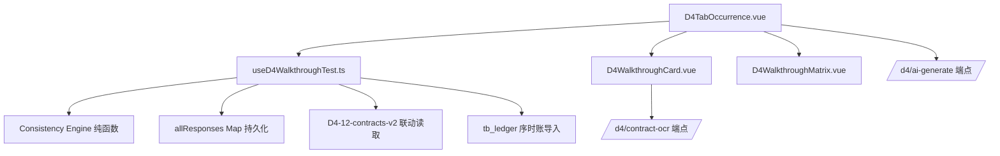

# D4-14 营业收入发生检查表（穿行测试）升级 — 设计文档

## Overview

D4-14 是 D4 营业收入循环中最关键的底稿——多维穿行测试矩阵。本次升级将现有简化版抽凭表（12列 Y/N 标志）重构为与 D4-12 合同检查表相似的三模式组件：卡片视图 + 矩阵视图 + OnlyOffice 在线编辑。

核心特性：
- 每笔交易作为一个事项卡片，内部按 7 个证据链维度分组
- 维度级独立附件上传 + OCR 识别
- 自动交叉一致性校验（金额/品名/日期）
- D4-12 合同联动引用 + 序时账导入
- AI 穿行分析
- 矩阵视图只读横向对比

## Architecture

```
┌──────────────────────────────────────────────────────────────────┐
│  D4TabOccurrence.vue (重写)                                       │
│  ┌────────────────────────────────────────────────────────────┐  │
│  │ 顶部工具条: el-segmented(卡片/矩阵/在线编辑)               │  │
│  │            + 导入导出dropdown + GtIndexChip(D4-1/D4-12/D4-4)│  │
│  ├────────────────────────────────────────────────────────────┤  │
│  │ 概览横幅: 检查比例进度 + 事项数量 + 异常率 + 添加按钮       │  │
│  ├────────────────────────────────────────────────────────────┤  │
│  │ 抽样参数区: el-descriptions(总体/特定项目/抽样总体/方法/量)  │  │
│  ├────────────────────────────────────────────────────────────┤  │
│  │ 卡片视图: el-tabs(card) 横向切换事项                        │  │
│  │  ┌──────────────────────────────────────────────────────┐ │  │
│  │  │ 事项卡片 D4WalkthroughCard:                          │ │  │
│  │  │  7维度分组(记账凭证/销售合同/出库单/运输单/签收单/     │ │  │
│  │  │           发票/其他支持性文件)                          │ │  │
│  │  │  每维度: 字段表单 + 📎附件上传 + OCR状态              │ │  │
│  │  │  底部: 一致性校验结果 + 检查结论                       │ │  │
│  │  └──────────────────────────────────────────────────────┘ │  │
│  │ 矩阵视图: D4WalkthroughMatrix                              │  │
│  │  el-table (rows=事项, cols=7维度+结论+分数)                 │  │
│  ├────────────────────────────────────────────────────────────┤  │
│  │ 编制提示折叠区(6段details, 红左边线+浅红背景)               │  │
│  ├────────────────────────────────────────────────────────────┤  │
│  │ 审计意见区(el-card): 说明textarea + 结论textarea + AI辅助   │  │
│  └────────────────────────────────────────────────────────────┘  │
└──────────────────────────────────────────────────────────────────┘
```



## Components and Interfaces

### 前端文件结构

| 文件 | 职责 |
|------|------|
| `composables/useD4WalkthroughTest.ts` | 主composable：类型定义、CRUD、一致性引擎、持久化、统计 |
| `d4/inspection/D4WalkthroughCard.vue` | 单事项卡片：7维度分组 + 维度级OCR + 一致性提示 |
| `d4/inspection/D4WalkthroughMatrix.vue` | 矩阵视图：只读横向对比表 |
| `d4/inspection/D4TabOccurrence.vue` | 主组件重写：三模式切换 + 概览 + 抽样参数 + 审计意见 |

### 后端

无新端点需要创建。复用：
- `POST /api/workpapers/{wp_id}/d4/contract-ocr` — OCR识别（已有）
- `POST /api/workpapers/{wp_id}/d4/ai-generate` — AI生成，新增 section `walkthrough-analysis`
- `GET /api/projects/{pid}/auto-data/` — 序时账取数（已有 resolver 体系）

### 组件接口

```typescript
// D4WalkthroughCard.vue
interface Props {
  item: TransactionItem
  isReadonly: boolean
  wpId: string
  projectId: string
  d4Contracts: ContractInspectionItem[]  // D4-12 合同列表（用于引用）
}
interface Emits {
  (e: 'update', item: TransactionItem): void
}

// D4WalkthroughMatrix.vue
interface Props {
  items: TransactionItem[]
  totalAmount: number
  coverageRate: number
  anomalyRate: number
}
```

## Data Models

### TransactionItem（单笔交易事项）

```typescript
interface TransactionItem {
  id: string
  indexNo: string                    // "D4-14-1" ~ "D4-14-N"
  label: string                     // 用户输入的事项名称
  // ── 记账凭证维度 ──
  voucher: VoucherDimension
  // ── 销售合同维度 ──
  contract: ContractDimension
  // ── 出库单维度 ──
  delivery: DeliveryDimension
  // ── 运输单维度 ──
  shipping: ShippingDimension
  // ── 签收单维度 ──
  receipt: ReceiptDimension
  // ── 发票维度 ──
  invoice: InvoiceDimension
  // ── 其他支持性文件维度 ──
  other: OtherDimension
  // ── 校验结果 ──
  consistencyScore: number          // 0~100
  consistencyDetails: ConsistencyResult | null
  // ── 结论 ──
  conclusion: '无异常' | '存在差异已解释' | '存在重大异常' | ''
  isAnomalous: boolean
  aiAnalysis?: string               // AI穿行分析结果
}

interface VoucherDimension {
  month: string
  date: string
  number: string            // 凭证编号
  productName: string
  quantity: string
  amount: number
  accountingDate: string
  // 附件
  attachmentId?: string
  attachmentName?: string
  ocrStatus?: 'none' | 'processing' | 'done' | 'failed'
}

interface ContractDimension {
  number: string            // 合同编号
  productName: string
  amount: number
  approver: string          // 签发审批
  confirmor: string         // 签收确认
  refD4ContractId?: string  // 引用的D4-12合同ID
  // 附件
  attachmentId?: string
  attachmentName?: string
  ocrStatus?: 'none' | 'processing' | 'done' | 'failed'
}

interface DeliveryDimension {
  date: string
  productName: string
  amount: number
  warehouseKeeper: string   // 仓库保管员
  // 附件
  attachmentId?: string
  attachmentName?: string
  ocrStatus?: 'none' | 'processing' | 'done' | 'failed'
}

interface ShippingDimension {
  date: string
  productName: string
  amount: number
  // 附件
  attachmentId?: string
  attachmentName?: string
  ocrStatus?: 'none' | 'processing' | 'done' | 'failed'
}

interface ReceiptDimension {
  date: string
  productName: string
  amount: number
  // 附件
  attachmentId?: string
  attachmentName?: string
  ocrStatus?: 'none' | 'processing' | 'done' | 'failed'
}

interface InvoiceDimension {
  date: string
  number: string            // 发票编号
  amount: number
  // 附件
  attachmentId?: string
  attachmentName?: string
  ocrStatus?: 'none' | 'processing' | 'done' | 'failed'
}

interface OtherDimension {
  description: string       // 文件描述
  indexNo: string           // 索引号
  // 附件
  attachmentId?: string
  attachmentName?: string
  ocrStatus?: 'none' | 'processing' | 'done' | 'failed'
}
```

### ConsistencyResult（一致性校验结果）

```typescript
interface ConsistencyResult {
  amountMatch: FieldMatchStatus
  productNameMatch: FieldMatchStatus
  dateMatch: FieldMatchStatus
  score: number             // 0~100
}

interface FieldMatchStatus {
  isConsistent: boolean
  values: { dimension: string; value: string | number }[]
  // 哪些维度的值不一致
  mismatchDimensions: string[]
}
```

### SamplingParams（抽样参数）

```typescript
interface SamplingParams {
  testPopulation: string        // 总体
  specificItems: string         // 特定项目
  samplingPopulation: string    // 抽样总体
  samplingMethod: string        // 抽样方法
  targetSampleSize: number      // 目标样本量
}
```

### 持久化 item_id 映射

| item_id | 内容 |
|---------|------|
| `D4-14-transactions` | TransactionItem[] JSON |
| `D4-14-sampling` | SamplingParams JSON |
| `D4-14-note` | 审计说明 text |
| `D4-14-conclusion` | 审计结论 text |

### 维度字段配置常量

```typescript
const DIMENSION_GROUPS = [
  { key: 'voucher', label: '记账凭证', fields: [...] },
  { key: 'contract', label: '销售合同', fields: [...] },
  { key: 'delivery', label: '出库单', fields: [...] },
  { key: 'shipping', label: '运输单', fields: [...] },
  { key: 'receipt', label: '签收单', fields: [...] },
  { key: 'invoice', label: '发票', fields: [...] },
  { key: 'other', label: '其他支持性文件', fields: [...] },
]
```

### 一致性引擎纯函数

```typescript
// ── 核心比对函数 ──
function compareAmounts(item: TransactionItem): FieldMatchStatus
function compareProductNames(item: TransactionItem): FieldMatchStatus
function compareDates(item: TransactionItem): FieldMatchStatus
function computeConsistency(item: TransactionItem): ConsistencyResult

// ── 统计函数 ──
function computeCoverageRate(totalAmount: number, periodRevenue: number): number
function computeAnomalyRate(items: TransactionItem[]): number
function computeProgress(checkedCount: number, target: number): number

// ── 维度完整性判定 ──
function isDimensionComplete(dimension: any, dimensionKey: string): boolean
```

## Correctness Properties

*A property is a characteristic or behavior that should hold true across all valid executions of a system—essentially, a formal statement about what the system should do. Properties serve as the bridge between human-readable specifications and machine-verifiable correctness guarantees.*

### Property 1: Consistency engine detects all field mismatches

*For any* TransactionItem with amounts populated in 2 or more dimensions, the consistency engine SHALL correctly identify mismatching fields: if all amounts are equal, `amountMatch.isConsistent` is true; if any amount differs, `amountMatch.isConsistent` is false and `mismatchDimensions` contains exactly the differing dimensions. The same rule applies independently to productName and date fields.

**Validates: Requirements 7.1, 7.2, 7.3**

### Property 2: Consistency score formula correctness

*For any* TransactionItem with N >= 2 populated dimensions, the consistency score SHALL equal `(matchingFieldPairs / totalComparableFieldPairs) * 100`, where matchingFieldPairs counts amount+productName+date pairs that are equal across all populated dimensions. If all fields match across all dimensions, score = 100. If any single field type has a mismatch, score < 100.

**Validates: Requirements 7.5**

### Property 3: IndexNo sequential after add/remove

*For any* sequence of add and remove operations on the transaction list, the resulting indexNo values SHALL always form a sequential series "D4-14-1", "D4-14-2", ..., "D4-14-N" where N is the current list length. No gaps or duplicates.

**Validates: Requirements 2.1**

### Property 4: Coverage and summary statistics correctness

*For any* list of TransactionItem[] and a positive periodRevenue value:
- 合计金额 = sum of all `item.voucher.amount` values
- 检查比例 = (合计金额 / periodRevenue) * 100, clamped to [0, 100]
- 异常率 = count(items where isAnomalous=true) / total items * 100
- 进度 = min(100, items.length / targetSampleSize * 100)

**Validates: Requirements 9.2, 12.1, 12.2**

### Property 5: Matrix view row count equals transaction count

*For any* list of N TransactionItem[], the matrix view data SHALL have exactly N data rows (excluding headers).

**Validates: Requirements 8.1**

### Property 6: Dimension completeness indicator

*For any* dimension data object and its field definition, `isDimensionComplete` returns true if and only if ALL required fields (excluding attachment fields) are non-empty/non-zero. Returns false otherwise.

**Validates: Requirements 8.2**

### Property 7: Persistence round-trip

*For any* valid walkthrough state (transactions array + sampling params + note string + conclusion string), serializing to JSON and deserializing SHALL produce an equivalent state.

**Validates: Requirements 16.1, 16.2, 16.3**

### Property 8: D4-12 contract auto-fill mapping

*For any* ContractInspectionItem from D4-12, selecting it SHALL populate the contract dimension fields: `number` = contractNo, `productName` = serviceContent, `amount` = contractAmount. No other dimension is affected.

**Validates: Requirements 4.3**

### Property 9: OCR field mapping per dimension

*For any* OCR extracted_fields response and a target dimension key, the mapping function SHALL only populate fields that belong to that specific dimension. Fields belonging to other dimensions SHALL remain unchanged.

**Validates: Requirements 6.3**

### Property 10: Ledger import creates correctly pre-filled transactions

*For any* set of ledger entries (each with date, voucherNo, summary, amount), importing them SHALL create TransactionItem[] where each item's `voucher.date` = entry.date, `voucher.number` = entry.voucherNo, `voucher.amount` = entry.amount, and all other dimensions remain at default empty values.

**Validates: Requirements 3.3, 10.3**

### Property 11: AI context collection completeness

*For any* TransactionItem with at least one non-empty dimension, the AI context collection function SHALL include data from every populated dimension (a dimension is "populated" if at least one field is non-empty/non-zero).

**Validates: Requirements 11.1**

## Error Handling

| 场景 | 处理 |
|------|------|
| OCR 上传失败 | ocrStatus 设为 'failed'，显示 "失败" tag + "重新识别" 按钮 |
| OCR 文件过大 (>20MB) | 前端拦截，ElMessage.warning |
| AI 服务不可用 | 禁用 AI 按钮 + tooltip "AI 服务暂不可用" |
| AI 生成失败 | ElMessage.warning，不修改现有数据 |
| D4-12 数据缺失 | 合同引用 picker 显示空列表 + 提示 "暂无 D4-12 合同数据" |
| 序时账无数据 | ElMessage.info "暂无可导入的序时账数据" |
| OnlyOffice 不健康 | 禁用在线编辑模式 + tooltip |
| JSON 解析异常 | 降级到空数组/空对象，不阻塞 UI |
| 网络中断时保存 | debounce timer 不清除，恢复后重试 |

## Testing Strategy

### Property-Based Testing (fast-check)

使用 `fast-check` 库实现 property-based testing，每个 property 最少 100 次迭代。

核心测试目标（对应 Correctness Properties）：
- P1~P2: 一致性引擎纯函数（`compareAmounts`/`compareProductNames`/`compareDates`/`computeConsistency`）
- P3: `addTransaction`/`removeTransaction` 后 indexNo 顺序性
- P4: `computeCoverageRate`/`computeAnomalyRate`/`computeProgress` 纯函数
- P5: 矩阵数据行数等于事项数
- P6: `isDimensionComplete` 纯函数
- P7: JSON 序列化/反序列化 round-trip
- P8: `mapD4ContractToDimension` 映射纯函数
- P9: `mapOcrToDimension` 映射纯函数
- P10: `mapLedgerToTransaction` 映射纯函数
- P11: `collectAiContext` 纯函数

标签格式：`/** Feature: d4-14-walkthrough-test, Property {N}: {title} */`

### Unit Tests (vitest)

- D4WalkthroughCard.vue: props 渲染、7维度分组展示、OCR upload 触发
- D4WalkthroughMatrix.vue: 行数正确、✓/× 指示器、金额差异高亮
- D4TabOccurrence.vue: 三模式切换、添加/删除事项、抽样参数展示
- 一致性引擎 edge cases: 只有1个维度时不计算、全空维度时score=0
- D4-12 引用 picker 选择后字段填充
- 序时账导入数据转换

### Integration

- 复用 `/d4/contract-ocr` 已有后端测试
- AI section `walkthrough-analysis` 通过 mock 验证请求格式
